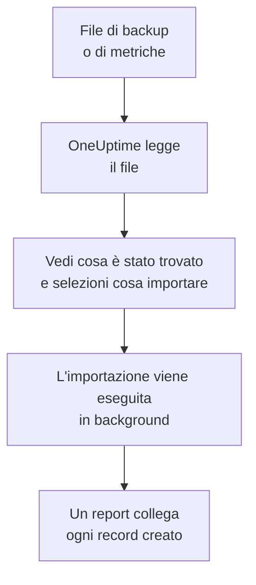

# Migrare da Uptime Kuma

Uptime Kuma gira sulle tue macchine, quindi **Importa da un altro strumento** lo legge da un file invece che con una chiave: il backup che esporta Uptime Kuma 1, o la pagina delle metriche che ogni versione fornisce. OneUptime legge da lì i tuoi monitor, ti mostra cosa ha trovato e crea ciò che selezioni. In Uptime Kuma non cambia nulla.

:::cards
- [Importa i tuoi monitor](#importa-i-tuoi-monitor-di-uptime-kuma): Salva il file, leggilo e seleziona cosa importare.
- [Cosa viene importato](#cosa-viene-importato): Cosa diventa in OneUptime ogni monitor di Uptime Kuma.
- [Completa il passaggio](#completa-il-passaggio): Cosa fare quando l'importazione è finita.
:::

## Come funziona

- **Il file viene letto una sola volta.** OneUptime lo legge durante il caricamento, per trovare i tuoi monitor, e non lo conserva mai. Password, token e chiavi push che contiene non vengono mai copiati.
- **OneUptime non si collega mai a Uptime Kuma.** Tutto arriva dal file. Un file che non è né un backup né una pagina delle metriche di Uptime Kuma viene rifiutato, con il motivo.
- **Non viene creato nulla finché non avvii l'importazione.** L'anteprima mostra, per ogni elemento, se è nuovo, se è già in OneUptime (e viene usato così com'è), se l'ha portato un'importazione precedente o perché non può essere importato.
- **Rieseguirla non crea mai nulla due volte.** OneUptime ricorda cosa ha portato ogni importazione, in base all'ID di Uptime Kuma. Leggi un file più recente dopo aver aggiunto dei monitor e verranno creati solo i nuovi.

## Prima di iniziare

- **Un progetto OneUptime e il diritto di creare ciò che importi.** I proprietari e gli amministratori del progetto possono importare tutto. Anche gli altri ruoli possono eseguire un'importazione e importare i tipi di record che possono creare. Il resto viene mostrato come non importato, con il motivo.
- **Un file di Uptime Kuma.** In Uptime Kuma 1, il backup JSON contiene ogni monitor con le sue impostazioni. Uptime Kuma 2 non ha backup, quindi salva la sua pagina delle metriche: riporta nome, tipo e indirizzo di ogni monitor, ma non ogni quanto viene controllato né cosa cerca.
- **Un metodo di pagamento, su OneUptime Cloud.** I monitor che eseguono controlli vengono addebitati in base all'uso, anche con il piano Free, quindi aggiungine uno in **Impostazioni del progetto** > **Fatturazione** prima dell'importazione. Senza, quei monitor vengono mostrati come non importati.

## Importa i tuoi monitor di Uptime Kuma

:::steps
### Salva il file in Uptime Kuma
In Uptime Kuma 1, vai in **Settings** > **Backup** e seleziona **Export**. In Uptime Kuma 2, aggiungi una chiave in **Settings** > **API Keys**, apri `/metrics` sul tuo Uptime Kuma, accedi senza nome utente e con la chiave come password, e salva la pagina come file di testo.

### Apri la pagina di importazione
In OneUptime, vai in **Impostazioni del progetto** > **Importa da un altro strumento** e seleziona **Uptime Kuma**.

### Leggi il file
In **File di backup o di metriche di Uptime Kuma**, seleziona **Scegli file**, scegli il file che hai salvato e seleziona **Leggi il file**. OneUptime lo legge subito e mostra cosa ha trovato.

### Seleziona cosa importare
L'anteprima elenca ciò che è stato trovato, con una sezione per tipo. Tutto ciò che verrebbe creato parte selezionato, tranne i monitor in pausa in Uptime Kuma, che vengono importati in pausa se li selezioni. Sotto ogni elemento, OneUptime indica cosa non verrà importato esattamente com'era.

### Avvia l'importazione
Seleziona **Avvia importazione**. L'importazione viene eseguita in background: puoi lasciare la pagina, e il report ti aspetta lì.
:::

Il report conta ciò che è stato creato e non importato, ed elenca ogni elemento con un link al record che è diventato, prima gli errori. Le importazioni precedenti sono elencate in **Importazioni precedenti** nella stessa pagina.

## Cosa viene importato

| In Uptime Kuma | In OneUptime | Come |
| --- | --- | --- |
| Monitors | Monitor | Da un backup, ogni monitor diventa un monitor dello stesso tipo, con lo stesso indirizzo, intervallo, timeout e codici di stato considerati attivi. Dalla pagina delle metriche, ognuno viene importato con un controllo ogni cinque minuti: verificali uno per uno dopo l'importazione. |

- **I monitor HTTP(S) e a parola chiave** diventano monitor sito web, o monitor API quando inviano un altro metodo, intestazioni o un corpo JSON, con la parola chiave dove deve stare.
- **I monitor JSON query** diventano monitor API, senza la query: aggiungila come criterio in OneUptime.
- **I monitor ping, porta e DNS** diventano monitor ping, porta e DNS.
- **I monitor push** diventano monitor richieste in arrivo, che vanno giù quando non arriva nessuna richiesta per l'intervallo e i suoi tentativi. Ognuno ha un nuovo indirizzo in OneUptime.
- **I monitor manuali** restano monitor manuali. **I gruppi** sono cartelle, quindi i loro monitor vengono importati singolarmente.
- **La scadenza dei certificati.** Un monitor che avvisa prima della scadenza del certificato riceve anche un monitor certificato SSL, con il suo nome.

Ogni monitor viene controllato dalle sonde del tuo progetto, come uno che crei tu. Un intervallo che OneUptime non offre diventa il più vicino che offre, e un timeout di oltre un minuto diventa un minuto. L'anteprima indica quando uno dei due cambia.

## Cosa non viene importato

- **Lo storico di disponibilità, i tempi di risposta e gli incidenti.** OneUptime inizia i controlli quando l'importazione è finita.
- **Le notifiche.** Scegli chi viene avvisato in OneUptime, come descritto in [Completa il passaggio](#completa-il-passaggio).
- **Le password, e le intestazioni che possono contenere un segreto.** Un monitor che accede, o che invia un'intestazione `Authorization`, di cookie o di token, viene importato senza: aggiungila con un [segreto del monitor](/docs/monitor/monitor-secrets).
- **I monitor invertiti**, che risultano attivi quando il loro controllo fallisce. OneUptime non ha alcun monitor che lo faccia.
- **I monitor Docker, database, server di gioco, MQTT e gli altri senza equivalente in OneUptime.** L'anteprima li nomina uno per uno.
- **Le pagine di stato e la manutenzione.** Crea in OneUptime le pagine di stato che ti servono e mostra lì i monitor importati.

## Limiti

Un'importazione crea al massimo 2.000 record, e al massimo 1.000 monitor. Un file può essere al massimo di 10 MB. Ciò che supera un limite viene mostrato come non importato. Esegui di nuovo l'importazione per portare il resto.

Su OneUptime Cloud, i monitor che eseguono controlli hanno bisogno di un metodo di pagamento, e ciò per cui il tuo piano non ha spazio viene mostrato come non importato, con ciò che serve.

Un'anteprima viene conservata per un giorno. Solo chi ha letto il file può selezionare gli elementi e avviarla. I proprietari e gli amministratori del progetto vedono l'avanzamento e il report di ogni importazione.

## Completa il passaggio

:::steps
### Controlla i tuoi monitor
Apri ciascuno in **Monitor** e controlla i primi risultati. Un monitor heartbeat ha un nuovo indirizzo: fai puntare lì il job che lo chiama.

### Scegli chi viene avvisato
Aggiungi dei proprietari ai tuoi monitor, o una policy di reperibilità in **Reperibilità** > **Policy di reperibilità** agli incidenti che aprono, così le persone giuste sanno quando qualcosa si guasta.

### Disattiva i controlli in Uptime Kuma
Quando OneUptime controlla le stesse cose, mettile in pausa in Uptime Kuma così nessuno viene avvisato due volte.
:::

## Risoluzione dei problemi

:::details Il file è stato rifiutato
OneUptime indica il motivo: un file di oltre 10 MB, uno che non è JSON valido, o uno che non è né un backup né la pagina delle metriche di Uptime Kuma. Esporta di nuovo il backup, oppure salva di nuovo `/metrics` come testo semplice, e sceglilo ancora.
:::

:::details Un monitor viene mostrato come non importato
Indica il motivo: un tipo di monitor che OneUptime non ha, un indirizzo che OneUptime non riesce a leggere, o un progetto senza spazio o senza metodo di pagamento. Un monitor che OneUptime esegue già, con lo stesso nome, tipo e indirizzo, viene usato così com'è.
:::

:::details Alcuni elementi non si possono selezionare
Ognuno indica il motivo: un nome che il progetto ha già, qualcosa che ha portato un'importazione precedente, o un record che non hai il permesso di creare o che il tuo piano non include.
:::

## Passaggi successivi

:::cards
- [Monitor sito web](/docs/monitor/website-monitor): Cosa controlla un monitor sito web, e come.
- [Monitor richieste in arrivo](/docs/monitor/incoming-request-monitor): Come funziona un heartbeat in OneUptime.
- [Migrare da UptimeRobot](/docs/moving-to-oneuptime/uptimerobot): Porta i tuoi controlli da UptimeRobot.
:::
