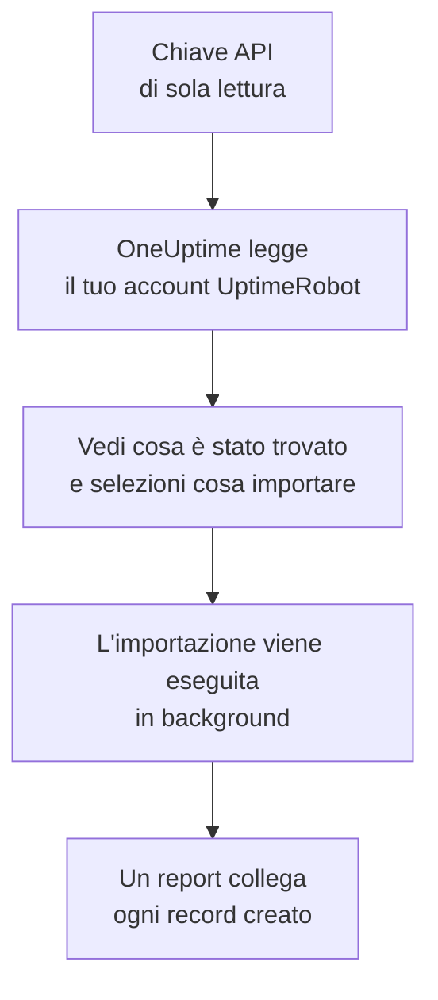

# Migrare da UptimeRobot

**Importa da un altro strumento** porta i tuoi monitor e le tue pagine di stato di UptimeRobot in OneUptime in pochi minuti. Con una chiave API di UptimeRobot di sola lettura, OneUptime legge i tuoi monitor e le pagine di stato pubbliche, ti mostra cosa ha trovato e crea ciò che selezioni. In UptimeRobot non cambia nulla.

:::cards
- [Importa il tuo account](#importa-il-tuo-account-uptimerobot): Crea una chiave, leggi il tuo account e seleziona cosa importare.
- [Cosa viene importato](#cosa-viene-importato): Cosa diventa in OneUptime ogni monitor e pagina di stato di UptimeRobot.
- [Completa il passaggio](#completa-il-passaggio): Cosa fare quando l'importazione è finita.
:::

## Come funziona

- **La chiave viene usata una sola volta.** Viene conservata cifrata mentre OneUptime legge il tuo account ed eliminata appena la lettura finisce, che sia riuscita o no. Non viene mai più mostrata né scritta in un log.
- **OneUptime si limita a leggere.** Chiama solo l'API di UptimeRobot: `api.uptimerobot.com`. Fa una richiesta ogni sei secondi, restando entro le dieci al minuto che UptimeRobot concede a un account Free, quindi un account grande richiede qualche minuto. Quando UptimeRobot gli chiede di rallentare, attende e riprova.
- **Non viene creato nulla finché non avvii l'importazione.** L'anteprima mostra, per ogni elemento, se è nuovo, se è già in OneUptime (e viene usato così com'è), se l'ha portato un'importazione precedente o perché non può essere importato.
- **Rieseguirla non crea mai nulla due volte.** OneUptime ricorda cosa ha portato ogni importazione, in base all'ID di UptimeRobot. Eseguila di nuovo dopo aver aggiunto monitor in UptimeRobot e verranno creati solo i nuovi.

## Prima di iniziare

- **Un progetto OneUptime e il diritto di creare ciò che importi.** I proprietari e gli amministratori del progetto possono importare tutto. Anche gli altri ruoli possono eseguire un'importazione e importare i tipi di record che possono creare. Il resto viene mostrato come non importato, con il motivo.
- **Una chiave API di UptimeRobot.** Basta la Read-only API key: l'importazione non scrive mai in UptimeRobot. Funziona anche la Main API key, ma una chiave di un singolo monitor legge solo quel monitor.
- **Un metodo di pagamento, su OneUptime Cloud.** I monitor che eseguono controlli vengono addebitati in base all'uso, anche con il piano Free, quindi aggiungine uno in **Impostazioni del progetto** > **Fatturazione** prima dell'importazione. Senza, quei monitor vengono mostrati come non importati.

## Importa il tuo account UptimeRobot

:::steps
### Crea una chiave API in UptimeRobot
In UptimeRobot, vai in **Integrations & API** > **API**. Crea una **Read-only API key**, oppure copia quella che hai.

### Apri la pagina di importazione
In OneUptime, vai in **Impostazioni del progetto** > **Importa da un altro strumento** e seleziona **UptimeRobot**.

### Collega UptimeRobot
Incolla la chiave in **Chiave API di UptimeRobot** e seleziona **Leggi il mio account UptimeRobot**. Un account grande richiede qualche minuto, e puoi lasciare la pagina durante la lettura.

### Seleziona cosa importare
L'anteprima elenca ciò che è stato trovato, con una sezione per tipo. Tutto ciò che verrebbe creato parte selezionato, tranne i monitor in pausa in UptimeRobot, che vengono importati in pausa se li selezioni. Sotto ogni elemento, OneUptime indica cosa non verrà importato esattamente com'era. Quando una pagina di stato selezionata mostra un monitor che hai lasciato deselezionato, lo segnala, e **Seleziona anche questi** lo seleziona.

### Avvia l'importazione
Seleziona **Avvia importazione**. L'importazione viene eseguita in background: puoi lasciare la pagina, e il report ti aspetta lì.
:::

Il report conta ciò che è stato creato e non importato, ed elenca ogni elemento con un link al record che è diventato, prima gli errori. Le importazioni precedenti sono elencate in **Importazioni precedenti** nella stessa pagina.

## Cosa viene importato

| In UptimeRobot | In OneUptime | Come |
| --- | --- | --- |
| Monitors | Monitor | Ogni monitor diventa un monitor dello stesso tipo, con lo stesso indirizzo, intervallo e timeout, e gli stessi codici di stato considerati attivi. |
| Public status pages | Pagine di stato | Ogni pagina mostra gli stessi monitor: quelli che nomina, quelli con i suoi tag o tutti, con disponibilità e barre dello storico come li mostrava. Una pagina con password viene importata come privata. |

- **I monitor HTTP(S) e a parola chiave** diventano monitor sito web, o monitor API quando inviano un altro metodo, intestazioni o un corpo JSON. Un monitor a parola chiave va giù quando la parola chiave compare o manca, come in UptimeRobot, e la confronta esattamente, maiuscole comprese.
- **I monitor ping e porta** diventano monitor ping e porta.
- **I monitor heartbeat** diventano monitor richieste in arrivo, che vanno giù quando non arriva nessuna richiesta per l'intervallo e il periodo di tolleranza. Ognuno ha un nuovo indirizzo in OneUptime.
- **I monitor DNS e API** diventano monitor DNS e API.
- **I promemoria di scadenza SSL.** Un monitor che avvisa prima della scadenza del certificato riceve anche un monitor certificato SSL, con il suo nome, che avvisa con gli stessi giorni di anticipo.

Ogni monitor viene controllato dalle sonde del tuo progetto, come uno che crei tu. Un intervallo che OneUptime non offre diventa il più vicino che offre, e un timeout di oltre un minuto diventa un minuto. L'anteprima indica quando uno dei due cambia.

## Cosa non viene importato

- **Lo storico di disponibilità, i tempi di risposta e gli incidenti.** OneUptime inizia i controlli quando l'importazione è finita.
- **I contatti di avviso e le integrazioni.** Scegli chi viene avvisato in OneUptime, come descritto in [Completa il passaggio](#completa-il-passaggio).
- **Le password, e le intestazioni che possono contenere un segreto.** Un monitor che accede, o che invia un'intestazione `Authorization`, di cookie o di token, viene importato senza: aggiungila con un [segreto del monitor](/docs/monitor/monitor-secrets).
- **I monitor UDP, di confronto visivo e di dipendenza.** OneUptime non ha alcun monitor che faccia lo stesso, e l'anteprima li nomina uno per uno.
- **I monitor porta che avvisano mentre la porta è aperta.** Funzionano al contrario dei monitor porta di OneUptime.
- **Le risposte che si aspetta un monitor DNS e le asserzioni di un monitor API.** Aggiungile come criteri in OneUptime.
- **Le finestre di manutenzione.** L'anteprima le conta: pianificale come manutenzione programmata in OneUptime.
- **Il dominio proprio e il branding di una pagina di stato.** In OneUptime, aggiungi il dominio in **Domini personalizzati** e il logo in **Branding**.

## Limiti

Un'importazione crea al massimo 2.000 record: al massimo 1.000 monitor e 50 pagine di stato. Ciò che supera un limite viene mostrato come non importato. Esegui di nuovo l'importazione per portare il resto.

Su OneUptime Cloud, i monitor che eseguono controlli hanno bisogno di un metodo di pagamento, e ciò per cui il tuo piano non ha spazio viene mostrato come non importato, con ciò che serve.

Un'anteprima viene conservata per un giorno. Solo chi ha letto l'account può selezionare gli elementi e avviarla. I proprietari e gli amministratori del progetto vedono l'avanzamento e il report di ogni importazione.

## Completa il passaggio

:::steps
### Controlla i tuoi monitor
Apri ciascuno in **Monitor** e controlla i primi risultati. Un monitor heartbeat ha un nuovo indirizzo: fai puntare lì il job che lo chiama.

### Scegli chi viene avvisato
Aggiungi dei proprietari ai tuoi monitor, o una policy di reperibilità in **Reperibilità** > **Policy di reperibilità** agli incidenti che aprono, così le persone giuste sanno quando qualcosa si guasta.

### Fai puntare l'indirizzo della tua pagina di stato a OneUptime
In **Pagine di stato**, apri la pagina, aggiungi il tuo dominio in **Domini personalizzati**, poi cambia il suo record DNS. I visitatori e gli iscritti arriveranno così alla nuova pagina.

### Disattiva i controlli in UptimeRobot
Quando OneUptime controlla le stesse cose, mettile in pausa in UptimeRobot così nessuno viene avvisato due volte.
:::

## Risoluzione dei problemi

:::details UptimeRobot non ha accettato la chiave API
Verifica di aver copiato la chiave intera e che sia la Read-only o la Main API key dell'account, da **Integrations & API**, non una chiave di un singolo monitor. Poi seleziona **Riprova**.
:::

:::details Un monitor viene mostrato come non importato
Indica il motivo: un tipo di monitor che OneUptime non ha, un indirizzo che OneUptime non riesce a leggere, o un progetto senza spazio o senza metodo di pagamento. Un monitor che OneUptime esegue già, con lo stesso nome, tipo e indirizzo, viene usato così com'è.
:::

:::details Alcuni elementi non si possono selezionare
Ognuno indica il motivo: un nome che il progetto ha già, qualcosa che ha portato un'importazione precedente, o un record che non hai il permesso di creare o che il tuo piano non include.
:::

## Passaggi successivi

:::cards
- [Monitor sito web](/docs/monitor/website-monitor): Cosa controlla un monitor sito web, e come.
- [Monitor richieste in arrivo](/docs/monitor/incoming-request-monitor): Come funziona un heartbeat in OneUptime.
- [Migrare da Pingdom](/docs/moving-to-oneuptime/pingdom): Porta i tuoi controlli da Pingdom.
:::
