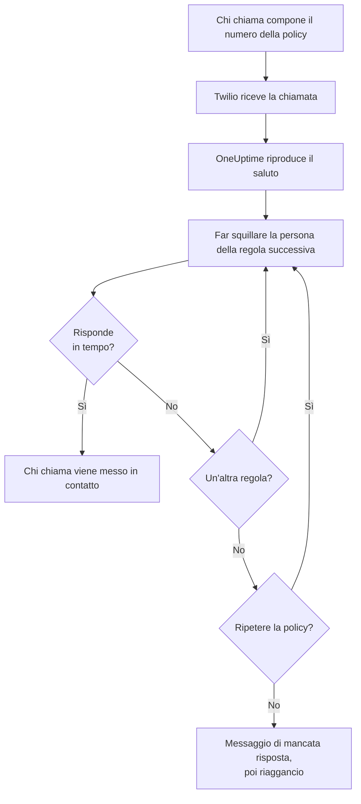
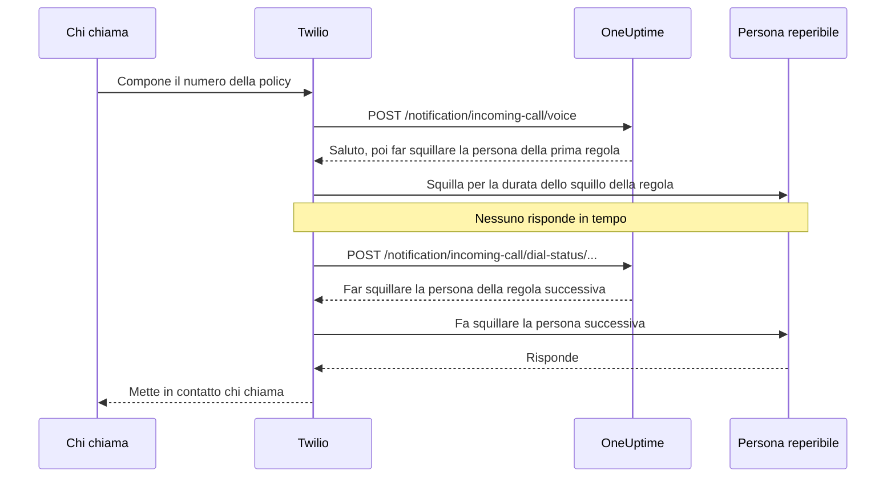

# Politica chiamate in arrivo

Una policy chiamate in entrata dà al tuo team un numero di telefono che raggiunge chi è reperibile. Quando qualcuno lo chiama, OneUptime fa squillare, una dopo l'altra, le persone delle regole di escalation della policy finché qualcuno risponde, e mette in contatto chi chiama. I numeri e le chiamate passano dal tuo account Twilio.

:::cards
- [Configurare una policy](#configurare-una-policy): Dal tuo account Twilio a una chiamata di prova, in sette passaggi.
- [Come viene instradata una chiamata](#come-viene-instradata-una-chiamata): Chi squilla, per quanto tempo e che cosa sente chi chiama.
- [Chiamate perse](#chiamate-perse): Chi viene informato e come reagire in un workflow.
- [Risoluzione dei problemi](#risoluzione-dei-problemi): Chiamate che non arrivano mai o che non raggiungono mai nessuno.
:::

## Prima di iniziare

| Ti serve | Perché |
| --- | --- |
| Un account Twilio, con il suo Account SID e il suo Auth Token | I numeri e le chiamate della policy passano da lì, e Twilio li addebita a quell'account. |
| Il piano **Growth**, su OneUptime Cloud | Un progetto ne ha bisogno per una propria configurazione Twilio. |
| Un server OneUptime raggiungibile da Twilio, se lo ospiti tu | Twilio invia ogni chiamata a `https://<your host>/notification/incoming-call/voice`. |
| **SMS** attivi nel progetto | Il numero di ogni persona viene verificato con un codice inviato via SMS. |
| Un numero verificato per ogni persona | Una regola fa squillare solo chi ha aggiunto e verificato un numero per le chiamate in entrata nel progetto. |

## Configurare una policy

:::steps
### Aggiungi il tuo account Twilio

Vai in **Impostazioni del progetto** > **Notifiche** > **Impostazioni notifiche**. Nella scheda **Configurazione Twilio**, fai clic su **Create Twilio Config** e compila il modulo:

- **Nome** e **Descrizione**: a che cosa serve l'account, ad esempio «Linea di supporto».
- **Twilio Account SID**: dalla console di Twilio. Inizia con `AC`.
- **Twilio Auth Token**: dalla console di Twilio.
- **Numero di telefono principale Twilio**: un numero di quell'account, per gli SMS e le chiamate che invia.
- **Numeri di telefono secondari Twilio**: facoltativi. Numeri che inviano al posto di quello principale ai destinatari del loro paese.
- **Imposta come predefinito del progetto**: attivo per la prima configurazione Twilio del progetto, così anche gli SMS e le chiamate ai membri del progetto passano da questo account. Disattivalo se l'account serve solo per le chiamate in entrata.

### Crea la policy

Vai in **Reperibilità** > **Policy chiamate in entrata** e fai clic su **Crea: Policy chiamate in entrata**. Dalle un **Nome**, ad esempio «Linea di supporto», e se vuoi una **Descrizione** e delle **Etichette**. Poi aprila dall'elenco.

### Scegli l'account Twilio

La **Panoramica** della policy mostra una scheda **Configurazione** con tre passaggi numerati. Nel primo, fai clic su **Seleziona**, scegli l'account in **Configurazione Twilio** e fai clic su **Salva**.

### Aggiungi un numero di telefono

Nel secondo passaggio, fai clic su **Add Phone Number**. Scegli **Use Existing Phone Number** per usare un numero che il tuo account Twilio ha già, oppure **Reserve New Phone Number** per ottenerne uno nuovo. OneUptime fa puntare il numero verso di sé, quindi in Twilio non c'è nulla da configurare. Vedi [Numeri di telefono](#numeri-di-telefono).

### Aggiungi le regole di escalation

Nel terzo passaggio, fai clic su **Gestisci regole**. Aggiungi una regola per ogni pianificazione di reperibilità o persona da far squillare, nell'ordine in cui devono squillare. Vedi [Regole di escalation](#regole-di-escalation).

### Verifica il numero di ogni persona

Ogni persona che una regola può far squillare aggiunge e verifica il proprio numero per le chiamate in entrata. Vedi [Numeri delle persone reperibili](#numeri-delle-persone-reperibili).

### Chiama il numero

Quando i tre passaggi sono completati, la scheda diventa **Phone Numbers & Twilio Configuration**. Chiama il numero da un telefono qualsiasi, poi apri i **Registri chiamate** della policy per vedere chi ha squillato.
:::

## Come viene instradata una chiamata

1. Twilio invia la chiamata a OneUptime, che legge il **Messaggio di benvenuto** della policy.
2. OneUptime fa squillare la persona indicata dalla prima regola di escalation: quella persona, oppure chi è reperibile in quel momento nella pianificazione di reperibilità della regola, sostituzioni utente comprese. Il suo telefono mostra il numero della policy come chiamante.
3. Se risponde entro la **Durata dello squillo** della regola, chi chiama viene messo in contatto, e il registro chiamate annota chi ha risposto.
4. Altrimenti chi chiama sente «Connecting you to the next available engineer.» e squilla la persona della regola successiva.
5. Dopo l'ultima regola, la policy ricomincia dalla prima se **Ripeti il criterio se nessuno risponde** è attivo, tante volte quante indica **Numero di ripetizioni del criterio**. Altrimenti chi chiama sente il **Messaggio di mancata risposta**, e la chiamata termina.

Una regola viene saltata, senza far squillare nessuno, quando in quel momento non c'è nessuno da chiamare per essa: la sua pianificazione non ha nessuno reperibile, la persona non ha un numero verificato per le chiamate in entrata in questo progetto, oppure non è più membro del progetto. Quando nessuna regola ha qualcuno da far squillare, chi chiama sente il **Messaggio di nessuno disponibile**. Una policy disattivata risponde a ogni chiamata con «Sorry, this service is currently disabled.» e riaggancia.

OneUptime verifica la firma di Twilio su ogni richiesta con l'Auth Token della configurazione Twilio, e rifiuta una richiesta che non riesce a verificare.

> [!TIP]
> Salva il numero della policy come contatto sul telefono, ad esempio «Linea di supporto», così riconosci una chiamata instradata quando squilla.

## Regole di escalation

Le regole di escalation decidono chi squilla quando qualcuno chiama il numero della policy, dall'alto verso il basso dell'elenco. Apri la policy, scegli **Regole di escalation** nel suo menu laterale e fai clic su **Aggiungi regola di escalation**. Una regola è un solo passaggio breve:

- **Chi chiamare**: una pianificazione di reperibilità o una sola persona. Una pianificazione fa squillare chi è reperibile in essa quando arriva la chiamata. Le persone sono i membri del tuo progetto.
- **Durata dello squillo (in secondi)**: per quanto squilla il loro telefono prima che la chiamata passi alla regola successiva. Parte da 20 secondi, e Twilio accetta da 5 a 600.
- **Nome** e **Descrizione** sono facoltativi, in **Altri campi**. Una regola senza nome viene elencata in base alla sua posizione: **Level 1**, **Level 2**.

Le regole vengono chiamate dall'alto verso il basso dell'elenco, e una nuova regola viene aggiunta in fondo. Per cambiare l'ordine, trascina una regola tenendola per la maniglia in alto a sinistra. Da tastiera, porta il focus sulla maniglia, premi Spazio, spostala con le frecce e premi di nuovo Spazio.

> [!WARNING]
> **Attenzione alla segreteria**: mantieni la **Durata dello squillo** più breve del tempo che il telefono della persona impiega a inviare una chiamata senza risposta alla segreteria. Se la segreteria risponde per prima, chi chiama viene collegato a essa e la chiamata non passa alla regola successiva. Twilio aggiunge qualche secondo suo a ogni squillo. Per questo una nuova regola parte da 20 secondi. Le regole aggiunte quando il valore predefinito era 30 secondi mantengono i loro 30: se le loro chiamate finiscono in segreteria, abbassa la **Durata dello squillo** di quelle regole.

Ad esempio, tre regole che provano due rotazioni e poi un responsabile:

| Livello | Chi chiamare | Durata dello squillo |
| --- | --- | --- |
| Level 1 | Pianificazione di reperibilità primaria | 20 secondi |
| Level 2 | Pianificazione di reperibilità secondaria | 20 secondi |
| Level 3 | Responsabile tecnico (una persona) | 20 secondi |

## Numeri di telefono

Una policy può avere più numeri, e ognuno fa squillare le stesse regole. Ogni numero appartiene a una sola policy. Aggiungili con **Add Phone Number** nella **Panoramica** della policy:

:::tabs
@tab Usare un numero che hai già
1. Fai clic su **Add Phone Number**, poi su **Use Existing Phone Number**. OneUptime elenca i numeri dell'account Twilio della policy.
2. Fai clic su **Seleziona** accanto al numero, poi su **Assegna numero**.

Un numero le cui chiamate vanno già altrove lo indica con «Currently has a webhook configured». Assegnarlo invia invece le sue chiamate a OneUptime.
@tab Prenotare un numero nuovo
1. Fai clic su **Add Phone Number**, poi su **Reserve New Phone Number** e **Cerca numeri**.
2. Scegli un **Paese**. Se vuoi, compila **Prefisso (facoltativo)**, ad esempio 415, o **Contiene (facoltativo)** con le cifre che il numero deve contenere. Fai clic su **Cerca**: vengono elencati fino a 10 numeri locali.
3. Fai clic su **Prenota** accanto a un numero e conferma con **Prenota**. Twilio addebita il numero sul tuo account Twilio.
:::

OneUptime imposta il webhook vocale del numero su `https://<your host>/notification/incoming-call/voice`, costruito da `HOST` e `HTTP_PROTOCOL` su un'installazione self-hosted. Per spostare una policy su un altro account Twilio, rilascia prima i suoi numeri: l'account può cambiare solo finché la policy non ne ha.

Per rilasciare un numero, fai clic su **Rilascia** accanto a esso e conferma con **Rilascia numero**.

> [!CAUTION]
> Rilasciare un numero lo restituisce a Twilio, anche un numero portato con **Use Existing Phone Number**, e potresti non riaverlo. Eliminare una policy, o la configurazione Twilio che usa, rilascia anche i suoi numeri.

## Numeri delle persone reperibili

Una regola fa squillare una persona sul numero che ha verificato per le chiamate in entrata in questo progetto, e salta chi non ne ha uno. Ogni persona aggiunge il proprio:

:::steps
1. Apri **Impostazioni utente** > **Policy chiamate in entrata** > **Numeri di telefono in entrata**. **Policy chiamate in entrata** è una sezione del menu laterale che parte chiusa.
2. Nella scheda **Numeri di telefono per l'instradamento delle chiamate in entrata**, fai clic su **Aggiungi: Numero di telefono per l'instradamento delle chiamate in entrata** e inserisci il numero con il prefisso internazionale, ad esempio `+15551234567`.
3. Inserisci il codice a 6 cifre che OneUptime invia al numero via SMS in **Codice di verifica**, e fai clic su **Verifica**. **Send a new code** ne invia un altro.
:::

Ogni persona può avere un numero verificato per progetto. Per cambiarlo, elimina prima il vecchio numero. Questi numeri sono separati dai numeri di telefono in **Metodi di notifica**, usati dagli avvisi di reperibilità.

I numeri per le chiamate in entrata vengono verificati via SMS, quindi gli **SMS** devono prima essere attivi per il progetto. Un proprietario del progetto o qualcuno con il ruolo **Billing Admin** o il permesso **Manage Billing** li attiva nella scheda **Canali di notifica** di **Impostazioni del progetto > Notifiche > Impostazioni notifiche**.

## Messaggi vocali e impostazioni della policy

Apri la policy e scegli **Impostazioni** in **Avanzato** nel suo menu laterale. **Edit Messages** nella scheda **Messaggi vocali** cambia ciò che sentono i chiamanti; **Edit Policy Settings** nella scheda **Impostazioni del criterio** cambia il resto.

| Impostazione | Che cosa fa | Per una nuova policy |
| --- | --- | --- |
| **Messaggio di benvenuto** | Letto quando la chiamata viene presa, prima che squilli la prima persona. | "Please wait while we connect you to the on-call engineer." |
| **Messaggio di mancata risposta** | Letto quando tutte le regole sono state provate e nessuno ha risposto. | "No one is available. Please try again later." |
| **Messaggio di nessuno disponibile** | Letto quando nessuna regola ha qualcuno da far squillare. | "We are sorry, but no on-call engineer is currently available. Please try again later or contact support." |
| **Abilitato** | Una policy disattivata rifiuta tutte le chiamate. | Attivo |
| **Ripeti il criterio se nessuno risponde** | Dopo l'ultima regola, ricomincia dalla prima. | Disattivo |
| **Numero di ripetizioni del criterio** | Quante volte ricominciare. | 1 |

Twilio legge i messaggi con una voce sintetica, quindi scrivili come vuoi che suonino.

## Registri chiamate

Ogni chiamata compare nella pagina **Registri chiamate** della policy, in **Registri** nel suo menu laterale: il **Chiamante**, il **Number Called**, il suo **Stato**, chi ha risposto (**Risposto da**), la **Durata** e quando è iniziata (**Iniziato il**). Fai clic su **View Timeline** su una chiamata per vedere la sua **Cronologia chiamata**: ogni persona che ha squillato, su quale numero e come è finito ogni tentativo.

| Stato | Che cosa è successo |
| --- | --- |
| **Initiated**, **Ringing**, **Escalated** | La chiamata è ancora in corso: è arrivata, un telefono sta squillando o è passata a una regola successiva. |
| **Completato** | Qualcuno ha risposto e chi chiamava è stato messo in contatto. |
| **Nessuna risposta** | Sono state provate tutte le regole di escalation e nessuno ha risposto. Chi chiamava ha sentito il tuo **Messaggio di mancata risposta**. |
| **Caller Hung Up** | Chi chiamava ha riagganciato mentre il telefono di una persona squillava. |
| **Non riuscito** | Non è stato possibile far squillare nessuno: nessuna regola di escalation aveva una persona reperibile con un numero verificato per le chiamate in entrata (chi chiamava ha sentito il tuo **Messaggio di nessuno disponibile**), oppure la policy è disattivata. |

## Chiamate perse

Una chiamata è persa quando termina senza raggiungere nessuno: il suo stato è **Nessuna risposta**, **Caller Hung Up** o **Non riuscito**.

### Chi viene avvisato

Quando una chiamata viene persa, OneUptime avvisa i proprietari della policy: gli utenti e i membri dei team aggiunti nella pagina **Proprietari** della policy. Se la policy non ha proprietari, vengono avvisati invece i proprietari del progetto.

L'avviso dice chi ha chiamato, quale numero ha composto, perché nessuno ha risposto, chi ha squillato e come è finito ogni tentativo. Collega la chiamata nel registro chiamate.

I proprietari ricevono un'email per impostazione predefinita. Ognuno può scegliere altri canali (SMS, chiamata, push e altro) o disattivarlo in **Impostazioni utente** > **Impostazioni notifiche**, in **Reperibilità** > **Policy chiamate in entrata** > **Chiamata persa**.

### Reagire alle chiamate perse in un workflow

I registri delle chiamate in entrata sono disponibili come trigger dei workflow:

- **On Create Incoming Call Log** si attiva quando arriva una chiamata.
- **On Update Incoming Call Log** si attiva mentre la chiamata procede. L'aggiornamento che imposta **Ended At** è la fine della chiamata.

Per agire solo sulle chiamate perse, ad esempio per pubblicarle in Slack o Microsoft Teams o aprire un ticket:

:::steps
1. Aggiungi il trigger **On Update Incoming Call Log**. Imposta **Listen on** su **Ended At** e seleziona i campi da usare, come **Status**, **Caller Phone Number** e **Routing Phone Number**.
2. Aggiungi un passaggio **If / Else**. Controlla lo **Status** del trigger, con il confronto **is not equal to** e `Completed`.
3. Collega i tuoi passaggi alla porta **Yes**.
:::

Un workflow può leggere i registri chiamate con **Find One** e **Find Many**, ma non può crearli né modificarli.

## Chi può aggiungere e rilasciare numeri di telefono

I numeri di telefono di una policy seguono gli stessi ruoli della policy stessa:

- **Cercare numeri** - cercare su Twilio un numero da prenotare, o elencare i numeri che il tuo account Twilio ha già - richiede il permesso di leggere le policy chiamate in entrata e di leggere le configurazioni di chiamate e SMS, perché legge il tuo account Twilio tramite una di esse. **Project Owner**, **Project Admin**, **Project Member**, **Viewer**, **Settings Admin**, **Settings Member** e **Settings Viewer** li hanno entrambi. In un ruolo personalizzato, sono **Read Incoming Call Policy** e **Read Call and SMS**.
- **Prenotare un numero, usarne uno esistente e rilasciarne uno** richiedono il permesso di modificare le policy chiamate in entrata: **Project Owner**, **Project Admin**, **Project Member**, **Settings Admin** e **Settings Member**, oppure **Edit Incoming Call Policy** in un ruolo personalizzato. Cambiano i numeri di una policy che puoi modificare: con un ruolo limitato ad alcune etichette, le policy che hanno quelle etichette.

Un blocco di team senza etichette su uno di questi permessi lo toglie. Per chiunque altro, **Add Phone Number** e **Rilascia** restano nella pagina, bloccati, e il loro suggerimento dice che cosa serve. L'API rifiuta la richiesta con una frase che dice che cosa serve: "Looking up phone numbers needs permission to read incoming call policies and call and SMS settings." oppure "Adding or releasing a phone number needs permission to edit incoming call policies." Prenotare un numero viene addebitato sul tuo account Twilio, non sul saldo di OneUptime, quindi non richiede alcun permesso di fatturazione.

## Creare policy con l'API o Terraform

| Risorsa | Route dell'API |
| --- | --- |
| Policy chiamate in entrata | `/api/incoming-call-policy` |
| Le loro regole di escalation | `/api/incoming-call-policy-escalation-rule` |
| I loro numeri di telefono, sola lettura | `/api/incoming-call-policy-phone-number` |
| Registri chiamate, sola lettura | `/api/incoming-call-log` |

Una regola creata tramite l'API senza `escalateAfterSeconds` squilla per 20 secondi, come una che Terraform crea senza `escalate_after_seconds`.

### Impostazioni di una regola di escalation

| Impostazione | Campo dell'API | Che cosa contiene |
| --- | --- | --- |
| Chi chiamare | `onCallDutyPolicyScheduleId` o `userId` | Uno dei due, mai entrambi: la pianificazione di cui squilla la persona reperibile, oppure la persona. |
| Durata dello squillo (in secondi) | `escalateAfterSeconds` | Per quanto squilla il telefono prima che la chiamata prosegua (predefinito: 20; da 5 a 600). |
| Nome e Descrizione | `name`, `description` | Facoltativi. Una regola senza nome viene elencata come Level 1, Level 2 e così via, in base alla sua posizione. |
| Ordine | `order` | Dove si trova la regola nell'elenco: le regole vengono chiamate dall'alto verso il basso. Una nuova regola senza ordine va in fondo. |

## Risoluzione dei problemi

:::details Le chiamate non arrivano a OneUptime
- Nella console di Twilio, apri il numero: **A call comes in** deve essere il webhook `https://<your host>/notification/incoming-call/voice`, con HTTP POST. OneUptime lo imposta quando il numero viene aggiunto, da `HOST` e `HTTP_PROTOCOL`. Se nel frattempo sono cambiati, correggi il webhook in Twilio.
- Un OneUptime self-hosted deve essere raggiungibile da Internet via https. Il registro chiamate del numero nella console di Twilio, e il **Debugger** di Twilio, mostrano che cosa ha risposto OneUptime.
- Una risposta `403` significa che la firma della richiesta non è risultata valida. Verifica che la configurazione Twilio contenga l'attuale **Twilio Auth Token** dell'account, e che un proxy davanti a OneUptime inoltri l'host e lo schema chiamati da Twilio (`X-Forwarded-Host` e `X-Forwarded-Proto`).
:::

:::details La chiamata viene presa, ma non squilla nessuno
Il registro chiamate indica **Non riuscito**. Verifica che la policy sia **Abilitato**, che la pianificazione di reperibilità di ogni regola abbia qualcuno reperibile in questo momento e che le persone che le regole fanno squillare abbiano un numero verificato in **Impostazioni utente** > **Policy chiamate in entrata** > **Numeri di telefono in entrata**, in questo progetto. Le regole fanno squillare solo membri del progetto.
:::

:::details Le chiamate finiscono in segreteria
Se le chiamate finiscono nella segreteria di una persona, imposta la **Durata dello squillo** della regola sotto il tempo che il suo telefono impiega a passare alla segreteria. Una segreteria che risponde conta come risposta, e la chiamata si ferma lì.
:::

:::details Non è possibile prenotare un numero nuovo
In molti paesi Twilio richiede un regulatory bundle approvato prima di vendere numeri locali, e alcuni numeri richiedono un saldo Twilio positivo. Configuralo nella console di Twilio, oppure ottieni lì il numero e aggiungilo con **Use Existing Phone Number**.
:::

:::details Non è possibile cambiare l'account Twilio della policy
L'account può cambiare solo finché la policy non ha numeri di telefono: la pagina dice «Remove all phone numbers to change». Rilasciare i numeri li restituisce a Twilio, quindi pianifica il cambio prima.
:::

:::details Il codice per il numero di una persona non arriva
Gli SMS devono essere attivi per il progetto. Su OneUptime Cloud, un progetto senza una propria configurazione Twilio predefinita paga gli SMS con il suo saldo, che deve superare 1 USD. I codici possono impiegare un minuto ad arrivare; fai clic su **Send a new code** per inviarne un altro, e **Impostazioni del progetto** > **Notifiche** > **Registri di notifica** mostra che cosa gli è successo.
:::

## Passaggi successivi

:::cards
- [Regole di escalation](/docs/on-call/escalation-rules): Come una policy di reperibilità avvisa le persone, livello per livello.
- [Pianificazioni di reperibilità](/docs/on-call/schedules): Costruisci le rotazioni che le tue regole fanno squillare.
- [Workflow](/docs/workflows/index): Reagisci alle chiamate perse: pubblicale in un canale o apri un ticket.
- [Integrazione SMS e voce di Twilio](/docs/self-hosted/twilio-integration): Configura Twilio per un'installazione self-hosted.
:::
