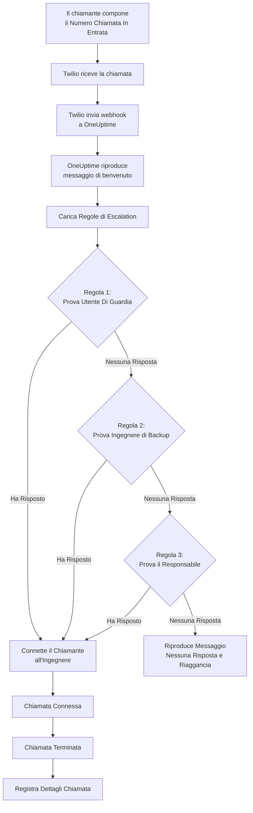
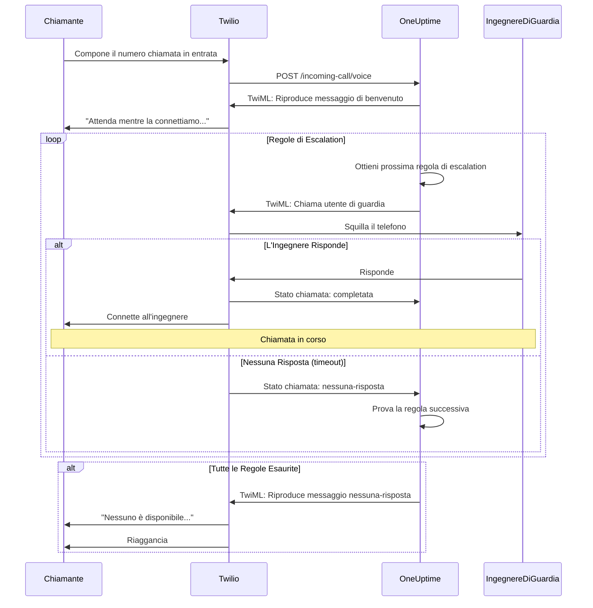
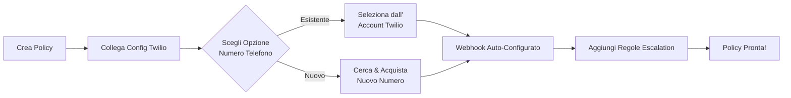
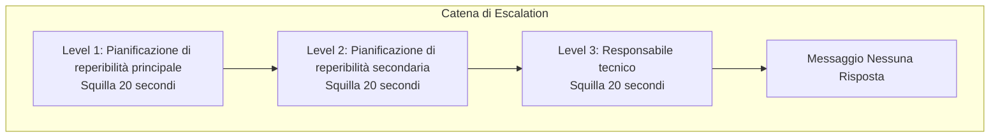
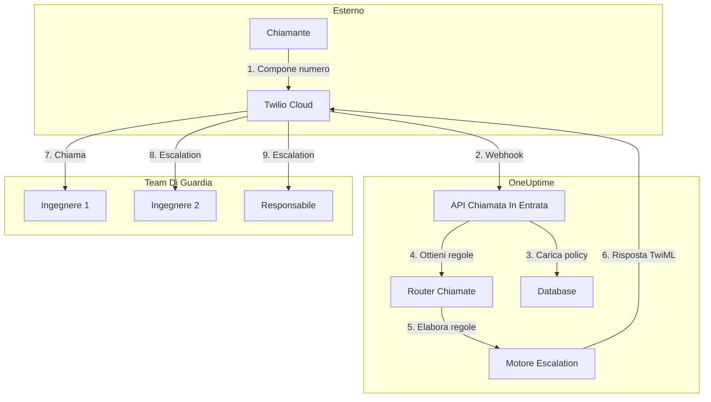

# Policy di Chiamata In Entrata (Integrazione Twilio)

Le Policy di Chiamata In Entrata consentono ai chiamanti esterni di raggiungere i propri ingegneri di guardia componendo un numero di telefono dedicato. Quando qualcuno chiama, OneUptime instrada la chiamata attraverso le regole di escalation configurate finché un ingegnere non risponde.

## Come Funziona

## Flusso di Instradamento Chiamata

## Prerequisiti

- Un account Twilio - Crearne uno su [https://www.twilio.com](https://www.twilio.com)
- Il proprio Twilio Account SID e Auth Token
- Accesso alla propria istanza self-hosted di OneUptime

## Panoramica

La funzionalità Policy di Chiamata In Entrata funziona:

1. Ricevendo le chiamate in entrata su un numero di telefono Twilio
2. Riproducendo un messaggio di benvenuto personalizzabile
3. Instradando la chiamata attraverso le regole di escalation (pianificazioni di reperibilità o persone)
4. Connettendo il chiamante al primo ingegnere di guardia disponibile
5. Escalando alla regola successiva se nessuno risponde

Poiché si ospita OneUptime autonomamente, sarà necessario configurare il proprio account Twilio. Questo fornisce il pieno controllo sui propri numeri di telefono e sulla fatturazione.

## Fase 1: Creare un Account Twilio

1. Accedere a [https://www.twilio.com](https://www.twilio.com) e registrarsi
2. Completare il processo di verifica
3. Annotare il proprio **Account SID** e **Auth Token** dalla dashboard della Console Twilio

## Fase 2: Configurare la Config Chiamata/SMS in OneUptime

1. Accedere al Dashboard di OneUptime
2. Accedere a **Impostazioni del progetto** > **Notifiche** > **Impostazioni notifiche**
3. In **Configurazione Twilio**, fare clic su **Create Twilio Config**
4. Compilare i seguenti campi:
   - **Nome**: Un nome descrittivo (ad es. "Config Twilio Produzione")
   - **Descrizione**: Descrizione opzionale
   - **Twilio Account SID**: Il proprio Twilio Account SID (inizia con `AC`)
   - **Twilio Auth Token**: Il proprio Twilio Auth Token
   - **Numero di telefono principale Twilio**: Un numero di telefono dal proprio account Twilio per le chiamate in uscita
   - **Imposta come predefinito del progetto**: attivo per la prima configurazione Twilio del progetto, quindi anche gli SMS e le chiamate ai membri del progetto passano da questo account. Disattivarlo se questo account serve solo per le chiamate in arrivo.
5. Fare clic su **Salva**

## Fase 3: Creare una Policy di Chiamata In Entrata

1. Accedere a **Reperibilità** > **Policy chiamate in entrata**
2. Fare clic su **Crea Policy Chiamata In Entrata**
3. Compilare i seguenti campi:
   - **Nome**: Un nome descrittivo (ad es. "Hotline Supporto")
   - **Descrizione**: Descrizione opzionale
4. Fare clic su **Salva**

## Fase 4: Collegare la Configurazione Twilio alla Policy

1. Aprire la Policy di Chiamata In Entrata appena creata
2. Nella scheda **Instradamento Numero Telefono**, trovare **Fase 2: Collega Configurazione Twilio**
3. Fare clic su **Seleziona Config Twilio** e scegliere la configurazione creata nella Fase 2
4. Salvare la selezione

## Fase 5: Configurare un Numero di Telefono

Esistono due opzioni per configurare un numero di telefono:

### Opzione A: Usare un Numero Twilio Esistente

Se si hanno già numeri di telefono nel proprio account Twilio:

1. Nella scheda **Numero di telefono**, fare clic su **Usa Numero Esistente**
2. OneUptime recupererà tutti i numeri di telefono dall'account Twilio
3. Selezionare il numero di telefono da usare
4. Fare clic su **Usa Questo** per assegnarlo alla policy

> **Nota**: Se il numero di telefono ha già un webhook configurato, verrà aggiornato per puntare a OneUptime.

### Opzione B: Acquistare un Nuovo Numero di Telefono

Per acquistare un nuovo numero di telefono direttamente da OneUptime:

1. Nella scheda **Numero di telefono**, fare clic su **Acquista Nuovo Numero**
2. Selezionare un **Paese** dal menu a discesa
3. Inserire opzionalmente un **Prefisso** (ad es. 02 per Milano)
4. Inserire opzionalmente le cifre che il numero deve **Contenere**
5. Fare clic su **Cerca** per trovare i numeri disponibili
6. Selezionare un numero di telefono dai risultati
7. Fare clic su **Acquista** per comprare il numero

Il numero di telefono verrà acquistato dall'account Twilio e il webhook verrà **configurato automaticamente** — nessuna configurazione manuale necessaria!

## Fase 6: Configurare le Regole di Escalation

Le regole di escalation decidono chi viene chiamato quando qualcuno compone il numero della policy, dall'alto verso il basso nell'elenco:

1. Aprire la propria Policy di Chiamata In Entrata
2. Andare alla scheda **Regole di escalation**
3. Fare clic su **Aggiungi regola di escalation**
4. Compilare la regola. È un solo passaggio:
   - **Chi chiamare**: una pianificazione di reperibilità o una persona. Una pianificazione fa squillare il telefono di chi è reperibile in essa quando arriva la chiamata. Le persone sono i membri del progetto.
   - **Durata dello squillo (in secondi)**: per quanto tempo squilla il loro telefono prima che la chiamata passi alla regola successiva. Parte da 20 secondi, e Twilio accetta da 5 a 600.
   - **Nome** e **Descrizione** sono facoltativi, sotto **Altri campi**. Una regola senza nome viene mostrata in base alla sua posizione nell'elenco: **Level 1**, **Level 2**.
5. Salvarla e aggiungere una regola per ogni pianificazione o persona da provare dopo

Le regole vengono chiamate dall'alto verso il basso nell'elenco, e una nuova regola viene aggiunta in fondo. Per cambiare l'ordine, trascinare una regola dalla maniglia in alto a sinistra; da tastiera, mettere a fuoco la maniglia, premere Spazio, spostarla con i tasti freccia e premere di nuovo Spazio.

> **Attenzione alla segreteria**: mantenere la **Durata dello squillo** più breve del tempo dopo cui il telefono della persona invia una chiamata senza risposta alla segreteria. Se risponde prima la segreteria, chi chiama viene collegato a essa e la chiamata non passa alla regola successiva. Twilio aggiunge qualche secondo a ogni squillo. Per questo una nuova regola parte da 20 secondi. Le regole aggiunte quando il valore predefinito era 30 secondi mantengono i loro 30: se le loro chiamate finiscono in segreteria, ridurre la **Durata dello squillo** di quelle regole.

### Esempio di Regola di Escalation

| Livello | Chi chiamare                              | Durata dello squillo |
| ------- | ----------------------------------------- | -------------------- |
| Level 1 | Pianificazione di reperibilità principale | 20 secondi           |
| Level 2 | Pianificazione di reperibilità secondaria | 20 secondi           |
| Level 3 | Responsabile tecnico (una persona)        | 20 secondi           |

## Fase 7: Configurare i Messaggi Vocali (Opzionale)

Personalizzare i messaggi che i chiamanti sentono:

1. Aprire la Policy di Chiamata In Entrata
2. Accedere a **Impostazioni**
3. Configurare:
   - **Messaggio di benvenuto**: Riprodotto quando la chiamata viene risposta
   - **Messaggio di mancata risposta**: Riprodotto quando tutte le regole di escalation falliscono
   - **Messaggio di nessuno disponibile**: Riprodotto quando nessuno è di guardia

## Opzioni di Configurazione

### Impostazioni Policy

| Impostazione                      | Descrizione                                                | Predefinito                                                                  |
| --------------------------------- | ---------------------------------------------------------- | ---------------------------------------------------------------------------- |
| Messaggio di Benvenuto            | Messaggio TTS riprodotto quando la chiamata viene risposta | "Attendi mentre ti mettiamo in contatto con il tecnico reperibile."          |
| Messaggio Nessuna Risposta        | Messaggio quando tutte le regole di escalation falliscono  | "Nessuno è disponibile. Riprova più tardi."                                  |
| Messaggio Nessuno Disponibile     | Messaggio quando nessuno è di guardia                      | "Siamo spiacenti, ma al momento non è disponibile alcun tecnico reperibile." |
| Ripeti Policy Se Nessuno Risponde | Ricominciare dalla prima regola se tutte falliscono        | Disabilitato                                                                 |
| Volte Ripetizione Policy          | Numero massimo di tentativi di ripetizione                 | 1                                                                            |

### Impostazioni Regola Escalation

| Impostazione                      | Descrizione                                                                                                                                                                       |
| --------------------------------- | --------------------------------------------------------------------------------------------------------------------------------------------------------------------------------- |
| Chi chiamare                      | Una pianificazione di reperibilità, che chiama chi è reperibile in essa, o una persona. Ogni regola chiama una delle due                                                          |
| Durata dello squillo (in secondi) | Per quanto tempo squilla il telefono prima che la chiamata passi alla regola successiva (predefinito: 20; da 5 a 600)                                                            |
| Nome e Descrizione                | Facoltativi, sotto Altri campi. Una regola senza nome viene mostrata come Level 1, Level 2 e così via, in base alla sua posizione nell'elenco                                       |
| Ordine                            | La posizione della regola nell'elenco: le regole vengono chiamate dall'alto verso il basso. Si imposta trascinando le regole; tramite l'API, una nuova regola senza ordine va in fondo |

Tramite l'API, una regola imposta `onCallDutyPolicyScheduleId` o `userId` (uno dei due, mai entrambi) e `escalateAfterSeconds`: la durata dello squillo, 20 se omessa.

## Visualizzazione dei Log delle Chiamate

Per visualizzare la cronologia delle chiamate in entrata:

1. Accedere a **Reperibilità** > **Policy chiamate in entrata**
2. Fare clic sulla propria policy
3. Accedere alla scheda **Registri chiamate**

I log mostrano:

- Numero di telefono del chiamante
- Stato della chiamata (Completata, Nessuna Risposta, Fallita, ecc.)
- Chi ha risposto alla chiamata
- Durata della chiamata
- Timestamp

## Configurazione del Numero di Telefono degli Utenti

Affinché gli utenti possano ricevere chiamate in entrata, devono avere un numero di telefono verificato:

1. Gli utenti accedono a **Impostazioni utente** > **Metodi di notifica**
2. Aggiungono un numero di telefono sotto **Numeri Chiamata In Entrata**
3. Verificano il numero di telefono tramite codice SMS

Solo gli utenti con numeri di telefono verificati possono essere chiamati attraverso le regole di escalation.

## Rilascio di un Numero di Telefono

Se non si ha più bisogno di un numero di telefono:

1. Aprire la Policy di Chiamata In Entrata
2. Nella scheda **Numero di telefono**, fare clic su **Rilascia numero**
3. Confermare il rilascio

> **Attenzione**: I numeri rilasciati vengono restituiti a Twilio e potrebbero non essere disponibili per il riacquisto.

## Risoluzione dei Problemi

### Le chiamate non vengono ricevute

- Verificare che la configurazione Twilio sia correttamente collegata alla policy
- Verificare che la propria istanza OneUptime sia accessibile da Internet
- Verificare che Twilio Account SID e Auth Token siano corretti
- Controllare la Console Twilio per i log degli errori

### Le chiamate non si connettono agli ingegneri

- Verificare che gli utenti abbiano numeri di telefono verificati nelle impostazioni di notifica
- Verificare che le regole di escalation siano configurate correttamente
- Assicurarsi che le pianificazioni di guardia abbiano utenti assegnati per l'orario corrente
- Verificare che la policy sia abilitata
- Se le chiamate finiscono nella segreteria di un ingegnere, impostare la **Durata dello squillo** della regola al di sotto del tempo dopo cui il suo telefono passa alla segreteria

### Problemi di qualità audio

- Assicurarsi che il server abbia una connessione internet stabile
- Controllare la pagina di stato di Twilio per eventuali problemi in corso
- Verificare che i numeri di telefono siano nel formato corretto (formato E.164: +390276543210)

## Considerazioni sulla Sicurezza

- Mantenere il proprio Twilio Auth Token sicuro e non esporlo pubblicamente
- Usare HTTPS per la propria istanza OneUptime
- OneUptime valida le firme dei webhook per garantire che le richieste provengano da Twilio
- Considerare di limitare i numeri di telefono che possono chiamare le proprie policy di chiamata in entrata

## Panoramica dell'Architettura

## Supporto

Per problemi con la funzionalità Policy di Chiamata In Entrata, si prega di:

1. Controllare la Console Twilio per i log degli errori
2. Esaminare i log del server OneUptime
3. Contattare il supporto all'indirizzo [hello@oneuptime.com](mailto:hello@oneuptime.com)
