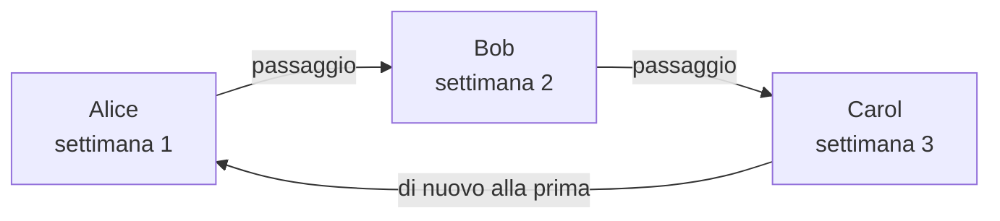

# Pianificazioni di reperibilità

Una pianificazione di reperibilità decide chi è reperibile in ogni momento. Le persone vi si alternano: ognuna è reperibile per un periodo, poi subentra la successiva. Aggiungi una pianificazione alle regole di escalation di una policy di reperibilità, e la policy avvisa chi è reperibile in essa quando si attiva quel livello.

> [!NOTE]
> Su OneUptime Cloud, le pianificazioni di reperibilità fanno parte del piano **Growth** e superiori. Una pianificazione che un progetto ha ancora continua ad avvisare le persone che contiene, tramite le regole di escalation che la nominano, anche dopo la fine di una prova Growth o un downgrade del piano. Per questo, sotto **Growth**, la pagina **Pianificazioni di reperibilità** mostra la nota sul piano con, sotto, le pianificazioni ancora configurate, che lì puoi eliminare. Creare o modificare una pianificazione richiede **Growth**.

:::cards
- [Chi si alterna](#chi-si-alterna): Crea una pianificazione con la sua prima rotazione.
- [Livelli](#livelli): Sovrapponi rotazioni, limita gli orari di reperibilità e aggiungi una copertura di riserva.
- [API e Terraform](#creare-pianificazioni-con-lapi-o-terraform): Crea pianificazioni e rotazioni come codice.
:::

## Chi si alterna

Quando crei una pianificazione nella pagina **Pianificazioni di reperibilità**, il modulo chiede il suo **Nome** e **Chi si alterna?**. Le persone che scegli diventano il primo livello della pianificazione, **Layer 1**, reperibile 24 ore su 24.

:::steps
1. Vai in **Reperibilità** > **Pianificazioni di reperibilità** e fai clic su **Crea pianificazione di reperibilità**.
2. Inserisci un **Nome**.
3. In **Chi si alterna?**, fai clic su **Aggiungi utente** e scegli le persone, nell'ordine in cui si alternano.
4. Se vuoi, apri **Altri campi** per cambiare quanto dura ogni turno, il fuso orario, la descrizione o le etichette.
5. Fai clic su **Crea pianificazione di reperibilità**. La nuova pianificazione si apre poi nella sua pagina **Livelli**, dove puoi cambiare la rotazione o aggiungere altri livelli.
:::

Le persone si alternano una alla volta, e la prima è reperibile non appena la pianificazione viene creata:



**Chi si alterna?** è facoltativo. Se lo lasci vuoto, la pianificazione parte senza livelli: non mette nessuno in reperibilità finché non aggiungi un livello nella sua pagina **Livelli**. La domanda viene posta solo a chi può aggiungere livelli.

Tutto il resto si trova in **Altri campi**, chiuso finché non lo apri:

| Campo | Che cosa fa |
| --- | --- |
| **Ogni turno dura** | **1 giorno**, **1 settimana**, **2 settimane** o **1 mese**, e **1 settimana** se non lo cambi. Viene chiesto non appena qualcuno si alterna. Ogni persona è reperibile per quel tempo, poi subentra la successiva, all'ora del giorno in cui è stata creata la pianificazione. |
| **Fuso orario** | Il fuso orario in cui valgono gli orari di passaggio e gli orari di reperibilità. Parte dal tuo. |
| **Descrizione** | Note sulla pianificazione. |
| **Etichette** | Etichette per trovare e raggruppare la pianificazione. |

Finché qualcuno si alterna e in **Altri campi** non cambia nulla, la sua intestazione chiusa dice cosa succederà: ogni persona è reperibile per una settimana, poi subentra la successiva.

## Livelli

La rotazione di una pianificazione è fatta di livelli, nella sua pagina **Livelli**. I livelli si leggono dall'alto verso il basso: il livello più alto con qualcuno reperibile è quello che avvisa, quindi metti la rotazione principale in alto e la copertura di riserva sotto.

```mermaid title="Il livello più alto con qualcuno reperibile è quello che avvisa"
flowchart TB
    start["Un livello avvisa la pianificazione"] --> first{"Qualcuno reperibile<br/>nel livello più alto?"}
    first -->|"Sì"| pageTop["Avvisare quella persona"]
    first -->|"No"| next{"Qualcuno reperibile<br/>nel livello successivo?"}
    next -->|"Sì"| pageNext["Avvisare quella persona"]
    next -->|"No"| gap["Nessuno viene avvisato<br/>un buco di copertura"]
```

**Aggiungi livello** aggiunge un livello che parte come il primo: reperibile da adesso, ogni persona per una settimana, 24 ore su 24. Espandi un livello per aggiungervi persone e per cambiare quando inizia, ogni quanto passa il turno, quando avviene il primo passaggio e gli orari di reperibilità:

| Campo | Che cosa imposta |
| --- | --- |
| **Layer name** | Che cosa copre il livello, ad esempio «Primario feriale». |
| **Rotation starts at** | La data e l'ora in cui inizia la rotazione del livello. |
| **Rotate every** | Ogni quanto la reperibilità passa alla persona successiva del livello. |
| **First hand-off time** | Il primo passaggio alla persona successiva, all'inizio o dopo. I passaggi successivi seguono ogni intervallo di rotazione. |
| **Restrictions** | Gli orari in cui il livello è reperibile: **Nessuna restrizione**, **Orari specifici del giorno** o **Orari specifici della settimana**, nel fuso orario della pianificazione. Fuori da questi orari subentrano i livelli inferiori. |

Per cambiare quale livello viene prima, usa **Move layer up (higher priority)** o **Move layer down (lower priority)** nel menu di un livello.

Ogni persona mantiene un unico colore ovunque, così puoi seguirla a colpo d'occhio: su ogni livello, nella pianificazione finale e nelle sue sostituzioni, e nella **Cronologia delle reperibilità**.

## Creare pianificazioni con l'API o Terraform

Le pianificazioni di reperibilità sono la risorsa `/api/on-call-duty-policy-schedule`; i loro livelli e le persone che vi appartengono sono le risorse `/api/on-call-duty-schedule-layer` e `/api/on-call-duty-schedule-layer-user`.

- Creare una pianificazione con `firstLayerUsers` (un elenco di ID utente, nell'ordine in cui si alternano) nei suoi `miscDataProps` le dà il suo primo livello, come fa la dashboard: **Layer 1**, reperibile da adesso, 24 ore su 24. `firstLayerRotation` indica quanto dura ogni turno, come una rotazione del tipo `{"_type": "Recurring", "value": {"intervalType": "Week", "intervalCount": 1}}`; senza, una settimana. Ogni utente deve essere membro del progetto e il chiamante deve poter creare livelli, altrimenti la pianificazione non viene creata.
- Una pianificazione creata senza di essi non ha livelli, come prima; la risorsa Terraform delle pianificazioni non li invia.
- Un livello creato senza `rotation` passa il turno ogni giorno, come sempre.

```bash
curl -X POST https://oneuptime.com/api/on-call-duty-policy-schedule \
  -H "apikey: $ONEUPTIME_API_KEY" \
  -H "Content-Type: application/json" \
  -d '{
    "data": {
      "projectId": "<project-id>",
      "name": "Primary on-call",
      "timezone": "Europe/Berlin"
    },
    "miscDataProps": {
      "firstLayerUsers": ["<user-id-1>", "<user-id-2>", "<user-id-3>"],
      "firstLayerRotation": {"_type": "Recurring", "value": {"intervalType": "Week", "intervalCount": 1}}
    }
  }'
```

## Passaggi successivi

:::cards
- [Regole di escalation](/docs/on-call/escalation-rules): Fai avvisare questa pianificazione da un livello di una policy di reperibilità.
- [Cronologia delle reperibilità](/docs/on-call/schedule-timeline): Guarda tutte le pianificazioni affiancate, con i buchi di copertura.
- [Feed calendario](/docs/on-call/calendar-feeds): Porta i turni in Google Calendar, Outlook o Calendario di Apple.
:::
