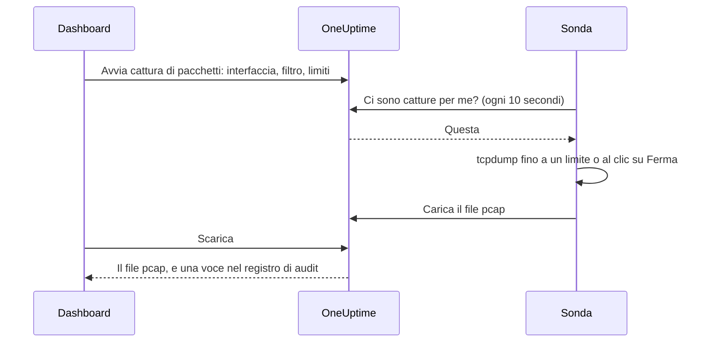

# Cattura di pacchetti

Cattura il traffico che vede una delle tue sonde direttamente dalla dashboard e apri il file in Wireshark. La sonda si trova già nella rete su cui stai indagando: nessuna VPN da aprire e nessun jump host a cui collegarsi.

Le catture sono disattivate su ogni sonda finché chi la gestisce non le attiva, e vengono eseguite solo sulle sonde del tuo progetto.

:::cards
- [Come funziona](#come-funziona): Da «Avvia cattura di pacchetti» a un file in Wireshark.
- [Attivare la cattura dei pacchetti](#attivare-la-cattura-dei-pacchetti): Cosa imposta chi gestisce la sonda, per Docker, Docker Compose e Kubernetes.
- [Avviare una cattura](#avviare-una-cattura): Scegli un'interfaccia, restringi a ciò che ti serve, scarica il file.
- [Riferimento](#riferimento): Limiti, filtri, autorizzazioni, registro di audit e per quanto tempo si conservano i file.
- [Risoluzione dei problemi](#risoluzione-dei-problemi): Cosa significa il messaggio di una cattura non riuscita.
:::

## Come funziona



1. **Avvio.** Chi può avviare le catture sceglie l'interfaccia della sonda, un filtro e i limiti, e fa clic su **Avvia cattura**. OneUptime controlla il filtro e i limiti rispetto a ciò che la sonda consente prima di salvare la cattura.
2. **Presa in carico.** La sonda chiede lavoro a OneUptime ogni dieci secondi, come fa con i monitor. Prende la cattura e avvia `tcpdump`.
3. **Cattura.** La cattura si ferma al primo dei suoi limiti: la durata, il limite di pacchetti o la dimensione del file. **Ferma** la termina prima e conserva ciò che ha catturato.
4. **Caricamento.** La sonda carica il file pcap. OneUptime lo conserva come file privato del progetto.
5. **Download.** La cattura mostra **Completato** con un pulsante **Scarica**. Il file si apre in Wireshark, tcpdump o qualsiasi altro strumento che legge i file pcap.

## Prima di iniziare

- **Una sonda del tuo progetto.** Le sonde globali trasportano il traffico di altri progetti, quindi non catturano mai. Per installare una sonda tua, vedi [Sonde personalizzate](/docs/probe/custom-probe).
- **Una sonda di questa versione o successiva.** Le sonde precedenti non segnalano su cosa possono catturare.
- **Le autorizzazioni giuste.** Per avviare e fermare una cattura serve **Start Packet Capture**, per scaricare un file **Download Packet Capture**. I proprietari e gli amministratori del progetto le hanno entrambe. Vedi [Autorizzazioni](#autorizzazioni).
- **Una porta replicata, per il traffico che non raggiunge la sonda.** Una sonda vede solo il traffico delle interfacce del proprio host. Per catturare il traffico tra altri dispositivi, replica la loro porta dello switch (SPAN) su un'interfaccia libera dell'host della sonda.

## Attivare la cattura dei pacchetti

Chi gestisce la sonda attiva le catture dove la sonda è in esecuzione: la dashboard non può farlo, per scelta. La sonda ha bisogno di tre cose:

| Impostazione | Perché |
| --- | --- |
| `PROBE_PACKET_CAPTURE_ENABLED=true` | Attiva le catture. Qualsiasi altro valore, o nessuno, le lascia disattivate. |
| Rete dell'host | Permette alla sonda di vedere le interfacce dell'host e una porta replicata. Senza, la sonda vede solo la rete del suo container. |
| La capability `NET_RAW` | Permette a tcpdump di catturare. Docker la concede per impostazione predefinita. Lo standard Pod Security «restricted» di Kubernetes la rimuove, quindi aggiungila. |

:::tabs
@tab Docker
```bash
docker run --name oneuptime-probe --network host \
  --cap-add NET_RAW \
  -e PROBE_KEY=<probe-key> \
  -e PROBE_ID=<probe-id> \
  -e ONEUPTIME_URL=https://oneuptime.com \
  -e PROBE_PACKET_CAPTURE_ENABLED=true \
  -d oneuptime/probe:release
```
@tab Docker Compose
```yaml
services:
  oneuptime-probe:
    image: oneuptime/probe:release
    container_name: oneuptime-probe
    network_mode: host
    cap_add:
      - NET_RAW
    environment:
      - PROBE_KEY=<probe-key>
      - PROBE_ID=<probe-id>
      - ONEUPTIME_URL=https://oneuptime.com
      - PROBE_PACKET_CAPTURE_ENABLED=true
    restart: always
```
@tab Kubernetes
```yaml
apiVersion: apps/v1
kind: Deployment
metadata:
  name: oneuptime-probe
spec:
  selector:
    matchLabels:
      app: oneuptime-probe
  template:
    metadata:
      labels:
        app: oneuptime-probe
    spec:
      hostNetwork: true
      dnsPolicy: ClusterFirstWithHostNet
      containers:
        - name: oneuptime-probe
          image: oneuptime/probe:release
          securityContext:
            capabilities:
              add: ["NET_RAW"]
          env:
            - name: PROBE_KEY
              value: "<probe-key>"
            - name: PROBE_ID
              value: "<probe-id>"
            - name: ONEUPTIME_URL
              value: "https://oneuptime.com"
            - name: PROBE_PACKET_CAPTURE_ENABLED
              value: "true"
```
:::

All'avvio, il log della sonda riporta `Packet capture is on: captures of up to 30 minutes and 25 MB can be started on this probe from the dashboard.` Entro un minuto, la pagina della sonda nella dashboard offre **Avvia cattura di pacchetti**.

Per impostare su questa sonda un tetto più basso di quello che rispetta ogni sonda, aggiungi una di queste variabili:

| Variabile | Predefinito | Cosa fa |
| --- | --- | --- |
| `PROBE_PACKET_CAPTURE_MAX_DURATION_IN_SECONDS` | `1800` | La cattura più lunga che questa sonda esegue, da 5 a 1800 secondi. |
| `PROBE_PACKET_CAPTURE_MAX_FILE_SIZE_IN_MB` | `25` | Il file di cattura più grande che questa sonda crea, da 1 a 25 MB. |

> [!NOTE]
> Le sonde incluse in un'installazione self-hosted di OneUptime, tramite Docker Compose o il chart Helm, sono sonde globali, quindi non catturano mai. Esegui una sonda personalizzata nella rete in cui vuoi catturare.

## Avviare una cattura

:::steps
### Apri la sonda o il dispositivo

Apri **Monitor → Impostazioni → Sonde** e fai clic sulla tua sonda: la sua scheda **Catture di pacchetti** elenca le sue catture. Oppure apri un dispositivo di rete e vai alla sua pagina **Traffic**: lì le catture vengono eseguite sulla sonda del dispositivo e partono filtrate sul suo indirizzo.

### Fai clic su Avvia cattura di pacchetti

Il modulo dice cosa contiene una cattura prima che tu ne avvii una: password, token e dati personali che passano in rete finiscono nel file.

### Scegli l'interfaccia

**Tutte le interfacce (any)** cattura su tutte le interfacce della sonda. Scegli l'interfaccia su cui uno switch replica il traffico quando catturi traffico replicato.

### Scegli quali pacchetti

Compila **Host o rete**, **Porta** e **Protocollo** per restringere la cattura, oppure lasciali vuoti per conservare ogni pacchetto. Il modulo mostra il filtro che formano, ad esempio `host 10.0.0.5 and tcp port 443`. Fai clic su **Scrivi invece un filtro BPF** per scriverne uno tuo.

### Controlla i limiti

**Altri campi** contiene **Durata**, **Limite di pacchetti** e **Limite di dimensione del file (MB)**. Il suo riepilogo dice quando si ferma la cattura: `Si ferma dopo 1 minuto, 100.000 pacchetti o 10 MB, a seconda di cosa avviene prima.`

### Fai clic su Avvia cattura

La cattura mostra **In sospeso** finché la sonda non la prende in carico, poi **In esecuzione**, con il suo avanzamento. Fai clic su **Ferma** per terminarla prima.
:::

Quando la cattura mostra **Completato**, fai clic su **Scarica** e apri il file `.pcap` in Wireshark. Una cattura su **Tutte le interfacce (any)** è una «Linux cooked capture», che Wireshark legge come qualsiasi altra.

## Riferimento

### Limiti

| Limite | Predefinito | Intervallo |
| --- | --- | --- |
| Durata | 1 minuto | Da 5 secondi a 30 minuti |
| Limite di pacchetti | 100.000 | Da 1 a 1.000.000 |
| Limite di dimensione del file | 10 MB | Da 1 a 25 MB |

- Una cattura si ferma al primo limite che raggiunge. Un file che raggiunge il limite di dimensione viene tagliato dopo l'ultimo pacchetto completo, quindi si apre sempre.
- Una sonda esegue al massimo 2 catture alla volta.
- Una cattura che la sonda non prende in carico entro 5 minuti non riesce, e lo dice.
- La sonda applica di nuovo questi limiti a ogni cattura, insieme ai propri limiti più bassi.

### Filtri

I campi del modulo formano un [filtro BPF](https://www.tcpdump.org/manpages/pcap-filter.7.html), il linguaggio dei filtri di cattura di tcpdump e Wireshark:

| Host o rete | Porta | Protocollo | Filtro |
| --- | --- | --- | --- |
| `10.0.0.5` | | Qualsiasi protocollo | `host 10.0.0.5` |
| `10.0.0.0/24` | `443` | TCP | `net 10.0.0.0/24 and tcp port 443` |
| | `5060` | UDP | `udp port 5060` |
| | `8000-8080` | Qualsiasi protocollo | `portrange 8000-8080` |
| `10.0.0.5` | | ICMP | `host 10.0.0.5 and (icmp or icmp6)` |

Un filtro scritto da te è una riga di al massimo 500 caratteri, fatta di lettere, numeri, spazi e `. : / ( ) [ ] ! & | < > = + - * % ^ _`. OneUptime lo controlla prima di salvarlo e tcpdump lo compila sulla sonda. La sonda lo passa a tcpdump come un unico argomento, mai tramite una shell.

### Autorizzazioni

| Autorizzazione | Permette di | Chi la ha per impostazione predefinita |
| --- | --- | --- |
| **Start Packet Capture** | Avviare le catture e fermarle | Project Owner, Project Admin |
| **Download Packet Capture** | Scaricare i file di cattura | Project Owner, Project Admin |
| **Delete Packet Capture** | Eliminare le catture e i loro file | Project Owner, Project Admin |
| **Read Packet Capture** | Vedere le catture: quando sono state eseguite, su quale sonda e con quale filtro | Project Owner, Project Admin, Project Member, Viewer |

Per dare a un team **Start Packet Capture** o **Download Packet Capture**, aprilo in **Impostazioni → Team** e aggiungi l'autorizzazione nella sua pagina **Autorizzazioni**. Vedi [Autorizzazioni](/docs/permissions/index).

### Registro di audit e privacy

- L'avvio di una cattura viene registrato nel registro di audit come **Create** della **Packet Capture**, e la sua eliminazione come **Delete**. Ogni download viene registrato come **Download**, con chi ha scaricato quale cattura.
- Il file è un file privato del progetto. Solo il pulsante **Scarica**, con **Download Packet Capture**, lo consegna.
- Le catture e i loro file vengono eliminati 7 giorni dopo l'avvio. Eliminare una cattura elimina subito il suo file.

## Risoluzione dei problemi

:::details «La cattura dei pacchetti è disattivata su questa sonda»
La sonda è in esecuzione senza `PROBE_PACKET_CAPTURE_ENABLED=true`. Riavviala con le impostazioni di [Attivare la cattura dei pacchetti](#attivare-la-cattura-dei-pacchetti).
:::

:::details "The probe is not allowed to capture packets on eth0"
tcpdump non è riuscito ad aprire l'interfaccia. Dai al container della sonda la capability `NET_RAW`: `--cap-add NET_RAW` con Docker, `cap_add` con Docker Compose, `securityContext.capabilities.add` con Kubernetes.
:::

:::details "The interface does not exist on the probe"
L'interfaccia è scomparsa da quando la sonda l'ha segnalata, oppure la sonda è in esecuzione senza la rete dell'host e vede solo le interfacce del suo container. Eseguila con la rete dell'host, poi scegli di nuovo l'interfaccia.
:::

:::details "tcpdump could not use the filter"
tcpdump non è riuscito a compilare il filtro. Il messaggio riporta le parole di tcpdump, ad esempio `syntax error`. Controlla il filtro con il [manuale di pcap-filter](https://www.tcpdump.org/manpages/pcap-filter.7.html).
:::

:::details "The probe did not pick up this capture within 5 minutes"
La sonda è disconnessa, oppure la cattura dei pacchetti è stata disattivata su di essa dopo l'avvio della cattura. Controlla lo **Stato della connessione** della sonda e il suo log.
:::

:::details «Nessun pacchetto corrispondeva al filtro.»
La cattura è stata eseguita e niente sull'interfaccia corrispondeva al filtro. Verifica che il traffico passi da questa interfaccia: il traffico tra altri dispositivi raggiunge la sonda solo tramite una porta replicata.
:::

:::details "This probe is already running 2 packet captures"
Una sonda esegue 2 catture alla volta. Aspetta che una finisca, o fermane una, e avvia di nuovo la tua.
:::

## Passaggi successivi

:::cards
- [Sonde personalizzate](/docs/probe/custom-probe): Installa una sonda nella rete in cui vuoi catturare.
- [Monitor dei dispositivi di rete](/docs/monitor/network-device-monitor): Monitora i dispositivi di cui catturi il traffico.
- [Autorizzazioni](/docs/permissions/index): Dai a un team le autorizzazioni per la cattura dei pacchetti.
:::
