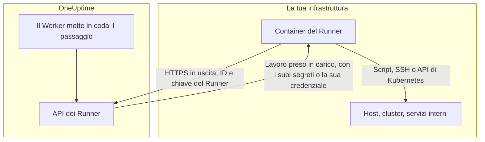
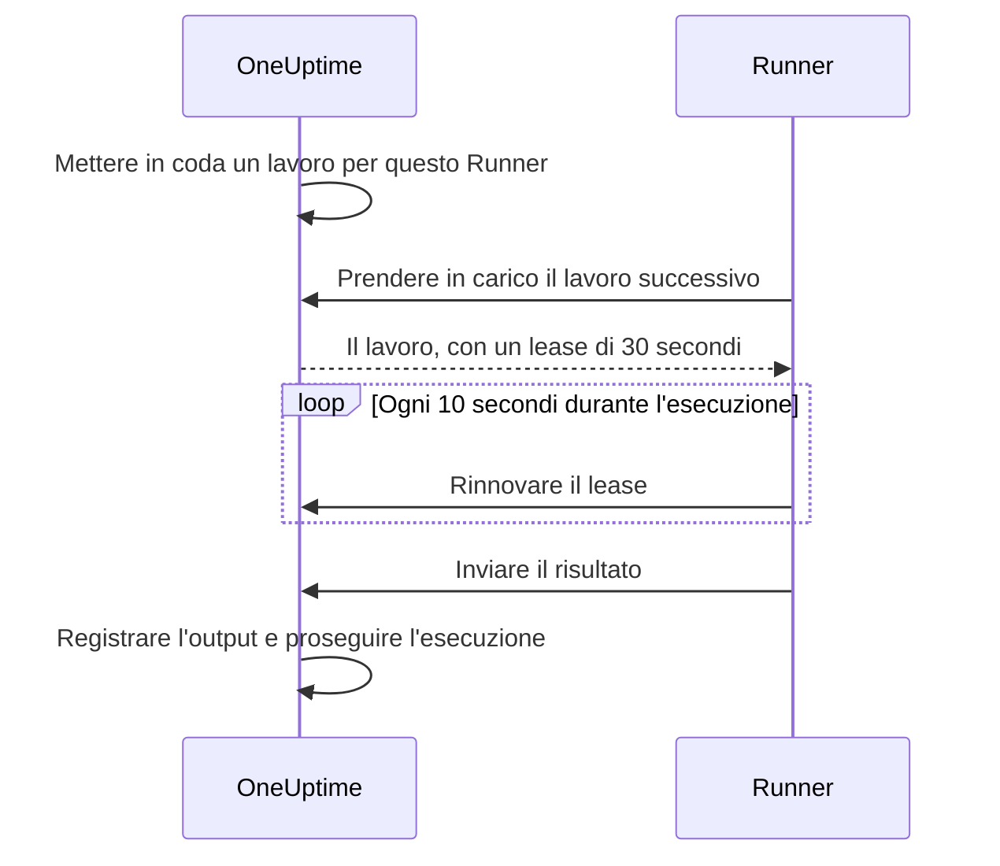

# Agenti di runbook

Un **agente di runbook**, chiamato **Runner** nella dashboard, è un piccolo processo self-hosted che esegue i passaggi JavaScript, Bash, SSH e Kubernetes dei tuoi runbook **nella tua infrastruttura**. Il Worker di OneUptime non esegue mai i tuoi script: li mette in coda, e il Runner scelto da chi ha scritto il passaggio prende in carico ciascuno, lo esegue e restituisce il risultato. Questa pagina è per chi installa e gestisce i Runner.

:::cards
- [Installare un Runner](#installare-un-runner): Dalla dashboard a un container connesso, in cinque passaggi.
- [Indirizzare un passaggio a un Runner](#indirizzare-un-passaggio-a-un-runner): Collegare un passaggio al Runner che deve eseguirlo.
- [Timeout](#timeout): I timeout di presa in carico e di esecuzione, e come interagiscono.
- [Variabili d'ambiente](#variabili-dambiente): Cosa legge il container all'avvio.
:::

## Come funziona



1. Crei un Runner in OneUptime. OneUptime genera per lui un ID e una chiave segreta.
2. Esegui il container del Runner su un host della tua infrastruttura, con quell'ID, quella chiave e l'URL del tuo OneUptime.
3. Il Runner chiede lavoro a OneUptime ogni 5 secondi e segnala di essere attivo ogni 60 secondi.
4. Quando scrivi un passaggio JavaScript, Bash, SSH o Kubernetes, scegli il Runner da un menu a tendina. Il passaggio è legato a quel Runner.
5. Quando il passaggio viene eseguito, il Worker mette in coda un lavoro con `targetAgentId` impostato su quel Runner. Solo quel Runner può prenderlo in carico.
6. Il Runner esegue il lavoro in locale — `bash -c <script>` per Bash, una sandbox `isolated-vm` per JavaScript, una connessione SSH o una chiamata al server API del cluster con la credenziale del passaggio —, acquisisce il risultato e lo restituisce. Il Worker riprende il runbook con il risultato.

Il Runner ha bisogno solo di **HTTPS in uscita** verso la tua istanza di OneUptime. Non accetta connessioni in entrata.

Un Runner custodisce solo il suo ID e la sua chiave. Tutto il resto lo riceve con il lavoro che prende in carico: uno script, con i [segreti di runbook](/docs/runbooks/credentials#segreti-per-gli-script) che gli sono assegnati già inseriti, oppure la [credenziale](/docs/runbooks/credentials) che un passaggio SSH o Kubernetes indica. Per questo chiunque abbia la chiave di un Runner può agire come quel Runner: tratta la chiave come le credenziali che gli sono assegnate.

## Perché gli script vengono eseguiti su un Runner

Eseguire gli script sul Worker di OneUptime presentava due problemi:

- **Confine di fiducia.** Chiunque potesse scrivere un runbook poteva eseguire codice sul Worker, con accesso a tutto ciò che il Worker poteva raggiungere.
- **Portata.** La maggior parte dei passaggi utili agisce sulla _tua_ infrastruttura («riavvia questo servizio», «cerca un record nel nostro database interno»), non su quella di OneUptime.

Con i Runner, quei passaggi vengono eseguiti su un host che controlli tu, e sei tu a decidere cosa può fare quell'host. I passaggi di richiesta HTTP e IA restano sul Worker, perché non hanno bisogno di nulla della tua rete.

## Prima di iniziare

- **Un host con Docker** nella tua infrastruttura, che raggiunga l'URL del tuo OneUptime in HTTPS e i sistemi su cui agiscono i tuoi passaggi.
- **Un ruolo che crea Runner.** Project Owner, Project Admin, Project Member e Runbook Admin possono crearne uno. Solo un Project Owner, un Project Admin o un Runbook Admin possono vedere la chiave di un Runner, contenuta nel comando di installazione.

## Installare un Runner

### 1. Crea il record dell'agente

Vai in **Runbook → Agenti di runbook** e crea un nuovo agente. Fai clic su **Crea: Runner** e compila i suoi due passaggi:

| Campo | Passaggio | Note |
| --- | --- | --- |
| **Nome** | **Runner** | Un nome chiaro, di solito dove gira e cosa può raggiungere, come `prod-eu-west-1`. È ciò che scegli quando scrivi un passaggio. |
| **Descrizione** | **Runner** | Facoltativa. Una frase su cosa può raggiungere questo host. |
| **Etichette** | **Runner** (in **Altri campi**) | Facoltative. |
| **Esegue i runbook** | **Funzionalità** | Attivo per impostazione predefinita. Consente a questo Runner di prendere passaggi di runbook. |
| **Esegue le correzioni di codice AI** | **Funzionalità** | Disattivato per impostazione predefinita. Gli consente di aprire pull request di correzione del codice con IA; vedi [Fix Tasks](/docs/ai/ai-agent). |
| **Esegue i comandi di rimedio AI** | **Funzionalità** | Disattivato per impostazione predefinita. Consente al rimedio automatico con IA di eseguirvi comandi verificati da una policy. Attivarlo su un Runner che ha credenziali SSH richiede l'autorizzazione a leggere le credenziali dei runbook; vedi [Runner che eseguono i comandi di OneUptime AI](/docs/runbooks/credentials#runner-che-eseguono-i-comandi-di-oneuptime-ai). |

Un Runner applica una modifica alle sue funzionalità al successivo heartbeat; non serve riavviarlo.

### 2. Copia il comando di installazione

Nella riga del Runner, fai clic su **Mostra istruzioni di configurazione**. La finestra **Configurazione dell'agente Runbook** mostra un comando `docker run` già compilato con l'ID e la chiave di questo Runner. Lo stesso comando si trova nella pagina del Runner, in **Istruzioni di configurazione**.

Solo un Project Owner, un Project Admin o un Runbook Admin possono leggere la chiave. Gli altri vedono «Non hai l'autorizzazione per visualizzare la chiave di questo agente Runbook» al posto del comando.

### 3. Eseguilo su un host della tua infrastruttura

Esegui il comando su un host del tuo ambiente che possa:

- raggiungere la tua istanza di OneUptime in HTTPS, e
- fare ciò che serve ai tuoi passaggi, ad esempio raggiungere altri host via SSH, chiamare il server API di un cluster o parlare con un database.

```bash
docker run --name oneuptime-runner --restart unless-stopped \
  -e ONEUPTIME_RUNNER_ID=<runner-id> \
  -e ONEUPTIME_RUNNER_KEY=<runner-key> \
  -e ONEUPTIME_URL=https://oneuptime.yourdomain.com \
  -d oneuptime/runner:release
```

### 4. Verifica che l'agente sia connesso

Torna in **Runbook → Agenti di runbook**. Entro un minuto dall'avvio del container, lo **Stato** del Runner dovrebbe indicare **Connesso**, con un **Visto l'ultima volta** recente. Nella pagina del Runner, la scheda **Stato dell'agente Runbook** mostra la sua **Versione dell'agente Runbook** e il suo **Host**. Se resta **Mai connesso** o **Disconnesso**, vedi [Risoluzione dei problemi](#risoluzione-dei-problemi).

### 5. Mantieni l'agente aggiornato

Quando un agente esegue una versione più vecchia del tuo OneUptime, accanto alla sua **Versione dell'agente Runbook** compare un segnale di avviso nella sua pagina. Selezionalo per vedere come aggiornarlo: scarica la nuova immagine e rimuovi il container, poi esegui di nuovo il comando di installazione del passaggio 2. Un agente installato dal chart dell'agente Kubernetes si aggiorna invece con il chart.

```bash
docker pull oneuptime/runner:release
docker rm -f oneuptime-runner
```

## Indirizzare un passaggio a un Runner

:::steps
### Aggiungi un passaggio che viene eseguito su un Runner

Nei **Passaggi** del tuo runbook, aggiungi un passaggio JavaScript, Bash, SSH o Kubernetes.

### Scegli il Runner

Il menu **Runner** del passaggio elenca ogni Runner del progetto, con il suo stato di connessione. Se il progetto non ne ha ancora, il passaggio lo dice e ti indica **Runbooks › Runners**.

### Salva i passaggi

Fai clic su **Save Steps**. Quando un'esecuzione raggiunge il passaggio, il Worker mette in coda un lavoro per l'ID di quel Runner, e solo quel Runner può prenderlo in carico.
:::

Bash viene eseguito con `bash -c`. JavaScript viene eseguito in una sandbox `isolated-vm` sul Runner, senza accesso al file system o ai processi; può chiamare API HTTP pubbliche con `axios`, ma non indirizzi di una rete privata. I passaggi SSH e Kubernetes usano la [credenziale](/docs/runbooks/credentials) indicata dal passaggio, che deve essere assegnata allo stesso Runner.

Ti serve più di un Runner? Creali, poi indirizza ogni passaggio a quello adatto. Per la ridondanza, esegui un secondo Runner e dividi i passaggi tra i due, oppure tieni un runbook di riserva i cui passaggi puntano all'altro Runner.

## Note operative

### Timeout

A ogni passaggio eseguito su un Runner si applicano due timeout:

| Timeout | Predefinito | Cosa controlla |
| --- | --- | --- |
| **Claim timeout** | 2 minuti | Quanto il Worker attende che il Runner scelto prenda in carico il lavoro. Se il Runner non lo prende in tempo, il passaggio fallisce per timeout e il runbook prosegue (o si ferma, a seconda di **Continua in caso di errore**). |
| **Execution timeout** | 30 secondi | Quanto il Runner lascia girare il passaggio prima di fermarlo. Bash riceve `SIGKILL`; la sandbox di JavaScript viene distrutta. |

Entrambi sono configurabili per passaggio. Apri **Runbook › il tuo runbook › Passaggi**, espandi il passaggio e imposta **Execution timeout** e **Claim timeout** (in secondi) nelle sue impostazioni. Lascia un campo vuoto per usare il valore predefinito. Ognuno accetta da 1 secondo a 1 ora; i valori fuori da questo intervallo vengono riportati nei limiti quando il passaggio viene eseguito.

La finestra di attesa complessiva del Worker è `claim timeout + execution timeout + a few seconds`. Scegli valori adatti al passaggio.

Due cose da tenere presenti quando riduci il claim timeout:

- Il Runner chiede lavoro a ogni ciclo di polling (`ONEUPTIME_RUNNER_POLL_INTERVAL_MS`, 5 secondi per impostazione predefinita). Un claim timeout più breve di un ciclo può scadere prima che un Runner perfettamente sano abbia anche solo visto il lavoro, e il passaggio fallisce allora con lo stesso messaggio di un Runner offline.
- Un Runner esegue un lavoro alla volta per impostazione predefinita (`ONEUPTIME_RUNNER_CONCURRENCY`). Mentre un passaggio lungo lo occupa, gli altri passaggi diretti allo stesso Runner esauriscono i propri claim timeout. Se porti un execution timeout a qualche minuto, aumenta di conseguenza il claim timeout dei passaggi che condividono quel Runner, oppure assegna loro un altro Runner.

### Lease e heartbeat



Quando un Runner prende in carico un lavoro, riceve un lease breve (30 secondi per impostazione predefinita). Mentre il passaggio è in esecuzione, il Runner rinnova il lease ogni 10 secondi. Se il Runner muore o perde la rete a metà di uno script, il lease scade e il Worker segna il lavoro come `TimedOut` invece di attendere per sempre.

I processi figli di Bash **non** vengono annullati automaticamente alla scadenza del lease (anche una sandbox JavaScript viene lasciata finire, se mai finisce), ma il Worker smette di aspettarli e il Runner non può più inviare un risultato una volta che un'altra presa in carico è subentrata. Progetta script che si possano rieseguire senza rischi se per te conta l'esecuzione unica.

### Se il Worker di OneUptime si riavvia a metà di un passaggio

Un'esecuzione di runbook gira su un solo Worker dall'inizio alla fine, quindi un deploy o un crash possono interromperla mentre un passaggio è in corso. Cosa succede dopo dipende dal fatto che l'esecuzione venga ripresa:

- **Viene ripresa.** Il Worker che la riprende trova il lavoro che il tuo passaggio ha già creato e **vi si ricollega**. Attende quel lavoro invece di inviare al tuo Runner una seconda copia dello script. Se il Runner aveva già finito, viene usato il risultato registrato così com'è. Un passaggio viene inviato a un Runner al massimo una volta per esecuzione.
- **Non viene ripresa.** Se l'esecuzione non viene mai ripresa, una scansione la segna come `Failed` quando supera la finestra di presa in carico e di esecuzione configurata per il suo passaggio attuale, con un messaggio che indica quel passaggio. Un'esecuzione non resta mai bloccata in `Running`.

L'unica cosa che questo non può dirti è fin dove è arrivato uno script prima che il Worker sparisse. Un passaggio che era in corso viene segnalato come non riuscito con una nota che potrebbe essere stato eseguito in parte: controlla il sistema di destinazione prima di eseguire di nuovo il runbook.

### Nessun agente online

Se il Runner scelto è offline quando il passaggio viene eseguito, il lavoro attende come `Pending` finché non scade il claim timeout, e poi il passaggio fallisce con "No runbook agent picked up this step before the wait window expired." La pagina **Agenti di runbook** è il posto dove verificare la copertura prima di eseguire un runbook in una situazione reale.

### Limite di output

stdout e stderr insieme sono limitati a **50 KB** per passaggio. L'output più lungo viene troncato con un marcatore. Se ti serve un log completo, scrivilo dallo script nel tuo sistema di log o in uno storage di oggetti e stampa l'URL con `echo`.

### Annullamento

Annullare un'esecuzione di runbook, dalla pagina dell'esecuzione o dall'API, segna subito tutti i suoi lavori `Pending`, `Claimed` e `Running` come `Cancelled`. Un Runner già a metà di uno script porta a termine il suo lavoro, ma il server non ne accetta il risultato, e nessun passaggio successivo del runbook viene inviato.

### Concorrenza

Ogni Runner esegue un lavoro alla volta per impostazione predefinita. Per consentirne di più, imposta `ONEUPTIME_RUNNER_CONCURRENCY` sul container, ma ricorda che il Runner condivide l'host con tutto ciò che vi gira già.

## Variabili d'ambiente

Il Runner legge queste variabili all'avvio:

| Variabile | Obbligatoria | Predefinito | Note |
| --- | --- | --- | --- |
| `ONEUPTIME_URL` | sì | — | URL di base della tua istanza di OneUptime, ad esempio `https://oneuptime.yourdomain.com`. |
| `ONEUPTIME_RUNNER_ID` | sì | — | L'ID del Runner, dal suo comando di installazione. |
| `ONEUPTIME_RUNNER_KEY` | sì | — | La chiave segreta del Runner, dal suo comando di installazione. |
| `ONEUPTIME_RUNNER_POLL_INTERVAL_MS` | no | `5000` | Ogni quanto il Runner chiede nuovi lavori. Un valore sotto `1000` torna al predefinito. |
| `ONEUPTIME_RUNNER_HEARTBEAT_INTERVAL_MS` | no | `60000` | Ogni quanto il Runner segnala di essere attivo. Un valore sotto `5000` torna al predefinito. |
| `ONEUPTIME_RUNNER_JOB_HEARTBEAT_INTERVAL_MS` | no | `10000` | Ogni quanto il Runner rinnova il lease di un lavoro in corso. Un valore sotto `1000` torna al predefinito. |
| `ONEUPTIME_RUNNER_CONCURRENCY` | no | `1` | Numero massimo di lavori contemporanei su questo Runner. |
| `ONEUPTIME_RUNNER_ENABLE_RUNBOOKS` | no | — | Impostalo su `false` perché questo Runner smetta di prendere passaggi di runbook, qualunque cosa dica la dashboard. Può solo disattivare la funzionalità. |
| `ONEUPTIME_RUNNER_ENABLE_CODE_FIXES` | no | — | Impostalo su `false` perché questo Runner smetta di prendere correzioni di codice con IA, qualunque cosa dica la dashboard. |
| `ONEUPTIME_RUNNER_ENABLE_AI_COMMANDS` | no | — | Impostalo su `false` perché questo Runner smetta di eseguire comandi di rimedio con IA, qualunque cosa dica la dashboard. |

## Ruotare la chiave di un agente

Se una chiave viene esposta, reimpostala. La vecchia chiave smette subito di funzionare.

:::steps
### Reimposta la chiave

Apri il Runner da **Runbook → Agenti di runbook**, fai clic su **Reimposta la chiave dell'agente Runbook** e conferma. Il Runner smette di connettersi finché non ha la nuova chiave.

### Esegui il container con la nuova chiave

Copia il nuovo comando dalle **Istruzioni di configurazione** del Runner, rimuovi il vecchio container ed esegui il nuovo comando sullo stesso host:

```bash
docker rm -f oneuptime-runner
```

### Verifica che si riconnetta

In **Runbook → Agenti di runbook**, lo **Stato** del Runner torna a **Connesso** entro un minuto.
:::

## Autorizzazioni

La gestione degli agenti si trova nel gruppo di autorizzazioni Runbooks esistente:

- `CreateRunner`, `EditRunner`, `DeleteRunner`, `ReadRunner` — gestire i record degli agenti.
- `RunbookAdmin`, `RunbookMember`, `RunbookViewer` (ruoli) — `RunbookAdmin` costruisce i runbook, le loro regole e i Runner su cui girano, e li esegue. `RunbookMember` apre i runbook e le loro esecuzioni e li esegue — avvia un'esecuzione, ne completa o salta i passaggi e la annulla — ma non crea, modifica né elimina alcun runbook o Runner. `RunbookViewer` legge i runbook e le loro esecuzioni e non esegue nulla. `RunbookAdmin` raccoglie tutte le autorizzazioni granulari qui sopra.

Avviare un runbook (e quindi inviarne i passaggi ai Runner) richiede un ruolo che esegue i runbook — `ProjectOwner`, `ProjectAdmin`, `ProjectMember`, `RunbookAdmin` o `RunbookMember` — oppure `CreateRunbookExecution`; completare, saltare o annullare un'esecuzione accetta anche `EditRunbookExecution`. Un ruolo esegue solo i runbook raggiunti dal suo ambito.

La chiave di un Runner è leggibile solo da Project Owner, Project Admin e Runbook Admin.

## API lato agente

Per i curiosi: il Runner usa questi endpoint, montati in `/runner-ingest`. Il percorso precedente alla fusione, `/runbook-agent-ingest`, viene ancora servito per gli agenti non ancora ridistribuiti, quindi aggiornare il server non li rompe. Vengono autenticati con l'ID e la chiave del Runner nel corpo JSON (`agentId` e `agentKey`), oppure negli header `x-agent-id` e `x-agent-key`.

| Endpoint | Scopo |
| --- | --- |
| `POST /heartbeat` | Segnale di vita. Aggiorna l'ultimo contatto, la versione e le informazioni sull'host del Runner, e restituisce le funzionalità che il progetto gli ha concesso. |
| `POST /claim-next-job` | Prendere in carico in modo atomico il lavoro `Pending` più vecchio destinato all'ID di questo Runner. Restituisce `{ job: null }` quando non c'è nulla da fare. |
| `POST /job/:jobId/heartbeat` | Rinnovare il lease del lavoro. Restituisce 404 quando il lease è scaduto o il lavoro è terminato. |
| `POST /job/:jobId/result` | Inviare il risultato finale. Viene ignorato se il lease è già passato ad altri. |
| `POST /disconnect` | Disconnettersi in uno spegnimento pulito. |

Non dovresti doverli chiamare a mano: lo fa il Runner fornito. Sono documentati qui perché tu possa costruire il tuo agente se hai un vincolo a cui il nostro non si adatta.

## Risoluzione dei problemi

:::details Il Runner resta Mai connesso o Disconnesso
- Controlla i log del container con `docker logs oneuptime-runner` per errori di autenticazione o di rete.
- Verifica che l'host raggiunga l'URL del tuo OneUptime, ad esempio con `curl`.
- Verifica che ID e chiave siano stati copiati senza spazi, e che `ONEUPTIME_URL` sia l'indirizzo con cui apri OneUptime.

**Mai connesso** significa che il Runner non si è mai fatto vivo. **Disconnesso** significa che lo ha fatto, ma non negli ultimi 5 minuti.
:::

:::details I passaggi falliscono con "No runbook agent picked up this step before the wait window expired."
Il Runner del passaggio non ha preso in carico il lavoro entro il suo claim timeout. Verifica che il Runner sia **Connesso**, che **Esegue i runbook** sia attivo e che non sia occupato da un passaggio lungo: esegue un lavoro alla volta, a meno che tu non aumenti `ONEUPTIME_RUNNER_CONCURRENCY`. Un claim timeout più breve dell'intervallo di polling fallisce allo stesso modo.
:::

:::details I passaggi falliscono con "The runbook agent stopped responding while this step was running."
Il Runner ha preso in carico il lavoro, poi ha smesso di rinnovare il lease: si è bloccato, si è riavviato o ha perso la rete. Verifica che sia online, poi controlla il sistema di destinazione prima di eseguire di nuovo il runbook.
:::

:::details Il Runner registra "No capability is enabled"
Tutte le funzionalità sono disattivate per questo Runner. Attiva **Esegue i runbook** nella pagina del Runner in OneUptime. Applica la modifica al successivo heartbeat.
:::

## Prossimi passi

:::cards
- [Scrivere un runbook](/docs/runbooks/authoring): Scrivere i passaggi che vengono eseguiti sul tuo Runner.
- [Credenziali dei runbook](/docs/runbooks/credentials): Dare ai passaggi SSH e Kubernetes un accesso gestito.
- [Configurazione e sicurezza dei runbook](/docs/runbooks/configuration): Limiti, autorizzazioni e protezione.
:::
