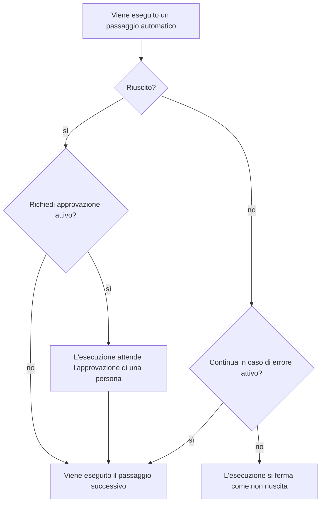

# Scrivere un runbook

Un runbook si scrive come elenco ordinato di passaggi nella sua pagina **Passaggi**. Questa pagina mostra come creare un runbook, come configurare ciascuno dei sette tipi di passaggio e come errori e approvazioni cambiano il corso di un'esecuzione.

:::cards
- [Creare un runbook](#creare-un-runbook): Da un runbook vuoto ai passaggi salvati.
- [Tipi di passaggio](#tipi-di-passaggio): Manual, JavaScript, HTTP request, Bash, SSH, Kubernetes e AI.
- [Gestione degli errori e approvazioni](#gestione-degli-errori-e-approvazioni): Cosa succede dopo che un passaggio fallisce o riesce.
- [Un esempio completo](#un-esempio-completo): Un failover del database in cinque passaggi.
:::

## Prima di iniziare

- **Un ruolo che scrive runbook.** Project Owner, Project Admin e Runbook Admin creano runbook e ne salvano i passaggi. Con autorizzazioni granulari ti servono **Create Runbook** e **Edit Runbook**. Vedi [Autorizzazioni](/docs/runbooks/configuration#autorizzazioni).
- **Un Runner, per i passaggi JavaScript, Bash, SSH e Kubernetes.** Questi passaggi vengono eseguiti su un [Runner](/docs/runbooks/agents) nella tua infrastruttura, mai sul Worker di OneUptime. Installane uno prima.
- **Una credenziale, per i passaggi SSH e Kubernetes, e l'autorizzazione a leggerla.** Vedi [Credenziali dei runbook](/docs/runbooks/credentials). Un passaggio può indicare una credenziale solo se puoi leggere le credenziali dei runbook: Project Owner, Project Admin o **Read Runbook Credential**. Runbook Admin non la include.
- **Un provider LLM, per i passaggi IA.** Vedi [Provider LLM](/docs/ai/llm-provider).

## Creare un runbook

:::steps
### Apri i runbook

Apri **Prodotti → Runbook**. Runbook si trova nel gruppo **Dashboard e automazione**.

### Crea il runbook

Fai clic su **Crea: Runbook**, inserisci un **Nome** e, se vuoi, una **Descrizione** di cosa fa il runbook. In **Altri campi** trovi l'interruttore **Abilitato**, attivo per impostazione predefinita, e le **Etichette**. Il nuovo runbook compare nell'elenco: aprilo.

### Aggiungi i passaggi

Vai in **Passaggi**. In **Start your runbook**, scegli il tipo del primo passaggio; sotto l'ultimo passaggio, **Add another step** offre gli stessi sette tipi. Ogni passaggio si apre con il suo **Titolo**, la sua **Descrizione** (in Markdown, mostrata a chi interviene) e le impostazioni del suo tipo. Quando il runbook ha almeno un passaggio, **Aggiungi passaggio**, in alto nella scheda, aggiunge un passaggio Manual.

### Metti in ordine i passaggi

I passaggi vengono eseguiti **in ordine**. Per cambiare l'ordine, trascina un passaggio dalla maniglia a sinistra della sua intestazione; da tastiera, porta il focus sulla maniglia, premi Spazio, sposta il passaggio con le frecce e premi di nuovo Spazio.

### Salva i passaggi

Fai clic su **Save Steps**. Finché non lo fai, l'editor mostra **Modifiche non salvate**. Una volta salvato, vedi **Salvato** e il runbook è pronto per essere [eseguito](/docs/runbooks/running).
:::

## Anatomia di un passaggio

Ogni passaggio ha questi campi:

| Campo | Scopo |
| --- | --- |
| **Titolo** | Un'etichetta breve, mostrata nell'elenco dei passaggi e in ogni esecuzione. |
| **Descrizione** | Contesto facoltativo per chi interviene, in Markdown. In un passaggio Manual è l'istruzione che quella persona legge. |
| **Continua in caso di errore** | Solo passaggi automatici. Se attivo, un passaggio che fallisce non ferma l'esecuzione: il passaggio successivo viene eseguito comunque. |
| **Richiedi approvazione** | Solo passaggi automatici. Se attivo, il runbook si mette in pausa dopo questo passaggio e attende che una persona approvi prima di eseguire il successivo. L'interruttore si chiama **Richiedi approvazione prima di eseguire il passaggio successivo**. |
| Impostazioni specifiche del tipo | Lo script, l'URL, il Runner, la credenziale o il prompt. Vedi [Tipi di passaggio](#tipi-di-passaggio). |

## Tipi di passaggio

| Tipo | Viene eseguito su | Richiede |
| --- | --- | --- |
| [Manual](#manual) | Una persona | Niente |
| [JavaScript](#javascript) | Un Runner | Un Runner |
| [HTTP request](#http-request) | Il Worker di OneUptime | Niente |
| [Bash](#bash) | Un Runner | Un Runner |
| [SSH](#ssh) | Un Runner | Un Runner e una credenziale SSH |
| [Kubernetes](#kubernetes) | Un Runner | Un Runner e una credenziale Kubernetes |
| [AI](#ai) | Il Worker di OneUptime | Un provider LLM |

### Manual

Una voce di checklist per una persona. L'esecuzione si mette in pausa quando raggiunge un passaggio Manual e resta in `WaitingForManualStep` (**In attesa di te**) finché qualcuno non fa clic su **Mark complete** o **Salta**. Un'esecuzione che attende una persona non scade mai.

Usalo per ciò che solo una persona può verificare o fare: «Conferma nella dashboard del bilanciatore di carico che il traffico è passato alla regione secondaria.»

### JavaScript

Un frammento di JavaScript, eseguito in una sandbox `isolated-vm` su un [agente di runbook](/docs/runbooks/agents) nella tua infrastruttura, non sul Worker di OneUptime.

| Campo | Cosa fa | Predefinito |
| --- | --- | --- |
| **Runner** | Il Runner che esegue il passaggio. Solo quel Runner può prendere in carico il lavoro. | — |
| **Script** | Il JavaScript da eseguire. Restituisci un valore con `return` per acquisirlo; anche ogni riga di `console.log` viene acquisita. Lanciare un errore fa fallire il passaggio. | — |
| **Execution timeout** | Quanto tempo il Runner lascia girare il frammento prima di distruggere la sandbox. | 30 secondi |
| **Claim timeout** | Quanto tempo il Worker attende che il Runner prenda in carico il lavoro. | 2 minuti |

```javascript
const start = Date.now();
// ... your logic ...
console.log("replica lag checked");
return { durationMs: Date.now() - start };
```

La sandbox ha 128 MB di memoria e nessun accesso al file system o ai processi. Può fare richieste HTTP con `axios`, ma solo verso indirizzi pubblici: una richiesta verso una rete privata, verso l'host stesso del Runner o verso un endpoint di metadati cloud viene rifiutata. Per raggiungere un servizio della tua rete, usa un passaggio [Bash](#bash) con `curl`.

### HTTP request

Una chiamata HTTP in uscita, effettuata dal Worker di OneUptime. Non serve alcun Runner.

| Campo | Cosa fa | Predefinito |
| --- | --- | --- |
| **Method** | `GET`, `POST`, `PUT`, `PATCH`, `DELETE` o `HEAD`. | `GET` |
| **URL** | L'endpoint da chiamare. | Vuoto |
| **Headers (JSON)** | Un oggetto JSON, ad esempio `{ "Authorization": "Bearer ..." }`. Header che non sono JSON valido fanno fallire il passaggio. | Nessuno |
| **Body** | Inviato come JSON se è interpretabile come JSON, altrimenti come testo. | Nessuno |
| **Request timeout** | Quanto attendere la risposta dell'endpoint prima di far fallire il passaggio. | 30 secondi |

Il passaggio riesce con una risposta `2xx` o `3xx` e fallisce con qualsiasi altra, con `HTTP <status>` come errore. I reindirizzamenti non vengono seguiti. Stato, header e corpo della risposta vengono acquisiti, fino a 50 KB.

> [!NOTE]
> Il Worker non chiama mai indirizzi di loopback o link-local, come un endpoint di metadati cloud. Su OneUptime Cloud chiama solo indirizzi pubblici. Un OneUptime self-hosted raggiunge anche le reti private, a meno che `DATA_SOURCE_BLOCK_PRIVATE_ADDRESSES` non sia `true`. Per chiamare un servizio della tua rete da OneUptime Cloud, usa un passaggio [Bash](#bash) con `curl`.

Utile per: aprire un incidente PagerDuty, pubblicare su un webhook Slack, chiamare l'API pubblica del tuo provider cloud o la tua.

### Bash

Uno script bash, eseguito con `bash -c <script>` su un [agente di runbook](/docs/runbooks/agents) nella tua infrastruttura. Bash non viene mai eseguito sul Worker di OneUptime.

| Campo | Cosa fa | Predefinito |
| --- | --- | --- |
| **Runner** | Il Runner che esegue il passaggio. Solo quel Runner può prendere in carico il lavoro. | — |
| **Script Bash** | Lo script. L'output (stdout e stderr) viene acquisito fino a 50 KB, e un codice di uscita diverso da zero fa fallire il passaggio. | — |
| **Execution timeout** | Quanto tempo il Runner lascia girare lo script prima di terminarlo con `SIGKILL`. Aumentalo per i passaggi che richiedono legittimamente minuti. | 30 secondi |
| **Claim timeout** | Quanto tempo il Worker attende che il Runner prenda in carico il lavoro. | 2 minuti |

Lo script viene eseguito nel container del Runner, con gli strumenti forniti dalla sua immagine, come `curl`, `wget` e il client `ssh`, e con l'accesso di rete dell'host su cui gira. Ad esempio, per controllare un servizio raggiungibile solo dalla tua rete:

```bash
set -euo pipefail
HTTP_CODE=$(curl -s -o /tmp/resp.txt -w "%{http_code}" "http://payments.internal:8080/health")
echo "HTTP $HTTP_CODE"
cat /tmp/resp.txt
if [[ "$HTTP_CODE" != "200" ]]; then
  echo "Health check failed"
  exit 1
fi
```

Se il Runner scelto è offline quando l'esecuzione raggiunge questo passaggio, il passaggio attende fino al **claim timeout** (2 minuti per impostazione predefinita) e poi fallisce per timeout. Aggiungi un agente in **Runbook → Agenti di runbook** prima di contare su un passaggio Bash.

> [!TIP]
> Tieni password e token fuori dallo script. Salvali come segreti di runbook e scrivi `{{runbookSecrets.NAME}}` in uno script Bash o JavaScript: il Runner riceve lo script con il valore già inserito. Vedi [Segreti per gli script](/docs/runbooks/credentials#segreti-per-gli-script).

### SSH

Eseguire un comando su un host che il Runner raggiunge via SSH. A differenza di `ssh host cmd` in un passaggio Bash, l'accesso è una [credenziale](/docs/runbooks/credentials) gestita invece di una chiave privata sul disco del Runner: cifrata a riposo, assegnata a Runner specifici e mai rileggibile tramite l'API.

| Campo | Cosa fa |
| --- | --- |
| **Runner** | Il Runner che apre la connessione. Deve poter raggiungere l'host sulla rete. |
| **Credential** | Una credenziale SSH con host, porta, utente e chiave o password. Deve essere assegnata al Runner scelto, altrimenti il passaggio fallisce invece di essere eseguito con l'accesso sbagliato. |
| **Command** | Eseguito sull'host remoto come utente della credenziale. L'output viene acquisito fino a 50 KB, e un codice di uscita diverso da zero fa fallire il passaggio. |
| **Execution timeout** | Copre insieme connessione, autenticazione ed esecuzione del comando, così un comando bloccato non può tenere aperto il passaggio. 30 secondi per impostazione predefinita. |
| **Claim timeout** | Quanto tempo il Worker attende che il Runner prenda in carico il lavoro. 2 minuti per impostazione predefinita. |

### Kubernetes

Riavviare o scalare un carico di lavoro in un cluster. Le azioni sono volutamente un insieme chiuso: un passaggio capace di modificare qualsiasi oggetto sarebbe una shell da amministratore del cluster, e questo tipo di passaggio esiste per rendere i rimedi comuni abbastanza sicuri per il rimedio automatico.

| Campo | Cosa fa |
| --- | --- |
| **Runner** | Il Runner che chiama il server API del cluster. Deve poterlo raggiungere. |
| **Credential** | Una credenziale Kubernetes: l'URL del server API, un token di service account e la CA del cluster. Associa quel service account a un ruolo che consenta solo ciò di cui i tuoi runbook hanno bisogno. |
| **Azione** | **Restart workload** modifica il template del pod perché il controller ricrei i pod, come fa `kubectl rollout restart`. **Scale workload** imposta il numero di repliche. |
| **Workload kind** | **Distribuzione**, **StatefulSet** o **DaemonSet**. |
| **Namespace** e **Workload name** | Il carico di lavoro su cui agire. |
| **Repliche** | Solo per lo scaling. Lo zero è consentito: svuotare un carico di lavoro è un rimedio legittimo. Un DaemonSet esegue un pod per nodo e non può essere scalato; riavvialo invece. |
| **Execution timeout** | Quanto tempo il Runner attende che il server API accetti la modifica. 30 secondi per impostazione predefinita. |
| **Claim timeout** | Quanto tempo il Worker attende che il Runner prenda in carico il lavoro. 2 minuti per impostazione predefinita. |

Se il server API rifiuta la modifica, il suo messaggio compare sul passaggio, così un errore di autorizzazione ti dice quale role binding ampliare.

### AI

Chiedi all'IA di analizzare, riassumere o decidere qualcosa durante l'esecuzione. La risposta diventa l'output del passaggio sull'esecuzione. I passaggi IA vengono eseguiti sul Worker di OneUptime; non serve alcun Runner.

| Campo | Cosa fa |
| --- | --- |
| **Prompt** | Cosa deve fare l'IA. Ad esempio: «Esamina l'output dei passaggi precedenti e di' se è sicuro procedere con il rimedio.» |
| **LLM provider** | Facoltativo. **Project default** usa il provider predefinito del progetto. Fissa un provider quando il passaggio ha bisogno di un modello specifico, ad esempio uno self-hosted per dati che non devono lasciare la tua rete. Vedi [Provider LLM](/docs/ai/llm-provider). |
| **Include previous step context** | Se attivo, l'IA vede tutto dei passaggi eseguiti prima di questo: titolo, tipo, stato, output e messaggi di errore. Riceve fino a 4.000 caratteri dell'output di ogni passaggio. |
| **Include trigger context** | Se attivo, l'IA vede cosa ha avviato l'esecuzione: l'incidente, l'avviso o l'evento di manutenzione programmata collegato (descrizione, gravità, stato attuale, monitor coinvolti, causa principale, cronologia degli stati e note pubbliche), oppure chi ha avviato il runbook a mano. |

Abbina un passaggio IA a **Richiedi approvazione** per tenere una persona nel processo: l'IA analizza, qualcuno legge la risposta e approva, e solo allora viene eseguito il passaggio successivo (di rimedio).

**Cosa l'IA non vede mai.** La risposta di un passaggio IA viene salvata come output del passaggio sull'esecuzione, e le esecuzioni sono leggibili da chiunque abbia il permesso di leggere i runbook, un pubblico più ampio di quello dell'incidente. Per questo il contesto del trigger esclude le **note interne private** e i **messaggi dei canali Slack e Microsoft Teams**. L'output dei passaggi precedenti viene analizzato alla ricerca di segreti (token, chiavi, credenziali), che vengono oscurati prima dell'invio al modello. Anche le immagini incorporate e i dati codificati lunghi, come uno screenshot incollato nella descrizione di un incidente, vengono esclusi, con una breve nota al loro posto.

I passaggi IA vengono misurati e fatturati come qualsiasi altra funzione di IA. Il passaggio fallisce, con un messaggio che ne spiega il motivo, quando non ha un prompt, quando le funzioni di IA sono disattivate per il progetto, quando non è disponibile alcun provider LLM o quando il provider fissato non è più disponibile per il progetto. Attiva **Continua in caso di errore** se il resto del runbook deve comunque essere eseguito.

## Gestione degli errori e approvazioni



Per impostazione predefinita, un passaggio che fallisce interrompe l'esecuzione e la segna come `Failed`, con l'errore del passaggio come motivo. Con **Continua in caso di errore** attivo, l'errore viene registrato e il passaggio successivo viene eseguito, il che si addice ai runbook del tipo «prova queste tre cose, poi avvisa». **Richiedi approvazione** si applica dopo che un passaggio è riuscito: l'esecuzione attende su quel passaggio finché qualcuno non fa clic su **Approve & continue** o **Salta**.

## Salvare e modificare

Le modifiche ai passaggi hanno effetto quando fai clic su **Save Steps**. Ogni esecuzione lavora sull'istantanea presa al suo avvio, quindi le esecuzioni già in corso mantengono i passaggi con cui sono partite e una modifica non riscrive mai la storia delle esecuzioni passate.

## Un esempio completo

Un runbook per «DB primary unreachable»:

| # | Tipo | Cosa fa |
| --- | --- | --- |
| 1 | JavaScript | Recuperare l'host primario attuale dal tuo servizio di configurazione e registrarlo. |
| 2 | Manual | «Conferma che il ritardo di replica sul secondario è sotto i 5 secondi.» |
| 3 | HTTP request | `POST` all'API del tuo orchestratore di failover. |
| 4 | Manual | «Verifica che le scritture vadano ora al nuovo primario.» |
| 5 | HTTP request | `POST` di un messaggio di cessato allarme a un webhook Slack. |

Chi interviene guarda eseguire il passaggio 1, spunta il passaggio 2, guarda eseguire il passaggio 3, spunta il passaggio 4, e l'esecuzione termina con il passaggio 5. L'output di ogni passaggio viene acquisito per il postmortem.

## Prossimi passi

:::cards
- [Eseguire un runbook](/docs/runbooks/running): Avviare un'esecuzione e completarne, approvarne o saltarne i passaggi.
- [Regole di runbook](/docs/runbooks/rules): Avviare questo runbook automaticamente sugli incidenti corrispondenti.
- [Agenti di runbook](/docs/runbooks/agents): Installare il Runner di cui hanno bisogno i tuoi passaggi di script.
- [Credenziali dei runbook](/docs/runbooks/credentials): Dare ai passaggi SSH e Kubernetes un accesso gestito.
:::
