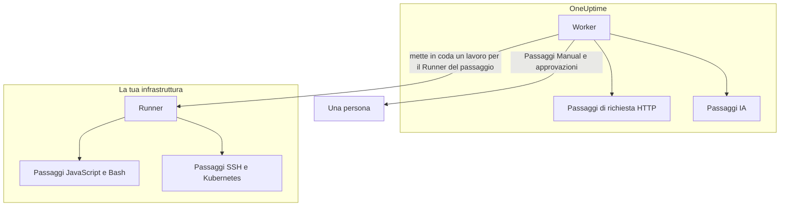

# Configurazione e sicurezza dei runbook

Questo è il riferimento per operatori e revisori della sicurezza: dove viene eseguito ogni tipo di passaggio, i limiti e i timeout a cui è soggetto un passaggio, chi può fare cosa e come vengono protetti i runbook.

:::cards
- [Dove viene eseguito ogni tipo di passaggio](#dove-viene-eseguito-ogni-tipo-di-passaggio): Il Worker, un Runner o una persona.
- [Limiti di output e timeout](#limiti-di-output-e-timeout): Ogni limite a cui è soggetto un passaggio.
- [Autorizzazioni](#autorizzazioni): Autorizzazioni granulari, i tre ruoli dei runbook e quali runbook raggiunge un ruolo.
- [Note di protezione](#note-di-protezione): Sandbox, accesso di rete e autenticazione dei Runner.
:::

## Dove viene eseguito ogni tipo di passaggio

| Tipo di passaggio | Viene eseguito su | Come |
| --- | --- | --- |
| Manual | Una persona | L'esecuzione attende finché qualcuno non completa o salta il passaggio. |
| JavaScript | Un Runner | In una sandbox `isolated-vm`. |
| HTTP request | Il Worker di OneUptime | Una chiamata HTTP in uscita. |
| Bash | Un Runner | `bash -c <script>`. |
| SSH | Un Runner | Una connessione SSH, con una [credenziale](/docs/runbooks/credentials). |
| Kubernetes | Un Runner | Una chiamata al server API del cluster, con una credenziale. |
| AI | Il Worker di OneUptime | Una chiamata al provider LLM del progetto. |

## Come vengono inviati i passaggi dei Runner

I passaggi JavaScript, Bash, SSH e Kubernetes **non vengono mai eseguiti sul Worker di OneUptime**. Vengono inviati come lavori a un [agente di runbook](/docs/runbooks/agents) specifico: un piccolo processo che installi su un host della tua infrastruttura.

Il modello di invio:

1. Chi scrive il passaggio del runbook sceglie un Runner dal menu a tendina mentre lo scrive.
2. Quando il passaggio viene eseguito, il Worker inserisce una riga in `RunnerJob` con `targetAgentId` impostato sull'ID di quel Runner e stato `Pending`.
3. Quel Runner specifico (e solo lui) prende in carico il lavoro in modo atomico, lo esegue in locale — Bash tramite `bash -c <script>`, JavaScript in una sandbox `isolated-vm`, SSH e Kubernetes con la credenziale del passaggio — e restituisce il risultato.
4. Il Worker riprende il runbook con il risultato.

Non esiste più il flag d'ambiente `RUNBOOK_BASH_ENABLED`. Il funzionamento di questi passaggi in un'installazione dipende solo dal fatto che il progetto abbia un Runner connesso con **Esegue i runbook** attivo.

## Limiti di output e timeout

| Limite | Valore | Si applica a |
| --- | --- | --- |
| Output per passaggio | **50 KB**. L'output più lungo viene troncato con un marcatore. | Ogni passaggio automatico |
| Execution timeout | **30 secondi** per impostazione predefinita | Passaggi JavaScript, Bash, SSH e Kubernetes |
| Request timeout | **30 secondi** per impostazione predefinita | Passaggi di richiesta HTTP |
| Claim timeout | **2 minuti** per impostazione predefinita: quanto il Worker attende che il Runner scelto prenda in carico il lavoro prima di farlo fallire | Passaggi JavaScript, Bash, SSH e Kubernetes |
| Intervallo dei timeout | **Da 1 secondo a 1 ora** | Ogni timeout |
| Attesa di una persona | Nessun limite | Passaggi Manual e approvazioni |

Imposta i timeout passaggio per passaggio nella pagina **Passaggi** del runbook; lascia un campo vuoto per mantenere il valore predefinito. Un valore fuori intervallo viene riportato nei limiti quando il passaggio viene eseguito, così una configurazione digitata male non può né disattivare il timeout né occupare indefinitamente uno slot del Worker.

## Autorizzazioni

Le autorizzazioni dei runbook si trovano nel gruppo di autorizzazioni `Runbook`:

- `CreateRunbook`, `EditRunbook`, `DeleteRunbook`, `ReadRunbook` — gestire i modelli di runbook.
- `CreateRunbookExecution`, `EditRunbookExecution`, `DeleteRunbookExecution`, `ReadRunbookExecution` — avviare, spuntare, eliminare e leggere le esecuzioni.
- `CreateRunbookRule`, `EditRunbookRule`, `DeleteRunbookRule`, `ReadRunbookRule` — gestire le regole di attivazione automatica.
- `CreateRunner`, `EditRunner`, `DeleteRunner`, `ReadRunner` — gestire i Runner che eseguono i passaggi nella tua infrastruttura. (Prima della ridenominazione in Runner si chiamavano `*RunbookAgent`; le assegnazioni esistenti sono state migrate, quindi non c'è nulla da riassegnare.)
- `RunbookAdmin`, `RunbookMember`, `RunbookViewer` (ruoli) — `RunbookAdmin` costruisce i runbook, le loro regole e i Runner su cui girano, e li esegue. `RunbookMember` apre i runbook e le loro esecuzioni e li esegue — avvia un'esecuzione, ne completa o salta i passaggi e la annulla — ma non crea, modifica né elimina alcun runbook o Runner. `RunbookViewer` legge i runbook e le loro esecuzioni e non esegue nulla. `RunbookAdmin` raccoglie tutte le autorizzazioni granulari qui sopra.

Un ruolo esegue i runbook raggiunti dal suo ambito. Un'assegnazione di `RunbookMember`, `RunbookAdmin` o `ProjectMember` limitata ad alcune etichette avvia e fa avanzare le esecuzioni dei runbook che portano quelle etichette, una limitata a **Owned** quelle dei runbook di proprietà del suo team, e il blocco di un'etichetta da parte di un team gli toglie quei runbook. `CreateRunbookExecution` e `EditRunbookExecution` riguardano le esecuzioni, che non hanno etichette, quindi raggiungono ogni runbook del progetto. L'approvazione di un suggerimento di rimedio che avvia un runbook viene verificata allo stesso modo.

Credenziali e segreti sono fuori da `RunbookAdmin`. Gestirli richiede `ProjectOwner` o `ProjectAdmin`, oppure le autorizzazioni `CreateRunbookCredential`, `EditRunbookCredential`, `DeleteRunbookCredential`, `ReadRunbookCredential` e `CreateRunbookSecret`, `EditRunbookSecret`, `DeleteRunbookSecret`, `ReadRunbookSecret`. Vedi [Credenziali dei runbook](/docs/runbooks/credentials).

Anche le regole del proprietario e delle etichette in **Runbook → Impostazioni** sono fuori da `RunbookAdmin`. Gestirle richiede `ProjectOwner` o `ProjectAdmin`, oppure le autorizzazioni `CreateRunbookOwnerRule` e `CreateRunbookLabelRule` con le loro corrispondenti di modifica, eliminazione e lettura.

Per come si combinano ruoli e autorizzazioni granulari, vedi [Utenti, team e autorizzazioni](/docs/permissions/index).

## Coda e worker

Le esecuzioni dei runbook girano sulla coda BullMQ `Runbook`. Ogni processo Worker esegue fino a 25 esecuzioni alla volta; il numero è fissato nel codice, non da una variabile d'ambiente.

Quando un passaggio manuale viene spuntato tramite l'API, l'esecuzione viene rimessa in coda per proseguire dal passaggio successivo. Attende come `Scheduled` finché un Worker non la riprende, e un'esecuzione in coda non fallisce mai per l'attesa.

## Note di protezione

- **JavaScript, Bash, SSH e Kubernetes** vengono eseguiti su un host Runner che controlli tu, non sul Worker di OneUptime. JavaScript gira in un isolate `isolated-vm` separato con 128 MB di memoria e senza accesso al file system o ai processi del Runner; può fare richieste HTTP con `axios`, ma le richieste verso reti private e indirizzi di loopback e link-local vengono rifiutate. Bash viene eseguito tramite `bash -c`, con il timeout applicato sul Runner.
- **I passaggi HTTP** usano una convalida dello stato permissiva, così una risposta 4xx o 5xx viene registrata come passaggio non riuscito invece di sollevare un'eccezione, e l'output acquisito riflette ciò che il servizio remoto ha davvero restituito. I reindirizzamenti non vengono seguiti. Il Worker non chiama mai indirizzi di loopback o link-local, come un endpoint di metadati cloud; su OneUptime Cloud rifiuta anche gli indirizzi di rete privata, e un OneUptime self-hosted li rifiuta con `DATA_SOURCE_BLOCK_PRIVATE_ADDRESSES=true`.
- **I passaggi IA** non vedono mai le note private degli incidenti né i messaggi di Slack e Microsoft Teams, e l'output dei passaggi precedenti viene analizzato alla ricerca di segreti, che vengono oscurati prima di raggiungere il modello. Le immagini incorporate e i dati codificati lunghi vengono esclusi dal prompt. Vedi [AI](/docs/runbooks/authoring#ai).
- **L'autenticazione dei Runner** avviene tramite ID e chiave segreta, impostati sul container del Runner come variabili d'ambiente. Lato server, l'identità effettiva del Runner proviene dalla riga del database corrispondente all'ID e alla chiave presentati: un client non può spacciarsi per un altro Runner nemmeno con una chiave compromessa.
- **Credenziali e segreti** sono cifrati a riposo, l'API non li restituisce mai e vengono consegnati solo ai Runner a cui sono assegnati, quando questi prendono in carico un passaggio.

## Tabelle del database

| Tabella | Cosa contiene |
| --- | --- |
| `Runbook` | Il modello: nome, slug, descrizione, `isEnabled`, etichette e i passaggi in JSON. |
| `RunbookExecution` | Una riga per esecuzione, con le chiavi esterne facoltative `incidentId`, `alertId` e `scheduledMaintenanceId` e un array JSON `stepExecutions` che fotografa i passaggi e lo stato di ciascuno. |
| `RunbookRule` | Le regole di attivazione automatica, con un discriminatore `triggerEntityType` (Incident, Alert, ScheduledMaintenance), una relazione molti-a-molti con i runbook da avviare e ciò che confrontano: una colonna JSON `criteria` (le condizioni) più collegamenti molti-a-molti a monitor, gravità degli incidenti, gravità degli avvisi, etichette ed etichette dei monitor, e pattern per titolo, descrizione, nome del monitor e descrizione del monitor. |
| `Runner` | Una riga per Runner installato: nome, chiave segreta, `lastAlive`, `connectionStatus`, informazioni sull'host e funzionalità. |
| `RunnerJob` | Una riga per passaggio inviato a un Runner: `targetAgentId` (il Runner scelto da chi ha scritto il passaggio), tipo di passaggio, script o payload, stato (`Pending` → `Claimed` → `Running` → `Succeeded`, `Failed`, `TimedOut` o `Cancelled`), scadenza della presa in carico, lease, output e codice di uscita. |
| `RunbookCredential` | Le credenziali SSH e Kubernetes, con i campi segreti cifrati, e i Runner a cui sono assegnate. |
| `RunbookSecret` | I segreti dei runbook, cifrati, e i Runner che possono riceverli. |

## Consigli operativi

- **Assicurati che il Runner scelto per un passaggio sia in buona salute.** Se ti serve ridondanza, esegui un secondo Runner e dividi i passaggi tra i due, oppure tieni un runbook di riserva che punti all'altro Runner.
- **Acquisisci URL, non blob.** Se un passaggio produce più di qualche KB di output, scrivilo in uno storage di oggetti o nel tuo sistema di logging e restituisci l'URL.
- **L'idempotenza conta.** Un passaggio di richiesta HTTP o IA viene eseguito di nuovo se il Worker si riavvia a metà del passaggio e l'esecuzione riprende. Un passaggio su un Runner viene inviato al massimo una volta per esecuzione, ma uno script può essere stato eseguito in parte prima di un errore, e potresti eseguire di nuovo il runbook. Progetta i passaggi perché si possano ripetere senza rischi.

## Prossimi passi

:::cards
- [Agenti di runbook](/docs/runbooks/agents): Installare, gestire e risolvere i problemi dei Runner.
- [Credenziali dei runbook](/docs/runbooks/credentials): Accesso SSH e Kubernetes gestito, e segreti per gli script.
- [Utenti, team e autorizzazioni](/docs/permissions/index): Come ruoli, etichette e team decidono chi esegue cosa.
:::
