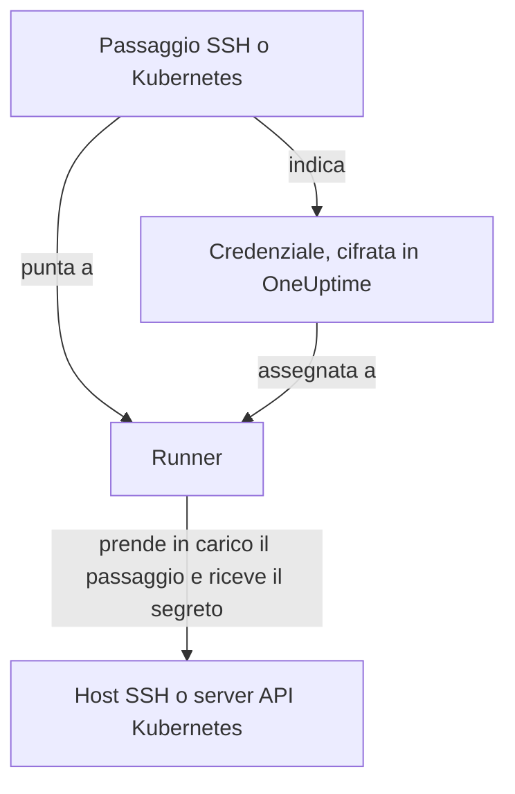

# Credenziali dei runbook

Una credenziale è il modo in cui un runbook raggiunge qualcosa che **non** è l'host stesso del Runner: un server via SSH o un cluster Kubernetes. Senza di essa, «riavvia il servizio» significa scrivere uno script di shell e mettere a mano una chiave o un kubeconfig sull'host del Runner, dove resta su disco fuori dal controllo di OneUptime. Una credenziale è quello stesso accesso come oggetto gestito: cifrata a riposo, assegnata a Runner specifici e richiamata per nome da un passaggio.

Gestiscile in **Runbook → Agenti di runbook → Credenziali**.

:::cards
- [Creare una credenziale](#creare-una-credenziale): Il suo accesso e i Runner che possono usarla.
- [Privilegio minimo dall'altra parte](#privilegio-minimo-dallaltra-parte): Limitare ciò che può fare la chiave o il token.
- [Segreti per gli script](#segreti-per-gli-script): Dare una password o un token a uno script Bash o JavaScript.
:::

## Come viene usata una credenziale



Un passaggio SSH o Kubernetes indica una credenziale e un Runner. Quando quel Runner prende in carico il passaggio, OneUptime verifica che la credenziale gli sia assegnata, decifra il segreto e lo consegna solo nella risposta a quella presa in carico. Il segreto non viene mai salvato sul lavoro e non è mai leggibile tramite l'API.

## Prima di iniziare

- **Un ruolo che gestisce le credenziali.** Project Owner e Project Admin, oppure chiunque abbia l'autorizzazione **Create Runbook Credential**. Il ruolo Runbook Admin non la include. Assegnare una credenziale SSH a un Runner che esegue i comandi di OneUptime AI richiede anche **Read Runbook Credential**; vedi [Runner che eseguono i comandi di OneUptime AI](#runner-che-eseguono-i-comandi-di-oneuptime-ai).
- **Un piano che le includa.** Su OneUptime Cloud, le credenziali dei runbook richiedono il piano **Growth** o superiore.
- **Un [Runner](/docs/runbooks/agents)** che raggiunga in rete l'host o il server API del cluster.

## Creare una credenziale

:::steps
### Apri le credenziali

Apri **Runbook → Agenti di runbook → Credenziali** e fai clic su **Crea: Runbook Credential**.

### Dagli un nome e scegli il tipo

Nel passaggio **Credential**, inserisci un **Nome**, ad esempio `prod-cluster`, una **Descrizione** facoltativa e il **Tipo**: **SSH** o **Kubernetes**. Il tipo non può essere cambiato in seguito; crea invece una nuova credenziale.

### Inserisci l'accesso

:::tabs
@tab SSH
In **Host SSH**, inserisci **Hostname**, **Porta** (22 se vuota) e **Nome utente**. In **Autenticazione SSH**, incolla una **Private Key (PEM)**, con la sua **Private Key Passphrase** se ne ha una, oppure inserisci una **Password** per un host senza accesso tramite chiave. Una chiave è l'opzione migliore quando puoi scegliere.
@tab Kubernetes
In **Kubernetes**, inserisci l'**API Server URL**, ad esempio `https://10.0.0.1:6443`, il **Service Account Token** e il **CA Certificate (PEM)** perché il Runner possa verificare il server API. Lascia vuota la CA solo se il server API presenta un certificato di cui il Runner si fida già.
:::

### Assegnala ai Runner

Nel passaggio **Agenti di runbook**, scegli i Runner che possono usare la credenziale, poi fai clic su **Crea: Runbook Credential**. Una credenziale non assegnata ad alcun Runner non può essere usata da alcun passaggio.

### Usala in un passaggio

In un [passaggio SSH o Kubernetes](/docs/runbooks/authoring#tipi-di-passaggio), scegli uno di quei Runner, poi la credenziale in **Credential**. Un passaggio offre solo credenziali del suo tipo, e salvare un passaggio che indica una credenziale richiede l'autorizzazione a leggere le credenziali dei runbook.
:::

## Cosa viene salvato

| Tipo | Campi |
| --- | --- |
| SSH | Hostname, porta (22 per impostazione predefinita), nome utente e una chiave privata PEM (con passphrase facoltativa) oppure una password. |
| Kubernetes | URL del server API, un token di service account e il certificato della CA del cluster. |

## I valori segreti sono in sola scrittura

Chiavi private, passphrase, password e token di service account sono cifrati a riposo e l'API **non li restituisce mai**: né alla dashboard, né a un workflow, né a un'esportazione. La tabella può mostrarti cosa *è* una credenziale senza mai mostrare cosa contiene.

Per questo non esiste un «visualizza» per un valore segreto, solo «sostituisci»: inserire di nuovo un valore è il modo per ruotarlo. Se perdi l'originale, emetti una nuova chiave sul sistema di destinazione e aggiorna la credenziale.

## Assegnare una credenziale ai Runner

Una credenziale può essere usata solo dai Runner a cui la assegni, e un passaggio deve puntare a uno di quei Runner. Se un passaggio indica una credenziale non assegnata al suo Runner, il passaggio **fallisce invece di essere eseguito**: un Runner che in silenzio non fa nulla sembra esattamente uno che ha funzionato.

L'assegnazione è il confine di accesso, quindi tienila stretta: un Runner che riavvia sempre e solo un cluster non ha bisogno della chiave SSH dei tuoi host di database.

### Runner che eseguono i comandi di OneUptime AI

Su un Runner con **Esegue i comandi di rimedio AI** attivo, OneUptime AI sceglie tra le credenziali SSH assegnate al Runner per i comandi che vi esegue. Per questo una credenziale SSH raggiunge un Runner del genere solo tramite qualcuno che può leggere le credenziali dei runbook (**Read Runbook Credential**, oppure un Project Owner o un Project Admin), qualunque cosa venga salvata per prima:

- **Assegnare la credenziale.** Creare una credenziale SSH con un Runner del genere, o aggiungere un Runner del genere a una credenziale, richiede quell'autorizzazione. Senza, il salvataggio viene rifiutato e indica il Runner: assegna la credenziale a Runner che non eseguono comandi di rimedio con IA, oppure chiedi a qualcuno che ha l'autorizzazione di assegnarla.
- **Attivare l'interruttore.** Attivare **Esegue i comandi di rimedio AI** su un Runner che ha credenziali SSH richiede la stessa autorizzazione.

Rimuovere Runner da una credenziale, salvare una credenziale con i Runner che ha già e le credenziali Kubernetes non chiedono altro: i comandi kubectl di OneUptime AI vengono eseguiti con la credenziale associata al loro cluster. Le assegnazioni di credenziali e l'attivazione dell'interruttore da parte di chi non ha quell'autorizzazione vengono salvate una alla volta in un progetto, così le due non possono superare insieme i loro controlli; un salvataggio che arriva mentre un altro è in corso lo attende, e se ci vuole troppo viene rifiutato con *Try again in a moment*. Salva di nuovo.

I passaggi di un workflow agiscono come Project Admin, ma non ricevono in prestito la lettura delle credenziali dei runbook di un Project Admin: un passaggio la ha solo se ce l'ha la persona che ha salvato per ultima i passaggi del workflow. Vedi [Cosa possono fare i passaggi di un workflow](/docs/workflows/configuration#cosa-possono-fare-i-passaggi-di-un-workflow).

## Privilegio minimo dall'altra parte

OneUptime non può limitare ciò che la tua credenziale può fare sul sistema di destinazione: è compito del sistema di destinazione, e vale la pena farlo:

- **SSH** — preferisci una chiave a una password, dai all'utente solo i comandi di cui ha bisogno (un comando forzato o una shell ristretta dove possibile) e non riutilizzare la chiave personale di un amministratore.
- **Kubernetes** — associa il service account a un Role che consenta `patch` esattamente sui carichi di lavoro che i tuoi runbook toccano, esattamente nei namespace in cui girano. **Restart workload** modifica il carico di lavoro stesso, e **Scale workload** modifica la sua sottorisorsa `scale`: non serve altro.

Ad esempio, un service account che può riavviare e scalare un Deployment, e nient'altro:

```yaml title="oneuptime-runbooks-rbac.yaml"
apiVersion: v1
kind: ServiceAccount
metadata:
  name: oneuptime-runbooks
  namespace: checkout
---
apiVersion: rbac.authorization.k8s.io/v1
kind: Role
metadata:
  name: oneuptime-runbooks
  namespace: checkout
rules:
  # Restart workload: patches the Deployment's pod template.
  - apiGroups: ["apps"]
    resources: ["deployments"]
    resourceNames: ["checkout-api"]
    verbs: ["patch"]
  # Scale workload: patches the Deployment's scale subresource.
  - apiGroups: ["apps"]
    resources: ["deployments/scale"]
    resourceNames: ["checkout-api"]
    verbs: ["patch"]
---
apiVersion: rbac.authorization.k8s.io/v1
kind: RoleBinding
metadata:
  name: oneuptime-runbooks
  namespace: checkout
subjects:
  - kind: ServiceAccount
    name: oneuptime-runbooks
    namespace: checkout
roleRef:
  apiGroup: rbac.authorization.k8s.io
  kind: Role
  name: oneuptime-runbooks
```

Per uno StatefulSet o un DaemonSet, usa invece `statefulsets` o `daemonsets`. Un DaemonSet non può essere scalato, quindi non ha bisogno di una regola `scale`.

## Segreti per gli script

I passaggi Bash e JavaScript non hanno un campo **Credential**. Per dare a uno script una password, un token o una chiave API senza scriverla nel runbook, salvala come **segreto di runbook**. I segreti si gestiscono in **Runbook → Impostazioni → Segreti**, da parte di Project Owner e Project Admin o con l'autorizzazione **Create Runbook Secret**.

:::steps
### Crea il segreto

Fai clic su **Crea: Runbook Secret**. Nel passaggio **Segreto**, inserisci un **Nome** (lettere, numeri, trattini e trattini bassi), una **Descrizione** facoltativa e il **Valore del segreto**. Nel passaggio **Accesso**, scegli i Runner in **Agenti Runbook che hanno accesso a questo segreto**.

### Usalo in uno script

Scrivi `{{runbookSecrets.NAME}}` dove va il valore:

```bash
curl -s -X POST \
  -H "Authorization: Bearer {{runbookSecrets.CDN_API_TOKEN}}" \
  "https://api.cdn.example.com/v1/purge"
```

Quando un Runner a cui il segreto è assegnato prende in carico il passaggio, riceve lo script con il valore già inserito.
:::

Come i campi segreti di una credenziale, il valore di un segreto è cifrato a riposo e l'API non lo restituisce mai: **Aggiorna valore segreto** lo sostituisce. Su OneUptime Cloud, anche i segreti dei runbook richiedono il piano **Growth** o superiore.

| | Credenziale | Segreto di runbook |
| --- | --- | --- |
| Usata da | Passaggi SSH e Kubernetes | Script Bash e JavaScript |
| Contiene | Un host e la sua chiave, oppure l'URL e il token di un cluster | Un qualsiasi valore singolo |
| Gestita in | **Runbook → Agenti di runbook → Credenziali** | **Runbook → Impostazioni → Segreti** |
| Raggiunge il Runner | Nella risposta alla presa in carico di un passaggio che la indica | Inserito nello script del passaggio che prende in carico |
| Rileggibile tramite l'API | Solo i suoi campi non segreti | Mai il suo valore |

## Chi può vederle

Creare, modificare ed eliminare credenziali richiede le autorizzazioni sulle credenziali dei runbook (o Project Owner/Admin). Leggere una credenziale mostra solo i suoi campi non segreti.

Tieni presente che la **chiave dell'agente** di un Runner equivale alle credenziali assegnate a quel Runner: chiunque abbia la chiave può prendere in carico lavoro come quel Runner e ricevere materiale delle credenziali. Per questo le chiavi degli agenti sono leggibili solo da Project Owner, Project Admin e Runbook Admin: trattale come tratteresti le credenziali stesse.

## Prossimi passi

:::cards
- [Scrivere un runbook](/docs/runbooks/authoring): Scrivere i passaggi SSH e Kubernetes che usano una credenziale.
- [Agenti di runbook](/docs/runbooks/agents): Installare il Runner a cui viene assegnata una credenziale.
- [Configurazione e sicurezza dei runbook](/docs/runbooks/configuration): Autorizzazioni e protezione per l'intero sistema dei runbook.
:::
