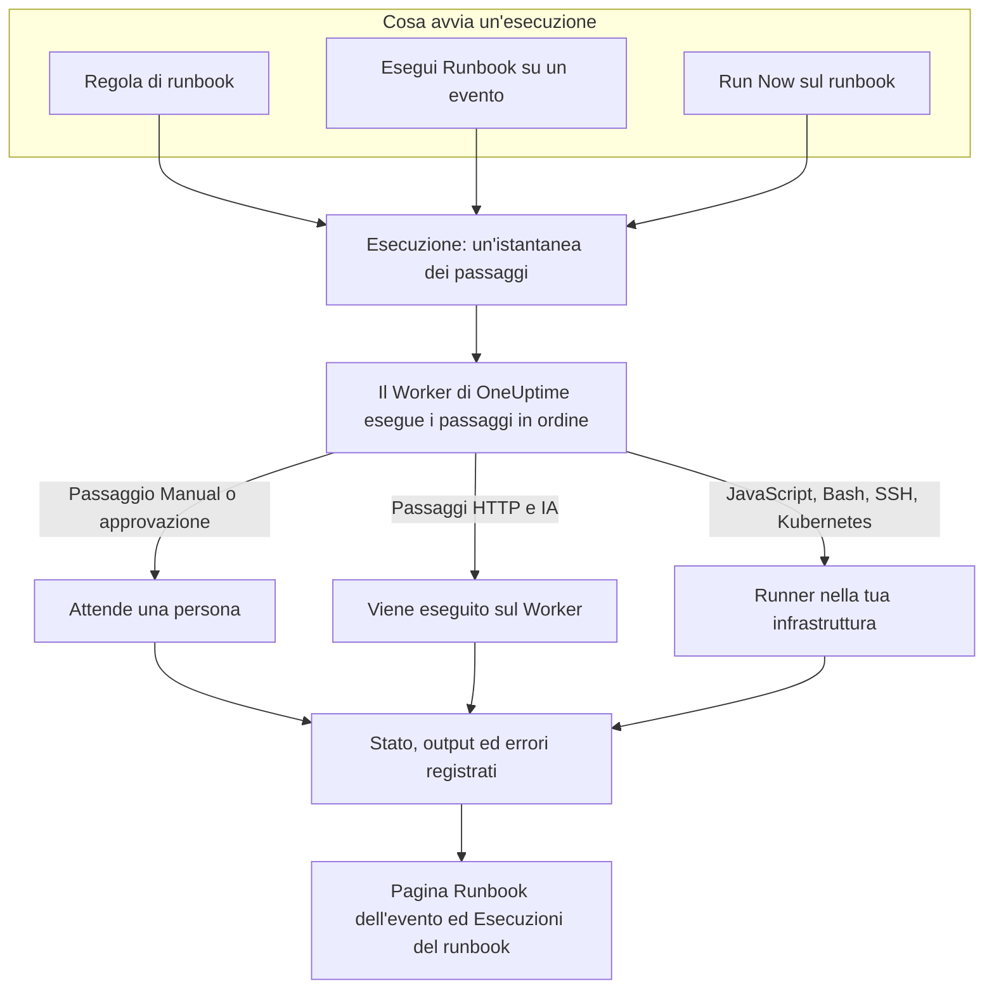

# Panoramica dei Runbook

Un runbook è una procedura di risposta riutilizzabile: un elenco ordinato di passaggi manuali e automatici che esegui su un incidente, un avviso o un evento di manutenzione programmata. Trasforma il thread «e adesso che facciamo?» in una checklist che chiunque sia reperibile può seguire alle 3 di notte, con script, chiamate API e approvazioni già scritti. I runbook sono pensati per gli ingegneri reperibili che rispondono agli incidenti e per i team di piattaforma che automatizzano quella risposta.

:::cards
- [Scrivere un runbook](/docs/runbooks/authoring): Creare un runbook e scriverne i passaggi.
- [Regole di runbook](/docs/runbooks/rules): Avviare i runbook su nuovi incidenti, avvisi ed eventi di manutenzione.
- [Eseguire un runbook](/docs/runbooks/running): Avviare un'esecuzione, completarne e approvarne i passaggi, annullarla.
- [Agenti di runbook](/docs/runbooks/agents): Installare il Runner che esegue i tuoi script nella tua infrastruttura.
:::

## Come viene eseguito un runbook



Ogni esecuzione di un runbook è un'**esecuzione**. All'avvio, i passaggi del runbook vengono copiati su di essa e OneUptime li esegue in ordine. Un passaggio Manual, o un passaggio che richiede approvazione, mette in pausa l'esecuzione finché qualcuno non agisce.

I passaggi HTTP e IA vengono eseguiti sul Worker di OneUptime. I passaggi JavaScript, Bash, SSH e Kubernetes vengono eseguiti su un [Runner](/docs/runbooks/agents) che installi nella tua infrastruttura, quindi i tuoi script non girano mai sui server di OneUptime. Lo stato, l'output e il messaggio di errore di ogni passaggio vengono registrati sull'esecuzione, che resta legata all'incidente, all'avviso o all'evento per cui è stata eseguita.

## Concetti chiave

| Termine | Significato |
| --- | --- |
| **Runbook** | Il modello. Una procedura con un nome, riutilizzabile, con un elenco ordinato di passaggi e un interruttore **Esegui questo runbook**. |
| **Passaggio** | Un elemento di un runbook. Ha un tipo (Manual, JavaScript, HTTP request, Bash, SSH, Kubernetes o AI), un titolo, una descrizione e impostazioni specifiche del tipo. |
| **Regola di runbook** | Una regola che collega automaticamente uno o più runbook agli incidenti, agli avvisi o agli eventi di manutenzione programmata che soddisfano le sue condizioni: i loro monitor, la gravità, le etichette, le etichette dei monitor, il titolo o la descrizione. |
| **Esecuzione** | Un'esecuzione di un runbook. Viene creata quando scatta una regola, quando qualcuno fa clic su **Esegui Runbook** su un evento o quando qualcuno fa clic su **Run Now** sul runbook stesso. Contiene un'istantanea dei passaggi e lo stato e l'output di ciascuno. |
| **Istantanea** | La copia congelata dei passaggi del runbook che vive su ogni esecuzione. Puoi modificare il runbook in seguito senza riscrivere la storia delle esecuzioni passate. |
| **Runner** | Un piccolo agente che esegui su un host della tua infrastruttura. Esegue i passaggi JavaScript, Bash, SSH e Kubernetes che lo indicano. Detto anche agente di runbook. |
| **Credenziale** | Accesso SSH o Kubernetes gestito, usato dai passaggi SSH e Kubernetes. Cifrata a riposo e consegnata solo ai Runner a cui la assegni. |
| **Segreto** | Un singolo valore, come un token API, che uno script Bash o JavaScript usa come `{{runbookSecrets.NAME}}`. Cifrato a riposo e consegnato solo ai Runner a cui lo assegni. |

## Tipi di passaggio

Scegli il tipo adatto a ogni passaggio. [Scrivere un runbook](/docs/runbooks/authoring) descrive le impostazioni di ogni tipo.

| Tipo di passaggio | Viene eseguito su | Usalo quando… | Esempio |
| --- | --- | --- | --- |
| **Manual** | Una persona | Una persona deve verificare qualcosa, valutare una situazione o agire dove OneUptime non può. | «Conferma che il traffico è passato alla regione secondaria.» |
| **JavaScript** | Un Runner | Ti serve un piccolo calcolo isolato, in sandbox. | Calcolare il ritardo di replica e decidere se procedere. |
| **HTTP request** | Il Worker di OneUptime | Chiami un'API esistente: un provider cloud, PagerDuty, un webhook Slack, il tuo servizio. | `POST` al tuo orchestratore di failover. |
| **Bash** | Un Runner | Ti servono comandi di shell sulla tua infrastruttura. | Eseguire `kubectl rollout restart` o uno script di ripristino. |
| **SSH** | Un Runner | Ti serve un comando su un host remoto, con una credenziale SSH gestita. | Riavviare un servizio su un server web. |
| **Kubernetes** | Un Runner | Devi riavviare o scalare un Deployment, uno StatefulSet o un DaemonSet. | Riavviare `checkout-api` in `production`. |
| **AI** | Il Worker di OneUptime | Vuoi un'analisi, un riepilogo o una valutazione durante l'esecuzione, dal provider LLM del tuo progetto. | «Esamina la diagnostica qui sopra. Il failover è sicuro?» |

Un runbook può combinarli tutti. La forza dei runbook sta nell'alternare verifiche umane, automazione e analisi dell'IA.

## Cosa avvia un'esecuzione

| Come | Dove | L'esecuzione è collegata a |
| --- | --- | --- |
| Una regola di runbook | **Incidenti**, **Avvisi** o **Manutenzione programmata** → **Regole** → **Regole di runbook** | Il nuovo incidente, avviso o evento |
| **Esegui Runbook** | La pagina **Runbook** di un incidente, un avviso o un evento di manutenzione programmata | Quell'evento |
| **Run Now** | La pagina **Panoramica** del runbook | Niente: un'esecuzione estemporanea |
| Una regola di rimedio automatico | Vedi [AI SRE](/docs/ai/ai-sre) | L'incidente o l'avviso |

Un runbook con l'interruttore **Esegui questo runbook** disattivato, nella sua pagina **Impostazioni**, non viene avviato da nessuna di queste vie. Le esecuzioni già partite proseguono.

## Dove si trovano i runbook nella dashboard

Runbook si trova in **Prodotti**, nel gruppo **Dashboard e automazione**.

| Pagina | Cosa fai lì |
| --- | --- |
| **Prodotti → Runbook** | Sfogliare, creare e aprire runbook. |
| I **Passaggi** di un runbook | Scrivere e riordinare i passaggi, poi **Save Steps**. |
| La **Panoramica** di un runbook | Vedere l'ultima esecuzione e i risultati, e fare clic su **Run Now**. |
| Le **Esecuzioni** di un runbook | Tutte le esecuzioni di questo runbook, filtrate per stato o data di inizio. |
| I **Proprietari** di un runbook | Aggiungere le persone e i team che ne sono responsabili. |
| Le **Impostazioni** di un runbook | Disattivare **Esegui questo runbook** senza eliminare il runbook. |
| **Runbook → Esecuzioni** | Tutte le esecuzioni di tutti i runbook del progetto. |
| **Runbook → Agenti di runbook** e **Runbook → Agenti di runbook → Credenziali** | Installare i [Runner](/docs/runbooks/agents) e gestire le [credenziali](/docs/runbooks/credentials). |
| **Runbook → Impostazioni** | Gestire i [segreti](/docs/runbooks/credentials#segreti-per-gli-script) per gli script, e le **Regole del proprietario** e **Regole etichette** che aggiungono proprietari ed etichette ai nuovi runbook. |
| **Incidenti / Avvisi / Manutenzione programmata → Regole → Regole di runbook** | Creare le regole che avviano automaticamente i runbook. |
| Un incidente, un avviso o un evento di manutenzione → **Runbook** | Vedere le esecuzioni collegate e fare clic su **Esegui Runbook** per avviarne una. |

## Un esempio completo

Supponi di voler fare in modo che ogni incidente con «db-primary» nel titolo avvii un runbook di failover del database in cinque passaggi.

:::steps
### Crea il runbook

In **Runbook**, fai clic su **Crea: Runbook** e chiamalo «DB primary failover». Aprilo, vai in **Passaggi**, aggiungi questi passaggi e fai clic su **Save Steps**:

| # | Tipo | Titolo |
| --- | --- | --- |
| 1 | JavaScript | Rilevare il ritardo di replica prima del failover |
| 2 | Manual | Confermare nella dashboard dei DBA che la replica è sana |
| 3 | HTTP request | `POST` all'orchestratore di failover |
| 4 | Manual | Verificare che le scritture vadano al nuovo primario |
| 5 | HTTP request | Pubblicare il cessato allarme in `#db-incidents` su Slack |

### Aggiungi una regola

In **Incidenti → Regole → Regole di runbook**, crea una regola con una condizione e il runbook da avviare:

```text
Conditions:  Incident Title starts with db-primary
Runbooks:    [DB primary failover]
```

### Lascialo eseguire

Un monitor apre l'incidente `INC-4821 · db-primary connection timeout`. La regola corrisponde e parte un'esecuzione:

- Il passaggio 1 (JavaScript) viene eseguito sul Runner che hai scelto per lui. Il suo valore di ritorno, ad esempio `{ lagMs: 412 }`, viene acquisito.
- Il passaggio 2 (Manual) mette in pausa l'esecuzione, che mostra **In attesa di te**. Chi è reperibile controlla la dashboard e fa clic su **Mark complete**.
- Il passaggio 3 (HTTP request) viene eseguito e la risposta al `POST` viene acquisita.
- Il passaggio 4 (Manual) mette di nuovo in pausa l'esecuzione finché qualcuno non lo completa.
- Il passaggio 5 (HTTP request) viene eseguito e l'esecuzione risulta **Completato**.

### Rivedilo

L'esecuzione resta nella pagina **Runbook** dell'incidente. Quando scrivi il postmortem, l'output, l'errore e i tempi di ogni passaggio sono a un clic di distanza.
:::

## Casi d'uso comuni

- **Failover del database**: acquisire lo stato con JavaScript, chiedere al DBA reperibile di confermare la salute della replica (Manual), chiamare l'orchestratore (HTTP request), confermare il DNS (Manual), pubblicare il cessato allarme (HTTP request).
- **Svuotamento della cache**: una richiesta HTTP, poi un passaggio Manual «conferma che l'hit rate della cache si sta riprendendo».
- **Incidente con impatto sui clienti**: Manual «pubblica un aggiornamento sulla pagina di stato», una richiesta HTTP per avvisare il team di supporto, JavaScript per ottenere l'elenco degli account coinvolti.
- **Verifiche prima di una manutenzione programmata**: fotografare le metriche, confermare la finestra di modifica con le parti interessate (Manual), attivare la modalità di manutenzione sul bilanciatore di carico (HTTP request).
- **Diagnosticare, poi correggere**: un passaggio Bash raccoglie la diagnostica, un passaggio IA con **Richiedi approvazione** la legge e propone una correzione, e un passaggio Kubernetes riavvia il carico di lavoro solo dopo l'approvazione di una persona.
- **Igiene da eseguire sempre**: una regola senza condizioni che acquisisce lo stato del sistema a ogni incidente, per il postmortem.

## Come si inseriscono i runbook nel resto di OneUptime

- I **monitor** aprono incidenti e avvisi, e le **regole di runbook** li trasformano in esecuzioni di runbook: rilevare, attivare, rispondere, registrare.
- Le **[politiche di reperibilità](/docs/on-call/schedules)** decidono chi viene chiamato. I runbook decidono cosa fa quella persona una volta sveglia.
- Le **[connessioni all'area di lavoro](/docs/workspace-connections/slack)** come Slack e Microsoft Teams sono destinazioni naturali per i passaggi di richiesta HTTP che pubblicano aggiornamenti.
- Le **[pagine di stato](/docs/status-pages/index)** vengono spesso aggiornate in un passaggio Manual di un runbook rivolto ai clienti.

## Prossimi passi

:::cards
- [Scrivere un runbook](/docs/runbooks/authoring): Creare il tuo primo runbook e i suoi passaggi.
- [Agenti di runbook](/docs/runbooks/agents): Installare un Runner prima di scrivere un passaggio JavaScript, Bash, SSH o Kubernetes.
- [Regole di runbook](/docs/runbooks/rules): Avviare i runbook automaticamente alla creazione degli incidenti.
- [Configurazione e sicurezza dei runbook](/docs/runbooks/configuration): Limiti, timeout, autorizzazioni e protezione.
:::
