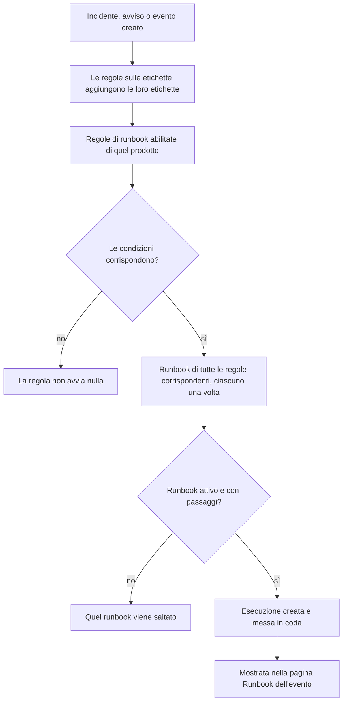

# Regole di runbook

Le regole di runbook avviano automaticamente i runbook quando viene creato un **incidente**, un **avviso** o un **evento di manutenzione programmata**, così nessuno deve ricordarsi di eseguirli nel mezzo di un disservizio. Ogni prodotto ha la sua pagina di regole, nel suo menu **Regole**:

- Incidenti → Regole → **Regole di runbook**
- Avvisi → Regole → **Regole di runbook**
- Manutenzione programmata → Regole → **Regole di runbook**

Le tre pagine modificano lo stesso tipo di regola, filtrato sulle regole di quel prodotto.

:::cards
- [Creare una regola di runbook](#creare-una-regola-di-runbook): Quattro passaggi: un nome, le condizioni e i runbook da avviare.
- [Condizioni](#condizioni): Ogni criterio e operatore che una regola può usare.
- [Logica di corrispondenza](#logica-di-corrispondenza): Più regole, condizioni sui monitor e regole sulle etichette.
- [Esempi](#esempi): Tre regole da copiare.
:::

## Come una regola avvia un runbook



Quando una regola scatta, per ogni runbook che indica:

1. Il runbook viene caricato.
2. I suoi passaggi vengono copiati come **istantanea** su una nuova esecuzione di runbook.
3. L'esecuzione viene messa nella coda del worker dei runbook.
4. L'esecuzione viene collegata all'entità di origine: compare nella pagina **Runbook** dell'incidente, dell'avviso o dell'evento di manutenzione programmata e nell'elenco **Esecuzioni** del runbook.

Puoi vedere ogni esecuzione, avviata da una regola o no, in **Runbook → Esecuzioni**, filtrata per stato, runbook o data di inizio.

## Prima di iniziare

- **Un runbook che possa essere eseguito.** Gli serve almeno un passaggio e **Esegui questo runbook** attivo, nella sua pagina **Impostazioni**. Vedi [Scrivere un runbook](/docs/runbooks/authoring).
- **L'autorizzazione a gestire le regole.** Project Owner, Project Admin e Runbook Admin creano regole di runbook, come chiunque abbia l'autorizzazione **Create Runbook Rule**.

## Creare una regola di runbook

:::steps
### Apri le regole di runbook

In **Incidenti**, **Avvisi** o **Manutenzione programmata**, apri **Regole → Regole di runbook** e fai clic su **Crea: Runbook Rule**.

### Dai un nome alla regola

In **Informazioni di base**, inserisci un **Nome**, ad esempio «Avvia il failover del DB per gli incidenti di database», e se vuoi una **Descrizione**.

### Aggiungi le condizioni

In **Criteri di corrispondenza**, fai clic su **Aggiungi condizione**, scegli un criterio e un operatore, e inserisci o scegli il valore. Aggiungi altre condizioni se ti servono e scegli **Soddisfa tutte** o **Soddisfa almeno una**. Non aggiungerne nessuna per avviare i runbook a ogni nuovo evento di questo tipo.

### Scegli i runbook

In **Runbook**, scegli uno o più **Runbook da avviare**, poi fai clic su **Crea: Runbook Rule**. La regola è attiva appena creata e compare nell'elenco con lo stato **Abilitato**.
:::

## Anatomia di una regola

| Campo | Scopo |
| --- | --- |
| **Nome** | Un'etichetta breve e chiara per la regola. |
| **Descrizione** | Contesto facoltativo per il team. |
| **Abilitato** | Attivo per una nuova regola. Disattivalo nel modulo di modifica della regola per sospenderla senza eliminarla. |
| **Condizioni** | Ciò che la regola confronta, nel passaggio **Criteri di corrispondenza**. Lascialo vuoto per corrispondere a ogni evento del suo tipo. |
| **Runbook da avviare** | Uno o più runbook da lanciare quando la regola scatta. |

## Condizioni

Ogni condizione confronta un aspetto dell'incidente, dell'avviso o dell'evento di manutenzione programmata con un valore che indichi tu. Una regola di runbook offre gli stessi criteri delle altre regole del suo prodotto: una regola di runbook per gli incidenti confronta ciò che confronta una regola di privacy o di reperibilità per gli incidenti.

| Criterio | Cosa controlla |
| --- | --- |
| **Monitor** | I monitor coinvolti dall'incidente o dall'evento di manutenzione programmata, oppure il monitor che ha generato l'avviso. |
| **Incidente Gravità** / **Avviso Gravità** | La gravità dell'incidente o dell'avviso. Gli eventi di manutenzione programmata non hanno gravità, quindi le loro regole non la offrono. |
| **Etichette dell'incidente** / **Etichette dell'avviso** / **Etichette evento** | Le etichette dell'incidente, dell'avviso o dell'evento stesso, comprese quelle che le regole sulle etichette hanno aggiunto alla creazione. |
| **Etichette del monitor** | Le etichette dei suoi monitor. Etichetta i tuoi monitor `production` o `staging` per eseguire un runbook in un solo ambiente. |
| **Titolo dell'incidente** / **Titolo dell'avviso** / **Titolo evento** | Il suo titolo. |
| **Descrizione dell'incidente** / **Descrizione dell'avviso** / **Descrizione dell'evento** | La sua descrizione. |
| **Nome del monitor** / **Descrizione del monitor** | Il nome o la descrizione dei suoi monitor. |

Scegli un operatore per ogni condizione:

- Un criterio di elenco — **Monitor**, le gravità e le etichette — usa **Ha uno qualsiasi di**, **Ha tutti i** o **Non ha nessuno di** dei valori scelti.
- Un criterio di testo usa **Contiene** (da cui parte una nuova condizione), **Non contiene**, **Uguale a**, **Diverso da**, **Inizia con**, **Termina con**, oppure **Corrisponde al pattern** / **Non corrisponde al pattern** per un'espressione regolare senza distinzione tra maiuscole e minuscole o un carattere jolly `*`. I confronti di testo ignorano maiuscole e minuscole.

Con due o più condizioni, scegli **Soddisfa tutte** (ogni condizione deve essere vera) o **Soddisfa almeno una** (almeno una deve esserlo).

## Logica di corrispondenza

- Una regola senza condizioni si applica a ogni evento del suo tipo (una regola globale «esegui sempre»).
- Più regole possono corrispondere allo stesso evento. Ogni corrispondenza scatta e viene eseguita l'unione dei loro runbook: ogni runbook ha la sua esecuzione, e un runbook indicato da due regole corrispondenti viene eseguito una sola volta.
- Le condizioni sui monitor vengono controllate un monitor alla volta. Con **Soddisfa tutte**, «**Nome del monitor** contiene `api`» e «**Etichette del monitor** ha uno qualsiasi di _Production_» richiedono un monitor che soddisfi entrambe, non un monitor per ciascuna.
- Le regole di runbook vengono eseguite dopo le regole sulle etichette, quindi un'etichetta che una regola sulle etichette aggiunge a un nuovo incidente, avviso o evento può avviare un runbook.
- Un incidente o un avviso creato già risolto non avvia alcun runbook: era finito prima di essere registrato. Vedi [Dichiarato già riconosciuto o risolto](/docs/incidents/declaring-incidents#dichiarato-già-riconosciuto-o-risolto).
- Una condizione sulla gravità di un altro prodotto — **Avviso Gravità** in una regola per gli incidenti, ad esempio — non può mai essere vera, quindi l'API rifiuta di salvarla.
- Le regole vengono valutate una sola volta, alla creazione dell'evento. Modificare in seguito il titolo, la gravità o le etichette di un incidente non fa scattare di nuovo le regole.

## Esempi

### Failover del DB per gli incidenti di database

```text
Name:        Start DB failover for DB incidents
Trigger:     Incident
Conditions:  Incident Title matches pattern (?:^|\b)(db|database|postgres|mysql|mongo)
Runbooks:    [DB failover playbook, Notify DBA team]
```

Crea due esecuzioni di runbook ogni volta che viene creato un incidente con «db», «database», «postgres» e così via nel titolo.

### Solo per gli incidenti critici di produzione

```text
Name:        Flush the CDN cache for critical production incidents
Trigger:     Incident
Conditions:  Match all
             Monitor Labels has any of Production
             Incident Severities has any of Critical
Runbooks:    [Flush CDN cache]
```

Viene eseguita per un incidente critico su un monitor con etichetta _Production_, e per nulla in staging.

### Regola di igiene sempre attiva

```text
Name:        Always-run pre-flight check
Trigger:     Incident
Conditions:  (none)
Runbooks:    [Capture pre-incident state]
```

Scatta a ogni incidente: utile per acquisire istantanee dello stato del sistema, metriche e simili per il postmortem.

## Runbook disattivati

Se una regola indica un runbook disattivato (**Esegui questo runbook** disattivato nella pagina **Impostazioni** del runbook, `isEnabled = false`), la regola corrisponde comunque ma l'esecuzione del runbook viene saltata. Riattiva l'interruttore per riprendere. Un runbook senza passaggi viene saltato allo stesso modo.

## Provare una regola

Prima di affidarti a una regola in produzione, crea un incidente (o un avviso) di prova che soddisfi le condizioni della regola e verifica che i runbook attesi compaiano nella sua pagina **Runbook**.

> [!NOTE]
> Le regole di runbook agiscono solo sui nuovi eventi. A differenza delle regole su etichette e proprietari, non possono essere [applicate ai record esistenti](/docs/configuration/run-rules-now): avvierebbero runbook per incidenti già conclusi.

## Risoluzione dei problemi

:::details Una regola ha corrisposto, ma non è stato eseguito alcun runbook
Controlla, in quest'ordine:

- La regola è **Abilitato**.
- Ogni runbook ha **Esegui questo runbook** attivo, nella sua pagina **Impostazioni**, e almeno un passaggio salvato.
- L'incidente o l'avviso non è stato creato già risolto.
- L'esecuzione del runbook non sta semplicemente aspettando: aprila dalla pagina **Runbook** dell'evento. Un passaggio Manual o un'approvazione mostra **In attesa di te**.
:::

:::details Una regola non corrisponde mai
Le regole vedono l'evento così come è stato creato, con le etichette che le regole sulle etichette hanno aggiunto in quel momento. Un'etichetta, una gravità o un titolo cambiati dopo non vengono visti. Con più condizioni, verifica **Soddisfa tutte** rispetto a **Soddisfa almeno una**, e ricorda che le condizioni sui monitor devono essere tutte vere per uno stesso monitor.
:::

:::details L'API rifiuta una regola con "can only be used by"
Un criterio di gravità appartiene a un solo prodotto. **Avviso Gravità** in una regola per gli incidenti, o **Incidente Gravità** in una regola per gli avvisi, non potrebbe mai corrispondere, quindi la regola viene rifiutata con un messaggio come "Alert Severities can only be used by alert runbook rules." Rimuovi quella condizione. La dashboard offre solo i criteri propri di ogni prodotto.
:::

## Prossimi passi

:::cards
- [Eseguire un runbook](/docs/runbooks/running): Cosa vede chi interviene quando una regola avvia un'esecuzione.
- [Scrivere un runbook](/docs/runbooks/authoring): Scrivere i runbook che le tue regole avviano.
- [Dichiarare un incidente](/docs/incidents/declaring-incidents): Come vengono creati gli incidenti e quando le regole li vedono.
:::
