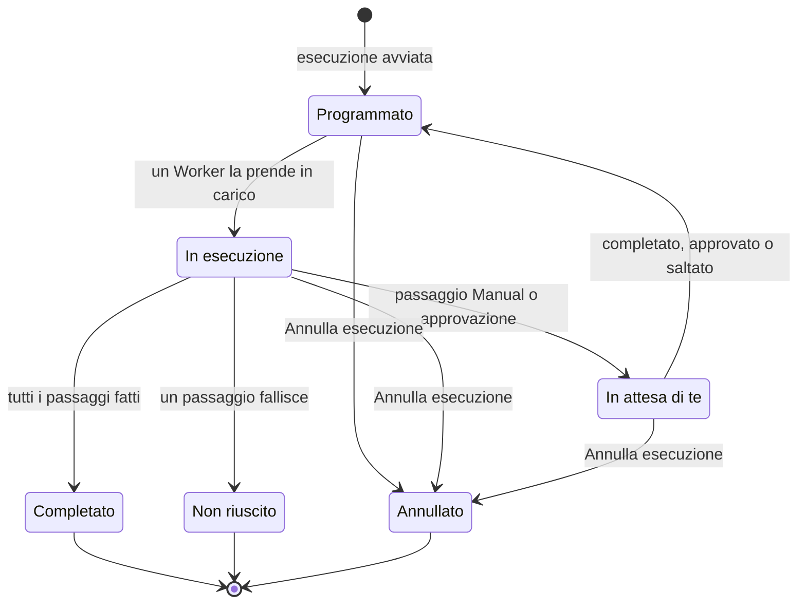

# Eseguire un runbook

Ogni esecuzione di un runbook è un'**esecuzione**: un'istantanea dei passaggi del runbook, eseguiti in ordine, con lo stato e l'output di ogni passaggio registrati. Questa pagina è per chi interviene e avvia le esecuzioni e le porta avanti: come parte un'esecuzione, cosa mostra la pagina dell'esecuzione e come completare, approvare, saltare e annullare i passaggi.

:::cards
- [Avviare un'esecuzione](#avviare-unesecuzione): Da un incidente, un avviso o un evento, oppure dal runbook stesso.
- [La vista dell'esecuzione](#la-vista-dellesecuzione): Cosa mostra ogni passaggio mentre un'esecuzione è in corso.
- [Completare, approvare e saltare i passaggi](#completare-approvare-e-saltare-i-passaggi): Quale passaggio accetta una decisione, e quando.
- [Risoluzione dei problemi](#risoluzione-dei-problemi): Esecuzioni che non partono o non finiscono.
:::

## Come avanza un'esecuzione

Una nuova esecuzione è **Programmato** finché un Worker non la prende in carico e la segna **In esecuzione**. Si mette in pausa come **In attesa di te** su un passaggio Manual, o dopo un passaggio che richiede approvazione, e torna in coda appena qualcuno agisce. Un'esecuzione che attende una persona non scade mai. Termina come **Completato**, **Non riuscito** o **Annullato**.

## Avviare un'esecuzione

Un'esecuzione di runbook viene creata in tre modi:

1. **Automaticamente tramite una regola**: una [regola di runbook](/docs/runbooks/rules) la avvia quando viene creato un incidente, un avviso o un evento di manutenzione programmata corrispondente. Anche una regola di rimedio automatico può avviarne una; vedi [AI SRE](/docs/ai/ai-sre).
2. **Manualmente da un evento**: fai clic su **Esegui Runbook** su un incidente, un avviso o un evento di manutenzione programmata. L'esecuzione è collegata a quell'evento.
3. **Manualmente dalla pagina del runbook**: fai clic su **Run Now** nella pagina **Panoramica** di un runbook. L'esecuzione non è collegata ad alcun incidente, avviso o evento di manutenzione programmata.

Per avviarne una a mano:

:::tabs
@tab Da un evento
1. Apri l'incidente, l'avviso o l'evento di manutenzione programmata e vai alla sua pagina **Runbook**.
2. Fai clic su **Esegui Runbook**. La finestra **Esegui un Runbook** elenca i runbook del progetto attivi.
3. Fai clic su **Run** accanto al runbook. L'esecuzione compare nell'elenco dell'evento: fai clic su **Visualizza** per aprirla.
@tab Dal runbook
1. Apri il runbook da **Runbook**.
2. Nella sua **Panoramica**, fai clic su **Run Now**.
3. Si apre la pagina dell'esecuzione.
:::

Avviare un'esecuzione richiede Project Owner, Project Admin, Project Member, Runbook Admin o Runbook Member, oppure l'autorizzazione **Create Runbook Execution**. Runbook Viewer e Viewer vedono **Run Now** bloccato, con il motivo. Vedi [Autorizzazioni](/docs/runbooks/configuration#autorizzazioni).

## La vista dell'esecuzione

Apri un'esecuzione qualsiasi per vederne la checklist. In alto la pagina mostra lo **Stato** dell'esecuzione, il suo **Progress** (passaggi fatti sul totale), **Iniziata** (quando è partita) e **Attivato da** (cosa l'ha avviata). Ogni passaggio mostra:

- **Etichetta di stato** — In sospeso, In esecuzione, In attesa di te, Fatto, Saltato, Non riuscito o Annullato.
- **Titolo e descrizione** — copiati dal runbook al momento dell'esecuzione.
- **Output** (comprimibile) — stdout, valori di ritorno, risposte HTTP o la risposta dell'IA.
- **Messaggio di errore** se il passaggio è fallito.
- Sul passaggio che l'esecuzione attende: **Mark complete** (un passaggio Manual) o **Approve & continue** (un passaggio con **Richiedi approvazione**), e **Salta**.
- Mentre l'esecuzione è in pausa, **Salta** sui passaggi automatici successivi che non richiedono approvazione.

Mentre l'esecuzione è in corso, la pagina si aggiorna da sola ogni 30 secondi. Fai clic su **Aggiorna** per vedere subito lo stato più recente.

## Completare, approvare e saltare i passaggi

Solo il passaggio che l'esecuzione attende può essere segnato come completato, approvato o saltato per far proseguire l'esecuzione. Un passaggio Manual o un passaggio con **Richiedi approvazione** non può essere spuntato o saltato prima che l'esecuzione lo raggiunga: il suo compito è fermare l'esecuzione, quindi accetta una decisione solo quando l'esecuzione è arrivata lì (per un'approvazione, quando il passaggio è stato eseguito e puoi vederne l'output).

Mentre l'esecuzione è in pausa, puoi anche saltare un passaggio automatico successivo che non richiede approvazione, così non verrà eseguito quando l'esecuzione riprende. L'esecuzione resta in pausa sul passaggio che ti attende. Non puoi saltare mentre ci sono passaggi in esecuzione: attendi la pausa o annulla l'esecuzione. Ogni passaggio registra chi l'ha completato o saltato.

| Il passaggio | Completare o approvare | Saltare |
| --- | --- | --- |
| Quello che l'esecuzione attende | Sì | Sì |
| Un passaggio automatico successivo, senza **Richiedi approvazione** | No | Sì, mentre l'esecuzione è in pausa |
| Un passaggio Manual successivo, o uno con **Richiedi approvazione** | No | No |
| Qualsiasi passaggio, mentre ci sono passaggi in esecuzione | No | No |

Completare, approvare, saltare e annullare richiedono gli stessi ruoli dell'avvio di un'esecuzione, oppure l'autorizzazione **Edit Runbook Execution**.

## Alternare passaggi manuali e automatici

Il flusso classico:

| # | Passaggio | Cosa succede |
| --- | --- | --- |
| 1 | Bash: acquisire lo stato del sistema | Viene eseguito sul suo Runner appena parte l'esecuzione. |
| 2 | Manual: «Avvisa i clienti con il banner della pagina di stato.» | L'esecuzione si mette in pausa finché qualcuno non fa clic su **Mark complete**. |
| 3 | HTTP request: chiamare il DBA tramite PagerDuty | Viene eseguito sul Worker. |
| 4 | Manual: «Conferma che il database secondario è ora il primario.» | L'esecuzione si rimette in pausa. |
| 5 | HTTP request: pubblicare il cessato allarme su un webhook Slack | Viene eseguito e l'esecuzione risulta **Completato**. |

I passaggi 2 e 4 mettono in pausa l'esecuzione finché qualcuno non li spunta. I passaggi 1, 3 e 5 vengono eseguiti automaticamente. L'intera esecuzione è un'unica esecuzione, un'unica cronologia e un'unica fonte di verità.

## Annullare un'esecuzione

Fai clic su **Annulla esecuzione** nella pagina dell'esecuzione. Lo stato diventa `Cancelled` e nessun passaggio successivo parte. Un passaggio già in esecuzione non viene interrotto, ma il suo risultato non viene registrato: il passaggio resta `Cancelled`. I lavori che attendono ancora un Runner vengono annullati; un Runner che sta già eseguendo uno script lo porta a termine, ma il suo risultato non viene accettato.

## Limiti dell'output

L'output di ogni passaggio è limitato a **50 KB**, così uno script fuori controllo non gonfia il database. L'output più lungo viene troncato con un marcatore. Se ti servono artefatti più grandi, scrivili dallo script in uno storage di oggetti o in un sistema di log e metti l'URL nell'output.

## Rieseguire un runbook

Un'esecuzione è un record unico e immutabile. Per eseguire di nuovo il runbook, fai clic su **Esegui di nuovo** su un'esecuzione terminata, oppure su **Run Now** sul runbook. Entrambi creano una nuova esecuzione con i passaggi attuali del runbook, non collegata ad alcun evento. Per rieseguirlo su un incidente, usa **Esegui Runbook** nella pagina **Runbook** dell'incidente. L'esecuzione originale resta intatta per la traccia di controllo.

## Trovare le esecuzioni passate

| Dove | Cosa elenca |
| --- | --- |
| Le **Esecuzioni** di un runbook | Tutte le esecuzioni di quel runbook, con filtri per stato e data di inizio, e una colonna **Attivato da**. |
| **Runbook → Esecuzioni** | Tutte le esecuzioni di tutti i runbook del progetto. |
| La pagina **Runbook** di un incidente, un avviso o un evento | Le esecuzioni collegate. Anche la panoramica dell'evento le mostra, appena ce n'è qualcuna. |

## Risoluzione dei problemi

:::details Run Now è bloccato
Il tuo ruolo legge i runbook ma non li esegue: il pulsante dice «Non hai l'autorizzazione per avviare esecuzioni di runbook in questo progetto.» Chiedi Runbook Member oppure l'autorizzazione **Create Runbook Execution**.
:::

:::details L'avvio di un'esecuzione fallisce con "Runbook is disabled" o "Runbook has no steps to run"
L'interruttore **Esegui questo runbook** del runbook è disattivato, nella sua pagina **Impostazioni**, oppure il runbook non ha passaggi salvati. Attiva l'interruttore, oppure aggiungi passaggi e fai clic su **Save Steps**.
:::

:::details Un passaggio è fallito perché gli manca un Runner o una credenziale
Il messaggio dice, ad esempio, "Bash step is missing a Runner. Pick one under Runbooks → Runners." Il passaggio è stato salvato senza **Runner**, oppure un passaggio SSH o Kubernetes senza **Credential**. Apri i **Passaggi** del runbook, scegli ciò che manca al passaggio, fai clic su **Save Steps** ed esegui di nuovo il runbook.
:::

:::details Un passaggio è fallito perché nessun agente di runbook l'ha preso in carico
Il messaggio dice "No runbook agent picked up this step before the wait window expired." Il Runner del passaggio non ha preso in carico il lavoro entro il suo claim timeout. Verifica in **Runbook → Agenti di runbook** che il Runner sia **Connesso** e che **Esegue i runbook** sia attivo. Vedi [Agenti di runbook](/docs/runbooks/agents#risoluzione-dei-problemi).
:::

:::details L'esecuzione aspetta da ore
Un'esecuzione che attende una persona non scade mai. Aprila e agisci sul passaggio segnato **In attesa di te**, oppure fai clic su **Annulla esecuzione**.
:::

:::details Un passaggio dice che potrebbe essere stato eseguito in parte
Il Worker di OneUptime che eseguiva il passaggio si è riavviato o ha smesso di rispondere, e l'esecuzione è stata segnata come non riuscita invece di restare in corso. Controlla il sistema di destinazione prima di eseguire di nuovo il runbook.
:::

## Prossimi passi

:::cards
- [Scrivere un runbook](/docs/runbooks/authoring): Aggiungere passaggi Manual e approvazioni dove deve decidere una persona.
- [Regole di runbook](/docs/runbooks/rules): Avviare le esecuzioni automaticamente sui nuovi incidenti.
- [Agenti di runbook](/docs/runbooks/agents): Tenere online i Runner di cui hanno bisogno i tuoi passaggi.
:::
