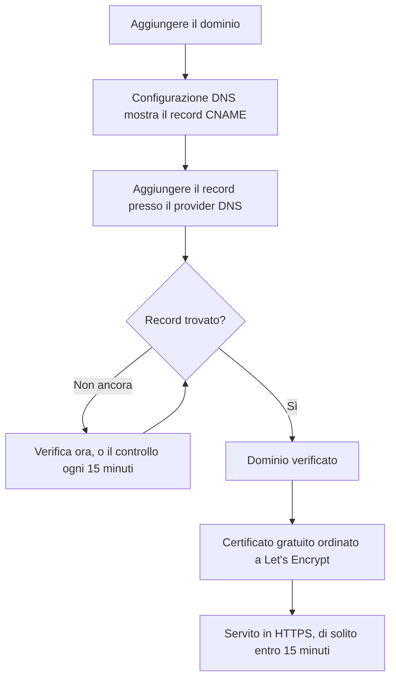

# Branding e domini della pagina di stato

La vostra pagina di stato è l'unica schermata di OneUptime che guardano i vostri clienti, quindi dovrebbe somigliarvi e stare sul vostro dominio, come `status.yourcompany.com`. Questa pagina percorre la pagina **Branding** scheda per scheda, poi porta la pagina di stato sul vostro dominio: aggiungete il dominio, aggiungete un record DNS e il certificato SSL gratuito arriva da solo.

:::cards
- [La pagina Branding](#la-pagina-branding): Logo, titolo, favicon, link, footer, colori e lingue.
- [HTML, CSS e JavaScript personalizzati](#html-css-e-javascript-personalizzati): Tutto ciò che le impostazioni integrate non coprono.
- [Domini personalizzati](#domini-personalizzati): Il vostro nome host, con un certificato gratuito.
- [La colonna Stato](#leggere-la-colonna-stato-del-dominio): A che punto è ogni dominio sulla strada verso HTTPS.
:::

## Dove si trova ogni impostazione di branding

Aprite una pagina di stato: la sezione **Branding** del suo menu laterale ha tre voci:

| Pagina | Cosa impostate lì |
| ---- | ------------------ |
| **Branding** | Logo e immagine di copertina, titolo e descrizione della pagina, favicon, link dell'intestazione, descrizione della pagina panoramica, riga del copyright e link del footer. Chiusi in **Altre impostazioni**: i colori del grafico della cronologia, le lingue e l'indicizzazione nei motori di ricerca. |
| **Domini personalizzati** | Il vostro dominio, il suo record DNS e il suo certificato SSL gratuito. |
| **HTML, CSS e JavaScript** | HTML dell'intestazione, HTML del footer, CSS personalizzato, JavaScript personalizzato. |

Tre cose che sembrano branding si trovano invece in **Pagine di stato → la vostra pagina → Avanzato → Impostazioni avanzate** (`{id}/settings`), perché decidono cosa mostra la pagina e non il suo aspetto: la percentuale di uptime complessiva, quali stati dei monitor contano contro l'uptime e la riga «Powered by OneUptime». Tutte e tre sono righe della scheda **Cosa mostra la tua pagina di stato** di quella schermata.

Il branding era un tempo diviso tra schermate separate **Branding essenziale**, **Intestazione**, **Footer**, **Pagina panoramica** e **Lingue**. I loro vecchi indirizzi (`{id}/header-style`, `{id}/footer-style`, `{id}/overview-page-branding` e `{id}/languages`) ora aprono la pagina **Branding**, quindi i vecchi segnalibri e link continuano a funzionare.

## La pagina Branding

**Pagine di stato → la vostra pagina → Branding → Branding** (`{id}/branding`). Ogni scheda si salva per conto proprio. Dopo il logo, il titolo e la favicon, le schede seguono la vostra pagina di stato dall'alto in basso: i link dell'intestazione, il testo in cima alla panoramica, poi il footer. Quello che pochi cambiano è chiuso in **Altre impostazioni**, in fondo.

### Logo e immagine di copertina

La prima scheda, **Logo e immagine di copertina**, ha un pulsante **Edit Images** che apre due passaggi:

| Passaggio | Campi |
| ---- | ------ |
| **Logo** | Il caricamento del logo (segnaposto `Upload logo`) e **Logo Alt Text** (segnaposto `Logo of My Company`). Lasciate vuoto il testo alternativo e verrà usato il titolo della pagina di stato. |
| **Immagine di copertina** | **Copertina**, un caricamento (segnaposto `Upload cover image`) per l'ampio banner dietro l'intestazione, e **Cover Image Alt Text**. Lasciate vuoto il testo alternativo se la copertina è puramente decorativa. |

Il logo, l'immagine di copertina e la favicon sono file caricati nel progetto stesso della pagina di stato, e questo viene verificato a ogni salvataggio, dalla dashboard, dall'API, da Terraform o da un workflow. Un file caricato in un altro progetto viene rifiutato con le stesse parole di un file che non esiste più: "The logo's file could not be found. Upload the logo again.", "The cover image's file could not be found. Upload the cover image again." oppure "The favicon's file could not be found. Upload the favicon again." Caricare di nuovo l'immagine dalla pagina risolve il problema.

La vostra pagina di stato mostra solo immagini del proprio progetto; un'immagine che non può mostrare viene omessa, come se la pagina non ne avesse. La dashboard, l'API e Terraform leggono le immagini della pagina allo stesso modo: un'immagine di un altro progetto torna come nessuna immagine. Le email che la pagina invia (agli iscritti, e agli utenti privati riguardo al loro accesso) mostrano il suo logo allo stesso modo: un logo che la pagina non può mostrare viene omesso anche da esse, invece di comparire come immagine rotta.

### Titolo, descrizione e favicon

- **Titolo e descrizione**: la scheda indica che viene usato anche per la SEO. **Modifica** apre **Titolo della pagina** (segnaposto `Please enter page title here.`) e **Descrizione della pagina**. Motori di ricerca e anteprime dei link li mostrano, quindi scriveteli per un cliente, non per il vostro team.
- **Favicon**: **Edit Favicon** apre il caricamento **Favicon**: la piccola icona nella scheda del browser.

### Link dell'intestazione

La tabella **Link intestazione** contiene i link nell'intestazione della pagina di stato, come il vostro sito, la vostra documentazione o un portale di supporto. Ogni link ha un **Titolo** e un **Collegamento** (un URL, segnaposto `https://link.com`), e li riordinate trascinandoli. Senza link, la tabella dice **Nessun link nell'intestazione per questa pagina di stato**, con **Crea: Pagina di stato Intestazione Link** sotto.

### Descrizione della pagina panoramica

**Descrizione della pagina panoramica** è la prima cosa nella panoramica della pagina di stato, sopra gli annunci, lo stato generale e le vostre risorse. **Modifica descrizione** apre un campo Markdown. Usatelo per una frase di contesto: cosa copre questa pagina e a chi rivolgersi per il supporto. Un'immagine che ci mettete viene mostrata a ogni visitatore della pagina.

### Footer

- **Informazioni sul copyright**: **Edit Copyright** apre un campo, **Informazioni sul copyright**, con il segnaposto `Acme, Inc.`.
- **Link del footer**: la stessa coppia **Titolo** e **Collegamento** dei link dell'intestazione, ordinati trascinandoli. Senza link, dice «Nessun link a piè di pagina per questa pagina di stato.»

I link dell'intestazione servono alla navigazione; quelli del footer alle clausole, come note legali, privacy e termini.

### Altre impostazioni

L'ultima sezione della pagina è chiusa in **Altre impostazioni**, perché pochi cambiano ciò che contiene. Chiusa, la sua intestazione nomina le sue quattro sezioni (**Colore predefinito della barra**, **Regole per il colore delle barre**, **Lingue** e **Indicizzazione nei motori di ricerca**) e mostra ciascuna di quelle che differiscono da come parte una nuova pagina di stato: un colore predefinito della barra diverso dal verde con cui parte ogni pagina, qualsiasi regola di colore delle barre, una lingua predefinita diversa dall'inglese, un elenco di lingue più corto o l'indicizzazione disattivata. Fateci clic per aprirla: è un'unica scheda, con le quattro sezioni una sotto l'altra, ciascuna con il proprio titolo e il proprio pulsante, separate da divisori.

**Colori del grafico della cronologia.** Sono le uniche impostazioni di colore integrate di una pagina di stato.

- **Colore predefinito della barra del grafico cronologico**: **Edit Default Bar Color** apre il selettore **Colore predefinito della barra**. Ogni nuova pagina di stato parte con il verde. Con le regole di colore, è anche il colore di un giorno a cui non si applica alcuna regola. Un giorno di cui la pagina non ha dati viene sempre disegnato in grigio.
- **Rules for Bar Colors of History Chart**: una tabella ordinata di regole che ordinate trascinandole. Ogni regola ha **Quando la % di uptime è maggiore o uguale a** e **Quindi, usa questo colore della barra**; le colonne della tabella dicono `When Uptime Percent >=` e `Then, Bar Color is`. Il colore di una nuova regola è già scelto, uno che le altre regole non usano ancora; scegliete invece quello che volete. L'ordine conta, quindi disponete le regole nell'ordine in cui volete che vengano valutate. Senza regole, la barra di ogni giorno prende il colore dello stato del monitor più basso di quel giorno.

Quanti giorni copre il grafico non si imposta qui. È **Cronologia uptime** nella scheda **Cosa mostra la tua pagina di stato** in **Avanzato → Impostazioni avanzate**, da 1 a 90 giorni. Quali stati dei monitor contano come inattività è **Conta come inattività**, nella stessa riga di quella scheda.

**Lingue.** La sezione **Lingue** imposta il selettore della lingua che i visitatori trovano nel footer della pagina. **Modifica lingue** apre due campi:

| Campo | Cosa fa |
| ----- | ------------ |
| **Lingua predefinita** | La lingua che vedono i visitatori alla prima visita, scelta da un elenco che nomina ogni lingua nella sua grafia e in inglese (`Deutsch (German)`). È l'inglese per impostazione predefinita, e i visitatori possono sempre cambiarla dal footer. |
| **Lingue abilitate** | Una selezione multipla, segnaposto `All languages`. Lasciatela vuota e vengono offerte tutte le lingue supportate; sceglietene alcune e il footer elenca solo quelle. |

OneUptime include diciassette lingue: inglese, tedesco, francese, spagnolo, italiano, portoghese, olandese, danese, norvegese, svedese, russo, giapponese, coreano, cinese (semplificato), cinese (tradizionale), hindi e persiano.

**Indicizzazione nei motori di ricerca.** Un interruttore, **Consenti ai motori di ricerca di indicizzare questa pagina di stato**, decide se Google, Bing e gli altri motori di ricerca possono elencare la pagina. È attivo per impostazione predefinita. Non c'è un pulsante **Modifica**: l'interruttore si salva nel momento in cui lo spostate. Disattivatelo e la pagina viene servita con `noindex, nofollow` (un meta tag robots e un'intestazione `X-Robots-Tag`); chiunque abbia il link può comunque aprirla. I motori di ricerca possono metterci qualche settimana a togliere una pagina già indicizzata.

> [!TIP]
> Disattivate **Consenti ai motori di ricerca di indicizzare questa pagina di stato** finché una pagina è solo interna o ancora in fase di configurazione, così una pagina a metà non inizia a posizionarsi per il nome del vostro marchio.

## Percentuale di uptime e stati di inattività

Entrambi si trovano nella riga **Cronologia uptime** della scheda **Cosa mostra la tua pagina di stato**, in **Pagine di stato → la vostra pagina → Avanzato → Impostazioni avanzate** (`{id}/settings`). Non c'è un pulsante **Modifica**: ciascuno si salva nel momento in cui lo cambiate.

- **Mostra percentuale di uptime complessiva**: un interruttore, disattivo per impostazione predefinita. Finché è attivo, **Precisione** accanto sceglie quanti decimali mostra la percentuale: `99%`, `99.9%`, `99.99%` (il predefinito) o `99.999%`. Su OneUptime Cloud, attivare la percentuale richiede il piano **Scale**; la sua precisione si può cambiare con ogni piano.
- **Conta come inattività**: gli stati dei monitor, come chip colorati, il cui tempo conta contro l'uptime su questa pagina. Qui decidete, per esempio, se uno stato degradato conta contro l'uptime. Almeno uno stato resta sempre selezionato.

Un tempo erano due schede a sé, **Percentuale di uptime complessiva** e **Stati del monitor per i tempi di inattività**, ciascuna dietro un pulsante **Modifica**. Vedete [Panoramica delle pagine di stato](/docs/status-pages/index#scegliere-che-cosa-compare-sulla-pagina) per il resto della scheda.

## HTML, CSS e JavaScript personalizzati

**Pagine di stato → la vostra pagina → Branding → HTML, CSS e JavaScript** (`{id}/custom-code`) ha quattro schede, ciascuna modificata per conto proprio e salvata in una colonna della pagina di stato:

| Scheda | Colonna | Cosa contiene |
| ---- | ------ | ------------- |
| **HTML intestazione** | `headerHTML` | HTML aggiunto all'intestazione della pagina (segnaposto `Insert Custom HTML here.`). |
| **HTML del footer** | `footerHTML` | HTML aggiunto al footer della pagina. |
| **CSS personalizzato** | `customCSS` | Stili per tutta la pagina (segnaposto `Insert Custom CSS here.`). |
| **JavaScript personalizzato** | `customJavaScript` | Uno script che la pagina esegue (segnaposto `Insert Custom JavaScript here.`). |

> [!IMPORTANT]
> HTML, CSS e JavaScript personalizzati vengono serviti solo su un dominio personalizzato verificato. Sono disattivati sull'indirizzo predefinito `/status-page/:id`, perché quell'indirizzo condivide l'origine con accesso effettuato di OneUptime.

Su OneUptime Cloud, aggiungerne o modificarne uno richiede il piano **Growth**. Svuotarli funziona con ogni piano, quindi il codice personalizzato aggiunto durante una prova si può sempre rimuovere.

**Non c'è un selettore di tema.** Le pagine di stato di OneUptime non hanno un'impostazione di tema o di colore del marchio: le uniche impostazioni di colore integrate, ovunque, sono **Colore predefinito della barra** e le regole di colore delle barre del grafico della cronologia, in **Altre impostazioni** nella pagina **Branding**. Caratteri, colori di sfondo, colori di accento e ritocchi del layout passano tutti da **CSS personalizzato**. Se stavate cercando un campo «colore del marchio», questa è la risposta: non esiste, e questa casella è il modo per farlo.

> [!WARNING]
> Il JavaScript personalizzato viene eseguito nei browser dei vostri visitatori, su una pagina che si apre proprio quando si pensa che qualcosa sia rotto. Mantenetelo piccolo, ospitate voi stessi ciò che carica quando potete, e provatelo prima di farci affidamento.

## Domini personalizzati

Per impostazione predefinita, una pagina di stato è raggiungibile all'URL di anteprima mostrato nella sua schermata **Panoramica**. Per portarla sul vostro nome host, andate in **Pagine di stato → la vostra pagina → Branding → Domini personalizzati** (`{id}/domains`).

La scheda **Domini personalizzati** dice cosa fare: fate puntare il record CNAME di ogni dominio al record CNAME delle pagine di stato della vostra installazione, e OneUptime emette il certificato SSL del dominio e lo rinnova per voi. Quando non c'è nulla di configurato, la tabella dice **Nessun dominio personalizzato trovato**, con **Crea: Pagina di stato Dominio** sotto. La tabella ha due colonne, **Dominio** e **Stato**, e filtri per **Dominio**, **CNAME valido** e **SSL provisionato**.

Portare la pagina sul vostro dominio richiede tre passaggi, e solo i primi due spettano a voi:

1. **Aggiungere il dominio**: un sottodominio e uno dei vostri domini verificati.
2. **Aggiungere il suo record CNAME** presso il vostro provider DNS. La finestra di dialogo **Configurazione DNS** mostra il record appena aggiungete il dominio.
3. **Il certificato SSL gratuito viene emesso automaticamente** non appena il record viene trovato. Non c'è nessun pulsante da premere.



### Prima di iniziare

- **Il dominio padre deve essere verificato.** L'elenco **Dominio** mostra solo i domini verificati in **Impostazioni del progetto → Domini**, dove dimostrate con un record TXT che un dominio è vostro. Il link **Aggiungi un dominio** accanto al campo apre quella pagina in una nuova scheda.
- **La vostra installazione ha bisogno di un record CNAME per le pagine di stato.** OneUptime Cloud ne ha uno. In un'installazione self-hosted, impostatelo su un nome host che punta al vostro server OneUptime (un record A), e assicuratevi che il server risponda sulla porta 80, dove Let's Encrypt lo verifica. Senza di esso, la scheda e la finestra di dialogo **Configurazione DNS** dicono «Custom Domains not enabled for this OneUptime installation» invece di mostrare un record.

:::tabs
@tab Docker Compose
```ini title="config.env"
STATUS_PAGE_CNAME_RECORD=oneuptime.yourcompany.com
```
@tab Kubernetes
```yaml title="values.yaml"
statusPage:
  cnameRecord: oneuptime.yourcompany.com
```
:::

### Aggiungere il dominio

:::steps
#### Aprire Crea: Pagina di stato Dominio

In **Domini personalizzati**, fate clic su **Crea: Pagina di stato Dominio**. La finestra di dialogo è una sola pagina.

#### Inserire il sottodominio

In **Sottodominio** (segnaposto `status (leave blank for root)`), inserite solo l'etichetta, come `status`, non il nome host completo. Lasciatelo vuoto, o inserite `@`, per usare il dominio radice (apex).

#### Scegliere il dominio

In **Dominio** (segnaposto `Select domain`), scegliete uno dei vostri domini verificati. Un dominio che non avete verificato non compare, perché verrebbe rifiutato.

#### Tenere il certificato gratuito o caricare il vostro

**Altri campi** è chiuso, e la sua intestazione dice quale certificato userà il dominio: «Emettiamo un certificato SSL gratuito per questo dominio e lo rinnoviamo automaticamente.» Apritelo solo per usare un certificato vostro: attivate **Carica certificato personalizzato**, poi incollate il **Certificato** e la **Chiave privata del certificato** in formato PEM. Entrambi diventano allora obbligatori.

#### Creare il dominio

Fate clic su **Crea: Pagina di stato Dominio**. La finestra di dialogo si chiude e si apre la **Configurazione DNS** del nuovo dominio, con il record da aggiungere.
:::

Il nome completo di un dominio viene fissato quando lo aggiungete, quindi **Modifica** cambia solo il suo certificato. Per usare un altro sottodominio, aggiungete quel dominio ed eliminate quello vecchio.

### Configurazione DNS e verifica

La finestra di dialogo **Configurazione DNS** mostra il record da aggiungere presso il vostro provider DNS, un campo per riga, ciascuno con un pulsante per copiarlo:

| Campo | Cosa inserire |
| ----- | ------------- |
| **Tipo** | `CNAME` |
| **Nome** | Il dominio completo che avete aggiunto, per esempio `status.yourcompany.com` |
| **Valore** | Il record CNAME delle pagine di stato della vostra installazione |

> [!NOTE]
> Per un dominio radice, senza sottodominio, la finestra di dialogo aggiunge una nota: molti provider DNS non consentono lì un record CNAME. Usate invece il record ALIAS, ANAME o di appiattimento del CNAME del vostro provider, con lo stesso valore.

OneUptime controlla ogni dominio non verificato ogni 15 minuti e verifica il vostro non appena il suo record è attivo, che torniate o no. Per controllare subito, fate clic su **Verifica ora**:

- **Il record non è ancora stato trovato.** La finestra di dialogo resta aperta e dice quale record ha cercato. Un nuovo record DNS può metterci un po' a comparire: fate di nuovo clic su **Verifica ora** più tardi, oppure lasciate fare al controllo ogni 15 minuti.
- **Il record è stato trovato.** La finestra di dialogo dice «Il tuo record CNAME è verificato.» e cosa succede poi al certificato. Il certificato gratuito viene ordinato in quel momento.

Finché un dominio non è verificato e il suo certificato non è pronto, la sua riga ha un'azione **Configurazione DNS** che apre la stessa finestra di dialogo. Su un dominio verificato il cui ordine di certificato continua a fallire, o il cui certificato è scaduto, **Verifica ora** lì ordina di nuovo e mostra perché l'ultimo ordine è fallito. Ordina al massimo una volta per dominio ogni 15 minuti; nel frattempo, OneUptime continua a riprovare da solo.

### Certificati SSL

Ogni dominio personalizzato riceve un certificato gratuito da Let's Encrypt, emesso e rinnovato automaticamente. Non c'è nulla da cliccare:

- **Verifica ora** ordina il certificato nel momento in cui il record viene trovato. La finestra di dialogo dice poi che il certificato è di solito attivo entro 15 minuti.
- Quando il controllo ogni 15 minuti verifica un dominio, ordina il certificato del dominio nello stesso controllo.
- Il rinnovo è automatico, ben prima della scadenza del certificato. Se il vostro DNS non risponde per un momento mentre un certificato viene rinnovato, il certificato continua a essere servito e viene rinnovato in un tentativo successivo. Un controllo DNS fallito non rimuove mai un certificato ancora valido.

Un nuovo certificato viene servito entro 15 minuti dalla sua emissione, perché è la frequenza con cui i certificati vengono scritti sui server che rispondono per il vostro dominio. La colonna Stato dice _di solito_ entro 15 minuti: quando molti domini sono in attesa insieme, vengono elaborati pochi alla volta.

Ogni certificato di OneUptime viene ordinato da un account Let's Encrypt condiviso, e Let's Encrypt limita quanti nuovi ordini un account può effettuare in poco tempo e quante volte un ordine per lo stesso dominio può fallire. OneUptime mantiene tutti i suoi ordini (nuovi domini, **Verifica ora**, riemissioni e rinnovi) entro quei limiti tutti insieme, e i rinnovi hanno sempre la precedenza, così un'ondata di nuovi domini non ritarda mai i rinnovi che tengono online i domini esistenti.

Se un ordine fallisce, la colonna Stato lo dice, con il motivo nella riga sotto, e anche **Verifica ora** in **Configurazione DNS** lo mostra. OneUptime continua a riprovare da solo, aspettando un po' di più dopo ogni fallimento consecutivo, così un dominio il cui ordine continua a fallire non consuma gli ordini di cui hanno bisogno tutti gli altri domini. Le cause più comuni sono un record CAA sul vostro dominio che non consente `letsencrypt.org` e, in un'installazione self-hosted, un server che Let's Encrypt non riesce a raggiungere sulla porta 80; in un'installazione self-hosted, i log del worker riportano i dettagli. Una volta risolta la causa, fate clic su **Verifica ora** per ordinare di nuovo subito. Effettua al massimo un ordine per dominio ogni 15 minuti; un clic nel frattempo mostra com'è andato l'ultimo ordine.

Se avete caricato un certificato vostro in **Altri campi**, OneUptime serve quello, entro 15 minuti dal salvataggio. Caricate il suo sostituto prima che scada modificando il dominio.

### Riemettere un certificato

Il rinnovo automatico copre il caso normale, ma a volte volete subito un certificato nuovo: una chiave privata che preferite non tenere, un certificato che non piace al vostro scanner, o un dominio che è cambiato a monte. Non appena per un dominio è stato ordinato un certificato gratuito, la sua riga mostra un'azione **Reissue SSL**.

La sua finestra di dialogo, **Reissue SSL Certificate for this Status Page**, chiede a Let's Encrypt un nuovo certificato per il dominio e sostituisce con esso quello servito. La vostra pagina di stato resta online con il certificato esistente nel frattempo, e il nuovo certificato viene servito entro 15 minuti. Fate clic su **Reissue SSL Certificate** per ordinarlo.

> [!NOTE]
> Un dominio si può riemettere solo una volta ogni 24 ore. Let's Encrypt limita quante volte lo stesso dominio può essere emesso, e ogni certificato di OneUptime viene ordinato da un account condiviso, compresi i rinnovi automatici che tengono online le pagine di tutti gli altri. In quell'intervallo, la finestra di dialogo vi dice quanto manca invece di ordinare. Se in quel momento è in corso l'ordine di un certificato per il dominio, o gli ordini Let's Encrypt dell'installazione sono esauriti per il momento, la finestra di dialogo lo dice, non viene ordinato nulla e il clic non conta come vostra riemissione.

L'azione non compare su un dominio che usa un certificato caricato da voi: non c'è un certificato Let's Encrypt da riemettere, quindi caricatene uno nuovo modificando il dominio. Non compare nemmeno prima che venga ordinato il primo certificato del dominio, cosa che avviene da sola non appena il suo record CNAME è verificato.

Lo stesso pulsante, con lo stesso limite di 24 ore, si trova sui domini personalizzati delle dashboard, in **Dashboard → la vostra dashboard → Branding → Domini personalizzati**, che funzionano come i domini personalizzati delle pagine di stato: vedete [Condivisione e dashboard pubbliche](/docs/dashboards/sharing#domini-personalizzati).

### Leggere la colonna Stato del dominio

La colonna **Stato** dice a che punto è ogni dominio sulla strada verso HTTPS, in uno di sette stati. Quando un ordine è fallito, il motivo è nella riga sotto.

| Cosa dice la colonna Stato | Cosa significa |
| --------------------------- | ------------- |
| In attesa del DNS: aggiungi il record CNAME. | Il record CNAME non è ancora stato trovato. Aprite **Configurazione DNS** per vedere il record, aggiungetelo presso il vostro provider DNS, poi fate clic su **Verifica ora** o attendete il controllo ogni 15 minuti. |
| Emissione di un certificato gratuito, di solito entro 15 minuti. | Il record è verificato, e il certificato viene ordinato o scritto. Non c'è niente da fare. |
| Non è ancora stato possibile emettere un certificato gratuito. Continuiamo a provare. | Il record è verificato, ma l'ordine del suo certificato è fallito, per il motivo indicato nella riga sotto. Risolvete la causa, poi aprite **Configurazione DNS** e fate clic su **Verifica ora** per ordinare di nuovo subito. |
| Certificato scaduto. Continuiamo a provare a rinnovarlo. | Il certificato del dominio è scaduto perché i suoi rinnovi sono falliti. Aprite **Configurazione DNS** e fate clic su **Verifica ora** per rinnovarlo subito e vedere perché. |
| Certificato emesso, si rinnova automaticamente. | Fatto. Il dominio serve il suo certificato in HTTPS, e OneUptime lo rinnova. |
| Certificato emesso, ma il rinnovo non è riuscito. Continuiamo a provare. | Il dominio serve ancora un certificato valido, ma il suo ultimo rinnovo è fallito, per il motivo indicato nella riga sotto. OneUptime riprova ben prima della scadenza del certificato. |
| Usa il tuo certificato caricato. | Il record è verificato, e il dominio viene servito con il certificato che avete caricato. |

:::details Un dominio resta su «In attesa del DNS» molto dopo l'aggiunta del record
Controllate che il nome del record sia il dominio completo, come `status.yourcompany.com`, e che il suo valore corrisponda esattamente al record CNAME della vostra installazione. Su un dominio radice, usate un record ALIAS, ANAME o CNAME appiattito. Poi fate clic su **Verifica ora** in **Configurazione DNS**.
:::

:::details La colonna Stato dice che non è stato possibile emettere un certificato gratuito
Cercate sul vostro dominio un record CAA che escluda `letsencrypt.org` e, in un'installazione self-hosted, controllate che il vostro server risponda sulla porta 80. Risolvete la causa, poi fate clic su **Verifica ora** in **Configurazione DNS** per ordinare di nuovo.
:::

### Chi può verificare e riemettere

**Verifica ora**, l'ordine del certificato di un dominio e **Reissue SSL** modificano il dominio, quindi richiedono il permesso di modificarlo: **Edit Status Page Domain**, oppure un ruolo che lo includa (Project Owner, Project Admin, Project Member, Status Page Admin o Status Page Member).

Chi può solo leggere il dominio, come un Viewer o uno Status Page Viewer, vede comunque la colonna **Stato** e il record da aggiungere in **Configurazione DNS**. Per loro **Verifica ora** e **Reissue SSL** sono bloccati e indicano quale permesso serve. OneUptime continua comunque a controllare ogni dominio e a ordinarne il certificato da solo.

Lo stesso vale per le chiavi API. Una chiave che può solo leggere i domini delle pagine di stato non può chiamare `verify-cname`, `order-ssl` o `reissue-ssl` su `/status-page-domain`. Datele **Read Status Page Domain** e **Edit Status Page Domain** se le servono.

## Powered by OneUptime

La riga «Powered by OneUptime» non è un'impostazione di branding. È l'ultimo interruttore della scheda **Cosa mostra la tua pagina di stato**, in **Pagine di stato → la vostra pagina → Avanzato → Impostazioni avanzate** (`{id}/settings`): **Mostra il marchio Powered By OneUptime**, attivo per impostazione predefinita. Disattivatelo per nascondere la riga; si salva subito. Su OneUptime Cloud, nasconderla richiede il piano **Scale**.

## Passaggi successivi

:::cards
- [Panoramica delle pagine di stato](/docs/status-pages/index): Cosa mostra la pagina e chi può vederla.
- [Risorse e gruppi della pagina di stato](/docs/status-pages/resources-and-groups): Scegliere cosa vedono davvero i visitatori sulla pagina.
- [Iscritti e annunci](/docs/status-pages/subscribers): Le email che portano il vostro logo e rimandano al vostro dominio.
- [API pubblica](/docs/status-pages/public-api): Leggere la pagina come JSON, anche sul vostro dominio.
:::
