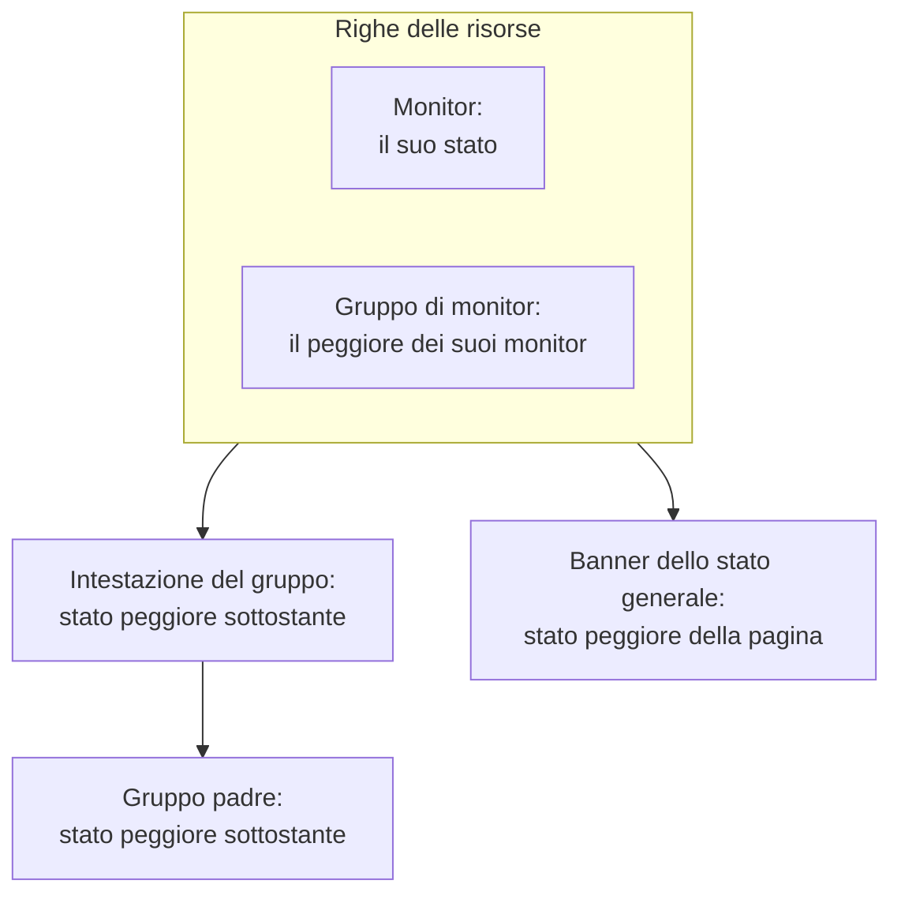

# Risorse e gruppi della pagina di stato

Una risorsa è una riga della vostra pagina di stato: un monitor o un gruppo di monitor, con un nome che i vostri clienti capiscono, il suo stato attuale e, se volete, il suo tempo di attività e la sua cronologia. I gruppi sono sezioni che contengono risorse, così una pagina con quaranta monitor si legge come «API», «App web» e «Pipeline di dati» invece che come un elenco infinito. Create entrambi in un'unica schermata: aprite una pagina di stato e scegliete **Risorse** nel suo menu laterale.

:::cards
- [Aggiungere un monitor](#aggiungere-un-monitor): Mettere un monitor sulla pagina, con il nome che leggono i visitatori.
- [Gruppi](#gruppi): Dividere la pagina in sezioni e annidarle.
- [Regole dei monitor](#aggiungere-monitor-automaticamente-con-le-regole-dei-monitor): Lasciare che una regola aggiunga per voi ogni monitor corrispondente.
- [Importare gruppi da CSV](#importare-gruppi-da-csv): Costruire una gerarchia profonda in un colpo solo.
:::

I visitatori decidono «è un problema mio o loro?» guardando queste righe, quindi chiamatele come i clienti parlano del vostro prodotto: **Checkout API**, non `prod-checkout-lb-healthcheck-us-east-1`.

## Come uno stato risale la pagina

Ogni riga mostra lo stato attuale del suo monitor. Ogni livello sopra mostra lo stato peggiore di tutto ciò che sta sotto, dove lo stato peggiore è quello con la priorità più alta tra gli stati dei monitor del vostro progetto.

Una risorsa decide più del colore della sua riga:

- **I monitor archiviati non vengono mostrati.** Un monitor archiviato non viene più controllato, quindi il suo ultimo stato è congelato; la pagina omette la sua riga (e lo esclude dallo stato di un gruppo di monitor) invece di mostrare quello stato congelato come se fosse attuale. La riga viene conservata, quindi togliere il monitor dall'archivio la riporta subito.
- **Le risorse decidono quali incidenti mostra la pagina.** Un incidente compare qui, e gli iscritti della pagina ne vengono informati, quando uno dei monitor dell'incidente è una risorsa della pagina, direttamente o tramite un gruppo di monitor. Mettete lo stesso monitor su più pagine e i suoi incidenti le raggiungono tutte, a meno che un incidente non sia limitato ad alcune di esse. Vedete [Una pagina di stato per pubblico](/docs/status-pages/one-status-page-per-audience).
- **La riga di un gruppo di monitor rappresenta ogni monitor che contiene, anche per gli iscritti.** Su una pagina che lascia scegliere le risorse agli iscritti, chi si iscrive a un gruppo di monitor viene informato di incidenti, manutenzioni pianificate e annunci su qualsiasi monitor del gruppo, come se avesse scelto quel monitor. Vedete [Iscritti e annunci](/docs/status-pages/subscribers#lasciare-che-gli-iscritti-scelgano-risorse-e-tipi-di-evento).

## La schermata Risorse

La voce si chiama **Risorse** nei progetti con i gruppi di monitor attivati, e **Monitor** negli altri; è la stessa schermata. I gruppi avevano una pagina propria, e il vecchio indirizzo `/groups` ora apre questa schermata.

La schermata è divisa in due:

| Parte | Cosa contiene |
| ---- | ------------- |
| **Navigatore dei gruppi** (a sinistra) | Tutti i gruppi della pagina, ad albero, con una casella **Search groups...** sopra e un conteggio sotto, come `3 groups · 12 resources`. Un elenco lungo termina con un pulsante **Show N more of M**. |
| **Top of page** | La prima riga del navigatore: le risorse senza gruppo, che i visitatori vedono per prime, sopra ogni gruppo. Su una pagina senza gruppi, il riquadro di destra si intitola invece **All resources**. |
| **Riquadro delle risorse** (a destra) | Le risorse del gruppo selezionato. La sua intestazione contiene **Edit Group**, il pulsante principale **Aggiungi monitor** e un menu **More actions**. |
| Intestazione della scheda | **New Group** e un menu a tre puntini con **Import groups from CSV** e **Aggiorna**. |

**Gli stati vuoti vi dicono cosa fare.** Un gruppo vuoto mostra **No monitors here yet** con **Aggiungi monitor**, **Add Multiple** e, solo finché la pagina non ha alcun gruppo, **Create a Group**. Una ricerca senza risultati mostra **No resources match your search**.

## Aggiungere un monitor

:::steps
### Scegliere dove va la riga

Nel navigatore dei gruppi, selezionate il gruppo a cui appartiene la risorsa, oppure **Top of page** per una riga senza gruppo.

### Fare clic su Aggiungi monitor

Si apre la finestra di dialogo **Add a monitor to {group}**. È una sola pagina.

### Scegliere il monitor

Sceglietelo in **Monitor** (segnaposto **Seleziona monitor**). **Nome visualizzato**, il testo che leggono i visitatori, si compila con il nome del monitor e lo segue se scegliete un altro monitor, finché non digitate un nome vostro. Viene salvato separatamente dal nome del monitor, quindi rinominarlo qui non cambia nulla nel monitoraggio.

### Impostare le opzioni di visualizzazione, se volete

**Altri campi** è chiuso. Contiene **Descrizione** (Markdown facoltativo mostrato sotto la riga, adatto a una frase che spieghi cosa fa davvero il servizio; un'immagine al suo interno viene mostrata a ogni visitatore) e le [opzioni di visualizzazione](#opzioni-di-visualizzazione-di-una-risorsa). Lasciatelo chiuso e la risorsa riceve i valori predefiniti.

### Salvare la risorsa

Fate clic su **Aggiungi monitor**. La riga compare nel gruppo e sulla pagina di stato.
:::

In un gruppo a griglia, la finestra di dialogo chiede anche la riga e la colonna in cui va il monitor, sopra **Altri campi**; vedete [Layout a elenco o a griglia](#layout-a-elenco-o-a-griglia).

> [!TIP]
> Per mostrare più controlli come un'unica riga, aggiungete un gruppo di monitor. Con l'interruttore **Gruppi di monitor** attivo (**Impostazioni del progetto** > **Avanzato** > **Flag delle funzionalità**, che si salva non appena lo spostate), un link sotto l'elenco a discesa dice **Add a Monitor Group instead.** Fateci clic e **Monitor** diventa **Monitor Gruppo** (**Seleziona gruppo di monitor**); **Add a Monitor instead.** torna indietro.

### Aggiungerne diversi insieme

**Add Multiple** (anche **Add multiple monitors** nel menu **More actions**) apre **Add Multiple Monitors**. Anche questa è una sola pagina: una selezione multipla **Monitor**, poi gli stessi **Altri campi** chiusi, le cui opzioni di visualizzazione si applicano a ogni monitor che scegliete. Ogni risorsa prende nome visualizzato e descrizione dal proprio monitor, e **Add Monitors** li aggiunge tutti. È il modo più veloce per popolare una nuova pagina.

La selezione multipla ha una scheda **Etichette**: fate clic su un'etichetta e ogni monitor che la porta viene selezionato in una volta.

### Aggiungere due volte per etichetta è sicuro

Una pagina di stato elenca un monitor una sola volta. L'aggiunta è idempotente, quindi scegliere di nuovo la stessa etichetta dopo aver etichettato qualche nuovo monitor aggiunge solo quelli nuovi: i monitor già sulla pagina restano esattamente come sono, con il nome visualizzato e le opzioni che avete dato loro.

Il riepilogo alla fine dell'aggiunta multipla lo dice: i monitor aggiunti sono elencati sotto **Aggiunto**, e quelli che c'erano già sotto **Already Added**. Niente viene segnalato come errore, e niente viene scritto per loro.

La stessa regola vale ovunque venga creata una risorsa. Aggiungere un monitor che è già sulla pagina dal modulo di aggiunta singola, o far puntare una risorsa esistente verso di esso dal modulo di modifica, viene rifiutato con *«This monitor is already added to this status page»*, anche quando la risorsa esistente si trova in un altro gruppo, perché un visitatore vedrebbe comunque il monitor due volte. Per mostrare un monitor in un altro gruppo, eliminate la risorsa che ha già e aggiungetelo dove volete.

## Opzioni di visualizzazione di una risorsa

La sezione **Altri campi** è la stessa nel modulo di aggiunta singola e nella finestra di dialogo multipla. Parte chiusa in entrambi, e anche in **Modifica risorsa**, dove la sua intestazione chiusa mostra cosa non è al valore predefinito. Tutto qui vale per singola risorsa: due righe dello stesso gruppo possono essere configurate in modo diverso.

| Campo | Predefinito | Cosa fa |
| ----- | ------- | ------------ |
| **Tooltip** (`displayTooltip`) | Vuoto | Mostrato come tooltip accanto alla risorsa sulla vostra pagina di stato. Usatelo per l'ambito: «Clienti negli Stati Uniti e nell'UE». |
| **Mostra stato attuale della risorsa** (`showCurrentStatus`) | Attivo | Mostra lo stato attuale, come operativo, degradato o offline, accanto alla riga. |
| **Mostra % di uptime** (`showUptimePercent`) | Disattivo | Mostra una percentuale di tempo di attività accanto alla risorsa. |
| **Seleziona precisione del tempo di attività** (`uptimePercentPrecision`) | Un decimale | Compare quando **Mostra % di uptime** è attivo, e allora è obbligatorio. |
| **Mostra grafico cronologia stato** (`showStatusHistoryChart`) | Attivo | Mostra le barre giornaliere della cronologia del tempo di attività della risorsa. |

Anche **Nome visualizzato** (`displayName`) e **Descrizione** (`displayDescription`) servono solo alla visualizzazione: non cambiano mai il monitor stesso.

## Percentuali di tempo di attività e grafici della cronologia

**Mostra % di uptime** e **Mostra grafico cronologia stato** leggono entrambi un'unica impostazione valida per tutta la pagina: quanti giorni coprono. È **Cronologia uptime** nella scheda **Cosa mostra la tua pagina di stato** in **Pagine di stato → la vostra pagina → Avanzato → Impostazioni avanzate**. Accetta da 1 a 90 giorni e vale 90 per impostazione predefinita. Quindi attivate gli interruttori risorsa per risorsa, poi impostate la finestra una sola volta per tutta la pagina.

**La precisione è una questione di giudizio.** **Seleziona precisione del tempo di attività** offre `99% (No Decimal)`, `99.9% (One Decimal)`, `99.99% (Two Decimal)` e `99.999% (Three Decimal)`. Più decimali sembrano precisi e invitano a discutere del terzo; se pubblicate uno SLA a tre nove, adeguatevi a quello e non andate oltre.

I gruppi hanno le proprie copie di questi interruttori (vedete sotto), quindi un gruppo può mostrare una percentuale complessiva mentre i monitor al suo interno restano silenziosi, o viceversa.

I colori delle barre del grafico della cronologia si impostano in **Altre impostazioni** nella pagina **Branding**, e quali stati dei monitor contano come «inattivo» in **Conta come inattività**, nella scheda **Cosa mostra la tua pagina di stato** delle **Impostazioni avanzate**; entrambi sono descritti in [Branding e domini della pagina di stato](/docs/status-pages/branding-and-domains).

## Gruppi

Alla maggior parte dei gruppi serve solo un nome.

:::steps
### Fare clic su New Group

Si apre **Create New Status Page Group**: due campi, poi due sezioni chiuse.

### Dare un nome al gruppo

Digitate il **Nome gruppo**: l'intestazione di sezione che vedono i visitatori.

### Annidarlo, se appartiene a un altro gruppo

Scegliete un **Parent Group**, oppure lasciate **No parent group (top level)**. **Add a sub group** nei menu di un gruppo lo compila per voi.

### Creare il gruppo

Fate clic su **Create Status Page Group**. Il gruppo compare nel navigatore, pronto per i monitor.
:::

I due campi sono **Nome gruppo** (`name`) e **Parent Group** (`parentStatusPageGroupId`). Le due sezioni chiuse contengono tutto il resto:

- **Layout**: la sua intestazione chiusa dice **List** o **Grid**. Contiene **Modalità di visualizzazione** e gli assi di una griglia (vedete [Layout a elenco o a griglia](#layout-a-elenco-o-a-griglia)), e si apre da sola su un gruppo a griglia.
- **Altri campi**: le copie, a livello di gruppo, delle opzioni delle risorse:
  - **Descrizione gruppo** (`description`): Markdown facoltativo, mostrato sotto l'intestazione. Un'immagine al suo interno viene mostrata a ogni visitatore.
  - **Espandi sulla pagina di stato per impostazione predefinita** (`isExpandedByDefault`): attivo per impostazione predefinita; indica se la sezione parte aperta o chiusa per i visitatori.
  - **Mostra stato attuale del gruppo** (`showCurrentStatus`): attivo per impostazione predefinita. Mostra uno stato accanto all'intestazione del gruppo.
  - **Mostra % di uptime** (`showUptimePercent`): disattivo per impostazione predefinita, con **Seleziona precisione del tempo di attività** quando è attivo.

Per modificare un gruppo, usate **Edit Group** nell'intestazione del riquadro, oppure **Edit group** nel menu della riga del navigatore: si apre **Edit Status Page Group**, con un pulsante **Salva modifiche**. L'intestazione del riquadro mostra dei chip per le impostazioni attive (**Grid**, **Collapsed by default**, **Uptime %**), così vedete come è configurato un gruppo senza aprire il modulo.

### Gestire un gruppo

| Dove | Azioni |
| ----- | ------- |
| Il menu della riga del navigatore | **Edit group**, **Move up**, **Move down**, **Mostra ID**, **Delete group** |
| Il menu **More actions** del riquadro | **Edit this group**, **Add a sub group**, **Move group up**, **Move group down**, **Show group ID**, **Aggiorna**, **Delete this group** |

Un gruppo salvato senza nome compare come **Untitled group**, buon segno che volevate scrivere qualcosa.

## Annidare i gruppi

I gruppi si annidano: impostate **Parent Group** sul gruppo figlio, oppure usate **Add a sub group inside this group** nel navigatore. Il testo di aiuto del modulo descrive la forma per cui è pensato (qualcosa come Unità aziendali › Regione › Mercato), e ogni livello mostra lo stato e il tempo di attività complessivi di tutto ciò che sta sotto.

Quando un gruppo ha figli, il riquadro delle risorse mostra una riga di chip **Sub groups** che porta direttamente a ciascuno, così percorrete la gerarchia senza tornare al navigatore.

L'annidamento ripaga sulle pagine grandi: un provider di hosting con regioni dentro i prodotti, o un rivenditore con mercati dentro le unità di business. Su una pagina con dodici monitor, un solo livello piatto è più semplice.

## Layout a elenco o a griglia

La sezione **Layout** del modulo del gruppo imposta la **Modalità di visualizzazione** (`viewMode`) del gruppo, che cambia il modo in cui il gruppo compare sulla pagina di stato.

| Se volete… | Scegliete |
| --------------- | ---- |
| Mostrare un semplice elenco verticale di servizi, uno per riga | **List** (il predefinito) |
| Mostrare lo stesso servizio in più regioni o tenant come una matrice | **Grid** |

Scegliete **Grid** e compaiono altri quattro campi:

| Campo | Cosa inserire |
| ----- | ------------- |
| **Etichetta dell'asse delle righe** | Il nome della dimensione delle righe, segnaposto `Service`. |
| **Valori dell'asse delle righe** | Le righe, aggiunte una alla volta con **Add Row** (segnaposto `e.g. Auth`). |
| **Etichetta dell'asse delle colonne** | La dimensione delle colonne, segnaposto `Region`. |
| **Valori dell'asse delle colonne** | Le colonne, aggiunte con **Add Column** (segnaposto `e.g. US-East`). |

Ogni monitor di un gruppo a griglia occupa una cella, quindi **Aggiungi monitor** e la finestra di dialogo multipla chiedono riga e colonna insieme al monitor, con le vostre etichette degli assi.

> [!IMPORTANT]
> Impostate gli assi prima di aggiungere i monitor. Un gruppo a griglia senza righe né colonne mostra un avviso che non c'è ancora dove mettere un monitor, con un pulsante **Set up the grid** che apre il modulo del gruppo sulla sua sezione **Layout**, e il suo pulsante **Aggiungi monitor** sparisce finché non lo fate.

## Ordinare ciò che vedono i visitatori

L'ordine lo decidete voi, non l'alfabeto:

| Cosa | Come riordinarlo |
| ---- | ------------------ |
| Le risorse dentro un gruppo | Trascinate una riga. Il riquadro lo dice: **Drag a row to change the order visitors see**. |
| I gruppi tra loro | **Move up** / **Move down** nel menu della riga del navigatore, oppure **Move group up** / **Move group down** in **More actions**. |
| Le risorse senza gruppo | Stanno in **Top of page** e compaiono sempre sopra ogni gruppo, quindi mettete lì la cosa che tutti controllano per prima. |

**Due casi in cui il trascinamento è disattivato.** Una ricerca nella casella **Search in {group}...** disattiva il riordino (il riquadro dice `N of M shown · drag to reorder is off while filtering`), quindi svuotate prima la ricerca. E i gruppi a griglia non si riordinano mai trascinando, perché il posto di un monitor deriva dalla sua riga e dalla sua colonna.

Mettete in cima il servizio su cui vi fanno più domande. I visitatori che arrivano sulla pagina durante un'interruzione di solito smettono di leggere dopo la prima schermata.

## Aggiungere monitor automaticamente con le regole dei monitor

Una regola dei monitor aggiunge monitor alla pagina per voi: descrivete i monitor una volta, e ogni monitor corrispondente finisce nel gruppo che avete scelto. Le regole si trovano in **Risorse → Monitor Rules**, accanto alla schermata Risorse.

:::steps
### Aprire Monitor Rules

Aprite la pagina di stato, scegliete **Monitor Rules** nella sezione **Risorse** del suo menu laterale e fate clic su **Crea: Status Page Monitor Rule**.

### Dare un nome alla regola

In **Informazioni di base**, inserite un **Nome**. **Abilitato** è attivo per impostazione predefinita.

### Indicare a quali monitor corrisponde

In **Criteri di corrispondenza**, compilate almeno uno tra **Etichette del monitor** (corrisponde un monitor che ne porta una qualsiasi), **Nome del monitor** e **Descrizione del monitor**. Un monitor deve soddisfare ogni criterio compilato. I due modelli accettano un'espressione regolare senza distinzione tra maiuscole e minuscole (`^api-.*`) o un carattere jolly `*` (`*checkout*`); `.*` corrisponde a ogni monitor.

### Scegliere il gruppo

In **Gruppo**, scegliete **Add Monitors To Group**, oppure lasciatelo vuoto per aggiungere i monitor senza gruppo. Seguono le stesse opzioni di visualizzazione di una risorsa; su una regola, **Mostra % di uptime** parte attivo.

### Salvare la regola

La regola viene eseguita subito su ogni monitor già esistente, e l'elenco mostra il gruppo a cui aggiunge i monitor sotto **Adds Monitors To**.
:::

Dopo di che, una regola viene eseguita di nuovo per un monitor ogni volta che ne viene creato uno o cambiano le sue etichette, il suo nome o la sua descrizione. Una regola rimuove solo le risorse che ha aggiunto: disattivarla o eliminarla le toglie dalla pagina, e un monitor aggiunto a mano non viene mai toccato. Un monitor già presente sulla pagina non viene mai aggiunto due volte.

## Importare gruppi da CSV

Costruire a mano una gerarchia profonda è noioso. **Import groups from CSV**, nel menu a tre puntini dell'intestazione della scheda, apre la finestra di dialogo **Import Groups from CSV**.

:::steps
### Scaricare il modello

Fate clic su **Download CSV Template** per ottenere `status-page-groups-template.csv`.

### Compilarlo

Una riga per gruppo. Solo `name` è obbligatorio; le colonne sono elencate sotto.

### Caricare e vedere l'anteprima

Fate clic su **Choose CSV File**, scegliete il vostro file, poi **Preview Import** per controllare cosa verrà creato prima che venga scritto qualcosa.

### Importare

Avviate l'importazione. Una tabella **Import results** elenca ogni riga come **Creato**, **Non riuscito** o **Saltato**, con il motivo, così una riga sbagliata non sparisce mai in silenzio.
:::

| Colonna | Cosa imposta |
| ------ | ------------ |
| `name` | Il nome del gruppo. Obbligatorio. |
| `parentName` | Il nome del gruppo in cui questo è annidato. |
| `description` | La descrizione del gruppo. |
| `isExpandedByDefault` | Se la sezione parte aperta per i visitatori. |
| `showCurrentStatus` | Se accanto all'intestazione del gruppo compare uno stato. |
| `showUptimePercent` | Se accanto al gruppo compare una percentuale di tempo di attività. |
| `uptimePercentPrecision` | Quanti decimali usa quella percentuale. |
| `viewMode` | `List` o `Grid`. |
| `rowAxisLabel` | Il nome della dimensione delle righe, per un gruppo a griglia. |
| `rowAxisValues` | I valori delle righe, per un gruppo a griglia. |
| `columnAxisLabel` | Il nome della dimensione delle colonne, per un gruppo a griglia. |
| `columnAxisValues` | I valori delle colonne, per un gruppo a griglia. |

L'importazione crea gruppi, non risorse: aggiungete poi i monitor con **Aggiungi monitor**, **Add Multiple** o una regola dei monitor.

## Risoluzione dei problemi

:::details «This monitor is already added to this status page»
Una pagina elenca ogni monitor una sola volta, anche tra gruppi diversi. Il monitor ha già una risorsa, magari in un altro gruppo o aggiunta da una regola dei monitor. Cercatelo nel navigatore, eliminate quella risorsa e aggiungete il monitor dove volete.
:::

:::details Un monitor che ho aggiunto non compare sulla pagina di stato
Controllate se il monitor è archiviato: la riga di un monitor archiviato viene omessa finché non lo togliete dall'archivio. Controllate anche il gruppo: un gruppo impostato per partire chiuso (**Espandi sulla pagina di stato per impostazione predefinita** disattivo) nasconde le sue righe finché un visitatore non lo apre.
:::

:::details In un gruppo a griglia non c'è il pulsante Aggiungi monitor
La griglia non ha ancora righe né colonne. Fate clic su **Set up the grid**, aggiungete i valori degli assi nella sezione **Layout** e **Aggiungi monitor** ritorna.
:::

:::details Non riesco a trascinare le righe
Svuotate la casella **Search in {group}...**: il riordino è disattivato mentre il riquadro è filtrato. I gruppi a griglia non si riordinano mai trascinando.
:::

## Passaggi successivi

:::cards
- [Branding e domini della pagina di stato](/docs/status-pages/branding-and-domains): Logo, favicon, colori del grafico della cronologia e il vostro dominio.
- [Iscritti e annunci](/docs/status-pages/subscribers): Chi viene avvisato quando queste risorse cambiano.
- [Una pagina di stato per pubblico](/docs/status-pages/one-status-page-per-audience): Lo stesso monitor su molte pagine, e un incidente che ne raggiunge solo alcune.
- [API pubblica](/docs/status-pages/public-api): Leggere risorse, gruppi e tempo di attività come JSON.
:::
