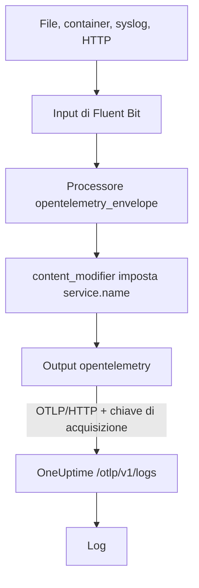

# Fluent Bit

[Fluent Bit](https://docs.fluentbit.io/manual) è un agente leggero che raccoglie log da file, systemd, container, syslog, HTTP e molte altre sorgenti. Il suo [output OpenTelemetry](https://docs.fluentbit.io/manual/pipeline/outputs/opentelemetry) invia ciò che raccoglie all'endpoint OpenTelemetry (OTLP) di OneUptime, dove i log diventano ricercabili in **Prodotti → Registri**.

:::cards
- [Configurare Fluent Bit](#configurare-fluent-bit): Aggiungi l'output OpenTelemetry e dai un nome al tuo servizio.
- [Esempio completo](#esempio-completo): Un intero file di configurazione da cui partire.
- [OneUptime self-hosted](#oneuptime-self-hosted): Punta Fluent Bit alla tua istanza.
:::

## Come funziona



Fluent Bit avvolge ogni record in una busta OpenTelemetry, così può portare attributi di risorsa come `service.name`. L'output OpenTelemetry invia poi i record a OneUptime con la tua chiave di acquisizione nell'header `x-oneuptime-token`. OneUptime li archivia sotto il servizio indicato da `service.name` e crea quel servizio la prima volta che invia.

## Prima di iniziare

- **Installare Fluent Bit**: vedi la [guida all'installazione](https://docs.fluentbit.io/manual/installation/getting-started-with-fluent-bit). La configurazione di questa pagina usa il formato YAML di Fluent Bit e il processore `opentelemetry_envelope`, quindi usa una versione recente.
- **Un progetto OneUptime.** Su OneUptime Cloud la telemetria si paga per GB acquisito (vedi i [prezzi](https://oneuptime.com/pricing)) e un progetto con il piano Free ha bisogno di un metodo di pagamento prima di poter inviare telemetria.
- **Una chiave di acquisizione della telemetria.** Se non ne hai una:

:::steps
### Aprire le chiavi di acquisizione

Vai a **Prodotti → Impostazioni del progetto**, apri **Telemetria e APM** nel menu laterale e seleziona **Chiavi di acquisizione**.


### Creare una chiave

Fai clic su **Crea chiave di ingestione**. La finestra ha già il nome della chiave compilato e **Server** scelto (il tipo di chiave con cui invia un'applicazione o un collector), quindi fai clic su **Crea chiave di ingestione** per crearla, oppure rinominala prima.

### Copiare il segreto

La nuova chiave si apre nella sua pagina. Copia la sua **Chiave segreta**: è lo `YOUR_TELEMETRY_INGESTION_TOKEN` della configurazione qui sotto.


:::

## Configurare Fluent Bit

Fluent Bit legge la sua configurazione YAML da un file come `/etc/fluent-bit/fluent-bit.yaml`.

:::steps
### Aggiungere l'output OpenTelemetry

Aggiungi un output `opentelemetry` che invia a OneUptime. Mantieni l'output `stdout` mentre fai le prove, se vuoi vedere i record in locale:

```yaml title="fluent-bit.yaml"
pipeline:
  outputs:
    - name: stdout
      match: "*"
    - name: opentelemetry
      match: "*"
      host: "oneuptime.com"
      port: 443
      metrics_uri: "/otlp/v1/metrics"
      logs_uri: "/otlp/v1/logs"
      traces_uri: "/otlp/v1/traces"
      tls: On
      header:
        - x-oneuptime-token YOUR_TELEMETRY_INGESTION_TOKEN
```

### Avvolgere i log in una busta OpenTelemetry e dare un nome al servizio

Aggiungi il processore `opentelemetry_envelope` a ogni input, seguito da un `content_modifier` che imposta `service.name`. Sostituisci `YOUR_SERVICE_NAME` con il nome con cui i log devono comparire in OneUptime:

```yaml title="fluent-bit.yaml"
pipeline:
  inputs:
    - name: tail # or any other input
      path: /var/log/my-app/*.log

      processors:
        logs:
          - name: opentelemetry_envelope

          - name: content_modifier
            context: otel_resource_attributes
            action: upsert
            key: service.name
            value: YOUR_SERVICE_NAME
```

### Riavviare Fluent Bit

Riavvia il servizio Fluent Bit, oppure avvialo con `fluent-bit -c /etc/fluent-bit/fluent-bit.yaml`. In pochi secondi i log compaiono in **Prodotti → Registri** e il servizio è elencato in **Prodotti → Servizi**.
:::

## Esempio completo

Questa configurazione riceve log via HTTP sulla porta `8888` e li inoltra a OneUptime:

```yaml title="fluent-bit.yaml"
service:
  flush: 1
  log_level: info

pipeline:
  inputs:
    - name: http
      listen: 0.0.0.0
      port: 8888

      processors:
        logs:
          - name: opentelemetry_envelope

          - name: content_modifier
            context: otel_resource_attributes
            action: upsert
            key: service.name
            value: YOUR_SERVICE_NAME

  outputs:
    - name: stdout
      match: "*"
    - name: opentelemetry
      match: "*"
      host: "oneuptime.com"
      port: 443
      metrics_uri: "/otlp/v1/metrics"
      logs_uri: "/otlp/v1/logs"
      traces_uri: "/otlp/v1/traces"
      tls: On
      header:
        - x-oneuptime-token YOUR_TELEMETRY_INGESTION_TOKEN
```

Sostituisci l'input `http` con gli input che ti servono (ad esempio `tail` per i file di log o `systemd` per il journal) e mantieni i due processori su ciascuno di essi.

## OneUptime self-hosted

Imposta `host` sull'host della tua istanza OneUptime. Se è servita in HTTP semplice anziché in HTTPS, imposta anche `port` sulla porta su cui è in ascolto (di solito `80`) e rimuovi `tls`:

```yaml title="fluent-bit.yaml"
pipeline:
  outputs:
    - name: stdout
      match: "*"
    - name: opentelemetry
      match: "*"
      host: "your-oneuptime-instance.com"
      port: 80
      metrics_uri: "/otlp/v1/metrics"
      logs_uri: "/otlp/v1/logs"
      traces_uri: "/otlp/v1/traces"
      header:
        - x-oneuptime-token YOUR_TELEMETRY_INGESTION_TOKEN
```

## Risoluzione dei problemi

:::details Fluent Bit registra `401` dall'output OpenTelemetry
La chiave di acquisizione manca, è sconosciuta o è scaduta. Controlla la riga `header`: è `x-oneuptime-token`, uno spazio, poi la **Chiave segreta** della chiave.
:::

:::details Fluent Bit registra `402` o `422`
`402`: su OneUptime Cloud il progetto ha il piano Free e nessun metodo di pagamento. Aggiungine uno in **Impostazioni del progetto → Fatturazione e fatture → Fatturazione**. `422`: la chiave è disattivata, oppure è una chiave Browser. Riattiva **Abilitato** nelle impostazioni della chiave, oppure crea una chiave **Server**.
:::

:::details I log arrivano sotto un servizio inatteso
Il servizio viene da `service.name`. Verifica che ogni input abbia il processore `opentelemetry_envelope` seguito dal `content_modifier` che lo imposta.
:::

:::details Non arriva nulla e Fluent Bit registra errori di connessione
Verifica che per un endpoint HTTPS siano impostati `tls: On` e `port: 443`, e che l'host su cui gira Fluent Bit raggiunga l'host di OneUptime su quella porta.
:::

Per qualsiasi domanda o se ti serve aiuto con la configurazione, scrivici a support@oneuptime.com.

## Passaggi successivi

:::cards
- [Pipeline dei log](/docs/telemetry/log-pipelines): Analizza e arricchisci i log che invia Fluent Bit.
- [Sintassi di ricerca](/docs/telemetry/search-syntax): Trova i log nell'explorer dei log.
- [OpenTelemetry](/docs/telemetry/open-telemetry): Endpoint, chiavi e limiti per tutta la telemetria.
- [Fluentd](/docs/telemetry/fluentd): Usa invece Fluentd.
:::
