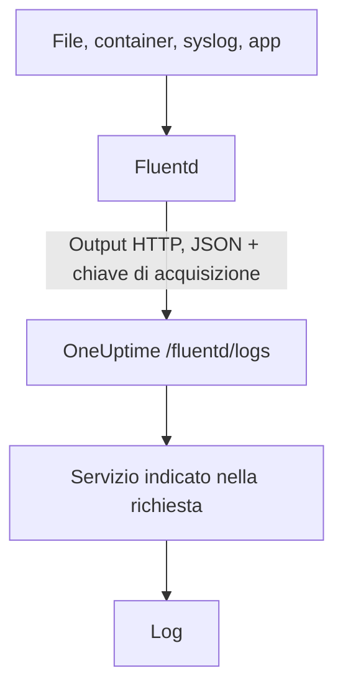

# Fluentd

[Fluentd](https://www.fluentd.org/) raccoglie log da file, container, syslog, applicazioni e [molte altre sorgenti](https://www.fluentd.org/datasources). Il suo [output HTTP](https://docs.fluentd.org/output/http) integrato li invia all'endpoint Fluentd di OneUptime, dove diventano ricercabili in **Prodotti → Registri**.

:::cards
- [Configurare Fluentd](#configurare-fluentd): Aggiungi un output HTTP che punta a OneUptime.
- [Come vengono letti i record](#come-vengono-letti-i-record): Quali campi diventano il messaggio, la gravità e gli attributi.
- [OneUptime self-hosted](#oneuptime-self-hosted): Punta Fluentd alla tua istanza.
:::

## Come funziona



Fluentd invia i record a blocchi in JSON, con la tua chiave di acquisizione nell'header `x-oneuptime-token` e il nome del servizio in `x-oneuptime-service-name`. OneUptime trasforma ogni record in un log di quel servizio e crea il servizio la prima volta che invia.

## Prima di iniziare

- **Installare Fluentd**: vedi la [guida all'installazione](https://docs.fluentd.org/installation).
- **Un progetto OneUptime.** Su OneUptime Cloud la telemetria si paga per GB acquisito (vedi i [prezzi](https://oneuptime.com/pricing)) e un progetto con il piano Free ha bisogno di un metodo di pagamento prima di poter inviare telemetria.
- **Una chiave di acquisizione della telemetria.** Se non ne hai una:

:::steps
### Aprire le chiavi di acquisizione

Vai a **Prodotti → Impostazioni del progetto**, apri **Telemetria e APM** nel menu laterale e seleziona **Chiavi di acquisizione**.


### Creare una chiave

Fai clic su **Crea chiave di ingestione**. La finestra ha già il nome della chiave compilato e **Server** scelto (il tipo di chiave con cui invia un'applicazione o un collector), quindi fai clic su **Crea chiave di ingestione** per crearla, oppure rinominala prima.

### Copiare il segreto

La nuova chiave si apre nella sua pagina. Copia la sua **Chiave segreta**: è lo `YOUR_SERVICE_TOKEN` della configurazione qui sotto.


:::

## Configurare Fluentd

Il file di configurazione di Fluentd di solito è `/etc/fluent/fluentd.conf`, oppure `/etc/td-agent/td-agent.conf` per il vecchio pacchetto td-agent.

:::steps
### Aggiungere un output HTTP

Aggiungi una sezione `<match>` che invia i record a OneUptime. Sostituisci `YOUR_SERVICE_TOKEN` con la tua chiave di acquisizione e `YOUR_SERVICE_NAME` con il nome con cui devono comparire i log (un nome qualsiasi):

```text title="fluentd.conf"
# Match all patterns
<match **>
  @type http

  endpoint https://oneuptime.com/fluentd/logs
  open_timeout 2

  headers {"x-oneuptime-token":"YOUR_SERVICE_TOKEN", "x-oneuptime-service-name":"YOUR_SERVICE_NAME"}

  content_type application/json
  json_array true

  <format>
    @type json
  </format>
  <buffer>
    flush_interval 10s
  </buffer>
</match>
```

`json_array true` invia ogni svuotamento del buffer come un unico array JSON, e `flush_interval 10s` invia un blocco ogni 10 secondi.

### Riavviare Fluentd

Riavvia il servizio Fluentd perché carichi il nuovo output.

### Verificare che i log arrivino

Pochi secondi dopo lo svuotamento successivo, i log compaiono in **Prodotti → Registri**. Il servizio è elencato in **Prodotti → Servizi**: se non esisteva ancora, OneUptime lo crea.
:::

## Esempio completo

Questa configurazione riceve i record con il protocollo forward di Fluentd sulla porta `24224` e li invia tutti a OneUptime:

```text title="fluentd.conf"
####
## Source descriptions:
##

## built-in TCP input
## @see https://docs.fluentd.org/input/forward
<source>
  @type forward
  port 24224
  bind 0.0.0.0
</source>

<match **>
  @type http

  endpoint https://oneuptime.com/fluentd/logs
  open_timeout 2

  headers {"x-oneuptime-token":"YOUR_SERVICE_TOKEN", "x-oneuptime-service-name":"YOUR_SERVICE_NAME"}

  content_type application/json
  json_array true

  <format>
    @type json
  </format>
  <buffer>
    flush_interval 10s
  </buffer>
</match>
```

Per inviare sorgenti diverse come servizi diversi, usa una sezione `<match>` per tag, ognuna con il proprio `x-oneuptime-service-name`.

## Come vengono letti i record

OneUptime legge questi campi da ogni record:

| Campo del log | Letto dal primo campo presente tra | Note |
| --- | --- | --- |
| Corpo | `message`, `log`, `msg`, `body`, `text` | La riga di log. Un record senza nessuno di questi campi viene salvato intero, come JSON. |
| Gravità | `level`, `severity`, `loglevel`, `log_level`, `priority`, `severityText`, `severity_text` | Nomi come `trace`, `debug`, `info`, `notice`, `warn`, `error`, `critical` e `fatal`, maiuscoli o minuscoli. Qualsiasi altro valore viene salvato come `Unspecified`. |
| ID traccia | `trace_id`, `traceId`, `traceid` | Collega il log alla sua traccia. |
| ID span | `span_id`, `spanId`, `spanid` | Collega il log al suo span. |
| Servizio | l'header `x-oneuptime-service-name` | `Fluentd` quando l'header non è impostato. |
| Ora | — | L'ora in cui OneUptime riceve il record. |

Ogni altro campo diventa un attributo chiamato `fluentd.` seguito dal nome del campo, su cui puoi cercare e filtrare: un campo `container_name` è `@fluentd.container_name` nell'explorer dei log. Un oggetto annidato viene appiattito con i punti, come `fluentd.kubernetes.pod_name`, e una lista viene salvata come JSON.

I log di Fluentd passano dalle tue [pipeline dei log](/docs/telemetry/log-pipelines), dai filtri di scarto e dalle regole di mascheramento come qualsiasi altro log.

## OneUptime self-hosted

Sostituisci `https://oneuptime.com` in `endpoint` con l'URL della tua istanza OneUptime: `http(s)://YOUR_ONEUPTIME_HOST/fluentd/logs`.

## Risoluzione dei problemi

:::details Fluentd registra `401` dall'output HTTP
La chiave di acquisizione manca, è sconosciuta o è scaduta. Controlla il valore di `x-oneuptime-token` in `headers`.
:::

:::details Fluentd registra `402` o `422`
`402`: su OneUptime Cloud il progetto ha il piano Free e nessun metodo di pagamento. Aggiungine uno in **Impostazioni del progetto → Fatturazione e fatture → Fatturazione**. `422`: la chiave è disattivata, oppure è una chiave Browser. Riattiva **Abilitato** nelle impostazioni della chiave, oppure crea una chiave **Server**.
:::

:::details I log arrivano sotto il servizio `Fluentd`
Manca l'header `x-oneuptime-service-name`. Aggiungilo a `headers` in ogni sezione `<match>`.
:::

:::details Il corpo del log mostra l'intero record come JSON
OneUptime prende il corpo dal primo campo presente tra `message`, `log`, `msg`, `body` e `text`, e salva l'intero record quando non ne ha nessuno. Rinomina il campo che contiene la tua riga di log in uno di questi, ad esempio con il filtro `record_transformer` di Fluentd.
:::

Per qualsiasi domanda o se ti serve aiuto con la configurazione, scrivici a support@oneuptime.com.

## Passaggi successivi

:::cards
- [Pipeline dei log](/docs/telemetry/log-pipelines): Analizza e arricchisci i log che invia Fluentd.
- [Sintassi di ricerca](/docs/telemetry/search-syntax): Trova i log nell'explorer dei log.
- [Fluent Bit](/docs/telemetry/fluentbit): Un agente più leggero che invia tramite OpenTelemetry.
- [Monitor log](/docs/monitor/logs-monitor): Avvisa quando compaiono log corrispondenti.
:::
