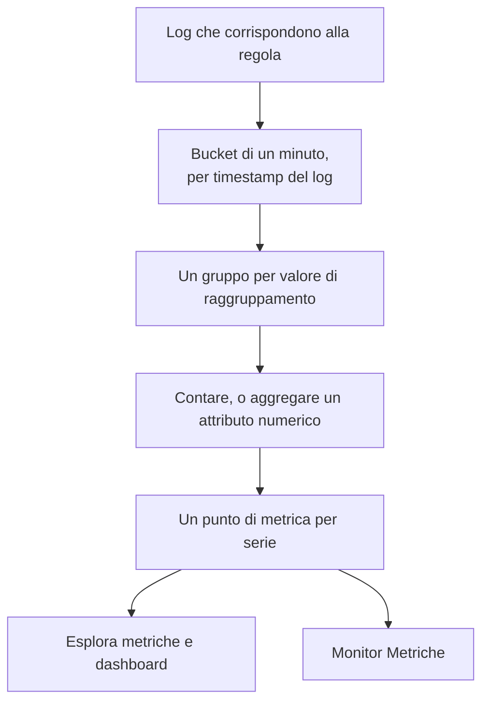
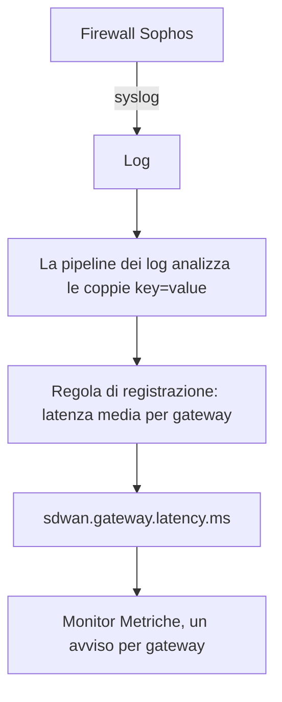

# Regole di registrazione dei log

Una **Log Recording Rule** trasforma i log in una metrica. Ogni minuto prende i log che corrispondono al suo filtro e scrive un numero al minuto nell'archivio delle metriche: quanti log hanno corrisposto, oppure la somma, la media, il minimo, il massimo o un percentile di un attributo numerico di quei log. Suddividete il risultato per un massimo di cinque attributi di log e ottenete una serie per valore: una per gateway, per host, per cliente.

:::cards
- [Come funziona una regola](#come-funziona-una-regola): Bucket, tempistiche, recupero e lacune.
- [Creare una regola](#creare-una-regola): I campi dell'editor delle regole.
- [Esempio: latenza dei gateway SD-WAN](#esempio-latenza-dei-gateway-sd-wan-da-un-firewall-sophos): Dal syslog di un firewall a un avviso per gateway.
- [Permessi](#permessi): Chi può creare, modificare e leggere le regole.
:::

## Panoramica

Il risultato è una normale metrica. Visualizzatela in **Esplora metriche** e nelle dashboard, e ricevete avvisi su di essa con un monitor **Metriche**, compresi gli avvisi per serie con **Raggruppa per**.

Usate una regola di registrazione dei log quando il numero che vi interessa esiste solo nei vostri log: i riepiloghi SLA di un firewall, un job batch che registra quanto è durato, le dimensioni delle risposte di un log di accesso, o semplicemente quanti log di errore scrive un servizio ogni minuto.

Le regole di registrazione dei log si trovano in **Registri → Impostazioni → Regole di registrazione**. Le loro equivalenti per metriche e span sono in **Metriche → Impostazioni → Regole di registrazione** e **Tracce → Impostazioni → Regole di registrazione**.

## Come funziona una regola



- **Un punto al minuto, per serie.** I log vengono raggruppati in bucket di 1 minuto in base al loro timestamp. Ogni bucket produce un punto per ogni combinazione distinta dei valori degli attributi di raggruppamento.
- **Calcolato 30 secondi dopo la fine del minuto.** La breve attesa permette ai log che arrivano un po' in ritardo di finire ancora nel loro minuto. Un log che arriva più tardi non viene contato.
- **Nessuna lacuna, nessun doppio conteggio.** Ogni regola ricorda l'ultimo minuto che ha scritto (mostrato come **Computed Until** nell'elenco delle regole). Dopo un riavvio del worker o un altro periodo di inattività recupera i minuti persi, fino a 60 minuti indietro, e non scrive mai due volte lo stesso minuto.
- **Un conteggio senza raggruppamento non ha mai lacune.** Un minuto senza log corrispondenti viene scritto come `0`. Ogni altra regola non scrive nulla per un minuto senza niente da aggregare, così grafici e monitor vedono un'assenza di dati invece di uno zero inventato.
- **Scritto come qualsiasi altra metrica derivata.** I punti sono dati Gauge con il **Nome della metrica di output** della regola, portano gli attributi di raggruppamento e `oneuptime.derived.log_rule_id` (l'ID della regola) e seguono la stessa conservazione dei punti delle regole di registrazione di metriche e tracce: 15 giorni.

La modifica della definizione di una regola si applica dal minuto successivo che scrive; i punti già scritti non vengono riscritti. Disattivare una regola la ferma; riattivata, recupera i minuti persi mentre era disattivata, fino agli stessi 60 minuti.

## Creare una regola

:::steps
### Aprire le regole di registrazione

Andate in **Registri → Impostazioni → Regole di registrazione** e scegliete **Crea: Log Recording Rule**.

### Dare un nome alla regola

Digitate un **Nome**. Il **Nome della metrica di output** sottostante viene ricavato dal nome mentre digitate; scegliete **Modifica** accanto per inserirne uno vostro.

### Scegliere i log e cosa calcolare

In **Which Logs**, restringete la regola con servizi di telemetria, gravità, testo del corpo e filtri di attributo. Scegliete un'**Aggregazione** e, per tutto tranne un conteggio, il **Numeric Attribute** da aggregare.

### Suddividere il risultato e salvare

Facoltativamente aggiungete attributi in **Raggruppa per** e una **Unit**. Controllate la riga in fondo all'editor, poi salvate. Entro pochi minuti l'elenco delle regole mostra un orario in **Computed Until**.
:::

| Campo | Cosa fa |
| --- | --- |
| Nome | Cosa calcola la regola, per esempio *SD-WAN gateway latency*. |
| Nome della metrica di output | La metrica che la regola scrive. Ricavato dal nome (*SD-WAN gateway latency* scrive `sd_wan_gateway_latency`), a meno che non scegliate **Modifica** e ne inseriate uno vostro. Deve essere univoco tra le regole di registrazione del progetto. |
| Which Logs | Filtri facoltativi, tutti combinati con AND: servizi di telemetria, gravità, testo contenuto nel corpo e filtri di attributo (un attributo uguale a un valore). |
| Aggregazione | `Count of logs`, oppure un'aggregazione di un attributo numerico (vedete sotto). |
| Numeric Attribute | Per ogni aggregazione tranne il conteggio: l'attributo i cui valori vengono aggregati, per esempio `latency`. |
| Raggruppa per | Facoltativo: fino a 5 chiavi di attributo. Una serie per ogni combinazione distinta dei loro valori. |
| Unit | Facoltativo: l'unità della metrica di output, per esempio `ms`. Mostrata ovunque la metrica sia rappresentata. |
| Descrizione | In **Altri campi**: a cosa serve la regola. |
| Abilitato | In **Altri campi**: attivo per impostazione predefinita. Vengono calcolate solo le regole abilitate. |

La riga in fondo all'editor dice cosa scriverà la regola, per esempio `avg(latency) by gw_name, profile_name`.

Una regola può filtrare su al massimo 10 attributi e 100 servizi di telemetria.

### Aggregazioni

| Aggregazione | Il punto di ogni minuto |
| --- | --- |
| Count of logs | Quanti log hanno corrisposto al filtro. |
| Media | La media dei valori dell'attributo numerico. |
| Somma | I valori dell'attributo sommati. |
| Minimo | Il valore più piccolo. |
| Massimo | Il valore più grande. |
| p50 (median) | Il valore mediano. |
| p75 | Il 75° percentile. |
| p90 | Il 90° percentile. |
| p95 | Il 95° percentile. |
| p99 | Il 99° percentile. |

### Attributi numerici

Il valore dell'attributo numerico deve essere un numero semplice. Può arrivare come numero (`latency=11` analizzato come numero) o come testo (`"11"`, `"11.5"`, `"1e3"`). Un log il cui valore manca o non è un numero (`"11ms"`, `"n/a"`, una stringa vuota) viene **saltato**. Non viene mai contato come `0`, quindi un log malformato non può abbassare una media.

### Chiavi degli attributi

Le chiavi dei filtri di attributo corrispondono indipendentemente da maiuscole e minuscole, come i filtri dell'explorer dei log. L'attributo numerico e le chiavi di raggruppamento devono essere scritti esattamente come li portano i vostri log, compreso qualsiasi prefisso aggiunto da una pipeline dei log. I campi delle chiavi suggeriscono le chiavi che portano i log del vostro progetto, quindi sceglietele dall'elenco invece di digitarle a mano.

Le chiavi possono contenere lettere, cifre e `. _ : / -`.

### Raggruppamento e limite di serie

Ogni chiave di raggruppamento moltiplica il numero di serie che una regola scrive, quindi raggruppate per attributi che identificano qualcosa che volete vedere o monitorare separatamente (un gateway, un host, un cliente), non per attributi diversi in ogni log, come un ID di richiesta o l'indirizzo IP di un client.

Una regola scrive al massimo 1000 serie al minuto. Oltre questo limite vengono mantenute le serie con più log corrispondenti e il resto di quel minuto viene scartato. Un log che non porta uno degli attributi di raggruppamento viene comunque contato; la sua serie viene scritta senza quell'attributo.

## Esempio: latenza dei gateway SD-WAN da un firewall Sophos

Un firewall Sophos XGS con il logging SD-WAN attivo invia ogni pochi minuti un riepilogo SLA per profilo SD-WAN e per gateway:

```text
log_type="SD-WAN" log_component="SLA" profile_name="Branch-Internet" gw_name="WAN2" latency=11 jitter=2 packet_loss=0 gw_status="up" sla_status="SLA met"
```

Questo esempio trasforma quei riepiloghi in una metrica di latenza per gateway, e invia un avviso quando la latenza di un gateway resta alta.



:::steps
### Far arrivare i log, con i loro campi come attributi

1. Inviate il syslog del firewall a OneUptime: vedete [Syslog](/docs/telemetry/syslog).
2. In **Registri → Impostazioni → Pipeline**, aggiungete una pipeline con un processore che divide le coppie `key=value` del corpo in attributi del log, così che ogni riepilogo porti `log_type`, `log_component`, `profile_name`, `gw_name`, `latency`, `jitter` e `packet_loss` come attributi. Il [Key=Value Parser](/docs/telemetry/log-pipelines#keyvalue-parser) fa proprio questo.
3. Aprite l'explorer **Registri** e controllate i nomi degli attributi su un log SLA. Se la vostra pipeline aggiunge un prefisso, usate i nomi con prefisso qui sotto.

### Creare la regola di registrazione

In **Registri → Impostazioni → Regole di registrazione**, create una regola:

- **Nome:** SD-WAN gateway latency
- **Nome della metrica di output:** scegliete **Modifica** e digitate `sdwan.gateway.latency.ms`
- **Which Logs:** filtri di attributo `log_type` = `SD-WAN` e `log_component` = `SLA`
- **Aggregazione:** Media, **Numeric Attribute:** `latency`
- **Raggruppa per:** `gw_name` e `profile_name`
- **Unit:** `ms`

Tramite l'API, MCP o Terraform, la **definizione** della stessa regola è:

```json
{
  "filter": {
    "attributeFilters": [
      { "key": "log_type", "value": "SD-WAN" },
      { "key": "log_component", "value": "SLA" }
    ]
  },
  "aggregationType": "Avg",
  "valueAttribute": "latency",
  "groupByAttributes": ["gw_name", "profile_name"],
  "unit": "ms"
}
```

Ripetete con `jitter` (`sdwan.gateway.jitter.ms`, unità `ms`) e `packet_loss` (`sdwan.gateway.packet_loss.percent`, unità `%`) per le altre due misure SLA. Una regola **Count of logs** filtrata su `gw_status` = `down` e raggruppata per `gw_name` conta le segnalazioni di gateway fuori servizio per gateway.

Entro pochi minuti l'elenco delle regole mostra un orario in **Computed Until**, e `sdwan.gateway.latency.ms` compare in Esplora metriche: sceglietela, raggruppate per `gw_name`, e avete una linea di latenza per gateway.

### Ricevere un avviso quando la latenza di un gateway resta alta

Create un monitor **Metriche** (vedete [Monitor metriche](/docs/monitor/metrics-monitor)):

1. **Query della metrica:** `sdwan.gateway.latency.ms`, aggregazione **Media**, **Raggruppa per** `gw_name` e `profile_name`.
2. **Finestra temporale mobile:** Past 15 Minutes. Il firewall invia dati ogni pochi minuti, quindi la finestra contiene più punti per gateway.
3. **Strategia di aggregazione:** **All Values**: ogni punto della finestra deve superare la soglia, così un singolo riepilogo lento non avvisa nessuno. Usate invece **Media** per ricevere un avviso su una media alta.
4. **Criteri:** Metric value **Greater Than** `150` apre un avviso.
5. Facoltativamente usate i valori di raggruppamento nel titolo dell'avviso, per esempio `SD-WAN latency high on {{gw_name}} ({{profile_name}})`.

Con il raggruppamento impostato, ogni gateway è una serie a sé: se WAN2 rallenta si apre un avviso solo per WAN2, che si risolve da solo quando WAN2 torna normale. Vedete [Avvisi per serie](/docs/monitor/metrics-monitor).
:::

## Da sapere

- **I timestamp vengono dai log.** Un log finisce nel minuto del proprio timestamp. Un dispositivo il cui orologio sbaglia di più di poco mette i suoi log nel minuto sbagliato, o del tutto fuori dalla finestra.
- **Nessun calcolo retroattivo.** Una nuova regola inizia dal minuto precedente alla sua prima esecuzione; i log più vecchi non vengono calcolati.
- **Eliminare una regola** la ferma. I punti già scritti restano finché non scadono.
- **Le regole di registrazione vedono tutti i log del progetto.** Chiunque possa leggere la metrica di output vede numeri calcolati da ogni log a cui corrisponde il filtro della regola, quindi creare e modificare regole di registrazione dei log è riservato a proprietari e amministratori del progetto e ai permessi **Create / Edit Log Recording Rule**.

## Permessi

| Permesso | Consente |
| --- | --- |
| Create Log Recording Rule | Creare regole. |
| Edit Log Recording Rule | Modificare le regole e disattivarle. |
| Delete Log Recording Rule | Eliminare regole. |
| Read Log Recording Rule | Vedere le regole e cosa calcolano. |

Proprietari e amministratori del progetto possono fare tutto questo. I membri del progetto, i visualizzatori e i ruoli di telemetria possono leggere le regole.

## Passaggi successivi

:::cards
- [Monitor metriche](/docs/monitor/metrics-monitor): Ricevere avvisi sulle metriche che le vostre regole scrivono.
- [Pipeline dei log](/docs/telemetry/log-pipelines): Estrarre gli attributi che una regola aggrega.
- [Syslog](/docs/telemetry/syslog): Inviare a OneUptime i log di firewall e server.
:::
