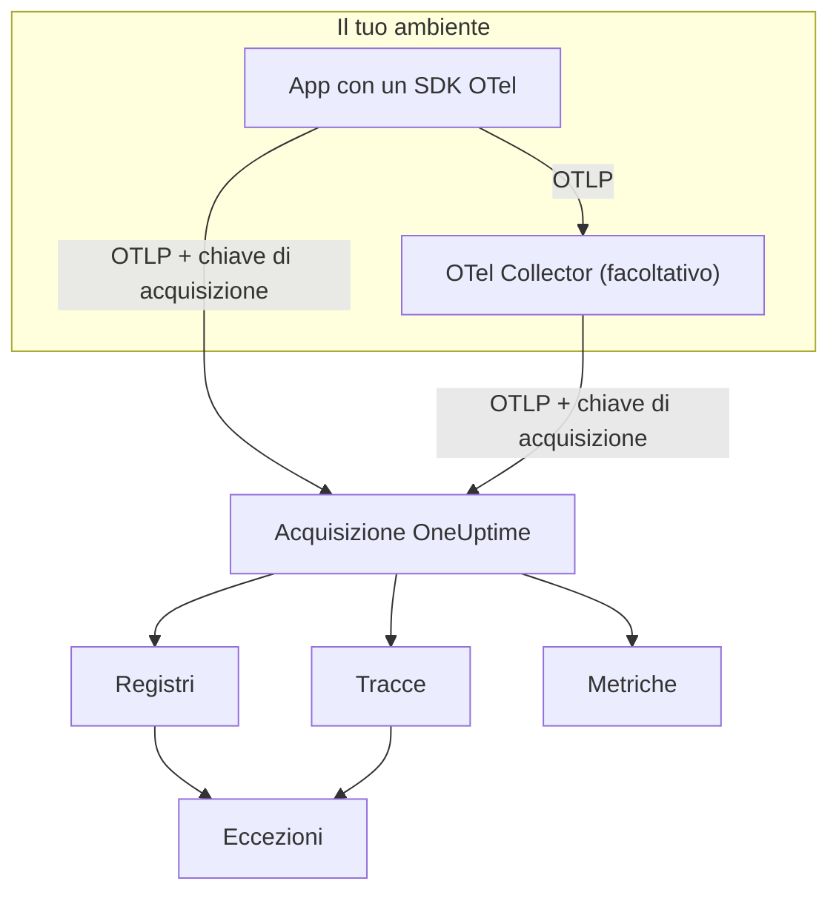

# OpenTelemetry

OneUptime acquisisce log, metriche e tracce tramite l'OpenTelemetry Protocol (OTLP). Punta qualsiasi SDK OpenTelemetry, o un OpenTelemetry Collector, verso OneUptime con una chiave di acquisizione, e i tuoi dati compaiono in **Registri**, **Tracce**, **Metriche** ed **Eccezioni**. Questa pagina fa inviare dati a un servizio in pochi minuti, poi descrive gli endpoint, i limiti e gli errori che ti servono in produzione.

:::cards
- [Avvio rapido](#avvio-rapido): Crea una chiave, imposta quattro variabili d'ambiente e aggiungi l'SDK.
- [Usare un Collector](#inviare-tramite-un-opentelemetry-collector): Aggiungi OneUptime come exporter a un collector che usi già.
- [Endpoint e limiti](#endpoint-e-limiti): URL, porte, codifiche, limiti di dimensione e codici di stato.
- [Risoluzione dei problemi](#risoluzione-dei-problemi): Cosa controllare quando non arrivano dati.
:::

## Come funziona

La tua applicazione esporta OTLP direttamente a OneUptime, oppure a un OpenTelemetry Collector che lo inoltra. Ogni richiesta porta la tua chiave di acquisizione nell'header `x-oneuptime-token`, e OneUptime usa la chiave per trovare il tuo progetto.



- **I servizi vengono creati per te.** L'attributo di risorsa `service.name` (impostato con `OTEL_SERVICE_NAME`) dà il nome al servizio a cui appartengono i tuoi dati. OneUptime crea il servizio al primo invio e lo elenca in **Prodotti → Servizi**.
- **Gli errori diventano eccezioni.** Gli eventi di eccezione sugli span e le eccezioni registrate nei log vengono raggruppati in problemi in **Eccezioni** — vedi [Eccezioni dai log](#eccezioni-dai-log).

## Prima di iniziare

- Un progetto OneUptime in cui puoi creare chiavi di acquisizione: possono farlo i proprietari e gli amministratori del progetto, e chiunque abbia il permesso **Create Telemetry Ingestion Key**.
- Un'applicazione a cui puoi aggiungere un SDK OpenTelemetry, oppure un OpenTelemetry Collector.
- HTTPS in uscita (porta 443) dalla tua applicazione o dal collector verso `oneuptime.com`, o verso il tuo host OneUptime.

> [!NOTE]
> Su OneUptime Cloud la telemetria si paga per GB acquisito. Un progetto con il piano Free ha bisogno di un metodo di pagamento prima di poter inviare telemetria: la finestra che crea la chiave mostra i prezzi.

## Avvio rapido

:::steps
### Creare una chiave di acquisizione

1. Vai a **Prodotti → Impostazioni del progetto**.
2. Nel menu laterale apri **Telemetria e APM** e seleziona **Chiavi di acquisizione**.
3. Fai clic su **Crea chiave di ingestione**. La finestra compila un nome e sceglie il tipo di chiave **Server**, quello con cui invia un'applicazione o un collector. Rinominala se vuoi, poi fai clic su **Crea chiave di ingestione**.


La nuova chiave si apre nella sua pagina. Copia la sua **Chiave segreta**: è il token che invii come `x-oneuptime-token`.


### Impostare le variabili d'ambiente OpenTelemetry

Tutti gli SDK OpenTelemetry leggono le stesse variabili d'ambiente standard, quindi questo passaggio è uguale in ogni linguaggio.

| Variabile d'ambiente | Valore | A cosa serve |
| --- | --- | --- |
| `OTEL_EXPORTER_OTLP_ENDPOINT` | `https://oneuptime.com/otlp` | Dove inviare. L'SDK aggiunge da solo `/v1/traces`, `/v1/metrics` e `/v1/logs`. |
| `OTEL_EXPORTER_OTLP_HEADERS` | `x-oneuptime-token=YOUR_ONEUPTIME_INGESTION_KEY` | Invia la tua chiave di acquisizione con ogni richiesta. |
| `OTEL_EXPORTER_OTLP_PROTOCOL` | `http/protobuf` | OTLP su HTTP. Alcuni SDK usano gRPC per impostazione predefinita, che usa un altro endpoint. |
| `OTEL_SERVICE_NAME` | `my-service` | Il servizio sotto cui compaiono i tuoi dati in OneUptime. |

```bash
export OTEL_EXPORTER_OTLP_ENDPOINT="https://oneuptime.com/otlp"
export OTEL_EXPORTER_OTLP_HEADERS="x-oneuptime-token=YOUR_ONEUPTIME_INGESTION_KEY"
export OTEL_EXPORTER_OTLP_PROTOCOL="http/protobuf"
export OTEL_SERVICE_NAME="my-service"
```

Self-hosted? Sostituisci `https://oneuptime.com` con l'URL della tua istanza OneUptime, per esempio `https://oneuptime.example.com/otlp`. Per etichettare le eccezioni con un ambiente, imposta anche `OTEL_RESOURCE_ATTRIBUTES` a `deployment.environment=production`.

### Aggiungere OpenTelemetry alla tua app

Scegli il tuo linguaggio. Ogni configurazione legge le variabili d'ambiente qui sopra, quindi nel tuo codice non compaiono né endpoint né chiavi.

:::tabs
@tab Node.js
Installa l'SDK, le strumentazioni automatiche e gli exporter OTLP/HTTP:

```bash
npm install @opentelemetry/sdk-node @opentelemetry/auto-instrumentations-node \
  @opentelemetry/exporter-trace-otlp-proto @opentelemetry/exporter-metrics-otlp-proto \
  @opentelemetry/exporter-logs-otlp-proto @opentelemetry/sdk-metrics @opentelemetry/sdk-logs
```

Crea l'SDK in un file a parte:

```javascript title="instrumentation.js"
const { NodeSDK } = require("@opentelemetry/sdk-node");
const { getNodeAutoInstrumentations } = require("@opentelemetry/auto-instrumentations-node");
const { OTLPTraceExporter } = require("@opentelemetry/exporter-trace-otlp-proto");
const { OTLPMetricExporter } = require("@opentelemetry/exporter-metrics-otlp-proto");
const { OTLPLogExporter } = require("@opentelemetry/exporter-logs-otlp-proto");
const { PeriodicExportingMetricReader } = require("@opentelemetry/sdk-metrics");
const { BatchLogRecordProcessor } = require("@opentelemetry/sdk-logs");

// The exporters read OTEL_EXPORTER_OTLP_ENDPOINT and OTEL_EXPORTER_OTLP_HEADERS.
const sdk = new NodeSDK({
  traceExporter: new OTLPTraceExporter(),
  metricReader: new PeriodicExportingMetricReader({
    exporter: new OTLPMetricExporter(),
  }),
  logRecordProcessors: [new BatchLogRecordProcessor(new OTLPLogExporter())],
  instrumentations: [getNodeAutoInstrumentations()],
});

sdk.start();
```

Caricalo prima del codice della tua applicazione:

```bash
node --require ./instrumentation.js app.js
```
@tab Python
Installa la distribuzione OpenTelemetry e l'exporter, poi le strumentazioni per le librerie che usa la tua app:

```bash
pip install opentelemetry-distro opentelemetry-exporter-otlp
opentelemetry-bootstrap -a install
```

Avvia la tua app tramite `opentelemetry-instrument`. Esporta tracce, metriche e log; la variabile del logging invia anche i record scritti con il modulo `logging` di Python:

```bash
OTEL_PYTHON_LOGGING_AUTO_INSTRUMENTATION_ENABLED=true opentelemetry-instrument python app.py
```
@tab Go
Aggiungi l'SDK e gli exporter OTLP/HTTP:

```bash
go get go.opentelemetry.io/otel go.opentelemetry.io/otel/sdk go.opentelemetry.io/otel/sdk/metric \
  go.opentelemetry.io/otel/exporters/otlp/otlptrace/otlptracehttp \
  go.opentelemetry.io/otel/exporters/otlp/otlpmetric/otlpmetrichttp
```

Crea i provider di tracer e meter all'avvio del programma:

```go title="main.go"
package main

import (
	"context"
	"log"

	"go.opentelemetry.io/otel"
	"go.opentelemetry.io/otel/exporters/otlp/otlpmetric/otlpmetrichttp"
	"go.opentelemetry.io/otel/exporters/otlp/otlptrace/otlptracehttp"
	sdkmetric "go.opentelemetry.io/otel/sdk/metric"
	sdktrace "go.opentelemetry.io/otel/sdk/trace"
)

func main() {
	ctx := context.Background()

	// Both exporters read OTEL_EXPORTER_OTLP_ENDPOINT and OTEL_EXPORTER_OTLP_HEADERS.
	traceExporter, err := otlptracehttp.New(ctx)
	if err != nil {
		log.Fatal(err)
	}
	tracerProvider := sdktrace.NewTracerProvider(sdktrace.WithBatcher(traceExporter))
	defer tracerProvider.Shutdown(ctx)
	otel.SetTracerProvider(tracerProvider)

	metricExporter, err := otlpmetrichttp.New(ctx)
	if err != nil {
		log.Fatal(err)
	}
	meterProvider := sdkmetric.NewMeterProvider(
		sdkmetric.WithReader(sdkmetric.NewPeriodicReader(metricExporter)),
	)
	defer meterProvider.Shutdown(ctx)
	otel.SetMeterProvider(meterProvider)

	// Your application code.
}
```

I provider prendono `OTEL_SERVICE_NAME` dall'ambiente. Per i log, aggiungi `otlploghttp` con un bridge di log come `otelslog`; legge le stesse variabili.
@tab Java
Scarica l'agente Java di OpenTelemetry e collegalo alla tua applicazione. Non serve modificare il codice:

```bash
curl -L -O https://github.com/open-telemetry/opentelemetry-java-instrumentation/releases/latest/download/opentelemetry-javaagent.jar
java -javaagent:opentelemetry-javaagent.jar -jar my-app.jar
```

L'agente strumenta i framework e le librerie più comuni ed esporta tracce, metriche e i log scritti tramite Logback o Log4j.
@tab .NET
Aggiungi i pacchetti OpenTelemetry per ASP.NET Core:

```bash
dotnet add package OpenTelemetry.Extensions.Hosting
dotnet add package OpenTelemetry.Exporter.OpenTelemetryProtocol
dotnet add package OpenTelemetry.Instrumentation.AspNetCore
dotnet add package OpenTelemetry.Instrumentation.Http
```

Registra OpenTelemetry all'avvio. `UseOtlpExporter()` invia tracce, metriche e log, e legge le variabili `OTEL_EXPORTER_OTLP_*`:

```csharp title="Program.cs"
using OpenTelemetry;
using OpenTelemetry.Metrics;
using OpenTelemetry.Trace;

var builder = WebApplication.CreateBuilder(args);

builder.Services.AddOpenTelemetry()
    .WithTracing(tracing => tracing
        .AddAspNetCoreInstrumentation()
        .AddHttpClientInstrumentation())
    .WithMetrics(metrics => metrics
        .AddAspNetCoreInstrumentation()
        .AddHttpClientInstrumentation())
    .WithLogging()
    .UseOtlpExporter();

var app = builder.Build();
app.Run();
```

Usi Serilog? Vedi [Serilog](/docs/telemetry/serilog) per inviare i suoi log a OneUptime.
:::

### Verificare che i dati arrivino

Chiedi a OneUptime se accetta la tua chiave:

```bash
curl -i -H "x-oneuptime-token: YOUR_ONEUPTIME_INGESTION_KEY" \
  https://oneuptime.com/otlp/v1/validate
```

Una chiave valida restituisce `200` con `"valid": true`. Qualsiasi altra cosa restituisce `401` con un messaggio che dice cosa non va: sconosciuta, disattivata o scaduta.

Poi avvia la tua app e usala per un minuto. Apri **Prodotti → Servizi**: il tuo servizio è elencato con il nome impostato in `OTEL_SERVICE_NAME`, con i suoi log, tracce, metriche ed eccezioni. **Prodotti → Registri**, **Prodotti → Tracce** e **Prodotti → Metriche** mostrano gli stessi dati per tutti i servizi.
:::

:::details Inviare un log di prova senza SDK
OTLP/HTTP accetta anche JSON, quindi puoi inviare un log con `curl`. Il valore `9` di `severityNumber` lo rende un log informativo:

```bash
curl -i https://oneuptime.com/otlp/v1/logs \
  -H "Content-Type: application/json" \
  -H "x-oneuptime-token: YOUR_ONEUPTIME_INGESTION_KEY" \
  -d '{
    "resourceLogs": [{
      "resource": {
        "attributes": [
          { "key": "service.name", "value": { "stringValue": "my-service" } }
        ]
      },
      "scopeLogs": [{
        "logRecords": [{
          "severityNumber": 9,
          "body": { "stringValue": "Hello from curl" }
        }]
      }]
    }]
  }'
```

Un `200` significa che il log è stato accettato. Compare in **Prodotti → Registri** entro pochi secondi, nel servizio `my-service`.
:::

## Inviare tramite un OpenTelemetry Collector

Usa un collector se ne hai già uno, se vuoi raggruppare, filtrare o arricchire i dati in un unico punto, oppure per tenere la chiave di acquisizione fuori dalle tue applicazioni. Le tue app esportano al collector, e solo il collector parla con OneUptime.

:::steps
### Aggiungere OneUptime come exporter

Aggiungi un exporter `otlphttp` che punta a OneUptime e fai passare ogni pipeline attraverso di esso:

```yaml title="otel-collector-config.yaml"
receivers:
  otlp:
    protocols:
      grpc:
        endpoint: 0.0.0.0:4317
      http:
        endpoint: 0.0.0.0:4318

processors:
  batch: {}

exporters:
  otlphttp:
    endpoint: https://oneuptime.com/otlp
    headers:
      x-oneuptime-token: YOUR_ONEUPTIME_INGESTION_KEY

service:
  pipelines:
    traces:
      receivers: [otlp]
      processors: [batch]
      exporters: [otlphttp]
    metrics:
      receivers: [otlp]
      processors: [batch]
      exporters: [otlphttp]
    logs:
      receivers: [otlp]
      processors: [batch]
      exporters: [otlphttp]
```

Mantieni le impostazioni predefinite dell'exporter: invia protobuf compresso con gzip, e OneUptime accetta entrambi. Non impostare un header `Content-Type` sull'exporter: OneUptime sceglie il decodificatore in base a quell'header, quindi un content type JSON davanti a byte protobuf rompe l'acquisizione.

### Avviare il collector

:::tabs
@tab Docker
```bash
docker run -d --name otel-collector \
  -p 4317:4317 -p 4318:4318 \
  -v "$(pwd)/otel-collector-config.yaml:/etc/otelcol-contrib/config.yaml" \
  otel/opentelemetry-collector-contrib:latest
```
@tab Linux
```bash
otelcol-contrib --config otel-collector-config.yaml
```
:::

Il collector ascolta OTLP sulla porta `4317` (gRPC) e `4318` (HTTP), le porte a cui gli SDK inviano per impostazione predefinita.

### Puntare le tue app al collector

Nelle tue applicazioni imposta `OTEL_EXPORTER_OTLP_ENDPOINT` sul collector, per esempio `http://localhost:4318`, e rimuovi `OTEL_EXPORTER_OTLP_HEADERS`: la chiave la aggiunge il collector. Mantieni `OTEL_SERVICE_NAME` in ogni applicazione.

I dati arrivano in OneUptime esattamente come nell'avvio rapido. Se non arrivano, il log del collector dice perché: vedi [Risoluzione dei problemi](#risoluzione-dei-problemi).
:::

Esporti già verso un altro fornitore? Aggiungi l'exporter `otlphttp` accanto a quello esistente ed elencali entrambi negli `exporters` di ogni pipeline per inviare a tutti e due mentre fai il confronto. Per raccogliere anche le metriche dell'host e i file di log, vedi la guida [Host OpenTelemetry Collector](/docs/telemetry/host-otel-collector).

## Endpoint e limiti

| Impostazione | OTLP/HTTP (consigliato) | OTLP/gRPC |
| --- | --- | --- |
| Endpoint | `https://oneuptime.com/otlp` | `https://oneuptime.com:443` |
| Autenticazione | Header `x-oneuptime-token` | Metadato `x-oneuptime-token` |
| Codifica | Protobuf (`application/x-protobuf`) o JSON (`application/json`) | Protobuf |
| Compressione | Nessuna, `gzip`, `deflate` o `zstd` | Nessuna o `gzip` |
| Dimensione della richiesta | Fino a 4 MB per richiesta su `/otlp` | Fino a 4 MB per messaggio |

Su HTTP, ogni segnale ha il proprio percorso sotto l'endpoint. Gli SDK e il collector lo aggiungono per te; impostalo tu solo quando uno strumento chiede un URL completo.

| Segnale | URL OTLP/HTTP |
| --- | --- |
| Tracce | `https://oneuptime.com/otlp/v1/traces` |
| Metriche | `https://oneuptime.com/otlp/v1/metrics` |
| Log | `https://oneuptime.com/otlp/v1/logs` |
| Profili | `https://oneuptime.com/otlp/v1/profiles` |

Per la profilazione continua, la maggior parte dei profiler invia invece all'endpoint compatibile con Pyroscope: vedi [Profilazione continua](/docs/telemetry/profiles). Un collector che esporta profili OTLP deve impostare il `profiles_endpoint` dell'exporter su `https://oneuptime.com/otlp/v1/profiles`, perché per impostazione predefinita invia i profili a un percorso di sviluppo che OneUptime non serve.

### OTLP su gRPC

OneUptime serve OTLP/gRPC sullo stesso host dell'app web, sulla porta 443 tramite TLS. Imposta `OTEL_EXPORTER_OTLP_PROTOCOL` a `grpc` e `OTEL_EXPORTER_OTLP_ENDPOINT` a `https://oneuptime.com:443`, e invia lo stesso header `x-oneuptime-token`. In un collector usa l'exporter `otlp` con `endpoint: oneuptime.com:443` e gli stessi `headers`.

In un'installazione self-hosted, gRPC raggiunge OneUptime solo tramite HTTPS: una connessione HTTP in chiaro (h2c) viene rifiutata. Se la tua istanza è servita in HTTP semplice, usa OTLP/HTTP.

Due impostazioni di una chiave valgono solo per OTLP/HTTP: il suo **Requests Per Minute Limit** e il suo **Pinned Service Name**. I dati inviati tramite gRPC mantengono il `service.name` con cui sono stati inviati e non vengono contati nel limite.

### Risposte

OneUptime risponde a un'esportazione non appena i dati sono in coda, e i dati compaiono qualche secondo dopo.

| Risposta | Stato gRPC | Significato | Cosa fare |
| --- | --- | --- | --- |
| `200` | `OK` | Accettato. | Niente. |
| `401` | `UNAUTHENTICATED` | La chiave manca, è sconosciuta o è scaduta. | Confronta il valore di `x-oneuptime-token` con la **Chiave segreta** della chiave. |
| `402` | `PERMISSION_DENIED` | Solo OneUptime Cloud: il progetto è sul piano Free e non ha un metodo di pagamento. | Aggiungine uno in **Impostazioni del progetto → Fatturazione e fatture → Fatturazione**. |
| `413` | — | La richiesta supera il limite di dimensione. | Invia batch più piccoli. |
| `415` | — | `Content-Encoding` non supportato. | Usa `gzip`, `deflate` o `zstd`, oppure nessuna compressione. |
| `422` | `PERMISSION_DENIED` | La chiave è disattivata, oppure è una chiave Browser usata fuori dalle sue origini consentite. | Riattiva la chiave, oppure invia con una chiave Server. |
| `429` | — | È stato raggiunto il **Requests Per Minute Limit** della chiave. | All'inizio niente: gli exporter riprovano dopo il tempo indicato da `Retry-After`. Alza il limite se succede spesso. |
| `503` | `UNAVAILABLE` | OneUptime si sta avviando, oppure la coda di acquisizione non è disponibile. | Niente: gli exporter OTLP ripetono da soli dopo un `503`. |

`401`, `402`, `413`, `415` e `422` sono errori permanenti per gli exporter OTLP: l'exporter scarta il batch e registra l'errore invece di riprovare.

### Riavvii e aggiornamenti

Mentre OneUptime si riavvia o viene aggiornato, risponde alle esportazioni con `503` e `Retry-After: 5` finché non è pronto, e gli exporter le inviano di nuovo. L'exporter di un collector riprova per cinque minuti per impostazione predefinita (`retry_on_failure`) e tiene ciò che non è riuscito a inviare nella sua `sending_queue`, quindi lascia entrambi attivi. Il tempo in cui OneUptime non riceveva dati non viene mai imputato ai tuoi server, host o altre risorse: vedi [Quando OneUptime non riceve dati](/docs/monitor/when-oneuptime-is-not-receiving#allavvio).

### Chiavi di acquisizione

La pagina di ogni chiave, in **Impostazioni del progetto → Telemetria e APM → Chiavi di acquisizione**, ha queste impostazioni:

| Impostazione | A cosa serve |
| --- | --- |
| **Tipo di chiave** | **Server** (predefinito) per applicazioni, collector e agenti. **Browser** per chiavi distribuite in una pagina web: solo scrittura, e accettate solo dalle sue **Allowed Origins**. Non si può cambiare dopo la creazione della chiave. |
| **Allowed Origins** | Le origini web da cui funziona una chiave Browser, come `https://app.example.com`. Ignorato su una chiave Server. |
| **Pinned Service Name** | Se impostato, sostituisce `service.name` su tutto ciò che viene inviato con questa chiave tramite OTLP/HTTP. |
| **Abilitato** | Disattivalo per smettere subito di accettare i dati inviati con la chiave, senza eliminarla. |
| **Scade il** | Dopo questa data la chiave viene rifiutata. Vuoto significa che non scade mai. |
| **Requests Per Minute Limit** | Il numero massimo di richieste OTLP/HTTP al minuto accettate con la chiave, considerando tutti i client che la usano. Vuoto significa nessun limite su una chiave Server e 6.000 su una chiave Browser. |
| **Last Used At** | Quando sono stati accettati per l'ultima volta dei dati con la chiave. Usalo per trovare le chiavi che puoi ruotare o eliminare senza rischi. |

**Reimposta la chiave segreta** nella pagina della chiave sostituisce il segreto. Ogni applicazione e ogni collector che invia con quello vecchio viene rifiutato finché non lo aggiorni.

## OneUptime self-hosted

Tutto ciò che è in questa pagina funziona allo stesso modo con la tua installazione. Usa il tuo URL di OneUptime ovunque questa pagina indica `https://oneuptime.com`:

- `OTEL_EXPORTER_OTLP_ENDPOINT` è `https://YOUR-ONEUPTIME-HOST/otlp`, oppure `http://YOUR-ONEUPTIME-HOST/otlp` se servi OneUptime in HTTP semplice.
- L'ingress incluso accetta richieste fino a 4 MB su `/otlp`. Un proxy che metti davanti a OneUptime può avere un limite più basso (ingress-nginx imposta `proxy-body-size` a 1 MB per impostazione predefinita), quindi alzalo anche per `/otlp`, altrimenti gli exporter ricevono `413`.
- Se è impostato `DISABLE_TELEMETRY_INGESTION=true`, OneUptime accetta ogni esportazione e non memorizza nulla. Controllalo per primo quando un'istanza self-hosted non mostra alcun dato.

## Eccezioni dai log

OneUptime trova le eccezioni nei tuoi **logs** e le riunisce nella stessa vista **Eccezioni** alimentata dagli errori delle tracce. Ogni log appartiene già a un servizio o a un host, quindi l'eccezione viene attribuita a esso. Le eccezioni dei log e delle tracce condividono il raggruppamento per impronta, così un errore segnalato sia da una traccia sia da un log diventa un unico problema.

Un log diventa un'eccezione in due modi:

| Rilevamento | Log a cui si applica | Come funziona |
| --- | --- | --- |
| **Attributi di eccezione** (consigliato) | Qualsiasi log | Un record di log con l'attributo OpenTelemetry `exception.type`, `exception.message` o `exception.stacktrace` diventa direttamente un'eccezione. La maggior parte delle integrazioni di logging li imposta quando registri un'eccezione: gli appender di Logback e Log4j, Serilog, la strumentazione del logging di Python. È preciso e funziona in ogni linguaggio. |
| **Stack trace nel corpo** | Log di errore e fatali che non hanno un ID di traccia e un ID di span | OneUptime analizza i primi 16 KB del corpo cercando uno stack trace JavaScript, Python, Java, Go, Ruby, C#/.NET o PHP, e ne ricava tipo, messaggio e frame. Un log scritto all'interno di uno span viene saltato, perché è lo span stesso a segnalare l'eccezione. |

L'analisi del corpo è adatta ai log in testo semplice come stdout grezzo, journald o syslog letti da un collector. Uno stack trace su più righe deve arrivare come un unico record di log, quindi attiva la ricomposizione multiriga nel collector: vedi la guida [Host OpenTelemetry Collector](/docs/telemetry/host-otel-collector).

Il rilevamento è attivo per impostazione predefinita. In un'installazione self-hosted disattivalo impostando `TELEMETRY_LOG_EXCEPTION_EXTRACTION_ENABLED=false` sul servizio `app`, e anche sul `worker` se usi il worker dedicato del chart Helm.

## Risoluzione dei problemi

:::details Non compaiono dati e l'exporter registra `401`
La chiave manca, è sconosciuta o è scaduta. Controlla che `OTEL_EXPORTER_OTLP_HEADERS` sia `x-oneuptime-token=` seguito dalla **Chiave segreta** della chiave, senza virgolette né spazi nel valore, e che la chiave appartenga al progetto che stai guardando. La richiesta di verifica in [Verificare che i dati arrivino](#verificare-che-i-dati-arrivino) dice di quale caso si tratta.
:::

:::details L'exporter registra `422`
La chiave è disattivata, oppure è una chiave Browser. Riattiva **Abilitato** nelle impostazioni della chiave, oppure crea una chiave **Server**: una chiave Browser è accettata solo da una pagina web su una delle sue origini consentite.
:::

:::details L'exporter registra `402`
Il progetto è sul piano Free di OneUptime Cloud e non ha un metodo di pagamento, e la telemetria si paga a consumo. Aggiungi un metodo di pagamento in **Impostazioni del progetto → Fatturazione e fatture → Fatturazione**, e le esportazioni tornano ad essere accettate.
:::

:::details L'exporter registra `404`
L'SDK sta inviando al percorso sbagliato. `OTEL_EXPORTER_OTLP_ENDPOINT` deve terminare con `/otlp`, senza barra finale e senza `/v1/...`: lo aggiunge l'SDK. Se imposti una variabile specifica per un segnale come `OTEL_EXPORTER_OTLP_TRACES_ENDPOINT`, richiede l'URL completo, per esempio `https://oneuptime.com/otlp/v1/traces`.
:::

:::details Non succede niente e l'SDK registra errori di connessione
Probabilmente l'SDK sta esportando tramite gRPC verso un endpoint HTTP, oppure verso `localhost`. Imposta `OTEL_EXPORTER_OTLP_PROTOCOL=http/protobuf`, oppure usa l'endpoint gRPC descritto in [OTLP su gRPC](#otlp-su-grpc). Controlla anche che il processo veda davvero le variabili d'ambiente: in un container, impostale sul container, non nella tua shell.
:::

:::details Il collector registra `Exporting failed` con `413`
Un batch supera il limite di dimensione. Riduci la dimensione dei batch, per esempio con `send_batch_max_size: 1000` sul processore `batch`. Se hai un'installazione self-hosted dietro un tuo proxy, controlla anche il limite di dimensione del corpo di quel proxy.
:::

:::details I dati arrivano sotto il servizio sbagliato, o sotto Unknown Service
Il servizio deriva dall'attributo di risorsa `service.name`. Imposta `OTEL_SERVICE_NAME` in ogni applicazione. Se la chiave ha un **Pinned Service Name**, ogni esportazione OTLP/HTTP con quella chiave viene archiviata invece sotto quel nome.
:::

## Passaggi successivi

:::cards
- [Sintassi di ricerca](/docs/telemetry/search-syntax): Filtrare log, tracce, metriche ed eccezioni negli explorer.
- [Pipeline di log](/docs/telemetry/log-pipelines): Analizzare e arricchire i log al loro arrivo.
- [Monitor dei log](/docs/monitor/logs-monitor): Ricevere un avviso quando compaiono log corrispondenti.
- [Host OpenTelemetry Collector](/docs/telemetry/host-otel-collector): Raccogliere metriche dell'host e file di log con un collector.
:::
