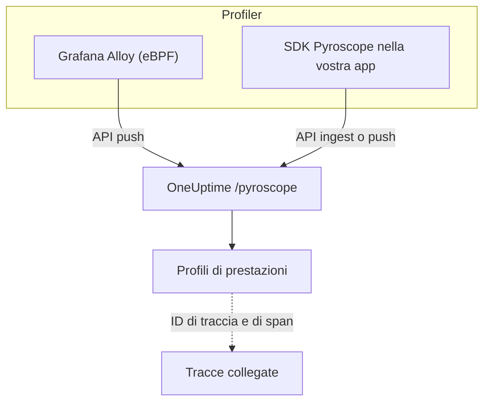

# Profilazione continua

La profilazione continua mostra come la vostra applicazione spende tempo CPU e memoria, funzione per funzione. OneUptime espone un'**API di acquisizione compatibile con Pyroscope**, quindi tutto ciò che può inviare dati a un server Pyroscope (il profiler eBPF di Grafana Alloy o un SDK Pyroscope per il vostro linguaggio) può inviarli a OneUptime, e leggete il risultato come flame graph accanto a log, metriche e tracce.

:::cards
- [Inviare i profili](#inviare-i-profili): Grafana Alloy con eBPF, o un SDK Pyroscope nella vostra app.
- [Endpoint di acquisizione](#endpoint-di-acquisizione): L'URL di base e i tre modi per passare la chiave.
- [Verificare che funzioni](#verificare-che-funzioni): Controllare la chiave, la pagina e lo stato dei caricamenti.
- [Esplorare i profili](#esplorare-i-profili-in-oneuptime): Flame graph, funzioni principali, confronti e collegamenti alle tracce.
:::

## Come funziona

Un profiler campiona i vostri processi e carica un profilo ogni pochi secondi sull'endpoint `/pyroscope` di OneUptime, con la vostra chiave di acquisizione. OneUptime memorizza ogni profilo sotto il servizio che indica e lo disegna come flame graph in **Profili di prestazioni**.



## Prima di iniziare

Vi serve una chiave di acquisizione della telemetria di tipo **Server**. Se non ne avete ancora una:

:::steps
### Aprire le chiavi di acquisizione

Andate in **Prodotti → Impostazioni del progetto**, aprite **Telemetria e APM** nel menu laterale e selezionate **Chiavi di acquisizione**.


### Creare una chiave

Fate clic su **Crea chiave di ingestione**. La finestra di dialogo ha già il nome della chiave compilato e **Server** selezionato (il tipo di chiave con cui invia un'applicazione o un collector), quindi fate clic su **Crea chiave di ingestione** per crearla, oppure rinominatela prima.

### Copiare il segreto

La nuova chiave si apre nella sua pagina. Copiatene la **Chiave segreta**: è il token di acquisizione che gli esempi qui sotto chiamano `YOUR_ONEUPTIME_INGESTION_TOKEN`.


:::

## Endpoint di acquisizione

| Impostazione | Valore |
| --- | --- |
| URL di base (indirizzo del server Pyroscope) | `https://oneuptime.com/pyroscope` |
| Intestazione di autenticazione | `x-oneuptime-token: YOUR_ONEUPTIME_INGESTION_TOKEN` |

I client aggiungono il proprio percorso all'URL di base (`/ingest` per la maggior parte degli SDK Pyroscope, `/push.v1.PusherService/Push` per Grafana Alloy e per l'SDK .NET da v0.14), quindi configurate sempre solo l'URL di base, senza barra finale.

OneUptime legge il token di acquisizione da una qualsiasi di queste fonti; usate quella supportata dal vostro client:

| Metodo | Quando usarlo |
| --- | --- |
| Intestazione `x-oneuptime-token` | Client che permettono di aggiungere intestazioni personalizzate. |
| `Authorization: Bearer <token>` | SDK con un'opzione `authToken` / `auth_token`: è ciò che inviano. |
| Autenticazione HTTP basic, con il token come **password** (qualsiasi nome utente) | Client che offrono solo utente e password per l'autenticazione basic. |

> [!NOTE]
> Ospitate OneUptime in autonomia? Sostituite `https://oneuptime.com` con il vostro host, per esempio `https://YOUR-ONEUPTIME-HOST/pyroscope`.

## Formati di profilo supportati

| Formato | Inviato da | Supportato |
| --- | --- | --- |
| pprof (protobuf binario, eventualmente compresso con gzip) | SDK Pyroscope per Go, Node.js e .NET; Grafana Alloy | Sì |
| Testo folded / collapsed | SDK Pyroscope per Python, Ruby e Rust (il loro formato di caricamento predefinito) | Sì |
| JFR (Java Flight Recorder) | Agente Java di Pyroscope | Non ancora: usate Grafana Alloy per i servizi Java |

## Inviare i profili

Grafana Alloy profila ogni processo di un host senza modifiche al codice ed è il modo consigliato per iniziare. Un SDK Pyroscope, invece, gira all'interno della vostra applicazione.

:::tabs
@tab Grafana Alloy
[Grafana Alloy](https://grafana.com/docs/alloy/latest/) raccoglie con eBPF i profili CPU di ogni processo di un host Linux: nessun agente nella vostra applicazione e nessuna modifica al codice. Funziona per Go, Rust, C/C++, Java, Python, Ruby, PHP, Node.js e .NET.

Create la configurazione di Alloy:

```hcl title="alloy-config.alloy"
discovery.process "all" {
  refresh_interval = "60s"
}

discovery.relabel "alloy_profiles" {
  targets = discovery.process.all.targets

  rule {
    action       = "replace"
    source_labels = ["__meta_process_exe"]
    target_label  = "service_name"
  }
}

pyroscope.ebpf "default" {
  targets    = discovery.relabel.alloy_profiles.output
  forward_to = [pyroscope.write.oneuptime.receiver]

  collect_interval = "15s"
  sample_rate      = 97
}

pyroscope.write "oneuptime" {
  endpoint {
    url = "https://oneuptime.com/pyroscope"
    headers = {
      "x-oneuptime-token" = "YOUR_ONEUPTIME_INGESTION_TOKEN",
    }
  }
}
```

Eseguitelo con Docker. eBPF richiede un container privilegiato con lo spazio dei nomi PID dell'host:

```yaml title="docker-compose.yml"
services:
  alloy:
    image: grafana/alloy:latest
    privileged: true
    pid: host
    volumes:
      - ./alloy-config.alloy:/etc/alloy/config.alloy
      - /proc:/proc:ro
      - /sys:/sys:ro
    command:
      - run
      - /etc/alloy/config.alloy
```

Oppure eseguitelo direttamente sull'host:

```bash
alloy run alloy-config.alloy
```

La regola di rietichettatura dà al servizio di ogni profilo il nome dell'eseguibile del processo.
@tab Go
L'SDK Go carica pprof. Puntate il suo indirizzo del server all'URL di base di OneUptime e passate il vostro token di acquisizione come token di autenticazione:

```go
import "github.com/grafana/pyroscope-go"

pyroscope.Start(pyroscope.Config{
    ApplicationName: "my-service",
    ServerAddress:   "https://oneuptime.com/pyroscope",
    AuthToken:       "YOUR_ONEUPTIME_INGESTION_TOKEN",
    ProfileTypes: []pyroscope.ProfileType{
        pyroscope.ProfileCPU,
        pyroscope.ProfileAllocObjects,
        pyroscope.ProfileAllocSpace,
        pyroscope.ProfileInuseObjects,
        pyroscope.ProfileInuseSpace,
        pyroscope.ProfileGoroutines,
    },
})
```
@tab Node.js
L'SDK Node.js carica pprof:

```javascript
const Pyroscope = require("@pyroscope/nodejs");

Pyroscope.init({
  serverAddress: "https://oneuptime.com/pyroscope",
  appName: "my-service",
  authToken: "YOUR_ONEUPTIME_INGESTION_TOKEN",
});

Pyroscope.start();
```
@tab Python
L'SDK Python carica testo folded:

```python
import pyroscope

pyroscope.configure(
    application_name="my-service",
    server_address="https://oneuptime.com/pyroscope",
    auth_token="YOUR_ONEUPTIME_INGESTION_TOKEN",
)
```
@tab .NET
Il profiler .NET di Pyroscope è un profiler CLR nativo: non richiede modifiche al codice e si attiva interamente tramite variabili d'ambiente. Scaricate la versione per la vostra immagine da [pyroscope-dotnet releases](https://github.com/grafana/pyroscope-dotnet/releases) (`glibc` o `musl` per Alpine, `x86_64` o `aarch64`) e caricatela nel runtime:

```dockerfile title="Dockerfile"
FROM alpine:3.20 AS pyroscope-profiler
ARG PYROSCOPE_DOTNET_VERSION=1.5.1
ADD https://github.com/grafana/pyroscope-dotnet/releases/download/pyroscope-${PYROSCOPE_DOTNET_VERSION}/pyroscope.${PYROSCOPE_DOTNET_VERSION}-glibc-x86_64.tar.gz /tmp/pyroscope.tar.gz
RUN mkdir -p /pyroscope && tar -xzf /tmp/pyroscope.tar.gz -C /pyroscope

FROM mcr.microsoft.com/dotnet/aspnet:10.0
# ... your application ...
COPY --from=pyroscope-profiler /pyroscope /pyroscope
ENV CORECLR_ENABLE_PROFILING=1
ENV CORECLR_PROFILER={BD1A650D-AC5D-4896-B64F-D6FA25D6B26A}
ENV CORECLR_PROFILER_PATH=/pyroscope/Pyroscope.Profiler.Native.so
ENV LD_PRELOAD=/pyroscope/Pyroscope.Linux.ApiWrapper.x64.so
ENV LD_LIBRARY_PATH=/pyroscope
```

Poi puntatelo a OneUptime, per esempio nel vostro ambiente Kubernetes / Helm:

```bash
PYROSCOPE_APPLICATION_NAME=my-service
PYROSCOPE_PROFILING_ENABLED=1
PYROSCOPE_SERVER_ADDRESS=https://oneuptime.com/pyroscope
PYROSCOPE_BASIC_AUTH_USER=oneuptime
PYROSCOPE_BASIC_AUTH_PASSWORD=YOUR_ONEUPTIME_INGESTION_TOKEN
```

Il token di acquisizione va nella password dell'autenticazione basic. Il nome utente può essere qualsiasi valore non vuoto, ma il profiler non invia alcuna credenziale se non sono impostati entrambi. Per inviare invece il token come intestazione, impostate `PYROSCOPE_HTTP_HEADERS={"x-oneuptime-token":"YOUR_ONEUPTIME_INGESTION_TOKEN"}`.

Come si passa il token dipende dalla versione del profiler. Le versioni 1.5 e successive ignorano `PYROSCOPE_AUTH_TOKEN`, quindi se aggiornate da una versione precedente mantenendo quell'impostazione, ogni caricamento viene rifiutato con `401`:

| Versione di pyroscope-dotnet | Carica su | Impostazione del token |
| --- | --- | --- |
| v0.13 e precedenti | `/pyroscope/ingest` | `PYROSCOPE_AUTH_TOKEN` |
| da v0.14 a 1.4 | `/pyroscope/push.v1.PusherService/Push` | `PYROSCOPE_AUTH_TOKEN` |
| 1.5 e successive | `/pyroscope/push.v1.PusherService/Push` | `PYROSCOPE_BASIC_AUTH_USER=oneuptime` e `PYROSCOPE_BASIC_AUTH_PASSWORD=<token>` (vanno impostate entrambe), oppure `PYROSCOPE_HTTP_HEADERS={"x-oneuptime-token":"<token>"}` |

Le versioni precedenti alla 1.0 hanno il tag `v<version>-pyroscope` invece di `pyroscope-<version>` (per esempio `https://github.com/grafana/pyroscope-dotnet/releases/download/v0.13.0-pyroscope/pyroscope.0.13.0-glibc-x86_64.tar.gz`); il GUID del profiler e i nomi dei file sono gli stessi in ogni versione.

La profilazione della CPU è attiva per impostazione predefinita. Le profilazioni di tempo reale, allocazioni, eccezioni e contesa dei lock sono facoltative: impostate `PYROSCOPE_PROFILING_WALLTIME_ENABLED`, `PYROSCOPE_PROFILING_ALLOCATION_ENABLED`, `PYROSCOPE_PROFILING_EXCEPTION_ENABLED` o `PYROSCOPE_PROFILING_LOCK_ENABLED` su `true`. Le etichette statiche vanno in `PYROSCOPE_LABELS` (`key:value,key:value`).

Il profiler carica ogni 15 secondi e **non** comprime i caricamenti, quindi un servizio sotto carico può inviare diversi MB per caricamento. L'ingress di OneUptime accetta fino a 16 MB su `/pyroscope`; se davanti a OneUptime c'è un altro proxy (per esempio ingress-nginx, il cui `proxy-body-size` predefinito è 1 MB), alzate anche il suo limite di dimensione per `/pyroscope`, altrimenti i caricamenti grandi vengono rifiutati con `413` prima di raggiungere OneUptime.
@tab Java
L'agente Java di Pyroscope carica i profili in formato JFR, che OneUptime non acquisisce ancora. Profilate invece i servizi Java con Grafana Alloy (la scheda **Grafana Alloy**): cattura i profili CPU della JVM senza agente né modifiche al codice.
:::

**Ruby** e **Rust** funzionano come Go, Node.js e Python: installate l'[SDK Pyroscope per il vostro linguaggio](https://grafana.com/docs/pyroscope/latest/configure-client/) e impostate l'indirizzo del server su `https://oneuptime.com/pyroscope` con il vostro token di acquisizione come token di autenticazione (oppure, se la vostra versione dell'SDK offre solo l'autenticazione basic, come password basic).

## Tipi di profilo supportati

Un pprof può dichiarare più tipi di campione; ogni profilo caricato viene memorizzato sotto uno di essi: il tempo CPU (`cpu` in nanosecondi) se lo ha, altrimenti il tempo reale, altrimenti i byte in uso e poi quelli allocati, altrimenti il primo tipo che dichiara. Qualsiasi tipo viene memorizzato e si può consultare; i tipi seguenti hanno raggruppamento, unità ed etichette dedicati in OneUptime:

| Tipo di profilo | Mostrato come | Unità |
| --- | --- | --- |
| `cpu`, `samples` | Tempo CPU | nanosecondi |
| `wall` | Tempo reale | nanosecondi |
| `inuse_space`, `alloc_space`, `heap` | Memoria (byte) | byte |
| `inuse_objects`, `alloc_objects` | Memoria (numero di oggetti) | conteggio |
| `mutex`, `contention`, `block` | Contesa dei lock | nanosecondi |
| `goroutine` | Goroutines (Go) | conteggio |

Tutto il resto (per esempio un tipo di campione personalizzato) compare in «Altro» con il suo nome originale.

## Verificare che funzioni

:::steps
### Controllare il token

Gli endpoint di acquisizione rispondono `401` a un token mancante o non valido, ma la maggior parte dei profiler non lo mostra da nessuna parte dove lo vedreste (il profiler .NET, per esempio, registra le risposte HTTP solo a livello debug). Interrogate direttamente l'endpoint di convalida:

```bash
curl -i -H "x-oneuptime-token: YOUR_ONEUPTIME_INGESTION_TOKEN" \
  https://oneuptime.com/otlp/v1/validate
```

Un token valido restituisce `200` con `{"valid": true, ...}`, e il suo `keyType` deve essere `Server`: anche una chiave per browser è valida, ma non può inviare profili. Un token sconosciuto, revocato, disattivato o scaduto restituisce `401`.

### Aprire la pagina dei profili

Nella dashboard di OneUptime andate in **Prodotti → Profili di performance**. Con l'intervallo di raccolta di 15 secondi di Alloy (o l'intervallo di caricamento degli SDK, da 10 a 15 secondi), i primi profili e i loro flame graph compaiono entro un paio di minuti dall'avvio dell'agente.

### Controllare il servizio

I profili vengono associati al servizio di telemetria indicato da `application_name` / `appName` / `PYROSCOPE_APPLICATION_NAME` dell'SDK (o dal nome dell'eseguibile del processo con la regola di rietichettatura di Alloy vista sopra).

### Ancora niente? Guardate lo stato dei caricamenti

Per il profiler .NET, impostate `DD_TRACE_DEBUG=1` sull'applicazione per un minuto: registrerà una riga `PyroscopePprofSink <status>` per ogni caricamento. `200` significa che OneUptime l'ha accettato; `401` è il token; `404` di solito significa che a `PYROSCOPE_SERVER_ADDRESS` manca il suffisso `/pyroscope`; `413` significa che un proxy davanti a OneUptime ha rifiutato il caricamento per le sue dimensioni (vedete la scheda **.NET** in [Inviare i profili](#inviare-i-profili)). Se ospitate OneUptime in autonomia, il log di accesso dell'ingress (nginx) registra lo stesso stato per ogni richiesta a `/pyroscope`.
:::

## Esplorare i profili in OneUptime

**Prodotti → Profili di performance** apre una panoramica di dove va il tempo nei vostri servizi, e **Tutti i profili** elenca ogni caricamento. Scegliete cosa analizzare: **Tutto**, **Tempo CPU**, **Memoria** o **Lock**, oppure un tipo specifico come **Tempo reale** o **Goroutines**.

La pagina di un profilo ha tre viste:

| Vista | Cosa mostra |
| --- | --- |
| **Flame graph** | Ogni barra è una funzione dello stack di chiamate, e la sua larghezza è proporzionale al tempo o alle risorse consumati. Fate clic su una funzione per ingrandirla e vederne chiamanti e chiamate. |
| **Top functions** | Le funzioni del profilo, ordinate per tempo proprio o totale. **Only my code** nasconde i frame delle librerie. |
| **Diff vs. baseline** | Il profilo confrontato con un periodo precedente (**rispetto a 1 ora fa**, **rispetto a ieri** o **rispetto alla scorsa settimana**), con le funzioni **Most regressed** e **Most improved**. |

**Download pprof** salva il profilo per strumenti locali come `go tool pprof`.

### Correlazione con le tracce

Quando un profilo contiene ID di traccia e di span (per esempio come etichette di campione `trace_id` / `span_id`), potete passare direttamente da uno span lento di una traccia al profilo CPU o di memoria corrispondente per capire esattamente quale codice era in esecuzione, e **Open linked trace** fa il percorso inverso.

La scheda **Profilo** di uno span include anche i campioni collegati agli span annidati sotto di esso, perché i profiler spesso attribuiscono il tempo CPU di una richiesta a uno span figlio anziché allo span della richiesta stessa.

## Conservazione dei dati

I profili vengono conservati per la durata della conservazione della telemetria del vostro progetto: **Impostazioni del progetto → Telemetria e APM → Conservazione dei dati** imposta la **Conservazione predefinita (giorni)**, 15 giorni se non la cambiate. I dati vengono eliminati automaticamente alla fine del periodo di conservazione. I piani che includono eccezioni alla conservazione possono anche tenere i profili più o meno a lungo rispetto al resto della telemetria, o impostare la conservazione per singolo servizio nella pagina **Impostazioni** del servizio.

## Passaggi successivi

:::cards
- [Monitor profili](/docs/monitor/profiles-monitor): Ricevere avvisi sui profili che i vostri servizi inviano, per numero e tipo.
- [OpenTelemetry](/docs/telemetry/open-telemetry): Inviare le tracce a cui sono collegati i vostri profili.
- [Agent Kubernetes](/docs/telemetry/kubernetes-agent): Profilare un intero cluster con il profiler eBPF dell'agente.
:::
