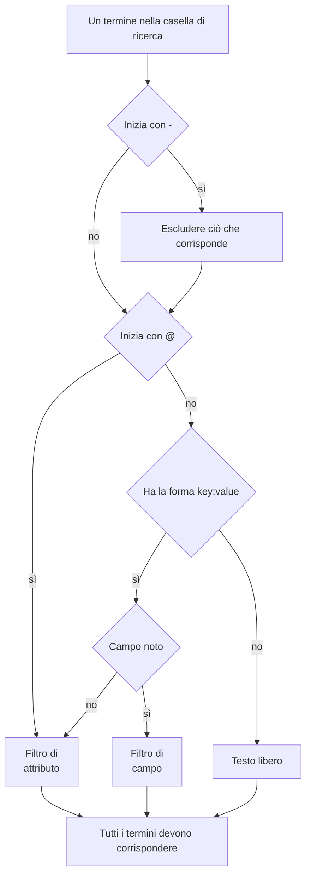

# Sintassi di ricerca

La casella di ricerca sopra gli explorer di log, tracce, metriche ed eccezioni parla un unico linguaggio di query. Una query è un elenco di filtri separati da spazi, e **ogni filtro deve corrispondere**: tra i filtri non c'è nessun OR implicito. Usate questa pagina come riferimento mentre cercate.

:::cards
- [I due tipi di filtro](#i-due-tipi-di-filtro): Campi integrati, attributi e testo libero.
- [Corrispondenza dei valori](#corrispondenza-dei-valori): Caratteri jolly, «contiene», confronti ed elenchi.
- [Escludere](#escludere): Invertire qualsiasi filtro con un `-` iniziale.
- [Campi per segnale](#campi-per-segnale): Su cosa potete filtrare in ogni explorer.
:::

## Come si legge una query

```text
severity:error @platform.team:a* -@http.method:GET timeout
```

Si legge così: i log di livello errore il cui attributo `platform.team` inizia con `a`, il cui attributo `http.method` non è `GET` e il cui messaggio menziona `timeout`.

| Termine | Tipo | Corrisponde a |
| --- | --- | --- |
| `severity:error` | Campo | La gravità del log è Error. |
| `@platform.team:a*` | Attributo | L'attributo `platform.team` inizia con `a`. |
| `-@http.method:GET` | Attributo escluso | L'attributo `http.method` è qualsiasi cosa tranne `GET`. |
| `timeout` | Testo libero | Il messaggio contiene `timeout`. |

Ogni termine separato da spazi viene letto da solo, poi tutti vengono combinati con AND:



## I due tipi di filtro

| Forma | Filtra | Esempio |
| --- | --- | --- |
| `field:value` | Un campo integrato del segnale | `severity:error` |
| `@attribute:value` | Un attributo OpenTelemetry della riga | `@http.status_code:500` |
| parole semplici | Il messaggio (log), il nome dello span (tracce), il nome della metrica (metriche) o il messaggio dell'eccezione (eccezioni) | `connection refused` |

Un `key:value` semplice la cui chiave non è un campo noto viene trattato come attributo, quindi `k8s.pod:api-0` e `@k8s.pod:api-0` significano la stessa cosa. Il prefisso `@` significa sempre «cerca negli attributi», con un'eccezione: nell'explorer delle eccezioni, `@type:`, `@service:`, `@env:` e `@class:` filtrano comunque quei campi.

Un testo che contiene per caso i due punti resta testo: `https://example.com` e `12:30` vengono cercati come parole, non letti come filtri.

## Corrispondenza dei valori

Tutto ciò che è in questa tabella funziona su qualsiasi attributo e sulla maggior parte dei campi integrati; [Campi per segnale](#campi-per-segnale) indica i campi che leggono un valore in modo più semplice.

| Digitate | Corrisponde a |
| --- | --- |
| `@k:abc` | esattamente `abc` |
| `@k:a*` | tutto ciò che inizia con `a`: `abc`, `alpha` |
| `@k:*c` | tutto ciò che finisce con `c` |
| `@k:a*c` | inizia con `a` e finisce con `c` |
| `@k:a?c` | `?` è esattamente un carattere: `abc`, `axc`, ma non `ac` |
| `@k:*` | l'attributo è presente e non vuoto |
| `@k:~abc` | contiene `abc` in qualsiasi punto |
| `@k:!abc` | tutto tranne `abc` |
| `@k:>100` | maggiore di 100. Anche `>=`, `<`, `<=` |
| `@k:(a OR b)` | l'uno o l'altro valore. `@k:[a, b]` è la stessa cosa |
| `@k:(a* OR b*)` | l'uno o l'altro modello |

Le corrispondenze con caratteri jolly e con «contiene» ignorano maiuscole e minuscole; la corrispondenza esatta no, perché confronta con il valore esattamente come è stato memorizzato.

### Valori con spazi

Racchiudete il valore tra virgolette doppie:

```text
name:"SELECT wp_options"
@k8s.container.name:"my container"
```

Le virgolette proteggono gli **spazi**, non i caratteri jolly: `@k:"a b*"` corrisponde comunque a tutto ciò che inizia con `a b`.

### `*`, `?` e altri segni letterali

Una barra rovesciata rende letterale il carattere successivo:

| Digitate | Corrisponde a |
| --- | --- |
| `@k:a\*b` | esattamente `a*b` |
| `@k:\~abc` | esattamente `~abc` |
| `@k:\>5` | esattamente `>5` |

I valori che contengono `%` o `_` non richiedono escape: sono sempre letterali.

## Escludere

Un `-` iniziale inverte qualsiasi filtro, compresi quelli sopra:

| Digitate | Corrisponde a |
| --- | --- |
| `-severity:debug` | tutto tranne debug |
| `-@platform.team:a*` | tutto ciò il cui `platform.team` **non** inizia con `a`, comprese le righe che non hanno affatto `platform.team` |
| `-@k:*` | l'attributo manca o è vuoto |
| `-@k:(a OR b)` | nessuno dei due valori |
| `-@k:>100` | 100 o meno |
| `-@k:~abc` | non contiene `abc` |

Nell'explorer delle tracce, `-` esclude solo attributi. `-status:error` viene letto come testo da cercare nei nomi degli span, e non trova nulla; chiedete invece i valori che volete, per esempio `status:(ok OR unset)`.

## Campi per segnale

I nomi dei campi non distinguono maiuscole e minuscole: `statusMessage:` e `statusmessage:` sono lo stesso campo.

### Log

| Campo | Alias | Note |
| --- | --- | --- |
| `severity` | `level` | `fatal`, `error`, `warning` (o `warn`), `info` (o `information`), `debug`, `trace`, `unspecified`, con qualsiasi combinazione di maiuscole |
| `service` | | Nome del servizio, scritto per intero, con qualsiasi combinazione di maiuscole |
| `trace` | | ID della traccia |
| `span` | | ID dello span |
| `message` | `msg`, `log`, `body` | La riga di log. Anche le parole semplici la cercano |

### Tracce

I campi delle tracce accettano un valore semplice o un elenco come `status:(ok OR unset)`, e `duration` accetta anche `>` e `<`. Caratteri jolly, `~`, `!` e un `-` iniziale qui funzionano solo sugli attributi.

| Campo | Note |
| --- | --- |
| `service` | Nome del servizio |
| `name` | Nome dello span. Un singolo valore corrisponde a qualsiasi parte del nome. Anche le parole semplici lo cercano |
| `status` | `ok`, `error`, `unset` (unset = Nessuno stato di errore impostato, il predefinito di OpenTelemetry) |
| `kind` | `server`, `client`, `producer`, `consumer`, `internal` |
| `duration` | Millisecondi: `duration:>500`, `duration:<200` o un valore esatto |
| `statusMessage` | Testo del messaggio di stato. Un singolo valore corrisponde a qualsiasi parte del testo |
| `hasException` | `true` o `false` |
| `trace`, `span` | ID |

### Metriche

| Campo | Note |
| --- | --- |
| `name` | Nome della metrica. Un valore semplice corrisponde a qualsiasi parte del nome, quindi `name:http.server` trova `http.server.request.duration`. Anche le parole semplici lo cercano |
| `service` | Nome del servizio. Un valore semplice corrisponde a qualsiasi parte del nome |

### Eccezioni

| Campo | Alias | Note |
| --- | --- | --- |
| `type` | `exceptionType` | Tipo di eccezione, per esempio `type:TypeError` |
| `env` | `environment` | Ambiente, dall'attributo di risorsa `deployment.environment` |
| `service` | | Nome del servizio. Un valore semplice corrisponde a qualsiasi parte del nome |
| `class` | `errorClass` | Di chi è la colpa dell'errore: `code-fault`, `user-error`, `expected-denial`, `infrastructure` o `unknown` |

Le parole semplici cercano nel messaggio dell'eccezione.

L'explorer **Security Events** usa lo stesso linguaggio con campi propri, come `severity`, `tactic` e `user`: vedete [Security Events](/docs/telemetry/security-events).

## Combinare i filtri

I filtri vengono combinati con AND. Si può scrivere `AND` tra di essi, e non cambia nulla:

```text
severity:error service:api          # both must hold
severity:error AND service:api      # identical
```

Non esistono OR né NOT **tra** i filtri: gli `OR` e `NOT` scritti lì vengono saltati, quindi `NOT severity:debug` significa lo stesso di `severity:debug`. Escludete con un `-` iniziale (`-severity:debug`) e, per accettare l'uno o l'altro di due valori della stessa chiave, usate la forma a elenco:

```text
@http.method:(GET OR POST)
```

Due filtri sulla stessa chiave vengono combinati con AND; è così che si scrive un intervallo o un modello con due estremi:

```text
@http.status_code:>=500 @http.status_code:<=599
@k:a* @k:*z
```

## Chip e casella di ricerca

Premere Invio su un termine `key:value` lo applica, di solito come chip sopra i risultati. Un chip mantiene il valore esattamente come è stato digitato, quindi un carattere jolly resta un carattere jolly. Un termine che un chip non può contenere, come un `-key:value` escluso, resta nella casella di ricerca e filtra da lì. Fare clic su un valore nella barra laterale delle faccette aggiunge lo stesso tipo di chip, con il valore preceduto da escape: un valore memorizzato che contiene `*` filtra per quel valore letterale, non come modello.

I chip fanno parte della vista salvata e dell'URL della pagina, quindi un filtro sopravvive a un aggiornamento, a un segnalibro e a un link condiviso.

## Da sapere

- Le **chiavi** degli attributi vengono confrontate senza distinguere maiuscole e minuscole nei filtri con caratteri jolly, «contiene», prefisso e suffisso, quindi non dovete ricordare se è stata acquisita come `requestId` o come `requestid`.
- Un filtro `-@k:...` corrisponde anche alle righe che non hanno mai avuto l'attributo: una riga senza `platform.team` ovviamente non inizia con `a`.
- I confronti numerici funzionano su valori di attributo memorizzati come testo; un valore che non è un numero non soddisfa mai un confronto.

## Passaggi successivi

:::cards
- [Ingrandire un intervallo di tempo](/docs/telemetry/charts-and-time-ranges): Restringere gli explorer al momento che conta.
- [Pipeline dei log](/docs/telemetry/log-pipelines): Trasformare parti di una riga di log in attributi ricercabili.
- [Monitor log](/docs/monitor/logs-monitor): Ricevere un avviso quando compaiono i log che cercate.
- [OpenTelemetry](/docs/telemetry/open-telemetry): Inviare log, metriche e tracce da cercare.
:::
