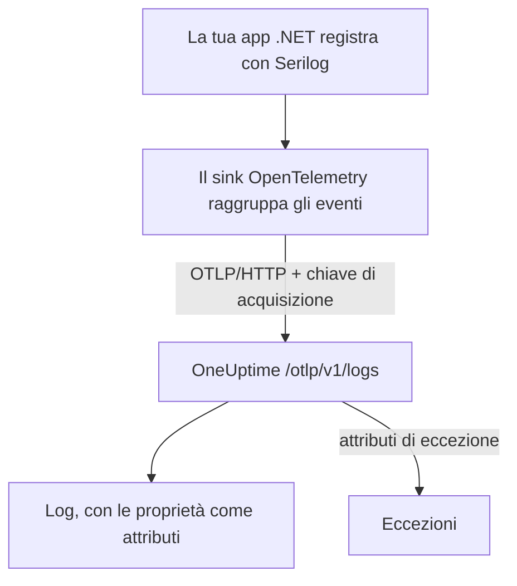

# Serilog (.NET)

[Serilog](https://serilog.net) è la libreria di logging strutturato più diffusa per .NET. Con il sink ufficiale [`Serilog.Sinks.OpenTelemetry`](https://github.com/serilog/serilog-sinks-opentelemetry), ogni evento che la tua applicazione registra tramite Serilog viene inviato a OneUptime con l'OpenTelemetry Protocol (OTLP) e diventa ricercabile in **Prodotti → Registri** con le sue proprietà strutturate, la gravità e la correlazione con le tracce.

Non c'è alcun pacchetto specifico di OneUptime da installare: il sink parla con lo stesso endpoint OTLP che OneUptime espone per tutti i dati OpenTelemetry. Funziona con applicazioni console, worker service, applicazioni ASP.NET Core e qualunque altra cosa giri su .NET.

:::cards
- [Configurare il sink](#configurare-il-sink): Installa due pacchetti e configurali nel codice o in `appsettings.json`.
- [Eccezioni](#eccezioni): Le eccezioni registrate diventano problemi in Eccezioni.
- [Risoluzione dei problemi](#risoluzione-dei-problemi): Cosa controllare quando non arriva nessun log.
:::

## Come funziona



Il sink raggruppa gli eventi di log e li invia in background. Ogni proprietà con nome diventa un attributo del log, e un'eccezione registrata con Serilog arriva con gli attributi da cui OneUptime ricava un problema.

## Prima di iniziare

- Un progetto OneUptime. Su OneUptime Cloud la telemetria si paga per GB acquisito (vedi i [prezzi](https://oneuptime.com/pricing)) e un progetto con il piano Free ha bisogno di un metodo di pagamento prima di poter inviare telemetria.
- Un'applicazione .NET che usa Serilog, o che può usarlo.
- Una chiave di acquisizione della telemetria per autenticare i tuoi log. Se non ne hai una:

:::steps
### Aprire le chiavi di acquisizione

Vai a **Prodotti → Impostazioni del progetto**, apri **Telemetria e APM** nel menu laterale e seleziona **Chiavi di acquisizione**.


### Creare una chiave

Fai clic su **Crea chiave di ingestione**. La finestra ha già il nome della chiave compilato e **Server** scelto (il tipo di chiave con cui invia un'applicazione o un collector), quindi fai clic su **Crea chiave di ingestione** per crearla, oppure rinominala prima.

### Copiare il segreto

La nuova chiave si apre nella sua pagina. Copia la sua **Chiave segreta**: è lo `YOUR_TELEMETRY_INGESTION_TOKEN` degli esempi qui sotto.


:::

## Cosa ti serve da OneUptime

| Impostazione | Valore |
| ------------- | ------------------------------------------------------------ |
| Endpoint OTLP | `https://oneuptime.com/otlp` |
| Header di autenticazione | `x-oneuptime-token: YOUR_TELEMETRY_INGESTION_TOKEN` |
| Nome del servizio | Il nome con cui deve comparire il tuo servizio, ad esempio `my-service` |

> [!NOTE]
> Ospiti OneUptime in proprio? Sostituisci `https://oneuptime.com/otlp` con `https://YOUR-ONEUPTIME-HOST/otlp` (oppure `http://...` se non termini TLS). Tutto il resto rimane uguale.

Con il protocollo impostato su `HttpProtobuf`, il sink aggiunge il percorso `/v1/logs` all'endpoint, quindi l'URL finale a cui invia è `https://oneuptime.com/otlp/v1/logs`. Devi indicare solo l'endpoint di base `/otlp`.

## Configurare il sink

:::steps
### Installare i pacchetti NuGet

Aggiungi Serilog e il sink OpenTelemetry al tuo progetto:

```bash
dotnet add package Serilog
dotnet add package Serilog.Sinks.OpenTelemetry
```

Se configuri il sink da `appsettings.json`, aggiungi anche `Serilog.Settings.Configuration`. Per le applicazioni ASP.NET Core, aggiungi `Serilog.AspNetCore`, che collega Serilog all'host e alla pipeline delle richieste:

```bash
dotnet add package Serilog.Settings.Configuration
dotnet add package Serilog.AspNetCore
```

### Impostare il sink

Punta il sink al tuo endpoint OTLP di OneUptime, imposta il protocollo su `HttpProtobuf`, passa il tuo token di acquisizione come header e contrassegna i log con un `service.name`. Configuralo nel codice, in `appsettings.json` o nell'host ASP.NET Core:

:::tabs
@tab Nel codice
```csharp title="Program.cs"
using Serilog;
using Serilog.Sinks.OpenTelemetry;

Log.Logger = new LoggerConfiguration()
    .MinimumLevel.Information()
    .Enrich.FromLogContext()
    .WriteTo.Console() // optional: keep local logs too
    .WriteTo.OpenTelemetry(options =>
    {
        // Base OTLP endpoint. The sink appends /v1/logs automatically.
        options.Endpoint = "https://oneuptime.com/otlp";
        options.Protocol = OtlpProtocol.HttpProtobuf;

        // Authenticate with your OneUptime telemetry ingestion token.
        options.Headers = new Dictionary<string, string>
        {
            ["x-oneuptime-token"] = "YOUR_TELEMETRY_INGESTION_TOKEN"
        };

        // Identify your service in OneUptime.
        options.ResourceAttributes = new Dictionary<string, object>
        {
            ["service.name"] = "my-service",
            ["deployment.environment"] = "production"
        };
    })
    .CreateLogger();

try
{
    Log.Information("Application starting up");
    // ... your application code ...
}
finally
{
    // Flush any buffered logs before the process exits.
    Log.CloseAndFlush();
}
```
@tab appsettings.json
Metti le impostazioni del sink in `appsettings.json`:

```json title="appsettings.json"
{
  "Serilog": {
    "Using": ["Serilog.Sinks.OpenTelemetry"],
    "MinimumLevel": "Information",
    "WriteTo": [
      {
        "Name": "OpenTelemetry",
        "Args": {
          "endpoint": "https://oneuptime.com/otlp",
          "protocol": "HttpProtobuf",
          "headers": {
            "x-oneuptime-token": "YOUR_TELEMETRY_INGESTION_TOKEN"
          },
          "resourceAttributes": {
            "service.name": "my-service",
            "deployment.environment": "production"
          }
        }
      }
    ]
  }
}
```

Poi costruisci il logger a partire dalla configurazione:

```csharp title="Program.cs"
using Serilog;
using Microsoft.Extensions.Configuration;

IConfiguration configuration = new ConfigurationBuilder()
    .AddJsonFile("appsettings.json")
    .Build();

Log.Logger = new LoggerConfiguration()
    .ReadFrom.Configuration(configuration)
    .CreateLogger();
```
@tab ASP.NET Core
Per ASP.NET Core (hosting minimale, .NET 6 e successivi), usa `Serilog.AspNetCore`, così Serilog sostituisce il logger predefinito e cattura anche i log del framework e delle richieste:

```csharp title="Program.cs"
using Serilog;
using Serilog.Sinks.OpenTelemetry;

var builder = WebApplication.CreateBuilder(args);

builder.Host.UseSerilog((context, services, configuration) =>
{
    configuration
        .ReadFrom.Configuration(context.Configuration)
        .Enrich.FromLogContext()
        .WriteTo.OpenTelemetry(options =>
        {
            options.Endpoint = "https://oneuptime.com/otlp";
            options.Protocol = OtlpProtocol.HttpProtobuf;
            options.Headers = new Dictionary<string, string>
            {
                ["x-oneuptime-token"] = "YOUR_TELEMETRY_INGESTION_TOKEN"
            };
            options.ResourceAttributes = new Dictionary<string, object>
            {
                ["service.name"] = "my-service"
            };
        });
});

var app = builder.Build();

// Logs one summary event per HTTP request.
app.UseSerilogRequestLogging();

app.MapGet("/", () => "Hello World");
app.Run();
```
:::

> [!IMPORTANT]
> Il sink raggruppa gli eventi di log e li invia in modo asincrono. Chiama sempre `Log.CloseAndFlush()` (o rilascia il logger) prima che l'applicazione termini, altrimenti l'ultimo blocco di log può andare perso. In ASP.NET Core, `Serilog.AspNetCore` se ne occupa al posto tuo durante uno spegnimento ordinato.

> [!TIP]
> Tieni il token fuori dal controllo di versione. Leggilo da una variabile d'ambiente o da un archivio di segreti e inseriscilo nella configurazione all'avvio, invece di salvarlo in `appsettings.json`.

### Scrivere i log

Usa Serilog come al solito. Le proprietà strutturate vengono conservate e diventano attributi ricercabili in OneUptime:

```csharp
Log.Information("Order {OrderId} placed by {CustomerId} for {Amount:C}",
    orderId, customerId, amount);

Log.Warning("Payment gateway slow: {LatencyMs}ms", latencyMs);
```

Ogni proprietà con nome (`OrderId`, `CustomerId`, `Amount`, `LatencyMs`) viene inviata come attributo del log, così puoi filtrarle e cercarle nell'explorer **Prodotti → Registri**.

### Verificare che i log arrivino

Avvia la tua applicazione e scrivi qualche evento di log. In pochi secondi compaiono in **Prodotti → Registri** e nella pagina del tuo servizio in **Prodotti → Servizi**: il servizio prende il nome dal `service.name` che hai impostato (`my-service`). Le loro proprietà strutturate sono disponibili come filtri.
:::

## Eccezioni

Quando registri un'eccezione con Serilog, il sink aggiunge al log gli attributi OpenTelemetry `exception.type`, `exception.message` e `exception.stacktrace`:

```csharp
try
{
    ProcessPayment();
}
catch (Exception ex)
{
    Log.Error(ex, "Failed to process payment for order {OrderId}", orderId);
}
```

OneUptime rileva questi attributi e raggruppa l'errore in un problema in **Eccezioni**, per impronta e attribuito al servizio giusto. Un errore segnalato sia da una traccia sia da un log viene unito in un solo problema. Vedi [Eccezioni dai log](/docs/telemetry/open-telemetry#eccezioni-dai-log) per i dettagli su come funziona il rilevamento.

## Correlazione con le tracce

Se la tua applicazione è instrumentata anche con l'SDK OpenTelemetry per .NET per le tracce, gli eventi Serilog emessi dentro uno span attivo ricevono automaticamente il `TraceId` e lo `SpanId` correnti (fa parte degli `IncludedData` predefiniti del sink). Così OneUptime collega una riga di log direttamente alla traccia in cui è avvenuta, e puoi passare da un log alla richiesta che lo contiene e tornare indietro.

Per inviare anche tracce e metriche, vedi la configurazione .NET nell'[avvio rapido di OpenTelemetry](/docs/telemetry/open-telemetry#avvio-rapido).

## Risoluzione dei problemi

:::details Non compare nessun log
Controlla il valore di `x-oneuptime-token` e che appartenga al progetto che stai guardando. Verifica che l'endpoint sia `https://oneuptime.com/otlp` (solo il percorso di base: non aggiungere tu `/v1/logs`). Per vedere perché il sink non riesce, attiva all'avvio l'output degli errori di Serilog con `Serilog.Debugging.SelfLog.Enable(Console.Error)`: mostra il codice di stato con cui risponde OneUptime.
:::

:::details I log compaiono solo quando l'app si chiude, oppure mancano gli ultimi
Assicurati che `Log.CloseAndFlush()` venga eseguito allo spegnimento. Il sink raggruppa gli eventi, quindi i log nel buffer vanno persi se il processo viene terminato senza svuotarlo.
:::

:::details 401 Unauthorized, e non viene acquisito nulla
La chiave manca, è sconosciuta o è scaduta. Verifica che il nome dell'header sia esattamente `x-oneuptime-token` e che il suo valore sia la **Chiave segreta** della chiave.
:::

:::details 402 o 422, e non viene acquisito nulla
`402`: su OneUptime Cloud il progetto ha il piano Free e nessun metodo di pagamento. Aggiungine uno in **Impostazioni del progetto → Fatturazione e fatture → Fatturazione**. `422`: la chiave è disattivata, oppure è una chiave Browser. Riattiva **Abilitato** nelle impostazioni della chiave, oppure crea una chiave **Server**.
:::

:::details I log arrivano con il nome di servizio sbagliato
Imposta `service.name` in `ResourceAttributes` (codice) o `resourceAttributes` (appsettings.json). Senza di esso, i tuoi log vengono archiviati con il nome segnaposto che il sink invia al suo posto, invece che con il nome del tuo servizio.
:::

:::details Errori di connessione verso un'istanza self-hosted
Assicurati che il protocollo corrisponda allo schema del tuo endpoint (`https://` o `http://`) e che l'host di OneUptime sia raggiungibile dall'applicazione.
:::

Per qualsiasi domanda o se ti serve aiuto, scrivici a support@oneuptime.com.

## Passaggi successivi

:::cards
- [OpenTelemetry](/docs/telemetry/open-telemetry): Invia anche tracce e metriche da .NET.
- [Pipeline dei log](/docs/telemetry/log-pipelines): Analizza e arricchisci i log al loro arrivo.
- [Monitor log](/docs/monitor/logs-monitor): Avvisa quando compaiono log corrispondenti.
- [Sintassi di ricerca](/docs/telemetry/search-syntax): Filtra sulle tue proprietà Serilog.
:::
