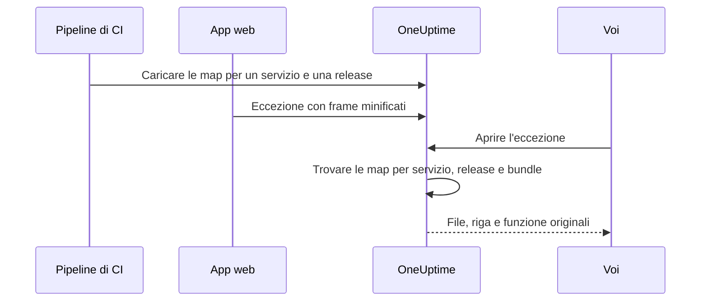

# Source map

Caricate su OneUptime le source map della build del vostro front-end, e le eccezioni del browser in **Eccezioni** mostrano i nomi di file, le righe e le funzioni originali invece di quelli minificati. Questa pagina è per gli sviluppatori front-end che inviano già la telemetria del browser a OneUptime.

:::cards
- [Come funziona la corrispondenza](#come-funziona-la-corrispondenza): Nome del servizio, release e file del bundle.
- [Caricare le source map](#caricare-le-source-map): Una sola richiesta `curl` dalla CI.
- [Limiti](#limiti): Dimensioni, quantità e impostazioni per l'installazione autonoma.
- [Visualizzare gli stack trace risolti](#visualizzare-gli-stack-trace-risolti): Come appare un frame risolto.
:::

## Panoramica

I bundle front-end di produzione sono minificati, quindi un'eccezione del browser catturata tramite l'SDK web di OpenTelemetry arriva con frame dello stack come questi:

```text
TypeError: Cannot read properties of undefined (reading 'id')
    at e.onSelect (https://app.example.com/assets/main.a8f1b2.js:1:48291)
```

Caricate su OneUptime le source map della vostra build e la dashboard delle eccezioni risolve quei frame nel file, nella riga e nel nome di funzione originali e, quando la map è stata creata con `sourcesContent`, nelle righe circostanti del vostro codice sorgente originale.

Le map vengono caricate su OneUptime tramite un'API autenticata e **non vengono mai scaricate dal vostro sito**, quindi potete (e dovreste) continuare a creare la build con `hidden-source-map` (webpack) o `sourcemap: 'hidden'` (Vite / Rollup) e non pubblicare mai i file `.map` accanto ai vostri bundle.



## Come funziona la corrispondenza

Una source map viene memorizzata in base a tre chiavi:

| Chiave | Deve corrispondere a |
|---|---|
| Nome del servizio | L'attributo di risorsa OpenTelemetry `service.name` con cui la vostra app web invia la telemetria |
| Versione del servizio | L'attributo di risorsa `service.version` (il vostro identificatore di release) |
| Percorso del bundle | Il file minificato per cui è stata generata la map, per esempio `main.a8f1b2.js` |

Quando aprite un'eccezione, OneUptime cerca le map caricate per il servizio e la release di quell'eccezione, associa ogni frame dello stack a un bundle in base al nome del file (vanno bene anche i suffissi del percorso: `main.a8f1b2.js` corrisponde a `https://app.example.com/assets/main.a8f1b2.js`) e risolve riga e colonna minificate tramite la map. La risoluzione avviene in modo differito quando l'eccezione viene visualizzata, mai durante l'acquisizione, quindi una map caricata qualche minuto *dopo* il primo errore di una nuova release si applica comunque retroattivamente.

## Prima di iniziare

- Una chiave di acquisizione della telemetria di tipo **Server**, da **Impostazioni del progetto → Telemetria e APM → Chiavi di acquisizione**. Vedete [Creare una chiave di acquisizione](/docs/telemetry/open-telemetry#creare-una-chiave-di-acquisizione).
- Un'app web che invia già le eccezioni a OneUptime con l'SDK web di OpenTelemetry: vedete [Configurazione browser](/docs/rum/browser-setup).
- Una build che scrive le source map, con `sourcesContent` incluso (il predefinito nella maggior parte dei bundler) se volete estratti di codice attorno a ogni frame.

## Caricare le source map

:::steps
### Inviare `service.version` con la telemetria

La vostra app web deve inviare `service.version`, e deve essere la stessa stringa con cui caricate le map:

```javascript
import { resourceFromAttributes } from "@opentelemetry/resources";

const resource = resourceFromAttributes({
  "service.name": "my-web-app",
  "service.version": "1.4.2", // same value you upload maps with
});
```

Va bene qualsiasi identificatore di release stabile (una versione semantica, lo SHA di un commit git, un numero di build) purché il `serviceVersion` caricato e l'attributo di risorsa `service.version` siano la stessa stringa.

### Caricare le map dopo ogni build di produzione

Caricate dalla CI, con la vostra chiave di acquisizione nell'intestazione `x-oneuptime-token`:

```bash
curl --fail -X POST "https://oneuptime.com/source-maps/v1/upload" \
  -H "x-oneuptime-token: YOUR_TELEMETRY_INGESTION_KEY" \
  -F "serviceName=my-web-app" \
  -F "serviceVersion=1.4.2" \
  -F "sourcemap=@dist/assets/main.a8f1b2.js.map" \
  -F "sourcemap=@dist/assets/vendor.9c3d4e.js.map"
```

Per le installazioni autonome, sostituite `oneuptime.com` con il vostro host OneUptime. `Authorization: Bearer YOUR_KEY` è accettato in alternativa all'intestazione `x-oneuptime-token`.

### Verificare il caricamento

Un caricamento riuscito restituisce un corpo JSON che elenca le map memorizzate, su cui la CI può fare le sue verifiche. Le map compaiono anche nella pagina **Source Maps** del servizio in OneUptime.
:::

Un tipico passaggio di CI carica ogni map prodotta dalla build:

```bash
VERSION="$(git rev-parse --short HEAD)"

find dist -name "*.js.map" -print0 | while IFS= read -r -d '' map; do
  curl --fail -X POST "https://oneuptime.com/source-maps/v1/upload" \
    -H "x-oneuptime-token: $ONEUPTIME_INGESTION_KEY" \
    -F "serviceName=my-web-app" \
    -F "serviceVersion=$VERSION" \
    -F "sourcemap=@$map"
done
```

### Regole di caricamento

- Il percorso del bundle di ogni file caricato è il suo nome senza il `.map` finale: `main.a8f1b2.js.map` diventa `main.a8f1b2.js`. Se il nome del vostro file di map non segue questa convenzione, caricate un file per richiesta e passate un campo `bundlePath` esplicito.
- Ricaricare lo stesso bundle per lo stesso servizio e la stessa versione sostituisce la map precedente, quindi i nuovi tentativi della CI non creano problemi.
- I file devono essere JSON [source map v3](https://tc39.es/ecma426/) (ciò che produce qualsiasi bundler moderno; sono supportate anche le map indicizzate con `sections`).
- Se l'operatore della vostra installazione autonoma ha disattivato l'acquisizione della telemetria (`DISABLE_TELEMETRY_INGESTION`), i caricamenti restituiscono una risposta di successo vuota e non viene memorizzato nulla, lo stesso comportamento di ogni endpoint di acquisizione della telemetria in questa modalità. Un caricamento reale restituisce sempre un corpo JSON che elenca le map memorizzate, così la CI può distinguere i due casi.

## Limiti

Ogni file `.map` può arrivare a 50 MB, ma l'ingress limita a 50 MB anche l'**intero corpo della richiesta**, quindi caricate le map grandi una per richiesta. Sono accettati fino a 50 file per richiesta, e una release (servizio + versione) può contenere al massimo 1000 map in totale; un caricamento che supererebbe questo numero viene rifiutato con un messaggio che indica il limite. Una build che produce più map di quante ne accetti una richiesta invia semplicemente più richieste: i caricamenti per la stessa release si sommano.

Le installazioni autonome possono cambiare questi valori. Tutti e cinque sono normali variabili d'ambiente, e il chart Helm li espone sotto `sourceMaps` in `values.yaml`:

| `values.yaml` | Variabile d'ambiente | Predefinito |
| --- | --- | --- |
| `sourceMaps.maxMapsPerRelease` | `SOURCE_MAP_MAX_MAPS_PER_RELEASE` | `1000` |
| `sourceMaps.maxFilesPerRequest` | `SOURCE_MAP_MAX_FILES_PER_REQUEST` | `50` |
| `sourceMaps.maxFileSizeBytes` | `SOURCE_MAP_MAX_FILE_SIZE_BYTES` | `52428800` |
| `sourceMaps.maxBytesPerResolve` | `SOURCE_MAP_MAX_BYTES_PER_RESOLVE` | `536870912` |
| `sourceMaps.retentionDays` | `SOURCE_MAP_RETENTION_DAYS` | `90` |

`maxMapsPerRelease` è quello da alzare se la vostra build supera il valore predefinito; è solo un limite sulla forma dell'archiviazione, perché la risoluzione è limitata da `maxBytesPerResolve` e non dal numero di map di una release. `maxFilesPerRequest` e `maxFileSizeBytes` si possono solo **ridurre**: il corpo multipart viene analizzato prima che la richiesta sia autenticata, quindi i tetti condivisi al di sopra di essi sono quelli applicati a qualsiasi chiamante non autenticato, e un valore più grande viene ridotto invece di essere applicato.

## Visualizzare gli stack trace risolti

Aprite un'eccezione qualsiasi in **Eccezioni** nella dashboard. I frame risolti tramite una source map mostrano un badge **Source mapped** e presentano il nome di funzione e la posizione del file originali; espandendo un frame si vede l'estratto di codice sorgente originale (quando la map contiene `sourcesContent`) accanto alla posizione minificata.

Le map caricate per un servizio si possono esaminare ed eliminare in **Prodotti → Servizi → il vostro servizio → Source Maps**, che elenca release, bundle, dimensione e ora di caricamento di ogni map.

## Conservazione

Le source map vengono conservate per 90 giorni dopo il caricamento, poi eliminate automaticamente. Una map è utile solo finché le eccezioni della sua release rientrano nella vostra finestra di conservazione della telemetria, quindi questo periodo supera ampiamente quello delle eccezioni che rende leggibili. Ricaricate le map di una release se vi servono di nuovo.

## Sicurezza

- Le map vengono caricate tramite un endpoint autenticato e memorizzate nel vostro progetto OneUptime: non vengono mai scaricate dal vostro sito web, quindi le source map nascoste restano nascoste.
- Il contenuto grezzo di una map (che include il vostro codice sorgente originale se creata con `sourcesContent`) può essere riletto solo da proprietari e amministratori del progetto, e da chiunque abbia il permesso **Read Telemetry Source Map**. Gli altri membri del team vedono solo i frame risolti e le poche righe di codice attorno a ogni punto di crash delle eccezioni a cui hanno già accesso.
- Eliminare un servizio ne elimina le source map.

## Risoluzione dei problemi

:::details I frame sono ancora minificati
La release dell'eccezione non ha map corrispondenti. Verificate che il `service.version` inviato dalla vostra app sia esattamente il `serviceVersion` usato per il caricamento, che `serviceName` corrisponda a `service.name` e che sia stata caricata una map per quel file di bundle: la pagina **Source Maps** del servizio elenca release e bundle di ogni map.
:::

:::details Il caricamento viene rifiutato perché una map è troppo grande
Una singola map può arrivare a 50 MB, e così l'intera richiesta. Caricate le map grandi una per richiesta, come fa il ciclo di CI qui sopra.
:::

## Passaggi successivi

:::cards
- [Configurazione browser](/docs/rum/browser-setup): Inviare tracce ed eccezioni del browser con l'SDK web di OpenTelemetry.
- [Monitor eccezioni](/docs/monitor/exceptions-monitor): Ricevere un avviso quando compaiono nuove eccezioni.
- [OpenTelemetry](/docs/telemetry/open-telemetry): Endpoint, chiavi e limiti per tutta la telemetria.
:::
