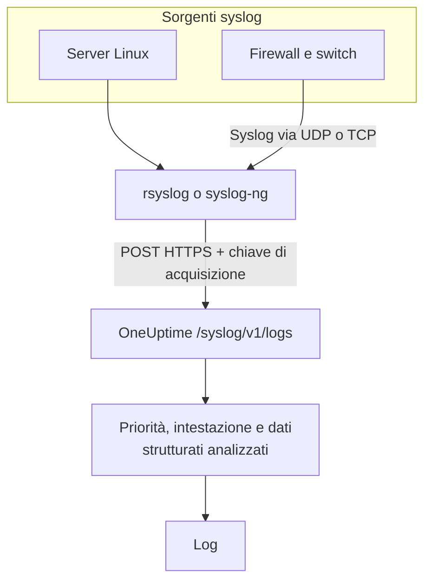

# Syslog

OneUptime accetta syslog via HTTPS. Invia messaggi RFC 5424 o RFC 3164 a `/syslog/v1/logs` con la tua chiave di acquisizione, e ognuno diventa un log ricercabile, con priorità, facility, gravità, host, applicazione e dati strutturati come attributi. Usalo per inoltrare da rsyslog, syslog-ng o qualsiasi relay in grado di fare richieste HTTP.

:::cards
- [Inviare un messaggio di prova](#inviare-un-messaggio-di-prova): Una sola richiesta `curl`.
- [Inoltrare da rsyslog](#inoltrare-da-rsyslog): Invia tutto ciò che riceve un server o un relay.
- [Attributi estratti](#attributi-estratti): Cosa ricava OneUptime da ogni messaggio.
- [Risoluzione dei problemi](#risoluzione-dei-problemi): Richieste rifiutate e servizi inattesi.
:::

## Come funziona



OneUptime risponde non appena ha letto i messaggi dalla richiesta, e li analizza e li salva un attimo dopo. Il testo del messaggio resta nel corpo del log; tutto il resto diventa un attributo.

> [!TIP]
> I dispositivi di rete che monitori con una sonda OneUptime possono inviare il loro syslog direttamente alla sonda via UDP, senza relay: i log compaiono poi sul dispositivo in OneUptime. Vedi [Guide per fornitore di rete](/docs/monitor/network-vendor-guides).

## Prima di iniziare

- **Un progetto OneUptime**: su OneUptime Cloud la telemetria si paga per GB acquisito, e un progetto con il piano Free ha bisogno di un metodo di pagamento prima di poter inviare telemetria.
- **Chiave di acquisizione della telemetria**: crea una chiave **Server** in **Prodotti → Impostazioni del progetto → Telemetria e APM → Chiavi di acquisizione** e copia la sua **Chiave segreta**. La invii nell'header `x-oneuptime-token`.
- **Inoltratore syslog**: qualsiasi strumento in grado di inviare richieste HTTP POST (ad esempio `curl`, `rsyslog` tramite `omhttp`, oppure `syslog-ng` con la sua destinazione HTTP).
- **Nome del servizio (facoltativo)**: imposta l'header `x-oneuptime-service-name` per raggruppare i log in arrivo sotto uno specifico servizio di telemetria. Se manca, OneUptime ripiega sull'`APP-NAME` del syslog, sul nome host o su `Syslog`.

## Endpoint

```http
POST https://oneuptime.com/syslog/v1/logs
```

| Header | Obbligatorio | Valore |
| --- | --- | --- |
| `x-oneuptime-token` | Sì | La tua chiave di acquisizione. |
| `Content-Type` | Sì, per i corpi JSON | `application/json` |
| `x-oneuptime-service-name` | No | Il servizio a cui appartengono i log. |
| `Content-Encoding` | No | `gzip`, per un corpo compresso. |

Sostituisci `oneuptime.com` con il tuo host se ospiti OneUptime in proprio.

## Corpo della richiesta

Invia un payload JSON con un array `messages`. Sono supportati sia RFC 5424 sia RFC 3164 (BSD), e puoi mescolarli nella stessa richiesta:

```json
{
  "messages": [
    "<34>1 2025-03-02T14:48:05.003Z web-01 nginx 7421 ID47 [env@32473 host=\"web-01\"] 502 on /api/login",
    "<13>Feb  5 17:32:18 db-01 postgres[2419]: connection received from 10.0.0.12"
  ]
}
```

### Formati del corpo supportati

| Corpo | Come inviarlo |
| --- | --- |
| Un oggetto JSON con un array `messages` | `Content-Type: application/json`: consigliato. |
| Un array JSON di messaggi | `Content-Type: application/json`. |
| Un oggetto JSON con un solo `message` | `Content-Type: application/json`. Un valore su più righe viene letto come più messaggi. |
| Messaggi separati da a capo | Compressi con gzip e inviati con `Content-Encoding: gzip`. |

Un corpo in testo semplice non compresso con gzip non viene letto, e la richiesta viene rifiutata con `400`. Un corpo compresso con gzip viene sempre letto come messaggi separati da a capo, quindi non comprimere un corpo JSON. Mantieni ogni richiesta sotto 1 MB: l'ingress di OneUptime non alza il limite predefinito di nginx per il corpo delle richieste su questo endpoint.

## Inviare un messaggio di prova

```bash
curl \
  -X POST https://oneuptime.com/syslog/v1/logs \
  -H "Content-Type: application/json" \
  -H "x-oneuptime-token: YOUR_TELEMETRY_KEY" \
  -H "x-oneuptime-service-name: production-web" \
  -d '{
    "messages": [
      "<34>1 2025-03-02T14:48:05.003Z web-01 nginx 7421 ID47 [env@32473 host=\"web-01\"] 502 on /api/login"
    ]
  }'
```

Un `200` indica che il messaggio è stato accettato. Apri **Prodotti → Registri**: il log compare nel servizio `production-web` con il corpo `502 on /api/login`, la gravità `Error` e gli attributi descritti in [Attributi estratti](#attributi-estratti).

## Inoltrare da rsyslog

rsyslog invia a OneUptime con il suo modulo di output HTTP, `omhttp`.

:::steps
### Verificare che `omhttp` sia disponibile

La configurazione qui sotto lo carica con `module(load="omhttp")`. Se rsyslog segnala che non riesce a caricare il modulo, installa il pacchetto che fornisce `omhttp` per la tua distribuzione.

### Aggiungere la destinazione OneUptime

Crea `/etc/rsyslog.d/oneuptime.conf`. Il template ricostruisce ogni messaggio come riga RFC 5424 e lo avvolge nel corpo JSON che OneUptime si aspetta:

```text title="/etc/rsyslog.d/oneuptime.conf"
module(load="omhttp")

template(name="OneUptimeJson" type="string"
         string="{\"messages\":[\"<%PRI%>1 %TIMESTAMP:::date-rfc3339% %HOSTNAME% %APP-NAME% %PROCID% %MSGID% - %msg:::json%\"]}")

action(
  type="omhttp"
  server="oneuptime.com"
  serverport="443"
  usehttps="on"
  restpath="syslog/v1/logs"
  httpheaders=[
    "x-oneuptime-token: YOUR_TELEMETRY_KEY",
    "x-oneuptime-service-name: rsyslog-demo"
  ]
  template="OneUptimeJson"
)
```

`restpath` vuole il percorso senza la barra iniziale. `omhttp` invia per impostazione predefinita un `Content-Type` JSON, che è proprio ciò che produce questo template.

### Verificare la configurazione e riavviare rsyslog

```bash
sudo rsyslogd -N1
sudo systemctl restart rsyslog
```

`rsyslogd -N1` convalida la configurazione senza avviare rsyslog. Dopo il riavvio, i nuovi messaggi compaiono in **Prodotti → Registri** nel servizio `rsyslog-demo`.
:::

L'azione inoltra ogni messaggio gestito da rsyslog: programmi locali, il journal di systemd quando rsyslog lo legge, e tutto ciò che riceve dalla rete.

### Inoltrare il syslog dei dispositivi di rete

Firewall, switch e altre appliance spesso inviano syslog solo via UDP o TCP. Puntali a un relay rsyslog e lascia che il relay inoltri via HTTPS. Aggiungi un listener alla configurazione del relay, prima dell'`action`:

```text title="/etc/rsyslog.d/oneuptime.conf"
module(load="imudp")
input(type="imudp" port="514")
```

Imposta `x-oneuptime-service-name` su un nome come `perimeter-firewall`, oppure rimuovi l'header perché i log di ogni dispositivo vengano raggruppati per nome host. Molte appliance scrivono il messaggio come coppie `key=value`; un [Key=Value Parser](/docs/telemetry/log-pipelines#keyvalue-parser) le trasforma in attributi.

:::details Inviare a blocchi invece di una richiesta per messaggio
rsyslog può raggruppare i messaggi e comprimerli con gzip, cosa che OneUptime legge come messaggi separati da a capo. Sostituisci template e azione con:

```text title="/etc/rsyslog.d/oneuptime.conf"
template(name="OneUptimeLine" type="string"
         string="<%PRI%>1 %TIMESTAMP:::date-rfc3339% %HOSTNAME% %APP-NAME% %PROCID% %MSGID% - %msg%")

action(
  type="omhttp"
  server="oneuptime.com"
  serverport="443"
  usehttps="on"
  restpath="syslog/v1/logs"
  httpheaders=["x-oneuptime-token: YOUR_TELEMETRY_KEY"]
  template="OneUptimeLine"
  batch="on"
  batch.format="newline"
  compress="on"
)
```

Mantieni `compress="on"`: OneUptime legge messaggi separati da a capo solo da un corpo compresso con gzip.
:::

### Altri inoltratori

- **syslog-ng**: usa la sua destinazione HTTP con lo stesso URL, gli stessi header e lo stesso corpo JSON.
- **Fluent Bit**: ricevi il syslog con l'input `syslog` di Fluent Bit e inoltralo come qualsiasi altro log. Vedi [Fluent Bit](/docs/telemetry/fluentbit).

## Attributi estratti

OneUptime aggiunge automaticamente i seguenti attributi a ogni voce di log:

| Attributo | Valore | Dal messaggio di prova |
| --- | --- | --- |
| `syslog.priority` | La priorità, `<PRI>` | `34` |
| `syslog.facility.code`, `syslog.facility.name` | La facility, ricavata dalla priorità | `4`, `security` |
| `syslog.severity.code`, `syslog.severity.name` | La gravità, ricavata dalla priorità | `2`, `critical` |
| `syslog.version` | La versione RFC 5424 | `1` |
| `syslog.hostname` | `HOSTNAME` | `web-01` |
| `syslog.appName` | `APP-NAME`, oppure il tag RFC 3164 | `nginx` |
| `syslog.processId` | `PROCID` | `7421` |
| `syslog.messageId` | `MSGID` | `ID47` |
| `syslog.structured.raw` | I dati strutturati RFC 5424, così come inviati | `[env@32473 host="web-01"]` |
| `syslog.structured.*` | Ogni parametro dei dati strutturati, appiattito | `syslog.structured.env_32473.host` = `web-01` |
| `syslog.raw` | Il messaggio originale, per la tracciabilità | l'intera riga |

Questi attributi diventano ricercabili nell'explorer **Prodotti → Registri**, ad esempio `@syslog.severity.name:error` o `@syslog.hostname:web-01`. Vedi [Sintassi di ricerca](/docs/telemetry/search-syntax).

Il messaggio in sé resta nel corpo del log. Firewall come Sophos XGS e Fortinet FortiGate lo scrivono come coppie `key=value` (`log_component="IPSec" con_name="HQ-Branch1" status="Terminated"`); aggiungi un processore **Key=Value Parser** in una [pipeline dei log](/docs/telemetry/log-pipelines#keyvalue-parser) per trasformare in attributi anche queste coppie.

### Gravità

| Gravità syslog | Codice | Gravità in OneUptime |
| --- | --- | --- |
| Emergency, Alert | `0`, `1` | `Fatal` |
| Critical, Error | `2`, `3` | `Error` |
| Warning | `4` | `Warning` |
| Notice, Informational | `5`, `6` | `Information` |
| Debug | `7` | `Debug` |
| Nessuna priorità nel messaggio | — | `Unspecified` |

Un messaggio senza timestamp viene salvato con l'ora in cui OneUptime l'ha ricevuto.

### Servizio

Ogni log viene archiviato sotto un servizio di telemetria, che OneUptime crea la prima volta che invia. Il servizio è il primo disponibile tra:

1. l'header `x-oneuptime-service-name`;
2. l'`APP-NAME` (o il tag) del messaggio;
3. il nome host del messaggio;
4. `Syslog`.

## Risoluzione dei problemi

:::details HTTP 401
La chiave manca, è sconosciuta o è scaduta. Verifica che l'header `x-oneuptime-token` porti la **Chiave segreta** di una chiave di acquisizione del progetto che deve ricevere i log.
:::

:::details HTTP 402 o 422
`402`: su OneUptime Cloud il progetto ha il piano Free e nessun metodo di pagamento. Aggiungine uno in **Impostazioni del progetto → Fatturazione e fatture → Fatturazione**. `422`: la chiave è disattivata, oppure è una chiave Browser. Riattiva **Abilitato** nelle impostazioni della chiave, oppure crea una chiave **Server**.
:::

:::details HTTP 400, oppure non compare nessun log
Verifica che il corpo della richiesta contenga davvero righe syslog, come JSON con `Content-Type: application/json`. I corpi vuoti, e quelli in testo semplice non compressi con gzip, vengono rifiutati con HTTP 400.
:::

:::details HTTP 413
La richiesta è più grande di quanto accetta l'ingress. Invia meno messaggi per richiesta.
:::

:::details I log arrivano con un nome di servizio inatteso
Imposta `x-oneuptime-service-name` per scavalcare il rilevamento predefinito, che usa l'`APP-NAME` e poi il nome host.
:::

## Passaggi successivi

:::cards
- [Pipeline dei log](/docs/telemetry/log-pipelines): Trasforma i messaggi `key=value` in attributi.
- [Regole di registrazione dei log](/docs/telemetry/log-recording-rules): Trasforma i numeri del tuo syslog in metriche.
- [Monitor log](/docs/monitor/logs-monitor): Avvisa quando arrivano messaggi syslog corrispondenti.
:::
