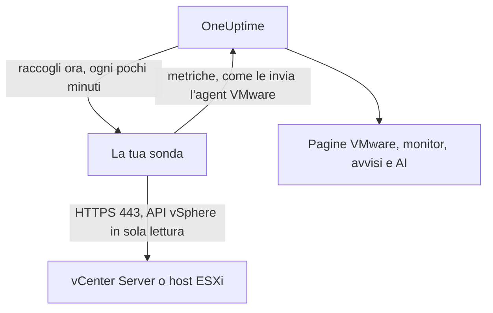

# VMware senza agent

Monitora un vCenter Server, o un host ESXi autonomo, senza installare nulla: inserisci in OneUptime l'indirizzo di vCenter e un account in sola lettura, scegli la sonda che può raggiungerlo, e la sonda raccoglie gli stessi dati dell'[agent VMware](/docs/telemetry/vmware). Non c'è alcun agent da installare, aggiornare o tenere in esecuzione, né una macchina dedicata da predisporre.

:::cards
- [Prima di iniziare](#prima-di-iniziare): Una sonda che raggiunge vCenter e un account in sola lettura.
- [Collegare un vCenter](#collegare-un-vcenter): Quattro campi, un test e un nome.
- [Risoluzione dei problemi](#risoluzione-dei-problemi): Cosa significa ogni messaggio e cosa lo risolve.
:::

## Come funziona

Ogni pochi minuti la sonda accede a vCenter con l'account che hai salvato, legge l'inventario, i contatori delle prestazioni e le statistiche vSAN, e li invia a OneUptime. Arrivano esattamente come quelli dell'agent VMware, quindi ogni pagina VMware, ogni [monitor VMware](/docs/monitor/vmware-monitor), ogni modello di avviso e OneUptime AI li leggono allo stesso modo. La sonda mantiene la sua sessione vCenter tra una raccolta e l'altra, così il registro eventi di vCenter non si riempie di accessi.

## Sonda o agent?

| | Una sonda (questa pagina) | L'agent VMware |
|---|---|---|
| Cosa esegui | Una sonda che esegui già, o una nuova | L'agent, su una macchina dedicata |
| Dove è conservato l'account | Crittografato in OneUptime, inviato solo alla sonda | Nel file `.env` dell'agent |
| Cosa deve raggiungere | vCenter sulla porta TCP 443, dalla sonda | vCenter sulla porta TCP 443, dall'agent |
| vCenter più grande | Circa 48 MiB di metriche per raccolta | Nessun limite |
| Syslog ESXi e l'agent AI | Non inclusi | Inclusi |

Entrambi inviano gli stessi dati. Puoi passare un vCenter dall'uno all'altro in qualsiasi momento dalla sua pagina **Impostazioni**.

## Prima di iniziare

- **Una sonda che può raggiungere vCenter sulla porta TCP 443.** Di solito è una [sonda personalizzata](/docs/probe/custom-probe) nella rete di vCenter. Su OneUptime Cloud le sonde condivise non ricevono mai una password di vCenter, quindi aggiungi una sonda tua. Su un'istanza self-hosted possono raccogliere anche le sonde proprie dell'istanza.
- **Un utente vSphere con il ruolo Read-Only** sull'oggetto vCenter di livello più alto, con **Propagate to children** selezionato. Segui [Creare l'utente vSphere in sola lettura](/docs/telemetry/vmware#create-the-read-only-vsphere-user): l'account è lo stesso che usa l'agent.

> [!IMPORTANT]
> Senza **Propagate to children**, l'utente accede ma non vede nulla, e la sonda segnala che l'account non può leggere l'inventario di vCenter.

## Collegare un vCenter

:::steps
### Aprire i vCenter
In OneUptime, apri **VMware → Tutti i vCenter** e fai clic su **Collega vCenter**.

### Inserire l'indirizzo e l'account
Inserisci l'indirizzo con cui apri il vSphere Client, ad esempio `https://vcsa.example.com`, il nome utente con il suo dominio, ad esempio `oneuptime@vsphere.local`, e la sua password. Scegli la sonda che raggiunge vCenter.

### Verificare la connessione
Nel passaggio successivo, fai clic su **Testa la connessione**. La sonda accede, legge ciò che l'account può vedere ed esce, e il risultato indica quanti datacenter, cluster, host, macchine virtuali e datastore ha trovato.

### Considerare attendibile il certificato di vCenter
Per impostazione predefinita vCenter usa un certificato della propria autorità, di cui la sonda non si fida. Il test mostra allora il certificato: confronta la sua impronta con quella di vCenter, poi fai clic su **Considera attendibile questo certificato**.

### Assegnare un nome e collegare
Il nome predefinito è il nome host di vCenter. Fai clic su **Collega vCenter** per salvare.
:::

La **Panoramica** del vCenter mostra una scheda **Raccolta dati**. Indica **Verifica in corso** fino alla prima raccolta, che parte entro un minuto, poi **In raccolta**, e l'inventario si popola.

## Certificati

La sonda non salta mai la verifica dei certificati. Ogni connessione completa un handshake TLS completo, e poi:

- se nessun certificato è considerato attendibile, il certificato di vCenter deve provenire da un'autorità di cui la macchina della sonda si fida, per l'indirizzo inserito;
- se un certificato è considerato attendibile, vCenter deve presentare esattamente quel certificato, identificato dalla sua impronta SHA-256. Non viene accettato nient'altro, nemmeno un certificato pubblicamente attendibile.

Per verificare un'impronta, apri il vSphere Client in **Administration → Certificates → Certificate Management**, oppure esegui `openssl s_client -connect vcsa.example.com:443 </dev/null | openssl x509 -noout -fingerprint -sha256` dalla macchina della sonda.

Quando il certificato di vCenter viene rinnovato, la raccolta si ferma con **Il certificato di vCenter è cambiato** e viene mostrato il nuovo certificato. A vCenter non viene inviato nulla finché non lo consideri attendibile, dalla pagina **Panoramica** o **Impostazioni** del vCenter.

## La password salvata

La password è crittografata e di sola scrittura: nessuno può rileggerla, e l'API non la restituisce mai. Viene inviata solo alla sonda che raccoglie il vCenter, che la tiene in memoria.

Una password salvata viene inviata soltanto all'indirizzo, tramite la sonda e al certificato per cui è stata inserita. Modificare l'indirizzo, la sonda o il certificato attendibile richiede di nuovo la password, così nessuno che può modificare il vCenter può inviarla altrove. Considerare attendibile il certificato che la sonda ha trovato all'indirizzo salvato la mantiene.

## Passare dall'agent a una sonda

Apri la pagina **Impostazioni** del vCenter. La sua scheda **Raccolta dati** offre **Raccogli con una sonda** per un vCenter inviato dall'agent, e **Usa l'agent VMware** per uno raccolto da una sonda. Il passaggio all'agent dimentica la password salvata.

> [!WARNING]
> Arresta l'agent VMware appena la prima raccolta della sonda riesce. Finché sono in esecuzione entrambi, ogni metrica arriva due volte.

## Riferimento

| Impostazione | Predefinito | Note |
|---|---|---|
| Raccogli ogni | 2 minuti | Da 1 a 60 minuti. Raccogli un vCenter grande meno spesso per non sovraccaricarlo. |
| Raccolte contemporanee | 4 per sonda | Una raccolta più lenta del suo intervallo viene saltata, mai accodata. |
| Raccolta più grande | Circa 48 MiB | I vCenter più grandi richiedono l'agent VMware. |
| Test di connessione | 90 secondi per iniziare | Un test che nessuna sonda prende in carico in tempo, o che dura più di 2 minuti, viene dato come fallito. |

## Risoluzione dei problemi

:::details Il certificato di vCenter non è attendibile
vCenter presenta un certificato della propria autorità. Confronta l'impronta mostrata con il certificato di vCenter, poi fai clic su **Considera attendibile questo certificato**.
:::

:::details vCenter ha rifiutato l'accesso
Usa il nome utente completo con il suo dominio, ad esempio `oneuptime@vsphere.local`, e controlla la password e che l'account non sia bloccato. Modificali con **Modifica connessione** nella pagina **Impostazioni** del vCenter.
:::

:::details L'utente non può leggere l'inventario di vCenter
Assegna all'utente il ruolo Read-Only sull'oggetto vCenter di livello più alto, con **Propagate to children** selezionato.
:::

:::details La sonda non riceve risposta da vCenter
La rete della sonda non riesce a raggiungere vCenter sulla porta TCP 443. Consenti il traffico nel firewall, oppure scegli una sonda nella rete di vCenter.
:::

:::details La sonda non ha preso in carico questa richiesta
La sonda è offline, oppure esegue una versione di OneUptime precedente alla raccolta VMware. Verifica che sia connessa nella tabella **Sonde personalizzate**, e aggiornala.
:::

:::details Questo vCenter è troppo grande per essere raccolto da una sonda
Le sue metriche superano la dimensione di un invio di una sonda. Usa l'[agent VMware](/docs/telemetry/vmware) per questo vCenter.
:::

## Passaggi successivi

:::cards
- [Monitor VMware](/docs/monitor/vmware-monitor): Avvisi su host, macchine virtuali, datastore e cluster.
- [Sonda personalizzata](/docs/probe/custom-probe): Esegui una sonda nella rete di vCenter.
- [Agent VMware](/docs/telemetry/vmware): Raccogli un vCenter con l'agent, invece.
:::
