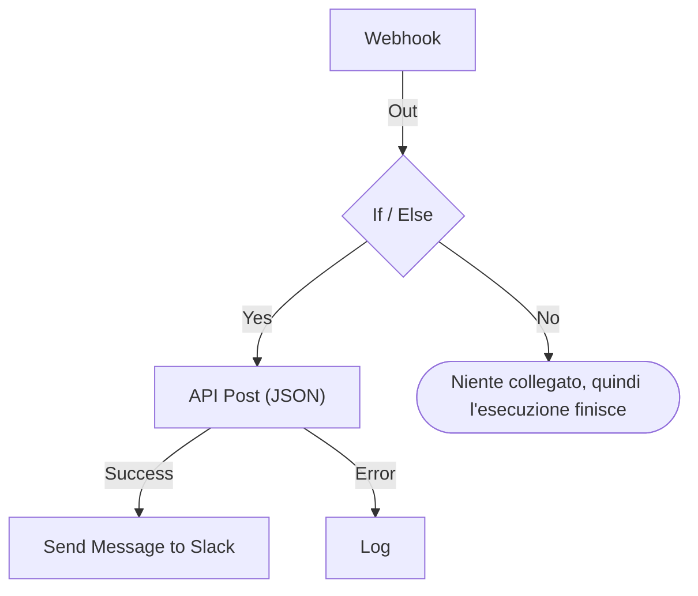

# Creare un workflow

Un workflow si costruisce nel suo **Costruttore**: una tela su cui aggiungi blocchi, li colleghi e compili le loro impostazioni. Questa pagina spiega come creare un workflow, [aggiungere blocchi](#aggiungere-blocchi), [collegarli](#collegare-i-blocchi) e [configurarli](#configurare-un-blocco), [passare valori dall'uno all'altro](#usare-i-valori-dei-blocchi-precedenti) e [attivare il workflow](#attivarlo).

Per creare un workflow, apri **Flussi di lavoro** e fai clic su **Crea flusso di lavoro**. La finestra **Crea un flusso di lavoro** ti chiede prima come vuoi iniziare, poi un nome. Un modello che ha bisogno di impostazioni proprie, come un URL di webhook di Slack, te le chiede in un passaggio in più e le salva come variabili del workflow, così puoi cambiarle in seguito senza modificare il workflow.

Scegli come iniziare:

- **Parti da zero**, in cima alla finestra, ti dà una tela vuota. La maggior parte dei workflow inizia da qui.
- **Oppure parti da un modello** elenca alcuni modelli **Consigliati**. Per gli altri, scegli una categoria accanto alla casella di ricerca, come **Incidenti**, **Monitor** o **Jira**, oppure **Tutti i modelli**, oppure scrivi in **Cerca modelli…**. Ogni parola che scrivi deve corrispondere.

Fai clic su un modello per vedere cosa fa: il suo trigger, i blocchi che lo compongono e le impostazioni che ti chiederà. Poi fai clic su **Usa questo modello**, oppure fai doppio clic sul modello. Nella casella di ricerca, i tasti freccia scelgono un modello e **Enter** lo usa. `/` ti riporta alla casella di ricerca.

I workflow vengono creati disattivati, quindi non parte nulla finché non li attivi. Un nuovo workflow si apre nel **Costruttore**, la tela su cui lo progetti.

## La tela

Un workflow creato da zero si apre con un unico blocco tratteggiato con la scritta **Choose what starts this workflow**. Quel blocco è il punto di partenza: fai clic su di esso per scegliere un trigger. Un workflow creato da un modello si apre con i suoi blocchi già al loro posto.

Ogni workflow ha esattamente un **trigger** in cima. Tutto il resto è un **componente** che fa qualcosa. Per cambiare il trigger, eliminalo: il segnaposto tratteggiato torna al suo posto, e facendo clic su di esso puoi sceglierne un altro. Eliminando un blocco si eliminano anche le sue linee, quindi ricollega il nuovo trigger al primo blocco.

Le modifiche vengono salvate automaticamente. Una pillola nella barra degli strumenti lo segnala: **Salvataggio…** mentre la modifica è in corso, poi **Salvato**, oppure **Impossibile salvare** se non ha funzionato. La tela non ha un pulsante di salvataggio né un passaggio di pubblicazione separato.

## Aggiungere blocchi

| Per aggiungere         | Fai clic su                                                    | Pannello che si apre          |
| ---------------------- | -------------------------------------------------------------- | ----------------------------- |
| Il trigger             | Il blocco segnaposto tratteggiato                              | **Add Trigger**               |
| Qualsiasi altro blocco | **Aggiungi componente**, nella barra degli strumenti sopra la tela | **Aggiungi componente**   |

Entrambi i pannelli si aprono sui blocchi che usano la maggior parte dei workflow, sotto **Popular**, seguiti dagli altri blocchi integrati. Sotto **OneUptime resources**, fai clic su una risorsa come **Incidente** per vedere cosa puoi farci; **Browse all resources** le elenca tutte. Oppure cerca: scrivi qualche parola, come `create incident`, e la corrispondenza più vicina compare per prima. Premi `/` per passare alla casella di ricerca, i tasti freccia per scorrere i risultati e **Enter** per aggiungere il blocco evidenziato. Facendo clic su un blocco lo aggiungi.

Un nuovo blocco compare sotto il blocco più in basso della tela, e un nuovo trigger prende il posto del blocco tratteggiato in cima. Il nuovo blocco resta selezionato e, se finisce fuori dalla vista, la tela scorre quel tanto che basta per mostrarlo. Le sue impostazioni non si aprono da sole: fai clic sul blocco quando sei pronto a configurarlo. Finché le sue impostazioni obbligatorie non sono compilate, mostra **Click to set up**.

Trascina i blocchi dove vuoi; la tela li allinea a una griglia mentre li sposti. Le posizioni dei blocchi vengono salvate, così la persona successiva vede la stessa disposizione che hai lasciato.

## Cosa c'è su un blocco

| Campo                                | Cosa fa                                                                                                                                                                                                                                                                                                       |
| ------------------------------------ | ------------------------------------------------------------------------------------------------------------------------------------------------------------------------------------------------------------------------------------------------------------------------------------------------------------- |
| **Identifier** (sotto **ID**)        | L'ID breve mostrato sul blocco, come `log-1`. È il modo in cui gli altri blocchi fanno riferimento a questo, quindi rinominarlo rompe ogni riferimento `{{local.components.…}}` che punta a esso. L'intestazione del blocco è il nome proprio del componente e non si può cambiare.                                 |
| **Impostazioni**                     | Ciò di cui il blocco ha bisogno per fare il suo lavoro: un URL, un canale Slack, il corpo di un messaggio. I campi facoltativi sono contrassegnati con **(Facoltativo)**; tutto il resto è obbligatorio. Un interruttore acceso/spento non ha né l'uno né l'altro, perché ha sempre un valore. Le impostazioni meno usate sono raccolte sotto **Altri campi**, la cui intestazione le nomina e mostra quelle impostate. |
| **Input**                            | Il punto sul bordo superiore, dove arrivano le linee dai blocchi precedenti. I trigger non ne hanno: prima di loro non viene eseguito nulla.                                                                                                                                                                  |
| **Outputs**                          | I punti lungo il bordo inferiore, etichettati appena sopra, da cui partono le linee verso i blocchi successivi. Molti blocchi hanno uscite **Success** ed **Error** separate, così puoi gestire entrambi i casi.                                                                                               |

## Collegare i blocchi

Trascina da un punto sul fondo di un blocco fino al punto in cima al blocco successivo. La linea che tracci decide cosa viene eseguito dopo.

- Se colleghi da **Success**, il blocco successivo viene eseguito solo se quello precedente ha funzionato.
- Se colleghi da **Error**, il blocco successivo viene eseguito solo se quello precedente non è riuscito.
- Se non colleghi un'uscita, quel percorso semplicemente si ferma.

Puoi collegare un'uscita a più blocchi. Vengono eseguiti tutti, ma uno dopo l'altro, in un'unica coda, non in parallelo. Non contare sull'ordine tra i rami, né sul fatto che si sovrappongano nel tempo.

Ogni blocco viene eseguito al massimo una volta per esecuzione. Una linea che porta a un blocco già eseguito — risalendo la tela, o da un secondo ramo dopo che il primo lo ha raggiunto — ferma l'esecuzione con un errore, così un workflow non può andare in loop.

## Configurare un blocco

Fai clic su un blocco per aprire le sue impostazioni in una finestra, oppure raggiungilo con **Tab** e premi **Enter**. Compila le impostazioni e fai clic su **Salva**.

Ogni impostazione ha il campo di cui ha bisogno il suo valore:

| L'impostazione contiene                          | Ottieni                                                                        |
| ------------------------------------------------ | ------------------------------------------------------------------------------ |
| Parole: un messaggio, un prompt, un valore da registrare | Una casella che cresce mentre scrivi. **Enter** inizia una nuova riga.  |
| Un valore breve: un URL, un ID, un oggetto       | Una sola riga.                                                                 |
| Codice o HTML                                    | Un editor di codice.                                                           |
| JSON                                             | Un editor JSON.                                                                |
| Acceso o spento                                  | Un interruttore con il suo nome accanto. Fai clic sull'interruttore o sul nome per cambiarlo. |

La finestra si apre su ciò per cui con ogni probabilità sei venuto. Per un trigger **Webhook** è il suo URL, con un pulsante **Copia URL**, i metodi che accetta e una richiesta di esempio. Per un trigger **Manual** è il modo in cui il workflow viene avviato. Ogni altro blocco si apre sulle sue impostazioni. Un blocco senza impostazioni non ha affatto una sezione **Impostazioni**.

Più in basso, dall'alto verso il basso:

- **ID**, **Inputs** e **Outputs**, uno accanto all'altro: l'identificatore del blocco, da dove lo si raggiunge e cosa viene eseguito dopo di lui.
- **Returns** — i dati che questo blocco passa ai passaggi successivi. Ogni valore mostra il riferimento esatto che lo legge, con un pulsante per copiarlo.
- **How to use** — cosa fa il blocco in una frase, i passaggi per configurarlo, un esempio da copiare e gli errori più comuni. L'esempio è costruito dal tuo workflow: usa l'ID di questo blocco, e i valori del trigger dove inserisce dati in un messaggio. **Learn more** apre la spiegazione più lunga, e i link portano alla guida completa. Ogni blocco ne ha una, e il pulsante **How to use** in cima alla finestra ci salta direttamente.

Il piè di pagina contiene:

- **Elimina** — rimuove questo blocco. Prima chiede conferma e nomina il blocco per tipo e identificatore, come **Send Email (send-email-2)**, così sai quale di più blocchi uguali se ne va.
- **Run just this step** — esegue solo questo blocco, senza il resto del workflow. I valori che avrebbe letto da altri passaggi arrivano vuoti, e tutto ciò che invia, scrive o elimina avviene davvero. Salta ogni condizione prima del blocco, quindi possono usarlo solo le persone che possono modificare il workflow.

### Usare i valori dei blocchi precedenti

La maggior parte delle impostazioni può usare un valore di un blocco precedente o una variabile: è così che i dati passano da un blocco all'altro. Ognuna di queste impostazioni ha un pulsante **{ }** alla fine. Apre un elenco dei valori che puoi usare: ogni blocco precedente con il suo nome, con ogni valore che restituisce — come si chiama, cosa contiene e il suo tipo —, poi le variabili del tuo workflow e quelle globali. Cerca nell'elenco, scegline uno con il mouse o con i tasti freccia e **Enter**, e il valore finisce dove si trova il cursore.

Nell'impostazione, un valore compare come un chip, ad esempio **Webhook › Request Body**. Passaci sopra con il mouse per vedere il riferimento che rappresenta, `{{local.components.webhook-1.returnValues.request-body}}`, che è ciò che viene salvato. Il cursore salta un chip in un colpo solo, **Backspace** lo rimuove per intero e copiarlo copia il riferimento. Se conosci la sintassi, scrivi invece `{{`: lo stesso elenco si apre sotto l'impostazione e si restringe mentre scrivi.

- **Vengono offerti solo i valori che esisteranno.** Cioè il trigger e i blocchi eseguiti prima di questo. Un blocco eseguito dopo non ha ancora un output. Finché un blocco non è collegato, vengono elencati solo i valori del trigger, e l'elenco lo dice.
- **Un record si apre sui suoi campi.** Un blocco Find One o On Create restituisce un record intero. Sceglilo per vederne i campi, a partire da quelli letti da **Select Fields** del blocco. Un valore JSON o un insieme di header si apre su una casella in cui scrivi un percorso, come `title` o `alerts[0].status`.
- **Una volta che un blocco è stato eseguito, l'elenco sa cosa c'è nei suoi valori.** Ogni valore dice cosa conteneva nell'ultima esecuzione — `"production"` o `3 fields` —, e un valore JSON o un insieme di header si apre sui campi che aveva, ognuno con il suo contenuto. Così, dal **Request Body** di un Webhook scegli **incident.title** invece di scrivere un percorso. Anche la ricerca trova questi campi: scrivi `title`, oppure `{{` e l'inizio di un percorso. Anche i campi di un record mostrano cosa contenevano. I campi vengono dall'ultima esecuzione, quindi uno che una richiesta successiva omette è vuoto in quell'esecuzione. Un valore che sembra un segreto, come un header `Authorization`, un token o una password, viene elencato senza il suo contenuto.
- **Un Webhook che non ha ancora ricevuto richieste lo dice** in cima ai suoi valori, con **Copy test request**: un comando `curl` che invia `{"message": "Hello"}` all'URL del webhook del workflow. Eseguilo in un terminale mentre l'elenco è aperto: i campi della richiesta compaiono non appena termina l'esecuzione che avvia, di solito in pochi secondi. Il workflow deve essere abilitato, altrimenti la richiesta viene respinta. Solo chi può vedere l'URL del webhook ha il pulsante. Un trigger Incoming Email che non ha ancora ricevuto email lo dice nello stesso punto; invia un'email al suo indirizzo, e i suoi header e allegati compaiono allo stesso modo.
- **Gli editor di codice hanno Insert value nella barra degli strumenti.** In JSON aggiunge le virgolette di cui un valore ha bisogno all'interno di un documento. **Run Custom JavaScript** legge i valori tramite i suoi **Arguments**, quindi il suo codice non ha un selettore.
- **Numeri, password, interruttori e date mantengono il loro controllo,** con **{ }** accanto. Un valore scelto sostituisce il controllo, e **abc** torna alla digitazione.

Un chip diventa ambra quando ciò che legge non c'è: un blocco rinominato o eliminato, un valore che il blocco non restituisce, un blocco eseguito dopo o una variabile che non esiste. Il suo tooltip dice quale. Vedi [Variabili](/docs/workflows/variables) per la sintassi dei riferimenti.

## Controlli durante la costruzione

Il Costruttore controlla l'intero grafo ogni volta che lo modifichi e riporta ciò che trova in una pillola nella barra degli strumenti. Fai clic sulla pillola per aprire **Problems with this workflow**, che elenca ogni problema e ti porta al blocco responsabile. Sulla tela, un blocco le cui impostazioni obbligatorie sono ancora vuote mostra **Click to set up**, e un blocco con qualsiasi altro problema porta un badge nell'angolo: rosso per un errore, ambra per un avviso. Passa sopra il badge per leggere cosa non va.

Intercetta gli errori che altrimenti resterebbero invisibili finché un'esecuzione non va storta:

- un workflow senza trigger;
- due blocchi con lo stesso ID, o un ID che contiene un punto;
- un blocco a cui non è collegato nulla;
- un'impostazione obbligatoria lasciata vuota;
- JSON malformato;
- spazi dentro `{{ }}`;
- riferimenti a un passaggio o a un valore di ritorno che non esiste.

C'è una cosa che non può controllare: se il nome di una variabile esiste. Le impostazioni di un blocco invece possono: un riferimento a una variabile che non esiste compare lì come chip ambra. Ovunque altrove, una variabile rinominata si nota solo nel registro dell'esecuzione.

## Il tuo primo workflow

Il modo più rapido per prendere confidenza con la tela è un workflow di due blocchi che avvii a mano:

:::steps
1. Fai clic sul blocco segnaposto tratteggiato, poi su **Manual** nel pannello **Add Trigger**.
2. Fai clic su **Aggiungi componente**, poi su **Registro** sotto **Popular**. Il nuovo blocco compare sotto il trigger. Collega il punto **Execute** del trigger al punto di ingresso del blocco Log, più in basso.
3. Fai clic sul blocco Log, che mostra **Click to set up**, e scrivi `Hello from ` nel suo **Value**. Fai clic su **{ }**, poi su **JSON** sotto **Manual**. L'impostazione mostra **Manual › JSON** e salva `{{local.components.manual-1.returnValues.value}}`. `manual-1` è l'**Identifier** del trigger, mostrato sul blocco del trigger. Fai clic su **Salva**.
4. Attiva **Abilitato**, in cima al Costruttore. Un workflow disabilitato non può essere eseguito in alcun modo, nemmeno a mano; se salti questo passaggio, **Esegui flusso di lavoro** ti chiede prima di attivarlo.
5. Di nuovo nel **Costruttore**, fai clic su **Esegui flusso di lavoro**, metti `{ "name": "Ada" }` nel campo **JSON**, fai clic su **Run Workflow Manually** e conferma con **Run**.
6. Si apre da solo un pannello **Esecuzione del flusso di lavoro** che segue l'esecuzione. Il registro mostra `Value:` seguito da `Hello from { "name": "Ada" }`.
:::

Questo ciclo — aggiungere, collegare, configurare, eseguire, leggere il registro — è il modo in cui costruirai ogni workflow.

> [!TIP]
> Il JSON scritto in **Esegui flusso di lavoro** arriva al trigger Manual come il testo che hai scritto. Per leggerne un campo, come `name`, aggiungi un blocco **Text to JSON**, metti il **JSON** del trigger nel suo **Text** e leggi il campo dal **JSON** di quel blocco: `{{local.components.text-to-json-1.returnValues.json.name}}`.

## Attivarlo

I nuovi workflow partono disabilitati, come ogni workflow che duplichi o importi. Finché un workflow è disattivato, il Costruttore lo segnala sopra la tela, con un pulsante **Attiva flusso di lavoro**.

L'interruttore **Abilitato** si trova in cima al **Costruttore**, accanto a **Aggiungi componente** e **Esegui flusso di lavoro**. Si trova anche nella pagina **Panoramica** del workflow, la cui scheda **Dettagli del flusso di lavoro** mostra lo stato attuale con una pillola verde **Abilitato** o rossa **Disabilitato**: fai clic su **Modifica flusso di lavoro** e apri **Altri campi**. Solo le persone che possono modificare il workflow possono attivarlo o disattivarlo; gli altri vedono l'interruttore in grigio.

Un workflow disabilitato non può essere eseguito in alcun modo, comunque venga avviato:

| Avviato da                                                 | Mentre il workflow è disattivato                                                                                                                                                          |
| ---------------------------------------------------------- | ----------------------------------------------------------------------------------------------------------------------------------------------------------------------------------------- |
| Il suo trigger: una pianificazione, un evento di OneUptime o un'email | Ignorato.                                                                                                                                                                      |
| **Esegui flusso di lavoro** o **Run just this step**        | Il Costruttore chiede invece **Attivare questo flusso di lavoro?**. **Attiva ed esegui** (o **Attiva ed esegui il passaggio**) attiva il workflow e poi esegue ciò che hai chiesto, con i valori che hai fornito. |
| Una chiamata al suo URL di webhook                         | Rifiutata con HTTP 400 e "This workflow is turned off, so it can't run. Turn it on with the Enabled switch at the top of its Builder, then try again."                                      |
| Il blocco **Execute Workflow** di un altro workflow         | Quel blocco prende il suo percorso **Error**, e l'errore nomina il workflow che ha chiamato.                                                                                              |

L'ordine è quindi: costruiscilo, provalo con **Esegui flusso di lavoro**, leggi il registro dell'esecuzione e disattiva di nuovo **Abilitato** se non vuoi ancora che il suo trigger scatti. Per provare un singolo blocco senza eseguire tutto, usa **Run just this step** nelle impostazioni di quel blocco.

Per mettere in pausa un workflow senza eliminarlo, disattiva **Abilitato**. Non parte nessuna nuova esecuzione. Un'esecuzione già in corso termina, ma una ferma su un blocco **Sleep** viene annullata al risveglio e registrata come errore.

## Mettere in ordine

- Trascina i blocchi per spostarli. La disposizione viene salvata.
- Per eliminare una linea, trascina una delle sue estremità fuori dal punto e rilasciala su un'area vuota della tela.
- Per eliminare un blocco, fai clic su di esso e usa **Elimina** in fondo alla sua finestra delle impostazioni. Anche selezionare un blocco o una linea e premere Backspace lo rimuove.
- Non c'è modo di duplicare un singolo blocco. **Duplica: Flusso di lavoro** nella pagina **Impostazioni** del workflow copia tutto. Il nome della copia è già compilato, numerato oltre i workflow del progetto ("Nightly Sync" viene copiato come "Nightly Sync 2"), e la copia si apre, disabilitata.
- Impila i blocchi dall'alto verso il basso, così si leggono nella direzione in cui vengono eseguiti: gli ingressi sono sul bordo superiore e le uscite su quello inferiore, quindi il flusso scende in modo naturale.

## Prossimi passi

:::cards
- [Trigger](/docs/workflows/triggers): I cinque modi in cui può partire un workflow.
- [Componenti](/docs/workflows/components): Tutti i blocchi che puoi aggiungere, con le loro impostazioni e uscite.
- [Variabili](/docs/workflows/variables): Sposta i dati tra i blocchi e tieni i segreti fuori da essi.
- [Esecuzioni](/docs/workflows/runs-and-logs): Controlla cosa ha fatto ogni esecuzione, passo per passo.
:::
