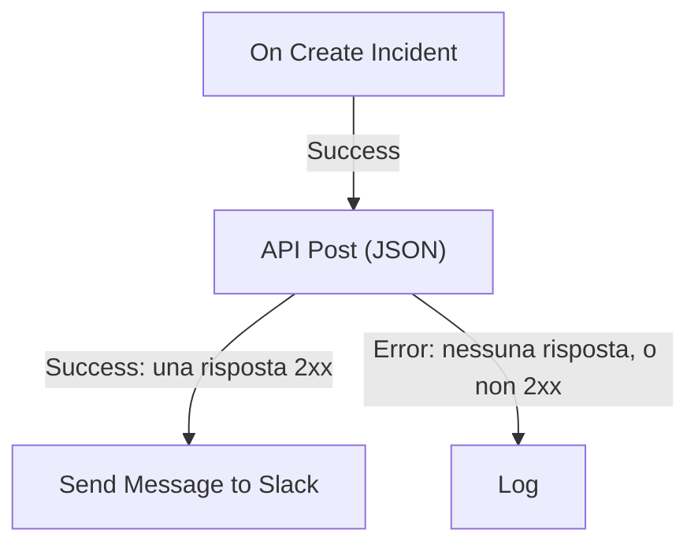

# Componenti del workflow

I componenti sono i blocchi che aggiungi dopo il trigger. Ognuno fa una sola cosa — invia un messaggio, chiama un'API, verifica una condizione, modifica un record di OneUptime — e poi prende una delle sue uscite verso i blocchi collegati. Questa pagina è il catalogo: di cosa ha bisogno ogni blocco, cosa restituisce e quando prende ciascuna uscita.

Raramente ti servirà tenerla aperta mentre costruisci. Le impostazioni di ogni blocco terminano con **How to use**: cosa fa il blocco, i passaggi per configurarlo, un esempio costruito dal tuo workflow e gli errori più comuni. Per aggiungere e collegare i blocchi, vedi [Creare un workflow](/docs/workflows/authoring).

:::cards
- [Inviare un messaggio](#slack): Slack, Microsoft Teams, Discord, Telegram, IRC ed email.
- [Chiamare un'API](#api): Invia una richiesta a qualsiasi API HTTP e leggi la risposta.
- [Aggiungere logica](#conditions): Dirama in base a un valore, trasforma i dati, attendi o registra.
- [Lavorare con i record di OneUptime](#componenti-dati-di-oneuptime): Trova, crea, aggiorna ed elimina monitor, incidenti e altro.
:::

## Quale componente usare?

| Per…                                                          | Usa                                                               |
| ------------------------------------------------------------- | ----------------------------------------------------------------- |
| Pubblicare in uno strumento di chat                           | [Slack](#slack), [Microsoft Teams](#microsoft-teams), [Discord](#discord), [Telegram](#telegram) o [IRC](#irc) |
| Inviare un'email tramite il tuo server di posta               | [Email](#email)                                                   |
| Chiamare qualsiasi altra API o un tuo servizio                | [API](#api)                                                       |
| Riassumere, classificare o scrivere testo                     | [Generate Text with AI](#generate-text-with-ai)                   |
| Prendere un percorso o un altro in base a un valore           | [Conditions](#conditions)                                         |
| Trasformare i dati tra due blocchi                            | [JSON](#json) o [Custom Code](#custom-code)                       |
| Attendere prima del blocco successivo                         | [Sleep](#sleep)                                                   |
| Avviare un altro workflow                                     | [Execute Workflow](#execute-workflow)                             |
| Leggere o modificare incidenti, monitor e altri record        | [Componenti dati di OneUptime](#componenti-dati-di-oneuptime)        |

Un blocco dedicato è meglio di uno generico: il blocco Slack conosce i limiti di Slack, e un blocco record conosce i campi del record, così ottieni errori e registri più chiari che con un blocco **API** che fa lo stesso lavoro.

## Come funziona ogni blocco

Un blocco viene eseguito quando il blocco precedente prende l'uscita collegata a esso. Legge le sue impostazioni, fa il suo lavoro e poi prende una delle sue uscite. Vengono eseguiti solo i blocchi collegati a quell'uscita.



- Le **Impostazioni** sono ciò che compili. Le impostazioni contrassegnate con **(Facoltativo)** possono restare vuote. Le impostazioni meno usate sono raccolte sotto **Altri campi**.
- Gli **Outputs** sono i punti sul bordo inferiore. La maggior parte dei blocchi ha **Success** ed **Error**; [Conditions](#conditions) ha **Yes** e **No**.
- I **Returns** sono i valori che un blocco passa ai blocchi successivi, come il **Response Body** di un'API. Un blocco successivo ne legge uno con `{{local.components.<block ID>.returnValues.<value ID>}}`; il pulsante **{ }** di un'impostazione lo inserisce per te. Vedi [Variabili](/docs/workflows/variables#output-dei-componenti-i-dati-dei-blocchi-precedenti).

Un blocco che prende **Error** non fa fallire l'esecuzione: l'esecuzione segue il percorso **Error**, o finisce lì se non c'è nulla di collegato. Un'impostazione obbligatoria lasciata vuota, o un'impostazione che non può mai funzionare, ferma invece l'esecuzione con un errore.

## API

Fai una richiesta HTTP a qualsiasi URL. C'è un blocco per metodo: **API Get (JSON)**, **API Post (JSON)**, **API Put (JSON)**, **API Patch (JSON)** e **API Delete (JSON)**.

| Impostazione        | Cosa fa                                                                                                                              |
| ------------------- | ------------------------------------------------------------------------------------------------------------------------------------ |
| **URL**             | L'indirizzo da chiamare, `http` o `https`.                                                                                           |
| **Request Body**    | Il JSON da inviare. Di solito ne hanno bisogno solo le richieste `POST`, `PUT` e `PATCH`.                                            |
| **Request Headers** | Gli header da inviare, come una chiave API. Sotto **Altri campi**. I loro valori sono nascosti nel registro dell'esecuzione.         |

| Uscita      | Quando                                                                                         |
| ----------- | ---------------------------------------------------------------------------------------------- |
| **Success** | Il server ha risposto con uno stato 2xx.                                                       |
| **Error**   | La richiesta non è riuscita: il server non era raggiungibile, o ha risposto con un altro stato. |

In entrambi i casi il blocco restituisce **Response Status**, **Response Headers** e **Response Body**, più **Error** con il motivo quando non è riuscito. Leggi un campo di una risposta JSON aggiungendo il suo nome al riferimento, come in `{{local.components.api-get-1.returnValues.response-body.id}}`.

I reindirizzamenti non vengono seguiti, quindi punta il blocco all'indirizzo che risponde. Le richieste partono da OneUptime: un URL che si risolve in un indirizzo di rete privata viene rifiutato a meno che un amministratore self-hosted non lo consenta, e l'esecuzione si ferma con il motivo. Vedi [Accesso alla rete in uscita](/docs/workflows/configuration#accesso-alla-rete-in-uscita).

## AI

### Generate Text with AI

Genera una risposta testuale da un prompt e da un contesto JSON facoltativo. Il blocco usa il provider LLM predefinito del progetto, o il provider globale dell'installazione quando il progetto non ne ha uno. I provider si configurano in modo centralizzato in **Impostazioni del progetto → IA → Provider LLM**; le loro chiavi e i loro endpoint non sono mai impostazioni del blocco.

| Impostazione              | Cosa fa                                                                                                                                                           |
| ------------------------- | ----------------------------------------------------------------------------------------------------------------------------------------------------------------- |
| **System Instructions**   | Indicazioni facoltative sul ruolo, il tono e i vincoli del modello.                                                                                              |
| **Prompt**                | Il compito. Viene inviato esattamente come lo scrivi, quindi il Markdown va bene, e può includere variabili e valori dei blocchi precedenti.                    |
| **Context**               | JSON facoltativo che invii di proposito. Viene aggiunto dopo un marcatore esplicito di fine messaggio e trattato come dati non attendibili.                     |
| **Temperature**           | Sotto **Altri campi**. La variabilità, da `0` a `1`; il valore predefinito è `0.2`, per un'automazione prevedibile. I modelli Claude attuali, Opus 4.7 e successivi e tutti i modelli Claude 5, scelgono da soli il proprio campionamento: OneUptime omette **Temperature** dalle loro richieste, quindi su di loro non ha alcun effetto. |
| **Maximum Output Tokens** | Sotto **Altri campi**. Da `1` a `4096`; il valore predefinito è `1024`.                                                                                          |

System Instructions, Prompt e il Context serializzato sono limitati insieme a 50.000 caratteri. Un'immagine incorporata in base64, come lo screenshot di un monitor sintetico nella descrizione di un incidente, viene sostituita da una breve nota come `[image omitted: PNG, 340 KB]` prima della misurazione, perché il modello legge testo, non immagini. Il registro dell'esecuzione dice cosa è stato omesso. La richiesta al provider dura al massimo 60 secondi e viene tentata una sola volta. Per progetto possono girare contemporaneamente al massimo tre richieste di IA dei workflow.

Restituisce **Response** (il testo generato), **Provider** e **Model** (cosa ha risposto), **Total Tokens** e **Completion Tokens** (l'utilizzo riportato dal provider), **LLM Log ID** (la voce della chiamata nei registri IA) ed **Error**.

Collega **Success** ai blocchi che usano la risposta, ed **Error** a un'alternativa: gli errori di convalida, di accesso, del provider, di budget, di fatturazione e di timeout lo prendono tutti. Il blocco non invia strumenti, quindi il modello non può interrogare OneUptime, chiamare API o modificare dati da solo.

> [!WARNING]
> L'output del modello è testo non attendibile. Rivedilo prima che arrivi ai clienti, e non lasciare mai che un testo libero generato dall'IA decida da solo un'azione distruttiva. Vedi [Componenti AI](/docs/workflows/configuration#componenti-ai) per sapere cosa viene inviato al provider, cosa viene registrato e quanto costa.

## Slack

Pubblica un messaggio in un canale Slack tramite un webhook in entrata.

| Impostazione                   | Cosa fa                                                                                                                                                                                                      |
| ------------------------------ | ------------------------------------------------------------------------------------------------------------------------------------------------------------------------------------------------------------ |
| **Slack Incoming Webhook URL** | Il webhook del canale in cui pubblicare. Deve iniziare con `https://hooks.slack.com/services/`. La guida di Slack per [crearne uno](https://api.slack.com/messaging/webhooks) richiede un paio di minuti.     |
| **Message Text**               | Il testo da inviare. Viene inviato esattamente come lo scrivi, quindi usa la formattazione di Slack: `*bold*`, `_italic_`, `~strikethrough~` e `<https://example.com|a link>`. Un testo più lungo di una sezione Slack (3.000 caratteri) parte in più sezioni; oltre dieci sezioni viene tagliato e termina con "… (truncated — see OneUptime for the full text)". |

**Success** scatta quando Slack ha accettato il messaggio ed **Error** quando l'ha rifiutato, con il motivo di Slack in **Error**. Questi blocchi pubblicano tramite il webhook delle loro impostazioni, non tramite la connessione Slack del tuo progetto.

## Microsoft Teams

Pubblica un messaggio in un canale di Microsoft Teams. Il blocco si chiama **Send Message to Teams**.

| Impostazione                   | Cosa fa                                                                                                                                                                                                                                       |
| ------------------------------ | --------------------------------------------------------------------------------------------------------------------------------------------------------------------------------------------------------------------------------------------- |
| **Teams Incoming Webhook URL** | Il webhook del canale in cui pubblicare, un URL `https` su `office.com`, `office365.com`, `logic.azure.com` o `environment.api.powerplatform.com`. La guida di Microsoft mostra come [crearne uno con i Workflows di Teams](https://support.microsoft.com/en-us/teams/apps-service/create-incoming-webhooks-with-workflows-for-microsoft-teams). |
| **Message Text**               | Il testo da inviare. Un messaggio più grande di quanto accetta un webhook in entrata (circa 12.000 caratteri, misurati come vengono inviati) viene tagliato e termina con "… (truncated — see OneUptime for the full text)".                     |

## Discord

Pubblica un messaggio in un canale Discord tramite un webhook in entrata.

| Impostazione                     | Cosa fa                                                                                                                                            |
| -------------------------------- | -------------------------------------------------------------------------------------------------------------------------------------------------- |
| **Discord Incoming Webhook URL** | Il webhook del canale, un URL `https` su `discord.com` o `discordapp.com`.                                                                         |
| **Message Text**                 | Il testo da inviare. Un messaggio di oltre 2.000 caratteri, il limite di Discord, viene tagliato e termina con "… (truncated — see OneUptime for the full text)". |

## Telegram

Invia un messaggio a una chat di Telegram con un bot.

| Impostazione           | Cosa fa                                                                                                                                            |
| ---------------------- | -------------------------------------------------------------------------------------------------------------------------------------------------- |
| **Telegram Bot Token** | Il token che BotFather ha dato al tuo bot, come `123456789:ABCdef…`. Un token di qualsiasi altra forma ferma l'esecuzione, senza che il token venga scritto nel registro. |
| **Chat ID**            | La chat in cui pubblicare: il suo ID, o lo `@username` di un canale. Aggiungi prima il bot al gruppo o al canale. Per scrivere a una persona, questa deve aver avviato una chat con il bot. |
| **Message Text**       | Il testo da inviare. Un messaggio di oltre 4.096 caratteri, il limite di Telegram, viene tagliato e termina con "… (truncated — see OneUptime for the full text)". |

Quando Telegram rifiuta il messaggio, **Error** scatta con il motivo di Telegram.

## IRC

Pubblica un messaggio in un canale IRC su qualsiasi rete IRC: Libera.Chat, OFTC o un tuo server. IRC non ha webhook, quindi il blocco si collega da solo al server, entra nel canale, invia il messaggio ed esce.

| Impostazione     | Cosa fa                                                                                                                                                                                                                                            |
| ---------------- | -------------------------------------------------------------------------------------------------------------------------------------------------------------------------------------------------------------------------------------------------- |
| **IRC Server**   | Il nome host del server, come `irc.libera.chat`. Solo il nome: niente `ircs://` e niente porta.                                                                                                                                                    |
| **Channel**      | Il canale in cui pubblicare, come `#ops`. Deve essere un canale: un nickname scritto qui viene rifiutato invece di ricevere un messaggio privato.                                                                                                  |
| **Message Text** | Il testo da inviare. Ogni riga parte come un messaggio IRC a sé, e una riga lunga viene divisa per starci. Un messaggio viene inviato al massimo come 15 righe IRC: uno più lungo viene accorciato, e la sua ultima riga lo dice. IRC non ha Markdown, quindi il testo viene inviato così com'è; i codici di formattazione di IRC, come il grassetto e i colori, funzionano. |

Sotto **Altri campi**:

| Impostazione                             | Cosa fa                                                                                                                                                                                                            |
| ---------------------------------------- | ------------------------------------------------------------------------------------------------------------------------------------------------------------------------------------------------------------------ |
| **Nickname**                             | Chi invia il messaggio. Predefinito `OneUptime`. Se il nickname è occupato, il blocco lo prova con un trattino basso o un numero aggiunto, e poi con uno al posto dei suoi ultimi caratteri, per un server che non accetta nickname più lunghi. |
| **Port**                                 | La porta del server. Predefinita `6697`, o `6667` con **Disable TLS** attivo.                                                                                                                                      |
| **Disable TLS**                          | Il blocco si collega via TLS e verifica il certificato del server. Attivalo solo per un server che non offre TLS; qualsiasi password viene allora inviata in chiaro. Per fidarsi di un certificato della tua autorità di certificazione, un'installazione self-hosted imposta invece `NODE_EXTRA_CA_CERTS`. |
| **Channel Key**                          | La chiave di un canale che ne ha una (modalità `+k`).                                                                                                                                                              |
| **Send Without Joining**                 | Pubblica senza entrare nel canale, così il canale non vede il blocco entrare e uscire. Funziona solo dove il canale accetta messaggi dall'esterno (niente modalità `+n`).                                           |
| **Server Password**                      | Una password che il server o il tuo bouncer chiedono al collegamento.                                                                                                                                             |
| **SASL Username** e **SASL Password**    | Accedi al tuo account sulle reti che usano SASL, come Libera.Chat, che lo richiede per le connessioni da alcuni indirizzi cloud e VPN. Compila entrambi o nessuno.                                                 |

**Success** scatta quando il server ha accettato ogni riga. Il blocco lo verifica chiedendo al server di rispondere a un ping dopo l'ultima riga: un server risponde in ordine, quindi qualsiasi rifiuto del messaggio arriva prima. Un bouncer come ZNC risponde da solo al ping, quindi il blocco ascolta un secondo in più per la risposta della rete che sta dietro.

**Error** scatta quando il server non è raggiungibile, rifiuta la connessione, il nickname, una password o il canale, o rifiuta il messaggio. Riporta il motivo, con le parole del server quando le ha fornite. Un **IRC Server**, un **Channel** o un **Message Text** mancante, o un'impostazione che non potrebbe mai funzionare, ferma invece l'esecuzione.

Ogni esecuzione del blocco è una connessione a sé, e le reti IRC limitano la frequenza con cui uno stesso indirizzo può collegarsi: una raffica di messaggi può essere rifiutata con un motivo come "Reconnecting too fast", e prende **Error** come qualsiasi altro rifiuto. Per un workflow che può scattare molte volte al minuto, raccogli ciò che deve dire in un unico messaggio, o invialo tramite un tuo server.

Tieni le password in [variabili globali segrete](/docs/workflows/variables#variabili-globali) e usa la variabile nell'impostazione; sono comunque nascoste nei registri delle esecuzioni. Le connessioni agli indirizzi di loopback (`localhost`, `127.0.0.1`), link-local e di metadati cloud vengono rifiutate. Su OneUptime Cloud, anche un server su un indirizzo di rete privata, o un nome che si risolve in uno, viene rifiutato. Le installazioni self-hosted possono raggiungere un server IRC sulla propria rete, a meno che `DATA_SOURCE_BLOCK_PRIVATE_ADDRESSES` non sia impostato su `true`.

## Email

Invia un'email tramite un server SMTP che indichi sul blocco. Il blocco si chiama **Send Email**.

| Impostazione                            | Cosa fa                                                                                               |
| --------------------------------------- | ----------------------------------------------------------------------------------------------------- |
| **From Email**                          | Il mittente, ad esempio `Alerts <alerts@company.com>`.                                                |
| **To Email**                            | L'indirizzo del destinatario. Separa più indirizzi con virgole o punti e virgola.                     |
| **Subject**                             | L'oggetto.                                                                                            |
| **Email Body**                          | Il messaggio, inviato come HTML.                                                                      |
| **SMTP HOST** e **SMTP Port**           | Il server di posta a cui collegarsi.                                                                  |
| **SMTP Username** e **SMTP Password**   | Facoltativi. Compila entrambi o nessuno.                                                              |
| **Use Implicit TLS**                    | Attivalo per il TLS implicito, di solito sulla porta 465. Lascialo spento per STARTTLS, di solito sulla porta 587. |

**Success** scatta quando il server SMTP ha accettato il messaggio. **Error** scatta quando l'host SMTP viene rifiutato, il server non è raggiungibile o rifiuta il messaggio, e riporta il messaggio di errore. Un **To Email**, un **From Email**, uno **SMTP HOST** o uno **SMTP Port** mancante ferma invece l'esecuzione.

Il blocco si collega direttamente al server indicato nelle sue impostazioni. Non usa le impostazioni [SMTP](/docs/emails/smtp) del tuo progetto né il server di posta di OneUptime, e le email che invia non compaiono nei registri delle notifiche. Per controllare cosa ha fatto, guarda le [Esecuzioni](/docs/workflows/runs-and-logs) del workflow.

Le connessioni agli indirizzi di loopback (`localhost`, `127.0.0.1`), link-local e di metadati cloud vengono rifiutate. Su OneUptime Cloud, anche un host SMTP su un indirizzo di rete privata, o un nome che si risolve in uno, viene rifiutato. Le installazioni self-hosted possono raggiungere un server di posta sulla propria rete, a meno che `DATA_SOURCE_BLOCK_PRIVATE_ADDRESSES` non sia impostato su `true`. Un host rifiutato prende l'uscita **Error**, e non viene inviato nulla.

## Custom Code

Esegui qualche riga di JavaScript quando gli altri blocchi non possono fare ciò che ti serve. Il blocco si chiama **Run Custom JavaScript**.

| Impostazione        | Cosa fa                                                                                                                              |
| ------------------- | ------------------------------------------------------------------------------------------------------------------------------------ |
| **JavaScript Code** | Il tuo codice. Ciò che restituisce con `return` diventa il **Value** del blocco. Può usare `await`.                                 |
| **Arguments**       | Un oggetto JSON di valori da passare al codice, che li legge come `args`. Mettici le variabili e i valori dei blocchi precedenti; il codice da solo non può leggerli. |

```json title="Arguments"
{ "title": "{{local.components.incident-on-create-1.returnValues.model.title}}" }
```

```javascript title="JavaScript Code"
const words = args.title.split(" ");

return {
  shortTitle: words.slice(0, 5).join(" "),
  wordCount: words.length,
};
```

Un blocco successivo legge il titolo breve come `{{local.components.javascript-1.returnValues.returnValue.shortTitle}}`.

Il codice viene eseguito in una sandbox con `args`, `console.log` (scritto nel registro dell'esecuzione), `axios` per le richieste HTTP, `crypto` e `sleep`. Non ha file system né processo, e le sue richieste seguono le stesse regole sugli indirizzi del blocco API. Ha 5 secondi per impostazione predefinita; un'installazione self-hosted lo cambia con `WORKFLOW_SCRIPT_TIMEOUT_IN_MS`.

**Success** scatta con il **Value** restituito, ed **Error** quando il codice lancia un'eccezione o esaurisce il tempo, con il messaggio in **Error**. Per script più pesanti, usa invece un [Runbook](/docs/runbooks/index).

## JSON

Converti tra testo e JSON, o combina due oggetti JSON.

| Blocco           | Riceve                                   | Restituisce                                                                                                |
| ---------------- | ---------------------------------------- | ---------------------------------------------------------------------------------------------------------- |
| **JSON to Text** | **JSON**, un oggetto                     | **Text**: l'oggetto come stringa. Utile quando il blocco successivo si aspetta testo.                      |
| **Text to JSON** | **Text**, che può occupare più righe     | **JSON**: l'oggetto analizzato, così puoi leggerne i campi. Usalo sul JSON arrivato come testo.            |
| **Merge JSON**   | **JSON 1** e **JSON 2**                  | **JSON**: un oggetto con le chiavi di entrambi. Quando entrambi hanno una chiave, vince **JSON 2**.        |

**Text to JSON** prende **Error** quando il testo non è JSON. Un input mancante, o un input di **Merge JSON** che non è un oggetto, ferma l'esecuzione.

## Conditions

Dirama in base a un confronto. Nel pannello **Aggiungi componente** questo blocco si chiama **If / Else**, sotto **Popular**.

Le sue impostazioni si leggono come una frase: **Se** *valore da verificare* *confronto* *valore di confronto*, continua su **Yes**, altrimenti su **No**. Sotto le impostazioni, la condizione viene riletta a parole, così puoi vedere che dice ciò che intendi. Sulla tela il blocco mostra anche la sua condizione, ad esempio *Se environment is equal to “production”*.

| Impostazione       | Cosa fa                                                                                                                                  |
| ------------------ | ---------------------------------------------------------------------------------------------------------------------------------------- |
| **Value to check** | Di solito un valore di un blocco precedente. Premi **{ }** nella casella per sceglierne uno, oppure scrivi `{{`.                          |
| **Comparison**     | Come confrontare, a parole. I confronti sono elencati qui sotto.                                                                         |
| **Compare with**   | Con cosa confrontare, scritto o scelto allo stesso modo. **è vuoto**, **non è vuoto**, **is true** e **is false** non lo usano.          |
| **Compare as**     | Raccolto sotto il confronto: **Text**, **Numero** o **True / False**. Scegli **Text** per ordinare date scritte `2026-10-01`, oppure **Numero** per rendere uguali `200` e `200.0`. |

I confronti:

- **is equal to** e **is not equal to**;
- per il testo: **contiene**, **non contiene**, **inizia con** e **termina con**;
- per i numeri: **è maggiore di**, **is greater than or equal to**, **è minore di** e **is less than or equal to**;
- **è vuoto** e **non è vuoto**, che verificano se il valore c'è;
- **is true** e **is false**.

I confronti numerici confrontano numeri e quelli testuali confrontano testo, quindi raramente ti serve **Compare as**. Come vengono confrontati i valori:

- Come testo, le maiuscole contano: `Error` non è `error`.
- Come numeri, un testo che non è un numero vale `0`. Le impostazioni segnalano un valore scritto così.
- Come vero o falso, solo `true` conta come vero.
- **è vuoto** è soddisfatto dall'assenza di un valore, da un testo vuoto, da una lista o un oggetto vuoti, o da un valore che il blocco precedente non aveva, come un campo che il webhook non ha inviato. `0` e `false` sono valori, quindi non sono vuoti.

**Yes** viene eseguito quando la condizione è soddisfatta e **No** quando non lo è. I blocchi configurati prima che le impostazioni avessero questi nomi funzionano esattamente come prima. Una vecchia scelta non è più offerta: confrontare un valore come **Null** o **Undefined**, che ignorava ciò che il valore conteneva. Un blocco che la usa ancora lo dice quando lo apri; scegli **è vuoto** per verificare un valore mancante.

## Sleep

Metti in pausa l'esecuzione prima del blocco successivo, per dare a un altro sistema il tempo di mettersi in pari o per fare un controllo più tardi.

**Days**, **Hours**, **Minutes** e **Seconds** si sommano. L'attesa più lunga è di 30 giorni: una più lunga viene ridotta a 30 giorni, e il registro dell'esecuzione lo dice.

Durante l'attesa, l'esecuzione viene messa da parte con lo stato **In attesa** e ripresa quando il tempo è scaduto, quindi un'attesa lunga non blocca nulla. Un'esecuzione il cui workflow è stato disattivato o archiviato nel frattempo viene annullata al risveglio.

## Log

Scrivi un valore nel registro dell'esecuzione. Non cambia nient'altro, il che lo rende il modo più semplice per vedere cosa conteneva un valore.

**Value** è ciò che va scritto. Può occupare più righe e includere valori dei blocchi precedenti, come `{{local.components.webhook-1.returnValues.request-body}}`. Il blocco prende **Out** quando ha finito.

## Execute Workflow

Avvia un altro workflow dello stesso progetto. Il tuo workflow prosegue senza aspettare che l'altro finisca.

| Impostazione  | Cosa fa                                                                                                                                   |
| ------------- | ----------------------------------------------------------------------------------------------------------------------------------------- |
| **Workflow**  | Il workflow da avviare. Deve essere abilitato e, per ricevere argomenti, avere un trigger **Manual**.                                     |
| **Arguments** | Il JSON da passare. Il trigger Manual dell'altro workflow passa ogni chiave come un valore a sé: con `{"customerId": "42"}`, legge `{{local.components.manual-1.returnValues.customerId}}`. |

**Out** scatta non appena l'altro workflow è in coda. **Error** scatta quando non può esserlo: non viene trovato, è disattivato o archiviato, o avviarlo creerebbe un ciclo.

Usalo per condividere logica comune: costruisci una volta un workflow «pubblica nel canale dell'incidente» e avvialo da ogni workflow che ne ha bisogno. Una catena di workflow che si avviano a vicenda non può tornare su sé stessa ed è profonda al massimo 10 livelli. Vedi [Configurazione e sicurezza](/docs/workflows/configuration#limite-alle-chiamate-tra-workflow).

## Componenti dati di OneUptime

Per ogni tipo di record in OneUptime (monitor, incidenti, avvisi, pagine di stato, policy di reperibilità e molti altri), il pannello **Aggiungi componente** ha questi componenti: sotto **OneUptime resources**, fai clic sul tipo di record (**Browse all resources** contiene quelli non mostrati), oppure cerca per nome del tipo. Ogni titolo è generato dal tipo di record, quindi l'insieme di Monitor è questo:

| Componente               | Cosa fa                                                                        |
| ------------------------ | ------------------------------------------------------------------------------ |
| **Find One Monitor**     | Legge un record che corrisponde alla query.                                    |
| **Find Many Monitors**   | Legge un elenco di record che corrispondono alla query.                        |
| **Create One Monitor**   | Aggiunge un record da un oggetto JSON.                                         |
| **Create Many Monitors** | Aggiunge più record da un array JSON.                                          |
| **Update One Monitor**   | Applica i dati da scrivere a un record corrispondente.                         |
| **Update Many Monitors** | Applica i dati da scrivere ai record corrispondenti, fino a **Limit**.         |
| **Delete One Monitor**   | Elimina un record corrispondente.                                              |
| **Delete Many Monitors** | Elimina i record corrispondenti, fino a **Limit**.                             |

Lo stesso insieme ti dà tre trigger: **On Create Monitor**, **On Update Monitor** e **On Delete Monitor**. Vedi [Trigger](/docs/workflows/triggers#trigger-di-eventi-oneuptime).

Un tipo offre solo i componenti che il suo modello consente. Un tipo di sola lettura ha i due componenti Find e nient'altro, quindi se nel pannello non trovi **Delete One Monitor**, quel tipo non lo consente.

È così che un workflow legge e modifica i dati di OneUptime. Ad esempio, un webhook del tuo strumento di CI può usare **Create One Incident** per aprire un incidente con i dettagli dell'errore.

Questi componenti agiscono come Project Admin del progetto del workflow: ciò che un Project Admin non può fare, o che il tuo piano non include, viene rifiutato, e il registro dell'esecuzione dice perché. Vedi [Cosa possono fare i passaggi di un workflow](/docs/workflows/configuration#cosa-possono-fare-i-passaggi-di-un-workflow).

### Dichiarare un incidente da un modello

**Create One Incident** può dichiarare l'incidente da uno dei tuoi [modelli di incidente](/docs/incidents/settings#modelli-di-incidenti): sceglilo in **Incident Template**, la prima impostazione del passaggio. Il modello compila ogni campo che **JSON Object** lascia fuori — il titolo, la descrizione, la gravità, lo stato iniziale, i monitor e le altre risorse, le policy di reperibilità, le etichette, le pagine di stato e i campi personalizzati — e i suoi proprietari diventano i proprietari dell'incidente. Tutto ciò che imposti in **JSON Object** prevale sul modello, stato compreso, quindi con un modello scelto **JSON Object** deve contenere solo ciò che deve essere diverso, e può restare vuoto.

L'incidente registra il modello da cui è stato dichiarato in `createdIncidentTemplateId`. Quella colonna la imposta OneUptime: un passaggio che la invia in **JSON Object** viene rifiutato, e il suo registro dell'esecuzione ti rimanda a **Incident Template**. Un modello di un altro progetto, o uno eliminato, fa prendere al passaggio la sua uscita **Error**, e su un piano che non include i modelli di incidente il passaggio viene rifiutato indicando il piano necessario. Vedi [Come viene applicato un modello](/docs/incidents/settings#come-viene-applicato-un-modello).

## Lavorare con i record

Ogni campo di un componente dati si basa sui nomi delle **colonne** del record: gli stessi nomi usati dall'API, non le etichette del modulo della dashboard. La colonna dell'ID è `_id`. La grafia `id` è accettata come alias ovunque tu possa scrivere un nome di colonna, ma `_id` è ciò che un record restituisce, quindi è ciò che devi leggere in uscita:

```json
{ "_id": "00000000-0000-0000-0000-000000000000" }
```

**Query** decide su quali record agisce il componente. Le chiavi sono colonne, i valori ciò che deve corrispondere:

```json
{ "monitorType": "Website", "isEnabled": true }
```

Una query è sempre limitata al progetto in cui viene eseguito il workflow. Non puoi raggiungere i record di un altro progetto, e non devi aggiungere tu il progetto alla query.

**JSON Object** su Create One, **JSON Array** su Create Many e **Data (JSON Object)** sui componenti Update portano i campi da scrivere, con le stesse chiavi:

```json
{ "name": "Checkout API", "monitorType": "Website" }
```

Una chiave che non è una colonna viene ignorata invece che rifiutata: il registro dell'esecuzione nomina quelle scartate, quindi controlla lì quando un campo non arriva. **Select Fields**, sui componenti Find e sui trigger, usa le stesse chiavi di colonna con valori `true`: `{"_id": true, "name": true}`.

I **campi personalizzati** sono un'unica colonna, `customFields`, che contiene il valore di ogni campo personalizzato sotto il nome del campo. I componenti Update modificano solo i campi personalizzati che nomini, e tutti gli altri mantengono il loro valore:

```json
{ "customFields": { "Notification Count": 1 } }
```

imposta **Notification Count** e lascia gli altri campi personalizzati del record come erano. Imposta un campo personalizzato a `null` per svuotarlo, oppure imposta `customFields` stesso a `null` per svuotarli tutti. Due workflow che aggiornano nello stesso momento campi personalizzati diversi dello stesso record vanno entrambi a buon fine. Questo vale solo per i componenti Update: l'API di OneUptime scrive `customFields` per intero, quindi una richiesta all'API deve contenere ogni campo personalizzato che vuoi conservare.

Raramente scrivi queste chiavi a mano. Nelle impostazioni del componente, **Add a field** (o **Add a condition** su una query) elenca le colonne del modello per nome, con il tipo di valore che ciascuna accetta. Cercale per nome, per chiave di colonna o per ciò che fa il campo, e premi **Enter** per aggiungere la corrispondenza migliore. In una creazione vengono prima i campi senza i quali il record non si può creare, poi i campi principali del modello (quelli che compila per te se li ometti), poi tutto il resto.

I campi che OneUptime compila da solo non vengono offerti quando scrivi un record: l'`_id` del record, **Creato il**, **Aggiornato il**, **Created by User**, gli slug, i numeri dei record e gli stati delle notifiche. Chi ha creato, archiviato o risolto un record, e quando, non spetta mai a un workflow: un record creato da un workflow non ha un creatore, un valore che un workflow invia per uno di quei campi insieme ad altri campi viene ignorato, e un Update che non invia nient'altro fallisce con un messaggio che li nomina. Un aggiornamento offre solo i campi che possono cambiare dopo che un record esiste. Una query offre comunque l'ID, gli orari e **Created by User**, perché sono utili per filtrare. **Deleted At** non viene offerto da nessuna parte: i record vengono eliminati del tutto, quindi è sempre vuoto.

**Skip** e **Limit** sono due campi numerici su Find Many, Update Many e Delete Many, sotto **Altri campi**: `Skip: 0` con `Limit: 100` prende le prime cento corrispondenze. **Limit** vale `10` per impostazione predefinita, e su Update Many e Delete Many limita quanti record vengono effettivamente scritti, non solo quanti vengono restituiti. Quindi `Items Deleted: 10` significa che sono stati eliminati dieci record, non che ne corrispondevano dieci. Aumenta **Limit** quando vuoi modificarne più di dieci.

**Success** ed **Error** indicano se la query è stata eseguita, non cosa ha trovato. Una query che non corrisponde a nulla restituisce `0` ed esce comunque da **Success**: non è un errore. Per diramare in base al fatto che qualcosa corrisponda, leggi il conteggio restituito in un blocco **If / Else**.

## Prossimi passi

:::cards
- [Variabili](/docs/workflows/variables): Passa valori tra i blocchi e tieni i segreti fuori da essi.
- [Esecuzioni](/docs/workflows/runs-and-logs): Guarda cosa ha ricevuto e restituito ogni blocco in un'esecuzione.
- [Configurazione e sicurezza](/docs/workflows/configuration): Limiti, autorizzazioni e cosa possono fare i passaggi.
:::
