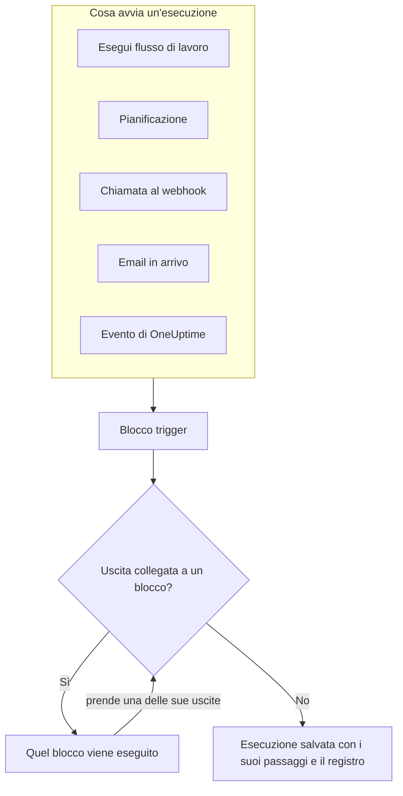
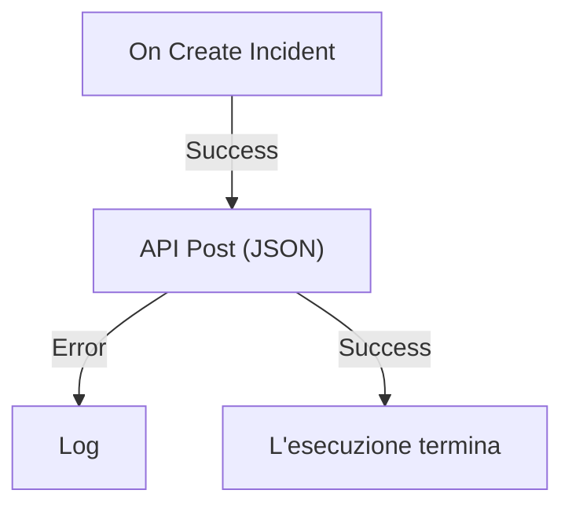

# Panoramica dei workflow

I workflow automatizzano il lavoro in OneUptime senza codice. Metti dei blocchi su una tela, li colleghi, e il workflow parte da solo ogni volta che scatta il suo trigger: viene creato un incidente, arriva l'ora di una pianificazione, un altro strumento chiama un URL o arriva un'email. Usali per collegare OneUptime al resto del tuo stack e per occuparti dei passaggi di routine mentre lavori al problema vero e proprio.

:::cards
- [Creare un workflow](/docs/workflows/authoring): Crea un workflow, poi aggiungi, collega e configura i suoi blocchi sulla tela.
- [Trigger](/docs/workflows/triggers): Avvia un workflow a mano, con una pianificazione, da un webhook, da un'email o da un evento di OneUptime.
- [Componenti](/docs/workflows/components): Tutti i blocchi che puoi aggiungere, dalle chiamate API ai record di OneUptime.
- [Esecuzioni](/docs/workflows/runs-and-logs): Guarda cosa ha fatto ogni esecuzione, passo per passo.
:::

## Come funziona un workflow

Ogni workflow ha tre parti:

1. **Un trigger** — ciò che avvia il workflow: un'esecuzione manuale, una pianificazione, una chiamata a un webhook, un'email in arrivo o un evento in OneUptime, come un nuovo incidente. Ogni workflow ne ha esattamente uno.
2. **I componenti** — ciò che fa il workflow: inviare un messaggio, chiamare un'API, verificare una condizione, creare o aggiornare un record di OneUptime.
3. **I collegamenti** — le linee che tracci da un blocco al successivo. Decidono cosa viene eseguito dopo cosa.

Quando scatta il trigger, OneUptime avvia un'**esecuzione**. Ogni blocco termina prendendo una delle sue uscite, ad esempio **Success** o **Error**, **Yes** o **No**, e vengono eseguiti solo i blocchi collegati a quell'uscita. Se all'uscita presa da un blocco non è collegato nessun blocco, quel percorso finisce lì. L'esecuzione viene salvata con il suo stato, il percorso seguito e ciò che ogni blocco ha ricevuto e restituito.



Costruisci tutto questo in modo visivo, su una tela. La maggior parte dei workflow non richiede codice; quando serve, un blocco **Run Custom JavaScript** esegue qualche riga di JavaScript.

## Cosa puoi fare con i workflow

- **Collegare OneUptime agli altri tuoi strumenti** — pubblicare su Slack, Microsoft Teams, Discord, Telegram o IRC, creare ticket Jira o inviare una richiesta a qualsiasi API del tuo stack.
- **Reagire a ciò che succede in OneUptime** — quando viene creato un incidente, avvisare il canale giusto e aprire automaticamente un ticket.
- **Eseguire lavori a intervalli regolari** — ogni cinque minuti, ogni notte, ogni lunedì mattina.
- **Ricevere dati dall'esterno** — lasciare che altri sistemi avviino un workflow chiamando il suo URL o scrivendo al suo indirizzo email.
- **Riutilizzare automazioni comuni** — costruiscila una volta e avviala da qualsiasi altro workflow con un blocco **Execute Workflow**.

## Termini chiave

| Termine                | Cosa significa                                                                                                     |
| ---------------------- | ------------------------------------------------------------------------------------------------------------------ |
| **Workflow**           | L'intera automazione: un nome, una tela di blocchi e un interruttore per attivarla o disattivarla.                 |
| **Trigger**            | Il primo blocco. Decide quando viene eseguito il workflow. Ogni workflow ne ha esattamente uno.                    |
| **Componente**         | Qualsiasi altro blocco: invia un messaggio, fa una richiesta, verifica una condizione o modifica un record.        |
| **Uscita**             | Un punto sul fondo di un blocco, come **Success** o **Error**. Le linee che partono da lì portano ai blocchi successivi. |
| **Esecuzione**         | Un'esecuzione del workflow, salvata con il suo stato, gli orari e ciò che ha fatto ogni blocco.                    |
| **Variabile globale**  | Un valore, come una chiave API, che salvi una volta e usi in qualsiasi workflow del progetto.                      |

## Prima di iniziare

- **Un piano che includa i workflow.** Su OneUptime Cloud i workflow richiedono il piano **Growth** o superiore, e ogni piano consente un certo numero di esecuzioni ogni 30 giorni — vedi [Limiti di piano](/docs/workflows/configuration#limiti-di-piano). Le installazioni self-hosted senza fatturazione non hanno nessuno dei due limiti.
- **Il permesso di costruire.** Creare e modificare i workflow richiede **Workflow Admin**, **Project Admin** o **Project Owner**, oppure un ruolo personalizzato con i permessi corrispondenti. Un **Workflow Member** può aprire i workflow ed eseguirli a mano, ma non modificarli. Vedi [Autorizzazioni](/docs/workflows/configuration#autorizzazioni).

## Dove trovare i workflow in OneUptime

Apri **Prodotti** nella barra in alto e scegli **Flussi di lavoro**, in **Dashboard e automazione**. Il suo menu contiene:

- **Flussi di lavoro** — l'elenco dei tuoi workflow. Creane uno nuovo o aprine uno esistente.
- **Variabili globali** — i valori condivisi da tutti i tuoi workflow.
- **Registri → Esecuzioni** — la cronologia delle esecuzioni di tutti i workflow del progetto.
- **Impostazioni → Regole etichette** e **Regole del proprietario** — assegna automaticamente etichette e proprietari ai nuovi workflow.
- **Avanzato → Archiviato** — i workflow che hai archiviato. Non vengono mai eseguiti e non compaiono nell'elenco; da qui puoi ripristinarli. Vedi [Archiviare un workflow](/docs/workflows/configuration#archiviare-un-workflow).
- **Sviluppatori** — come gestire i workflow con Terraform, l'API o un assistente IA.

Apri un singolo workflow e il suo menu contiene:

- **Panoramica** — nome, descrizione, etichette e l'interruttore **Abilitato**.
- **Costruttore** — la tela su cui progetti il workflow, con l'interruttore **Abilitato** in alto.
- **Variabili del flusso** — i valori che valgono solo per questo workflow.
- **Registri → Esecuzioni** — ogni esecuzione di questo workflow, con i dettagli.
- **Proprietari** — le persone e i team responsabili del workflow.
- **Sviluppatori** — come gestire questo workflow con Terraform, l'API o un assistente IA.
- **Impostazioni** — duplicare, esportare e archiviare.

**Impostazioni** si trova nella sezione **Avanzato** del menu, insieme a **Registri di audit** ed **Elimina flusso di lavoro**. **Avanzato** e **Sviluppatori** partono chiuse, in questo menu come in tutti gli altri, così le pagine che usi ogni giorno vengono per prime. Fai clic sul nome di una sezione per mostrarne le pagine. Si apre da sola quando ti trovi su una di esse.

## Costruisci il tuo primo workflow

Ogni workflow si costruisce allo stesso modo:

:::steps
1. **Crea** — scegli un punto di partenza, poi dai un nome al workflow. Vedi [Creare un workflow](/docs/workflows/authoring).
2. **Scegli un trigger** — manuale, pianificato, webhook, email in arrivo o un evento di OneUptime. Vedi [Trigger](/docs/workflows/triggers).
3. **Aggiungi componenti** — aggiungi azioni alla tela e collegale. Vedi [Componenti](/docs/workflows/components).
4. **Attivalo** — attiva **Abilitato** in cima al **Costruttore**. Un workflow disabilitato non può essere eseguito in alcun modo, nemmeno a mano.
5. **Provalo** — fai clic su **Esegui flusso di lavoro** nel **Costruttore** e segui l'esecuzione mentre avviene.
:::

L'esempio qui sotto segue questi passaggi per un workflow reale.

## Esempio: inviare i nuovi incidenti a un webhook

Questo workflow invia un riepilogo JSON di ogni nuovo incidente a un tuo URL — un sistema di ticketing, un data warehouse, qualsiasi cosa accetti un webhook — e scrive il motivo nel registro dell'esecuzione quando la richiesta non va a buon fine.



> [!TIP]
> Il modello **Forward new incidents to another system** costruisce per te questo stesso workflow. Lo trovi in **Incidenti** quando crei un workflow.

:::steps
### Crea il workflow

Apri **Flussi di lavoro** e fai clic su **Crea flusso di lavoro**. Fai clic su **Parti da zero**, chiama il workflow `Send new incidents to a webhook` e fai clic su **Crea flusso di lavoro**.

Il nuovo workflow si apre nel **Costruttore**, disattivato.

### Aggiungi il trigger

Fai clic sul blocco tratteggiato **Choose what starts this workflow**, poi su **On Create Incident** sotto **Popular** nel pannello **Add Trigger**.

Il trigger prende il posto del blocco tratteggiato. L'ID che compare su di esso, `incident-on-create-1`, è il modo in cui i blocchi successivi vi fanno riferimento.

### Scegli i campi dell'incidente

Fai clic sul trigger. In **Select Fields**, seleziona i campi che la richiesta deve contenere, come il titolo e la descrizione, e fai clic su **Salva**.

Il trigger passa il nuovo incidente con quei campi. Un campo che non selezioni arriva vuoto.

### Aggiungi il blocco API

Fai clic su **Aggiungi componente**, poi su **API Post (JSON)** sotto **Popular**. Trascina dal punto **Success** del trigger fino al punto superiore del nuovo blocco.

### Compila la richiesta

Fai clic sul blocco API, che mostra **Click to set up**. Inserisci il tuo endpoint in **URL**. In **Request Body**, scrivi il JSON da inviare, usando **{ }** per inserire i campi dell'incidente dove servono, e fai clic su **Salva**.

```json title="Request Body"
{
  "id": "{{local.components.incident-on-create-1.returnValues.model._id}}",
  "title": "{{local.components.incident-on-create-1.returnValues.model.title}}",
  "description": "{{local.components.incident-on-create-1.returnValues.model.description}}"
}
```

Ogni riferimento `{{…}}` viene sostituito con il valore dell'incidente quando il workflow viene eseguito. Vedi [Variabili](/docs/workflows/variables) per la sintassi.

### Intercetta gli errori

Fai clic su **Aggiungi componente**, poi su **Registro**. Collega a esso il punto **Error** del blocco API, poi imposta il **Value** del blocco Log su `Could not send the incident: {{local.components.api-post-1.returnValues.error}}`.

Una richiesta che non va a buon fine — un URL irraggiungibile o una risposta che non è 2xx — ora prende questo percorso, e il registro dell'esecuzione dice perché.

### Attivalo

Attiva **Abilitato** in cima al **Costruttore**.

### Provalo

Fai clic su **Esegui flusso di lavoro**, inserisci l'**ID incidente** di un incidente di questo progetto, fai clic su **Run Workflow Manually** e conferma con **Run**.

Si apre un pannello **Esecuzione del flusso di lavoro** che segue l'esecuzione. Apri il passaggio **API Post (JSON)** per vedere il corpo che ha inviato e la risposta che ha ricevuto.
:::

Da ora in poi, ogni nuovo incidente del progetto avvia un'esecuzione. Le trovi tutte nelle [Esecuzioni](/docs/workflows/runs-and-logs) del workflow.

> [!NOTE]
> La richiesta parte da OneUptime. Su OneUptime Cloud, l'URL deve essere raggiungibile da internet. Un'installazione self-hosted rifiuta gli indirizzi di rete privata a meno che un amministratore non li consenta — vedi [Accesso alla rete in uscita](/docs/workflows/configuration#accesso-alla-rete-in-uscita).

## Come si inseriscono i workflow nel resto di OneUptime

- I **monitor** individuano il problema. Gli **incidenti** e gli **avvisi** lo registrano. I **workflow** reagiscono.
- I **runbook** sono procedure di risposta che il tuo team segue durante un incidente, un avviso o una manutenzione: passaggi manuali, approvazioni e script, con persone coinvolte. I workflow girano senza supervisione. Usa un [runbook](/docs/runbooks/index) quando una persona deve prendere decisioni lungo il percorso, e un workflow quando ogni passaggio è automatico.
- Le **connessioni dell'area di lavoro** collegano un progetto a Slack e Microsoft Teams per i canali degli incidenti e le notifiche. I blocchi Slack e Microsoft Teams dei workflow non le usano: ogni blocco pubblica tramite un proprio URL di webhook in entrata.

## Prossimi passi

:::cards
- [Creare un workflow](/docs/workflows/authoring): Lavora con la tela, i blocchi e le loro impostazioni.
- [Variabili](/docs/workflows/variables): Passa dati tra i blocchi e tieni i segreti fuori dai tuoi workflow.
- [Configurazione e sicurezza](/docs/workflows/configuration): Autorizzazioni, limiti e sicurezza prima di andare in produzione.
:::
