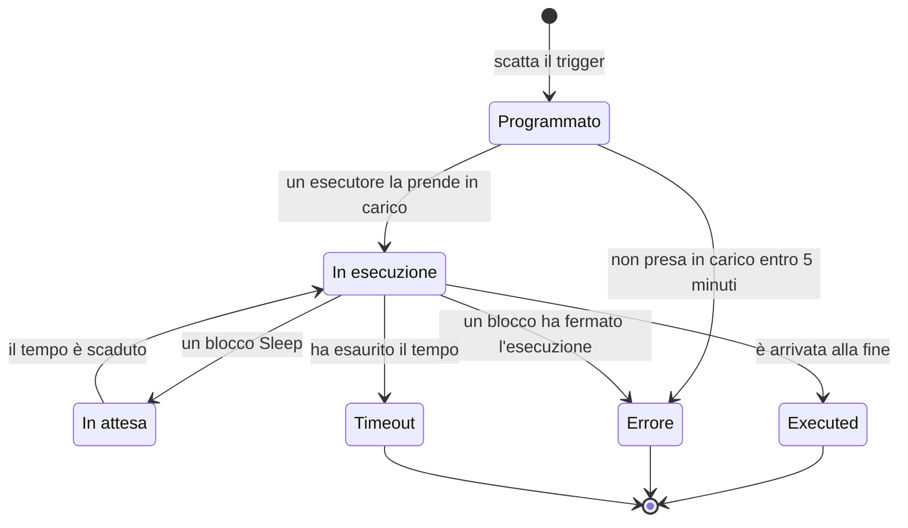

# Esecuzioni del workflow

Ogni volta che un workflow viene eseguito, OneUptime salva un resoconto di ciò che è successo: quando è stato eseguito, se ha funzionato e cosa ha ricevuto e restituito ogni blocco. Quel resoconto si chiama **esecuzione**. Le esecuzioni servono a confermare che un workflow ha funzionato, a fare il debug di uno che non ha funzionato e a ripercorrere l'attività passata.

:::cards
- [Stati di un'esecuzione](#stati-di-unesecuzione): Cosa significano Programmato, In attesa, Executed e gli altri stati.
- [Leggere un'esecuzione](#leggere-unesecuzione): Segui il percorso di un'esecuzione, blocco per blocco.
- [Risoluzione dei problemi](#risoluzione-dei-problemi): Un workflow che non è partito, un blocco mai eseguito, un valore arrivato vuoto.
:::

## Dove trovarle

| Pagina                                               | Cosa vedi                                                                                          |
| ---------------------------------------------------- | -------------------------------------------------------------------------------------------------- |
| **Flussi di lavoro → Registri → Esecuzioni**         | Ogni esecuzione di ogni workflow del progetto. Filtra per nome del workflow, stato e data.         |
| **Flusso di lavoro → Registri → Esecuzioni**         | Solo le esecuzioni di questo workflow. Qui c'è un filtro **ID esecuzione** invece di un filtro per workflow. |
| **Una singola esecuzione**                           | Si apre con il pulsante **Visualizza log** su una riga: le righe in sé non sono cliccabili.         |

Avviare un'esecuzione dal **Costruttore** apre la stessa vista **Esecuzione del flusso di lavoro**, che già segue l'esecuzione, così la vedi accadere invece di doverla cercare dopo.

## Stati di un'esecuzione

| Stato                               | Cosa significa                                                                                                                                                                                                                                                        |
| ----------------------------------- | --------------------------------------------------------------------------------------------------------------------------------------------------------------------------------------------------------------------------------------------------------------------- |
| **Programmato**                     | Il trigger è scattato e l'esecuzione è in coda in attesa di un esecutore. Di solito una frazione di secondo. Un'esecuzione ancora programmata dopo 5 minuti fallisce: nessuno l'ha presa in carico.                                                                   |
| **In esecuzione**                   | Il workflow è in corso.                                                                                                                                                                                                                                               |
| **In attesa**                       | L'esecuzione è ferma su un blocco **Sleep** e riprenderà da sola. Mentre attende non occupa nessun worker.                                                                                                                                                           |
| **Executed**                        | L'esecuzione è arrivata alla fine senza errori. È lo stato di successo: la pillola dice **Executed**, non «Riuscito».                                                                                                                                                 |
| **Errore**                          | Un blocco ha fermato l'esecuzione. Si usa anche quando un'esecuzione in coda non viene mai presa in carico, quando si perde la ripresa di un'esecuzione in pausa, quando un'espressione di pianificazione non può essere risolta e quando il workflow è stato disattivato o archiviato mentre l'esecuzione attendeva su un blocco **Sleep**. |
| **Timeout**                         | L'esecuzione è durata più del consentito: 2 minuti per impostazione predefinita. Vedi [Quanto può durare un'esecuzione](/docs/workflows/configuration#quanto-può-durare-unesecuzione).                                                                                       |
| **Execution Exceeded Current Plan** | Il progetto ha esaurito le esecuzioni dei workflow degli ultimi 30 giorni, oppure l'abbonamento non è pagato. L'esecuzione viene registrata ma non eseguita. Solo OneUptime Cloud.                                                                                   |

Un blocco che prende la sua uscita **Error** — un blocco API che ha ricevuto un 4xx, ad esempio — non fa fallire l'esecuzione. I blocchi collegati a **Error** vengono eseguiti, e l'esecuzione termina comunque come **Executed**. Il passaggio stesso viene disegnato in rosso, così lo trovi.

## Leggere un'esecuzione

Fai clic su **Visualizza log** su un'esecuzione per aprirla. La vista **Esecuzione del flusso di lavoro** ha due schede, **Passaggi** e **Full Log**.

### La scheda Passaggi

Il percorso seguito dall'esecuzione, una scheda numerata per blocco, nell'ordine in cui sono stati eseguiti. Senza aprire nulla, ogni scheda mostra:

- Il titolo e l'ID del blocco, se è **Riuscito** o **Non riuscito**, e quanto ha impiegato.
- Quale uscita ha preso, con il nome che ha sulla tela, e dove ha portato: il numero e il nome del passaggio successivo, oppure una nota che dice che non c'è nulla di collegato, quindi l'esecuzione o quel ramo è finito lì. Un passaggio a cui ha portato ma che non è mai stato eseguito dice **(did not run)**. L'uscita Error è disegnata in rosso; Yes e No indicano semplicemente la strada presa dall'esecuzione. Passa sopra il nome dell'uscita per sapere cosa significa.
- L'errore del passaggio, se non è riuscito, e qualsiasi avviso su di esso — ad esempio un riferimento `{{…}}` che non si è risolto in nulla.

Apri una scheda per due blocchi di dettaglio:

| Blocco       | Cosa mostra                                                                                                                                                                                                     |
| ------------ | --------------------------------------------------------------------------------------------------------------------------------------------------------------------------------------------------------------- |
| **Received** | Le impostazioni che il blocco ha ricevuto, per nome e nell'ordine del suo elenco di impostazioni, dopo che tutte le variabili sono state compilate. Un'impostazione che fa riferimento a un altro passaggio o a una variabile mostra il riferimento accanto al valore che è diventato, e **Did not resolve** quando non è diventato nulla. |
| **Returned** | Ciò che ha prodotto, con l'ID di ogni valore (l'ultima parte di un riferimento `returnValues`). Liste e oggetti sono mostrati con il rientro.                                                                   |

I passaggi non riusciti, i passaggi con un avviso e l'unico passaggio di un'esecuzione partono aperti. Il contatore della scheda **Passaggi** diventa rosso quando qualcosa non è riuscito e ambra quando un passaggio ha un avviso.

Alcune esecuzioni si leggono in modo diverso:

- **Una prova di un solo passaggio.** Un'esecuzione avviata con **Run just this step** dice **Only this step ran** in cima. I passaggi precedenti non sono stati eseguiti, quindi i valori che legge da essi mancano (aspettati un avviso **Did not resolve** per quelli), e i passaggi successivi dicono **(not run in this test)**. Usa **Esegui flusso di lavoro** per provare tutto il percorso.
- **Un'esecuzione fermata tra due passaggi.** Se l'esecuzione si è fermata per un motivo che nessun passaggio spiega — ha esaurito il tempo tra due passaggi, o è fallita prima del primo passaggio —, il percorso termina con **The run stopped here** e il motivo.
- **Un'esecuzione in pausa.** Un'esecuzione che attende su un blocco **Sleep** termina con **Sleeping** e l'ora in cui riprenderà da sola; i passaggi dopo lo Sleep dicono **(not run yet)**.

L'ID sotto il titolo di ogni passaggio è esattamente ciò che va in un riferimento `{{local.components.<id>.returnValues.…}}`, il che rende questo il modo più rapido per scrivere bene un riferimento.

I valori mostrati sono quelli che il blocco ha ricevuto, dopo la compilazione delle variabili e prima che il blocco ne facesse qualcosa, con due eccezioni: i segreti e i campi che il blocco contrassegna come sensibili sono nascosti, e un valore più lungo di 4.000 caratteri viene accorciato con "… (truncated)". Un'esecuzione conserva i suoi ultimi 100 passaggi; un'esecuzione lunga o ripresa spesso mostra una nota ambra dove i più vecchi sono stati scartati. Le esecuzioni registrate prima che venissero conservati i nomi delle uscite mostrano l'uscita con il suo ID, senza dove ha portato.

### La scheda Full Log

Il registro grezzo, riga per riga, scritto dall'esecutore, compreso ciò che i blocchi hanno registrato da soli, come il valore di un blocco **Log** o il `console.log` di uno script. Usalo quando la scheda Passaggi non spiega l'errore.

## Copiare e scaricare un'esecuzione

In cima alla vista **Esecuzione del flusso di lavoro**, accanto al pulsante di chiusura, **Copia log** mette l'intero **Full Log** negli appunti, pronto da incollare in una chat o in un ticket. **Scarica** salva l'esecuzione come file:

| Download                                | Cosa ottieni                                                                                                                                                                                                                           |
| --------------------------------------- | -------------------------------------------------------------------------------------------------------------------------------------------------------------------------------------------------------------------------------------- |
| **Scarica log**                         | Un file `.txt` con il registro completo esattamente come l'ha scritto l'esecutore, per quanto lungo, sotto una breve intestazione: il nome e l'ID del workflow, l'ID dell'esecuzione, il suo stato e quando è stata programmata, avviata e completata. |
| **Scarica l'esecuzione come JSON**      | Un file `.json` con le stesse informazioni come dati, i passaggi mostrati dalla scheda **Passaggi** (ciò che ognuno ha ricevuto e restituito, e quale uscita ha preso) e il registro come elenco di righe. I passaggi hanno la stessa forma in cui l'API restituisce lo `stepTrace` di un'esecuzione e, come nella scheda **Passaggi**, sono gli ultimi 100 dell'esecuzione. Il registro è sempre completo. |

Gli stessi due download si trovano nel menu **⋯** di ogni esecuzione in entrambi gli elenchi delle esecuzioni, così puoi salvare un'esecuzione senza aprirla. Un'esecuzione avviata dal **Costruttore** si può copiare o scaricare mentre è ancora in corso; ottieni ciò che ha registrato fino a quel momento.

I file prendono il nome dal workflow, dall'esecuzione e dall'ora di inizio, in UTC, così una cartella di file si ordina per workflow e poi per ora: `nightly-sync-run-<run id>-2026-09-30T10-00-01.txt`.

Un download non contiene nulla che tu non possa già leggere nell'esecuzione. I segreti e i campi che un blocco contrassegna come sensibili vengono nascosti quando l'esecuzione viene registrata, quindi sono nascosti anche nel file, e chiunque possa aprire un'esecuzione può scaricarla.

## Risoluzione dei problemi

:::details Il mio workflow non è partito
1. Assicurati che il workflow sia **Abilitato**: l'interruttore si trova in cima al suo **Costruttore**, che lo segnala sopra la tela quando il workflow è disattivato. I nuovi workflow partono disabilitati, e un workflow disabilitato rifiuta ogni esecuzione, comprese quelle manuali. Una chiamata webhook verso di esso riceve HTTP 400 con un messaggio che spiega come attivarlo.
2. Per un trigger di evento OneUptime, verifica che l'evento sia davvero avvenuto: apri il record e controlla la sua cronologia. Un trigger **On Update** con **Listen on** scatta solo quando cambia uno di quei campi.
3. Per un trigger webhook, verifica che l'altro sistema invii all'URL giusto. La maggior parte degli strumenti registra quando invia un webhook: controlla lì.
4. Per un trigger pianificato, verifica che l'espressione cron corrisponda all'ora che ti aspetti. Le pianificazioni girano in UTC.

Se l'esecuzione compare, con lo stato **Execution Exceeded Current Plan**, il progetto ha esaurito le esecuzioni dei workflow degli ultimi 30 giorni, oppure l'abbonamento non è pagato. Il registro dell'esecuzione indica il conteggio e il limite del tuo piano. Questo vale solo per OneUptime Cloud.
:::

:::details Un blocco successivo non è mai stato eseguito
Un blocco che non viene eseguito è di solito un problema di collegamento. Apri il **Costruttore** e verifica:

- L'uscita del blocco precedente è collegata all'ingresso di questo blocco?
- Il blocco precedente ha preso un'uscita diversa da quella che ti aspettavi — **Error** invece di **Success**, o **No** invece di **Yes**? La scheda **Passaggi** dice quale uscita ha preso e dove ha portato, oppure che non c'è nulla di collegato.
:::

:::details Un valore è arrivato vuoto, o come testo {{…}}
Apri l'esecuzione e guarda il passaggio. Un riferimento che non si è risolto viene segnalato sul passaggio stesso come avviso, e la sua impostazione nel blocco **Received** è contrassegnata come **Did not resolve**.

- Se vedi il testo letterale `{{local.components.…}}`, il riferimento non si è risolto. Di solito è un errore di battitura nell'ID del componente o nell'ID del valore di ritorno: ricorda che è l'**Identifier** del blocco, non il nome visualizzato su di esso. Controlla anche come è scritto `local.components`: `{{local.componets.api-get-1.returnValues.response-body}}` viene inviato come testo letterale e l'esecuzione riporta comunque **Executed**. Se l'esecuzione era una prova con **Run just this step**, il blocco precedente non è stato eseguito affatto: esegui invece l'intero workflow.
- Se vedi **Empty text**, il blocco precedente è stato eseguito ma non ha prodotto quel campo.

Lo stesso avviso si trova nella scheda **Full Log**, su una riga che inizia con `Warning:`.
:::

:::details Funziona quando lo eseguo a mano, ma non dal trigger
Apri il **Costruttore**, fai clic su **Esegui flusso di lavoro** e compila i campi del trigger con valori simili a quelli che invia il trigger reale. Poi confronta i valori **Received** di quell'esecuzione con quelli dell'esecuzione reale, uno accanto all'altro. La differenza sta di solito nel nome o nel tipo di un solo campo.
:::

## Rieseguire un workflow

Non c'è un pulsante «riprova questa esecuzione». Le vecchie esecuzioni non vengono mai rieseguite automaticamente, perché i loro effetti collaterali — messaggi Slack, chiamate API, ticket — potrebbero non essere sicuri da ripetere. Per rifare il lavoro, correggi il workflow e lascia che lo avvii il prossimo trigger reale, oppure apri il **Costruttore** e fai clic su **Esegui flusso di lavoro** con gli stessi valori.

## Per quanto tempo vengono conservate le esecuzioni?

Su OneUptime Cloud le esecuzioni vengono conservate per **30 giorni** e poi eliminate: per questo entrambi gli elenchi delle esecuzioni dicono di coprire gli ultimi 30 giorni. Le installazioni self-hosted conservano le esecuzioni finché non le elimini; se un workflow viene eseguito molto spesso e riempie la cronologia, disattivalo o eliminalo.

Le esecuzioni registrate prima dell'introduzione del tracciamento dei passaggi non hanno contenuto in **Passaggi** e mostrano solo il loro **Full Log**.

## Prossimi passi

:::cards
- [Configurazione e sicurezza](/docs/workflows/configuration): Limiti di tempo, limiti di piano e cosa viene nascosto nei registri.
- [Variabili](/docs/workflows/variables): La sintassi dei riferimenti usata dai tuoi blocchi.
- [Componenti](/docs/workflows/components): Cosa restituisce ogni blocco e quando prende ciascuna uscita.
:::
