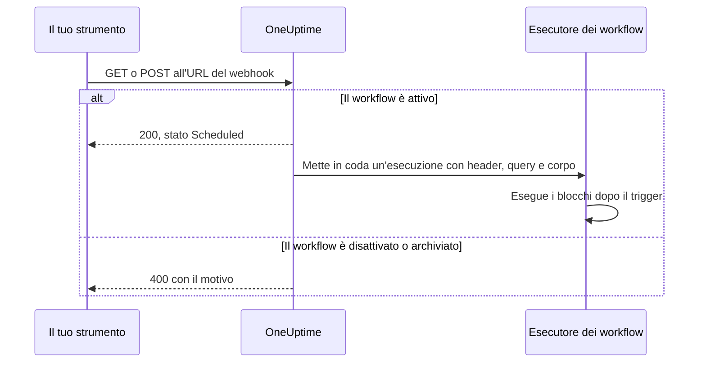
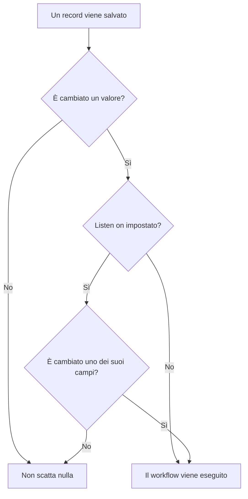

# Trigger del workflow

Un trigger è il primo blocco di un workflow: decide quando il workflow viene eseguito. Ogni workflow ha esattamente un trigger. Puoi scegliere tra cinque tipi.

:::cards
- [Manuale](#manual): Avvia il workflow dal Costruttore o da un altro workflow.
- [Pianificazione](#schedule): Eseguilo con una pianificazione ricorrente, scritta come espressione cron.
- [Webhook](#webhook): Lascia che un altro sistema lo avvii chiamando un URL.
- [Email in arrivo](#incoming-email): Avvialo con ogni email inviata al suo indirizzo.
- [Trigger di eventi OneUptime](#trigger-di-eventi-oneuptime): Reagisci quando un record viene creato, aggiornato o eliminato.
:::

Per aggiungere il trigger, fai clic sul blocco tratteggiato **Choose what starts this workflow** sulla tela di un nuovo workflow. Per cambiarlo, elimina il blocco del trigger e il blocco tratteggiato ricompare. Vedi [Creare un workflow](/docs/workflows/authoring#aggiungere-blocchi).

## Quale trigger usare?

| Se vuoi…                                       | Scegli                      |
| ---------------------------------------------- | --------------------------- |
| Fare clic su un pulsante per eseguire il workflow | **Manual**               |
| Eseguirlo con una pianificazione ricorrente    | **Pianificazione**          |
| Far inviare dati da un altro sistema           | **Webhook**                 |
| Avviarlo da un'email                           | **Incoming Email**          |
| Reagire a qualcosa all'interno di OneUptime    | **Evento OneUptime**        |

Un workflow può avere un solo trigger. Se ti servono due modi per avviare la stessa automazione, costruisci la logica condivisa in un workflow con un trigger **Manual** e avvialo da due workflow «involucro» leggeri con un blocco **Execute Workflow**.

## Manual

Esegui il workflow quando vuoi: fai clic su **Esegui flusso di lavoro** nella pagina **Costruttore**, compila il **JSON** del trigger, fai clic su **Run Workflow Manually** e conferma con **Run**. Anche un altro workflow può avviarlo, con un blocco **Execute Workflow**.

Ideale per: automazioni con un clic per cui vuoi un pulsante, come «ruota questa chiave» o «invia un avviso di prova», e logica che condividi tra workflow.

**Returns**: **JSON** — ciò con cui è stata avviata l'esecuzione.

- Da **Esegui flusso di lavoro**, è il JSON che hai scritto, come testo. Per leggerne un campo, passalo prima attraverso un blocco **Text to JSON**.
- Da un blocco **Execute Workflow**, ogni chiave degli **Arguments** del blocco è un valore a sé. Con `{"customerId": "42"}`, un blocco successivo legge `{{local.components.manual-1.returnValues.customerId}}`, dove `manual-1` è l'ID del trigger Manual.

## Schedule

Esegui il workflow con una pianificazione ricorrente. Imposta la frequenza in **Schedule at**: scegli una delle **Common schedules**, scrivi un'espressione **Custom cron** o scegli una **Variabile** che ne contenga una. Sotto il campo, la pianificazione viene descritta a parole con le sue **Next runs**.

Ideale per: pulizia notturna, sincronizzazione oraria, report settimanali.

Gli orari sono in UTC, quindi converti dal tuo fuso orario quando scegli l'ora. Le cinque parti di un'espressione cron sono il minuto, l'ora, il giorno del mese, il mese e il giorno della settimana:

| Espressione   | Viene eseguito                         |
| ------------- | -------------------------------------- |
| `*/5 * * * *` | Ogni 5 minuti.                         |
| `0 * * * *`   | Ogni ora, allo scoccare dell'ora.      |
| `0 0 * * *`   | Ogni giorno a mezzanotte UTC.          |
| `0 9 * * 1-5` | Ogni giorno feriale alle 9:00 UTC.     |
| `0 9 * * 1`   | Ogni lunedì alle 9:00 UTC.             |

Finché il workflow è disattivato non viene pianificato nulla. Una pianificazione **Variabile** legge una variabile del workflow o globale, come `{{local.variables.schedule}}`. Se non risulta un'espressione cron valida, il workflow non viene pianificato, e un'esecuzione non riuscita nel suo elenco delle esecuzioni spiega perché.

Per provare il workflow senza aspettare la pianificazione, fai clic su **Esegui flusso di lavoro** nel **Costruttore**: avvia subito un'esecuzione.

## Webhook

OneUptime assegna al workflow un URL tutto suo. Qualsiasi cosa chiami l'URL avvia il workflow, passandogli gli header, i parametri di query e il corpo della richiesta.

Ideale per: ricevere in OneUptime dati da un altro strumento — callback di CI/CD, avvisi da un altro sistema di monitoraggio, iscrizioni nel tuo CRM.

Per ottenere l'URL, fai clic sul trigger Webhook sulla tela. L'URL si trova in cima alle sue impostazioni, con un pulsante **Copia URL**, i metodi che accetta e un comando `curl` da incollare in un terminale per provarlo:

```bash
curl -X POST "https://oneuptime.example.com/workflow/trigger/<secret key>" \
  -H "Content-Type: application/json" \
  -d '{"message": "Hello"}'
```

L'URL accetta sia `GET` sia `POST`. Chi chiama riceve subito una conferma, `{"status": "Scheduled"}`: il workflow vero e proprio viene eseguito in background, quindi chi chiama non vede mai cosa fa. Una chiamata a un workflow disattivato o archiviato viene rifiutata con HTTP 400 e il motivo.



**Returns**:

| Valore                   | Cosa contiene                                                                                                         |
| ------------------------ | --------------------------------------------------------------------------------------------------------------------- |
| **Request Headers**      | Ogni header della richiesta, con il nome in minuscolo, come `content-type`.                                           |
| **Request Query Params** | I parametri della query string dell'URL, per nome.                                                                    |
| **Request Body**         | Il corpo inviato da chi chiama. Un corpo JSON, inviato con `Content-Type: application/json`, si può leggere campo per campo. |

Leggi un campo aggiungendo il suo nome al riferimento, come in `{{local.components.webhook-1.returnValues.request-body.message}}`.

Una volta arrivata una richiesta, il selettore dei valori di ogni blocco dopo il trigger sa cosa conteneva: elenca i campi del corpo, gli header e i parametri di query, ognuno con il suo contenuto, così puoi scegliere `incident.title` invece di scrivere un percorso. Fino ad allora dice che non è arrivata nessuna richiesta e offre **Copy test request**, un comando `curl` per l'URL; i campi compaiono non appena termina l'esecuzione avviata da quella richiesta. Vedi [Usare i valori dei blocchi precedenti](/docs/workflows/authoring#usare-i-valori-dei-blocchi-precedenti).

Per provare il workflow senza l'altro strumento, fai clic su **Esegui flusso di lavoro** nel **Costruttore** e inserisci header, parametri di query e un corpo.

### Mantieni privato l'URL

L'ultima parte dell'URL è la chiave segreta del workflow, e chiunque abbia l'URL può avviare il workflow. Per questo la chiave è nascosta finché non fai clic su **Mostra**, e **Copia URL** copia l'URL completo senza mostrarlo.

Se l'URL trapela, fai clic su **Reimposta URL** nello stesso punto: il workflow riceve un nuovo URL e quello vecchio smette subito di funzionare, quindi aggiorna tutto ciò che lo chiama. Solo le persone che possono modificare il workflow possono vedere o reimpostare il suo URL — vedi [Sicurezza dei webhook](/docs/workflows/configuration#sicurezza-dei-webhook).

> [!WARNING]
> Tratta l'URL come una password. Chiunque lo abbia può avviare il tuo workflow, senza accedere.

## Incoming Email

OneUptime assegna al workflow un indirizzo email tutto suo. Ogni email inviata a quell'indirizzo avvia il workflow, passandogli l'email: chi l'ha inviata, a chi era destinata, l'oggetto, il testo e l'HTML, gli header e i nomi degli allegati.

Ideale per: agire sulle email di sistemi che non possono chiamare un webhook — avvisi di vecchi strumenti di monitoraggio, comunicazioni di stato di un fornitore, il report che un job notturno invia via email.

Per ottenere l'indirizzo, fai clic sul trigger Incoming Email sulla tela. L'indirizzo si trova in cima alle sue impostazioni, con un pulsante **Copia indirizzo**. Dallo a ciò che deve avviare il workflow: uno strumento che sa solo inviare email, le impostazioni di notifica di un fornitore o una regola di inoltro della tua casella di posta.

Ogni email avvia la propria esecuzione. L'email raggiunge il workflow sia che l'indirizzo sia in A o in Cc, sia in copia nascosta, sia che passi per una regola di inoltro. Un'email che nomina l'indirizzo due volte avvia una sola esecuzione.

**Returns**:

| Valore          | Cosa contiene                                                                                           |
| --------------- | ------------------------------------------------------------------------------------------------------- |
| **From**        | L'indirizzo del mittente.                                                                               |
| **To**          | Tutti i destinatari dell'email, su una riga, come `ops@example.com, oncall@example.com`.                |
| **CC**          | Tutti i destinatari in copia, su una riga.                                                              |
| **Subject**     | L'oggetto.                                                                                              |
| **Body**        | Il testo semplice dell'email.                                                                           |
| **HTML Body**   | L'HTML dell'email, quando ce l'ha. Body e HTML Body vengono tagliati ciascuno a 1 MB.                   |
| **Headers**     | Ogni header dell'email, con il nome in minuscolo, come `message-id`.                                    |
| **Attachments** | Il nome, il tipo e la dimensione di ogni file allegato. I file veri e propri non vengono conservati.    |
| **Received At** | Quando OneUptime ha ricevuto l'email.                                                                   |

Una volta arrivata un'email, il selettore dei valori di ogni blocco dopo il trigger sa cosa conteneva: elenca ogni header e ogni allegato dell'email, con il loro contenuto, così puoi scegliere `headers.message-id` invece di scrivere un percorso. Fino ad allora dice che all'indirizzo non è ancora arrivata nessuna email. Vedi [Usare i valori dei blocchi precedenti](/docs/workflows/authoring#usare-i-valori-dei-blocchi-precedenti).

Per provare il workflow senza inviare un'email, fai clic su **Esegui flusso di lavoro** nella pagina **Costruttore** e compila un mittente, un oggetto e un corpo. I valori che tralasci arrivano vuoti.

Le email avviano il workflow solo mentre è attivo. Le email a un workflow disattivato vengono ignorate, così come quelle a un workflow il cui trigger non è più Incoming Email.

### Mantieni privato l'indirizzo

La parte dell'indirizzo prima della `@` contiene la chiave segreta del workflow, e chiunque abbia l'indirizzo può avviare il workflow. Per questo la chiave è nascosta finché non fai clic su **Mostra**, e **Copia indirizzo** copia l'indirizzo completo senza mostrarlo.

Se l'indirizzo trapela, fai clic su **Reimposta indirizzo** nello stesso punto: il workflow riceve un nuovo indirizzo, e da quel momento le email al vecchio vengono ignorate, quindi dai il nuovo a tutto ciò che scrive al workflow. Solo le persone che possono modificare il workflow possono vedere o reimpostare il suo indirizzo — vedi [Sicurezza delle email in arrivo](/docs/workflows/configuration#sicurezza-delle-email-in-arrivo).

> [!WARNING]
> Chiunque può mettere qualsiasi mittente su un'email, quindi **From** non prova chi l'ha inviata. Verifica qualcosa che conosce solo il vero mittente prima che un passaggio faccia qualcosa di importante.

> [!NOTE]
> In un'installazione self-hosted, OneUptime riceve le email tramite un provider di email in entrata configurato dal tuo amministratore — vedi [Email in entrata con SendGrid](/docs/self-hosted/sendgrid-inbound-email). Fino ad allora il trigger non ha un indirizzo, e le sue impostazioni lo dicono.

## Trigger di eventi OneUptime

Quasi tutto in OneUptime — monitor, incidenti, avvisi, eventi di manutenzione pianificata, pagine di stato, policy di reperibilità, team — può avviare un workflow. Ognuno offre fino a tre eventi:

- **On Create** — scatta quando ne viene aggiunto uno nuovo.
- **On Update** — scatta quando uno viene modificato. Salvare un record con i valori che ha già, come un modulo salvato senza modifiche o un interruttore inviato com'è già, non è una modifica e non lo fa scattare.
- **On Delete** — scatta quando uno viene eliminato.

È così che costruisci «quando in OneUptime succede X, fai Y» senza dover controllare le cose in un ciclo.

**On Update** può essere limitato ad alcuni campi con **Listen on**: allora scatta solo quando un aggiornamento cambia uno di essi, con qualsiasi valore — anche spegnere un interruttore o svuotare un campo conta.



**On Create** e **On Update** passano il record al blocco successivo, con i campi che scegli in **Select Fields** del trigger. Ad esempio, il trigger **Incident → On Create** passa il nuovo incidente, così il blocco successivo può leggere il suo titolo, la descrizione, la gravità o qualsiasi altro campo selezionato, come `{{local.components.incident-on-create-1.returnValues.model.title}}`. Un campo che non hai selezionato arriva vuoto.

**On Delete** passa solo l'ID del record eliminato: quando il workflow viene eseguito il record non c'è più, quindi i suoi altri campi non si possono leggere.

Per provare un trigger di evento senza aspettare l'evento, fai clic su **Esegui flusso di lavoro** nel **Costruttore** e inserisci l'ID di un record esistente, come un **ID incidente**. L'esecuzione legge quel record con i campi che hai selezionato.

### Gli eventi più usati

| Risorsa                                   | Cosa ci fanno i team                                                                      |
| ----------------------------------------- | ----------------------------------------------------------------------------------------- |
| **Incidente**                             | Reagire quando un incidente viene dichiarato, aggiornato (preso in carico, risolto) o eliminato. |
| **Avviso**                                | Gli stessi tre eventi, per gli avvisi.                                                    |
| **Monitor**                               | Reagire quando un monitor viene aggiunto, modificato o rimosso.                           |
| **Pianificato Manutenzione Evento**       | Annunciare automaticamente una finestra di manutenzione quando viene pianificata.         |
| **Pagina di stato Iscritto**              | Dare il benvenuto a chi si iscrive a una pagina di stato.                                 |
| **Policy di reperibilità**                | Sincronizzare le modifiche della policy con un altro sistema di turni.                    |

Nel pannello **Add Trigger** si trovano sotto **OneUptime resources**: fai clic sulla risorsa, poi sul trigger. **Browse all resources** le contiene tutte, e la casella di ricerca trova un trigger da poche parole, come `incident created`.

## Prossimi passi

:::cards
- [Componenti](/docs/workflows/components): Le azioni che aggiungi dopo il trigger.
- [Variabili](/docs/workflows/variables): Leggi nei blocchi successivi ciò che il trigger ha passato.
- [Esecuzioni](/docs/workflows/runs-and-logs): Verifica che il trigger sia scattato e cosa ha portato.
:::
