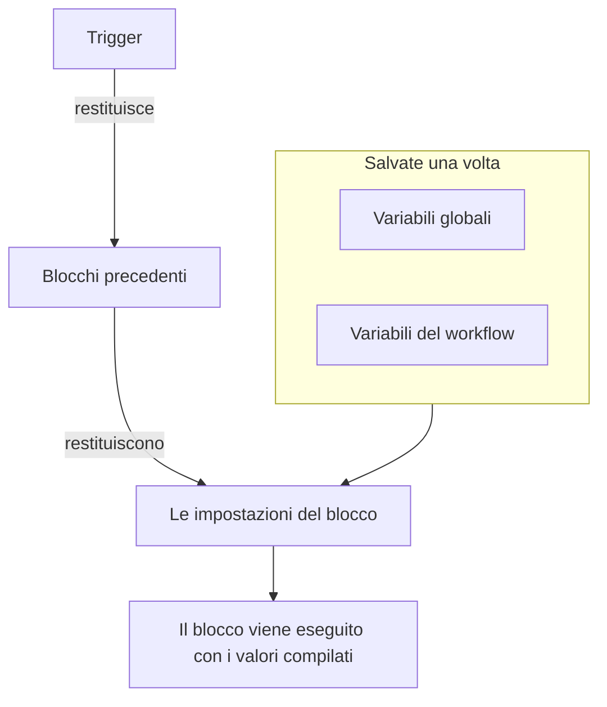
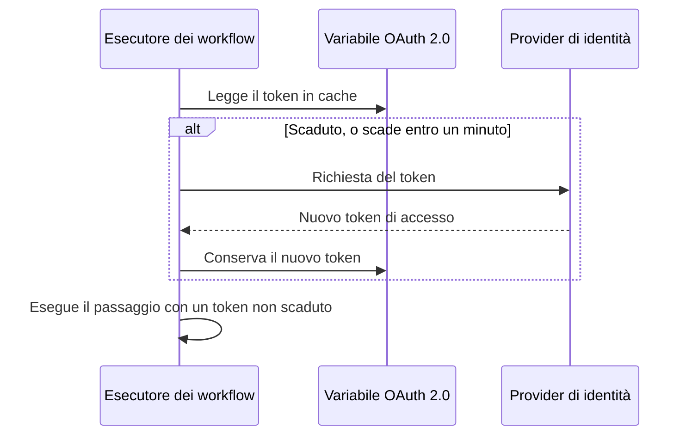

# Variabili del workflow

Le variabili sono il modo in cui i dati si muovono in un workflow: dal trigger al primo blocco, da un blocco al successivo, e dai valori che salvi una volta a ogni blocco che ne ha bisogno. L'impostazione di un blocco legge un valore con un riferimento tra doppie parentesi graffe, e l'esecutore lo compila subito prima che il blocco venga eseguito.

| Valore                          | Da dove viene                                                    | Come lo legge un blocco                               |
| ------------------------------- | ---------------------------------------------------------------- | ----------------------------------------------------- |
| **Variabile globale**           | Salvata in **Flussi di lavoro → Variabili globali**               | `{{global.variables.NAME}}`                          |
| **Variabile del workflow**      | Salvata nella pagina **Variabili del flusso** di un workflow      | `{{local.variables.NAME}}`                           |
| **Il valore di un blocco precedente** | Ciò che il trigger o un blocco precedente ha restituito in questa esecuzione | `{{local.components.BLOCK_ID.returnValues.VALUE_ID}}` |



Raramente scrivi un riferimento a mano. Fai clic su **{ }** alla fine di un'impostazione, oppure scrivi `{{` al suo interno, e scegli il valore da un elenco. Vedi [Usare i valori dei blocchi precedenti](/docs/workflows/authoring#usare-i-valori-dei-blocchi-precedenti).

## Variabili globali

Valori validi per tutto il progetto che salvi una volta e riusi in ogni workflow: chiavi API, URL, nomi di canali — qualsiasi cosa tu non voglia copiare in dieci workflow diversi.

:::steps
### Apri le variabili globali

Vai in **Flussi di lavoro → Variabili globali** e fai clic su **Crea: Flusso di lavoro Variabile**.

### Dai un nome alla variabile

Nel passaggio **Variabile**, compila:

- **Nome** — come farai riferimento alla variabile. Almeno due caratteri, niente spazi, e solo lettere, numeri, trattini e trattini bassi. `UPPER_SNAKE_CASE` è una buona abitudine perché risalta nei tuoi blocchi.
- **Descrizione** — facoltativa, testo libero per ricordarti a cosa serve.

Fai clic su **Avanti**.

### Assegnale un valore

Nel passaggio **Valore**, compila:

- **Contenuto** — il valore vero e proprio. È un campo di testo lungo, quindi i valori su più righe funzionano.
- **Segreto** — quando è attivo, il valore viene eliminato dai registri delle esecuzioni e dalle tracce dei passaggi.

Fai clic su **Crea: Flusso di lavoro Variabile**. Per cambiare il nome o la descrizione prima di farlo, fai clic su **Variabile** nell'elenco dei passaggi accanto al modulo (visibile sugli schermi larghi); ciò che hai scritto in entrambi i passaggi viene conservato.
:::

Usa una variabile globale in qualsiasi workflow con:

```text
{{global.variables.NAME}}
```

Ad esempio, se hai salvato la tua chiave PagerDuty come `PAGERDUTY_KEY`, qualsiasi blocco può usarla come `{{global.variables.PAGERDUTY_KEY}}`: l'editor salva il riferimento, e la registrazione del workflow elimina il valore segreto risolto.

L'elenco mostra il nome e la descrizione di ogni variabile. Fai clic su **Visualizza** in una riga per aprire la pagina della variabile. Mostra se la variabile è statica o OAuth 2.0, ed è lì che fai tutto il resto:

| Pulsante                                       | Cosa fa                                                                                                                                          |
| ---------------------------------------------- | ------------------------------------------------------------------------------------------------------------------------------------------------ |
| **Modifica: Variabile**                        | Cambia il nome, la descrizione e — per una variabile statica non ancora segreta — il contrassegno di segreto. Una volta segreta, una variabile resta segreta. |
| **Update Content**                             | Sostituisce un valore statico. Il contenuto salvato non può essere riletto, quindi scrivi il nuovo valore per intero.                           |
| **Use in Workflows**                           | Mostra il riferimento esatto da incollare nei tuoi blocchi, con un pulsante per copiarlo.                                                        |
| **Elimina: Flusso di lavoro Variabile**        | La elimina, dopo averti chiesto conferma. La conferma nomina la variabile, così puoi verificare che sia quella giusta.                           |

Per creare invece una variabile **token di accesso OAuth 2.0**, apri il menu **Altro** (**⋯**) accanto a **Crea: Flusso di lavoro Variabile** e scegli **Create OAuth 2.0 Variable**. Le variabili OAuth 2.0 hanno [una sezione tutta loro](#variabili-oauth-20-token-che-si-rinnovano-da-soli) più sotto. Il tipo di una variabile non può essere cambiato dopo il salvataggio.

Puoi anche aggiornare una variabile tramite l'API, come spiegato [alla fine di questa pagina](#aggiornare-una-variabile-da-un-workflow). Le variabili globali e del workflow sono una funzione del piano Growth.

## Variabili locali del workflow

Variabili limitate a un solo workflow, gestite in **Variabili del flusso** nel menu di quel workflow. Funzionano come le variabili globali: **Crea: Flusso di lavoro Variabile** crea una variabile statica, il menu **Altro** (**⋯**) crea una variabile OAuth 2.0 e **Visualizza** apre la pagina di una variabile. Fai riferimento a esse con:

```text
{{local.variables.NAME}}
```

Usane una per un valore che serve solo a quel workflow, come l'URL del webhook Slack di un modello. I modelli che chiedono impostazioni le salvano come variabili del workflow, così puoi cambiarle in seguito senza modificare i blocchi.

## Variabili OAuth 2.0 (token che si rinnovano da soli)

Un bearer token incollato in una variabile statica funziona finché non scade, di solito entro un'ora. Da lì in poi, ogni esecuzione che lo usa fallisce con `401 Unauthorized` finché qualcuno non ne incolla uno nuovo. Una variabile **token di accesso OAuth 2.0** salva ciò che serve allo scambio di token OAuth invece del token stesso, e OneUptime mantiene il token aggiornato.

La usi esattamente come qualsiasi altra variabile:

```http
Authorization: Bearer {{global.variables.CRM_API_TOKEN}}
```

### Come il token resta valido



- La prima volta che un workflow usa la variabile, OneUptime chiede un token di accesso all'endpoint dei token del tuo provider di identità e lo conserva.
- Prima di ogni passaggio che fa riferimento alla variabile, l'esecutore controlla il token. Se è scaduto, o scade entro il minuto successivo, ne viene recuperato uno nuovo prima che il passaggio venga eseguito. Il componente riceve sempre un token non scaduto, per quanto a lungo la variabile sia rimasta inutilizzata e per quanto duri l'esecuzione.
- Solo i passaggi che fanno davvero riferimento alla variabile provocano un rinnovo. Un'esecuzione che non usa mai una variabile non ne recupera mai il token, e non fallisce perché quel provider è irraggiungibile.
- Quando molte esecuzioni hanno bisogno di un nuovo token nello stesso momento, una lo recupera e le altre usano quello.
- Se il provider non dice quando scade un token (niente `expires_in`, e il token non è un JWT con un claim `exp`), OneUptime ne recupera uno nuovo una volta per esecuzione e lo condivide tra i passaggi di quell'esecuzione.

### Tipi di concessione

| Tipo di concessione           | Usalo per                                                                                                                                                                                                                                           |
| ----------------------------- | --------------------------------------------------------------------------------------------------------------------------------------------------------------------------------------------------------------------------------------------------- |
| **Client Credentials**        | OneUptime accede come la tua applicazione. La scelta abituale per le API da server a server come Microsoft Graph, le API di Auth0 o Okta, o un servizio interno dietro Keycloak.                                                                    |
| **Token di aggiornamento**    | Accesso delegato per conto di un utente. Autorizza l'applicazione una volta (ad esempio nell'OAuth playground del tuo provider o con Postman) e incolla il refresh token che ottieni. OneUptime lo scambia con token di accesso, e salva ogni nuovo refresh token se il tuo provider li ruota. Funziona anche un client pubblico senza client secret. |

### Crearne una

**Create OAuth 2.0 Variable** chiede una cosa per passaggio:

1. **Variabile**: il nome con cui i workflow fanno riferimento alla variabile, e una descrizione.
2. **Provider**: scegli il tuo **Provider di identità** e OneUptime compila il suo **URL del token**:

   | Provider di identità | URL del token che compila |
   |---|---|
   | Microsoft Entra ID | `https://login.microsoftonline.com/{tenant-id}/oauth2/v2.0/token` |
   | Google | `https://oauth2.googleapis.com/token` |
   | Okta | `https://{your-domain}/oauth2/default/v1/token` |
   | Auth0 | `https://{your-domain}/oauth/token` |

   Sostituisci la parte tra parentesi graffe con il tuo valore, come l'ID della directory (tenant) o il tuo dominio Okta. Il modulo non va avanti finché l'URL ne contiene una. Per qualsiasi altro provider, scegli **Altro provider** e inserisci tu il suo endpoint dei token. Poi scegli il **Tipo di concessione**. Scegliendo Google si seleziona **Token di aggiornamento**, perché i client OAuth di Google non possono usare Client Credentials. Il provider serve solo a compilare il modulo; non viene salvato con la variabile.
3. **Credenziali**: il **Client ID** e il **Client Secret** dell'applicazione che hai registrato presso il provider e, per il tipo Refresh Token, il **Token di aggiornamento**. Un client pubblico con il tipo Refresh Token può lasciare vuoto il client secret.
4. **Avanzato**, tutto facoltativo:
   - **Ambito**: separato da spazi. Lascialo vuoto per ottenere gli ambiti predefiniti del provider. Con Client Credentials, Microsoft Entra ID richiede un ambito che termini con `/.default` (come `https://graph.microsoft.com/.default`) e Okta richiede un ambito personalizzato.
   - **Parametri aggiuntivi**: campi di modulo extra per la richiesta del token, come `audience` per Auth0 (necessario per Client Credentials) o `resource` per Azure AD v1. Chiunque possa leggere la variabile può leggerli, quindi non metterci segreti.
   - **Autenticazione del client**: se il client ID e il secret vanno in un header HTTP Basic (il predefinito) o nel corpo della richiesta. Se il tuo provider risponde `invalid_client`, prova l'altra opzione.

Sotto alcuni campi il modulo aggiunge una riga di aiuto per il provider che hai scelto, ad esempio dove Microsoft Entra ID mostra il tuo tenant ID, e che il suo client secret è il **Value** del segreto, non il suo **Secret ID**.

Quando salvi una nuova variabile OAuth 2.0, OneUptime recupera subito il suo primo token e ti dice cosa ha risposto il provider. Un errore di battitura nel secret o nell'URL emerge in quel momento, non ore dopo in un'esecuzione non riuscita. Recuperare un token scrive nella variabile, quindi serve il permesso di modificare le variabili del workflow; se puoi creare variabili ma non modificarle, sarà la prima esecuzione di un workflow che usa la variabile a recuperarne il token.

La pagina della variabile (fai clic su **Visualizza** nella sua riga) ha una scheda **OAuth 2.0 Settings**. **Modifica impostazioni** ripercorre gli stessi passaggi **Provider** (URL del token), **Credenziali** (client ID) e **Avanzato** (ambito, parametri aggiuntivi, autenticazione del client). **Avanti** prosegue e **Salva modifiche** è nell'ultimo passaggio. Ogni passaggio è già compilato, quindi l'elenco dei passaggi accanto al modulo apre uno qualsiasi di essi: cambia un'impostazione nel suo passaggio, poi apri l'ultimo passaggio e salva. Il tipo di concessione resta fisso una volta salvato.

### La scheda Token di accesso

La scheda **Token di accesso** nella pagina di una variabile OAuth 2.0 mostra uno di questi stati:

| Stato                      | Cosa significa                                                                                                                       |
| -------------------------- | ------------------------------------------------------------------------------------------------------------------------------------ |
| **Valid**                  | Il token in cache non è ancora scaduto.                                                                                              |
| **Scaduto**                | Normale per una variabile che nessun workflow ha usato di recente. La prossima esecuzione che la usa recupera un nuovo token.       |
| **Non ancora recuperato**  | Non è stato recuperato nessun token da quando la variabile è stata creata o le sue impostazioni sono cambiate.                       |
| **No expiry reported**     | Il provider non ha detto quando scade il token, quindi ogni esecuzione ne recupera uno nuovo.                                        |
| **Refresh failed**         | L'ultimo tentativo di ottenere un token non è riuscito. Il motivo del provider viene mostrato per intero, con il momento in cui è successo. Il prossimo rinnovo riuscito lo cancella. |

**Aggiorna ora**, sotto lo stato, recupera subito un nuovo token. Usalo per verificare nuove impostazioni senza eseguire un workflow. **Update Credentials**, nella scheda **OAuth 2.0 Settings**, sostituisce il client secret o il refresh token, poi recupera un token con essi. Modificare qualsiasi impostazione (URL del token, client ID, ambito e così via) scarta il token in cache, quindi l'esecuzione successiva ne recupera uno con le nuove impostazioni.

### Quando il provider dice di no

Il passaggio che aveva bisogno del token fallisce prima di essere eseguito, e il registro dell'esecuzione nomina la variabile e cita la risposta del provider, ad esempio `Could not get an OAuth 2.0 access token for {{global.variables.CRM_API_TOKEN}}: The token endpoint refused the request (HTTP 400): invalid_grant - Token has been expired or revoked.` Lo stesso motivo compare nella scheda **Token di accesso** della variabile. `invalid_grant` su una variabile Refresh Token significa quasi sempre che il refresh token stesso è scaduto o è stato revocato, e la soluzione è **Update Credentials**.

Se il rinnovo fallisce quando il token in cache non è ancora davvero scaduto (era solo dentro il margine di un minuto), il passaggio procede con il token in cache e il registro lo dice.

### Sicurezza

- Le variabili OAuth 2.0 sono sempre segrete. Il token di accesso viene sostituito con `[REDACTED]` nei registri delle esecuzioni e nelle tracce dei passaggi, compreso un token sostituito a metà di un'esecuzione.
- Il client secret, il refresh token e il token di accesso sono cifrati nel database e non possono mai essere riletti tramite l'API o la dashboard. **Aggiorna ora** riporta quando scade il nuovo token, mai il token.
- L'URL del token deve essere `http` o `https`. Le richieste a indirizzi di loopback, link-local e di metadati cloud vengono rifiutate. Su OneUptime Cloud vengono rifiutati anche gli indirizzi di rete privata. Le installazioni self-hosted possono raggiungere un provider di identità sulla propria rete. OneUptime non segue i reindirizzamenti nelle richieste di token, quindi punta l'URL del token all'indirizzo su cui l'endpoint risponde davvero. Una richiesta di token si arrende dopo 20 secondi.

### Passare da un token statico esistente a OAuth 2.0

Il tipo di una variabile resta fisso una volta salvata. Elimina la variabile statica e crea una variabile OAuth 2.0 con lo **stesso nome**. I workflow fanno riferimento alle variabili per nome, quindi usano la nuova senza alcuna modifica.

## Output dei componenti (i dati dei blocchi precedenti)

Ogni trigger e ogni componente può produrre dati durante un'esecuzione. Inserisci un riferimento con il pulsante **{ }** di qualsiasi impostazione, oppure scrivendo `{{` al suo interno, invece di scriverlo per intero: inserisce gli ID esatti che l'esecutore si aspetta e mostra il valore come un chip che nomina il blocco e il valore.

Puoi anche partire dal blocco che produce il valore: le sue impostazioni elencano ogni output sotto **Returns**, con il riferimento esatto e un pulsante per copiarlo.

Fai riferimento all'output di un blocco precedente così:

```text
{{local.components.COMPONENT_ID.returnValues.FIELD_ID}}
```

`COMPONENT_ID` è l'**Identifier** del blocco: l'ID breve mostrato sul blocco, non il nome visualizzato su di esso. I nuovi blocchi ne ricevono uno come `api-get-1`, e puoi rinominarlo nella sezione **ID** del blocco. Rinominarlo rompe ogni riferimento che già punta a esso, proprio come rinominare una variabile. `FIELD_ID` è l'ID del valore, e un percorso dopo di esso legge un campo di un valore JSON.

| Dopo un blocco come…                                      | Leggi                                                                                  |
| --------------------------------------------------------- | -------------------------------------------------------------------------------------- |
| Un blocco **API** il cui ID è `lookup-user`               | Il suo codice di stato: `{{local.components.lookup-user.returnValues.response-status}}`. Il suo corpo: `{{local.components.lookup-user.returnValues.response-body}}`. |
| Un blocco **Run Custom JavaScript** il cui ID è `transform` | Ciò che ha restituito: `{{local.components.transform.returnValues.returnValue}}`.    |
| Un trigger **On Create Incident** il cui ID è `incident-on-create-1` | Il titolo dell'incidente: `{{local.components.incident-on-create-1.returnValues.model.title}}`. I trigger dei record restituiscono un solo valore, `model`, in cui scendi. |

I valori dei blocchi esistono solo durante l'esecuzione corrente. Ogni nuova esecuzione riparte da zero.

## Dove funzionano le variabili

Quasi tutti i campi di testo accettano variabili:

- L'URL di un blocco API.
- Il testo del messaggio su Slack, Teams, Discord, Telegram, IRC, Email.
- L'oggetto e il corpo di un'email.
- Gli header e i campi del corpo (all'interno dei valori stringa).
- Entrambi i lati di un blocco **If / Else**.

Nei campi JSON — **Data (JSON Object)**, **Query** e **Select Fields** sui componenti dei record, il **Request Body** di un blocco API, gli **Arguments** di **Run Custom JavaScript** — un riferimento viene compilato in base a dove si trova:

- **Tra virgolette, è testo.** `{"title": "Down: {{local.components.ci-webhook.returnValues.request-body.service}}"}` mette il valore nella stringa. Le virgolette, le barre rovesciate e gli a capo del valore vengono escaped, così il JSON resta valido e il valore resta un'unica stringa.
- **Da solo, è il valore stesso.** `{"customFields": {{local.components.transform.returnValues.returnValue}}}` inserisce l'oggetto intero, una lista resta una lista e un numero resta un numero. Un testo che è JSON di per sé — `5`, `true`, o un oggetto che un blocco ha restituito come testo JSON — entra come quel valore. Qualsiasi altro testo entra come stringa.

Anche un riferimento tra le virgolette di una chiave è testo. Se devi costruire una struttura in modo dinamico, costruiscila con un blocco **Run Custom JavaScript**, poi passa il suo output al blocco successivo.

Il blocco **Run Custom JavaScript** non riceve le variabili automaticamente: nella sandbox non viene iniettato nulla. Metti `{{global.variables.NAME}}` (o qualsiasi riferimento a un componente) nel campo JSON **Arguments** del blocco; quei valori vengono sostituiti prima che lo script venga eseguito e arrivano come `args`.

## Ciclare su un array

In un campo di testo puoi ripetere un pezzo di testo per ogni elemento di una lista con `{{#each path}}…{{/each}}`. All'interno del blocco, `{{property}}` legge dall'elemento corrente, `{{@index}}` è la sua posizione a partire da 0, e `{{this}}` è l'elemento stesso per le liste di valori semplici. I nomi all'interno di un blocco `{{#each}}` vengono ripuliti dagli spazi, quindi gli spazi in più lì non fanno danni, a differenza di ovunque altrove.

Ad esempio, questo **Message Text** elenca ogni avviso inviato da un webhook:

```text title="Message Text"
{{#each local.components.ci-webhook.returnValues.request-body.alerts}}
- {{@index}}: {{name}} is {{status}}
{{/each}}
```

## Esempi

### Costruire un payload da un webhook

Arriva un webhook con un corpo come `{ "service": "checkout", "status": "failed" }`. Per trasformarlo in un incidente di OneUptime:

1. Un trigger **Webhook** con l'ID `ci-webhook`.
2. Un blocco **If / Else**: **Value to check** è il campo `status` del Request Body del webhook (`{{local.components.ci-webhook.returnValues.request-body.status}}`), **Comparison** è **is equal to** e **Compare with** è `failed`.
3. Dal ramo **Yes**, un blocco **Create One Incident** con:
   - Titolo: `CI build failed: {{local.components.ci-webhook.returnValues.request-body.service}}`
   - Descrizione: `See {{local.components.ci-webhook.returnValues.request-body.url}} for the logs.`

### Usare un segreto in una chiamata API

Un workflow che chiama PagerDuty:

1. Salva `PAGERDUTY_KEY` come variabile globale segreta.
2. Sul blocco **API**, imposta l'header `Authorization` su `Token token={{global.variables.PAGERDUTY_KEY}}`.

La chiave resta fuori dal workflow e dai registri.

### Concatenare due chiamate API

La prima chiamata ti dà un ID di cui ha bisogno la seconda:

1. Componente **API** `lookup-order`: nel suo **URL**, dopo `/orders?email=`, usa **{ }** per inserire il JSON del trigger manuale con il percorso `email`.
2. Componente **API** `cancel-order`: `POST /orders/{{local.components.lookup-order.returnValues.response-body.id}}/cancel`.

Se `lookup-order` non va a buon fine, scatta la sua uscita **Error** invece di **Success**. Collegala a un blocco Email o Slack, così gli errori non passano inosservati.

## Aggiornare una variabile da un workflow

Uno schema comune è ruotare una credenziale con una pianificazione: recuperare un token nuovo da una terza parte, poi salvarlo di nuovo nella variabile così l'esecuzione successiva lo usa. Fallo con un blocco **API** che chiama l'API di OneUptime.

Se la credenziale è un token di accesso OAuth 2.0, non devi costruire nulla. Una [variabile OAuth 2.0](#variabili-oauth-20-token-che-si-rinnovano-da-soli) recupera e rinnova il token da sola.

Invia `PUT /api/workflow-variable/<variable-id>` con un header `ApiKey` e — questa è la parte in cui si inciampa — i campi che vuoi modificare **racchiusi in un oggetto `data`**:

```json title="Request Body"
{
  "data": {
    "content": "{{local.components.get-token.returnValues.response-body.access_token}}"
  }
}
```

Un corpo piatto senza il contenitore `data` viene rifiutato con un 400. Invia solo i campi che vuoi davvero modificare; `name` e `description` possono restare fuori dal payload.

La chiave API ha bisogno di **Edit Workflow Variables**. Non serve alcun permesso di lettura: l'aggiornamento non rilegge la riga.

Due cose a cui fare attenzione:

- **Non rinominare una variabile a cui fai riferimento.** `name` fa parte di `{{local.variables.NAME}}`. Cambiarlo lascia irrisolti tutti i riferimenti esistenti, e un riferimento irrisolto viene passato così com'è come testo letterale — vedi [Trappole](#trappole).
- **Una variabile si può scrivere così, ma mai rileggere.** `content` è di sola scrittura tramite l'API per ogni variabile, segreta o no. È ciò che rende una variabile un posto sicuro per un token che ruota. Contrassegnarla come segreta tiene inoltre il valore fuori dai registri delle esecuzioni e dalle tracce dei passaggi.

## Trappole

- **Usa { } (o scrivi `{{`).** Inserisce gli ID esatti di componente, valore di ritorno e variabile che l'esecutore si aspetta, e offre solo valori che esistono quando il blocco viene eseguito.
- **I nomi delle variabili distinguono maiuscole e minuscole.** `{{global.variables.MyKey}}` e `{{global.variables.mykey}}` sono diversi.
- **Un riferimento che non si risolve resta così com'è, non viene svuotato.** Fare riferimento a qualcosa che non esiste non è un errore, e non ti dà nemmeno una stringa vuota: le parentesi graffe passano così come sono, quindi `{{local.components.api-get-1.returnValues.body}}` con un ID di passaggio scritto male finisce alla lettera nel tuo messaggio Slack, nell'URL o nel corpo della richiesta, e l'esecuzione riporta comunque **Executed**. La scheda **Passaggi** dell'esecuzione mostra sul passaggio un avviso che nomina ogni riferimento sfuggito, e contrassegna l'impostazione in cui si trovava come **Did not resolve**; il registro dell'esecuzione riporta la stessa riga di avviso.
- **Il pannello dei problemi non può controllare i nomi delle variabili.** Segnala i riferimenti ai componenti che non riesce ad abbinare — un ID di passaggio sconosciuto, un valore di ritorno sconosciuto, una radice malformata — prima del salvataggio. Non può sapere se una variabile esiste. Le impostazioni di un blocco invece sì: un riferimento a una variabile mancante compare lì come chip ambra. Altrimenti, una variabile rinominata viene scoperta solo dal registro dell'esecuzione.
- **Gli spazi dentro le parentesi graffe non vengono rimossi.** `{{ local.variables.NAME }}` è una ricerca diversa da `{{local.variables.NAME}}` e non si risolve mai. L'unica eccezione è all'interno di un blocco `{{#each}}`, dove i nomi vengono ripuliti.

## Prossimi passi

:::cards
- [Componenti](/docs/workflows/components): Di cosa ha bisogno e cosa restituisce ogni blocco.
- [Esecuzioni](/docs/workflows/runs-and-logs): Guarda quale valore è diventato ogni riferimento in un'esecuzione.
- [Configurazione e sicurezza](/docs/workflows/configuration#segreti): Tieni i segreti fuori dai blocchi, dalle esportazioni e dai registri.
:::
