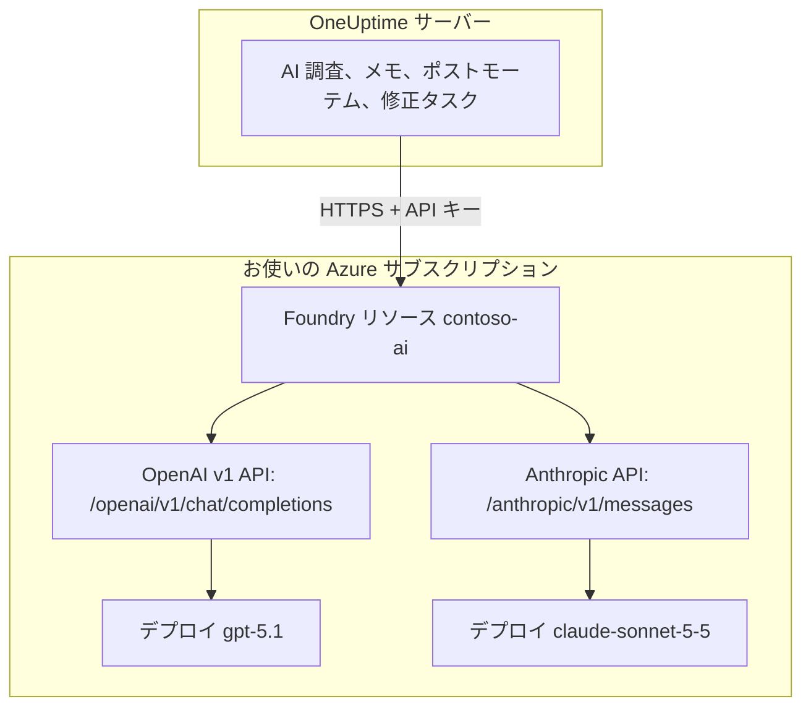

# Microsoft Foundry と Azure OpenAI

OneUptime の AI 機能を、Microsoft Foundry（旧称 Azure AI Foundry）または Azure OpenAI にデプロイしたモデルで動かします。OneUptime は各リクエストをお使いの Azure サブスクリプション内のリソースへ直接送るため、プロンプトと応答は、選んだ場所で、選んだデプロイによって処理されます。このページでは、空のサブスクリプションから動作するプロバイダーまでを順に説明します。Azure リソース、モデルのデプロイ、エンドポイントとキー、OneUptime の設定、ネットワーク、そしてリクエストが失敗したときの対処です。

:::cards
- [Azure を準備する](#microsoft-foundry-を準備する): リソースを作成し、モデルをデプロイして、エンドポイントとキーをコピーします。
- [OneUptime を接続する](#oneuptime-を接続する): プロジェクト設定の 4 つの項目を入力し、テストボタンを押します。
- [セルフホスト](#環境変数でセルフホストのインスタンスを構成する): 環境変数から、すべてのプロジェクト向けのプロバイダーを 1 つ登録します。
- [トラブルシューティング](#トラブルシューティング): 401、403、見つからないデプロイ、api-version。
:::

## 仕組み

OneUptime は、利用者のブラウザーからではなく、OneUptime サーバーから HTTPS で Foundry リソースを呼び出します。各リクエストにはリソースの API キーの 1 つが含まれ、応答するデプロイの名前が指定されます。



1 つのプロバイダーの種類 **Azure OpenAI / Microsoft Foundry** で、リソース上のすべてのデプロイを扱えます。どの API を呼ぶかは、ベース URL で OneUptime に伝えます。

| デプロイするモデル | OneUptime が呼ぶ API | ベース URL |
| --- | --- | --- |
| GPT-5.1 や GPT-4.1 などの OpenAI モデル | OpenAI v1 chat completions | `https://contoso-ai.openai.azure.com/openai/v1` |
| DeepSeek や Grok など、chat completions に対応した Foundry Models | OpenAI v1 chat completions | `https://contoso-ai.services.ai.azure.com/openai/v1` |
| Claude | Anthropic Messages | `https://contoso-ai.services.ai.azure.com/anthropic` |

> [!IMPORTANT]
> OneUptime の AI 機能はツールを呼び出します。作業中にモニター、インシデント、テレメトリーを照会するためです。ツール呼び出し（function calling）に対応したモデルをデプロイしてください。プロバイダーの **テスト** ボタンで確認できます。

## 始める前に

Azure サブスクリプション、リソースを作成して読み取れるロール、そして LLM プロバイダーを追加できる OneUptime のロールが必要です。

| 目的 | Azure で必要なもの |
| --- | --- |
| リソースを作成する | リソース グループに対する **Owner** または **Contributor**、あるいは **Foundry Account Owner** |
| モデルをデプロイする | リソース グループに対する **Owner** または **Contributor**、あるいはリソースに対する **Foundry Owner** または **Foundry Account Owner**。Claude には、Azure Marketplace のオファーをサブスクライブする権限も必要です |
| リソースのキーを読み取る | `Microsoft.CognitiveServices/accounts/listKeys/action` を持つロール。たとえば **Owner**、**Contributor**、**Cognitive Services Contributor** |

OneUptime 自体には Azure のロールは不要です。キーはそれだけで、ロールの確認なしにリソース上のすべてのデプロイへアクセスできるため、パスワードと同じように扱ってください。

OneUptime でプロジェクトにプロバイダーを追加するには、**Project Owner**、**Project Admin**、**Project Member**、**Settings Admin**、**Settings Member**、**Create LLM** のいずれかが必要です。セルフホストのインスタンスでは代わりに、環境変数からすべてのプロジェクト向けのプロバイダーを 1 つ登録できます。これにはサーバーへのアクセスが必要です。

## Microsoft Foundry を準備する

:::steps
### リソースを作成する

[Foundry ポータル](https://ai.azure.com)で Foundry リソースを作成するか、既存のものを選びます。Azure OpenAI リソースでも同じように使えます。リソースの名前を控えておきます。これはエンドポイントの先頭部分で、`https://contoso-ai.openai.azure.com` の `contoso-ai` にあたります。

使いたいモデルを提供しているリージョンを選びます。リソースのネットワーク アクセスは、ひとまずすべてのネットワークに開いたままにしておきます。いつ、どう閉じるかは [ネットワーク要件](#ネットワーク要件) で説明します。

### モデルをデプロイする

Foundry ポータルで **Discover**、続いて **Models** を選び、モデルを選びます。たとえば `gpt-5.1` や `claude-sonnet-5-5` です。**Deploy**、続いて **Custom settings** を選びます。

- **Deployment name**: Foundry がモデル名を入れます。OneUptime はこの名前でデプロイを呼び出すので、正確に控えておきます。
- **Deployment type**: プロンプトをどこで処理するかを決めます。[データが処理される場所](#データが処理される場所) を参照してください。

**Deploy** を選び、デプロイの状態が **Succeeded** になるまで待ちます。

### エンドポイントとキーをコピーする

[Azure portal](https://portal.azure.com) でリソースを開き、**Resource Management** > **Keys and Endpoint** に進みます。**Endpoint** と **KEY 1** をコピーします。**KEY 2** はローテーション用に残しておきます。OneUptime を KEY 2 に切り替えてから **KEY 1** を再生成します。

Foundry ポータルでは、同じキーがデプロイの **Details** タブにあり、**Target URI** の隣に表示されます。
:::

:::details コマンド ラインを使いたい場合
同じ手順を Azure CLI で行います。`--model-version` には、モデル カタログがそのモデルについて示すバージョンを指定します。

```bash
az cognitiveservices account create \
  --name contoso-ai --resource-group oneuptime-ai \
  --kind AIServices --sku S0 --location eastus2 \
  --custom-domain contoso-ai

az cognitiveservices account deployment create \
  --name contoso-ai --resource-group oneuptime-ai \
  --deployment-name gpt-5.1 \
  --model-name gpt-5.1 --model-version <version> --model-format OpenAI \
  --sku-name GlobalStandard --sku-capacity 50

# KEY 1
az cognitiveservices account keys list \
  --name contoso-ai --resource-group oneuptime-ai \
  --query key1 --output tsv
```

`--custom-domain contoso-ai` を指定した場合、リソースのエンドポイントは `https://contoso-ai.openai.azure.com` です。
:::

## OneUptime を接続する

:::steps
### LLM プロバイダーを開く

**プロジェクト設定** > **AI** > **LLM プロバイダー** に移動し、**LLM プロバイダーを作成** をクリックします。

### プロバイダーに名前を付ける

**基本情報** で **名前**（例: `Azure gpt-5.1`）を入力し、必要なら **説明** も入力します。**次へ** をクリックします。

### プロバイダー設定を入力する

| 項目 | 入力する値 |
| --- | --- |
| **LLM プロバイダー** | **Azure OpenAI / Microsoft Foundry** |
| **API キー** | リソースの **KEY 1** または **KEY 2** |
| **モデル名** | Foundry に表示されるとおりのデプロイ名（例: `gpt-5.1`） |
| **ベース URL** | リソースのエンドポイントに `/openai/v1` を付けたもの（例: `https://contoso-ai.openai.azure.com/openai/v1`）。Claude の場合: `https://contoso-ai.services.ai.azure.com/anthropic` |

**その他の項目** にある **デフォルトに設定** はオンになっています。AI 機能はプロジェクトのデフォルト プロバイダーを使います。**LLM プロバイダーを作成** をクリックします。

### 接続をテストする

プロバイダーの行で **テスト** をクリックします。正しく動作するプロバイダーは "Connection successful. The LLM provider responded to a test prompt and used tool calling." と応答します。テストが失敗した場合は、Azure が何と応答したか、何を変えればよいかがメッセージに表示されます。[トラブルシューティング](#トラブルシューティング) を参照してください。
:::

完成したプロバイダーの例:

```text
名前: Azure gpt-5.1
LLM プロバイダー: Azure OpenAI / Microsoft Foundry
API キー: <contoso-ai の KEY 1>
モデル名: gpt-5.1
ベース URL: https://contoso-ai.openai.azure.com/openai/v1
```

これ以降、プロジェクトの AI 機能はこのデプロイを使います。OneUptime Cloud では、これらのリクエストはプロジェクトの AI クレジットからは支払われず、Azure からお使いのサブスクリプションに請求されます。

## ベース URL の形式

OneUptime は、Azure portal と Foundry ポータルが表示する形式のエンドポイントを受け付け、各リクエストを右側のアドレスに送ります。ベース URL は 100 文字までなので、短い形式を選んでください。

| ベース URL | リクエストの送信先 |
| --- | --- |
| `https://contoso-ai.openai.azure.com` | `https://contoso-ai.openai.azure.com/openai/v1/chat/completions` |
| `https://contoso-ai.openai.azure.com/openai/v1` | `https://contoso-ai.openai.azure.com/openai/v1/chat/completions` |
| `https://contoso-ai.services.ai.azure.com/openai/v1` | `https://contoso-ai.services.ai.azure.com/openai/v1/chat/completions` |
| `https://contoso-ai.openai.azure.com/openai/deployments/gpt-4o` | `https://contoso-ai.openai.azure.com/openai/deployments/gpt-4o/chat/completions?api-version=2024-10-21` |
| `https://contoso-ai.services.ai.azure.com/anthropic` | `https://contoso-ai.services.ai.azure.com/anthropic/v1/messages` |

- **v1 API**（`/openai/v1`）は Microsoft の現行の API です。`api-version` は不要で、デプロイ名をモデルとして受け取り、OpenAI モデルにも他の Foundry Models にも同じように応答します。新しいプロバイダーではこちらを使ってください。
- **デプロイの URL**（`/openai/deployments/<name>`）はそれ自体がデプロイを指定し、Azure は **モデル名** ではなくこの名前に従います。ベース URL に独自の `api-version` がなければ、OneUptime は `api-version=2024-10-21` を付けます。この形式で保存したプロバイダーは、これまでどおり動作します。
- **デプロイの Target URI** を Foundry ポータルからそのまま貼り付けても、100 文字に収まれば動作します。
- **Claude**: Foundry は Claude を、リソースの `/anthropic` パスにある Anthropic Messages API からのみ提供します。OneUptime は同じキーでこれを呼び出します。プロバイダーの種類 **Anthropic** でも、同じベース URL で到達できます。

## 環境変数でセルフホストのインスタンスを構成する

セルフホストのインスタンスでは、`GLOBAL_LLM_PROVIDER_*` 変数が起動時にグローバル LLM プロバイダーを 1 つ登録し、自前のプロバイダーを持たないすべてのプロジェクトがそれを使います。AI 修正タスクも同様です。プロジェクト自身のプロバイダーが常に優先されます。

```bash
GLOBAL_LLM_PROVIDER_TYPE=AzureOpenAI
GLOBAL_LLM_PROVIDER_NAME=Azure gpt-5.1
GLOBAL_LLM_PROVIDER_BASE_URL=https://contoso-ai.openai.azure.com/openai/v1
GLOBAL_LLM_PROVIDER_MODEL_NAME=gpt-5.1
GLOBAL_LLM_PROVIDER_API_KEY=<KEY 1 of contoso-ai>
```

:::tabs
@tab Docker Compose
変数を `config.env` に追加し、起動したときと同じ方法で OneUptime を起動し直します。

```bash
(export $(grep -v '^#' config.env | xargs) && docker compose up --remove-orphans -d)
```
@tab Kubernetes
キーは Secret に保管し、チャート全体の `extraEnv` で変数を渡します。

```bash
kubectl create secret generic azure-foundry \
  --namespace oneuptime --from-literal=api-key='<KEY 1 of contoso-ai>'
```

```yaml title="values.yaml"
extraEnv:
  - name: GLOBAL_LLM_PROVIDER_TYPE
    value: AzureOpenAI
  - name: GLOBAL_LLM_PROVIDER_NAME
    value: Azure gpt-5.1
  - name: GLOBAL_LLM_PROVIDER_BASE_URL
    value: https://contoso-ai.openai.azure.com/openai/v1
  - name: GLOBAL_LLM_PROVIDER_MODEL_NAME
    value: gpt-5.1
  - name: GLOBAL_LLM_PROVIDER_API_KEY
    valueFrom:
      secretKeyRef:
        name: azure-foundry
        key: api-key
```

その後、これらの値で `helm upgrade` を実行します。
:::

プロバイダーは変数に従います。変数を変えると次回の起動時に更新され、`GLOBAL_LLM_PROVIDER_TYPE` を外すと削除されます。この種類でキーやベース URL が足りない場合は、起動ログにその旨が出ます。すべての変数とプロバイダーの種類は [LLM プロバイダー](/docs/ai/llm-provider) を参照してください。

## ネットワーク要件

OneUptime サーバーは、リソースのホスト名（`contoso-ai.openai.azure.com` や `contoso-ai.services.ai.azure.com` など）に対して、ポート 443 で HTTPS 接続を開きます。この送信トラフィックをファイアウォールやプロキシで許可してください。

- **OneUptime Cloud** はインターネット経由でリソースに接続するため、リソースはパブリック トラフィックを受け付ける必要があります。リソースをインターネットから切り離したい場合は、OneUptime をセルフホストしてください。
- **セルフホスト、プライベート エンドポイント**: OneUptime サーバーから到達できる仮想ネットワークにプライベート エンドポイントを置いてリソースをその背後に配置し、プライベート DNS ゾーン `privatelink.openai.azure.com`、`privatelink.services.ai.azure.com`、`privatelink.cognitiveservices.azure.com` をそのネットワークにリンクします。これにより、リソースの通常のホスト名がプライベート アドレスに解決されます。ベース URL は変わりません。
- **プライベート アドレス**: セルフホストのインスタンスは、`DATA_SOURCE_BLOCK_PRIVATE_ADDRESSES=true` が設定されていない限り、プライベート アドレスに接続します。グローバル LLM プロバイダーはどちらの場合も接続します。
- **リソースのネットワーク規則**: リソースの **Networking** で **Selected networks and private endpoints** を選ぶと、それ以外はすべて遮断されます。規則で拒否されたリクエストは 403 で失敗します。

## データが処理される場所

モデルをデプロイするときに選ぶデプロイの種類によって、OneUptime のプロンプトとモデルの応答を Azure がどこで処理するかが決まります。保存されたデータは、リソースの Azure 地域内にとどまります。

| デプロイの種類 | プロンプトと応答が処理される場所 |
| --- | --- |
| Global Standard, Global Provisioned | 任意の Azure リージョン |
| Data Zone Standard, Data Zone Provisioned | データ ゾーン内のみ: 米国、欧州連合、またはアジア太平洋 |
| Standard, Regional Provisioned | リソースの Azure 地域内 |

Claude のデプロイは **Hosted on Azure** と **Hosted on Anthropic** のどちらかです。プロンプトと応答を Azure 内にとどめるには **Hosted on Azure** を選んでください。詳しくは Microsoft の [デプロイの種類](https://learn.microsoft.com/en-us/azure/foundry/foundry-models/concepts/deployment-types) を参照してください。

## リクエストと応答の例

OneUptime の外でデプロイを確認するには、OneUptime が送るのと同じリクエストを `curl` で送ります。

:::tabs
@tab OpenAI v1 API
```bash
curl https://contoso-ai.openai.azure.com/openai/v1/chat/completions \
  -H "Content-Type: application/json" \
  -H "api-key: $AZURE_API_KEY" \
  -d '{
    "model": "gpt-5.1",
    "messages": [
      { "role": "user", "content": "Reply with the word: OK" }
    ]
  }'
```

応答（一部省略）:

```json
{
  "id": "chatcmpl-7R1nGnsXO8n4oi9UPz2f3UHdgAYMn",
  "object": "chat.completion",
  "model": "gpt-5.1",
  "choices": [
    {
      "index": 0,
      "finish_reason": "stop",
      "message": { "role": "assistant", "content": "OK" }
    }
  ],
  "usage": { "prompt_tokens": 12, "completion_tokens": 2, "total_tokens": 14 }
}
```
@tab Anthropic API
```bash
curl https://contoso-ai.services.ai.azure.com/anthropic/v1/messages \
  -H "Content-Type: application/json" \
  -H "x-api-key: $AZURE_API_KEY" \
  -H "anthropic-version: 2023-06-01" \
  -d '{
    "model": "claude-sonnet-5-5",
    "max_tokens": 1024,
    "messages": [
      { "role": "user", "content": "Reply with the word: OK" }
    ]
  }'
```

応答（一部省略）:

```json
{
  "id": "msg_01XFDUDYJgAACzvnptvVoYEL",
  "type": "message",
  "role": "assistant",
  "model": "claude-sonnet-5-5",
  "content": [{ "type": "text", "text": "OK" }],
  "stop_reason": "end_turn",
  "usage": { "input_tokens": 14, "output_tokens": 4 }
}
```
:::

OneUptime 自身のリクエストには、さらに多くの内容が含まれます。OneUptime の指示、会話、モデルが呼び出せるツール、トークンの上限です。応答からは、テキスト、ツール呼び出し、モデルが停止した理由、トークンの使用量を読み取ります。使用量は **プロジェクト設定** > **AI** > **AI ログ** にリクエストごとに表示されます。プロバイダーの **追加パラメーター** は、各リクエストに追加されます。

## Microsoft Entra ID とキーを使わないリソース

OneUptime は、リソースの API キーの 1 つでリソースにサインインします。サービス プリンシパルやマネージド ID として Microsoft Entra ID でサインインする方法には、まだ対応していません。

組織が AI リソースのキー アクセスを無効にしている場合（`disableLocalAuth`）、リクエストは `AuthenticationTypeDisabled` で失敗します。OneUptime が使うリソースでキー アクセスを許可するか、リソースの前段に Azure API Management を置いてください。

1. リソースのデプロイを、Azure OpenAI API として API Management にインポートします。API Management は自身のマネージド ID でリソースにサインインするようになります。
2. API のサブスクリプション キーのヘッダー名を `api-key` に設定します。
3. OneUptime で、**ベース URL** にデプロイ用の API Management 上の API のアドレス（例: `https://contoso-apim.azure-api.net/aoai/openai/deployments/gpt-5.1`）を、ほかのデプロイ URL と同じく、デプロイに必要な `api-version` とともに設定します。**API キー** には API Management のサブスクリプション キーを設定します。

Microsoft Entra ID しか受け付けない Claude のモデル（Claude Mythos など）は、まだ使えません。

## トラブルシューティング

OneUptime はエラーの先頭に変えるべき点を示し、その後に Azure 自身の応答を続けます。**テスト** ボタンはエラー全体を表示し、**AI ログ** は先頭の 490 文字を保存します。

:::details "Azure did not accept the API key" (401)
キーが間違っているか、再生成されたか、別のリソースのものです。ベース URL が指すリソースの **Keys and Endpoint** から **KEY 1** をコピーし直し、**API キー** に貼り付けてください。
:::

:::details "Key-based authentication is turned off for this resource" (403)
Azure は `AuthenticationTypeDisabled` と応答しました。このリソースは Microsoft Entra ID しか受け付けません。[Microsoft Entra ID とキーを使わないリソース](#microsoft-entra-id-とキーを使わないリソース) を参照してください。
:::

:::details "Azure refused the request" (403)
リソースのネットワーク規則がリクエストを遮断しました。リソースの **Networking** 設定を [ネットワーク要件](#ネットワーク要件) と照らし合わせてください。
:::

:::details "This resource has no deployment named ..." (404)
Azure は `DeploymentNotFound` と応答しました。**モデル名** を、Foundry ポータルに表示されるとおりのデプロイ名にしてください。数分以内に作成したデプロイは、まだ準備ができていないことがあります。ベース URL がデプロイの URL の場合は、`/openai/deployments/` の後ろの名前を確認してください。
:::

:::details "Azure found nothing at this address" (404)
ベース URL が Azure OpenAI の API につながっていません。`https://contoso-ai.openai.azure.com/openai/v1` のように、リソースのエンドポイントに `/openai/v1` を付けたものを使ってください。提供終了した Azure AI Inference SDK のモデル推論エンドポイント（`/models`）はこれにあたりません。同じリソースの `/openai/v1` を使ってください。
:::

:::details "This model needs api-version ... or later" (400)
デプロイの URL は、別のバージョンを指定しない限り `api-version=2024-10-21` を要求し、o シリーズや GPT-5 などの新しいモデルはそのような古いバージョンを拒否します。ベース URL を v1 API の `https://contoso-ai.openai.azure.com/openai/v1` に切り替え、デプロイ名を **モデル名** に入れてください。または、Azure が示すバージョン（例: `?api-version=2024-12-01-preview`）をベース URL に追加してください。
:::

:::details "Azure's v1 API takes no dated api-version" (400)
ベース URL が `/openai/v1` で終わっているうえに、日付付きの `api-version` も含んでいます。ベース URL から `api-version` を削除してください。
:::

:::details "ベース URL は 100 文字以内で入力してください。"
`api-version` 付きの Target URI は、たいていそれより長くなります。リソースのエンドポイントに `/openai/v1` を付けたものを使い、デプロイ名を **モデル名** に入れてください。
:::

:::details "...could not be reached" または "...host name could not be resolved"
OneUptime サーバーがリソースに接続できませんでした。OneUptime Cloud では、リソースにインターネットから到達できる必要があります。セルフホストのインスタンスでは、サーバーがリソースのホスト名を解決できること（プライベート エンドポイントの場合はプライベート DNS ゾーン経由）と、送信 HTTPS が許可されていることを確認してください。
:::

:::details リクエストが多すぎます (429)
デプロイの 1 分あたりのトークン クォータを使い切りました。AI 機能は待ってから再試行し、約 5 分のうちに最大 10 回試してから失敗を報告します。**テスト** ボタンはもっと早くあきらめます。Foundry ポータルでデプロイのクォータを引き上げるか、別のデプロイの種類に移してください。
:::

## 次のステップ

:::cards
- [LLM プロバイダー](/docs/ai/llm-provider): すべてのプロバイダーの種類と、プロジェクトがどれを使うか。
- [AI SRE](/docs/ai/ai-sre): このプロバイダーで動く調査。
- [Ask AI](/docs/ai/ask-ai): システムについての質問に、ダッシュボードで回答します。
:::
