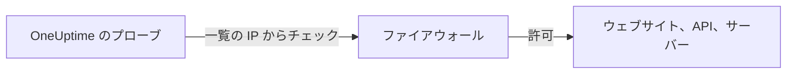

# IP アドレス

OneUptime Cloud のプローブは、固定された IP アドレスのセットから、ウェブサイト、API、サーバーをチェックします。監視対象の前にファイアウォールや許可リストがある場合は、チェックが届くようにこれらのアドレスを許可してください。



## 許可する IP アドレス

ファイアウォールで、次のアドレスからのトラフィックを許可してください。

{{IP_WHITELIST}}

> [!NOTE]
> これらのアドレスは変わることがあります。変わるときは、OneUptime から事前にお知らせします。お知らせを追いかけなくても最新の状態を保てるように、ファイアウォールを更新するたびに [リストを取得](#リストをプログラムで取得する) してください。

## リストをプログラムで取得する

同じリストが JSON で提供されており、API キーは不要です。スクリプトでファイアウォールのルールを最新に保てます。

```bash
curl -s https://oneuptime.com/ip-whitelist
```

```json
{
  "ipWhitelist": ["<list of IPs>"]
}
```

`ipWhitelist` は、要素ごとに 1 つのアドレスを持つ配列です。たとえばファイアウォールのスクリプトに渡すために、1 行に 1 つのアドレスを出力するには次のようにします。

```bash
curl -s https://oneuptime.com/ip-whitelist | jq -r '.ipWhitelist[]'
```

## セルフホストの OneUptime

自分のインスタンスでは、このページと `/ip-whitelist` エンドポイントに、インスタンスの `IP_WHITELIST` 設定（カンマ区切りのリスト）にあるアドレスが表示されます。自分のプローブがチェックを送信するアドレスを指定してください。

:::tabs
@tab Kubernetes
Helm チャートの `ipWhitelist` の値を設定します。

```yaml title="values.yaml"
ipWhitelist: "203.0.113.1,203.0.113.2"
```
@tab Docker Compose
`config.env` はこの設定をアプリに渡しません。`docker-compose.yml` と同じ場所にある `docker-compose.override.yml` で、`app` サービスの環境変数に追加し、OneUptime を再起動してください。

```yaml title="docker-compose.override.yml"
services:
  app:
    environment:
      IP_WHITELIST: "203.0.113.1,203.0.113.2"
```
:::

何も設定されていない場合、このページには **No IP addresses configured.** と表示され、エンドポイントは空の `ipWhitelist` 配列を返します。

## 次のステップ

:::cards
- [カスタム プローブ](/docs/probe/custom-probe): ファイアウォールを開ける代わりに、自分のネットワーク内でプローブを動かす。
- [モニターの作成](/docs/monitor/create-monitor): ウェブサイト、API、サーバーのチェックを始める。
:::
