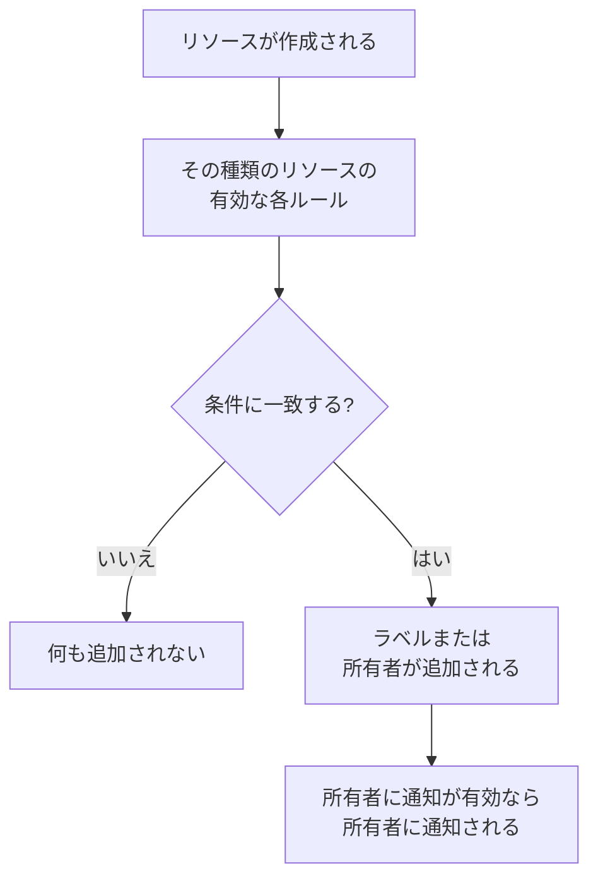

# ラベルルールと所有者ルール

ラベルルールと所有者ルールは、リソースを自動で整理します。**ラベルルール** は一致した新しいリソースすべてにラベルを付け、**所有者ルール** はそのリソースにユーザーやチームを所有者として追加します。たとえば、データベースの新しいインシデントに _Database_ のラベルを付け、データベースチームを所有者にする作業を、誰かが覚えておく必要はありません。

:::cards
- [ルールを作成する](#ルールを作成する): 2 つのステップ: ルールが何に一致するかを決め、次に何を追加するかを決めます。
- [ラベルと所有者を継承する](#ラベルと所有者を継承する): イベントのモニター、ホスト、サービスが持つものを引き継ぎます。
- [ルールが実行されるタイミング](#ルールが実行されるタイミング): 新しいリソースに対して実行され、既存のリソースには **今すぐ実行** を使います。
:::

## 仕組み

ルールはリソースが作成されたときに実行されます。有効な各ルールが新しいリソースに対して条件を確認し、一致したルールはそれぞれ自分が追加するものを追加します。

ラベルと所有者は、リソースの絞り込みやグループ化に使われ、OneUptime が誰に通知するか、そして [ラベルで制限された権限や自分が所有するリソースに限った権限](/docs/permissions/index) がどこまで届くかを決めます。ルールを使えば、誰かが覚えておかなくてもそれらを一貫した状態に保てます。

## ルールの場所

ラベルと所有者がある製品には、どちらのルールも **設定** の下にあります (インシデント、アラート、定期メンテナンスでは **ルール** の下)。対象は、モニター、インシデントとインシデントのエピソード、アラートとアラートのエピソード、定期メンテナンスイベント、ステータスページ、サービス、ホスト、Kubernetes クラスター、Docker ホスト、Docker Swarm クラスター、Podman ホスト、Proxmox クラスター、VMware vCenter、Ceph クラスター、ストレージアレイ、データベース、キュー、IoT フリート、サーバーレス関数、クラウドリソース、RUM アプリケーション、ダッシュボード、オンコールポリシー、オンコールスケジュール、着信通話ポリシー、ワークフロー、Runbook、ネットワークデバイス、SLO です。

たとえば、モニターのラベルルールは **モニター → 設定 → ラベルルール**、インシデントのラベルルールは **インシデント → ルール → ラベルルール** にあります。**設定** と **ルール** はサイドメニューで最初は折りたたまれています。セクションのタイトルをクリックすると開きます。インシデントとアラートのページには、**インシデントルール** (または **アラートルール**) タブと **エピソードのルール** タブがあります。

## ルールを作成する

ラベルルールと所有者ルールは、どれも同じ方法で 2 つのステップで作成します。

:::steps
### ルールの一覧を開く

製品の **ラベルルール** または **所有者ルール** のページを開き、ルールの名前が付いた作成ボタンをクリックします。たとえば **モニターのラベルルールを作成** です。

### ルールが何に一致するかを選ぶ

**一致** ステップで、リソースが満たすべき条件ごとに **条件を追加** をクリックします。条件が 2 つ以上ある場合は、**すべてに一致** または **いずれかに一致** を選びます。条件のないルールは、すべての新しいリソースに一致します。

### ルールが何を追加するかを選ぶ

**ラベル** ステップで **追加するラベル** を選びます。所有者ルールではこのステップは **所有者** で、**所有者を追加** を押すと人とチームの一覧が 1 つ開きます。

**名前** は選んだ内容から自動で入力され (*Production を追加*、*Platform を所有者として追加*)、自分で名前を入力するまで選択に合わせて変わります。継承だけを行うルールは、代わりに継承元にちなんだ名前になります (下記を参照)。

### 折りたたまれた項目を確認する

**その他の項目** には、任意の **説明** と、所有者ルールでは **所有者に通知** があります。これは既定でオンです。ルールが追加した所有者にも、手動で追加された所有者と同じ「所有者として追加されました」という通知が届きます。通知せずに所有者を追加するには、オフにします。

### ルールを保存する

最後のステップで、ルールの名前が付いたボタン (たとえば **モニターのラベルルールを作成**) をもう一度クリックします。ルールは有効な状態で作成され、一覧には緑色の **有効** ピルとともに表示されます。
:::

新しいルールは、何かを追加しなければなりません。少なくとも 1 つのラベル (または所有者) か、インシデント、アラート、定期メンテナンスのルールであれば継承するもの (下記を参照) が必要です。削除せずにルールを一時停止するには、編集フォームで **有効** をオフにします。一覧には赤い **無効** ピルが表示されます。

### どの方法でルールを作成しても

API、Terraform、ワークフロー、または [ラベルルールのインポート](/docs/configuration/label-rule-import-export) で作成したルールにも同じことが当てはまります。OneUptime は何も追加しない新しいルールを拒否し、入力すべき項目を示すメッセージを返します。これらのメッセージは、どの言語でも英語で表示されます。

| ルール | メッセージ |
| --- | --- |
| ラベルルール | This label rule adds nothing. Choose at least one label in Labels to Add. |
| インシデント、アラート、定期メンテナンスのラベルルール | This label rule adds nothing. Choose at least one label in Labels to Add, or turn on an Inherit Labels switch. |
| 所有者ルール | This owner rule adds nothing. Choose at least one user or team in Owner Users or Owner Teams. |
| インシデント、アラート、定期メンテナンスの所有者ルール | This owner rule adds nothing. Choose at least one user or team in Owner Users or Owner Teams, or turn on an Inherit Owners switch. |

- **API**: `labelsToAdd` (または `ownerUsers` / `ownerTeams`) にプロジェクトのレコードを 1 つ以上設定するか、ルールの `inheritLabelsFrom…` (`inheritOwnersFrom…`) スイッチのいずれかを `true` (JSON のブール値) にします。
- **Terraform**: 追加するもののないラベルルールまたは所有者ルールのリソースは、上記のメッセージとともに `terraform apply` で失敗します。`labels_to_add` (または `owner_users` / `owner_teams`) を指定するか、継承スイッチのいずれかをオンにしてください。

既存のルールは変更されません。[ルールを編集する](#ルールを編集する) を参照してください。

## ラベルと所有者を継承する

インシデント、アラート、定期メンテナンスのルールは、イベントが影響するリソースが持つものを引き継ぐこともできます。**追加するラベル** (または **所有者**) の下にある折りたたまれた **ラベルを継承** (または **所有者を継承**) セクションには、6 つのスイッチがあります。

- **モニターからラベルを継承**: インシデントのモニターのラベルがすべてインシデントにも付きます。アラートのモニターは 1 つなので、アラートのルールではスイッチ名が **モニターからラベルを継承** になります (アラートの所有者ルールでは **モニターから所有者を継承**)。
- **ホストからラベルを継承**、**Kubernetes クラスターからラベルを継承**、**Docker ホストからラベルを継承**、**Podman ホストからラベルを継承**、**サービスからラベルを継承** は、それぞれのリソースについて同じことを行います。

所有者ルールにも、所有者用に同じ 6 つのスイッチがあります (**モニターから所有者を継承** など)。どのスイッチもオンでない間は、折りたたまれたセクションがその用途を説明します。継承するルールでは、セクションは自動で開きます。エピソードのルールには継承スイッチはありません。

継承するルールは、**追加するラベル** (または **所有者**) を空のままにできます。その場合は継承したものを追加します。そのようなルールは継承元にちなんだ名前になります。

| オンのスイッチ | 名前 |
| --- | --- |
| **モニターからラベルを継承** | *モニター からラベルを継承* |
| **モニターからラベルを継承** と **ホストからラベルを継承** | *モニター, ホスト からラベルを継承* |
| アラートのルールでの **モニターからラベルを継承** | *モニター からラベルを継承* |

名前は、ラベルを選ぶまで (その後はラベルにちなんだ名前になります)、または自分で名前を入力するまで、スイッチに合わせて変わります。

## ルールを編集する

ルールの編集フォームには同じ 2 つのステップがあり、**有効** スイッチが加わります。編集フォームは、ルールが何を追加するかを必須にしません。OneUptime がそれを求める前に (API、Terraform、インポート、または以前のフォームで) 保存されたルールは何も追加しない場合があり、編集でルールが追加するものをすべて外すこともできます。

そのようなルールも、名前の変更、無効化、削除ができます。API や Terraform からも可能です。一覧では、何も追加しないルールのステータスの横に **何も追加しない** と表示され、ルール自身のページでも同様です。編集して追加するものを選ぶか、削除してください。

## ルールが実行されるタイミング

有効なルールはすべて、ダッシュボードからでも API からでも、リソースが作成されたときに実行され、一致したルールはそれぞれ自分が追加するものを追加します。

- 複数のルールが一致した場合は、すべてのラベルと所有者が追加されます。
- ルールは何も削除しません。誰かが手動で追加したラベルや所有者も、ルール自身が追加したものも削除しません。
- 無効なルールは何もしません。

今日作成したルールは、その後に作成されたリソースに適用されます。既存のリソースに適用するには **今すぐ実行** を使います。[既存のリソースに対してルールを実行する](/docs/configuration/run-rules-now) を参照してください。ラベルルールはプロジェクト間でコピーすることもできます。[ラベルルールのインポートとエクスポート](/docs/configuration/label-rule-import-export) を参照してください。

## 次のステップ

:::cards
- [既存のリソースに対してルールを実行する](/docs/configuration/run-rules-now): すでにあるリソースにルールを適用します。
- [ラベルルールのインポートとエクスポート](/docs/configuration/label-rule-import-export): ラベルルールを JSON でプロジェクト間にコピーします。
- [インシデントの設定と自動化](/docs/incidents/settings): インシデントが実行できるその他のルール。
- [SLO のラベルルールと所有者ルール](/docs/slo/label-and-owner-rules): SLO のルールが何に一致するか。
:::
