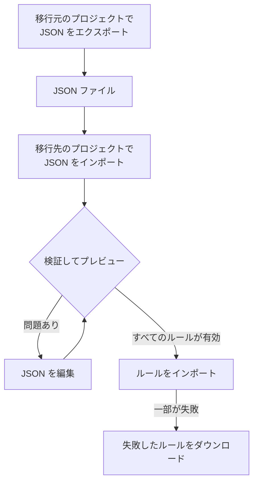

# ラベルルールのインポートとエクスポート

ラベルルールを JSON ファイルとしてプロジェクト間でコピーしたり、まとめて作成したりできます。インシデント、アラート、モニター、ネットワークデバイスを含め、すべての **ラベルルール** ページの **その他のオプション** (**⋯**) メニューに **JSON をエクスポート** と **JSON をインポート** があります。唯一の例外は VMware で、vCenter のラベルルールにはどちらもありません。



## ルールをエクスポートする

**その他のオプション** を開いて **JSON をエクスポート** を選ぶと、現在のプロジェクトにあるその種類のルールがすべてダウンロードされます。エクスポートにはテーブルの他のページにあるルールも含まれ、テーブルのフィルターは無視されます。

ファイルには、各ルールの有効状態、条件、追加するラベル、ラベル継承のオプションが保存されます。プロジェクト ID、ルール ID、監査用の項目は含まれません。

リンクされたラベル、モニター、重大度は正確な名前で書き出されます。インポートではこれらは作成されないため、移行先のプロジェクトにあらかじめ存在している必要があります。

## ルールをインポートする

:::steps
### JSON をインポートを開く

移行先プロジェクトの **ラベルルール** ページを開き、**その他のオプション → JSON をインポート** を選びます。

### ファイルを追加する

JSON のエクスポートファイルをアップロードするか、その内容を貼り付けます。

### 検証とプレビューを行う

**検証してプレビュー** を選びます。ルールを 1 つでも作成する前にすべてのルールがチェックされ、参照されるリソースは、移行先のプロジェクトに一意で一致する名前で存在している必要があります。

### プレビューを確認する

ルールの名前、状態、ラベル、条件を確認します。大きなバッチは 1 ページずつ表示されます。修正するには **JSON を編集** を選び、もう一度検証します。

### インポートする

ルール数が表示されたインポートボタン (たとえば **2 件のルールをインポート**) を選び、結果が表示されるまでウィンドウを開いたままにします。
:::

インポートは新しいルールを追加し、既存のルールはそのまま残すため、同じファイルをもう一度インポートすると別のコピーが作成されます。各ルールには通常の作成権限とサーバー側の検証が適用されます。

一部のルールが失敗した場合は、**失敗したルールをダウンロード** を選んでそれらの行だけを保存し、修正してから、そのファイルをもう一度インポートします。リクエストがタイムアウトした場合は、再試行する前にルールの一覧を確認してください。応答が失われる前に、サーバーがルールを保存している可能性があります。

## JSON でバッチを作成する

既存のルールをエクスポートしてリソースの種類に合った例を手に入れ、`items` 配列のエントリを編集または追加します。この例では、モニターのラベルルールを 2 つ作成します。ラベル `Production` と `Infrastructure` は、移行先のプロジェクトにあらかじめ存在している必要があります。

```json title="monitor-label-rules.json"
{
  "fileType": "oneuptime-label-rules",
  "schemaVersion": 1,
  "resourceType": "MonitorLabelRule",
  "items": [
    {
      "name": "Production API monitors",
      "description": "Label production API monitors automatically",
      "isEnabled": true,
      "monitorNamePattern": "^api-prod-",
      "monitorLabels": [],
      "labelsToAdd": ["Production"]
    },
    {
      "name": "Database monitors",
      "isEnabled": false,
      "monitorNamePattern": "^database-",
      "labelsToAdd": ["Infrastructure"]
    }
  ]
}
```

| 項目 | 内容 |
| --- | --- |
| `fileType` | 常に `oneuptime-label-rules`。 |
| `schemaVersion` | 常に `1`。 |
| `resourceType` | ファイルに含まれるルールの種類。例: `MonitorLabelRule`。 |
| `items` | ルール。1 つのルールにつき 1 つのオブジェクト。ファイルには少なくとも 1 つ必要です。 |

`isEnabled` には JSON のブール値、パターンにはテキスト、リンクされたリソースには名前の配列を使います。

無効なパターン、不明な項目、名前の欠落、あいまいな参照があると、インポートの手順に進む前にバッチ全体が止まります。何も追加しないルール (`labelsToAdd` が空で、インシデント、アラート、定期メンテナンスのルールでは `inheritLabelsFrom…` スイッチがどれも `true` でないもの) も同様です。OneUptime はそのようなルールの作成を拒否するためです ([ラベルルールと所有者ルール](/docs/configuration/label-and-owner-rules#どの方法でルールを作成しても) を参照)。このチェックより前に保存されたルールであれば、エクスポートにそのようなルールが含まれることがあります。インポートする前に、ラベルを付けるか、ファイルから削除してください。

> [!NOTE]
> ファイルと貼り付けた JSON の上限は 10 MB です。

## リソースの種類をまたいでコピーする

ファイルの元の `resourceType` はそのままにして、移行先のページで **JSON をインポート** を開きます。互換性のある主な名前またはタイトルのパターン、説明のパターン、前提となるラベルは移行先の項目に対応付けられ、プレビューにその対応が一覧表示されるので確認できます。インシデントとアラートの重大度の参照は、移行先の重大度の名前と照合されます。

移行先が対応していない条件やアクションがあると、インポートはブロックされます。たとえば、特定のモニターに限定したインシデントのルールは、その条件を編集しないとネットワークデバイスのルールにはコピーできません。

> [!WARNING]
> ネットワークデバイスと SLO のラベルルールは、正規表現に加えてワイルドカードにも対応しています。これらのルールと他の種類のルールとの間で移す場合、`*` や前後の空白を含むパターンは拒否されます。移行先では一致の仕方が異なるためです。移行先に合わせてパターンを編集するか、同じリソースの種類の中でルールを使ってください。ネットワークデバイスと SLO のラベルルールは一致の仕方が同じなので、互いにどのパターンでもやり取りできます。

## 次のステップ

:::cards
- [ラベルルールと所有者ルール](/docs/configuration/label-and-owner-rules): ラベルルールが何に一致し、何を追加するか。
- [既存のリソースに対してルールを実行する](/docs/configuration/run-rules-now): インポートしたルールを、すでにあるリソースに適用します。
:::
