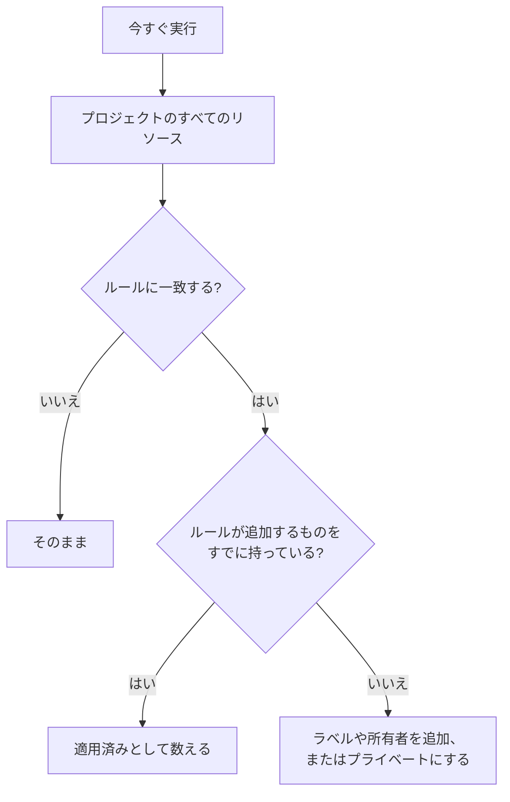

# 既存のリソースに対してルールを実行する

ラベルルール、所有者ルール、プライバシールールは、リソースが **作成** されたときに自動で実行されます。そのため、今日作成したルールは、すでにあるモニター、インシデント、ホストには何もしません。**今すぐ実行** はこのギャップを埋めます。1 つのルールを、プロジェクトにすでに存在するすべてのリソースに適用します。

## 実行できるルール

- **ラベルルール** と **所有者ルール**: これらを持つすべてのリソースが対象です。モニター、インシデント、インシデントのエピソード、アラート、アラートのエピソード、定期メンテナンスイベント、ステータスページ、サービス、ホスト、Kubernetes クラスター、Docker ホスト、Docker Swarm クラスター、Podman ホスト、Proxmox クラスター、VMware vCenter、Ceph クラスター、ストレージアレイ、データベース、キュー、IoT フリート、サーバーレス関数、クラウドリソース、RUM アプリケーション、ダッシュボード、オンコールポリシー、オンコールスケジュール、着信通話ポリシー、ワークフロー、Runbook、ネットワークデバイス、SLO です。
- **プライバシールール**: インシデント、アラート、インシデントのエピソード、アラートのエピソードが対象です。
- ステータスページの **モニタールール**: ルールが保存されるたびにページを再同期しますが、実行すると今すぐ再同期します。
- SLO の **モニタールール**: ルールが保存されるたびに SLO を再同期しますが、実行すると SLO のモニターを今すぐ再同期します。[モニターとモニタールール](/docs/slo/monitor-rules) を参照してください。

リソースを記述するのではなくアクションを行うルール (**オンコールルール**、**Runbook ルール**、**自動修復ルール**、**グループ化ルール**) は、既存のレコードに対しては実行できません。実行すると、すでに終わったインシデントについて人を呼び出したり、Runbook を実行したり、修正を開始したり、エピソードを組み替えたりしてしまうためです。

## 始める前に

ルールを実行するには、ルールを編集する権限 **と**、ルールが変更するリソースを編集する権限の両方が必要です。たとえば、モニターのラベルルールには、モニターのラベルルールの編集権限とモニターの編集権限の両方が必要です。所有者ルールには、所有者を追加する権限も必要です。ステータスページや SLO のモニタールールに必要なのは、ルールを編集する権限だけです。

> [!IMPORTANT]
> 特定のラベルや自分が所有するリソースに限定された権限では足りません。実行はプロジェクトのすべてのリソースを変更する可能性があるためです。チームのブロックリストは他の場面と同じように適用され、一部のラベルに限定したブロックも考慮されます。実行はそのラベルを持つリソースも変更するため、ルールが変更するリソースの編集に対するラベル付きのブロックがあると、実行は拒否されます。

ネットワークのルールも、すでにあるデバイスに対して実行するときに同じものを求めます。サイト割り当てルールまたはデバイスのラベルルールの **今すぐ実行** には、ルールを編集する権限と **Edit Network Device** が必要です。自動インポートルールの **ドライラン** と **ルールを実行** には、ルールを編集する権限、**Create Network Device**、さらにルールにモニターテンプレートがある場合は **Create Monitor** が必要です。いずれもプロジェクト全体に及ぶものでなければなりません。[自動インポートルールによる自動インポート](/docs/monitor/network-device-monitor#importing-automatically-with-auto-import-rules) を参照してください。

## ルールを 1 つ実行する

:::steps
### ルールの一覧を開く

ルールのページを開きます。たとえば **モニター → 設定 → ラベルルール** です。

### 今すぐ実行を選ぶ

ルールの行の末尾にある **⋯** メニューを開いて **今すぐ実行** を選ぶか、**表示** を選んでからルール自身のページで **今すぐ実行** を選びます。実行で何が行われるかがダイアログに表示されます。

### 新しい所有者に通知するかを決める

所有者ルールでは、**この実行で追加される所有者に通知** するかどうかを選びます。既定ではオフで、ルール自体の **所有者に通知** がオンのときだけ有効になります。所有者には、追加されたリソースごとに 1 回通知が届きます。

### ルールを実行する

**ルールを実行** を選び、ダイアログを開いたままにします。大きなプロジェクトでは、実行の進み具合がダイアログに表示されます。

### レポートを読む

実行が終わると、ルールに一致したリソースの数、変更したリソースの数、ルールが追加するものをすでに持っていたリソースの数がダイアログに表示されます。
:::

## 複数のルールを実行する

テーブルでルールを選び、一括操作メニューを開いて **今すぐ実行** を選びます。選んだルールは 1 つずつ順に実行されます。

- 一括実行で追加された所有者には通知されません。通知するには、ルールを 1 つずつ実行してください。
- 実行できないルール (たとえば無効になっているもの) は理由とともに表示され、他のルールはそのまま実行されます。

## 実行で行われること

- **追加するだけです。** ラベルが付き、所有者が追加され、リソースがプライベートになります。何も削除されず、何も公開されないため、ルールをもう一度実行しても安全です。2 回目の実行では、すべて適用済みだったと報告されます。
- **プロジェクトのすべてのリソースが評価されます。** 解決済みのインシデントやアラートも含まれます。
- **既存の所有者はスキップされます。** 2 回追加されることはありません。
- **追加されるのは自分のプロジェクトのラベルだけです。** ルールが指定しているラベルがもうプロジェクトのラベルでない場合はスキップされ、ルールの他のラベルはそのまま追加されます。新しいリソースでルールが実行される場合も同じです。
- **ルールは作成時と同じ方法で適用されます。** インシデントのモニター、ホスト、サービスから継承するラベルや所有者も含まれます。リソースにアクティビティフィードがある場合は、どのルールが変更したかがフィードに記録されます。
- **無効なルールは実行されません。** 先にルールを有効にしてください。
- **ステータスページのモニタールール** は、一致するモニターを追加し、以前に自分が追加したもののもう一致しないモニターを外します。ページに手動で追加したモニターには触れません。
- **1 回の実行で対象になるのは最大 100,000 件のリソースです。** それより大きいプロジェクトでは、実行は止まってその旨を表示します。続けるには、ルールをもう一度実行してください。

## 次のステップ

:::cards
- [ラベルルールと所有者ルール](/docs/configuration/label-and-owner-rules): 実行で適用されるルールを作成します。
- [ラベルルールのインポートとエクスポート](/docs/configuration/label-rule-import-export): 先に別のプロジェクトからラベルルールを取り込みます。
- [インシデントの設定と自動化](/docs/incidents/settings): プライバシールールを含む、インシデントのルール。
:::
