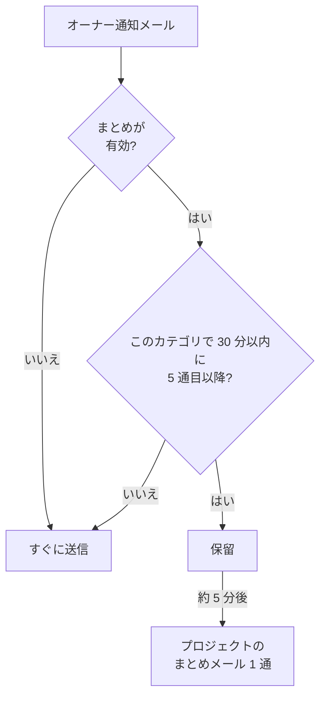

# 通知のまとめ

何かが大きく壊れるとき、壊れるのは一度だけではありません。上流のリンクが不安定になると 40 個のモニターがダウンし、40 件のインシデントが宣言・確認・解決され、オーナー全員がそのたびにメールを受け取ります。1 つの受信トレイに 200 通のメールが届き、もう誰も読まなくなります。

OneUptime は、こうした集中的な通知を自動で 1 通のメールにまとめます。全員に対して有効で、設定は不要です。ただし、通知を 1 件ずつ個別のメールで受け取りたい場合は、プロジェクトごとに[自分だけまとめをオフにする](#自分だけまとめをオフにする)ことができます。

:::cards
- [仕組み](#仕組み): 4 通はすぐに送られ、残りはまとめて届きます。
- [まとめられないもの](#まとめられないもの): オンコールの呼び出し、セキュリティ、請求、購読者へのメール。
- [まとめをオフにする](#自分だけまとめをオフにする): 通知を再び 1 件ずつ個別のメールで受け取ります。
- [定型メールを減らす](#さらにメールを減らす): 情報提供のメールを一度にオフにします。
:::

## 仕組み

受け取るオーナー通知メールは、プロジェクト、受信者、メールアドレス、リソースの**カテゴリ**ごとに管理される小さな上限に対してカウントされます。カテゴリとは、インシデント、アラート、モニター、メンテナンス予定、ステータスページ、プローブ、SLO などです。



- 任意の 30 分間にあるカテゴリで届く**最初の 4 通**は、これまでどおりすぐに送信されます。件名、テンプレート、リンクも同じです。
- その時間内の **5 通目以降**は保留されます。
- 約 5 分後、そのプロジェクトで保留されたものがすべてのカテゴリにわたって **1 通**のメールで届き、何が起きたかを各リソースへのリンク付きで一覧にします。

まとめには、送信時点でまだ購読している通知が含まれます。通知がキューにある間にそのイベントのメールをオフにすると、それらの通知はまとめから除外されます。あとでメールをオンに戻しても、除外された更新は再送されません。

しきい値を下回る間、この機能は何もしません。1 日に 3 通のオーナーメールを送るプロジェクトは、引き続きその 3 通を個別に送ります。

## まとめメールの内容

件名を見れば、開く前に通知の規模*と種類*がわかります。

```text
[Acme Production] 112 notifications: 63 Monitors, 41 Incidents, 6 Alerts +2 more
```

本文の先頭にはサマリーカードがあり、合計件数、まとめの対象期間、カテゴリごとの内訳を示します。その下に通知がカテゴリごとのセクションに分かれて並び、緊急度の高いものから順に、インシデント、アラート、それを検出したモニターとプローブと続きます。サマリーのすぐ下にあるものが、最初にクリックする価値のあるものです。

各セクションは、イベントごとではなくリソースごとに 1 行です。

- **各行はリソースの最終的な状態を示します。** インシデントが作成され、確認され、解決された場合は、最新の状態の 1 行になります。そのため、まとめは 3 通の個別メールより*新しい*情報を示します。
- **件数は一致します。** 各行には最後の更新時刻が表示され、複数の更新をまとめた行にはその件数が表示されるため、各セクションとサマリーカードの合計は常に一致します。
- **重大度と状態が表示されます。** アラートとインシデントのカードには、最新の通知の重大度と状態がカスタム名も含めて表示されます。これらの情報を持たない古いキュー内の通知も表示されますが、取得できないラベルは省略されます。

時刻は UTC で表示され、まとめが複数日にわたる場合は日付も表示されます。


## まとめられないもの

まとめの対象は、オーナーとメンバーへの通知、つまり「担当しているものが変わった」という種類の通知だけです。これらの通知が通る唯一のコード経路の中にあり、ほかの通知はそこを通らないため、それ以外には一切影響しません。

遅延もカウントもされないもの:

| カテゴリ | 例 |
| ----------------------------------------- | ---------------------------------------------------------------------------------------------------- |
| オンコールの呼び出し | エスカレーションポリシーによるすべての呼び出しと、すべての確認依頼 |
| オンコールの時間 | 「現在オンコール中です」「次のオンコール担当です」「シフトがまもなく始まります」「シフトが再割り当てされました」 |
| アカウントのセキュリティ | パスワードのリセット、メールアドレスの確認、パスワードの変更、二要素認証のバックアップコードの使用または再生成 |
| アカウントに関する管理者からの通知 | 管理者が通知方法またはオンコールルールを変更した |
| 請求と残高 | 請求書、サブスクリプションの支払い遅延、「カードが拒否されたため誰も呼び出せませんでした」 |
| インスタンスの状態 | インスタンス管理者への Postgres、Valkey、ClickHouse の警告 |
| ステータスページの購読者 | ステータスページが購読者に送るすべてのメール |
| SLA 違反 | インシデント作成の通知タイプを再利用していても、すぐに送信されます |

影響を受けるのはメールだけです。SMS、電話、プッシュ通知、WhatsApp、Telegram、Slack、Microsoft Teams、Webhook は、メールが保留された通知も含めて、これまでどおりすぐに配信されます。

## 上限

| 上限 | 値 |
| --- | --- |
| 1 通のまとめメールに含まれる通知 | 最大 **500** 件。超えた分はキューに残り、最大 5 分後の次のまとめで送られます。 |
| 1 通のまとめメールに描画される行 | 最大 **100** 行。行はリソースごとにまとめられるため、異なるリソース 100 件分です。それを超えると、メールには合計件数が示され、プロジェクトへのリンクが付きます。 |
| 1 つのプロジェクトから 1 人の受信者へのまとめメール | 1 時間あたり最大 **12** 通。 |
| 保留された通知に加わる遅延 | 最悪でも約 6 分。 |

1 時間あたりの上限はタイマーではなくデータベースが保証するため、何時間も続く集中的な通知の間も守られます。

## 自分だけまとめをオフにする

まとめを好む人もいれば、届いた通知をそのつど整理したり、受信トレイをそうした処理を行うツールに渡したりする人もいて、まとめメールはその妨げになります。そのため、まとめはユーザーごと、プロジェクトごとにオフにできます。

:::steps
### メール設定を開く

プロジェクトで **ユーザー設定 → メール設定** に移動します。まとめメールの末尾のリンクから開くのと同じページです。

### メールのまとめをオフにする

**メールのまとめ** カードでスイッチをオフにします。変更は自動で保存され、カードに「オフ: すべての通知が、それぞれ個別のメールとしてすぐに届きます。」と表示されます。
:::

オフにすると、そのプロジェクトのオーナーとメンバーへの通知メールは、再び 1 件ずつすぐに送られます。件名、テンプレート、リンクは同じで、しきい値も 5 分の待ち時間もありません。オフにした時点ですでにキューにあったものは、数分後に最後のまとめとして届きます。それ以降は 1 件ずつ届きます。

このスイッチは**自分だけのもので、1 つのプロジェクトにのみ適用されます**。オフにしても同僚が受け取るものは変わらず、ほかのプロジェクトにも引き継がれません。そのため、通知の多い本番プロジェクトではまとめを続け、静かな社内プロジェクトではすべてを個別に送る、といった使い分けができます。各自がオフにするまでは、全員に対して有効です。

このスイッチで変わら**ない**もの:

- **受け取る通知の種類。** これは **ユーザー設定 → 通知設定** にある、イベントの種類ごと・チャネルごとの設定です。まとめとこのスイッチが変えるのは、それらの通知を何通のメールにまとめるかだけです。
- **オンコールの呼び出しとシフトのメール**、**アカウントのセキュリティに関するメール**、**請求に関するメール**、インスタンスの状態に関する警告、ステータスページの購読者へのメール。これらはそもそもまとめられないため、まとめをオフにしても何も変わりません。[まとめられないもの](#まとめられないもの)を参照してください。
- **その他のチャネル。** SMS、電話、プッシュ、WhatsApp、Telegram、Slack、Microsoft Teams、Webhook は、もともとすぐに届きます。

## さらにメールを減らす

まとめは定型的な更新をひとまとめにします。さらに、その大半を受け取らないようにすることもできます。

:::steps
### まとめメールから設定を開く

まとめメールの末尾にある設定へのリンクを開くか、**ユーザー設定 → メール設定** に移動します。

### 定型メールを減らすを選ぶ

**定型メールを減らす** カードで **定型メールを減らす** を選びます。変更が保存されると、カードに **定型メールをオフにしました。** と表示されます。
:::

これにより、現在のプロジェクトで次の情報提供メールがオフになります。

- インシデント、アラート、エピソード、メンテナンス予定に投稿されたメモ。
- リソースのオーナーに追加されたことのお知らせ。
- 新しいモニターとステータスページ。
- 既存のエピソードに追加されたインシデントまたはアラート。
- オンコールポリシーへの追加や削除。

インシデントとアラートの作成、状態の変化、リマインダー、インシデントの割り当て、モニターの状態、オンコールシフトについての既存の選択はそのまま残り、オフにしていたメールがオンになることもありません。オンコールの呼び出し、ほかの配信チャネル、アカウントのメール、請求のメール、ステータスページの購読者へのメールは影響を受けません。

変更はまとめて保存されます。個別のメールをオンに戻すには、**ユーザー設定 → 通知設定** にあるイベントごとのスイッチを確認してください。これらの設定はまとめを待っている通知にも適用されますが、すでに送信されたメールは取り消せません。メールのまとめは、残したイベントのまとめ方を制御する別の設定のままです。

## トラブルシューティング

:::details 通知メールが数分遅れて届いた
そのメールは 30 分以内にそのカテゴリで 5 通目以降だったため保留され、約 5 分後にまとめとして送られました。同じプロジェクトのまとめメールを探してください。通知はその中の 1 行になっています。オンコールの呼び出しとほかのチャネルは遅れていません。
:::

:::details まとめをオフにしたのに、まとめメールが届いた
オフにした時点ですでにキューにあった通知は、数分後に最後のまとめとして届きます。それ以降は 1 通ずつ届きます。
:::

:::details 期待していた更新がまとめメールにない
各行はリソースの最新の状態を示すため、作成・確認・解決されたインシデントは 1 行になり、まとめた更新の件数が表示されます。また、通知がキューにある間に **ユーザー設定 → 通知設定** でそのイベントのメールをオフにした場合も、その通知は除外されます。
:::

## 次のステップ

:::cards
- [SMTP の設定](/docs/emails/smtp): OneUptime のメールを自社のメールサーバー経由で送ります。
- [エスカレーションルール](/docs/on-call/escalation-rules): オンコールの呼び出しが人に届く仕組み。まとめられることはありません。
:::
