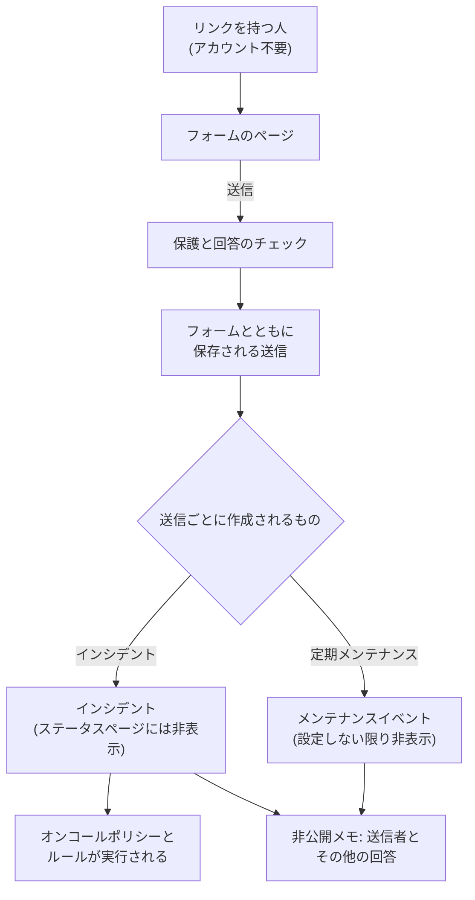

# フォームの概要

フォームは、リンクを知っている人なら誰でも、OneUptime のアカウントなしで記入できるページです。送信されるたびにプロジェクトに何かが作成されます。問題の報告なら **インシデント**、変更やメンテナンスの依頼なら **定期メンテナンスイベント** です。フォームの質問はドラッグ & ドロップのビルダーで作り、回答をどのようにレコードにするかを決め、使ってほしい人にリンクを共有します。

問題に気づく人や変更を必要とする人が、インシデントやメンテナンスを担当する人とは別のときにフォームを使います。たとえば、サポート担当者、別の部署の同僚、店舗の責任者、顧客の運用チームです。彼らはリンクを開き、質問に答えて **送信** を押します。チームには通常のインシデントまたはイベントが届き、その項目には回答が入り、誰が送ったかを記録した非公開メモが付きます。

:::cards
- [最初のフォームを作成する](#最初のフォームを作成する): 空のフォームから、共有できるリンクまで。
- [フォームの作成](/docs/forms/building): 質問、回答の種類、非表示の質問、テンプレート、ブランディング。
- [送信で作成されるもの](/docs/forms/on-submit): 回答と設定がインシデントやメンテナンスイベントになるまで。
- [共有とセキュリティ](/docs/forms/sharing-and-security): リンク、IP 許可リスト、レート制限、トラブルシューティング。
:::

## フォームの仕組み



すべてのリクエストは、まずフォームの保護を通過します。フォーム自身のページ、レート制限、IP 許可リスト、キャプチャです。回答が条件を満たす送信は保存され、レコードを 1 つ作成します。そのレコードは、回答、フォームの **送信時** の設定、インシデントの場合はそのインシデントテンプレートから入力されます。作成されたものは、チームが決めるまでステータスページには表示されません。

## 概要

- **独立した製品** — **フォーム** は製品メニューの `/dashboard/{projectId}/forms` にあります。各フォームには、OneUptime Cloud なら `https://oneuptime.com/accounts/form/<share-key>` のような独自のリンクがあります。
- **アカウント不要** — リンクを知っている人なら誰でも、サインインせずにフォームを開いて送信できます。
- **設定ページではなくビルダー** — 独自の質問 (短い回答、段落、ドロップダウン、日付、チェックボックスなど)、フォームが作成するものの項目 (タイトル、説明、重大度、モニター、ラベル、開始と終了)、カスタムフィールド、送信者の名前とメールアドレスを追加できます。ドラッグして並べ替え、フォームをプレビューして保存します。
- **各値の出どころを決められる** — **送信時** ページには、新しいインシデントまたはイベントの各項目が、その出どころ (回答、既定値、常に適用される設定、またはインシデントテンプレート) と並んで表示されます。
- **誰かが公開するまで非表示** — フォームから作成されたインシデントは、宣言されたときにステータスページに表示されたり購読者に送られたりすることはありません。メンテナンスイベントも、フォームで指定しない限り同様です。
- **何重もの保護** — **送信を受け付ける** スイッチ、任意の **IP 許可リスト**、他のウェブサイトからのリクエストの拒否、レート制限、インスタンスのキャプチャ、そして各回答のサイズ制限があります。
- **すべての送信を保存** — 各フォームの **送信履歴** ページと、全フォームの **フォーム → 送信履歴** に回答が一覧表示され、各送信が作成したものへのリンクがあります。
- **独自のブランディング** — **作成** ページの **ブランディング** セクションで、フォームのページ上部に表示するロゴと、ブラウザーのタブに表示するファビコンをアップロードします。アップロードするまでは OneUptime のものが表示されます。
- **よくあるケース用のテンプレート** — **アプリケーション障害** や **計画メンテナンス** のような名前付きの回答セットを保存すると、フォームの上部でテンプレートを選んで記入したり、テンプレートごとのリンクを開いたりできます。各テンプレートは、そのケースに合わせて質問を必須、任意、非表示にすることもできます。1 つのフォームと 1 つのブックマークで、チーム全体に対応できます。
- **非表示の質問** — インシデントの説明のように誰も答える必要のない質問を非表示にし、代わりに各テンプレートで回答させたり、必要なケースでだけ質問したりできます。
- **フォームを複製** — うまくいっているフォームから、質問、テンプレート、設定ごと、別のチーム用のフォームを作り始められます。

## フォームで作成できるもの

フォームを作成するときに、**送信ごとに作成されるもの** を選びます。あとでフォームの **送信時** ページで変更できます。

| 送信ごとに作成されるもの | 用途 | 何が起きるか |
| --- | --- | --- |
| **インシデント** | 問題の報告 | インシデントがすぐに宣言されるため、オンコールポリシーとルールが実行され、オンコールの担当者に知らされます。対応者が公開するまで、ステータスページには表示されません。 |
| **定期メンテナンス** | 変更やメンテナンスの依頼 | 送信者が希望する時間帯にメンテナンスイベントが予定されます。フォームで指定しない限り、ステータスページには表示されず、購読者にも通知されません。 |

フォームはこの 2 つから始まり、今後ほかの種類のレコードも追加されます。

## 始める前に

- **フォームを含むプラン。** OneUptime Cloud では、フォームには **Growth** 以上のプランが必要です。[プラン](#プラン) を参照してください。
- **フォームを作成する権限。** **Create Form** は、プロジェクトのオーナーと管理者、およびこの権限を与えたロールが持ちます。[権限](#権限) を参照してください。
- **インシデントフォームの場合は重大度。** すべてのインシデントに重大度が必要です。質問、フォームの設定、またはインシデントテンプレートから指定します。指定がないと、すべての送信が拒否されます。[送信で作成されるもの](/docs/forms/on-submit#how-a-submission-becomes-an-incident) を参照してください。

## 最初のフォームを作成する

:::steps
### フォームを作成する

製品メニューから **フォーム** を開き、**フォームを作成** をクリックします。フォームに名前 (公開ページの見出しで、プロジェクト内で一意) を付け、**送信ごとに作成されるもの** を選び、必要なら Markdown で説明を入力します。説明は公開ページの上部に表示されます。

### 質問を作る

フォームは **作成** ページで開き、タイトル、説明、送信者 (メンテナンスのフォームなら、メンテナンスの開始と終了) をすでに尋ねる状態になっています。質問を追加、削除、並べ替えしてから、**変更を保存** をクリックします。[フォームの作成](/docs/forms/building) を参照してください。

### 送信で作成されるものを決める

**送信時** で、送信がどのようにインシデントやイベントになるかを確認し、**設定を編集** をクリックして既定値を設定します。重大度、インシデントテンプレート、常に付けるモニターとラベル、知らせる所有者などです。[送信で作成されるもの](/docs/forms/on-submit) を参照してください。

### 同じケースの報告が多いならテンプレートを追加する

**テンプレート** で、よく報告されるケースごとにテンプレートを保存します。フォームは質問の上にテンプレートを一覧表示し、選ばれたテンプレートで自動入力し、そのテンプレートの指定どおりに質問します。あるケースで必要な質問を、そのケースのテンプレートでは必須にし、他のテンプレートでは非表示にできます。[テンプレート](/docs/forms/building#templates) を参照してください。

### リンクを共有する

**共有** でリンクをコピーし、フォームを使ってほしい人に送ります。[共有とセキュリティ](/docs/forms/sharing-and-security) を参照してください。
:::

> [!IMPORTANT]
> 新しいフォームは作成した時点で **送信を受け付ける** 状態ですが、リンクを共有するまで誰もアクセスできません。先に質問と保護を設定してください。

## フォームのページ

| ページ | 内容 |
| --- | --- |
| **作成** | フォームの名前と説明、**ブランディング** (ロゴとファビコン、折りたたみ)、そしてビルダー: 質問、質問パレット、**プレビュー** です。 |
| **テンプレート** | フォームを始めるときに使える名前付きの回答セット、それぞれが質問をどう尋ねるか、フォームを開いたときのテンプレート、テンプレートごとのリンク。 |
| **送信時** | 各送信が何を作成し、その各項目がどう入力されるか。**設定を編集** で既定値と常に適用される内容を変更します。 |
| **共有** | **送信を受け付ける**、**共有リンク**、送信後に表示されるメッセージ、**IP 許可リスト**。 |
| **送信履歴** | フォームから行われたすべての送信。新しい順で、回答と作成されたものが表示されます。 |
| **フォームを複製** | **詳細** の下: フォームのコピー。名前は自動で付けられ、質問、テンプレート、送信時の設定、ブランディング、お礼のメッセージ、IP 許可リスト、そして独自のリンクを持ちます。コピーは最初はオフで、ビルダーで開きます。 |
| **フォームを削除** | **詳細** の下にあるフォームの削除。送信履歴も一緒に削除されますが、作成されたインシデントやイベントは削除されません。 |

フォームのメニューの **開発者** セクションには、ほかのすべてのリソースと同じように、Terraform、API、AI アシスタントのページがあります。

## フォームとインシデントテンプレート

テンプレートとフォームはどちらも同じインシデントを二度入力する手間を省きますが、使う人が違います。

| | インシデントテンプレート | フォーム |
| --- | --- | --- |
| 使う人 | OneUptime にサインインしたチーム | リンクを持つ人なら誰でも (アカウント不要) |
| 場所 | インシデント一覧の **テンプレートから作成** | フォームのリンクにある独立したページ |
| 変更できるもの | 宣言前のインシデントのすべての項目 | 選んだ質問への回答だけ |
| 見えるもの | モニター、ポリシー、所有者、すべての項目 | フォームの名前、説明、質問 — そして提供することにした選択肢だけ |
| ステータスページ | テンプレートと宣言フォームの指定どおり | 対応者がインシデントを公開するまで非表示 |

この 2 つは組み合わせて使えます。インシデントフォームの **送信時** ページで **インシデントテンプレート** を指定すると、そのフォームが宣言するインシデントはすべてそのテンプレートから宣言されます。テンプレートにはチームがインシデントに必要とするものを、フォームには送信者に尋ねたいことを用意します。

## 送信履歴

フォームの **送信履歴** ページには、そのフォームから行われたすべての送信が新しい順に一覧表示されます。**送信日時**、**送信者** (送信者が入力した名前とメールアドレス、または **匿名**)、そして作成したインシデントまたはイベントへのリンクである **作成日時** が表示されます。**回答を表示** を押すと、送信者が入力したとおりにすべての回答が表示されます。**フォーム → 送信履歴** には、プロジェクトのすべてのフォームの送信が一覧表示されます。

送信はフォームによって記録され、手作業で書かれることはなく、編集もできません。送信を削除すると、その回答と送信者の名前とメールアドレスが一覧から消えますが、作成されたインシデントやイベントは残り、送信者の情報と回答を繰り返し記載した非公開メモも残ります。インシデントやイベントが削除されても送信は残り、その **作成日時** 列には **その後削除済み** と表示されます。

> [!WARNING]
> 誰かの個人データを削除するときは、送信を削除するだけでは不十分です。送信が作成したインシデントやイベントの非公開メモも編集または削除してください。

## 権限

フォームを使うと、チーム外の人がプロジェクトにインシデントやメンテナンスイベントを作成できるため、フォームはプロジェクトのオーナーと管理者、そして **Form** の権限を与えたロールが管理します。これらの権限は [権限リファレンス](/docs/permissions/reference) の **Form** グループにあります。

| 権限 | 許可される操作 | 既定で持つロール |
| --- | --- | --- |
| **Create Form** | フォームの作成と複製。 | Project Owner, Project Admin |
| **Edit Form** | フォームの変更: 質問、ブランディング、テンプレート、送信時の設定、**送信を受け付ける**、リンク、**IP 許可リスト**。 | Project Owner, Project Admin |
| **Delete Form** | フォームの削除 (送信履歴も削除されます)。 | Project Owner, Project Admin |
| **Read Form** | フォーム、その質問、設定、リンクの閲覧。 | 上記に加えて Project Member、Viewer、インシデントと定期メンテナンスのロール |
| **Read Form Submission** | 送信とその回答の閲覧。 | Project Owner, Project Admin |
| **Delete Form Submission** | 送信の削除。 | Project Owner, Project Admin |

送信には見知らぬ人が入力した内容 (名前、メールアドレス、レコードには載らないかもしれない回答) が含まれるため、**Read Form Submission** を付与しない限り、閲覧できるのはプロジェクトのオーナーと管理者だけです。フォームを閲覧できる人は誰でも、そのリンクを確認して共有できます。フォームの送信には権限は一切必要ありません。ロールと細かな権限の組み合わせ方については、[ユーザー、チーム、権限](/docs/permissions/index) を参照してください。

## プラン

OneUptime Cloud では、フォームには **Growth** 以上のプランが必要で、フォームの **IP 許可リスト** には **Scale** が必要です。これはフォームの作成時に設定する場合も、あとで編集する場合も同じです。**Growth** プラン未満のプロジェクト、またはサブスクリプションが未払いのプロジェクトのリンクには利用できない旨のメッセージが表示され、何も作成されません。

## API からフォームを使う

フォームは `/api/form` にある通常の API リソースで、送信は `/api/form-submission` にあります。送信は読み取りと削除はできますが、作成や編集はできません。リクエストとレスポンスの完全な形式は [API リファレンス](/reference) にあります。

### 質問と設定

フォームの質問はその `fields` 列 (フォームが尋ねる順の JSON リスト) に、送信時の設定はその `targetSettings` に入っています。

```json
{
  "data": {
    "targetType": "Incident",
    "fields": [
      {
        "id": "what",
        "source": "TargetField",
        "targetField": "title",
        "label": "What is wrong?",
        "isRequired": true
      },
      {
        "id": "office",
        "source": "Question",
        "type": "Dropdown",
        "label": "Which office are you in?",
        "dropdownOptions": "Berlin\nLondon",
        "isRequired": false
      },
      {
        "id": "email",
        "source": "Submitter",
        "submitterField": "Email",
        "label": "Your Email",
        "isRequired": true
      }
    ],
    "targetSettings": {
      "incidentSeverityId": "<severity-id>",
      "labelIds": ["<label-id>"]
    }
  }
}
```

各質問には、独自の `id` (英字、数字、`-`、`_`)、`source`、`label`、そして任意の `helpText` と `isRequired` があります。

| `source` | 尋ねる内容 |
| --- | --- |
| `Question` | フォーム独自の質問で、`type` に応じて回答します: `Text`、`LongText`、`Markdown`、`Number`、`Dropdown`、`MultiSelectDropdown`、`Boolean`、`Date`、`DateTime`。ドロップダウンは `dropdownOptions` を 1 行に 1 つずつ一覧表示します。 |
| `TargetField` | フォームが作成するものの項目で、`targetField` で指定します: インシデントなら `title`、`description`、`incidentSeverityId`、`monitors`、`labels`、`impactStartedAt`、メンテナンスイベントなら `title`、`description`、`startsAt`、`endsAt`、`monitors`、`statusPages`、`labels`。選択で回答する項目は、提示するレコードを `allowedOptionIds` に一覧表示します。 |
| `TargetCustomField` | インシデントまたはイベントのカスタムフィールドの 1 つで、`customFieldId` で指定します。 |
| `Submitter` | 送信者の `Name` または `Email` で、`submitterField` で指定します。 |

`isHidden` が `true` の質問は公開ページに表示されず、必須になることもなく、送信が指定したテンプレートからのみ回答されます (そのテンプレートがその質問を尋ねる場合を除く)。`isRequired` と `isHidden` はフォームの既定値で、テンプレートごとに独自の方法で質問を尋ねることができます。

### API でのテンプレート

フォームのテンプレートはその `templates` 列 (フォームが一覧表示する順の JSON リスト) に入っています。各テンプレートには、独自の `id` (英字、数字、`-`、`_`)、フォーム内で一意な最大 100 文字の `name`、そして質問 ID をキーとする `answers` があります。各回答は送信と同じ形式で、テキスト、数値、`true` または `false`、選択肢の値、複数選択なら値のリストです。`isDefault` を `true` にすると、フォームを開いたときのテンプレートになります。フォームにこれが 1 つまで、テンプレートは最大 50 個まで持てます。

`fieldSettings` も質問 ID をキーとし、テンプレートが質問をどう尋ねるかを示します: `Required`、`Optional`、`Hidden`。テンプレートに記載されていない質問 (または `null` と記載された質問) はフォームと同じように尋ねられ、メンテナンスイベントの `startsAt` と `endsAt` の質問は `Required` にしかできません。

```json
{
  "data": {
    "templates": [
      {
        "id": "outage",
        "name": "Application Outage",
        "isDefault": true,
        "answers": {
          "what": "The application is down",
          "office": "Berlin"
        },
        "fieldSettings": {
          "office": "Required",
          "email": "Optional"
        }
      }
    ]
  }
}
```

質問、テンプレート、設定は、ダッシュボード、API、Terraform、ワークフローのどこから保存しても保存のたびにチェックされ、ルールに違反するリストは何が問題かを示すメッセージとともに拒否されます。フォームのリンクに含まれるキー `shareKey` は、フォームの作成時に OneUptime が設定します。これを変更するのが **リンクをリセット** です。

### API でのブランディング

フォームのブランディングは、その `logoFileId`、`logoAltText`、`faviconFileId` です。まず、フォームのプロジェクトで `POST /api/file` を使って画像をアップロードします (そのプロジェクトの API キーを使うか、メンバーとしてサインインして `tenantid` ヘッダーにプロジェクトの ID を入れます)。このとき `name`、`image/png` などの `fileType`、base64 のバイトを入れた `file` を送り、返された `_id` を設定します。メンバーでないプロジェクトへのアップロードは "You can upload files only to a project you are a member of." で拒否されます。アップロードはすべて非公開です: `isPublic` はリクエストの内容にかかわらず OneUptime が設定します。各画像はフォームの保存時にチェックされます。フォームのプロジェクトでアップロードされたものでなければならず、ロゴは 512 KB 以下の PNG、JPEG、GIF、WebP、SVG 画像、ファビコンはそれらのいずれかか 128 KB 以下の ICO でなければなりません。ID を `null` にすると OneUptime のものに戻ります。[ブランディング](/docs/forms/building#branding) を参照してください。

### 送信を読む

フォームの送信を一覧表示するには:

```bash
curl -X POST https://oneuptime.com/api/form-submission/get-list \
  -H "apikey: $ONEUPTIME_API_KEY" \
  -H "Content-Type: application/json" \
  -d '{
    "query": { "formId": "<form-id>" },
    "select": { "submitterName": true, "submitterEmail": true, "answers": true, "incidentId": true, "scheduledMaintenanceId": true, "createdAt": true },
    "limit": 50,
    "skip": 0
  }'
```

### ワークフロー

フォームには自動生成されたワークフローのコンポーネント (**On Create Form**、**On Update Form** など) があります。フォームが作成したものに対して処理を行うには、**On Create Incident** または **On Create Scheduled Maintenance** を使います。

### 公開ページ専用のエンドポイント

公開ページは API キーを必要としない 2 つのルートと通信します。`GET /api/form/public/<shareKey>` はフォームの名前、説明、質問を返し、ある場合はロゴ、ロゴの代替テキスト、ファビコン (画像は base64)、そしてページが尋ねる質問への回答を含むテンプレートも返します。`POST /api/form/public/<shareKey>/submit` はフォームを送信し、送信者が使い始めたテンプレートを `templateId` で示します。これらはページ専用のエンドポイントであり、これを土台に何かを作るための API ではありません。すべての呼び出しはフォームの保護を通り ([共有とセキュリティ](/docs/forms/sharing-and-security) を参照)、ページとともに変更されます。自分のコードからインシデントを作成するには、API キーを使って `POST /api/incident` を呼び出します。[インシデントの宣言](/docs/incidents/declaring-incidents) を参照してください。

## インシデントフォームの移行先

フォームは、以前 **インシデント → 設定 → フォーム** にあった **Incident Forms** に代わるものです。各インシデントフォームは、アップグレード時に同じリンクと同じ送信のまま移行されました。

- 質問はビルダーの質問になりました: タイトル、非表示でなければ説明、送信者が選べる場合は重大度、尋ねていた各カスタムフィールド (カスタムフィールドの並び順)、そしてフォームが匿名の報告を許可していない限り必須の **Your Name** と **Your Email** です。
- 重大度とインシデントテンプレートは、**送信時** の既定値になりました。
- **有効** スイッチ、成功メッセージ、**IP 許可リスト** は変わらず、リンクも変わりません: 古い `/accounts/incident-form/<share-key>` のリンクは、新しいアドレスのフォームを開きます。
- **Incident Form** の権限は、それを持っていたすべてのチームと API キーについて、**Form** の権限になりました。

古いダッシュボードのページは新しいページにリダイレクトされます。

## 次のステップ

:::cards
- [フォームの作成](/docs/forms/building): 質問、回答の種類、リンクされた項目、カスタムフィールド、プレビュー。
- [送信で作成されるもの](/docs/forms/on-submit): 回答と送信時の設定がインシデントやメンテナンスイベントになるまで。
- [共有とセキュリティ](/docs/forms/sharing-and-security): リンク、IP 許可リスト、レート制限、キャプチャ、トラブルシューティング。
- [インシデントの宣言](/docs/incidents/declaring-incidents): インシデントを宣言するその他の方法。
:::
