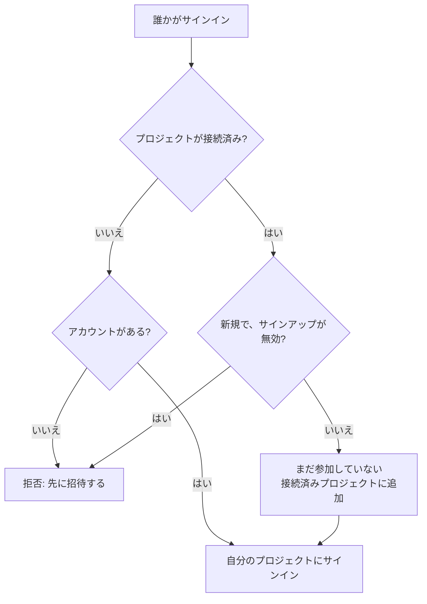

# グローバル SSO

グローバル SSO を使うと、OneUptime の **インスタンス管理者**（マスター管理者）が SAML 2.0 または OpenID Connect（OIDC）のアイデンティティプロバイダーをインスタンスレベルで **一度だけ** 設定し、サーバー上の任意のプロジェクトに接続できます。プロジェクトのオーナーがそれぞれ自分のアイデンティティプロバイダーを設定する代わりに、マスター管理者がインスタンス全体で使うものを 1 つ設定します。

> [!NOTE]
> グローバル SSO（インスタンス全体の「Require SSO for Login」スイッチを含む）は OneUptime のすべてのエディションに含まれます。Community Edition を含むすべてのセルフホストのインスタンスで利用でき、ライセンスは不要です。インスタンスの管理機能なので、OneUptime Cloud には適用されません。各エディションに含まれる機能については [エンタープライズ版](/docs/self-hosted/enterprise) をご覧ください。

:::cards
- [プロバイダーを設定する](#グローバル-sso-の設定): 作成し、OneUptime の URL をアイデンティティプロバイダーに渡して、テストします。
- [ユーザーのサインイン方法](#ユーザーのサインイン方法): 既存のメンバーだけか、接続したプロジェクトに追加される新しい人か。
- [SSO を必須にする](#sso-を必須にする): 1 つのプロジェクト、またはインスタンス全体で SSO を必須にします。
- [プロバイダーをオフにする](#プロバイダーをオフにするまたは削除する): 何が終了し、OneUptime がどの変更を拒否するか。
:::

## グローバル SSO とプロジェクト SSO の違い

|                  | プロジェクト SSO                                   | グローバル SSO                                     |
| ---------------- | -------------------------------------------------- | -------------------------------------------------- |
| 設定する人       | プロジェクトのオーナー/管理者（プロジェクト設定）   | インスタンスのマスター管理者（Admin Dashboard）     |
| 範囲             | 1 つのプロジェクト                                 | インスタンス全体（任意のプロジェクトに接続可能）     |
| サインインの結果 | その 1 つのプロジェクトへのアクセス                | ユーザーが利用できるすべてのプロジェクトへのアクセス |

1 つのプロジェクト自身のプロバイダーについては、[SSO](/docs/identity/sso) をご覧ください。

## グローバル SSO の設定

:::steps
### プロバイダーの一覧を開く

:::tabs
@tab SAML
マスター管理者としてサインインし、ユーザーメニューの **管理者設定** から Admin Dashboard を開きます。続いて **設定** > **認証** > **Global SSO** に移動します。
@tab OpenID Connect
マスター管理者としてサインインし、ユーザーメニューの **管理者設定** から Admin Dashboard を開きます。続いて **設定** > **認証** > **Global OIDC** に移動します。
:::

### プロバイダーを作成する

:::tabs
@tab SAML
- **Create Global SSO** をクリックします。
- **名前**、アイデンティティプロバイダーの **Sign On URL** と **Issuer** を入力し、**Public Certificate** を貼り付けます。それ以外は **その他の項目** に入力済みです: **Signature Method**（`RSA-SHA256`）、**Digest Method**（`SHA256`）、説明（`Sign in with` と名前）。IdP が必要とする場合にのみ変更してください。保存すると、プロバイダーのページが開きます。
@tab OpenID Connect
- **Create Global OIDC** をクリックします。
- **名前**、**Issuer URL**、IdP に登録したアプリの **Client ID** と **Client Secret** を入力します。**Issuer URL** には IdP のディスカバリ URL を貼り付けることもできます。それ以外は **その他の項目** に入力済みです: **Discovery URL**（発行者の後に `/.well-known/openid-configuration` を付けたもの）、**Scopes**（`openid email profile`）、`email` と `name` のクレーム名、説明（`Sign in with` と名前）。IdP が必要とする場合にのみ変更してください。保存すると、プロバイダーのページが開きます。
:::

### OneUptime の URL をアイデンティティプロバイダーにコピーする

:::tabs
@tab SAML
プロバイダーのページの **Identity Provider URLs** カードに、**ACS URL (Assertion Consumer Service / Reply URL)** と **Issuer (Entity ID)** が表示されます。両方をアイデンティティプロバイダー（Okta、Microsoft Entra ID、OneLogin、JumpCloud など）に貼り付けます。
@tab OpenID Connect
プロバイダーのページの **Identity Provider URL** カードに、**Redirect URI (Callback URL)** が表示されます。これをアイデンティティプロバイダーの許可されたリダイレクト URI に追加します。
:::

### プロバイダーをオンにする

新しいプロバイダーはオフの状態で作成されます。プロバイダーのページで **Edit Configuration** をクリックし、**有効** をオンにします。

グローバルプロバイダーを有効にしても、サインインページに「Sign in with SSO」の選択肢が追加されるだけです。SSO を強制したり、誰かを締め出したりすることはないので、安心して有効にし、テストし、必要に応じて再び無効にできます。

### プロバイダーをテストする

**Test this SSO provider** カード（OpenID Connect の場合は **Test this OIDC provider**）のリンクを使って、アイデンティティプロバイダー経由のサインインを最初から最後まで試します。先にプロジェクトを接続する必要はありません。テストでは、すでに所属しているプロジェクトにサインインします。リンクを使うには、プロバイダーが有効になっている必要があります。
:::

## ユーザーのサインイン方法

グローバルプロバイダーの動作は、プロジェクトを接続しているかどうかで変わります。

- **プロジェクトを接続しない（すべてのプロジェクト / 招待が先）:** ユーザーはプロバイダーでサインインし、**すでにメンバーになっているすべてのプロジェクト** にアクセスできます。新しいユーザーは自動的には **作成されません**。ユーザーは先にプロジェクトに招待されている必要があります。メンバーシップを別の場所で管理する、会社全体の SSO に使います。

- **プロジェクトを接続する（自動プロビジョニング）:** プロバイダーを開き、**Attached Projects** テーブルを使用して、それぞれにデフォルトチームのセットを持つ 1 つ以上のプロジェクトを接続します。サインインしたユーザーは、初回ログイン時にそれらのプロジェクトに **自動プロビジョニング** され、デフォルトチームに追加されます。接続したプロジェクトでは、最初からそのプロジェクトのメンバーチームが選択されています。新しいユーザーに別のアクセス権を与えるには、ほかのチームを選んでください。リストを作成するには、一度に 1 つのプロジェクトとチームを追加します。接続を変更するには、それを削除して再度追加します。

接続済みのプロジェクトにすでに所属している人は、そのプロジェクトでのチームをそのまま保持します。

プロバイダーの 2 つのスイッチで、この動作が変わります。どちらも最初はオフで、**その他の項目** の中に折りたたまれています。

| スイッチ | オンのときの動作 |
| --- | --- |
| **Disable Sign Up with SSO** | プロジェクトが接続されていても、このプロバイダーでサインインする前にプロジェクトへの招待が必要です。初回サインインで新しい人は作成されません。 |
| **Restrict to Attached Projects** | このプロバイダーでのサインインは、接続されたプロジェクトでのみ SSO の要件を満たします。そのため、すでにサインインしている人がほかのプロジェクトへのアクセスを失うことがあります。オフのときは、その人が所属するすべてのプロジェクトで要件を満たし、接続されたプロジェクトは新しい人を追加する先を決めるだけです。 |

## SSO を必須にする

グローバルプロバイダーを設定しても、誰かにその使用を強制することはなく、パスワードでのサインインも引き続き使えます。SSO を必須にするには、プロジェクトまたはインスタンス全体で要件をオンにします。

- **プロジェクトごと:** プロジェクトは SSO を必須にでき、さらに _特定の_ プロバイダー（プロジェクトのものまたはグローバルなもの）を必須にすることもできます。[プロジェクトで SSO を必須にする](/docs/identity/sso#プロジェクトで-sso-を必須にする) をご覧ください。
- **インスタンス全体:** **Admin** > **設定** > **認証** には **ログインに SSO を必須にする** スイッチがあり、インスタンス全体のすべてのユーザーに SSO を強制します。オンにする前に確認を求め、確認するとすぐに保存されます。締め出されないように、マスター管理者は対象外のままです。

**ログインに SSO を必須にする** をオンにするには、誰も締め出されないように、人をサインインさせる SSO プロバイダーが必要です。

- インスタンス全体の場合、自身で SSO を必須にしていないすべてのプロジェクトに、オンになっているプロジェクト自身の SAML または OIDC プロバイダーか、オンになっていてそのプロジェクトに人をサインインさせるグローバルプロバイダーが 1 つ必要です。それがないプロジェクトがある間はスイッチをオンにできず、メッセージにはそのプロジェクト（多い場合は最初のいくつかと総数）が示されます。先にグローバルプロバイダー、またはそれらのプロジェクトのプロバイダーをオンにしてください。特定のプロバイダーを必須にしているプロジェクトには、そのプロバイダーが必要です。それがオフ、削除済み、またはそのプロジェクトに人をサインインさせない間は、メッセージにそのプロジェクトが別に示されます。先にそのプロバイダーをオンにするか、そのプロジェクトで別のプロバイダーを必須にしてください。
- プロジェクトの場合は、同じことがそのプロジェクトと、プロバイダーを必須にしている場合はそのプロバイダーに求められます。
- すでにオンになっている **ログインに SSO を必須にする** をオンとして送る保存（ほかの設定と一緒の場合や API からの場合）も、インスタンスでもプロジェクトでも同じように確認されます。プロジェクトがすでに必須にしているプロバイダーを指定する保存も同様です。
- まだ自身のプロバイダーがない新しいプロジェクトの場合: インスタンスで SSO が必須の間、プロジェクトを作成するには、オンになっていてすべてのプロジェクトに人をサインインさせるグローバルプロバイダーが必要です。そうでないと、作成者を含めて誰もプロジェクトを開けなくなるからです。ない場合、プロジェクトの作成は拒否され、メッセージはサーバー管理者にプロバイダーをオンにするよう求めます。マスター管理者は引き続きプロジェクトを作成できます。**ログインに SSO を必須にする** をオンにした状態で作成するプロジェクトにも、誰が作成するかにかかわらず同じものが必要です。

オフにすることが拒否されることはありません。

## プロバイダーをオフにする、または削除する

グローバルプロバイダーをオフにする、削除する、または接続済みのプロジェクトに制限すると、そのプロバイダーが人をサインインさせなくなった場所で、そのプロバイダーで行われたサインインは終了します。SSO が必須の場所では、そのプロバイダーでサインインした人は次のリクエストで SSO で再度サインインする必要があり、開いているページはすぐにライブ更新を受け取らなくなり、そのプロバイダーでサインインした後に誰かが接続した MCP クライアントはそのプロジェクトで動作しなくなります。

プロバイダーを再びオンにしても、それらのサインインは戻りません。そのプロバイダーで改めてサインインします。アップグレードの時点ですでにオフだったプロバイダーは、アップグレード時にオフにされたものとして扱われます。

新しい証明書やクライアントシークレット、別の URL、新しい名前では、全員がサインインしたままです。

### SSO が必須のすべてのプロジェクトに入り口を確保する

プロジェクト自身が SSO を必須にしている場合も、インスタンス全体が必須にしているためにプロジェクトで SSO が必須の場合も、そのプロジェクトにはサインインに使えるプロバイダーが常に確保されます。そのため、次の変更によってそのようなプロジェクトにプロバイダーがまったくなくなる場合や、必須のプロバイダーが失われる場合、その変更は拒否されます。

- グローバルプロバイダーをオフにする、削除する、または接続済みのプロジェクトに制限する。
- 接続済みのプロジェクトに制限されたプロバイダーについて: 最初のプロジェクトを接続する（それまではすべてのプロジェクトに人をサインインさせます）、接続をオフにする、別のプロジェクトや別のプロバイダーに移す、または削除する。

メッセージにはプロジェクト、または最初のいくつかと総数が示されます。先にそれらのプロジェクトの別のプロバイダー（プロジェクト自身のものかグローバルなもの）をオンにするか、そこで **ログインに SSO を必須にする** をオフにしてください。まさにこのプロバイダーを必須にしているプロジェクトは別に示されます。先にそこで別のプロバイダーを必須にするか、**ログインに SSO を必須にする** をオフにしてください。

プロバイダーがより多くの人をサインインさせられるようにする変更（プロバイダーや接続をオンにする、制限を解除する）は拒否されません。**ログインに SSO を必須にする** をオフにしたときと同じように、すべてのアプリサーバーにすぐに反映され、すぐにそのプロバイダーでサインインできます。まさに同じ瞬間に同じプロバイダーへの別の変更が保存された場合に限り、アプリサーバーが追従するまで最大 1 分かかることがあります。

サインインできる人を変える 2 つの変更は、1 つずつ順に確認されます。同じ瞬間に別の変更が保存されていて、それに通常より時間がかかっている場合（インスタンス全体で **ログインに SSO を必須にする** をオンにすると、すべてのプロジェクトが読み込まれます）、変更は "Another change to who can sign in with SSO is being saved. Try again in a moment." で拒否されます。もう一度保存してください。その瞬間に作成されたプロジェクトも変更を待ち、待ち時間が長すぎると "The server's SSO settings are being changed. Create the project again in a moment." で拒否されます。

## トラブルシューティング

:::details "You must be invited to a project on this OneUptime instance before you can sign in with SSO"
その人はまだ OneUptime アカウントを持っておらず、プロバイダーもアカウントを作成しません。プロバイダーにプロジェクトが接続されていないか、**Disable Sign Up with SSO** がオンになっています。その人をプロジェクトに招待するか、プロバイダーにプロジェクトを接続してください。
:::

:::details "This SSO provider does not grant access to any project you are a member of"
**Restrict to Attached Projects** がオンになっていて、その人はプロバイダーに接続されたどのプロジェクトのメンバーでもありません。その人のプロジェクトのいずれかを接続するか、その人を接続済みのプロジェクトに追加してください。
:::

:::details "You are not a member of any project on this OneUptime instance"
その人はアカウントを持っていますが、どのプロジェクトにも所属しておらず、プロバイダーにもその人を追加する先がありません。その人をプロジェクトに招待するか、デフォルトチームを指定したプロジェクトをプロバイダーに接続してください。
:::

:::details "Issuer URL does not match"
SAML プロバイダーの場合、アイデンティティプロバイダーのレスポンスに含まれる発行者が、プロバイダーに保存された **Issuer** と一致していません。アイデンティティプロバイダーからコピーし直してください。2 つは完全に一致している必要があります。
:::

## 次のステップ

:::cards
- [SSO](/docs/identity/sso): プロジェクト自身の SAML または OIDC プロバイダーを設定する。
- [SCIM](/docs/identity/scim): アイデンティティプロバイダーに人の追加と削除を自動で任せる。
- [ユーザー、チーム、権限](/docs/permissions/index): 新しい人が参加するチームで何ができるようになるか。
:::
