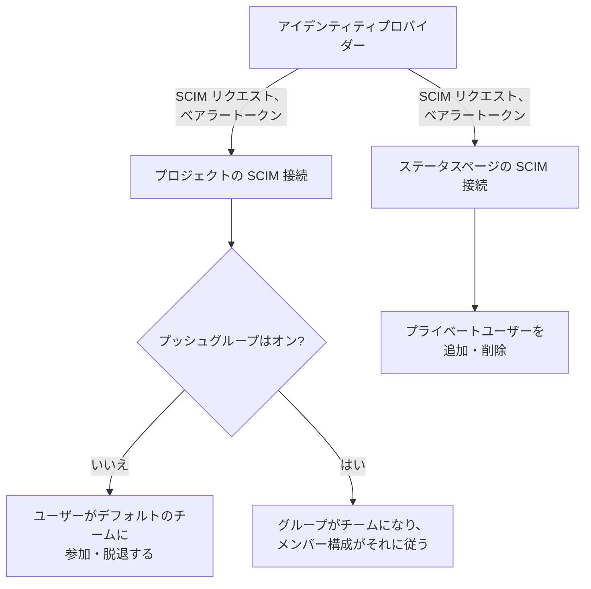
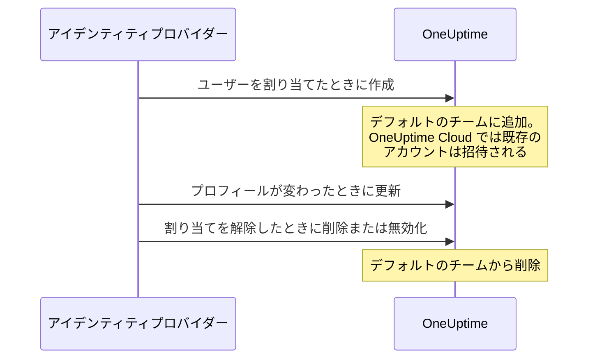
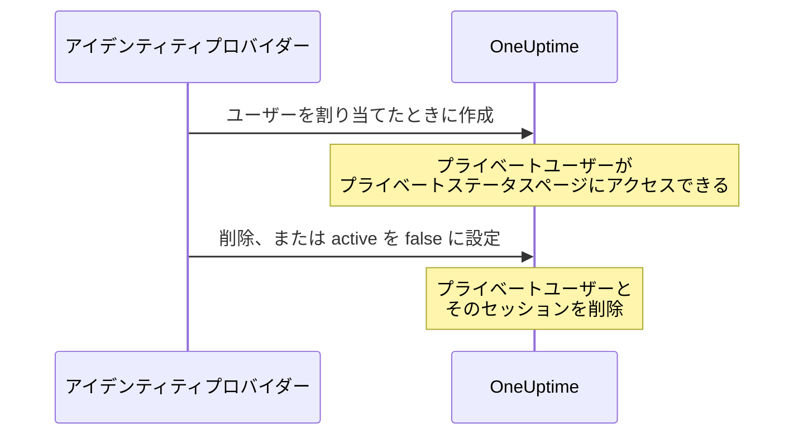

# SCIM

SCIM（System for Cross-domain Identity Management）は、ユーザーのプロビジョニングとデプロビジョニングを自動で行います。Microsoft Entra ID、Okta、その他の SCIM 2.0 対応システムなどのアイデンティティプロバイダー（IdP）は、ユーザーを割り当てると OneUptime のプロジェクトやプライベートステータスページにそのユーザーを追加し、割り当てを解除すると削除します。

> [!NOTE]
> **エディション:** SCIM は OneUptime Enterprise Edition の一部です。OneUptime Cloud では **Scale** プラン以上で利用できます。セルフホスト環境では、Enterprise Edition のイメージとライセンスが必要です。[エンタープライズ版](/docs/self-hosted/enterprise) をご覧ください。有効なライセンスがない場合（14 日間の試用期間の後、またはライセンスの期限切れから 30 日後）、ライセンスが有効化されるまで SCIM リクエストは拒否されます。

:::cards
- [プロジェクトの SCIM を設定する](#プロジェクトの-scim-の設定): 接続を作成し、その URL とトークンを IdP に渡します。
- [ステータスページの SCIM を設定する](#ステータスページの-scim-の設定): ステータスページのプライベートユーザーをプロビジョニングします。
- [アイデンティティプロバイダーを接続する](#アイデンティティプロバイダーを接続する): Microsoft Entra ID と Okta の手順。
- [よくある質問](#よくある質問): 既存のユーザー、デプロビジョニング、メールアドレスの変更。
:::

## 仕組み

アイデンティティプロバイダーは、誰かを割り当てたり、変更したり、割り当てを解除したりするたびに、ベアラートークンで認証して OneUptime の SCIM エンドポイントを呼び出します。リクエストで何が変わるかは、接続がどこにあるかによって異なります。



SCIM 連携には次のメリットがあります。

- **ユーザーの自動プロビジョニング**: IdP でユーザーを割り当てると、OneUptime にユーザーが作成されます。
- **ユーザーの自動デプロビジョニング**: IdP でユーザーの割り当てを解除すると、OneUptime からユーザーが削除されます。
- **ユーザー属性の同期**: ユーザー情報が IdP と OneUptime の間で一致した状態に保たれます。
- **アクセスの一元管理**: OneUptime へのアクセスを既存の ID 管理システムから管理できます。

SCIM と [SSO](/docs/identity/sso) は独立しています。SCIM はプロジェクトに誰がいるかを、SSO はその人がどうサインインするかを決めます。ほとんどの組織は両方を使います。

## プロジェクトの SCIM

プロジェクトの SCIM を使うと、アイデンティティプロバイダーが OneUptime プロジェクトのチームメンバーを管理できます。

### プロジェクトの SCIM の設定

プロジェクトの SCIM 接続を追加または変更したり、そのベアラートークンを表示またはリセットしたりできるのは、プロジェクトのオーナーだけです。SCIM を通じて、アイデンティティプロバイダーはプロジェクト内のどのチームにも人を追加できるためです。
:::steps
1. **プロジェクト設定に移動する**

   - OneUptime プロジェクトを開きます
   - **プロジェクト設定** > **セキュリティ** > **SCIM** に移動します

2. **SCIM の設定を構成する**

   - **名前** を入力します。**デフォルトのチーム** にはプロジェクトのメンバーチームが最初から入っています。新しいユーザーはこれらのチームに追加されます
   - **その他の項目** では、**ユーザーの自動プロビジョニング**（IdP で割り当てられたユーザーを追加する）と **ユーザーの自動デプロビジョニング**（IdP で割り当てを解除されたユーザーを削除する）がオンで、**プッシュグループを有効化** がオフになっています。必要に応じてそこで変更してください
   - 保存します。IdP の設定に使う **SCIM Base URL** と **Bearer Token** を表示するダイアログがすぐに開きます

3. **アイデンティティプロバイダーを構成する**

   - ダイアログの **SCIM Base URL** を使います。OneUptime Cloud では `https://oneuptime.com/identity/scim/v2/<scim-id>` です。セルフホスト環境では、そのインストール自身のホストが表示されます
   - ダイアログの **Bearer Token** を使って、ベアラートークン認証を設定します
   - ユーザー属性をマッピングします（メールアドレスは必須です）。Microsoft Entra ID と Okta の詳細は [アイデンティティプロバイダーを接続する](#アイデンティティプロバイダーを接続する) にあります
:::

URL をもう一度表示するには、接続の行で **SCIM URL を表示** を選びます。**ベアラートークンをリセット** はトークンを置き換えます。アイデンティティプロバイダーを新しいトークンで更新してください。

### プロジェクトのユーザーがプロビジョニングされる流れ



すでに OneUptime アカウントを持っていた人は、OneUptime Cloud で招待を承諾すると参加します（[よくある質問](#よくある質問) をご覧ください）。接続のデフォルトのチーム以外のチームを通じて与えられたアクセスには影響しません。

## ステータスページの SCIM

ステータスページの SCIM を使うと、アイデンティティプロバイダーが、プライベートステータスページにアクセスできるステータスページのプライベートユーザーをプロビジョニングおよびデプロビジョニングできます。

### ステータスページの SCIM の設定

:::steps
1. **ステータスページの設定に移動する**

   - **ステータスページ** を開き、ステータスページを選びます
   - **セキュリティ** > **SCIM** に移動します

2. **SCIM の設定を構成する**

   - **名前** を入力します。**その他の項目** では、**ユーザーの自動プロビジョニング**（IdP で割り当てられたプライベートユーザーを追加する）と **ユーザーの自動デプロビジョニング**（IdP で割り当てを解除されたプライベートユーザーを削除する）がオンになっています。必要に応じてそこで変更してください
   - 保存します。IdP の設定に使う **SCIM Base URL** と **Bearer Token** を表示するダイアログがすぐに開きます

3. **アイデンティティプロバイダーを構成する**

   - ダイアログの **SCIM Base URL** を使います。OneUptime Cloud では `https://oneuptime.com/identity/status-page-scim/v2/<scim-id>` です
   - 表示されたトークンを使って、ベアラートークン認証を設定します
   - ユーザー属性をマッピングします（メールアドレスは必須です）
:::

URL をもう一度表示するには、接続の行で **SCIM エンドポイント URL を表示** を選びます。

ステータスページの SCIM がサポートするのはユーザーだけです。グループとグループのプロビジョニングはサポートしていません。

### プライベートユーザーがプロビジョニングされる流れ



> [!WARNING]
> デプロビジョニングすると、ステータスページのプライベートユーザーと、そのステータスページでのすべてのセッションが完全に削除されます。後でユーザーが再び割り当てられると、新しいプライベートユーザーとしてプロビジョニングされます。**ユーザーの自動デプロビジョニング** がオフの場合、`active` を `false` に設定する更新は無視され、DELETE リクエストは拒否されます。

## アイデンティティプロバイダーを接続する

以下の各プロバイダーでは、まず OneUptime でプロジェクトの SCIM 接続を作成し、その後アイデンティティプロバイダーをそこに接続します。

### Microsoft Entra ID（旧称 Azure AD）

Microsoft Entra ID は、SCIM プロビジョニングを備えたエンタープライズ向けの ID 管理を提供します。次のものが必要です。

- Premium P1 または P2 ライセンスのある Microsoft Entra ID テナント（自動プロビジョニングに必要です）。
- OneUptime Cloud の **Scale** プラン以上の OneUptime プロジェクト。
- Microsoft Entra ID と OneUptime の両方への管理者アクセス。

:::steps
#### Entra ID 用の SCIM 接続を作成する

1. OneUptime ダッシュボードにログインします
2. **プロジェクト設定** > **セキュリティ** > **SCIM** に移動します
3. **SCIMを作成** をクリックします
4. わかりやすい名前（例: "Microsoft Entra ID Provisioning"）を入力します
5. 設定を確認します。
   - **デフォルトのチーム**: プロジェクトのメンバーチームが最初から入っています。新しいユーザーはこれらのチームに追加されます
   - **ユーザーの自動プロビジョニング** と **ユーザーの自動デプロビジョニング**: オンで、**その他の項目** の中にあります
   - **プッシュグループを有効化**: **その他の項目** の中にあります。Entra ID のグループでチームのメンバー構成を管理する場合はオンにします
6. 設定を保存します
7. 開いたダイアログから **SCIM Base URL** と **Bearer Token** をコピーします。Entra ID で必要になります

#### Entra ID でエンタープライズアプリケーションを作成する

1. [Microsoft Entra admin center](https://entra.microsoft.com) にサインインします
2. **Identity** > **Applications** > **Enterprise applications** に移動します
3. **+ New application**、続いて **+ Create your own application** をクリックします
4. 名前（例: "OneUptime"）を入力します
5. **Integrate any other application you don't find in the gallery (Non-gallery)** を選んで **Create** をクリックします

#### Entra ID を OneUptime に接続する

1. OneUptime のエンタープライズアプリケーションで **Provisioning** に移動し、**Get started** をクリックします
2. **Provisioning Mode** を **Automatic** に設定します
3. **Admin Credentials** で、**Tenant URL** を OneUptime の **SCIM Base URL**（例: `https://oneuptime.com/identity/scim/v2/<scim-id>`）に、**Secret Token** を **Bearer Token** に設定します
4. **Test Connection** をクリックして設定を確認し、**Save** をクリックします

#### Entra ID でユーザー属性をマッピングする

1. Provisioning セクションで **Mappings**、続いて **Provision Azure Active Directory Users** をクリックします
2. 次の属性マッピングを設定し、不要なものを削除して **Save** をクリックします。

| Azure AD の属性                                               | OneUptime の SCIM 属性         | 必須     |
| ------------------------------------------------------------- | ------------------------------ | -------- |
| `userPrincipalName`                                           | `userName`                     | はい     |
| `mail`                                                        | `emails[type eq "work"].value` | 推奨     |
| `displayName`                                                 | `displayName`                  | 推奨     |
| `givenName`                                                   | `name.givenName`               | 任意     |
| `surname`                                                     | `name.familyName`              | 任意     |
| `Switch([IsSoftDeleted], , "False", "True", "True", "False")` | `active`                       | 推奨     |

#### Entra ID でグループをマッピングする（任意）

OneUptime で **プッシュグループを有効化** をオンにした場合:

1. **Mappings** に戻り、**Provision Azure Active Directory Groups** をクリックします
2. **Enabled** を **Yes** に設定します
3. 次の属性マッピングを設定し、**Save** をクリックします。

| Azure AD の属性 | OneUptime の SCIM 属性 |
| --------------- | ---------------------- |
| `displayName`   | `displayName`          |
| `members`       | `members`              |

#### Entra ID でユーザーとグループを割り当てる

1. OneUptime のエンタープライズアプリケーションで **Users and groups** に移動します
2. **+ Add user/group** をクリックし、OneUptime にプロビジョニングするユーザーとグループを選んで **Assign** をクリックします

#### Entra ID でプロビジョニングを開始する

1. **Provisioning** > **Overview** に移動し、**Start provisioning** をクリックします
2. 最初のプロビジョニングサイクルが始まります。最初の同期には最大 40 分かかることがあります
3. **Provisioning logs** でエラーを確認します。割り当てた人が OneUptime のプロジェクトのチームに表示されます
:::

### Okta

Okta は、SCIM に対応した柔軟な ID 管理を提供します。次のものが必要です。

- プロビジョニング（Lifecycle Management 機能）のある Okta テナント。
- OneUptime Cloud の **Scale** プラン以上の OneUptime プロジェクト。
- Okta と OneUptime の両方への管理者アクセス。

:::steps
#### Okta 用の SCIM 接続を作成する

1. OneUptime ダッシュボードにログインします
2. **プロジェクト設定** > **セキュリティ** > **SCIM** に移動します
3. **SCIMを作成** をクリックします
4. わかりやすい名前（例: "Okta Provisioning"）を入力します
5. 設定を確認します。
   - **デフォルトのチーム**: プロジェクトのメンバーチームが最初から入っています。新しいユーザーはこれらのチームに追加されます
   - **ユーザーの自動プロビジョニング** と **ユーザーの自動デプロビジョニング**: オンで、**その他の項目** の中にあります
   - **プッシュグループを有効化**: **その他の項目** の中にあります。Okta のグループでチームのメンバー構成を管理する場合はオンにします
6. 設定を保存します
7. 開いたダイアログから **SCIM Base URL** と **Bearer Token** をコピーします。Okta で必要になります

#### Okta アプリケーションを作成するか開く

Okta Admin Console で **Applications** > **Applications** に移動します。

- OneUptime の SSO にすでに Okta を使っている場合は、そのアプリケーションを開きます。
- そうでない場合は、**Create App Integration** をクリックし、**SAML 2.0** を選んで "OneUptime" という名前を付け、SAML の設定を完了します（[SSO](/docs/identity/sso) を参照）。

#### Okta で SCIM プロビジョニングをオンにする

1. OneUptime アプリケーションの **General** タブに移動します
2. **App Settings** セクションで **Edit** をクリックし、**Provisioning** で **SCIM** を選んで **Save** をクリックします
3. 新しい **Provisioning** タブが表示されます

#### Okta を OneUptime に接続する

1. **Provisioning** タブで **Integration**、続いて **Configure API Integration** をクリックし、**Enable API integration** にチェックを入れます
2. 次のように設定します。
   - **SCIM connector base URL**: OneUptime の **SCIM Base URL**（例: `https://oneuptime.com/identity/scim/v2/<scim-id>`）
   - **Unique identifier field for users**: `userName`
   - **Supported provisioning actions**: Import New Users and Profile Updates、Push New Users、Push Profile Updates、グループベースのプロビジョニングを使う場合は Push Groups
   - **Authentication Mode**: **HTTP Header**
   - **Authorization**: OneUptime の **Bearer Token**。OneUptime は `Authorization: Bearer <token>` ヘッダーを想定しています。Okta のフィールドの前にすでに Bearer という語が表示されている場合は、トークンだけを入力してください
3. **Test API Credentials** をクリックして接続を確認し、**Save** をクリックします

#### Okta がプロビジョニングする内容を選ぶ

1. **Provisioning** タブで **To App**、続いて **Edit** をクリックします
2. **Create Users**、**Update User Attributes**、**Deactivate Users** をオンにして **Save** をクリックします

#### Okta でユーザー属性をマッピングする

**Attribute Mappings** までスクロールし、次のマッピングを確認します。不要なものは削除してください。

| Okta の属性        | OneUptime の SCIM 属性          | 方向              |
| ------------------ | ------------------------------- | ----------------- |
| `userName`         | `userName`                      | Okta からアプリへ |
| `user.email`       | `emails[primary eq true].value` | Okta からアプリへ |
| `user.firstName`   | `name.givenName`                | Okta からアプリへ |
| `user.lastName`    | `name.familyName`               | Okta からアプリへ |
| `user.displayName` | `displayName`                   | Okta からアプリへ |

#### Okta からグループをプッシュする（任意）

OneUptime で **プッシュグループを有効化** をオンにした場合:

1. **Push Groups** タブに移動し、**+ Push Groups** をクリックします
2. **Find groups by name** または **Find groups by rule** を選びます
3. プッシュするグループを検索して選び、**Save** をクリックします

#### Okta でユーザーを割り当てる

1. **Assignments** タブに移動します
2. **Assign** > **Assign to People** または **Assign to Groups** をクリックし、プロビジョニングする人を選んで、それぞれ **Assign** をクリックしてから **Done** をクリックします

#### Okta でプロビジョニングを確認する

1. Okta Admin Console で **Reports** > **System Log** に移動し、OneUptime アプリケーションで絞り込みます
2. プロビジョニングのイベントが成功し、OneUptime のプロジェクトのチームに人が表示されていることを確認します
:::

### その他のアイデンティティプロバイダー

OneUptime の SCIM 実装は SCIM v2.0 仕様に従っており、準拠したあらゆるアイデンティティプロバイダーで動作します。

| 設定 | 値 |
| --- | --- |
| SCIM Base URL | OneUptime の **SCIM Base URL**: プロジェクトでは `https://oneuptime.com/identity/scim/v2/<scim-id>`、ステータスページでは `https://oneuptime.com/identity/status-page-scim/v2/<scim-id>` |
| 認証 | HTTP ベアラートークン |
| 一意のユーザー識別子 | `userName`（有効なメールアドレスである必要があります） |
| 操作 | プロジェクトの SCIM とステータスページの SCIM での Users に対する GET、POST、PUT、PATCH、DELETE。Groups はプロジェクトの SCIM でのみサポートされます。 |

## SCIM API リファレンス

パスは、接続の **SCIM Base URL** からの相対パスです。

| エンドポイント           | メソッド                | 説明                                                   |
| ------------------------ | ----------------------- | ------------------------------------------------------ |
| `/ServiceProviderConfig` | GET                     | SCIM サーバーの機能                                    |
| `/Schemas`               | GET                     | 利用可能なリソーススキーマ                             |
| `/ResourceTypes`         | GET                     | 利用可能なリソースタイプ                               |
| `/Users`                 | GET, POST               | ユーザーの一覧取得と作成                               |
| `/Users/{id}`            | GET, PUT, PATCH, DELETE | 個々のユーザーの管理                                   |
| `/Groups`                | GET, POST               | グループ/チームの一覧取得と作成（プロジェクトの SCIM のみ） |
| `/Groups/{id}`           | GET, PUT, PATCH, DELETE | 個々のグループの管理（プロジェクトの SCIM のみ）       |
| `/Bulk`                  | POST                    | 1 回のリクエストで複数の操作                           |

`/ServiceProviderConfig` が報告する内容:

| 機能 | サポート |
| --- | --- |
| PATCH | はい |
| Bulk | はい（1 リクエストあたり最大 1,000 件の操作と 1 MB） |
| Filter | はい（最大 200 件の結果） |
| 並べ替え | はい |
| パスワードの変更 | いいえ |
| ETag | いいえ |
| 認証 | HTTP ベアラートークン |

アイデンティティプロバイダーが作成したグループは、プロジェクト内で同じ名前のチームになります。すでにその名前のチームがある場合は、新しいチームを作らずにそのチームが使われます。

:::details SCIM ユーザースキーマ
```json
{
  "schemas": ["urn:ietf:params:scim:schemas:core:2.0:User"],
  "userName": "user@example.com",
  "name": {
    "givenName": "John",
    "familyName": "Doe",
    "formatted": "John Doe"
  },
  "displayName": "John Doe",
  "emails": [
    {
      "value": "user@example.com",
      "type": "work",
      "primary": true
    }
  ],
  "active": true
}
```
:::

:::details SCIM グループスキーマ
```json
{
  "schemas": ["urn:ietf:params:scim:schemas:core:2.0:Group"],
  "displayName": "Engineering Team",
  "members": [
    {
      "value": "user-id-here",
      "display": "user@example.com"
    }
  ]
}
```
:::

## プランとライセンス

OneUptime Cloud では、SCIM に **Scale** プランが必要です。セルフホスト環境では、ページ冒頭の注記のとおり、Enterprise Edition とライセンスが必要です。

### Scale プラン未満の場合

OneUptime Cloud で SCIM プロビジョニングが完全に動作するのは、プロジェクトが **Scale** 以上のプランの間だけです。それ未満（Scale の試用期間が終わった後や、プランを下げた後）では、プロジェクトの SCIM 接続とそのステータスページの SCIM 接続は人を削除することしかしません。そのため、離れた人は引き続きアクセスを失います。

- **引き続き動作するもの:** ユーザーの無効化（無効化した人を削除するように設定された接続で `active` を `false` に設定）、ユーザーの削除、グループからのメンバーの削除（Entra ID の `members` に対してメンバーを値とする `Remove`、Okta の `members[value eq "..."]` に対する `remove`、またはグループの既存メンバーの一部でメンバーを置き換えること）、グループの削除、`DELETE` だけで構成された `Bulk` リクエスト。参照にも応答します（アイデンティティプロバイダーが誰かを削除する前に行う、ユーザーやグループの一覧取得と絞り込み）が、プラン未満では参照によって誰かが作成されることはありません。
- **拒否されるもの:** ユーザーやグループの作成、ユーザーの再有効化（接続がいずれかのチームに戻すことになる人に対する `active` を `true` に設定）、所属していないグループへの追加、ユーザーのメールアドレスや名前、グループの名前だけの変更。誰かを追加するリクエストは、同時に人を削除する場合でも全体が拒否されます。SCIM の `PATCH` はすべて成功するか何も適用されないかのどちらかだからです。拒否は SCIM 形式のエラーを含む `402` で、アイデンティティプロバイダーに次のように表示されます: `SCIM provisioning needs the Scale plan. This project's plan does not include it, so its SCIM connections can only remove people: requests that add or change people or groups are refused. The connections are kept: upgrade the project to Scale in Project Settings > Billing and they work fully again.` 各拒否は、接続の SCIM ログにも記録されます。
- **プロフィールも変更する削除**（新しいメールアドレスや名前を送る無効化や、メンバーを削除してグループ名を変更するグループの更新）は通り、メールアドレス、名前、グループ名は元のまま残ります。アイデンティティプロバイダーは違いがあると判断したものを再送するので、一度拒否された変更は後続のリクエストで再び届き、削除がプランを待つことはありません。無効化した人を削除しない接続（自動デプロビジョニングがオフ、または代わりにグループをプッシュしている接続）での無効化は誰も削除しないので、一緒に送られた新しいメールアドレスや名前は、別個の変更として拒否されます。
- **何も変更しないリクエストには通常どおり応答します**（接続のすべてのチームにすでに所属している人に対する、`active` を `true` にした Okta のそのままの `PUT`、すでに所属しているグループへの追加、大文字と小文字だけが異なるメールアドレスの再送、役職や部署など OneUptime が保存しない属性）。ステータスページのプライベートユーザーはページに存在するか、まったく存在しないかのどちらかなので、`active` を `true` に設定してもそのようなユーザーが変わることはありません。

何も削除されません。**Scale** にアップグレードすれば、接続はそのまま、同じベアラートークンで再び完全に動作し、アイデンティティプロバイダーで設定し直す必要もありません。プランの変更は 1 分以内に反映されます。アイデンティティプロバイダーは自分のスケジュールで呼び出しを続けます。Okta は拒否をプロビジョニングのエラーの中に表示し、Entra ID はプロビジョニングのログに表示するほか、失敗し続けるジョブを検疫状態にすることがあり、その場合は削除も含めて同期が 1 日に 1 回程度まで遅くなります。アップグレード後はそこでプロビジョニングを再開し、その間に追加された人がプロビジョニングされるようにしてください。

**Scale** 未満では、**プロジェクト設定** > **セキュリティ** > **SCIM** とステータスページの **SCIM** ページに、プランのアップグレード案内の下に接続（**まだ設定されている SCIM 接続**）が表示され、人を削除するだけであることが示されます。接続を取り除くには削除してください。接続の追加、変更、ベアラートークンの置き換えには **Scale** が必要です。一覧にベアラートークンは表示されず、トークンを読み取れるのはどのプランでもプロジェクトのオーナーだけです。

## トラブルシューティング

まず、**プロジェクト設定** > **セキュリティ** > **SCIM**（またはステータスページの **SCIM** ページ）の **ログ** タブを確認してください。アイデンティティプロバイダーが送った SCIM リクエストがステータスとともに一覧表示され、**詳細を表示** でリクエストと OneUptime の応答を確認できます。

:::details Entra ID: Test Connection が失敗する
**Tenant URL** が OneUptime に表示される **SCIM Base URL** と完全に一致し、**Secret Token** が現在の **Bearer Token** であることを確認してください。**ベアラートークンをリセット** の後は、古いトークンは使えなくなります。
:::

:::details Okta: API 認証情報のテストが失敗する、またはリクエストが 401 Unauthorized になる
**SCIM connector base URL** とトークンを確認してください。OneUptime は `Authorization: Bearer <token>` ヘッダーを読み取るので、Bearer という語がちょうど 1 回だけ送られるようにしてください。トークンを紛失したり漏えいしたりした場合は、OneUptime で **ベアラートークンをリセット** を選び、Okta を更新してください。
:::

:::details ユーザーがプロビジョニングされない
アイデンティティプロバイダーでユーザーがアプリケーションに割り当てられていること、そこでプロビジョニングがオンになっていること、属性マッピングが正しいことを確認してください。Entra ID では **Provisioning logs** に、Okta では **System Log** に各エラーが表示されます。
:::

:::details Okta でユーザーが重複する
`userName` が一意で、ユーザーのメールアドレスに対応していることを確認してください。
:::

:::details グループのプッシュでエラーが発生する
アイデンティティプロバイダーにグループが存在し、正しいメンバーがいること、そして OneUptime で **プッシュグループを有効化** がオンになっていることを確認してください。
:::

:::details Entra ID からの変更が反映されるまで時間がかかる
Entra ID は自分のスケジュールでプロビジョニングします。最初の同期には最大 40 分かかることがあり、その後の同期はおよそ 40 分ごとに実行されます。Entra ID が検疫状態にしたジョブは同期の頻度が下がります。**Provisioning logs** のエラーを修正し、ジョブを再開してください。
:::

## よくある質問

:::details ユーザーがデプロビジョニングされるとどうなりますか？
デプロビジョニングは、DELETE リクエスト、または PUT/PATCH の更新で `active` を `false` に設定することで要求できます。

- **プロジェクトの SCIM**: **ユーザーの自動デプロビジョニング** がオンの場合、ユーザーは SCIM の設定で構成されたデフォルトのチームから削除されますが、OneUptime アカウントは残ります。ほかのチームを通じたアクセスには影響しません。プッシュグループがオンの場合、チームのメンバー構成はグループのプロビジョニングで管理されます。
- **ステータスページの SCIM**: **ユーザーの自動デプロビジョニング** がオンの場合、ステータスページのプライベートユーザーと、そのステータスページでのすべてのセッションが完全に削除されます。プロジェクトにある別の OneUptime ユーザーアカウントは削除されません。
:::

:::details SSO なしで SCIM を使用できますか？
はい、SCIM と SSO は独立した機能です。SCIM でユーザーをプロビジョニングしつつ、ユーザーには OneUptime のパスワードやその他の認証方法でサインインしてもらうことができます。
:::

:::details OneUptime に既存するユーザーをどのように扱いますか？
SCIM が既存のユーザー（メールアドレスで照合）を作成しようとした場合、OneUptime は重複ユーザーを作成しません。その後の動作は、OneUptime をどこで実行しているかによって異なります。

- **セルフホスト**: 既存のユーザーは、設定されたデフォルトのチーム（プッシュグループを使用している場合はグループのチーム）にすぐに追加されます。
- **OneUptime Cloud**: OneUptime アカウントは特定のプロジェクトではなく本人に属するため、SCIM が独断で誰かをプロジェクトのメンバーにすることはできません。代わりに既存のユーザーはチームに **招待** され、通常の招待メールを受け取ります。OneUptime の **プロジェクトへの招待** から招待を承諾するか、初めて SSO でサインインしたときに OneUptime から送信されるメールでプロジェクトのシングルサインオン（SSO）を確認すると、プロジェクトに参加します。それまでは保留中として表示されます。まだプロジェクトのメンバーではない既存のユーザーをグループが追加する場合も同様です。

SCIM 自身が作成したユーザーと、プロジェクトのメンバーであるユーザーは、どちらの環境でもすぐに追加されます。プロジェクトの SSO を確認するとメンバーになるため、そのユーザーもすぐに追加されますが、その後プロジェクトを離れた人は改めて招待されます。
:::

:::details SCIM はユーザーのメールアドレスや名前を変更できますか？
OneUptime アカウントのメールアドレスは、その人が所属するすべてのプロジェクトにサインインするためのものであり、パスワードリセットのリンクの送信先でもあります。そのため:

- **OneUptime Cloud**: SCIM がメールアドレスを変更することはありません。メールアドレスを変更しようとするリクエストは、種類が `mutability` の SCIM エラー `400` で拒否され、そのリクエストの内容は一切適用されません。拒否の理由はアイデンティティプロバイダーに表示されます。ユーザー本人に、自分の OneUptime プロフィールからアドレスを変更するよう依頼してください。アカウントにすでに設定されているアドレスをそのまま送るリクエストは変更にはあたらず、成功します。
- **セルフホスト**: SCIM がメールアドレスを変更するのは、このプロジェクトに参加済みで、ほかのどのプロジェクトにも所属しておらず、OneUptime 管理者でもないユーザーに限られます。それ以外の変更は同じように拒否されます。

名前にも、どの環境でも同じルールが適用されます。SCIM が名前を更新するのは、このプロジェクトに参加済みで、ほかのどのプロジェクトにも所属しておらず、OneUptime 管理者でもないユーザーに限られます。それ以外のユーザーの名前はそのまま残り、リクエストの残りの部分は通常どおり成功します。
:::

:::details デフォルトのチームとプッシュグループの違いは何ですか？
- **デフォルトのチーム**: SCIM でプロビジョニングされたすべてのユーザーが、同じ事前定義されたチームに追加されます
- **プッシュグループ**: チームのメンバー構成はアイデンティティプロバイダーが管理するので、IdP のグループに応じてユーザーごとに異なるチームに所属できます
:::

:::details 同期はどのくらいの頻度で実行されますか？
これはアイデンティティプロバイダーによって異なります。

- **Microsoft Entra ID**: 初回同期は最大 40 分かかる場合があります。その後の同期は 40 分ごとに実行されます
- **Okta**: ほとんどの操作でほぼリアルタイムで、定期的な完全同期も実行されます
:::

## 次のステップ

:::cards
- [SSO](/docs/identity/sso): SCIM がプロビジョニングした人が、アイデンティティプロバイダーでサインインできるようにする。
- [ユーザー、チーム、権限](/docs/permissions/index): デフォルトのチームで新しいユーザーが何をできるか。
- [グローバル SSO](/docs/identity/global-sso): セルフホストのインスタンス上のすべてのプロジェクトに、1 つのアイデンティティプロバイダーを使う。
:::
