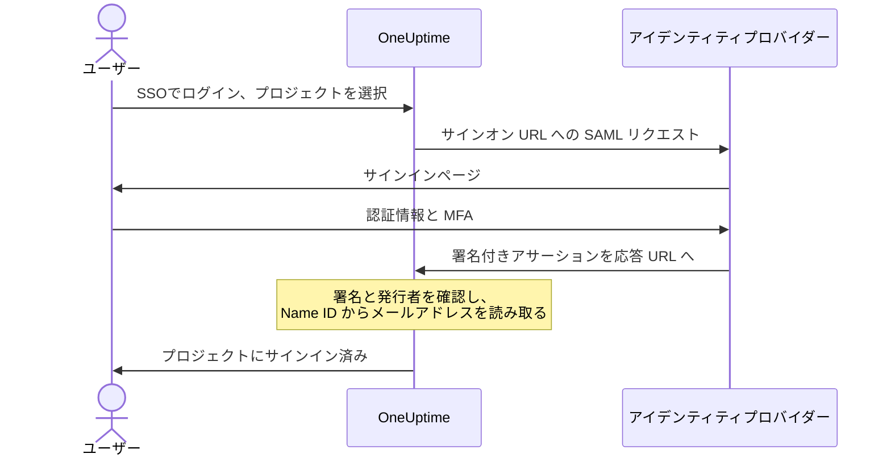

# SSO

シングルサインオン（SSO）を使うと、プロジェクトのメンバーは組織のアイデンティティプロバイダー（IdP）を通じて、SAML 2.0 または OpenID Connect で OneUptime にサインインできます。アクセス、パスワード、多要素認証を 1 か所で管理でき、プロジェクトの全員に SSO を必須にすることもできます。

> [!NOTE]
> **エディション:** SSO（「Require SSO for login」を含む）は OneUptime のすべてのエディションに含まれます。セルフホスト環境では Community Edition で利用でき、ライセンスは不要です。OneUptime Cloud では **Scale** プラン以上で利用できます。各エディションに含まれる機能については [エンタープライズ版](/docs/self-hosted/enterprise) をご覧ください。

:::cards
- [SAML プロバイダーを設定する](#sso-の設定): OneUptime で作成し、IdP に 2 つの URL を渡します。
- [アイデンティティプロバイダー別のガイド](#アイデンティティプロバイダー別のガイド): Keycloak、Microsoft Entra ID、Okta の手順。
- [OpenID Connect](#openid-connect-oidc): 代わりに OIDC アプリでサインインします。
- [SSO を必須にする](#プロジェクトで-sso-を必須にする): SSO をプロジェクトに入る唯一の方法にします。
:::

## SAML サインインの仕組み

SAML プロバイダーは、1 つのプロジェクトをアイデンティティプロバイダー内の 1 つのアプリケーションに結び付けます。サインインする人は OneUptime の **SSOでログイン** ページでプロジェクトを選び、IdP でサインインして、サインインした状態で戻ってきます。



OneUptime は、IdP が送信するアサーションから次のものだけを読み取ります。

| アサーションの項目 | OneUptime での扱い |
| --- | --- |
| 署名 | プロバイダーの **公開証明書** と照合します。レスポンスは署名されている必要があり、暗号化されていてはいけません。 |
| Issuer | プロバイダーの **発行者** と完全に一致する必要があります。 |
| Name ID | その人のメールアドレスです。有効なメールアドレスである必要があります。 |
| `http://schemas.microsoft.com/identity/claims/displayname` | その人の名前で、OneUptime がアカウントを作成するときに使います。省略可能です。 |

初めてサインインした人はプロバイダーの **チーム** に参加し、そのチームによってできることが決まります。[SSO ユーザーのロールとチーム](#sso-ユーザーのロールとチーム) をご覧ください。

> [!NOTE]
> OneUptime Cloud では、プロジェクトの SAML または OIDC プロバイダーで初めてそのプロジェクトにサインインする人に対して、OneUptime はサインインさせる代わりにリンクをメールで送ります。その人はリンクを開き、プロジェクトのシングルサインオンによるサインインを確認してから、サインインを続けます。リンクの有効期間は 24 時間です。これはプロジェクトごとに 1 回行われ、プロジェクトを離れて戻ってきたときにも再度行われます。セルフホスト環境では、すぐにサインインします。

## SSO の設定

SSO プロバイダーを追加する権限（**Project Owner**、**Project Admin**、または **Create Project SSO**）が必要です。OneUptime Cloud では、さらに **Scale** プランが必要です。アイデンティティプロバイダー側の設定については、[アイデンティティプロバイダー別のガイド](#アイデンティティプロバイダー別のガイド) をご覧ください。

:::steps
1. **プロジェクト設定に移動する**

   - OneUptime プロジェクトを開きます
   - **プロジェクト設定** > **セキュリティ** > **SSO** に移動します

2. **SSO 設定を作成する**

   - **SSOを作成** をクリックします
   - SSO 設定の **名前** を入力します（例: "Keycloak SAML" または "Okta SAML"）
   - アイデンティティプロバイダーの **サインオン URL** を入力します
   - アイデンティティプロバイダーの **発行者**（エンティティ ID）を入力します
   - アイデンティティプロバイダーの **公開証明書** を貼り付けます
   - **サインイン** ステップでは、**チーム** にプロジェクトのメンバーチームが最初から入っています。初めてサインインした人はこれらのチームに参加します。受け付けられるのは、自分が誰かを招待できるチームだけです。自分より多くのアクセス権を与えるチームは **チーム** の下に表示されます
   - それ以外は **その他の項目** に入力済みです: **署名方式**（`RSA-SHA256`）、**ダイジェストメソッド**（`SHA256`）、説明（「Sign in with」と名前）。アイデンティティプロバイダーが必要とする場合にのみ変更してください

3. **OneUptime の SSO メタデータを取得する**
   - 保存すると **SSO の設定** ダイアログが開きます。**SSO 設定を表示** ボタンでもう一度開けます
   - **識別子（エンティティ ID）** をコピーします。たとえば `https://oneuptime.com/<project-id>/<provider-id>` で、IdP の設定に必要です
   - **応答 URL（Assertion Consumer Service URL）** をコピーします。たとえば `https://oneuptime.com/identity/idp-login/<project-id>/<provider-id>` で、IdP の設定に必要です
   - 新しいプロバイダーはオフの状態で作成されます。IdP にこの 2 つの値を登録したら、プロバイダーを編集して **有効** をオンにしてください

4. **プロバイダーをテストする**
   - **シングルサインオン（SSO）をテスト** カードのリンクを開き、表示されたページでプロバイダーを選びます。アイデンティティプロバイダーのサインインページに移動し、サインインした状態で OneUptime に戻ります
   - 動作を確認できたら、プロジェクトで [SSO を必須にする](#プロジェクトで-sso-を必須にする) ことができます
:::

## アイデンティティプロバイダー別のガイド

使っているアイデンティティプロバイダーを選んでください。各ガイドでは、IdP の値を取得し、OneUptime でプロバイダーを作成してから、OneUptime の **識別子（エンティティ ID）** と **応答 URL** を IdP に渡します。

:::tabs
@tab Keycloak
Keycloak は、人気のあるオープンソースの ID およびアクセス管理ソリューションです。レルムのある稼働中の Keycloak インスタンスと、Keycloak と OneUptime の両方への管理者アクセスが必要です。

:::steps
1. **レルムの値を集める**

   - **サインオン URL**: `https://<your-keycloak-domain>/auth/realms/<your-realm>/protocol/saml`
   - **発行者**: `https://<your-keycloak-domain>/auth/realms/<your-realm>`
   - **証明書**: レルムの署名証明書です。`https://<your-keycloak-domain>/auth/realms/<your-realm>/protocol/saml/descriptor` を開いて `X509Certificate` の値をコピーするか、**Realm settings** > **Keys** を開いて RS256 キーの **Certificate** をクリックします

   Keycloak 17 以降では、これらの URL に `/auth` プレフィックスが付きません。証明書は、次のように専用の行で挟んで入力します。

   ```text
   -----BEGIN CERTIFICATE-----
   MIICnzCCAYcCBgFyPZ8QFzANBgkqhkiG.......
   -----END CERTIFICATE-----
   ```

2. **OneUptime でプロバイダーを作成する**

   **プロジェクト設定** > **セキュリティ** > **SSO** に移動し、**SSOを作成** をクリックして次のように入力します。
   - **名前**: わかりやすい名前（例: `my-project-oneuptime`）
   - **サインオン URL** と **発行者**: 上の値
   - **公開証明書**: 専用の `BEGIN CERTIFICATE` 行と `END CERTIFICATE` 行で挟んだ証明書
   - **署名方式** と **ダイジェストメソッド**: **その他の項目** に設定済みです（`RSA-SHA256` と `SHA256`）

   保存し、開いたダイアログから **識別子（エンティティ ID）** と **応答 URL（Assertion Consumer Service URL）** をコピーします。

3. **Keycloak クライアントを作成する**

   Keycloak でレルムの **Clients** を開き、クライアントを作成するか、既存のクライアントを編集します。
   - **Client Protocol**（クライアントタイプ）: `saml`
   - **Client ID**: OneUptime の **識別子（エンティティ ID）**
   - **Root URL** と **Valid Redirect URIs**: OneUptime の URL
   - **Assertion Consumer Service POST Binding URL**: OneUptime の **応答 URL（Assertion Consumer Service URL）**

4. **クライアントの設定を調整する**

   - **Name ID Format** を `email` に設定し、**Force Name ID Format** をオンにして、Keycloak が常にメールアドレスを Name ID として送るようにします
   - クライアントの **Keys** タブで、**Client signature required**（**Signing keys config** 内）をオフにします。OneUptime はリクエストに署名しません

5. **プロバイダーをオンにしてテストする**

   OneUptime でプロバイダーを編集して **有効** をオンにし、**シングルサインオン（SSO）をテスト** カードのリンクを開いてプロバイダーを選びます。Keycloak のサインインページに移動し、OneUptime に戻れば成功です。
:::
@tab Microsoft Entra ID
Microsoft Entra ID（旧称 Azure AD / Active Directory）は、Microsoft のクラウド ID サービスです。SAML SSO のエンタープライズアプリケーションに対応したテナントと、Entra ID と OneUptime の両方への管理者アクセスが必要です。

:::steps
1. **Entra ID でエンタープライズアプリケーションを作成する**

   - [Microsoft Entra admin center](https://entra.microsoft.com) にサインインします
   - **Identity** > **Applications** > **Enterprise applications** に移動し、**+ New application**、続いて **+ Create your own application** をクリックします
   - 名前（例: "OneUptime"）を入力し、**Integrate any other application you don't find in the gallery (Non-gallery)** を選んで **Create** をクリックします

2. **Entra ID の SAML の値をコピーする**

   - アプリケーションで **Single sign-on** に移動し、**SAML** を選びます
   - **SAML Certificates** で **Certificate (Base64)** をダウンロードし、ファイルをテキストエディターで開いて内容をコピーします
   - **Set up OneUptime** で **Login URL** と **Microsoft Entra Identifier**（古いテナントでは **Azure AD Identifier**）をコピーします

3. **OneUptime でプロバイダーを作成する**

   **プロジェクト設定** > **セキュリティ** > **SSO** に移動し、**SSOを作成** をクリックして次のように入力します。
   - **名前**: わかりやすい名前（例: `Azure AD SAML`）
   - **サインオン URL**: **Login URL**
   - **発行者**: **Microsoft Entra Identifier**
   - **公開証明書**: `BEGIN CERTIFICATE` 行と `END CERTIFICATE` 行を含む Base64 の証明書
   - **署名方式** と **ダイジェストメソッド**: **その他の項目** に設定済みです（`RSA-SHA256` と `SHA256`）

   保存し、開いたダイアログから **識別子（エンティティ ID）** と **応答 URL（Assertion Consumer Service URL）** をコピーします。

4. **OneUptime の URL を Entra ID に渡す**

   **Basic SAML Configuration** で **Edit** をクリックし、次のように設定します。
   - **Identifier (Entity ID)**: OneUptime の **識別子（エンティティ ID）**
   - **Reply URL (Assertion Consumer Service URL)**: OneUptime の **応答 URL**

   **Save** をクリックします。

5. **メールアドレスを Name ID として送る**

   **Attributes & Claims** で **Edit** をクリックします。
   - **Unique User Identifier (Name ID)** をユーザーのメールアドレスに設定します。`user.mail`、またはメールアドレスになっている場合は `user.userprincipalname` です
   - **Name identifier format** を `Email address` に設定します
   - 必要に応じて、名前が `http://schemas.microsoft.com/identity/claims/displayname` でソース属性が `user.displayname` のクレームを追加すると、新しいアカウントにその人の名前が入ります。OneUptime はそれ以外のクレームを無視します

6. **ユーザーとグループを割り当てる**

   アプリケーションの **Users and groups** で **+ Add user/group** をクリックし、SSO でアクセスさせるユーザーとグループを選んで **Assign** をクリックします。

7. **プロバイダーをオンにしてテストする**

   OneUptime でプロバイダーを編集して **有効** をオンにし、**シングルサインオン（SSO）をテスト** カードのリンクを開いてプロバイダーを選びます。Microsoft のサインインページに移動し、OneUptime に戻れば成功です。
:::
@tab Okta
Okta は、SAML SSO を備えた広く使われている ID プラットフォームです。管理者アクセスのある Okta の組織と、OneUptime への管理者アクセスが必要です。

:::steps
1. **Okta で SAML アプリケーションを作成する**

   - Okta Admin Console で **Applications** > **Applications** に移動し、**Create App Integration** をクリックします
   - **SAML 2.0** を選んで **Next** をクリックし、**App name** に "OneUptime" と入力して **Next** をクリックします
   - Okta は自分の URL を表示する前に OneUptime の URL を求めます。ひとまず OneUptime のアドレス（例: `https://oneuptime.com`）を **Single sign-on URL** と **Audience URI (SP Entity ID)** に入力してください。どちらもステップ 4 で置き換えます
   - **Name ID format** を `EmailAddress` に、**Application username** を `Email` に設定します
   - **Next** をクリックし、**I'm an Okta customer adding an internal app** を選んで **Finish** をクリックします

2. **Okta の SAML の値をコピーする**

   アプリケーションの **Sign On** タブの **SAML Signing Certificates** で、有効な証明書を探します。
   - **Actions** > **View IdP metadata** をクリックし、**サインオン URL**（Identity Provider Single Sign-On URL）と **発行者**（Identity Provider Issuer）をコピーします
   - **Actions** > **Download certificate** をクリックし、`.cert` ファイルをテキストエディターで開いて内容をコピーします

3. **OneUptime でプロバイダーを作成する**

   **プロジェクト設定** > **セキュリティ** > **SSO** に移動し、**SSOを作成** をクリックして次のように入力します。
   - **名前**: わかりやすい名前（例: `Okta SAML`）
   - **サインオン URL** と **発行者**: Okta の値
   - **公開証明書**: `BEGIN CERTIFICATE` 行と `END CERTIFICATE` 行を含む証明書
   - **署名方式** と **ダイジェストメソッド**: **その他の項目** に設定済みです（`RSA-SHA256` と `SHA256`）

   保存し、開いたダイアログから **識別子（エンティティ ID）** と **応答 URL（Assertion Consumer Service URL）** をコピーします。

4. **OneUptime の URL を Okta に渡す**

   アプリケーションの **General** タブで、**SAML Settings** の **Edit** と **Next** をクリックし、次のように設定します。
   - **Single sign-on URL**: OneUptime の **応答 URL（Assertion Consumer Service URL）**
   - **Audience URI (SP Entity ID)**: OneUptime の **識別子（エンティティ ID）**

   必要に応じて、名前が `http://schemas.microsoft.com/identity/claims/displayname` で値が `user.firstName + " " + user.lastName` の attribute statement を追加すると、新しいアカウントにその人の名前が入ります。**Next**、続いて **Finish** をクリックします。

5. **ユーザーを割り当てる**

   **Assignments** タブで **Assign** > **Assign to People** または **Assign to Groups** をクリックし、SSO でアクセスさせる人を選んで、それぞれ **Assign** をクリックしてから **Done** をクリックします。

6. **プロバイダーをオンにしてテストする**

   OneUptime でプロバイダーを編集して **有効** をオンにし、**シングルサインオン（SSO）をテスト** カードのリンクを開いてプロバイダーを選びます。Okta のサインインページに移動し、OneUptime に戻れば成功です。
:::
@tab その他
OneUptime の SSO は SAML 2.0 を使い、準拠したあらゆるアイデンティティプロバイダーで動作します。

:::steps
1. アイデンティティプロバイダーの **サインオン URL**（SSO エンドポイント）、**発行者**（エンティティ ID）、**公開証明書**（X.509 署名証明書）を取得します。アプリケーションを作成しないと IdP に表示されない場合は、OneUptime のアドレスを仮の URL にしてアプリケーションを作成します。
2. OneUptime でこれらの値を使ってプロバイダーを作成し、**SSO の設定** ダイアログ（または **SSO 設定を表示**）から **識別子（エンティティ ID）** と **応答 URL（Assertion Consumer Service URL）** をコピーします。
3. アイデンティティプロバイダーの SAML アプリケーションで、**Assertion Consumer Service URL / Reply URL** と **Entity ID / Audience URI** を OneUptime の値に、**Name ID Format** をメールアドレスに設定します。
4. **署名方式**（`RSA-SHA256`）と **ダイジェストメソッド**（`SHA256`）は **その他の項目** に設定済みです。アイデンティティプロバイダーの署名方法が異なる場合にのみ変更してください
5. プロバイダーの **有効** をオンにし、**シングルサインオン（SSO）をテスト** カードのリンクでテストします。
:::
:::

## OpenID Connect (OIDC)

プロジェクトは、Google Workspace、Okta、Microsoft Entra ID、Auth0、Keycloak などの OpenID Connect プロバイダーでサインインすることもできます。OIDC プロバイダーを追加する権限（**Project Owner**、**Project Admin**、または **Create Project OIDC**）が必要で、OneUptime Cloud ではさらに **Scale** プランが必要です。

:::steps
1. アイデンティティプロバイダーに、PKCE 付きの認可コードフローを使えるアプリ（OIDC クライアント）を登録し、その **発行者 URL**、**クライアント ID**、**クライアントシークレット** をコピーします。
2. OneUptime で **プロジェクト設定** > **セキュリティ** > **OIDC** に移動し、**OIDCを作成** をクリックします。
3. **名前**（サインインページに表示されます）、**発行者 URL**、**クライアント ID**、**クライアントシークレット** を入力します。**発行者 URL** には、プロバイダーのディスカバリ URL を貼り付けることもできます。
4. **サインイン** ステップでは、**チーム** にプロジェクトのメンバーチームが最初から入っています。初めてサインインした人はこれらのチームに参加します。それ以外は **その他の項目** に入力済みです: **ディスカバリ URL**（発行者の後に `/.well-known/openid-configuration` を付けたもの）、**スコープ**（`openid email profile`）、`email` と `name` のクレーム名、説明（「Sign in with」と名前）。プロバイダーが必要とする場合にのみ変更してください。受け付けられるのは、自分が誰かを招待できるチームだけです。自分より多くのアクセス権を与えるチームは **チーム** の下に表示されます。
5. 保存します。**OIDC の設定** ダイアログが開き、**リダイレクト URI** が表示されます。これをアプリの許可されたリダイレクト URI に追加してください。新しいプロバイダーはオフの状態で作成されるので、その後プロバイダーを編集して **有効** をオンにします。
6. プロジェクトで SSO を必須にする前に、**OpenID Connect（OIDC）をテスト** カードのリンクを使ってプロバイダーでサインインしてみてください。
:::

## SSO ユーザーのロールとチーム

OneUptime は、アイデンティティプロバイダーのロールやグループを取り込みません。その人ができることは、所属するチームで決まります。プロバイダーは新しい人を自分の **チーム** に追加し、チームとその権限は、[ユーザー、チーム、権限](/docs/permissions/index) で説明しているとおり OneUptime で管理します。チームのメンバー構成をアイデンティティプロバイダーと同期させるには、[SCIM](/docs/identity/scim) を使ってください。

プロバイダーのチームが、そのプロバイダーでサインインする人のできることを決めるので、プロバイダーは、保存する人が誰かを招待できるチームとだけ保存できます。保存するたびにチームが再確認されます。自分より多くのアクセス権を与えるチームを持つプロバイダーは、プロジェクトのオーナーなど、そのチームをカバーするアクセス権を持つ人しか変更できません。この確認が導入される前に保存されたプロバイダーは、引き続き人をそのチームにサインインさせます。プロバイダーを編集できる人は誰でも、すぐに止められるように、引き続きプロバイダーをオフにできます。

## プロジェクトで SSO を必須にする

プロバイダーを設定しても、パスワードでのサインインは止まりません。SSO をプロジェクトに入る唯一の方法にするには、**プロジェクト設定** > **セキュリティ** > **SSO** のプロバイダーの下にある **ログインに SSO を必須にする** スイッチを使います。

:::steps
1. まず **シングルサインオン（SSO）をテスト** カードのリンクでプロバイダーをテストします。
2. **ログインに SSO を必須にする** をオンにします。OneUptime は保存する前に確認します。以後、あなたを含むプロジェクトの全員がプロジェクトを開くには SSO でサインインする必要があり、パスワードでサインインしている人は SSO でサインインするまでプロジェクトから締め出されます。
3. **SSO を必須にする** をクリックして確定します。スイッチはすぐに保存され、別の保存ボタンはありません。
:::

**ログインに SSO を必須にする** をオンにするには、プロジェクトに人をサインインさせるプロバイダーが必要です。オンになっているプロジェクト自身の SAML または OIDC プロバイダーか、オンになっていてそのプロジェクトに人をサインインさせるグローバルプロバイダーです。どちらもない場合、OneUptime は拒否し、先にプロジェクトのプロバイダーをオンにしてテストするよう求めます。プロジェクトで必須にするプロバイダーを選ぶ場合はそのどちらかである必要があり、後で別のプロバイダーを必須にするときにも同じ確認が行われます。

すでにオンになっている **ログインに SSO を必須にする** をオンとして送る保存や、プロジェクトがすでに必須にしているプロバイダーを指定する保存も、同じように確認されます。API、Terraform などのツールは、保存のたびにすべての設定を送ることがよくあるためです。そのため、プロジェクトに人をサインインさせるプロバイダーがない間や、必須のプロバイダーがその後オフにされた場合、そのような保存は、ほかに何を変更していても同じ文言で拒否されます。先にプロバイダーをオンにするか、別のプロバイダーを必須にするか、**ログインに SSO を必須にする** をオフにしてください。

新しいプロジェクトにも同じルールが適用されます。新しいプロジェクトにはまだ自身のプロバイダーがないので、**ログインに SSO を必須にする** をオンにした状態で作成する（これができるのはマスター管理者だけです）には、オンになっていてすべてのプロジェクトに人をサインインさせるグローバルプロバイダーが必要で、ない場合は同じ文言で拒否されます。プロジェクトを作成し、そのプロバイダーを設定してテストしてから、スイッチをオンにしてください。

サーバー全体で SSO が必須になっている間（**Admin** > **設定** > **認証** > **ログインに SSO を必須にする**）は、どのプロジェクトを作成するにもそのようなグローバルプロバイダーが必要です。そうでないと、作成者を含めて誰もプロジェクトを開けなくなるからです。ない場合、プロジェクトの作成は拒否され、メッセージはサーバー管理者にプロバイダーをオンにするよう求めます。マスター管理者は引き続きプロジェクトを作成できます。

**ログインに SSO を必須にする** をオフにすると、スイッチを切り替えた時点で保存され、メンバーはすぐにパスワードで入れるようになります。ただし、まさに同じ瞬間に誰かが再びオンにした場合は、アプリサーバーが追従するまで最大 1 分かかることがあります。変更できるのは、プロジェクトのオーナー、プロジェクトの管理者、**Edit Project** 権限を持つメンバーです。それ以外の人にはスイッチがロックされた状態で表示され、必要な権限も表示されます。

> [!NOTE]
> OneUptime Cloud では、SSO を必須にするには **Scale** プランが必要ですが、オフにすることはどのプランでもできます。Scale 未満では、**プロジェクト設定** > **セキュリティ** > **SSO** にプランのアップグレード案内が表示されます。Scale の試用期間が終わって SSO が必須のまま残ったプロジェクトでは、オフにできるように、その案内の下に **ログインに SSO を必須にする** も表示されます。再びオンにするには **Scale** が必要です。

## プロバイダーをオフにする、または削除する

| 変更内容 | そのプロバイダーでサインインした人 |
| --- | --- |
| オフにする、または削除する | SSO が必須の場所では、次のリクエストで SSO で再度サインインする |
| 新しい証明書やクライアントシークレット、別の URL、新しい名前、別のチーム | サインインしたまま |
| オンにする | すぐにそのプロバイダーでサインインできる |

SAML または OIDC プロバイダーをオフにするか削除すると、そのプロバイダーで行われたサインインは終了します。プロジェクト自身が SSO を必須にしている場合、またはサーバー全体が必須にしているためにプロジェクトで SSO が必須の場合は次のようになります。

- そのプロバイダーでサインインした人は全員、次のリクエストで SSO で再度サインインする必要があり、開いているページはすぐにライブ更新を受け取らなくなります。
- そのプロバイダーでサインインした後に誰かが接続した MCP クライアントは、そのプロジェクトで動作しなくなります。SSO でサインインしてから接続し直してください。
- プロバイダーを再びオンにしても、それらのサインインは戻りません。そのプロバイダーで改めてサインインします。

プロバイダーのそれ以外の変更では、全員がサインインしたままです。新しい証明書やクライアントシークレット、別の URL、新しい名前、別のチームなどです。サインインは行われた時点で確認されており、次のサインインでは新しい設定が使われます。

プロジェクトで SSO が必須の間、OneUptime は入り口を確保します。プロジェクトにサインインできる最後のプロバイダー（そのプロジェクトに人をサインインさせるグローバルプロバイダーも数えます）や、プロジェクトが必須にしているプロバイダーは、オフにすることも削除することもできません。先に **ログインに SSO を必須にする** をオフにしてください。

プロバイダーをオンにすると、すぐにそのプロバイダーでサインインできるようになります。

サーバー全体で SSO が必須の場合（**Admin** > **設定** > **認証** > **ログインに SSO を必須にする**）は、プロジェクト自身が SSO を必須にしていなくても、すべてのプロジェクトで同じように入り口が確保されます。先にそのプロジェクトの別のプロバイダーをオンにしてください。

グローバルプロバイダーにも同じルールが適用されます。グローバルプロバイダーやその接続先プロジェクトへの変更によって、SSO が必須のプロジェクトにプロバイダーがなくなる場合、その変更はプロジェクト名を示して拒否されます。[グローバル SSO](/docs/identity/global-sso#プロバイダーをオフにするまたは削除する) をご覧ください。

プロジェクトでもサーバーでも SSO が必須でない場合、プロバイダーをオフにすると、そのプロバイダーでの新しいサインインが止まります。すでにサインインしている人は、パスワードでサインインした人と同じように、サインインしたままです。

## Scale プラン未満に残ったプロバイダー

プロジェクトに残っている SAML または OIDC プロバイダーは、Scale の試用期間が終わったりプランが下がったりした後も、人をサインインさせ続けます。そのため Scale 未満では、**SSO** ページと **OIDC** ページに、アップグレード案内の下にプロジェクトのプロバイダーが一覧表示されます（**まだ設定されている SAML プロバイダー**、**まだ設定されている OIDC プロバイダー**）。

- **オフにする** は、プロバイダーをすぐに止めます。OneUptime は事前に確認します。
- **削除** は、プロバイダーを削除します。

プロバイダーの追加、変更、再びオンにするには **Scale** が必要です。それぞれを行える人は Scale のときと同じです。プロバイダーをオフにするにはその編集権限が、削除するにはその削除権限が必要です。

プロジェクトでまだ SSO が必須の間は、**SSO** ページと **OIDC** ページに **ログインに SSO を必須にする** も表示されます。最後のプロバイダーをオフにする前に、これをオフにしてください。それまでは、人がサインインできる最後のプロバイダーはオフにすることも削除することもできないので、誰もプロジェクトから締め出されません。

ステータスページの **SSO** ページと **OIDC** ページにも、同じようにそのステータスページ自身のプロバイダーが一覧表示されます。ステータスページでまだ SSO が必須の間は、両方のページに **ログインに SSO を必須にする** も表示されます。プロバイダーをオフにする前にこれをオフにしてください。そうしないと、そのステータスページのプライベートユーザーはまったくサインインできなくなります。

## トラブルシューティング

:::details "SSO Config not found"
プロバイダーがオフになっているか、リンクが存在しなくなったプロバイダーを指しています。新しいプロバイダーはオフの状態で作成されます。プロバイダーを編集して **有効** をオンにしてください。
:::

:::details "No teams added."
その人はまだプロジェクトに参加しておらず、プロバイダーにはその人を追加する **チーム** がありません。プロバイダーを編集して、プロジェクトのメンバーチームなど、少なくとも 1 つのチームを選んでください。
:::

:::details "Issuer URL does not match"
IdP のアサーションに含まれる発行者が、プロバイダーの **発行者** と一致していません。IdP から（Keycloak のレルム URL、**Microsoft Entra Identifier**、Okta の Identity Provider Issuer を）コピーし直して、2 つが完全に一致するようにしてください。
:::

:::details 署名または証明書のエラーでサインインに失敗する
IdP の現在の署名証明書を、`BEGIN CERTIFICATE` 行と `END CERTIFICATE` 行を含めて **公開証明書** に貼り付けてください。Entra ID では未加工の証明書ではなく **Base64** の証明書を、Okta では有効な署名証明書を、Keycloak では正しいレルムの証明書をダウンロードします。
:::

:::details "Encrypted SAML Responses are not supported"
OneUptime はアサーションを復号しません。IdP でアプリケーションのアサーション暗号化をオフにし、暗号化されていない署名付きアサーションを送るようにしてください。
:::

:::details "SAML response did not include a valid email address"
OneUptime はメールアドレスを Name ID から読み取ります。Name ID をユーザーのメールアドレスに設定してください。Keycloak では **Name ID Format** `email` と **Force Name ID Format**、Entra ID では **Unique User Identifier (Name ID)**、Okta では **Name ID format** `EmailAddress` と **Application username** `Email` です。アドレスは、その人の OneUptime アカウントと一致している必要があります。
:::

:::details Entra ID: AADSTS700016
Entra ID の **Identifier (Entity ID)** が OneUptime の値と一致していません。**SSO 設定を表示** からコピーし直してください。2 つの値は同一である必要があります。
:::

:::details Okta: 404、または audience の不一致
Okta の **Single sign-on URL** は OneUptime の **応答 URL** と、**Audience URI** は OneUptime の **識別子（エンティティ ID）** と完全に一致している必要があります。どちらも仮の値から置き換えたことを確認してください。
:::

:::details ユーザーがアプリケーションに割り当てられていない
Entra ID と Okta は、アプリケーションに割り当てられた人しかサインインさせません。ユーザー、またはそのユーザーが所属するグループを割り当ててください。
:::

:::details Keycloak: リダイレクトのループ
正しいレルムのクライアントで、**Valid Redirect URIs** と **Assertion Consumer Service POST Binding URL** が上記のとおりに設定されていることを確認してください。
:::

## 次のステップ

:::cards
- [グローバル SSO](/docs/identity/global-sso): セルフホストのインスタンス上のすべてのプロジェクトに、1 つのアイデンティティプロバイダーを使う。
- [SCIM](/docs/identity/scim): アイデンティティプロバイダーに人の追加と削除を自動で任せる。
- [ユーザー、チーム、権限](/docs/permissions/index): 新しい人が参加するチームで何ができるようになるか。
:::
