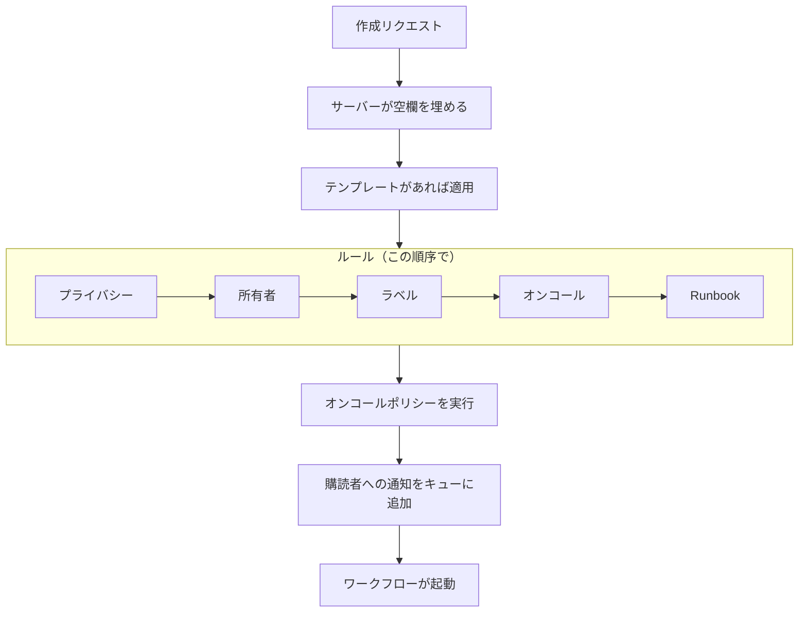
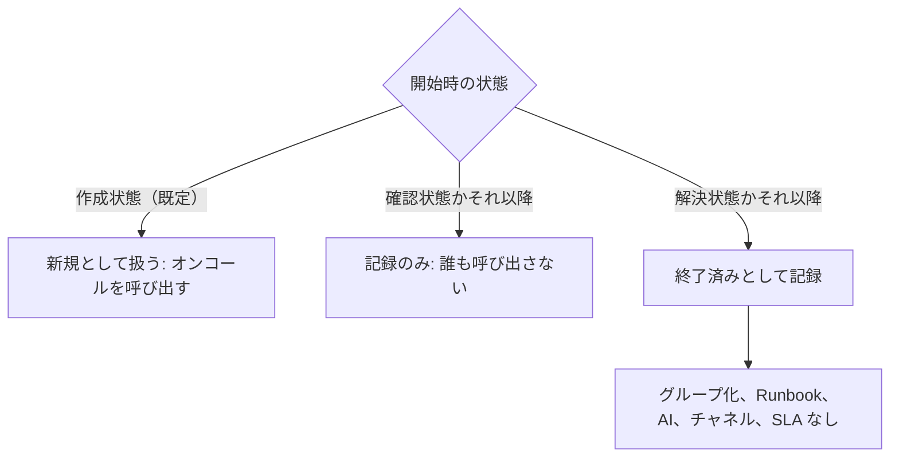

# インシデントの宣言

インシデントを宣言すると、チームが拠り所にする記録が作られます。番号、重大度、開始時の状態が付き、オンコールポリシーが担当者を呼び出し、特に指定しない限りステータスページの購読者にも知らされます。このページでは、インシデントを宣言する 5 つの方法を項目ごとに説明し、インシデントができた瞬間に何が起きるかを解説します。

:::cards
- [手動で宣言する](#手動で宣言する): 3 ステップのフォームを項目ごとに。
- [テンプレートから宣言する](#テンプレートから宣言する): 同じ種類のインシデントを、毎回入力済みの状態で。
- [モニターの条件から宣言する](#モニターの条件から自動で宣言する): 失敗したチェックに開いてもらいます。
- [API で宣言する](#api-で宣言する): 自分のコード、スクリプト、他のツールから。
:::

## インシデントが宣言される 5 つの方法

インシデントが OneUptime に入る方法は 5 つあり、行き着く先はすべて同じです。重大度、現在の状態、影響を受けるリソースの一覧を持つ、`Incident` テーブルの 1 行です。違うのは、誰が項目を埋めるかだけです。午前 3 時のあなた、保存済みのテンプレート、モニターの条件、API を呼び出す自分のコード、あるいはフォームに入力するチーム外の誰かです。

| やりたいこと                                                 | 選ぶもの                                                                    |
| ------------------------------------------------------------ | --------------------------------------------------------------------------- |
| すべてを入力して手動でインシデントを開く                     | **インシデントを宣言** ウィザード                                           |
| 繰り返し起きる種類のインシデントを、項目を入力済みで開く     | **テンプレートから作成**                                                    |
| モニターのチェックが失敗したときに自動で開く                 | **フィルターが一致したとき、インシデントを宣言します。** を有効にしたモニターの条件フィルター |
| 自分のコード、スクリプト、他のツールから開く                 | `POST /api/incident`                                                        |
| チーム外の人にリンクから問題を報告してもらう                 | [フォーム](/docs/forms/index)                                               |

5 つとも同じモデルに書き込むので、プローブが開いたインシデントは、対応者が手動で開いたものとまったく同じに見えます。違いは、自動で作られたものにサーバーが設定するいくつかの管理用の列だけです。連携機能も同じモデルに書き込みます。[Huntress](/docs/integrations/huntress) は、SOC から届くインシデントレポートごとに 1 つのインシデントを開きます。

> [!TIP]
> アラートからインシデントを宣言することもできます。アラート一覧、アラートのヘッダー、またはアラートの **リンクされたインシデント** ページで **インシデントを宣言** を使うと、アラートの内容が入力済みの同じウィザードが開き、アラートが新しいインシデントにリンクされます。フォームにある既定でオンのチェックボックスはアラートの確認も行うので、アラートのエスカレーションが止まります。[リンクされたアラート](/docs/incidents/linked-alerts) を参照してください。

## 手動で宣言する

**新しいインシデントを宣言** フォームは、**インシデントの詳細**、**影響を受けるリソース**、**オンコールとロール** の 3 ステップでインシデントの内容を尋ね、最後に確認用のサマリーを表示します。プロジェクトが作成時にインシデントのカスタムフィールドの一部を尋ねる設定になっている場合は、**影響を受けるリソース** のすぐ後に 4 つ目のステップ **詳細** が加わります。

:::steps
1. **インシデント → すべてのインシデント** を開き、**インシデント** 一覧の右上にある **インシデントを宣言** をクリックします。フォームは **インシデントの詳細** から始まります。
2. **タイトル** を入力し、**インシデントの重大度** を選びます。フォームの残りは任意です。
3. **次へ** をクリックして残りのステップを進み、今わかっていること（モニターやその他のリソース、オンコールポリシー、ロール）を入力します。
4. サマリーを確認して **インシデントを宣言** をクリックします。新しいインシデントが開き、その **インシデントのフィード** が記録を始めます。
:::

必須の項目があるのは最初のステップだけです。加えて、管理者が **作成時に必須** にしたカスタムフィールドがあれば、**詳細** ステップで尋ねられます。サマリーより前のステップにはどれも単なる **次へ** があり、**インシデントを宣言** は最後のステップであるサマリーにあります。急いでいるときは、**インシデントの詳細** を入力し、他のステップは何も入力せずに **次へ** で進めてかまいません。リソースの追加、オンコールポリシーの追加、ロールの割り当ては、インシデント自身のページで後から行えます。項目内で **Enter** を押しても先に進みますが、サマリーより前に宣言されることはありません。

> [!TIP]
> ほとんどのインシデントで不要なオプションは、各ステップの最後にある **その他の項目** の見出しの下に折りたたまれています。クリックすると開きます。折りたたまれている間、見出しには中身の名前と、設定されている各オプションとその値が表示されます（たとえばテンプレートや、宣言元のプライベートなアラートによって設定されたもの）。中の何かを直す必要があるときは、自動で開きます。サマリーにこうしたオプションが載るのは設定されているときだけですが、**ステータスページの購読者に通知** だけは例外で、誰に通知されるかとともに常に表示されます。

**リソース自身のページから。** モニター、ホスト、サービス、クラスター、その他ほとんどのリソースの **インシデント** タブで **インシデントを宣言** を使うと、そのリソースが **影響を受けるリソース** ですでに選ばれた状態で同じフォームが開きます。タイトルと重大度を入力するだけで済み、インシデントは開始したタブに表示されます。

:::details どのリソースのページで使えて、何が選ばれるか
モニター、ホスト、Kubernetes・Proxmox・Ceph・Docker Swarm のクラスター、Docker や Podman のホスト、vCenter、ストレージアレイ、IoT フリート、データベース、サービスの **インシデント** タブで **インシデントを宣言** を使うと、そのリソースが **影響を受けるリソース** ですでに選ばれた状態で同じウィザードが開きます（モニターは **モニター** に、それ以外は **その他の影響を受けるリソース** に入ります）。テンプレートが追加するものより前に入ります。そのタブの **テンプレートから作成** でもリソースは保たれます。パンくずリストはリソースのタブを経由して戻り、宣言後はインシデント一覧から宣言したときと同じく新しいインシデントが開きます。

インベントリ項目の **インシデント** タブでは、その項目が指すホスト、サービス、または Kubernetes クラスターが選ばれ、パンくずリストはそのリソースのタブを経由して戻ります。リソースの **アラート** タブの **アラートを作成** も同じように動作します。モニターからはアラートの **モニター** が、それ以外からは **その他の影響を受けるリソース** が入力されます。

リソースはあなた自身の権限で検索されます。読み取る権限がない場合や、リソースが削除されている場合、フォームは何も選ばれていない状態で開くだけです。
:::

### ステップ 1 — インシデントの詳細

- **タイトル** — 必須。一覧、Slack、そして（インシデントが表示される場合は）ステータスページで全員が目にする 1 行の要約です。プレースホルダーは `Incident Title` です。
- **インシデントの重大度** — 必須。プロジェクトに設定された重大度の 1 つです。新しいプロジェクトには **Critical Incident**、**Major Incident**、**Minor Incident** が用意されています。
- **説明** — 任意で、Markdown で書きます。ステータスページに表示されるのはこの項目なので、チーム向けではなく顧客向けに書いてください。ここに入れた画像は、インシデントがステータスページに表示されている間は全員に、非表示の間はプロジェクトのメンバーにだけ表示されます。後からインシデントのサイドメニューの **説明** で編集できます。

**その他の項目** の下には次のものがあります。

- **宣言日時** — ページを開いた時刻から始まります。インシデントのすべての期間はこのタイムスタンプから計測されるので、もっと前に始まった出来事を記録する場合は日時をさかのぼらせてください。
- **初期状態** — 任意で、最初は空です。空のままにすると、インシデントは `isCreatedState` フラグを持つ状態（新しいプロジェクトでは **原因特定**）から始まります。テンプレートから宣言する場合は、テンプレートの初期状態から始まります。より後の状態を選ぶのは、すでにその段階を過ぎた（確認済みまたは解決済みの）インシデントを記録するときだけにしてください。そうしたインシデントは誰も呼び出しません。[確認済みまたは解決済みの状態で宣言されたインシデント](#確認済みまたは解決済みの状態で宣言されたインシデント) を参照してください。
- **ラベル** — 任意。ラベルは関連するインシデントをまとめて絞り込めるようにします。また、権限がラベルで制限されたチームには、そのチームのラベルのいずれかを持つインシデントだけが表示されます。
- **プライベートインシデント** — チェックボックスで、既定ではオフです（`isPrivate`）。プライベートインシデントが見えるのは、所有者ユーザー、所有者チームのメンバー、プロジェクト管理者、プロジェクト所有者だけです。また、他のどの設定にかかわらず、限定先のステータスページも含めて、すべてのステータスページで非表示になります。インシデント一覧では、こうしたインシデントに赤い **非公開** ピルが付きます。

> [!NOTE]
> **アラートとエピソードも、選んだ状態から始まります。** **アラートを作成** と、インシデントとアラートのエピソード一覧にある **エピソードを作成** にも、**その他の項目** の下に同じ **初期状態** があります。空のままにすると、アラートやエピソードはプロジェクトの作成状態から始まります。すでに確認済みや解決済みだったものを記録するには、より後の状態を選びます。その状態から始まり、状態タイムラインもその状態から始まり、解決済みとして記録したエピソードはすぐに解決済みとして扱われます。その最初の状態だけを理由に所有者へ通知されることはなく、インシデントエピソードのステータスページの購読者には、エピソードの作成時に 1 回だけ知らされます。こうして記録したアラートやエピソードは、インシデントと同じく誰も呼び出しません。[確認済みまたは解決済みの状態で宣言されたインシデント](#確認済みまたは解決済みの状態で宣言されたインシデント) を参照してください。API では、同じ選択を `currentAlertStateId` または `currentIncidentStateId` で行います。[OneUptime API リファレンス](/docs/api-reference/api-reference) を参照してください。

:::details Markdown エディターでの書き方
説明は、メモ、根本原因、修復、リッチテキストのカスタムフィールドと同じく、Markdown エディターで書きます。エディターはテキストを書式付きで表示するビジュアルモードで開きます。ツールバーの **Markdown** で Markdown のソースを表示する Markdown モードに切り替わり、**ビジュアル** で元に戻ります。リストの中では、ツールバーの **インデント** と **インデント解除**、または Tab と Shift+Tab で、項目を上の項目の下に入れ子にしたり、外に戻したりできます。入れ子にする先がない場所やリストの外では、Tab は通常どおり次の項目に移ります。ビジュアルモードでは、行の途中や行末で **コードブロック**、**テーブル**、**タスクリスト** を使うと、カーソル位置で行が分かれ、新しいブロックが独立した行に入ります。太字の語、リンク、インラインコードの端でも同様で、空の書式が残ることはありません。リストの項目で **タスクリスト** を使うと、サブタスクではなく、その項目のリストにタスクが追加されます。Markdown モードでは、**コードブロック** と **テーブル** はカーソル位置に入るので、先に新しい行を始めてください。**タスクリスト** はカーソルのある行をタスクに変え、**番号付きリスト** は入れ子のリストの各レベルを 1 から番号付けします。ツールバーは 1 行に収まります。エディターのあるフォームは幅の広いダイアログで開くので、ほとんどの画面ではすべてのボタンが収まります。スマートフォンや狭いウィンドウなど収まらない場合は、収まらないボタンがツールバー末尾の **その他の書式**（**⋯**）の下に同じ順序で入り、そこで選んだものはカーソルのあった位置に入ります。最も狭い画面では、**Markdown** の切り替えもその下に移ります。

**元に戻す。** ビジュアルモードでは、Ctrl+Z（Mac では Cmd+Z）で変更を新しいものから 1 つずつ取り消せます。入力した文字も、エディター自身による編集（インデントやインデント解除、行に挿入したブロック、書式付きやブロックの貼り付け）も同じです。Ctrl+Shift+Z（Cmd+Shift+Z）または Ctrl+Y で同じ順序でやり直せます。Markdown モードでは、Ctrl+Z でインデントやインデント解除、リストボタンによる変更、書式付きの貼り付けを取り消せますが、**コードブロック**、**テーブル**、**水平線** ボタンが入れたものは取り消せません。

**貼り付け。** Word、Google ドキュメント、または他のインシデントの説明などの OneUptime のページから貼り付けると、リストとその入れ子、リンク、書式が保たれ、貼り付けた `•` の箇条書きは本物のリストになります。GitHub の見出しの横にあるアンカーのような、アイコンだけのリンクは除かれます。ビジュアルモードでは、行の中に貼り付けたコードや引用は行を分けて独立したブロックになり、リストの項目に貼り付けたリストは、その中に入れ子になるのではなく項目のリストに加わります。Enter で残る空の項目に貼り付けた場合は、その項目と置き換わります。一方、項目に貼り付けたコードブロック、引用、テーブルはその項目の中にとどまります。Markdown モードでは、貼り付けによってブロックになるもの（コード、引用、リスト、見出し、複数の段落）が行の途中に入ると、前後に空行を挟んで独立した行に入ります。リスト項目の行末や、`- ` だけの後に貼り付けたリストは、項目のインデントでそのリストに加わります。プレーンテキストとしてコピーした Markdown は、カーソル位置にそのまま入ります。コードブロックの中に貼り付けたものは、コピーしたとおりに保たれます。複数の項目、段落、テーブルのセルにまたがる選択範囲に貼り付けると、入力したときと同じく選択範囲が置き換わります。ビジュアルモードでは、テーブルのセルの上での貼り付けや **コード** ボタンでもすべてのセルと列が保たれ、貼り付けによって空の箇条書き、引用、コードブロックが残ることはありません。選択範囲がコードブロックの中で終わる場合は、そのコード行の残りだけがテキストに加わります。

**メモからのコピー。** メモや説明からコピーしたコードブロックは、その言語のコードブロックとして貼り付けられます。Chrome、Edge、Safari でトリプルクリックしたときのように、改行ごとコピーしたコードブロックの 1 行も同様です。コードブロックからコピーした語や行の一部は、インラインコードとして貼り付けられます。Chrome、Edge、Safari では、テーブルとして描画されたコード表示（Kubernetes リソースの YAML タブや、例外のスタックトレースのフレーム）からコピーした行は、インデントを保ったプレーンテキストとして貼り付けられます。
:::

### ステップ 2 — 影響を受けるリソース

ステータスページはモニターを通じてインシデントを把握するので、モニターだけが最初に置かれ、モニターの変更後のステータスがそのすぐ下にあります。

- **モニター** — インシデントが影響するモニターを追加する検索ボックスです。**ラベル** タブでは、あるラベルを持つすべてのモニターを一度に追加できます。ステータスページは、インシデントのモニターのいずれかを掲載しているときにインシデントを表示し、購読者に通知します。そのため、どのステータスページに知らせるかを決めるのはこれらのモニターです（インシデントの `monitors`）。
- **変更後のモニターステータス** — 任意で、モニターを 1 つ以上選んだときだけ表示されます。このインシデントに追加されたすべてのモニターに適用するモニターステータスを選ぶので、インシデントの宣言とモニターを劣化状態にする操作を 2 回ではなく 1 回で行えます。ステータスを設定するテンプレートから宣言すると、テンプレートのステータスから始まり、モニターを選ぶとすぐに表示されます。モニターが選ばれていなければ、テンプレートのものも含めてステータスは保存されません。最後のモニターを外すと、別のモニターを選ぶまでこの項目は消え、選び直すと前の選択が戻ります。モニターのステータスはそのモニターを掲載するすべてのステータスページで共有されるので、**その他の項目** でステータスページを選んでいる場合、選んでいないページにも変更が表示されることをフォームが知らせます。
- **その他の影響を受けるリソース** — インシデントが影響するその他すべてのための 2 つ目の検索ボックスです。ホスト、Kubernetes クラスター、Docker と Podman のホスト、Proxmox・Ceph・Docker Swarm のクラスター、vCenter、ストレージアレイ、IoT フリート、データベース、サービスなど、インシデント自身の **影響を受けるリソース** カードが提供するもののうちモニター以外のすべてです。内部的にはインシデントの別々のリレーション（`hosts`、`kubernetesClusters`、`dockerHosts`、`podmanHosts`、`services` など）ですが、フォームではそれらを 1 つの選択欄にまとめています。

モニターは、自分が監視しているものを示せます。**モニター → 概要 → リンクされたリソース** で、**その他の影響を受けるリソース** と同じ種類のリソースを指定します。そうしたモニターを選ぶと、リンク先がすぐに **その他の影響を受けるリソース** に追加され、項目の下の行に追加されたものが表示されます。不要なものは宣言前に外してください。フォームにいる間、そのモニターのために再び追加されることはなく、モニターを外しても追加されたものは残ります。テンプレートや宣言を始めたページからモニターが入った場合も、**アラートを作成** と **Schedule Maintenance** でも同じです。

インシデントの **影響を受けるリソース** カードを後から編集するときも、同じ順序で尋ねます。**モニター**、モニターがあれば **変更後のモニターステータス**、そして **その他の影響を受けるリソース** です。モニターが 1 つも残っていない状態でインシデントを保存しても、それまでのステータスは保たれます。

**その他の項目** の下には次のものがあります。

- **次のステータスページに限定** — 任意。空のままにすると、インシデントはそのモニターを掲載するすべてのステータスページに表示され、その購読者に通知します。ここでページを選ぶと、それらのうち選んだページだけが使われます。**ラベル** タブでは、あるラベルを持つすべてのページを一度に追加できます。選んだページがインシデントのモニターを 1 つも掲載していない場合や、インシデントがプライベートで、すべてのステータスページで非表示になる場合は、フォームが警告します。[対象者ごとのステータス ページ](/docs/status-pages/one-status-page-per-audience) を参照してください。
- **ステータスページの購読者に通知** — チェックボックスで、既定ではオンです。インシデントの作成を購読者に通知するかどうかを決めます（`shouldStatusPageSubscribersBeNotifiedOnIncidentCreated`）。**その他の項目** の下に折りたたまれていても動作は変わりません。最初からオンで、サマリーには常に表示されます。その下と、送信前のサマリーには **Will notify** があり、知らされるステータスページとチャネルごとの購読者数の上限（「最大」の人数）、そして知らされないページとその理由が表示されます。誰にも知らされない場合（モニターがない、モニターを掲載するステータスページがない、ページにまだ購読者がいない）は何も表示されず、警告が出るのはインシデントのステータスページの範囲が原因のときだけです。サマリーでは、**はい** の横の **プレビュー** に、各ステータスページの購読者が受け取るメールが表示され、**自分にテスト送信** はそれを自分のアカウントのメールアドレスに送ります。[購読者とお知らせ](/docs/status-pages/subscribers#インシデント) を参照してください。記録は残したいが内部の些細な出来事であれば、オフにしてください。その場合、インシデントは既定で静かなままになります。インシデントへの新しい公開メモと、概要ページの状態変更モーダル（**確認**、**解決**、または別の状態の選択）は、それぞれの **ステータスページの購読者に通知** チェックボックスがオフの状態で始まります。**状態タイムライン** ページの手動フォームと、インシデント一覧の一括操作 **状態を変更** は、引き続きオンで始まります。

> [!IMPORTANT]
> **冗長に思えても、モニターを追加してください。** インシデントとステータスページのつながりは、インシデントのモニターを経由します。ステータスページは、リソースの 1 つがインシデントのモニターであるときにインシデントを表示し、購読者に通知します。**次のステータスページに限定** はその一覧を絞り込めるだけで、増やすことはできません。また、**このページに限定されたインシデントのみ表示** がオンのステータスページには、そのページに限定されたインシデントしか表示されません。モニターが 1 つもないインシデントは、ステータスページの購読者にまったく通知しません。[ステータス ページのリソースとグループ](/docs/status-pages/resources-and-groups) を参照してください。

**ステータスページに表示しますか？** フラグ（`isVisibleOnStatusPage`）はウィザードにはなく、既定は true です。後からインシデントのサイドメニューの **設定** で変更できます。そこでは **ステータスページに表示** という名前です。

**非表示で宣言して後で公開する。** 作成時にステータスページで非表示になっているインシデントは購読者に通知せず、その通知ステータスは **スキップ: ステータスページで非表示** になります。後で **ステータスページに表示** をオンにすると、編集フォームに **このインシデントが作成されたことを購読者に通知** が表示されるので、非表示で宣言し、影響範囲を確認してから公開するという手順でも購読者に知らせることができます。インシデントが未解決の間はオンで、解決済みならオフで始まるので、記録のために古いインシデントを公開しても新しいものとして告知されることはありません。表示されるのは、インシデントが **ステータスページの購読者に通知** をオンにして宣言され、プライベートでない場合だけです。そのため、通知をオフにして非表示で宣言される [フォーム](/docs/forms/on-submit) から報告されたインシデントには表示されません。API では、`isVisibleOnStatusPage` を `true` にする更新と一緒に `"miscDataProps": {"notifySubscribersOfIncidentCreatedOnPublish": true}` を送るか、自分で `subscriberNotificationStatusOnIncidentCreated` を `Pending` に戻します。インシデントが非表示の間に公開したポストモーテムにはチェックボックスは不要です。**ステータスページに表示** をオンにすると、[購読者とお知らせ](/docs/status-pages/subscribers#インシデント) で説明しているとおり 1 回だけ送信されます。

### 詳細 — インシデントのカスタムフィールド

このステップが表示されるのは、**インシデント → 設定 → カスタムフィールド** で少なくとも 1 つのインシデントのカスタムフィールドの **作成時に表示** がオンになっている場合、またはテンプレートから宣言するときに、テンプレートの **作成時のカスタムフィールド** がフィールドを求めている場合だけです。それらのフィールドを **順序**（その設定ページでドラッグして並べた順序）で、型に合った入力欄（ドロップダウン、数値、日付、はい/いいえのスイッチ、長いテキスト、Markdown エディターのリッチテキスト）とともに尋ねます。プロジェクトのインシデントのカスタムフィールドを読めない人にも表示されません。OneUptime Cloud では **Growth** プラン以上と、インシデントのカスタムフィールドを閲覧できるロールが必要です。

- **作成時に必須** のフィールドは、入力しないと宣言できません。必須のはい/いいえのフィールド（たとえば同意の確認）はオンにする必要があります。
- 0 や、オフのままのスイッチも回答であり、回答として保存されます。
- モニターのカスタムフィールドから値をコピーするフィールドは、インシデントにモニターがあると尋ねられません。インシデントの作成時にモニターから値がコピーされるからです。
- テンプレートから宣言すると、このステップはテンプレートの値から始まり、このステップで尋ねないフィールドのテンプレートの値はそのまま保たれます。このステップで消した値は消えたままです。フィールドに合わなくなったテンプレートの値（その後削除されたドロップダウンの選択肢など）は、インシデントを拒否するのではなく除外されます。
- テンプレートから宣言するときは、テンプレートの **作成時のカスタムフィールド** にも従います。**必須** または **任意** とされたフィールドは、プロジェクトが作成時に表示していなくても尋ねられ、**非表示** とされたフィールドは尋ねられません（そのフィールドのテンプレートの値は引き続き適用されます）。**デフォルト** のままのフィールドは、自身の **作成時に表示** と **作成時に必須** に従います。[作成時のカスタムフィールド](/docs/incidents/settings#作成時のカスタムフィールド) を参照してください。

**作成時に必須** を確認するのはダッシュボードだけで、テンプレートの **作成時のカスタムフィールド** も同様です。モニター、API、Slack、Microsoft Teams、AI が作成したインシデントはフィールドを空のままにできます。また、作成後はインシデントの **カスタムフィールド** ページですべてのフィールドが任意になるので、障害の最中に 1 つの値を直すために他のすべてを求められることはありません。フィールドの種類と設定は [カスタムフィールド](/docs/incidents/settings#カスタムフィールド) を参照してください。

### ステップ 3 — オンコールとロール

- **オンコールポリシー** — このインシデントの作成時に実行するオンコールポリシーを複数選択します。インシデントの `onCallDutyPolicies` に対応します。
- **インシデントのロールを割り当てる** — プロジェクトで定義した各ロールを誰が担うか。ロールごとに 1 枚のカードがあります。**プライマリ** のタグが付いたロールを空のままにすると、あなたが担当します。インシデントの宣言時にあなたが割り当てられ、サマリーにもそう表示されます。1 人が担うロールは、誰かを選ぶとその旨を表示し、複数人が担うロールは選択欄が残ります。

インシデントにオンコールポリシーを直接割り当てられるのはここだけです。重大度にはオンコールポリシーはありません。重大度はラベルであり、呼び出しに影響するのは、オンコールルールの中の *一致条件* としてだけです。**インシデント → ルール → オンコールルール** で設定したルールは、ここで選んだものにポリシーを追加します。最終的に実行されるのは、両者の和集合から重複を除いたものです。より後の状態で宣言されたインシデントは、どれも実行しません。[確認済みまたは解決済みの状態で宣言されたインシデント](#確認済みまたは解決済みの状態で宣言されたインシデント) を参照してください。

ロール自体は **インシデント → 設定 → インシデントロール** で設定します。新しいプロジェクトには インシデントコマンダー が 1 つあり、Responder、Communications Lead など、プロセスに必要なものはそこで追加します。インシデントコマンダーに誰も選ばなければ、インシデントの宣言時にあなたがインシデントコマンダーになります。

## テンプレートから宣言する

同じ形のインシデント（同じタイトルのパターン、同じ重大度、同じオンコールポリシー）を何度も宣言するなら、一度テンプレートとして保存し、そこから宣言します。

:::steps
1. **インシデント** 一覧で **テンプレートから作成**（**インシデントを宣言** の横のアウトラインボタン）をクリックします。**テンプレートからインシデントを作成** モーダルが開き、**インシデントテンプレートを選択** ドロップダウンが表示されます。
2. テンプレートを選びます。作成フォームが入力済みの状態で開きます。
3. 今回違う点を変更し、いつもどおりステップを進めて宣言します。
:::

プロジェクトにまだテンプレートがない場合は、代わりに **インシデントテンプレートはありません** モーダルが表示されます。その **テンプレートを作成** ボタンで **インシデント → 設定 → インシデントテンプレート** に移動します。

テンプレートは専用の 4 ステップのウィザード（**テンプレート情報**、**インシデントの詳細**、**影響を受けるリソース**、**オンコール**）で作成します。プロジェクトにインシデントのカスタムフィールドがある場合は、**影響を受けるリソース** の後に **カスタムフィールド** と **作成時のカスタムフィールド** のステップが加わります。テンプレートの **初期インシデント状態**、**所有者**、**ラベル** は、**インシデントの詳細** の最後にある **その他の項目** の下にあります。**影響を受けるリソース** は宣言フォームと同じく、**モニター**、**変更後のモニターステータス**、**その他の影響を受けるリソース** の順に尋ね、**次のステータスページに限定** は **その他の項目** の下にあります。ただし、テンプレートは常にモニターステータスを尋ねます。テンプレートから宣言するときに選んだモニターにも適用されるからです。項目は次のとおりです。

| 項目                            | 目的                                                   |
| ------------------------------- | ------------------------------------------------------ |
| **テンプレート名**              | 選択欄でテンプレートを見分けるための名前。             |
| **テンプレートの説明**          | いつ使うべきかを未来の自分に残すメモ。                 |
| **タイトル**                    | インシデントに事前入力されるタイトル。                 |
| **説明**                        | インシデントに事前入力される Markdown の説明。         |
| **インシデントの重大度**        | インシデントに事前入力される重大度。                   |
| **初期インシデント状態**        | このテンプレートからのインシデントが始まる状態。空のままなら通常の開始状態です。確認済みや解決済みで始まるインシデントは誰も呼び出しません。 |
| **モニター**                    | 追加するモニター。                                     |
| **変更後のモニターステータス**  | インシデントのモニター（宣言時に選んだものを含む）に適用するモニターステータス。 |
| **その他の影響を受けるリソース** | 追加するホスト、クラスター、サービス。                |
| **次のステータスページに限定**  | インシデントを限定するステータスページ。               |
| **オンコールポリシー**          | インシデントの作成時に実行するポリシー。               |
| **所有者**                      | このテンプレートから作られたインシデントを所有する人とチーム。1 つの一覧から選びます。 |
| **ラベル**                      | インシデントに付けるラベル。                           |
| **カスタムフィールド**          | インシデントのカスタムフィールドの値。                 |
| **作成時のカスタムフィールド**  | **詳細** ステップでどのカスタムフィールドを尋ね、どれを必須にするか。 |

いくつかの簡単なルール:

- テンプレートはテンプレート一覧からは編集できません。作成してから、開いて変更します。
- テンプレートが埋めるのは、空のままにした項目だけです。作成ページでは、テンプレートは上書きできる事前入力として適用されます。サーバー側（テンプレートから宣言するフォームの場合）では、リクエストがその項目を `undefined` のままにしたときだけテンプレートから埋められます。呼び出し側が指定したものが常に優先されます。
- **詳細** ステップは、[前述のとおり](#詳細-インシデントのカスタムフィールド)、テンプレートの **作成時のカスタムフィールド** に従います。
- カスタムフィールドの値はフィールドごとにマージされます。テンプレートの値は、インシデントが値なしで宣言されたカスタムフィールドを埋めます。**詳細** ステップで設定した値や、リクエストの `customFields` で送った値は、`0`、`false`、`null` を含めて常に優先されます。モニターのカスタムフィールドからコピーするフィールドは、引き続きモニターの値を取ります。
- 既存のテンプレートのカスタムフィールドの値は、他のカードの横にある **カスタムフィールド** カードにあります。
- テンプレートの **所有者** は、インシデントの Slack と Microsoft Teams のチャネルができた時点で追加されるので、インシデントの所有者を新しいチャネルに招待する通知ルールは、彼らも招待します。ダッシュボードでテンプレートから宣言すると、「追加されました」という通知なしで追加されます。テンプレートを持つ [フォーム](/docs/forms/on-submit) は彼らに通知し、彼らが追加されるまでインシデントの **インシデントが作成されました** 通知を保留するので、通知はプロジェクトの所有者ではなく彼らに届きます。

## モニターの条件から自動で宣言する

ほとんどのインシデントは、人が入力する必要がないはずです。モニターの条件は、フィルターが一致した瞬間にインシデントを宣言できます。

:::steps
1. モニターを開き、サイドメニューで **条件** を選んで **監視条件を編集** をクリックします。（新しいモニターでは、作成中に同じ条件を尋ねます。）
2. 宣言させたい条件フィルターで、**フィルターが一致したとき、インシデントを宣言します。** をオンにします。**インシデントを作成** セクションが表示され、**インシデントを追加** ボタンがあります。1 つの条件フィルターで複数のインシデントを宣言できます。
3. インシデントの項目（下記）を入力して保存します。次にフィルターが一致すると、インシデントが宣言され、そのオンコールポリシーが呼び出しを行います。
:::

各インシデントのエントリーには次の項目があります。

- **インシデントタイトル** — テンプレートが使えます。プレースホルダーは `{{monitorName}} is down` のような例を示しています。
- **重大度** — 必須。
- **インシデントの説明** — これもテンプレートが使えます。
- **オンコール → オンコールポリシー** — このインシデントの作成時に実行するポリシー。
- **インシデントロール** — インシデントの各ロールを誰が担うか。宣言フォームの **インシデントのロールを割り当てる** と同じカードで、ロールごとに選びます。プロジェクトにインシデントロールがある場合に表示されます。
- **所有権とラベル → 所有者**（人とチームを 1 つの一覧から選びます）、**ラベル**。
- **その他の項目 → インシデントを自動解決**（条件が一致しなくなったときにインシデントを自動で解決します）、**ステータスページにインシデントを表示**、**プライベートインシデント**、**修復メモ**。

タイトル、説明、修復メモで使える `{{variable}}` プレースホルダーの全一覧は、[インシデント & アラート テンプレート](/docs/monitor/incident-alert-templating) を参照してください。

この方法で作成されたインシデントには、サーバーが印を付けます。`isCreatedAutomatically` が設定され、`createdCriteriaId` にはどの条件フィルターが発動したか、`createdByProbe` にはどのプローブが検知したかが記録されます。それ以外は、手動で宣言したインシデントとまったく同じように動作します。

モニターが宣言したインシデントは、モニターが監視しているものにリンクされます。設定で指定しているもの（ホストモニターのホスト、Kubernetes モニターのクラスター、ログモニターのサービス）と、**リンクされたリソース** にあるすべてです。Web サイトや API のモニターの設定はインフラを指定しないので、サイトの背後にあるクラスター、ホスト、データベースにリンクしてください。そうすると、そのインシデントはそれらのリソースのページに表示され、OneUptime AI はそこで調査でき、クラスターやリソースの AI による修正がそれらに対して動作できます（[AI SRE](/docs/ai/ai-sre#which-incidents-a-clusters-fixes-act-on) を参照）。モニターが作成するアラートも同じようにリンクされます。

## API で宣言する

インシデントモデルは標準の CRUD エンドポイントを公開しているので、`POST /api/incident` でインシデントを作成できます。**プロジェクト設定 → 詳細 → API キー** で生成した API キーを `apikey` ヘッダーで送って認証します。キーがプロジェクトを特定するので、プロジェクト ID を別に渡す必要はありません。

```bash
curl -X POST https://oneuptime.com/api/incident \
  -H "apikey: $ONEUPTIME_API_KEY" \
  -H "Content-Type: application/json" \
  -d '{
    "data": {
      "title": "Checkout latency above SLO",
      "description": "Investigating elevated p99 latency on the checkout service.",
      "incidentSeverityId": "<incident-severity-id>"
    }
  }'
```

リクエストボディでよく使う項目:

| 項目                     | 必須   | 説明                                                                                                                                                                                                                                        |
| ------------------------ | ------ | ------------------------------------------------------------------------------------------------------------------------------------------------------------------------------------------------------------------------------------------- |
| `title`                  | はい   | インシデントのタイトル。                                                                                                                                                                                                                    |
| `incidentSeverityId`     | はい   | プロジェクトの重大度の 1 つ。サーバーは API キーと同じプロジェクトのものかを確認し、そうでなければリクエストを拒否します。                                                                                                                 |
| `declaredAt`             | いいえ | フォームでは必須ですが、ここでは任意です。省略するとサーバーは現在時刻を使います。                                                                                                                                                          |
| `currentIncidentStateId` | いいえ | 開始する状態。省略すると作成状態です。重大度と同じく、API キーのプロジェクトに対して確認されます。**変更後のモニターステータス** の背後にあるモニターステータスにも同じ確認が適用されます。                                              |
| `statusPages`            | いいえ | インシデントを限定するステータスページの ID。すべて同じプロジェクトのものです。省略すると、インシデントのモニターを掲載するすべてのステータスページに届きます。`isScopedToStatusPages` はこれから算出され、それに送った値は無視されます。[対象者ごとのステータス ページ](/docs/status-pages/one-status-page-per-audience) を参照してください。 |
| `customFields`           | いいえ | インシデントのカスタムフィールドの値で、各フィールドの名前をキーにします。送る値はそれぞれのフィールドに合っている必要があり（**数値** フィールドには数値、**ドロップダウン（単一選択）** には選択肢の 1 つ）、合わなければフィールドを名指しした `400` エラーでリクエストが拒否されます。ここでは **作成時に必須** は確認されません。[API によるカスタムフィールドの値](/docs/incidents/settings#api-によるカスタムフィールドの値) を参照してください。 |

API キーはテンプレートから宣言できません。`createdIncidentTemplateId` を送るリクエストは拒否されます。この列は、[フォーム](/docs/forms/on-submit) から報告されたインシデントと、ワークフローの **Create One Incident** ステップ（**Incident Template** 設定で選んだテンプレートから宣言します）のために OneUptime 自身が設定します（[ワークフロー コンポーネント](/docs/workflows/components) を参照）。API でテンプレートから宣言するには、`/api/incident-templates` からテンプレートを読み取り、その値をリクエストで送ってください。

関連するエンドポイントは `/api/incident-state`、`/api/incident-severity`、`/api/incident-state-timeline` です。生成された [API リファレンス](/reference) には、モニターなどのリレーション項目の表し方を含め、それぞれのリクエストとレスポンスの正確な形があります。

## フォームで報告する

5 つ目の入口は、チーム外の人のためのものです。フォームはリンクとして共有するページで、リンクを持っている人なら誰でも OneUptime アカウントなしで問題を報告でき、送信のたびにインシデントが宣言されます。フォームで尋ねる内容（タイトル、説明、重大度、モニター、カスタムフィールド、独自の質問）を組み立て、回答をどうインシデントにするか（既定の重大度、宣言元のインシデントテンプレート、常に追加するモニター、ラベル、オンコールポリシー、所有者）を決めます。

この方法で報告されたインシデントは、ステータスページで非表示、**ステータスページの購読者に通知** はオフの状態で宣言されるので、何かが公開される前に対応者がトリアージできます。報告者は非公開メモに記録されます。フォームは独立した製品で、**製品** メニューの **フォーム** にあり、メンテナンスイベントの予定も作成できます。[フォーム](/docs/forms/index) を参照してください。

## インシデント番号とプレフィックス

すべてのインシデントには、プロジェクトごとのカウンターから連番が振られ、作成時にサーバーが割り当てます。番号は 2 つの列に保存されます。`incidentNumber`（生の整数）と `incidentNumberWithPrefix`（実際に表示されるもの）です。プレフィックスが設定されていなければ、表示値は `#42` です。

:::steps
1. **インシデント → 設定 → 番号プレフィックス** に移動し、**更新** をクリックします。
2. **インシデント番号のプレフィックス** にプレフィックスを入力します。入力中に番号がプレビューされ、`INC-` なら `INC-42` になります。既定の `#` のままにするには空にしておきます。
3. **変更を保存** をクリックします。これ以降に宣言されたインシデントに新しいプレフィックスが付き、既存のインシデントは番号を保ちます。
:::

同じダイアログに、エピソードの番号用の **インシデントエピソード番号のプレフィックス** もあります。プレフィックスのルールは [番号プレフィックス](/docs/incidents/settings#番号プレフィックス) にあります。

番号はインシデント一覧の最初の列に表示されてインシデントにリンクし、インシデントの **概要** には **インシデント番号** として表示されます。

## インシデントが宣言された瞬間に起きること

作成の呼び出しは、行を書き込むだけではありません。



順に説明します。

1. **サーバーが空欄を埋めます。** `declaredAt` の既定は現在時刻、現在の状態の既定はプロジェクトの `isCreatedState` の状態で、インシデント番号とプレフィックス付きの番号はプロジェクトのカウンターから割り当てられます。
2. **テンプレートが適用されます**（フォームやワークフローの **Create One Incident** ステップがテンプレートからインシデントを宣言する場合、`createdIncidentTemplateId`）。呼び出し側が未定義にした項目だけを埋め、呼び出し側が指定した状態はテンプレートの状態より優先されます。ダッシュボードは代わりに、リクエストを送る前にフォームでテンプレートを適用します。
3. **プライバシールールが実行され**、一致したルールがそう指定していればインシデントをプライベートにします。これが最初に実行されるルールエンジンなので、その後のすべてが正しいプライバシー設定を見ることになります。
4. **所有者ルールが実行され**、一致したルールが指定する所有者ユーザーと所有者チームを追加します。
5. **ラベルルールが実行され**、インシデントに一致するラベルを追加します。
6. **オンコールルールが実行されます。** **インシデント → ルール → オンコールルール** にある有効なルールのうち、条件が一致したものはすべて、そのポリシーをインシデントに追加します。優先順位も途中での打ち切りもなく、一致したルールはすべて実行され、ポリシーの重複は除かれます。
7. **Runbook ルールが実行され**、一致する Runbook を紐付けて開始します。[Runbook 概要](/docs/runbooks/index) を参照してください。
8. **オンコールポリシーが実行されます。** インシデントにあるすべてのポリシー（ウィザードで選んだもの、テンプレートから引き継いだもの、ルールが追加したもの）が、イベントタイプ `IncidentCreated` で並行して実行されます。1 つのポリシーが失敗しても、他は止まりません。アーカイブ済みのポリシーは誰も呼び出しません。インシデントの実行ログには、ポリシーがアーカイブ済みのため実行されなかったと記録されます。すでに確認済みまたは解決済みの状態で宣言されたインシデントは、どれも実行しません。下の [確認済みまたは解決済みの状態で宣言されたインシデント](#確認済みまたは解決済みの状態で宣言されたインシデント) を参照してください。
9. **購読者への通知がキューに入ります**（**ステータスページの購読者に通知** がオンのままで、インシデントがステータスページに表示される場合）。配信はリクエストと同時ではなくバックグラウンドのジョブが行い、インシデントが届くステータスページに送られます。インシデントのモニターを掲載するページを **次のステータスページに限定** で絞り込み、インシデントが限定されていなければ、限定されたインシデントだけを表示するページを除いたものです。アーカイブ済みのステータスページは何も送りません。進捗はインシデントの **概要** の **購読者通知ステータス** に表示されます。各ステータスページで何が送られ、何が失敗したかと、完了後の **再試行** または **再送信** です。[購読者とお知らせ](/docs/status-pages/subscribers) を参照してください。
10. **ワークフローが起動します。** **On Create Incident** トリガーが、それを使って作ったワークフローを開始します。[ワークフロー 概要](/docs/workflows/index) を参照してください。

ここからインシデントは稼働中になります。インシデントのサイドメニューにある **アクティブなインシデント** のバッジに数えられ（解決状態より上の状態はすべてアクティブとして数えられます）、そのモニターのいずれかを掲載するステータスページに表示され（限定した場合は選んだページだけ）、その **状態タイムライン** が記録を始めます。

### 確認済みまたは解決済みの状態で宣言されたインシデント

より後の **初期状態** を選ぶと（フォームで、テンプレートの **初期インシデント状態** で、または API、Terraform、ワークフローから `currentIncidentStateId` で）、すでに誰かが対応している、あるいはすでに終わったインシデントを記録することになります。新しい緊急事態としては扱われません。



- **確認状態かそれより後の状態** — **確認済み**、または **インシデント → 設定 → インシデントの状態** でそれより下に置いた状態。オンコールポリシーはどれも実行されないので、誰も呼び出されません。インシデントには選んだポリシーとオンコールルールが追加したポリシーが引き続き表示され、フィードには理由が 1 行で記録されます: _No one was paged. This incident was created already acknowledged, so its on-call policy **Primary** was not run._ ルールによって SLA が付く場合、その SLA は応答済みの状態で始まります。それ以外は、下記のとおり新しいインシデントと同じように実行されます。
- **解決状態かそれより後の状態** — **解決済み**、またはそれより下に置いた状態。インシデントは終わっているので、それに加えて、稼働中のインシデントに対応するものは何も実行されません。
  - エピソードにグループ化されません（グループ化されると、再び呼び出しが起きる可能性があるためです）。
  - Runbook ルールも自動修復ルールも動作しません。
  - OneUptime AI は調査しません。**AI 調査** カードには、すでに解決済みで作成されたことが表示され、その下の **OneUptime AI に質問** では引き続きこのインシデントについての質問に答えます。
  - Slack や Microsoft Teams のチャネルは作成されません。
  - **変更後のモニターステータス** の設定にかかわらず、モニターはステータスを保ち、監視も続きます。
  - SLA は開始されません。
- **それでも行われること:** プライバシー、所有者、ラベル、オンコールの各ルールが実行され、所有者が追加されて作成が知らされ、**インシデント作成済み** エントリーがフィードに書き込まれてルールが指定する Slack と Microsoft Teams のチャネルに投稿されます。また、**ステータスページの購読者に通知** がオンで、インシデントがステータスページに表示されていれば、ステータスページの購読者に知らされます。すでに終わったインシデントでも、購読者にとってはニュースだからです。

アラート、アラートエピソード、インシデントエピソードも同じルールに従います。すでに確認済みで作成されたものは誰も呼び出さず、解決済みで作成されたものは、さらにグループ化、修復、AI による調査の対象にならず、専用のチャネルも作られません。作成状態のインシデントやアラート（既定の場合と、モニターが開くすべての場合）は、これまでどおりすべてを起動します。

## トラブルシューティング

:::details 宣言に失敗し、作成状態のインシデントの状態を求められる
プロジェクトに `isCreatedState` フラグを持つ状態がない場合、作成の呼び出しは失敗し、設定から作成状態を追加するよう求められます。通常これは、状態を大幅に編集したプロジェクトでしか起こりません。[インシデントの状態と重大度](/docs/incidents/states-and-severities) を参照してください。
:::

:::details インシデントは宣言されたのに、ステータスページの購読者に通知されなかった
次の順に確認してください。**ステータスページの購読者に通知** がオンだったか。インシデントに少なくとも 1 つのモニターがあり、そのモニターを掲載するステータスページがあるか。インシデントがステータスページに表示される設定で、プライベートでないか。そしてそのページが **次のステータスページに限定** で除外されていないか。インシデントの **概要** にある **購読者通知ステータス** に、どれが原因で止まったかが表示されます。
:::

:::details カスタムフィールドの詳細ステップが表示されない
このステップが表示されるのは、フィールドの **作成時に表示** がオンになっているか、テンプレートの **作成時のカスタムフィールド** がフィールドを求めている場合で、しかもプロジェクトのインシデントのカスタムフィールドを読める人に対してだけです。OneUptime Cloud では **Growth** プラン以上が必要です。
:::

## 次に読むページ

:::cards
- [インシデントの状態と重大度](/docs/incidents/states-and-severities): 状態のフラグが何をするか、独自の状態の追加方法。
- [インシデントのメモ、オーナー、フィード](/docs/incidents/notes-owners-and-feed): 公開メモ、非公開メモ、所有者、アクティビティフィード。
- [インシデントの設定と自動化](/docs/incidents/settings): テンプレート、カスタムフィールド、ロール、ルール、ワークフローのトリガー。
- [購読者とお知らせ](/docs/status-pages/subscribers): 宣言したばかりのインシデントを誰が知るか。
:::
