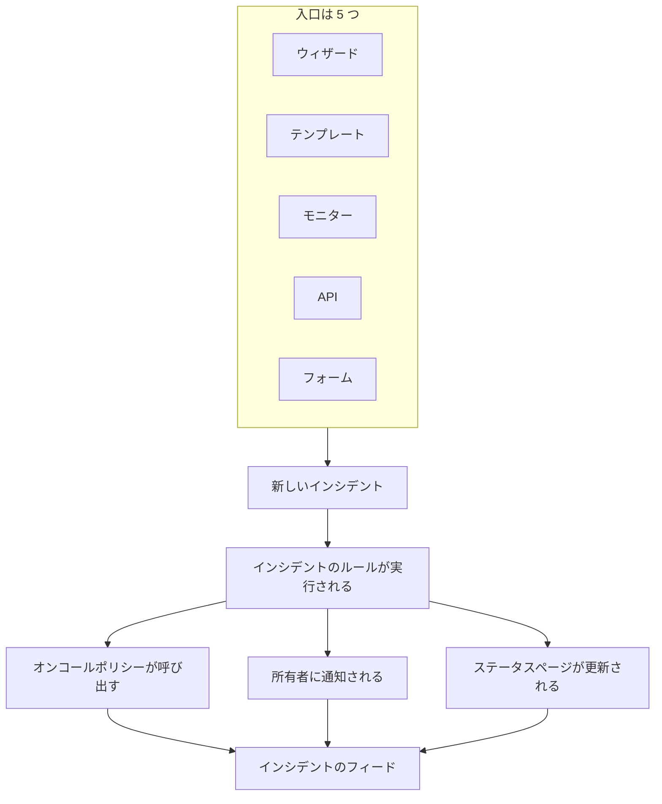
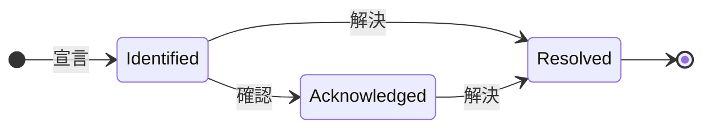

# インシデント 概要

インシデントは、何かが壊れたときにチームが拠り所にする記録です。何が影響を受けているか、どれほど深刻か、対応がどこまで進んでいるか、誰が担当しているか、そして対応中に書き残されたすべてが記録されます。インシデントを宣言すると、適切なオンコールローテーションが呼び出され、所有者に通知が届き、必要であれば障害がステータスページに掲載されるので、顧客は対応が始まっていることを知ることができます。

:::cards
- [インシデントの宣言](/docs/incidents/declaring-incidents): 手動で、テンプレートから、モニターから、API 経由で、またはフォームから。
- [インシデントの状態と重大度](/docs/incidents/states-and-severities): ライフサイクルと、確認と解決が何をするか。
- [インシデントのメモ、オーナー、フィード](/docs/incidents/notes-owners-and-feed): 顧客向けとチーム向けの更新、そしてそれが誰に届くか。
- [リンクされたアラート](/docs/incidents/linked-alerts): 障害で発生したアラートを、それを説明するインシデントに結び付けます。
- [インシデントの設定と自動化](/docs/incidents/settings): テンプレート、カスタムフィールド、ロール、測定値、ルール。
:::

## ひと目でわかる要点

- **独立した製品** — 上部バーの **製品** メニューから **インシデント** を開きます。一覧は `/dashboard/{projectId}/incidents` にあります。
- **初期状態は 3 つ** — **原因特定**、**確認済み**、**解決済み** が新しいプロジェクトごとに作成されます。独自の状態を追加でき、初期の 3 つは名前と色を変更できますが、削除はできません。
- **初期重大度は 3 つ** — **Critical Incident**、**Major Incident**、**Minor Incident**。重大度は色と順序を持つラベルで、それ自体には振る舞いがありません。
- **入口は 5 つ** — **インシデントを宣言** ウィザード、**テンプレートから作成**、モニターの条件ルール、`POST /api/incident`、そしてリンクを知っていれば誰でも入力できる [フォーム](/docs/forms/index)。
- **番号はプロジェクト単位** — すべてのインシデントにはプロジェクトごとのカウンターから番号が振られ、プロジェクトのプレフィックス付きで表示されます。新しいプロジェクトでは `INC-42`、プレフィックスがなければ `#42` です。
- **メモは 2 種類** — チーム向けの非公開メモ（内部メモ）と、ステータスページの購読者向けの公開メモ。
- **アラートはインシデントにリンクされる** — インシデントに関係するアラートをリンクしたり、アラート一覧やアラート自身のページからアラートを元にインシデントを直接宣言し、同時にそれらを確認したりできます。[リンクされたアラート](/docs/incidents/linked-alerts) を参照してください。
- **設定はプロジェクト設定ではなくインシデントの下にある** — 状態、重大度、テンプレート、カスタムフィールド、各ルールエンジンはすべて **インシデント → 設定** と **インシデント → ルール** にあります。

## 仕組み

午前 3 時に手動でインシデントを宣言することも、モニターの条件が一致した瞬間にモニターに宣言させることもできます。どちらの場合も、インシデントは同じオブジェクトで、同じライフサイクルをたどり、最後には同じ記録が残ります。

### 1. 宣言される

5 つの経路が同じオブジェクトにつながっています。

- **手動で** — インシデント一覧で **インシデントを宣言** をクリックします。**新しいインシデントを宣言** ウィザードが開き、**インシデントの詳細**、**影響を受けるリソース**、**オンコールとロール** の 3 ステップで進みます。最初のステップではタイトル、重大度、説明を入力し、ほとんどのインシデントで不要な項目は **その他の項目** にまとめて折りたたまれています。答える必要がある項目があるのは最初のステップだけです。**次へ** で残りのステップを進み、**インシデントを宣言** は最後のサマリーにあります。
  - **アラートから** — 選択したアラート、または 1 つのアラートのヘッダーで **インシデントを宣言** を使うと、アラートの内容が入力済みの同じウィザードが開き、アラートが新しいインシデントにリンクされます。チェックボックスを外さない限り、アラートは確認され、エスカレーションが止まります。[リンクされたアラート](/docs/incidents/linked-alerts) を参照してください。
- **テンプレートから** — **テンプレートから作成** をクリックし、保存済みの **インシデントテンプレート** を選びます。テンプレートはタイトル、説明、重大度、初期状態、リソース、オンコールポリシー、所有者、ラベルを事前に入力します。
- **モニターから** — 「インシデントを宣言」のトグルを有効にしたモニターの条件ルールは、フィルターが一致した瞬間に自動でインシデントを作成します。そこではタイトルと説明に `{{variable}}` テンプレートを使えます。
- **API 経由で** — API キーを使って `POST /api/incident` を呼び出します。`declaredAt`、作成状態、インシデント番号はサーバーが自動で入力します。
- **フォームから** — チーム外の人が、リンクで共有されたフォームに OneUptime アカウントなしで入力します。インシデントはステータスページで非表示の状態で宣言され、フォームにインシデントテンプレートがあればそのテンプレートから作られます。[フォーム](/docs/forms/index) を参照してください。

連携機能もインシデントを開きます。[Huntress](/docs/integrations/huntress) は、SOC から届くインシデントレポートをそれぞれ 1 つのインシデントに変え、選択したオンコールポリシーで呼び出します。項目ごとの詳しい手順は [インシデントの宣言](/docs/incidents/declaring-incidents) を参照してください。

### 2. 適切な人に伝わる

作成時に、OneUptime は設定済みの自動化を実行します。プライバシールール、所有者ルール、ラベルルール、オンコールルール、Runbook ルールです。インシデントに割り当てられたオンコールポリシーは、手動で追加したものも、テンプレートから来たものも、一致したオンコールルールによって加わったものも、すべて並行して実行されます。

所有者には、各自が **ユーザー設定 → 通知設定** で有効にしたチャネルで通知が届きます。メール、SMS、音声通話、プッシュ、WhatsApp、Telegram、Slack、Microsoft Teams、Webhook のいずれかです。インシデントに所有者がまったくいない場合、通知は破棄されず、プロジェクトの所有者に届きます。

インシデントがステータスページに表示され、購読者への通知が有効になっていれば、購読者にも知らされます。対象は、そのインシデントのモニターのいずれかを掲載しているすべてのステータスページの購読者か、インシデントを限定したページの購読者だけです。対象者ごとに専用のステータスページを用意する方法は [対象者ごとのステータス ページ](/docs/status-pages/one-status-page-per-audience) を参照してください。

> [!NOTE]
> 通知は cron によって毎分実行されるため、すぐに送信されるのではなく、最大で 1 分ほどの遅れがあると考えてください。

### 3. チームが対応する

対応者はインシデントを確認し、影響を受けるリソースを追加し、関係するアラートをリンクし、Runbook を実行し、インシデントのロールを割り当て、わかったことを書き留めます。チーム向けには非公開メモを、顧客向けには公開メモを書き、状況がはっきりしてきたら **根本原因** と **修復** のページも書きます。対応者が行ったことはすべて、**概要** ページの **インシデントのフィード** に記録されます。

### 4. 解決される

**解決** をクリックすると、インシデントは解決状態に移り、状態タイムラインに記録され、経過時間の計測が止まり、インシデントが保持しているモニターが返され、表示されていたすべてのステータスページのアクティブなセクションからインシデントが外れます。そのために他に変更する必要はありません。ステータスページには、解決状態より上の状態にあるインシデントしか表示されないからです。[解決が行うこと](/docs/incidents/states-and-severities#解決が行うこと) を参照してください。

その後、ポストモーテムを書き、必要に応じてステータスページに公開できます。

## 主要な用語

このセクションのどのページにも出てくる言葉がいくつかあります。まずはこれらを押さえてください。

| 用語                       | 意味                                                                                                                                                |
| -------------------------- | --------------------------------------------------------------------------------------------------------------------------------------------------- |
| **インシデント**           | 記録そのもの。タイトル、説明、重大度、現在の状態、影響を受けるリソース、そして対応中に書き込まれたすべてです。                                        |
| **インシデントの状態**     | インシデントがライフサイクルのどこにいるか。名前、色、`order` と、意味を与えるフラグを持つ、プロジェクト単位の行です。                                |
| **インシデントの重大度**   | どれほど深刻か。名前、色、`order` を持つ、プロジェクト単位の行です。純粋な分類であり、製品のどこにも特定の重大度を特別扱いする処理はありません。      |
| **インシデント番号**       | プロジェクトごとのカウンター。`#42`、または設定したプレフィックス付きで `INC-42` と表示されます。                                                     |
| **影響を受けるリソース**   | インシデントに紐付けるモニター、ホスト、Kubernetes クラスター、Docker ホスト、サービスなどのインフラです。                                           |
| **公開メモ**               | ステータスページの閲覧者と購読者に向けて書く更新。ステータスページのタイムラインに表示されます。                                                     |
| **非公開メモ**             | 対応チーム向けの内部メモ（`IncidentInternalNote` モデル）。ステータスページに出ることはありません。                                                  |
| **所有者**                 | インシデントに責任を持つユーザーまたはチーム。インシデントの作成時、メモの投稿時、状態の変更時に通知を受け取ります。                                  |
| **インシデントのフィード** | インシデントの **概要** にある追記専用のアクティビティタイムライン。状態の変更、メモ、所有者の変更、ルールの実行、通知を記録します。                  |
| **状態タイムライン**       | インシデントがいつ、どの状態に、どれだけの間あったかの記録。遷移ごとに購読者への通知ステータスも残ります。                                          |
| **リンクされたアラート**   | 対応の一部としてインシデントにリンクされたアラート。アラートは複数のインシデントにリンクでき、自分の状態をそのまま保ちます。                        |

## OneUptime がすべてのプロジェクトに用意する 3 つの状態

プロジェクトが作成されると、OneUptime はちょうど 3 つのインシデントの状態を、次の順序で作成します。

| 状態             | 順序 | 色                 | 意味                                                                      |
| ---------------- | ---- | ------------------ | ------------------------------------------------------------------------- |
| **原因特定**     | 1    | 赤 (`#fd625e`)     | 新しく作られたインシデントが最初に入る状態。これが作成状態です。          |
| **確認済み**     | 2    | 黄 (`#ffbf53`)     | 誰かがインシデントを引き受け、対応しています。                            |
| **解決済み**     | 3    | 緑 (`#2ab57d`)     | インシデントは終わりました。解決することで、ステータスページから外れます。 |

名前は単なるラベルにすぎません。実際に振る舞いを決めているのは、状態の行にある 3 つのブール値、`isCreatedState`、`isAcknowledgedState`、`isResolvedState` です。各フラグを持つ状態は、プロジェクトごとに 1 つだけであることが想定されています。

この区別は見た目以上に重要です。

- `isCreatedState` は、新しいインシデントがどこから始まるかを決めます。作成時に状態が明示的に選ばれていなければ、OneUptime はプロジェクトの作成状態を探して使います。
- `isAcknowledgedState` と `isResolvedState` は、確認状態と解決状態を示します。インシデントの状態がそれらに対してどこにあるかによって、インシデントのヘッダーにある **確認** と **解決** のボタン、インシデントの **概要** にある 2 つの統計タイル、サイドメニューの **アクティブなインシデント** の件数バッジが決まります。確認状態かそれより後の状態にあるインシデントは確認済みとして扱われ、解決状態かそれより後の状態にあるインシデントは解決済みとして扱われます。
- **アクティブなインシデント** は、純粋に「現在の状態が解決状態より上にある」ことで定義されます。そのため、解決状態より上に追加した独自の状態はアクティブであり、解決状態より後に置いた状態は、解決状態と同じく解決済みとして扱われます。

> [!NOTE]
> 最初に用意される状態の名前は **原因特定** ですが、製品内のいくつかの説明ではいまだに作成状態と呼ばれています。プロジェクトの状態一覧で「Created」を探しているなら、それは **原因特定** という名前の行です。

独自の状態は **インシデント → 設定 → インシデントの状態** で追加できます。新しい状態は解決状態のすぐ上に追加され、行をドラッグして並べ替えます。**扱い** 列には、各状態にあるインシデントが何として扱われるか（未確認、確認済み、解決済み）が表示されます。フラグを持つ 3 つの状態には **組み込み** のタグが付き、順序は保たれ、削除もできませんが、名前の変更、色の変更、移動はできます。そのため UI は状態名を動的に読み込んでいます。

順序は見た目だけのものではなく、強制されます。インシデントは、順序の上で現在の状態より前にある状態へは移れません。詳しくは [インシデントの状態と重大度](/docs/incidents/states-and-severities) を参照してください。

## OneUptime がすべてのプロジェクトに用意する 3 つの重大度

新しいプロジェクトには、3 つの重大度も作成されます。

| 重大度                | 順序 | 色                     | 意味                                                       |
| --------------------- | ---- | ---------------------- | ---------------------------------------------------------- |
| **Critical Incident** | 1    | マルーン (`#b70400`)   | 顧客への影響が非常に大きく、即時の対応が必要です。         |
| **Major Incident**    | 2    | 赤 (`#fd625e`)         | 影響が大きく、通常は即時の対応が必要です。                 |
| **Minor Incident**    | 3    | 黄 (`#ffbf53`)         | 影響は小さく、通常は業務時間内に対応します。               |

重大度が持つのは `name`、`description`、`color`、`order` だけです。フラグはなく、「Critical Incident」を他の行と違うように扱うコードパスもありません。重大度は人がトリアージするためのもので、オンコールルールを書くときの一致条件として使えますが、重大度を選んだだけで誰かが呼び出されることはありません。

重大度の編集や追加は **インシデント → 設定 → インシデントの重大度** で行います。初期の説明文の全文は [インシデントの状態と重大度](/docs/incidents/states-and-severities) にあります。

## ダッシュボードでのインシデントの場所

上部バーの **製品** メニューから **インシデント** を開きます。サイドメニューは次のセクションに分かれています。

| セクション       | そこで行うこと                                                                                                                                                             |
| ---------------- | -------------------------------------------------------------------------------------------------------------------------------------------------------------------------- |
| **概要**         | **すべてのインシデント** と **アクティブなインシデント**。後者には、解決状態より上の状態にあるインシデントの件数を示す赤いバッジが付きます。                                |
| **エピソード**   | インシデントエピソード。独自のページを持つ、別のグループ化機能です。                                                                                                       |
| **AI**           | **インサイト**、**ログ**、**設定**: OneUptime AI がインシデントから学んだことと、インシデントのために行ったすべて、そして自分で行ってよいこと（調査・修正するインシデントを決めるルールを含む）。[AI SRE](/docs/ai/ai-sre) を参照してください。 |
| **ワークスペース** | このプロジェクトが接続したチャットワークスペース: **Slack**、**Microsoft Teams**、またはその両方。それぞれにインシデント用の通知ルールがあります。どちらも接続していない場合は、両方と接続方法を示すページ **Slack または Teams を接続** があります。 |
| **連携**         | 自分でインシデントを開くツール: **Huntress**。そのインシデントレポートは、オンコールを呼び出すインシデントになります。[Huntress](/docs/integrations/huntress) を参照してください。 |
| **ルール**       | ルールエンジン: **グループ化ルール**、**オンコールルール**、**所有者ルール**、**Runbook ルール**、**プライバシールール**、**ラベルルール**、**SLA ルール**、**リマインダールール**。 |
| **設定**         | **インシデントの状態**、**インシデントの重大度**、**インシデントテンプレート**、**メモテンプレート**、**ポストモーテムテンプレート**、**カスタムフィールド**、**インシデントロール**、**測定値**、**リンクされたアラート**、**番号プレフィックス**。 |

**概要** と **エピソード** は開いており、**AI**、**ワークスペース**、**連携**、**ルール**、**設定**、**開発者** は既定で折りたたまれているので、メニューは毎日使う一覧から始まります。セクションのタイトルをクリックすると展開され、このドキュメントの他の箇所で触れているページが見つかります。セクションは、そのページのいずれかを開いているときにも自動で開きます。インシデントの設定はプロジェクト設定にはなく、すべてここにあります。

インシデント一覧自体には **インシデント番号**、**タイトル**、**状態**、**重大度**、**影響を受けるリソース**、**宣言済み**、**期間**、**ラベル**、**所有者** が表示され、一括操作 **状態を変更** で複数のインシデントをまとめてクローズできます。

## インシデントの各ページに表示されるもの

インシデントを開くと、そのインシデント自身のサイドメニューは、ページを次のようにまとめています。

| サイドメニューのセクション | ページ                                                                                    |
| -------------------------- | ----------------------------------------------------------------------------------------- |
| **概要**                   | **概要**、**状態タイムライン**、**SLA**                                                   |
| **調査**                   | **説明**、**根本原因**、**修復**、**Runbook**、**ポストモーテム**、**リンクされたアラート** |
| **チーム**                 | **ロール**、**オンコールの実行**、**所有者**                                              |
| **通知**                   | **通知ログ**、**AI ログ** — **通知** をクリックするまで折りたたまれています               |
| **メモ**                   | **非公開メモ**、**公開メモ**                                                              |
| **開発者**                 | **Terraform**、**API**、**AI アシスタント** — **開発者** をクリックするまで折りたたまれています |
| **詳細**                   | **カスタムフィールド**、**設定**、**監査ログ**、**インシデントを削除** — **詳細** をクリックするまで折りたたまれています |

それぞれの内容は次のとおりです。

- **概要** — 対応状況をひと目で把握できます。ヘッダーの下の統計タイルには、確認までの時間、解決までの時間、合計の **期間** が表示されます。ページの先頭には **AI 調査** カードがあり、OneUptime AI が見つけたこと、または開始しなかった理由を示し、その下に **インシデントのフィード** があります。その横には **ビデオ通話** カード、**インシデントの詳細** カード（タイトル、重大度、ラベル、インシデント番号、宣言日時、宣言者、オンコールポリシー、そして下部の小さな **ID** 行にあるインシデントの ID。クリック 1 回でクリップボードにコピーできます）、**インシデントロール**、**影響を受けるリソース** カード、インシデントのカスタムフィールドが並びます。プロジェクトに [測定値](/docs/incidents/settings#測定値) があれば、**インシデントの詳細** の下の **測定値** カードに、このインシデントでの各測定値が表示されます: **12 分**、**5 分 実行中**、**到達せず**。
- **状態タイムライン** — インシデントが経たすべての状態と、遷移ごとの **開始日時**、**終了日時**、**期間**、購読者への通知ステータス。**原因を表示** と **ログを表示** で、各変更が起きた理由がわかります。
- **SLA** — このインシデントの SLA の追跡。
- **説明**、**根本原因**、**修復** — Markdown の 3 つのページ。ステータスページに表示されるのは説明です。
- **Runbook** — このインシデントに紐付いた Runbook の実行。
- **ポストモーテム** — 振り返りの文書とその添付ファイル。必要に応じてステータスページに公開できます。**ポストモーテムのメモを編集** ではメモと添付ファイルを入力し、次に **ステータスページに公開** を選びます。これがオンのときだけ、**購読者に通知** と **ポストモーテムの公開日時** を尋ねます（公開をオンにすると現在時刻が入ります）。**AI で生成** はメモの下書きを作成し、**テンプレートを適用**（プロジェクトにポストモーテムテンプレートがあると表示されます）はテンプレートから書き始めます。購読者に知らされるのは、ポストモーテムが公開されたとき、つまりステータスページに初めて表示されたときの 1 回だけで、そのためには **ステータスページに公開** がオンで、メモが書かれている必要があります。もう一度保存したり、公開中に編集したりしてもステータスページが更新されるだけで、誰にも通知されません。ステータスページから外したあとに再び公開すると、もう一度通知されます。インシデントが非表示の間に公開したものは、インシデントが表示されたときに送信されます。[ポストモーテム](/docs/status-pages/subscribers#インシデント) を参照してください。
- **リンクされたアラート** — このインシデントにリンクされたアラートと、それぞれのアラートの現在の状態、誰がいつリンクしたか。アラートには対応する **リンクされたインシデント** ページがあります。[リンクされたアラート](/docs/incidents/linked-alerts) を参照してください。
- **ロール**、**オンコールの実行**、**所有者** — 誰が対応しているか、どのポリシーが実行されたか、誰に通知されるか。
- **通知ログ**、**AI ログ**、**監査ログ** — 何が送られ、何が変わったか。
- **非公開メモ** と **公開メモ** — チームと顧客に何が伝えられたか。[インシデントのメモ、オーナー、フィード](/docs/incidents/notes-owners-and-feed) を参照してください。
- **カスタムフィールド**、**設定**、**インシデントを削除** — **設定** ページには、**ステータスページに表示** と **プライベートインシデント**、インシデントを一部のステータスページに限定する **ステータスページの範囲** カード、そして **リマインダー** カードがあります。このカードの **リマインダーを送信** スイッチは切り替えるとすぐに保存され、次のリマインダーがいつ送られるかを表示します。

## OneUptime の他の機能との関係

- **モニターが問題を見つけ、インシデントがそれを記録する。** モニターの条件ルールは、タイトル、重大度、オンコールポリシー、所有者、ラベル、修復メモを事前に入力して、自動でインシデントを宣言できます。そこで使える変数は [インシデント & アラート テンプレート](/docs/monitor/incident-alert-templating) を参照してください。
- **アラートはシグナル、インシデントは対応。** インシデントが説明するアラートを、どちら側からでもインシデントにリンクできます。新しいプロジェクトでオンになっている 2 つのプロジェクトスイッチにより、それらのアラートはインシデントとともに確認・解決されます。[リンクされたアラート](/docs/incidents/linked-alerts) を参照してください。
- **呼び出しはオンコールポリシーが行う。** 宣言ウィザードの **オンコールとロール** ステップ、テンプレート、または **インシデント → ルール → オンコールルール** でポリシーを割り当てます。一致したルールはすべて実行され、実行されるのはすべての一致と直接割り当てたものの和集合から重複を除いたものです。
- **Runbook は何をすべきかを伝える。** Runbook ルールは、一致するインシデントが作成されたときに自動で手順を紐付け、対応者はインシデントから手動で Runbook を開始することもできます。[Runbook 概要](/docs/runbooks/index) を参照してください。
- **ステータスページは顧客に伝える。** インシデントがステータスページのアクティブな一覧に表示されるのは、そのページがインシデントのモニターのいずれかを掲載し、ページでインシデントが有効になっていて、インシデントがステータスページに表示する設定になっており、現在の状態が解決状態より上にあるときです。一部のステータスページに限定したインシデントは、それらのページにだけ表示されます。プライベートインシデントは、常にすべてのステータスページで非表示です。[ステータス ページ 概要](/docs/status-pages/index) と [対象者ごとのステータス ページ](/docs/status-pages/one-status-page-per-audience) を参照してください。
- **ワークフローがその周りを自動化する。** **On Create Incident**、**On Update Incident**、**On Delete Incident** トリガーを使うと、インシデントのライフサイクルの上にノーコードの自動化を組み立てられます。[ワークフロー 概要](/docs/workflows/index) を参照してください。

## 次のステップ

:::cards
- [インシデントの宣言](/docs/incidents/declaring-incidents): ウィザードを項目ごとに確認するか、テンプレート、モニター、API から宣言します。
- [インシデントの状態と重大度](/docs/incidents/states-and-severities): 独自の状態を追加し、各状態が何をするかを正確に確認します。
- [ステータス ページ 概要](/docs/status-pages/index): インシデントがどのように顧客に届くか。
- [購読者とお知らせ](/docs/status-pages/subscribers): インシデントが動いたときに誰に通知されるか。
:::
