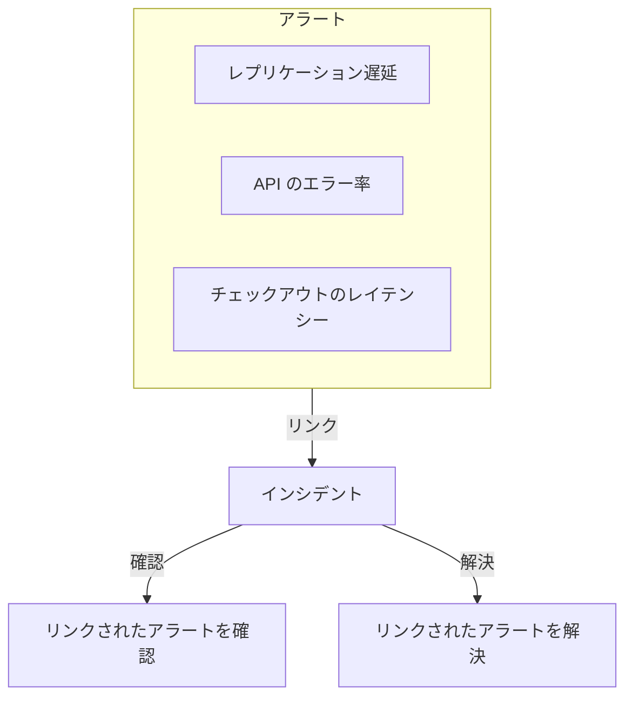
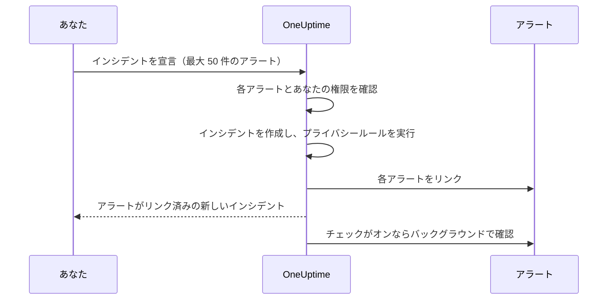

# リンクされたアラート

障害で発生するアラートが 1 つだけということはまずありません。プライマリデータベースが落ちると、レプリケーション遅延のモニターが発動し、API のエラー率のモニターが発動し、チェックアウトのレイテンシーの SLO がバジェットを消費し始めます。アラートは 3 つでも、問題は 1 つです。これらのアラートをインシデントにリンクすることで、それを示せます。インシデントは対応が行われる場所であり、各アラートはどのインシデントによって説明されるかを示します。

リンクはあくまでリンクです。アラートは自分の状態、所有者、オンコールポリシー、メモ、フィードを保ち、インシデントも自分のものを保ちます。リンクは何も統合もコピーもせず、それだけでアラートを確認、解決、またはミュートすることもありません。（アラートから新しいインシデントを宣言する場合は別です。[後述のとおり](#アラートからインシデントを宣言する)、新しいインシデントはアラートの内容で事前に入力され、フォームのチェックボックスを外さない限り、宣言と同時にアラートが確認されてエスカレーションが止まります。[宣言と同時にアラートを確認する](#宣言と同時にアラートを確認する) を参照してください。）新しいプロジェクトでオンになっている 2 つのプロジェクトスイッチにより、インシデントが確認・解決されるのに合わせて、リンクされたアラートも進みます。[後述](#アラートの状態をインシデントとそろえる) を参照してください。

:::cards
- [アラートをインシデントにリンクする](#インシデントからアラートをリンクする): インシデントから、アラートから、または多数を一度に。
- [アラートからインシデントを宣言する](#アラートからインシデントを宣言する): 新しいインシデントを、入力済み・リンク済みの状態で一度に。
- [アラートの状態をそろえる](#アラートの状態をインシデントとそろえる): インシデントと一緒にアラートを確認・解決します。
- [権限](#権限): 誰がリンクでき、リンクによって何ができるようになるか。
:::

> [!TIP]
> Opsgenie から移行してきた方へ: これは、アラートをインシデントに関連付ける機能の OneUptime 版です。

## ひと目でわかる要点

- **多対多** — インシデントには任意の数のアラートをリンクでき、1 つのアラートを複数のインシデントにリンクすることもできます。
- **リンクできる場所は 3 つ** — インシデントの **リンクされたアラート** ページ、アラートの **リンクされたインシデント** ページ、そして主なアラート一覧の一括操作 **インシデントにリンク** です。一括操作では一度に最大 **50** 件のアラートを扱えます。
- **アラートからインシデントを宣言する** — アラート一覧、アラートのヘッダー、またはアラートの **リンクされたインシデント** ページで **インシデントを宣言** を使うと、アラートの内容で新しいインシデントが事前に入力され、作成と同時にアラートがリンクされます。フォームにある既定でオンのチェックボックスはアラートの確認も行い、アラート自身のオンコールのエスカレーションを止めます。
- **両側に記録される** — リンクとリンク解除のたびに、インシデントとアラートの両方にフィードのエントリーが書き込まれます。ただし、アラートから宣言したインシデントには、すべてを一覧するエントリーが 1 つだけ付きます。Slack と Microsoft Teams に投稿されるのはインシデントのエントリーだけで、プライベートなアラートやインシデントのタイトルが相手側に書かれることはありません。
- **アラートの状態はインシデントに従う** — 新しいプロジェクトではどちらもオンになっている 2 つのプロジェクトスイッチが、インシデントの確認・解決に合わせて、リンクされたアラートを確認・解決します。どちらかをオフにするには **インシデント → 設定 → リンクされたアラート** を使います。
- **自動化できる** — リンクは通常の API リソース `/api/incident-alert` です。

## 仕組み

アラートはシグナルです。モニターの条件が一致した、SLO がバジェットを消費し始めた、セキュリティルールが発動した、といったものです。インシデントは問題に対する組織立った対応です（[インシデント 概要](/docs/incidents/index) を参照）。ほとんどの問題は複数のシグナルを生み出し、リンクがなければ、それらを対応に結び付けるのは誰かの記憶だけです。



アラートをリンクすると、次のようになります。

- インシデントの対応者は、どのアラートがインシデントに含まれ、それぞれがどの状態にあるかを 1 つの一覧で確認できます。
- それらのアラートのどれかを開いた人は、それがすでにどのインシデントで対応中かがわかるので、同じ障害について 2 つ目のインシデントを宣言せずに済みます。
- インシデントのフィードには、各アラートがいつ誰によってリンクされたかが記録されるので、状況がどのように明らかになったかがタイムラインでわかります。
- スイッチがオンなら、インシデントを確認するとアラートのオンコールのエスカレーションが止まるので、インシデントに対応している人がその症状によって再び呼び出されることはありません。

## リンクの仕組み

リンクは 1 つのアラートを 1 つのインシデントに結び付けます。リンクは双方向で、同じリンクがインシデントの **リンクされたアラート** ページとアラートの **リンクされたインシデント** ページの両方に表示されます。

- **アラートは複数のインシデントにリンクできます。** 共有の依存先の障害は、2 つの別々のインシデントの症状であることがあります。各インシデントにはそのアラートが表示され、アラートには両方のインシデントが表示されます。
- **各組み合わせのリンクは 1 回だけです。** すでにリンクされているインシデントにアラートをリンクしようとすると、2 人が同じ組み合わせを同時にリンクした場合でも、「This alert is already linked to this incident.」で拒否されます。
- **リンクは作成または削除するだけで、編集はしません。** リンクには、インシデント、アラート、作成日時、作成者以外の項目はありません。アラートを別のインシデントに移すには、新しいインシデントにリンクし、古いインシデントからリンクを解除します。
- **リンクはプロジェクト内に限られます。** アラートとインシデントは同じプロジェクトに属している必要があります。

## インシデントからアラートをリンクする

:::steps
### インシデントの「リンクされたアラート」ページを開く

インシデントを開き、サイドメニューの **調査** セクションで **リンクされたアラート** を選びます。表には、すでにリンクされているすべてのアラートが表示されます。

### アラートを選ぶ

**アラートをリンク** をクリックし、**アラート** ドロップダウンから選びます。ドロップダウンには、`ALT-63: Checkout API is offline` のように番号付きで最新のアラートから表示されるので、モニターが繰り返し出すアラートのようにタイトルが同じアラートも見分けられます。古いアラートを探すには入力します。ドロップダウンはすべてのアラートをタイトルで検索します。

### リンクを保存する

ダイアログで **アラートをリンク** をクリックします。アラートが表に表示され、両方のフィードにリンクが記録されます。たとえばアラートがすでにリンクされているためにリンクが拒否された場合は、ダイアログが開いたままになり、理由が表示されます。
:::

| 列                    | 表示内容                                         |
| --------------------- | ------------------------------------------------ |
| **アラート番号**      | `#17` や `ALT-17` のようなアラートの番号。       |
| **タイトル**          | アラートのタイトル。アラートへのリンクです。     |
| **現在の状態**        | アラート自身の状態。たとえば **確認済み**。      |
| **リンク日時**        | アラートがリンクされた日時。                     |
| **リンクしたユーザー** | リンクした人。                                  |

各行には、アラートを開く **アラートを表示** と、リンクを削除する **リンク解除** があります。

## アラートからインシデントをリンクする

アラート側はインシデント側の鏡写しです。アラートを開き、サイドメニューの **基本** セクションで **リンクされたインシデント** を選びます。表には、アラートがリンクされているすべてのインシデントが、インシデント番号、タイトル、現在の状態、いつ誰がリンクしたかとともに表示されます。

- **インシデントをリンク** は、このアラートを既存のインシデントにリンクします。そのドロップダウンはインシデント側と同じように動作します。`INC-42: Checkout is down` のように番号付きで最新のインシデントから表示され、入力するとすべてのインシデントをタイトルで検索します。
- **インシデントを表示** は、リンクされたインシデントを開きます。
- **リンク解除** はリンクを削除します。
- **インシデントを宣言** は、このアラートから新しいインシデントを開始します。同じボタンが、アラートのヘッダーの **確認** と **解決** の横にもあります。[アラートからインシデントを宣言する](#アラートからインシデントを宣言する) を参照してください。

## 多数のアラートを一度にリンクする

主なアラート一覧には、そのための一括操作が 2 つあります。対象の一覧は、**すべてのアラート** と **アクティブなアラート**、ホームページのアクティブなアラート、そしてモニター、サービス、ホスト、Kubernetes クラスター、SLO など一覧を持つリソースの **アラート** ページです。アラートエピソードの **所属アラート** 一覧にはありません。代わりに主な一覧のどれかでアラートを選んでください。アラートを選んでから、次のどちらかを選びます。

- **インシデントにリンク** — **インシデント** ドロップダウンでインシデントを選び、**選択したアラートをリンク** をクリックします。最新のインシデントが番号付きで先に表示され、入力するとすべてのインシデントをタイトルで検索します。OneUptime は選んだアラートをすべてリンクし、進み具合を表示します。そのインシデントにすでにリンクされているアラートは失敗ではなく完了として数えられるので、操作を 2 回実行しても害はありません。
- **インシデントを宣言** — 選んだアラートの内容で事前に入力された、新しいインシデントの宣言フォームを開きます。次のセクションを参照してください。

どちらの操作も、一度に最大 **50** 件のアラートを扱えます。それ以上選ぶと操作は無効になり、ツールチップに理由が表示されます。この上限があるのは、リンクのたびに両方のフィードに書き込まれ、**インシデントにリンク** で作ったリンクはすべてインシデントの Slack と Microsoft Teams のチャネルにも投稿されるからです。1,000 件のアラートを選べば、チャネルがあふれてしまいます。

## アラートからインシデントを宣言する

大量のアラートが、まだ誰も宣言していないインシデントだとわかったら、アラートから宣言します。入口は 3 つあります。

- 主なアラート一覧のどれかでアラートを選び、**インシデントを宣言** を選びます。
- アラートを開き、ヘッダーの **確認** と **解決** の横にある **インシデントを宣言** をクリックします。このボタンはアラートが確認済みや解決済みになっても残るので、後からでもアラートについてインシデントを宣言できます。たとえばポストモーテムを行うためです。
- 1 つのアラートの **リンクされたインシデント** ページを開き、**インシデントを宣言** をクリックします。

3 つとも、インシデントを作成し、アラートをインシデントにリンクする権限が必要です。権限がなければボタンはロックされ、ツールチップに足りない権限が表示されます。

どれを使っても、いつもの **新しいインシデントを宣言** フォームに移動します。アラートはリンクされるものとして一覧に表示され、次の項目が事前に入力されています。

| 項目                         | 事前に入力される内容                                                                                                                                                                                                                                                                   |
| ---------------------------- | -------------------------------------------------------------------------------------------------------------------------------------------------------------------------------------------------------------------------------------------------------------------------------------- |
| **タイトル**                 | アラートが 1 つならそのタイトル。複数なら、最も深刻なアラートのタイトル。                                                                                                                                                                                                             |
| **説明**                     | アラートが 1 つならその説明。複数なら、アラートごとに番号とタイトルを 1 行ずつ並べた一覧。                                                                                                                                                                                            |
| **インシデントの重大度**     | 最も深刻なアラートの重大度を、インシデントの重大度に置き換えたもの。大文字と小文字を区別せずに同じ名前のインシデントの重大度があれば、それが優先されます。なければ OneUptime は、重大度の順序で同じ位置にあるインシデントの重大度を取り、インシデントの重大度の数が少ない場合は最後のものを取ります。 |
| **影響を受けるリソース**     | 選んだアラートのすべてのモニター、ホスト、Kubernetes クラスター、Docker ホスト、Podman ホスト、サービスを合わせたもの。モニターは **モニター** に、それ以外は **その他の影響を受けるリソース** に入ります。SLO や、VMware・Proxmox・Ceph のクラスターなど、その他のリソースはコピーされません。インシデントが影響する場合は自分で追加してください。 |
| **ラベル**                   | 選んだすべてのアラートのすべてのラベル。                                                                                                                                                                                                                                               |
| **プライベートインシデント** | アラートのいずれかがプライベートならオン。フォームにその旨が表示され、アラートの所有者がインシデントの所有者になります（下記参照）。                                                                                                                                                   |

「最も深刻」はアラートの重大度の順序に従います。一覧の最初のアラートの重大度が最も深刻です。すべてのプロジェクトが最初に持つ重大度では、**High** のアラートは **Critical Incident** に、**Low** のアラートは **Major Incident** になります。

送信する前にすべて編集できます。**ラベル** と **プライベートインシデント** は、フォームの最初のステップの **その他の項目** の下にあり、折りたたまれた見出しには、設定されている間それらが表示されます。

**すでにインシデントがあるアラートには印が付きます。** すべてのアラートのページに **インシデントを宣言** があるので、同じ障害で呼び出された 2 人の対応者がそれぞれ宣言してしまうことがあります。そのため、アラートを一覧するバナーでは、すでにインシデントにリンクされている各アラートに「(already linked to Incident INC-42)」という印がそのインシデントへのリンク付きで付き、リンクされているアラートの数に応じた注記が加わります。

- すべてのアラートで、アラートが 1 つの場合: 「This alert is already linked to an incident. If it is the same problem, update that incident instead of declaring another one.」
- すべてのアラートで、アラートが複数の場合: 「These alerts are already linked to incidents. If it is the same problem, update that incident instead of declaring another one.」
- 一部のアラートだけの場合: 「Some of these alerts are already linked to an incident. If it is the same problem, link the other alerts to that incident from the alerts list instead of declaring another one.」

インシデントへのリンクは新しいタブで開くので、フォームに入力した内容を失わずに既存のインシデントを確認できます。注記はあくまで注意喚起で、宣言を妨げることはなく、名前が表示されるのは閲覧を許可されたインシデントだけです。

**オンコールポリシーはコピーされません。** アラートは作成時に自身のオンコールポリシーを実行済みなので、それをインシデントにコピーすると同じ人をもう一度呼び出すことになります。インシデントのオンコールポリシーは、**オンコールとロール** ステップで選んだものと、インシデントのオンコールルールが追加するものです。他のインシデントとまったく同じです。

**アラートのモニターは影響を受けるモニターとして事前に入力されます。** 手動で宣言した他のインシデントと同じく、インシデントのモニターの監視は、インシデントが解決されるまで一時停止します。チェックを続けるべきモニターがあれば、送信前に **影響を受けるリソース** ステップの **モニター** から外してください。

**プライベートなアラートはプライベートなインシデントを作ります。** アラートのいずれかがプライベートなら、**プライベートインシデント** はオンで始まり、アラートを一覧するバナーにその旨が表示されます。プライベートインシデントを見られるのは、その所有者、Project Owners、Project Admins だけなので、OneUptime はアラートを見られた人がインシデントも見られるようにします。宣言されると、宣言元のすべてのアラートの所有者（ユーザーもチームも）が、通知なしでインシデントの所有者として追加されます。追加されるのはインシデントの Slack と Microsoft Teams のチャネルが作成された直後なので、他の所有者と同じくそれらのチャネルに招待されます。宣言したどのインシデントとも同じく、あなたも所有者になります。インシデントのプライバシールールが新しいインシデントをプライベートにした場合も同じことが起きます。送信前に **プライベートインシデント** をオフにし、プライバシールールも適用されなければ、インシデントはプライベートにならず、所有者はコピーされません。



送信すると、サーバーは何かを作成する前にアラートを確認します。50 件以下であること、それぞれがこのプロジェクトのアラートで閲覧を許可されていること、そしてアラートをインシデントにリンクする権限があることです。どれかの確認に失敗すると、リクエストは拒否され、インシデントは作成されません。そのため、誤ったアラート ID でインシデント番号が消費されることはありません。インシデントができて、そのプライバシールールが実行された後（リンクがインシデントがプライベートかどうかを知るためです）、リクエストが返る前にすべてのアラートがリンクされるので、インシデントの **リンクされたアラート** ページにはすでに一覧が表示されます。1 つのリンクが失敗しても（たとえば直前にアラートが削除された場合）、インシデントは宣言され、他のアラートもリンクされます。

インシデントのフィードには、アラートごとに 1 つではなく、アラートを一覧する **アラートリンク済み** エントリーが 1 つだけ、**インシデント作成済み** の後に書き込まれます。[フィード、Slack、Microsoft Teams](#フィードslackmicrosoft-teams) を参照してください。

### 宣言と同時にアラートを確認する

インシデントを宣言しただけでは、そのアラートによる呼び出しは止まりません。アラートのオンコールのエスカレーションが止まるのは、アラート自体が確認されたときだけです。そのため、アラートのいずれかがまだ確認されていない場合、フォームのバナーには既定でオンのチェックボックスがあります。アラートが 1 つなら **Acknowledge this alert to stop its escalation**、複数なら **Acknowledge these 3 alerts to stop their escalation** です。一部がすでに確認済みの場合は、残りのアラートだけを挙げ、確認済みのものはそのままにすると表示されます。

オンのままにしておくと、インシデントが宣言され、アラートがリンクされた後で次のようになります。

- **アラートはあなたとして確認されます。** 各アラートは、あなたが自分でアラートの **確認** をクリックしたのと同じように、アラートの状態 **確認済み** に移ります。アラートの **状態タイムライン** とフィードにはあなたの名前が記録され、アラートの所有者に通知され、変更は他のアラートの状態の変更と同じく、アラートの Slack と Microsoft Teams のチャネルに投稿されます。理由は「Acknowledged because Incident INC-42 was declared from this alert.」、プライベートインシデントの場合は「Acknowledged because a private incident was declared from this alert.」となるので、アラートの閲覧者が読める場所でプライベートインシデントの名前が出ることはありません。
- **アラート自身のオンコールのエスカレーションは 1 分ほどで止まります。** エスカレーションの次のステップが確認済みのアラートを見て止まります。すでに送られた呼び出しは取り消されません。
- **リマインダーが止まるのは、リマインダールールがそう指定している場合だけです。** アラートのリマインダーが確認で止まるのは、リマインダールールの **リマインダーを停止する条件** が **確認済み** に設定されている場合だけで、それ以外はアラートが解決されるまで続きます。
- **アラートエピソードはエスカレーションを続けます。** アラートが、独自のオンコールポリシーで呼び出すエピソードに属している場合、エピソードはエピソード自体が確認されるまでエスカレーションを続けます。
- **すでに確認済みまたは解決済みのアラートはそのままです。** 他の場所と同じく状態は順序で比較されるので、**確認済み** より後のカスタム状態にあるアラートは確認済みとして扱われ、後戻りすることは決してありません。

確認せずに宣言するには、チェックボックスを外します。アラートが未確認のまま残る場合（チェックボックスがオフかロックされている場合）は、フォームにその旨が表示されます: 「Declaring the incident does not acknowledge the alert: it keeps escalating until it is acknowledged.」 また、インシデントのオンコールポリシーを選ばずにアラートを確認する場合、**オンコールとロール** ステップのサマリーは次のように指摘します: 「The alerts it is declared from are acknowledged too, so their own escalation stops. An alert episode they belong to keeps escalating until the episode is acknowledged, and an incident on-call rule, if any, may still page.」

**アラートを確認するには権限が必要です。** 宣言と同時に確認するには **Create Alert State Timeline** と **Edit Alert** が必要です（アラート自身のページで確認する場合は前者だけです。[状態を変更する](/docs/permissions/index#状態を変更する) を参照）。Project Owner、Project Admin、Project Member、Alert Admin、Alert Member は両方を持っていますが、アラートからインシデントを宣言できる Incident Admin と Incident Member はどちらも持っていません。アラートに対するラベルと所有者の範囲にも、確認される各アラートが含まれている必要があります。確認されるのはまだ確認されていないものだけです。すでに確認済みまたは解決済みのアラートには権限は不要で、宣言を妨げることもありません。権限がなければチェックボックスはロックされ、ツールチップに足りない権限が表示されますが、インシデントは引き続き宣言できます。サーバーは何かを作成する前に、確認する各アラートについてもう一度確認します。そのいずれかを確認できない場合、インシデントは作成されず、フォームに理由が表示されます。チェックボックスを外して、もう一度送信してください。

**プロジェクトには確認済みのアラートの状態が必要です。** すべてのプロジェクトは最初からそれを持っています。ない場合、チェックボックスは表示されません。

アラートは、リンクされた直後にバックグラウンドで、少しずつ（同時に最大 5 件）確認されます。そのため、アラートが確認される少し前にインシデントのページが開くことがあり、多数のアラートから宣言しても、最後のアラートが他のすべての後ろで待たされることはありません。確認できないアラート（たとえばその間に削除されたもの）はログに記録され、他のアラートやインシデントを止めることはありません。その間に他の誰かが確認または解決したアラートは、その人が残した状態のままになります。

**プロジェクトのリンクされたアラートのスイッチがオンなら、代わりにスイッチがアラートを進めることがあります。** インシデントが最初から確認済みまたは解決済みの状態で宣言され、[リンクされたアラートのスイッチ](#アラートの状態をインシデントとそろえる) のどれかがその状態に作用する場合、スイッチがリンクと同時にリンクされたアラートを進め、チェックボックスはそれらのアラートをスイッチに任せます。各アラートの書き手を 1 つにするためです。アラートはスイッチのやり方で確認または解決されます。理由はスイッチのもの（たとえば「Acknowledged because linked Incident INC-42 was acknowledged.」）で、インシデントがプライベートでも番号でインシデントを示します。あなたの操作として記録されることはなく、所有者にも通知されません。いつもどおりインシデントの最初の状態で宣言した場合や、スイッチがオフの場合は、すべてのアラートがチェックボックスに任されます。

### API で宣言する

`POST /api/incident` は、リンクするアラートの ID を `miscDataProps` の `alertIdsToLink` で、それらのアラートを確認するかどうかを `acknowledgeAlertsToLink` で受け取ります。

```bash
curl -X POST https://oneuptime.com/api/incident \
  -H "apikey: $ONEUPTIME_API_KEY" \
  -H "Content-Type: application/json" \
  -d '{
    "data": {
      "title": "Primary database unavailable",
      "incidentSeverityId": "<incident-severity-id>"
    },
    "miscDataProps": {
      "alertIdsToLink": ["<alert-id>", "<another-alert-id>"],
      "acknowledgeAlertsToLink": true
    }
  }'
```

`alertIdsToLink` は 1〜50 個のアラート ID の配列です。重複は無視され、インシデントが作成される前に、ダッシュボードと同じ確認が行われます。API では何も事前に入力されないので、必要なタイトル、重大度、リソースを送ってください。API キーには、インシデントを作成し、アラートをインシデントにリンクする権限が必要で、アラートを読み取れる必要もあります。API キーはユーザーではないので、API キーで作ったリンクには **リンクしたユーザー** がありません。リクエストボディのその他の部分は [インシデントの宣言](/docs/incidents/declaring-incidents) を参照してください。

`acknowledgeAlertsToLink` は任意で、送らなければオフです。`true` に設定すると、フォームのチェックボックスと同じく、リンクされた後でアラートを確認します。すでに確認済みまたは解決済みのアラートはそのままで、権限も不要です。確認せずに宣言するには、省略するか `false` を送ります。これはインシデントが作成される前にアラート ID と一緒に確認され、次の場合はリクエストが 400 で拒否されます。

- `true` または `false` 以外の値である。
- `alertIdsToLink` なしで送られた。
- プロジェクトに確認済みのアラートの状態がない。
- API キーが、まだ確認されていないすべてのアラートを確認できない。それには **Create Alert State Timeline** と **Edit Alert** と、それらの各アラートを含むラベルの範囲が必要です。

API キーはユーザーではないので、API キーで確認したアラートは誰の操作としても記録されません。そのリンクに **リンクしたユーザー** がないのと同じです。

## API でリンクとリンク解除を行う

リンクは `/api/incident-alert` にある標準の CRUD リソースです。アラートをインシデントにリンクするには、リンクを作成します。

```bash
curl -X POST https://oneuptime.com/api/incident-alert \
  -H "apikey: $ONEUPTIME_API_KEY" \
  -H "Content-Type: application/json" \
  -d '{
    "data": {
      "incidentId": "<incident-id>",
      "alertId": "<alert-id>"
    }
  }'
```

インシデントにリンクされたアラートを一覧するには、`incidentId` でクエリします。アラートがリンクされているインシデントを探すには、代わりに `alertId` でクエリします。

```bash
curl -X POST https://oneuptime.com/api/incident-alert/get-list \
  -H "apikey: $ONEUPTIME_API_KEY" \
  -H "Content-Type: application/json" \
  -d '{
    "query": { "incidentId": "<incident-id>" },
    "select": { "_id": true, "alertId": true, "createdAt": true },
    "limit": 50,
    "skip": 0
  }'
```

リンクを解除するには、リンク自身の ID でリンクを削除します。アラートやインシデントではなく、リンクの `_id` です。

```bash
curl -X DELETE https://oneuptime.com/api/incident-alert/<link-id> \
  -H "apikey: $ONEUPTIME_API_KEY"
```

どちらの ID も必須です。アラートやインシデントが別のプロジェクトに属している場合や、あなたが見られないものである場合も、リンクのリクエストは拒否されます。エラーの文言は、アラートやインシデントが存在しない場合と、あなたから隠されているだけの場合とで同じなので、プライベートなものが存在することが明かされることはありません。

同じリソースが、生成されたワークフローコンポーネント（アラートがリンクされると発動する **On Create Incident Alert** と、リンクが解除されると発動する **On Delete Incident Alert**）と、MCP サーバーの Incident Alert ツールを動かしています。リクエストとレスポンスの完全な形は [API リファレンス](/reference) にあります。

## リンクを解除する

リンクはどちら側からでも解除できます。インシデントの **リンクされたアラート** ページか、アラートの **リンクされたインシデント** ページで行の **リンク解除** を選び、確認します。複数をまとめて解除するには、行を選んで一括操作の **リンク解除** を選びます。削除されるのはリンクだけで、アラートやインシデント自体は削除されません。

リンクの解除はリンクを削除するだけで、他には何もしません。アラートとインシデントは自分の状態を保ち、インシデントのために確認または解決されたアラートはそのままです。アラートの状態が後戻りすることはありません。両方のフィードにリンクの解除が記録されます。

## 権限

リンクには、[権限リファレンス](/docs/permissions/reference) の **Incident** グループに、専用の 4 つの詳細な権限があります。

| 権限                      | 許可される操作                                                                                                         | この権限を含むロール                                                                                     |
| ------------------------- | ---------------------------------------------------------------------------------------------------------------------- | -------------------------------------------------------------------------------------------------------- |
| **Create Incident Alert** | アラートからインシデントを宣言する場合も含め、アラートをインシデントにリンクすること。両方を読み取れる必要もあります。 | Project Owner, Project Admin, Project Member, Incident Admin, Incident Member, Alert Admin, Alert Member |
| **Delete Incident Alert** | リンクを解除すること。                                                                                                 | Project Owner, Project Admin, Project Member, Incident Admin, Incident Member, Alert Admin, Alert Member |
| **Read Incident Alert**   | **リンクされたアラート** と **リンクされたインシデント** の一覧を見ること。                                            | 上記すべてに加えて Viewer、Incident Viewer、Alert Viewer                                                 |
| **Edit Incident Alert**   | 実際には何もありません。リンクには変更できる項目がないからです。                                                       | Project Owner, Project Admin, Project Member, Incident Admin, Incident Member, Alert Admin, Alert Member |

アラートのロールが含まれているのはアラートに対応する人がリンクできるように、インシデントのロールが含まれているのはインシデントに対応する人がリンクできるようにするためです。どちらも単独では足りません。リンクは両側を読み取れる場合にしか作成されないからです。

- **アラートのロールには、インシデントの読み取り権限も必要です** — Viewer、Incident Viewer、または Read Incident を追加します。
- **インシデントのロールには、アラートの読み取り権限も必要です** — Viewer、Alert Viewer、または Read Alert を追加します。

さらに 3 つのルールが加わります。

- **両側を見られる必要があります。** リンクが作成されるのは、アラートとインシデントの両方を読み取れる場合だけです。プライベートなアラートやインシデント、ラベルによる制限は通常どおり適用されます。
- **リンクはインシデントに属します。** リンクを見られるかどうかは、そのインシデントへのアクセスに従います。インシデントに対するラベルの制限と所有者の範囲は、リンクにも適用されます。
- **リンクに必要なのはアラートの読み取り権限であり、編集権限ではありません。** 新しいプロジェクトのようにプロジェクトのリンクされたアラートのスイッチがオンなら、それだけでリンクがアラートを確認または解決できます。[リンクされたアラートを誰が進めるか](#リンクされたアラートを誰が進めるか) を参照してください。

アラートからインシデントを宣言するには、インシデントを作成する権限も必要です。宣言と同時にそのアラートを確認するには、まだ確認されていない各アラートについて **Create Alert State Timeline** と **Edit Alert** が必要です。[宣言と同時にアラートを確認する](#宣言と同時にアラートを確認する) を参照してください。ダッシュボードでは、権限が足りない操作はロックされ、ツールチップに足りない権限が表示されます。これには相手側の読み取り権限も含まれます。アラートを読み取れなければ **アラートをリンク** がロックされ、インシデントを読み取れなければ **インシデントをリンク** と **インシデントにリンク** がロックされます。ロール、詳細な権限、ラベル、所有者の範囲がどう組み合わさるかは、[ユーザー、チーム、権限](/docs/permissions/index) を参照してください。

## フィード、Slack、Microsoft Teams

リンクとリンク解除はすべて両方のフィードに、変更した人の操作として書き込まれます。

| 変更         | インシデントのフィード                         | アラートのフィード                                          |
| ------------ | ---------------------------------------------- | ----------------------------------------------------------- |
| リンク       | **アラートリンク済み**（`AlertLinked`）        | **インシデントにリンク済み**（`LinkedToIncident`）          |
| リンク解除   | **アラートリンク解除済み**（`AlertUnlinked`）  | **インシデントからリンク解除済み**（`UnlinkedFromIncident`） |

各エントリーは相手側を番号で示し、そこへのリンクがあるので、インシデントのフィードからアラートへ移動して戻ってこられます。相手側がプライベートでなければ、そのタイトルも表示されます。

- **プライベートなアラートのタイトルはインシデントのエントリーに入りません**。したがって Slack や Microsoft Teams にも出ません。エントリーは、たとえば「Linked Alert #12 (private alert) to Incident #5」となります。
- **プライベートなインシデントのタイトルはアラートのエントリーに入りません**。エントリーは「Linked to Incident #5 (private incident)」となります。

両方がプライベートな場合も同じです。プライベートなアラートとプライベートなインシデントの所有者は違うことがあるからです。リンクされたアラートやインシデントを開けるかどうかは、通常どおりそれぞれのプライバシーに従います。

**Slack と Microsoft Teams に届くのはインシデントのエントリーだけです。** **アラートリンク済み** と **アラートリンク解除済み** は、インシデントのその他のフィードの更新が送られるのと同じ場所に投稿されます。アラート側のエントリーはダッシュボードにとどまるので、1 つのリンクで送られるメッセージは 2 通ではなく 1 通です。それらのチャネルの設定は [Slack](/docs/workspace-connections/slack) と [Microsoft Teams](/docs/workspace-connections/microsoft-teams) を参照してください。

**アラートからインシデントを宣言すると、アラートごとではなく 1 つのエントリーが書き込まれます。** インシデントの宣言時に作られるリンクは、それぞれの **アラートリンク済み** エントリーを書き込みません。代わりに、インシデントの **インシデント作成済み** エントリーが出て、インシデント自身の Slack と Microsoft Teams のチャネル（使っている場合）が作成された後で、インシデントに **アラートリンク済み** エントリーが 1 つだけ付きます。「Declared from 3 alerts:」の後に、アラートごとに番号とタイトル（プライベートなアラートはタイトルなし）の行が続きます。これが Slack と Microsoft Teams に投稿される唯一のメッセージです。各アラートには引き続きそれぞれの **インシデントにリンク済み** エントリーが付きます。

両方のフィードの **⋯** メニューにある **イベントタイプで絞り込む** ダイアログにはこれらのイベントタイプが並ぶので、他の種類のエントリーと同じく、リンクの動きを表示したり隠したりできます。インシデントのフィードについて詳しくは [インシデントのメモ、オーナー、フィード](/docs/incidents/notes-owners-and-feed) を参照してください。

## アラートの状態をインシデントとそろえる

2 つのプロジェクトスイッチで、インシデントがリンクされたアラートを一緒に進められます。どちらも新しいプロジェクトではオンです。既定でオンになる前に作成されたプロジェクトは、それまでの設定を保ちます。誰かがオンにしていなければオフです。専用の設定ページ **インシデント → 設定 → リンクされたアラート** があり、その **リンクされたアラート** カードでそれぞれがスイッチになっていて、切り替えるとすぐに保存されます。変更できるのは Project Owners と Project Admins だけで、それ以外の人にはスイッチがロックされ、必要な権限が表示されます。

- **インシデントが確認されたらリンクされたアラートを確認** — インシデントが確認状態に達すると、まだ確認されていないリンクされたアラートがすべて、アラートの状態 **確認済み** に移ります。これがそれらのアラートのオンコールのエスカレーションを止めるものです。エスカレーションの次のステップが確認済みのアラートを見て、1 分ほどで止まります。すでに送られた呼び出しは取り消されません。アラートのリマインダーも、アラートのリマインダールールの **リマインダーを停止する条件** が **確認済み** に設定されていれば止まり、それ以外はアラートが解決されるまで続きます。
- **インシデントが解決されたらリンクされたアラートを解決** — インシデントが解決状態に達すると、まだ解決されていないリンクされたアラートがすべて、アラートの状態 **解決済み** に移ります。ただし、まだ解決されていない別のインシデントにもリンクされているアラートは除きます。そのアラートはもう一方のインシデントのために未解決のまま残り（確認のスイッチもオンなら確認済みになります）、そのアラートのインシデントの最後の 1 つが解決されたときに解決されます。

両方のスイッチがオフなら、リンクはアラートの状態を何も変えません。リンクされたアラートは誰かが進めるまでその場にとどまり、オンコールポリシーはエスカレーションを続け、リマインダーも届き続けます。唯一の例外は、フォームのチェックボックスをオンのままにしてアラートからインシデントを宣言する場合で、宣言と同時にアラートが確認されます。[宣言と同時にアラートを確認する](#宣言と同時にアラートを確認する) を参照してください。

### スイッチの動作

- **名前ではなく順序。** 「達する」とは、インシデントの現在の状態が、状態の順序の上で確認状態または解決状態にあるか、それを過ぎていることを意味します。確認済み と 解決済み の間にあるカスタム状態（たとえば **監視** の状態）は、確認済みとして扱われます。アラートも同じように比較されるので、**確認済み** を過ぎたカスタム状態にあるアラートは、すでに確認済みとして扱われます。
- **後戻りはしません。** 進むのは、目標の状態より手前にあるアラートだけです。すでに確認済みのアラートは確認のスイッチに触れられず、解決済みのアラートが触れられることはありません。
- **確認のスイッチだけがオンのときに解決すると**、解決は確認より後なので、リンクされたアラートが確認されます。
- **すでに確認済みまたは解決済みのインシデントにリンクすると**、インシデントがちょうど状態を変えたかのように、新しいアラートにすぐスイッチが適用されます。
- **インシデントを再び開いても、そのアラートは再び開きません。** アラートは前の状態に戻れません。
- **意味を持つのは現在の状態だけです。** インシデントの **状態タイムライン** に過去のエントリー（**終了日時** のあるもの）を追加しても、どのアラートも進みません。
- **リンクだけでアラートの状態が変わることはありません。** 両方のスイッチがオフなら、インシデントがアラートを進めることはありません。

アラートは、インシデントの直後にバックグラウンドで状態を変えます。各変更は、「Acknowledged because linked Incident INC-42 was acknowledged.」のような理由とともにアラート自身の状態タイムラインを通るので、アラートの **状態タイムライン** とフィードに、なぜ進んだかが表示されます。アラートの所有者にはそれについての状態変更の通知は送られませんが、状態の変更は、他のアラートの状態の変更と同じく Slack と Microsoft Teams に投稿されます。1 つのアラートを進められなくても、他のアラートは止まりません。

### リンクされたアラートを誰が進めるか

スイッチをオンにすると、意図的に、リンクされたアラートの状態をインシデントに委ねることになります。インシデントは対応を進める場所なので、インシデントを進める人がそのアラートも進めます。それ以降は次のようになります。

- **インシデントの状態を変更できる人は、そのリンクされたアラートを進めます。** インシデントを確認または解決すると、アラートも確認または解決されます。
- **アラートをリンクできる人は、アラートを進められます。** すでに確認済みまたは解決済みのインシデントにアラートをリンクすると、リンクと同時にアラートが進みます。

どちらにも、アラートを編集する権限は不要です。OneUptime 自身がアラートを進め、リンクに必要なのはアラートの読み取り権限だけだからです。そのため確認のスイッチがオンなら、アラートをリンクできる人やインシデントの状態を変更できる人は誰でも、見られるアラートを確認して、そのオンコールのエスカレーションを止められます。解決のスイッチがオンなら、解決もできます。だからこそ、スイッチを変更できるのは Project Owners と Project Admins だけです。新しいプロジェクトではスイッチはオンなので、アラートの状態をアラートを編集できる人だけが変えるべきなら、オフにしてください。

### モニターから来たアラートの解決

確認はモニターのアラートにとって常に安全です。確認済みのアラートも未解決として扱われるので、モニターは新しいアラートを開かずに、そのアラートを使い続けます。

> [!WARNING]
> 解決は違います。アラートを解決した時点でモニターがまだ失敗していると、モニターの次のチェックが新しいアラートを開き、その新しいアラートはインシデントにリンクされていません。モニターが回復する前にインシデントを解決することが多いなら、解決のスイッチをオフにして確認のスイッチだけをオンにしておくか、モニターが正常になってからインシデントを解決してください。

## アラートとインシデントの削除

- **アラートを削除する** と、リンクされていたすべてのインシデントからアラートが外れます。インシデント自体は変わりません。
- **インシデントを削除する** と、そのリンクが削除されます。アラート自体は変わらず、状態も保たれます。
- **プロジェクトを削除する** と、他のすべてと一緒にすべてのリンクが削除されます。

これらのどれも、**アラートリンク解除済み** や **インシデントからリンク解除済み** のフィードのエントリーは書き込みません。書き込むのは明示的なリンク解除だけです。

## 次のステップ

:::cards
- [インシデントの宣言](/docs/incidents/declaring-incidents): 宣言フォーム、テンプレート、モニターの条件、API。
- [インシデントの状態と重大度](/docs/incidents/states-and-severities): スイッチが比較する状態の順序。
- [インシデントの設定と自動化](/docs/incidents/settings): インシデントの設定ページ。リンクされたアラートもその 1 つです。
- [ユーザー、チーム、権限](/docs/permissions/index): ロール、詳細な権限、範囲。
:::
