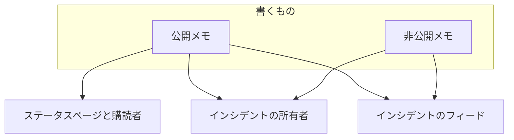
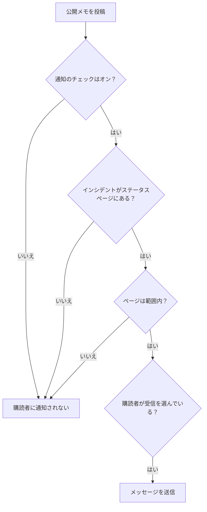

# インシデントのメモ、オーナー、フィード

インシデントには、対応している間に文書の記録がたまっていきます。顧客向けの更新、チーム向けの作業メモ、そして起きたことすべてのアクティビティフィードです。このページでは、公開メモと非公開メモの書き方、それぞれが誰に届くか、インシデントのフィード、そしてすべての変更を知らされる所有者について説明します。

:::cards
- [公開メモを投稿する](#公開メモを投稿する): わかっていることを、ステータスページと通知で顧客に伝えます。
- [購読者に通知されるとき](#公開メモが実際に購読者に届くとき): 公開メモが通過する確認と、そのバッジ。
- [インシデントのフィード](#インシデントのフィード): 起きたことすべてのタイムライン。
- [所有者](#所有者): 誰が責任を持ち、何を知らされるか。
:::

## 仕組み

書くものの一部は顧客向けです。たとえば、問題のデプロイを見つけたと 02:14 にステータスページで伝える更新です。残りはチーム向けです。誰かが貼り付けたスタックトレース、ようやく意味がわかったグラフ、フェイルオーバーするという判断などです。OneUptime はこの 2 種類の読み手を分けたまま、どちらもインシデントに記録します。

**公開メモ** はステータスページに公開され、購読者に通知できます。**非公開メモ**（`IncidentInternalNote` モデル）はダッシュボードの中にとどまります。その両方の土台にあるのが、インシデントに起きたすべてを記録する追記専用のタイムライン **インシデントのフィード** と、誰に知らせるかを決める **所有者** の一覧です。

これらはすべてインシデントのサイドメニューにあります。**メモ → 公開メモ**、**メモ → 非公開メモ**、**チーム → 所有者** です。フィードはインシデントの **概要** ページにあります。

## 公開メモと非公開メモ

2 種類のメモはダッシュボードでは似て見えますが、振る舞いはまったく違います。

|                          | 公開メモ                                                            | 非公開メモ                                                      |
| ------------------------ | ------------------------------------------------------------------- | --------------------------------------------------------------- |
| モデル                   | `IncidentPublicNote`                                                | `IncidentInternalNote`                                          |
| ステータスページへの表示 | あり。インシデントのタイムラインの一部として                        | なし。ステータスページのアプリはまったく読み取りません          |
| 投稿時刻                 | `postedAt`。自分で設定できます                                      | なし。`createdAt` で記録・並べ替えされます                      |
| 購読者への通知           | **ステータスページの購読者に通知** がオンのとき                     | なし。購読者用の項目をまったく持っていません                    |
| 添付ファイルを取得できる人 | ステータスページの訪問者（ステータスページのルート経由）          | 認証済みのダッシュボード API のみ                               |
| 所有者への通知           | あり                                                                | あり                                                            |

**「非公開」の本当の意味。** 「ステータスページに公開されない」という意味であり、「少人数に限定される」という意味ではありません。インシデントを読める組み込みロールは両方の種類のメモを読めるので、通常、インシデントを読める人はその非公開メモも読めます。カスタムロールでは、**Read Incident Status Page Note** と **Read Incident Internal Note** という別々の権限です。そもそもインシデントを見られる人を制限したい場合は、インシデント自体の **プライベートインシデント** フラグ（`isPrivate`）を使ってください。インシデントはすべてのステータスページで非表示になり、インシデントの所有者ユーザー、所有者チームのメンバー、プロジェクト管理者とプロジェクト所有者だけに制限されます。

**所有者は両方を見ます。** 所有者に通知するジョブは、公開メモと非公開メモをまとめて取得します。非公開メモが非公開なのは購読者に対してであり、対応している人に対してではありません。

| やりたいこと                                           | 選ぶもの         |
| ------------------------------------------------------ | ---------------- |
| わかっていることと、次にいつ情報が出るかを顧客に伝える | **公開メモ**     |
| 別の場所ですでに送った更新を、日時をさかのぼって記録する | **公開メモ**   |
| 仮説、実行したコマンド、行き止まりを記録する           | **非公開メモ**   |
| ヒープダンプや社内ダッシュボードのスクリーンショットを添付する | **非公開メモ** |

## 公開メモを投稿する

:::steps
### 公開メモを開く

インシデントを開き、サイドメニューで **メモ → 公開メモ** を選びます。メモの上にある入力欄は、投稿する前に誰がメモを読むかを示しています: **Public · Visible on your status page**。

### 更新を書く

メモを Markdown で書くか、**テンプレート** のいずれか、または **AI で下書き** から書き始めます。購読者に見せたいファイルがあれば **割り当て** で追加します。

### 誰に知らせるかを決める

購読者に通知するには **ステータスページの購読者に通知** をオンのままにし、静かに公開するにはオフにします。その下の **Will notify** には、メモが届くステータスページが表示され、**プレビュー** には購読者が受け取るメールが表示されます。

### 投稿する

**更新を投稿** をクリックするか、Ctrl+Enter（Mac では ⌘+Enter）を押します。メモが一覧の先頭に表示され、通知の進み具合を示すバッジが付きます。
:::

同じ入力欄は、インシデントのフィードの **アクション** メニューにある **公開メモを追加** からダイアログでも開きます（[インシデントのフィード](#インシデントのフィード) を参照）。そのため、どちらの場所からでもメモは同じように書けます。

| 操作                               | 目的                                                                                                                                          |
| ---------------------------------- | --------------------------------------------------------------------------------------------------------------------------------------------- |
| メモ本文                           | Markdown の本文。必須です。                                                                                                                   |
| **テンプレート**                   | メモテンプレートの 1 つを、すでに入力した内容の後に入れます。[メモテンプレート](#メモテンプレート) を参照してください。                          |
| **AI で下書き**                    | インシデントからメモの下書きを作り、編集できるようにします。[AI でメモを生成する](#ai-でメモを生成する) を参照してください。              |
| **割り当て**                       | ステータスページで購読者と共有するファイル。任意です。                                                                                        |
| **たった今投稿**                   | メモの投稿時刻として示される時刻。ここでより前の時刻を選ばない限り、投稿した瞬間になります。現在のタイムゾーンで表示されます。               |
| **ステータスページの購読者に通知** | チェックボックス。既定でオンですが、インシデントが購読者に通知せずに宣言された場合はオフで始まります。オフにすると静かに公開します。         |

**静かなインシデントは静かなままです。** インシデントが **ステータスページの購読者に通知** をオフにして（またはプライベートインシデントとして）宣言された場合、購読者はそのインシデントについて何も知らされていないので、公開メモがその最初の知らせになるべきではありません。そうしたインシデントではチェックボックスがオフで始まり、その下に理由を説明する行が表示されます。それでもチェックを入れれば、そのメモについて購読者に通知できます。明示的に選ばずに投稿されたメモも同じルールに従います。Slack と Microsoft Teams からのメモ、ワークフロー、そして `shouldStatusPageSubscribersBeNotifiedOnNoteCreated` を省略した API リクエストです。明示的な `true` または `false` は常に保たれます。[予定メンテナンスのイベント](/docs/status-pages/subscribers#定期メンテナンスのイベント) と [インシデントエピソード](/docs/status-pages/subscribers) の公開メモも、イベントやエピソード自体が作成時に購読者に通知したかどうかに基づく同様のルールに従います。エピソードをプライベートにしても影響はありません。

**メモが誰に届くかを確認する。** **ステータスページの購読者に通知** がオンの間、その下の **Will notify** 行には、メモが送られるステータスページとチャネルごとの購読者数の上限（「最大」の人数）、そしてインシデントのモニターを掲載していても知らされないページとその理由が表示されます。誰にも知らされない場合は何も表示されませんが、インシデントがステータスページで非表示の場合や、インシデントのステータスページの範囲が原因の場合は表示されます。インシデントのステータスページの範囲に従うので、2 つの拠点のページに限定したインシデントのメモには、その 2 つに届くと表示されます。[対象者ごとのステータス ページ](/docs/status-pages/one-status-page-per-audience) を参照してください。

**何が届くかを確認する。** 同じチェックボックスの横の **プレビュー** には、書いているメモについて各ステータスページの購読者が受け取るメールと、使われるテンプレートとその理由が表示されます。メモに文字が入るまではグレーのままです。**自分にテスト送信** は、そのメールを自分のアカウントのメールアドレスにだけ送ります。[購読者とお知らせ](/docs/status-pages/subscribers#インシデント) を参照してください。

> [!TIP]
> **投稿時刻がメモの本当のタイムスタンプです。** ステータスページは公開メモを、入力した時刻ではなく `postedAt` で並べ替えて表示します。40 分前に送った更新でステータスページを追いつかせる場合は、**たった今投稿** を選び、実際に起きた時刻を設定してください。API（`/api/incident-public-note`）から投稿時刻なしでメモが届いた場合、OneUptime は現在時刻を記録します。

各メモには、書いた人、投稿時刻、添付ファイル付きのレンダリングされた Markdown、そしてヘッダーには購読者への通知の状況が表示されます。**メモを検索…** で内容からメモを探せ、フィードは新しい順にも古い順にも読めます。

## 非公開メモを投稿する

**メモ → 非公開メモ** は意図的にシンプルです。同じ入力欄で **Private · Only your team can see this** と表示され、メモ本文、**テンプレート**、**AI で下書き**、対応チーム向けのファイル用の **割り当て** があります。インシデントのフィードの **アクション** メニューにある **非公開メモを追加** で、ダイアログとして開きます。API では、非公開メモは `/api/incident-internal-note` です。

投稿時刻も購読者用のチェックボックスもなく、メモは作成時に時刻が記録されます。

どちらの種類のメモも Markdown エディターで書きます。エディターでは **インデント** と **インデント解除**（または Tab と Shift+Tab）でリストの項目を入れ子にでき、Word、Google ドキュメント、他の OneUptime のページから貼り付けたもののリスト、リンク、書式が保たれます。Ctrl+Z でインデントやインデント解除を取り消せ、ビジュアルモードではエディターが入れたブロックや貼り付けも、入力と同じ順序で取り消せます。メモからコピーしたコードブロックはコードブロックとして、コードブロックからコピーした語はインラインコードとして貼り付けられます。[インシデントの宣言](/docs/incidents/declaring-incidents#ステップ-1-インシデントの詳細) を参照してください。

## メモの添付ファイル

どちらの種類のメモも、入力欄の **割り当て** ボタンでファイルを添付でき、どちらもメモの本文の下に、ファイルごとの **Download attachment** リンク付きの添付ファイル一覧を表示します。

違いは、誰がファイルを取得できるかです。

- **公開メモの添付ファイル** は、メモ自体と一緒に、ステータスページの訪問者がステータスページのルートからダウンロードできます。
- **非公開メモの添付ファイル** は、認証済みのダッシュボード API からしか取得できません。ステータスページのルートはありません。

つまり、添付ファイルもメモの本文と同じく公開か非公開かの判断になります。顧客向けのタイムラインの画像は公開メモに、設定のダンプは非公開メモに付けます。

画像も同じ判断に従います。メモに貼り付けたりドロップしたり、**画像をアップロード** で追加したりした画像は、インシデントのプロジェクトに保存されてメモの中に表示され、誰が見られるかはメモに従います。

- **非公開メモの中** — または投稿前の公開メモの中 — の画像は、プロジェクトが求める方法でサインインしたプロジェクトのメンバーにだけ表示されます。それ以外の人がその URL を開いても何も表示されず、画像がないかのように見えます。
- **公開メモの中** の画像は、メモを見られる全員に表示されます。ステータスページでも、購読者が受け取るメールでもです。公開メモは必ずインシデントと一緒に表示され、インシデントなしで表示されることはありません。インシデントがステータスページで非表示またはプライベートの間は、そのメモの画像もプロジェクトのメンバーにだけ表示されます。

アップロードは、ダッシュボードからでも API からでも、すべて非公開で始まります。画像を誰でも見られるのは、ステータスページが表示するものの中にその画像が含まれている間だけです。インシデント、エピソード、予定メンテナンスイベントがステータスページに表示されている間の公開メモ、表示が始まった時点からのお知らせ、インシデントが **ステータスページに表示** でプライベートでない間のインシデントの説明、そのポストモーテム（ステータスページにも公開された場合）、ステータスページに表示されている間のエピソードや予定メンテナンスイベントの説明（エピソードがプライベートの間は対象外）、そしてステータスページ自身の概要、グループ、リソースの説明です。それが終わると（インシデントが非表示やプライベートになった、画像が編集で消された、メモやインシデントが削除された）、ステータスページが表示する他の何かにまだ含まれていない限り、画像は再び非公開になります。フォームの説明とお礼のメッセージも、フォームが送信を受け付けている間は、同じように画像を全員に表示します。

API、Terraform、ワークフローでメモを読むと、読み手が開ける添付ファイル（メモのプロジェクトのファイルと公開ファイル）だけが一覧に表示されます。メモが別のプロジェクトのファイルを指している添付ファイルは、メモにないかのように一覧から除かれます。

## AI でメモを生成する

入力欄には **AI で下書き** ボタンがあり、両方のメモのページと、フィードの **公開メモを追加** と **非公開メモを追加** のダイアログにあります。インシデントをプロジェクトの AI プロバイダーに送り、生成された Markdown をメモに入れるので、投稿前に編集できます。自動で公開されるものはありません。

| ダイアログ                         | 書く内容                                                             | テンプレート                                                      |
| ---------------------------------- | -------------------------------------------------------------------- | ----------------------------------------------------------------- |
| **AI で公開メモを生成**            | インシデントのデータの分析に基づく、顧客向けのメモ。                 | **Status Update**、**Resolution Notice**、**Maintenance Update**  |
| **AI で非公開メモを生成**          | 社内向けの技術的なメモ。                                             | **Investigation Update**、**Technical Analysis**、**Shift Handoff** |

ボタンの裏では、ダッシュボードが、選んだテンプレートと `public` または `internal` のメモ種別を付けて `/incident/generate-note-from-ai/{incidentId}` に送信します。

送られるのはインシデントのテキストです。そこに埋め込まれた画像やファイル（たとえば説明に貼り付けたスクリーンショット）は、`[image omitted: PNG, 340 KB]` のような短い注記に置き換えられ、各テキスト項目は 16,000 文字で切り詰められるので、1 つの大きな貼り付けが他の内容を押し出すことはありません。インシデント自体の画像はそのまま残ります。

## メモテンプレート

障害のたびにチームが同じ 3 つの更新を書いているなら、一度保存しておきましょう。入力欄の **テンプレート** メニューに、両方のメモのページとフィードのメモのダイアログで一覧が表示され、1 つ選ぶとメモに入ります。

テンプレートは公開メモと非公開メモで共有されます。1 つのテンプレート一覧が両方に使われ、同じテンプレートをどちらの種類のメモにも挿入できます。

テンプレートのプレースホルダー（`{{incident.title}}`、`{{incident.state}}`、`{{incident.customFields.impact}}` など、[メモテンプレート](/docs/incidents/settings#メモテンプレート) に一覧があるもの）は、メモのページでも **確認** と **解決** のダイアログでも、選んだ時点のインシデントの値で埋められます。すでに入力した内容が変わることはなく、値のないプレースホルダーは書いたまま残ります。

> [!IMPORTANT]
> 公開メモを投稿する前に、埋められたメモを読んでください。`{{incident.affectedStatusPages}}` はインシデントが届くすべてのステータスページの名前を挙げ、それらすべての購読者がそれを読みます。

テンプレートの管理は **インシデント → 設定 → メモテンプレート** で行います。カードのタイトルは **インシデント用の公開メモテンプレートまたは非公開メモテンプレート** で、フォームは 1 ページです。**テンプレート名** と **テンプレートの説明**（どちらも必須）、そして本文です。テンプレートがまだないときは、**テンプレート** メニューにその旨が表示され、そこへのリンクがあります。

## Slack や Microsoft Teams からメモを投稿する

ワークスペースを接続していれば、対応者はチャネルを離れる必要がありません。Slack と Microsoft Teams のどちらにも、メモを追加するアクションがあり、**Note Type** ドロップダウン（**Public Note**（ステータスページに投稿）または **Private Note**（チームメンバーだけが閲覧可能））と **Note** テキストボックスを持つモーダルを開いて、結果をそのままインシデントに書き込みます。

知っておくべき 3 つの点:

- **重複の防止** — 各メモは元になった Slack のメッセージを記録するので（`postedFromSlackMessageId`、形式は `channel_id:message_ts`）、複数の人が同じメッセージにリアクションしても、メモは 5 つではなく 1 つになります。
- **メモはチャネルに返されます** — どちらの種類のメモを投稿しても、接続されたインシデントのチャネルにもメッセージが送られます。メモのフィード項目がワークスペースへの通知を有効にして作成されるからです。
- **依頼した人として投稿されます** — モーダルやリアクションからのメモは、その人の OneUptime の権限で投稿されるので、インシデントにその種類のメモを投稿する権限が必要です。拒否された場合は、Slack ではダイレクトメッセージで、Microsoft Teams では会話の中で（リアクションの場合はメッセージのスレッドで）理由が伝えられ、何も投稿されません。

## 公開メモが実際に購読者に届くとき

**ステータスページの購読者に通知** をオンにして公開メモを作成しても、それだけでメールが送られるとは限りません。メモは一連の確認を通過する必要があり、失敗した場合はエラーにするのではなく、具体的な理由が記録されます。

1. **ステータスページの購読者に通知** がオンである必要があります。オフなら、メモは作成された瞬間にスキップとして記録されます。購読者に通知せずに宣言されたインシデントでは、オフで始まります。
2. メモは、まだ存在するインシデントのものである必要があります。
3. インシデントに少なくとも 1 つのモニターがある必要があります。モニターがなければ、メモを送る先のステータスページのリソースがありません。
4. インシデントの **ステータスページに表示** フラグ（`isVisibleOnStatusPage`）が true で、インシデントがプライベート（`isPrivate`）でない必要があります。プライベートインシデントは、フラグにかかわらずすべてのステータスページで非表示です。[インシデントをステータスページに出さない](/docs/incidents/states-and-severities#インシデントをステータスページに出さない) を参照してください。
5. インシデントが届く各ステータスページで **インシデントを表示**（`showIncidentsOnStatusPage`）がオンである必要があります。届くページとは、そのモニターを掲載するページを、インシデントが限定されている場合は限定先のページに絞ったものです。どのページにも限定されていないインシデントは、限定されたインシデントだけを表示するページを飛ばします。[対象者ごとのステータス ページ](/docs/status-pages/one-status-page-per-audience) を参照してください。
6. 各購読者が自分の設定を満たしている必要があります。購読を解除しておらず、ページが購読者に選ばせる場合は、このリソースと `Incident` イベントタイプを購読していることです。

> [!NOTE]
> **通知は即時ではありません。** 通知を送るジョブは 1 分に 1 回実行されるので、メモを保存してからメールが出るまで最大で 1 分ほどかかると考えてください。メモの **まもなく購読者に通知します** と、インシデント自身の通知の **まもなく送信** は、その意味です。

公開メモのヘッダーには、全体の進み具合を示すバッジがあります。クリックすると、何が起きたかを示す通知のステータスメッセージが表示されます。

| バッジ                         | 意味                                                                                                                                              |
| ------------------------------ | ------------------------------------------------------------------------------------------------------------------------------------------------- |
| **購読者に通知されませんでした** | 何も送られていません。メモが **ステータスページの購読者に通知** をオフにして投稿されたか、上の関門のどれかで止まりました。理由が記録されます。 |
| **まもなく購読者に通知します** | キューに入り、送信ジョブの次の実行を待っています。                                                                                                |
| **購読者に通知しています**     | ジョブが購読者の一覧を処理しています。                                                                                                            |
| **購読者に通知しました**       | すべての購読者へのメッセージが送信されました。ステータスメッセージには、ステータスページごとに各チャネルで何件送られたかが表示されます。          |
| **通知に失敗しました**         | 一部の購読者に送られなかったか、ジョブがエラーで止まりました。ステータスメッセージにどちらかが表示されます。                                        |

**送信済みとは、実際に送られたということです。** ジョブはすべてのメッセージを待ちます。メールや SMS はメールサーバーや SMS プロバイダーが受け取った時点で、Slack、Microsoft Teams、Webhook のメッセージは相手側が応答した時点で送信済みとして数えられます。拒否された、エラーになった、または 4 分以内に応答がなかったメッセージは失敗として数えられ、1 件でも失敗するとバッジは **通知に失敗しました** になります。他の購読者には引き続き送られます。その場合、ステータスメッセージは `Not every subscriber was sent this notification: 2 of 61 messages failed. Site 03: 41 email sent. Site 07: 16 email, 2 SMS sent; 2 email failed.` のようになります。「送信済み」は OneUptime から見える範囲でのことで、メールサーバーが後からメールを差し戻すことはあり得ます。

:::details 大きなページと長い送信
ステータスページの購読者は、全員に届くまで 10,000 人ずつ読み込まれ、同時に 20 件のメッセージが送信中になります。1 つの通知は、20 分を過ぎると新しいメッセージの送信を始めなくなります。それまでに届かなかった分は一覧に表示され、**通知に失敗しました** になります。途中で中断された送信（サーバーが再起動した、または応答しなくなった）も、**購読者に通知しています** のまま 40 分経つと、`Interrupted:` で始まるメッセージとともに **通知に失敗しました** になるので、いつまでもそのままになることはありません。[購読者とお知らせ](/docs/status-pages/subscribers) を参照してください。
:::

### メモの通知をもう一度送る

メモの通知バッジをクリックすると、何が起きたかを確認できます。通知に失敗したメモには **通知を再試行** が、通知が送られたメモには **通知を再送信** が表示されます。どちらもまず確認を求めます。確認ダイアログには、メモが今届くステータスページとチャネルごとの「最大」の人数が表示されるか、誰にも届かないことが表示され、何が起きるかが説明されます。どちらもメモを保留中の状態に戻して次の実行で処理されるようにし、すでに受け取った購読者も含め、インシデントが今届くすべてのステータスページに送ります。メモの投稿後にインシデントの限定先のページを変えた場合は、現在の限定先のページに送られます。**ステータスページの購読者に通知** をオフにして投稿したメモには、そもそも送る予定がなかったのでどちらも表示されず、通知がまだキューにあるか送信中の間もどちらも表示されません。予定メンテナンスイベントとインシデントエピソードの公開メモでは、失敗後の **通知を再試行** だけが使えます。

メモの通知をもう一度送ると、投稿したときと同じく、メモの内容がすべての購読者に伝えられます。そのため、購読者に通知する公開メモを投稿する権限と、公開メモを編集する権限の両方が必要です。API では、ダッシュボードと同じ更新で `subscriberNotificationStatusOnNoteCreated` を `Pending` に戻します。これらの権限のない呼び出し元、購読者に通知せずに投稿されたメモ、メモの通知が送信中の間は拒否されます。

:::details インシデントの「作成」通知の再開のしかた
中断したところから再開するのは、インシデントの「作成」通知だけです。完全に送信し終えたステータスページの記録を持っており、インシデントの **概要** にある **再試行** はそれらを飛ばします。記録は購読者単位ではなくステータスページ単位なので、途中で止まったページには、そのページですでに受け取った購読者も含めて、もう一度すべてが送られます。**再試行** の確認ダイアログには **すでに届いたページも含めて、すべてのステータスページにもう一度送信する** があり、これを選ぶとボタンが **すべてのページに再送信** に変わります。成功後の **再送信** は、すべてのページにもう一度送ります。[対象者ごとのステータス ページ](/docs/status-pages/one-status-page-per-audience#adding-status-pages) を参照してください。
:::

### 公開メモを編集する

**公開メモの編集は、求めない限り静かに行われます。** メモの編集フォームには **この更新を購読者に通知** チェックボックスがあり、毎回オフで始まります。購読者が知る必要のある変更ならチェックを入れてください。購読者は更新として印の付いた編集後のメモを受け取ります。メモには元のバッジの横に更新用の 2 つ目のバッジが表示され、失敗した場合はそれ専用の **通知を再試行** があります。

| 更新のバッジ          | 意味                                                |
| --------------------- | --------------------------------------------------- |
| **更新は送信待ち**    | 送信ジョブの次の実行を待っています。                |
| **更新を送信中**      | ジョブが購読者の一覧を処理しています。              |
| **更新を送信済み**    | すべての購読者に編集後のメモが送られました。        |
| **更新の送信に失敗**  | 一部の購読者に送られませんでした。                  |
| **更新は未送信**      | 上の関門のどれかで止まりました。                    |

送信済みの更新はもう一度送ることはできません。最新の内容を送るには、チェックを入れてメモを編集するか、メモ自体を再送信してください。元の通知がまだ送られていない場合、別の更新は送られず、元の通知が編集内容を運びます。ちょうど送信中の場合は、更新はその完了を待ってから送られます。チェックボックスと更新の **通知を再試行** には、メモの通知をもう一度送るのと同じ権限が必要です。権限がなくても、誰にも通知せずにメモを編集することはできます。[購読者とお知らせ](/docs/status-pages/subscribers) を参照してください。

購読者が受け取る実際のメッセージは、ステータスページとチャネルごとのテンプレートで作られます。メール、SMS、Slack、Microsoft Teams には、それぞれ **Subscriber Incident Note Created** イベント用のテンプレートがあり、ステータスページの名前と URL、詳細へのリンク、影響を受けるリソース、インシデントの重大度とタイトル、メモの本文、インシデントのラベル、影響を受けるステータスページ、カスタムフィールド、購読者ごとの購読解除リンクの変数を使えます。既定のメール、Slack、Microsoft Teams のメッセージには、**購読者への通知に含める** が付いたインシデントのカスタムフィールドも、現在の値とともに表示されます。テンプレートとチャネルの設定方法は [購読者とお知らせ](/docs/status-pages/subscribers) を参照してください。

## インシデントのフィード

**インシデントのフィード** カードは、インシデントの **概要** ページの左列の一番下にあります。インシデントの経緯を順に記録したもので、各項目にはアイコン、それを起こした人のアバターと名前、相対的なタイムスタンプ（マウスを合わせると正確な現地時刻）、Markdown の本文があります。既定では新しい項目が上にあります。

一部の項目には追加の詳細があります。たとえば所有者への通知にはメールを受け取った全員が、購読者への通知には送られたステータスページごとにチャネル別の送信件数と失敗件数、メールの件名が並び、何か送った場合は、メッセージに入れたカスタムフィールドの値が **Custom fields sent** の下に続きます。こうした項目には **詳細情報** ボタンがあり、**詳細情報** パネルを開きます。

カードのヘッダーには **アクション** メニューもあり、タイムラインを離れずに操作できます。

- **Runbook を実行** — このインシデントに対して [Runbook](/docs/runbooks/index) を開始します。
- **オンコールポリシーを実行** — 必要に応じてポリシーで呼び出します。アーカイブ済みのポリシーは誰も呼び出しません。インシデントの実行ログには、ポリシーがアーカイブ済みのため実行されなかったと記録されます。
- **公開メモを追加** — **公開メモ** ページの入力欄をダイアログで開きます。メモを書いて **更新を投稿** を押します。テンプレート、**AI で下書き**、添付ファイル、届く相手が表示される **ステータスページの購読者に通知**、**プレビュー** がすべてそろっています。メモは今の時刻で投稿されます。日時をさかのぼるには **たった今投稿** を選びます。
- **非公開メモを追加** — **非公開メモ** ページの入力欄をダイアログで開きます。メモを書いて **メモを追加** を押します。

メモを書く権限のない人には、どちらのメモの操作も、足りない権限を示してロックされます。メモを投稿するとダイアログが閉じ、フィードにメモが表示されます。

それ以外はすべて、その横の **⋯** ボタン（テーブルのカードのヘッダーにあるのと同じ **その他のオプション** ボタン）の中にあるので、ヘッダーに表示されるボタンはできるだけ少なくなっています。

- **新しい順** / **古い順** — フィードを読む順序。使用中の方にチェックが付き、ブラウザーがすべてのインシデントのフィードについて選択を記憶します。
- **イベントタイプで絞り込む** — フィードのイベントタイプを、それぞれの項目のアイコンとともに一覧するダイアログで、一覧が長いときは検索ボックスもあります。表示したいものにチェックを入れて **フィルターを適用** を選びます。何もチェックしなければ、すべてのイベントタイプが表示されます。フィードが絞り込まれている間は、その上のボックスに、表示しているイベントタイプの数と、それぞれのチップ、**フィルターを編集**、**フィルターをクリア** が表示されます。フィルターは保存されません。インシデントを離れると、フィードは再びすべてを表示します。
- **更新** — フィードを取得し直します。

> [!NOTE]
> **フィードは追記専用で、監査ログではありません。** API ではフィードの項目を作成・読み取りはできますが、更新や削除はできないので、誰もインシデントの履歴をこっそり書き換えることはできません。ただし永久でもありません。課金されるインストール環境では、3 年より古いフィードの行は削除されます。誰が何を変更したかの永続的な記録には、インシデントのサイドメニューの **詳細 → 監査ログ** を使ってください。

## フィードが記録するもの

フィードの項目を書き込むのは、インシデントのサービス自体、両方のメモのサービス、状態タイムライン、所有者とメンバーの変更、アラートのリンクとリンク解除、ルールエンジン、オンコールの実行、AI による調査とポストモーテムの実行処理、そして通知の cron ジョブです。イベントタイプは次のとおりです。

- **インシデント自体** — `IncidentCreated`、`IncidentUpdated`、`IncidentStateChanged`。`IncidentUpdated` エントリーは、編集で何が変わったかを記録します。タイトル、説明、根本原因、修復メモ、ラベル、重大度、モニターとそれに設定したステータス、そしてインシデントの範囲に追加または削除されたステータスページです。変わった値ごとに 1 行があり、同じ値のまま保存された値の行はないので、何も変えずにカードを保存した場合や、API クライアントやワークフローがインシデントをそのまま書き戻した場合は、エントリーはまったく追加されません。同じに読めるテキストは同じとみなされ（改行と前後の空白は除く）、ラベルは順序に関係なく同じ集合なら同じです。消した値は削除として読まれ、すべてのラベルを外すと「All labels removed.」と表示されます。アラートの **Alert updated** エントリーも同じように動作します。
- **メモと文書** — `PublicNote`、`PrivateNote`、`RootCause`、`RemediationNotes`、`PostmortemNote`。`PostmortemNote` の項目は、ポストモーテムを保存するたびではなく、ポストモーテムのメモが変わったときに書き込まれます。
- **人** — `OwnerUserAdded`、`OwnerTeamAdded`、`OwnerUserRemoved`、`OwnerTeamRemoved`、`IncidentMemberAdded`、`IncidentMemberRemoved`。
- **リンクされたアラート** — `AlertLinked` と `AlertUnlinked`。**アラートリンク済み** と **アラートリンク解除済み** として表示されます。
- **通知** — `OwnerNotificationSent`、`SubscriberNotificationSent`、`OnCallPolicy`、`OnCallNotification`。
- **自動化** — `LabelRuleExecuted`、`OwnerRuleExecuted`、`PrivacyRuleExecuted`、`OnCallRuleExecuted`、`AutoRemediation`。
- **ビデオ通話** — `VideoCallStarted` と `VideoCallFailed`。インシデントのために開始した通話とその参加リンク、またはプロバイダーが通話を開始できなかった理由です。[ビデオ通話](/docs/workspace-connections/video-calls) を参照してください。

種類ごとに独自のアイコンがあるので、長いフィードを見渡して、雑談の中から状態の変更を見つけ出せます。AI が生成した根本原因の分析は区別して印が付けられ、制限された Markdown モードで表示されます。**インシデント作成済み** の項目、新しいタイトルを記録する項目、エピソードへの参加や離脱の項目は、タイトルを入力したとおりに表示します。タイトル内の `\`、`[`、`]`、`*`、`_`、`~`、バッククォート、\< をエスケープするので、タイトルが画像、生の HTML、\<!here\> のような Slack のメンション、リンク先を隠すテキストのリンク、太字、斜体、コードになることはありません。タイトル内のアドレスは、引き続きそのアドレスへのリンクとして表示されます。

アラートのリンクはアラートにも記録されます。アラートには独自のフィードがあり、同じ変更が **インシデントにリンク済み**（`LinkedToIncident`）または **インシデントからリンク解除済み**（`UnlinkedFromIncident`）として、インシデントの名前とともに表示されます。Slack と Microsoft Teams に投稿されるのはインシデントの **アラートリンク済み** と **アラートリンク解除済み** のエントリーだけなので、各リンクは 1 回だけ告知されます。アラートから宣言したインシデントには、アラートごとに 1 つではなく、すべてを一覧する **アラートリンク済み** エントリーが 1 つだけ付き、プライベートなアラートやインシデントのタイトルは相手側のエントリーには書かれません。[リンクされたアラート](/docs/incidents/linked-alerts) を参照してください。

フィードはインシデントのプライバシーに従います。プライベートインシデントでは、フィードの読み取りがインシデントと同じように絞り込まれます。

## 所有者

所有者は、インシデントに責任を持つ人とチームです。インシデントに起きることすべての通知先であり、誰もが他の誰かが対応していると思い込んでいる間にインシデントが見過ごされるのを防ぐ存在です。

インシデントのサイドメニューで **チーム → 所有者** を開きます。**所有者** カードには件数のバッジが表示され、所有者を「このインシデントに責任を持ち、変更を通知される人とチーム」として説明し、「2 people · 1 team」のような現在の人数を示します。所有者は重なり合ったアバターとして表示され、マウスを合わせると、その人のメールアドレスか、**チーム** であることが表示されます。

- **所有者を追加** をクリックすると、人やチームを検索できる選択欄が開きます。
- アバターの削除ボタンをクリックすると **所有者を削除** の確認が開くので、**削除** を押します。
- まだ所有者がいない場合、カードにはその旨が表示され、変更の通知を受け取れるようにチームメイトやチームを追加するよう促されます。

所有者ユーザーと所有者チームは別々の記録です。チームを追加すると、そのチームのメンバー全員が、個別に一覧に載ることなく、通知の上では所有者になります。API では `/api/incident-owner-user` と `/api/incident-owner-team` です。

所有者になれるのは、プロジェクト自身のチームとメンバーだけです。選択欄にはそれらしか表示されず、API、Terraform、ワークフローで追加する所有者にも同じルールが適用されます。別のプロジェクトのチームや、プロジェクトのメンバーでない人は拒否されます。

## 所有者が割り当てられるしくみ

所有者の一覧に入る経路は 4 つあります。

- **インシデントテンプレートから** — テンプレートには **所有者** 項目があります。インシデントを所有し、作成や更新の際に通知を受ける人とチームで、**所有者を追加** と同じ一覧から選びます。テンプレートからインシデントを作成すると事前に入力され、インシデントの Slack と Microsoft Teams のチャネルができた時点で追加されるので、インシデントの所有者を新しいチャネルに招待する通知ルールは、彼らも招待します。ダッシュボードと、**Incident Template** を選んだワークフローの **Create One Incident** ステップは、「追加されました」という通知なしで彼らを追加します。テンプレートを持つ [フォーム](/docs/forms/on-submit) は彼らに通知し、彼らが追加されるまでインシデントの **インシデントが作成されました** 通知を保留します。[インシデントの宣言](/docs/incidents/declaring-incidents) を参照してください。
- **インシデントの所有者ルールから** — 一致したルールが、作成時に自動で所有者を追加します。
- **API での作成時に** — 作成の呼び出しで渡した所有者ユーザーとチームも、チャネルができた時点で同じように、「追加されました」という通知なしで追加されます。
- **手動で** — インシデント中のいつでも、**所有者** ページの **所有者を追加** で追加します。

同じ人を 2 回追加しても問題ありません。すでに割り当てられた所有者が重複することはありません。

## インシデントの所有者ルール

**インシデントの所有者ルール** は、一致するインシデントが作成されたときに、所有者ユーザーとチームを自動で割り当てます。データベースのインシデントが、誰も考えなくてもデータベースチームに届くようにするための振り分けの層です。**インシデント → ルール → 所有者ルール** にあり、インシデントのその他の自動化は [インシデントの設定と自動化](/docs/incidents/settings) で説明しています。

ルールのフォームは 2 ステップです。インシデントが満たすべき条件の **一致** と、ルールが追加するものの **所有者** です。

- **所有者** — **所有者を追加** で人とチームの一覧が 1 つ開きます。追加したいものをそれぞれクリックし、選んだものはチップの **×** で外します。ルールが一致すると、選んだすべての人とチームが所有者として追加され、すでに割り当てられた所有者は重複しません。
- **所有者を継承**（**所有者** の下に折りたたまれています）— 名前を挙げる代わりに、関連するものから所有者を割り当てます。**モニターから所有者を継承** は、インシデントのモニターの所有者全員をインシデントの所有者にし、**ホストから所有者を継承**、**Kubernetes クラスターから所有者を継承**、**Docker ホストから所有者を継承**、**Podman ホストから所有者を継承**、**サービスから所有者を継承** は、それらのリソースについて同じことを行います。

新しいルールは誰かを追加する必要があります。所有者を 1 人以上選ぶか、**所有者を継承** のスイッチをオンにしてください。API と Terraform も、誰も追加しない新しいルールを拒否します。ルールの **名前** は、自分で名前を入力するまで、選んだ所有者から（継承だけのルールではスイッチから: _Inherit owners from monitors_）入力されます。ルールの編集では所有者は必須ではないので、何も追加しない古いルールでも名前の変更やオフへの切り替えはでき、一覧には **何も追加しない** と表示されます。[ラベルルールと所有者ルール](/docs/configuration/label-and-owner-rules) を参照してください。

**その他の項目** の下にある **所有者に通知** は、人に知らせるかどうかを決めます。実際の振り分けならオンのままにし、所有者を静かに追加するならオフにします。ルールが呼び出しではなく記録のための便宜である場合に便利です。

ルールの実行はすべてインシデントのフィードに書き込まれるので、人がルールによって追加されたのか、人の手で追加されたのかを常に確認できます。

## 所有者に通知される内容

所有者に通知するジョブは 5 つあり、それぞれ 1 分に 1 回実行されます。

| 通知                             | タイミング                                                   | メールの件名                                                   |
| -------------------------------- | ------------------------------------------------------------ | -------------------------------------------------------------- |
| **インシデントが作成されました** | インシデントが宣言されたとき。                               | `[New Incident {number}] - {title}`                            |
| **メモが投稿された**             | 公開メモ *または* 非公開メモが投稿されたとき。               | `[Update Incident {number}] - {title}`                         |
| **状態が変わった**               | インシデントが別の状態に移ったとき。                         | `[{State} Incident {number}] - {title}`                        |
| **所有者に追加された**           | あなたが所有者として追加されたとき。                         | `You have been added as the owner of Incident {number} - {title}` |
| **まだ解決していない**           | インシデントの次回リマインダー時刻に基づくリマインダー。     | `[Reminder] Incident {number} is still {state} - {title}`      |

各通知は、その人が **ユーザー設定 → 通知設定** で有効にしたチャネル（メール、SMS、音声通話、プッシュ、WhatsApp、Telegram、Slack、Microsoft Teams、Webhook）で送られ、実際に何が送られるかはそれで決まります。受信者はそれぞれを個別にオフにできます。ユーザーごとの設定は、インシデントの作成、メモの投稿、状態の変更、所有者の追加、メンバーの割り当て、未解決のリマインダーの通知を送るかどうかとして表現されています。状態の変更のときだけ電話がほしい人は、まさにそのとおりに設定できます。状態の変更が何を意味するかは [インシデントの状態と重大度](/docs/incidents/states-and-severities) を参照してください。

**所有者のいないインシデントも黙りません。** インシデントに所有者がまったくいない場合、通知ジョブはプロジェクトの所有者に送るので、何も取りこぼされません。テンプレートに所有者がいるフォームから報告されたインシデントの **インシデントが作成されました** 通知は、代わりにその所有者を待ちます。通知された人はそれぞれ対応するフィードの項目にも追加されるので、後から、誰にどのアドレスで知らせたかを正確に確認できます。

## 次のステップ

:::cards
- [インシデントの設定と自動化](/docs/incidents/settings): 所有者ルール、メモテンプレート、その他の自動化。
- [購読者とお知らせ](/docs/status-pages/subscribers): 公開メモの行き先と、受け取る人。
- [対象者ごとのステータス ページ](/docs/status-pages/one-status-page-per-audience): インシデントのメモがどのステータスページに届くか。
- [インシデントの状態と重大度](/docs/incidents/states-and-severities): フィードの半分を動かす状態の仕組み。
:::
