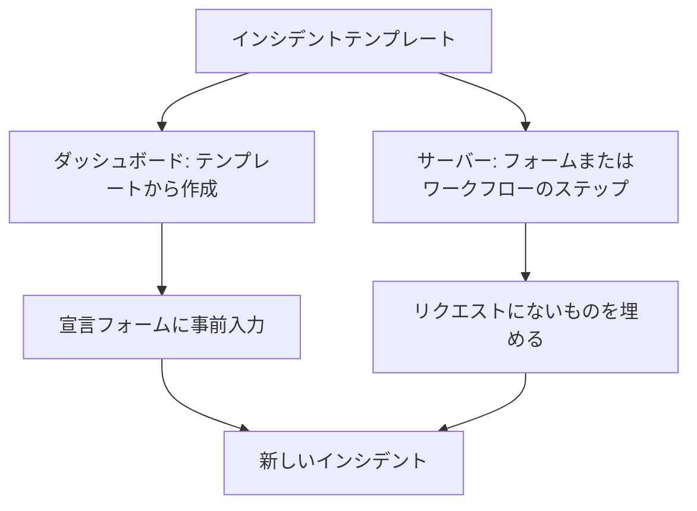
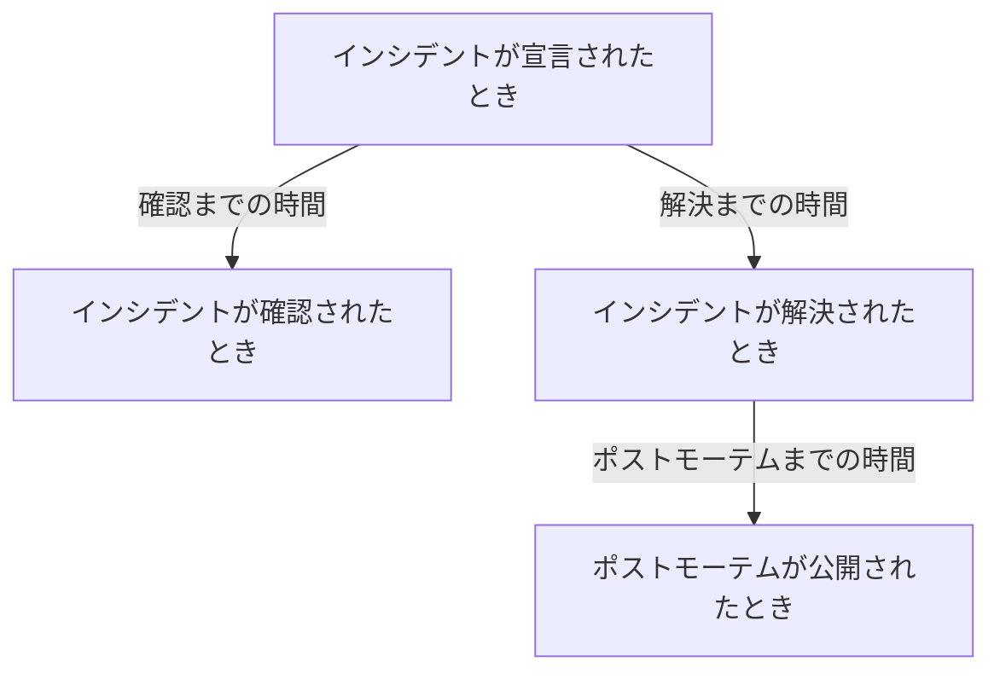
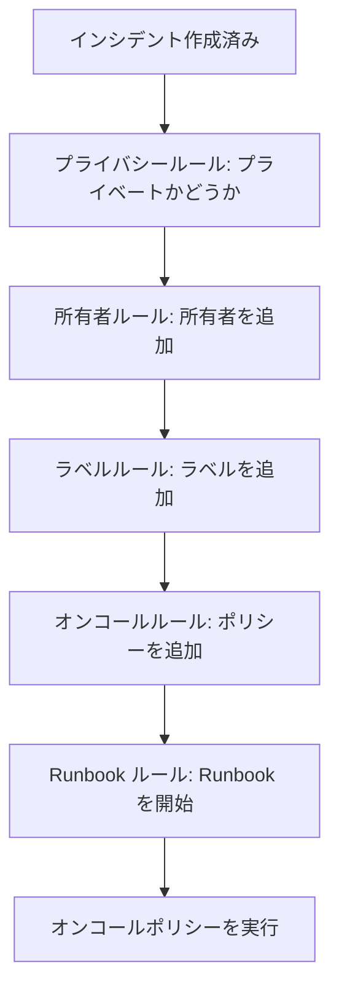

# インシデントの設定と自動化

インシデントの設定は **プロジェクト設定** ではなく **インシデント** の中にあります。状態と重大度、テンプレート、カスタムフィールド、ロール、測定値、番号プレフィックス、そして新しいインシデントのすべてに作用するルールです。このページは、それらの各ページと、インシデントが宣言された瞬間に自動で実行されるものについてのリファレンスです。

:::cards
- [インシデントテンプレート](#インシデントテンプレート): 同じ種類のインシデントを、毎回入力済みの状態で宣言します。
- [カスタムフィールド](#カスタムフィールド): すべてのインシデントに独自の項目を持たせ、宣言時に尋ねます。
- [測定値](#測定値): 確認、解決、緩和までの時間を、すべてのインシデントについて算出します。
- [ルール](#インシデントの作成時に実行されるルール): 所有者、ラベル、呼び出し、エピソードを自動で設定します。
:::

## インシデントの設定の場所

上部バーの **製品** メニューから **インシデント** を開き、サイドメニューの一番下にある **設定** を展開します。**ルール** と **設定** はどちらも折りたたまれた状態で始まるので、下のページを表示するには展開してください。ここにあるものはすべてプロジェクト単位です。テンプレート、ロール、カスタムフィールド、ルールは 1 つのプロジェクトに属し、そのプロジェクトで宣言されたすべてのインシデントに適用されます。ルートは `/dashboard/{projectId}/incidents/settings/` で始まります。

| ページ                         | そこで行うこと                                                                               |
| ------------------------------ | -------------------------------------------------------------------------------------------- |
| **インシデントの状態**         | インシデントがたどる状態の追加、名前の変更、色の変更、並べ替え。                             |
| **インシデントの重大度**       | 重大度のレベルの追加、名前の変更、色の変更、並べ替え。                                       |
| **インシデントテンプレート**   | インシデント全体（タイトル、説明、リソース、オンコールポリシー、所有者、ラベル）を事前に入力。 |
| **メモテンプレート**           | 公開メモと非公開メモの再利用できるテキスト。                                                 |
| **ポストモーテムテンプレート** | 再利用できるポストモーテムの構成。                                                           |
| **カスタムフィールド**         | すべてのインシデントに表示される追加の項目の定義。                                           |
| **インシデントロール**         | 対応者を割り当てるロール（インシデントコマンダーなど）の定義。                               |
| **測定値**                     | 確認までの時間や解決までの時間など、物事にかかる時間をすべてのインシデントで計測。           |
| **リンクされたアラート**       | インシデントにリンクされたアラートを、インシデントと一緒に確認・解決するかどうかの選択。新しいプロジェクトではどちらもオンです。 |
| **番号プレフィックス**         | インシデントとエピソードの番号の前に付くテキスト。たとえば `INC-42` の `INC-`。              |

OneUptime AI が自分で行うことはここでは設定しません。AI には専用のセクション **インシデント → AI** があり、ルートは `/dashboard/{projectId}/incidents/ai/` で始まります。その **設定** ページでは、新しいインシデントの調査、インシデントの自動修正（オンにするまではオフ。修正の一部である修正用と不足しているテレメトリー用のプルリクエストもその下にまとめられています）、ポストモーテムの下書きをオン・オフでき、それぞれ切り替えるとすぐに保存されます。調査・修正するインシデントを絞り込む調査ルールと自動修復ルール、そして AI が守る任意の上限は **その他の設定** の下に折りたたまれており、設定するまではどれも適用されません。その横には **インサイト** と **ログ** があり、AI がインシデントから学んだことと、AI が行ったすべてがわかります。[AI SRE](/docs/ai/ai-sre) を参照してください。

**インシデントの状態** と **インシデントの重大度** は [インシデントの状態と重大度](/docs/incidents/states-and-severities) で詳しく説明しているので、このページの残りは **インシデントテンプレート** から始めます。チーム外の人がインシデントを報告できるフォームは独立した製品です。[フォーム](/docs/forms/index) を参照してください。[Huntress](/docs/integrations/huntress) のように自分でインシデントを開くツールは、**インシデント → 連携** で設定します。

**ルール** を展開すると、さらに 8 つのページがあります。**グループ化ルール**、**オンコールルール**、**所有者ルール**、**Runbook ルール**、**プライバシールール**、**ラベルルール**、**SLA ルール**、**リマインダールール** です。これらは後で説明します。

## インシデントテンプレート

インシデントテンプレートは、インシデントの骨組みを保存したものです。決済クラスターが不安定になるたびに同じタイトル、同じモニターの一覧、同じオンコールポリシーを入力し直す代わりに、一度保存してそこから宣言します。

:::steps
1. **インシデント → 設定 → インシデントテンプレート**（`/dashboard/{projectId}/incidents/settings/templates`）に移動します。カードのタイトルは **インシデントテンプレート** です。
2. **インシデントテンプレートを作成** をクリックします。**テンプレート情報** でテンプレートに名前を付け、**インシデントの詳細** で、テンプレートが宣言するインシデントの **タイトル**、**インシデントの重大度**、**説明** を入力します。
3. **次へ** で任意のステップ（影響するリソース、カスタムフィールド、オンコールポリシー）を進み、この種類のインシデントすべてに共通する内容を入力します。
4. 最後のステップで **インシデントテンプレートを作成** をクリックします。これ以降、インシデント一覧の **テンプレートから作成** でこのテンプレートが表示されます。
:::

作成は 4 ステップのウィザードで進み、プロジェクトにインシデントのカスタムフィールドがある場合はさらに 2 ステップ加わります。答える必要があるのは最初の 2 つだけです。その後の任意のステップは **次へ** で進み、**インシデントテンプレートを作成** は最後のステップにあります。

- **テンプレート情報** — **テンプレート名** と **テンプレートの説明**。テンプレート自体の名前であり、インシデントに表示されることはありません。
- **インシデントの詳細** — **タイトル**、**説明**（Markdown）、**インシデントの重大度**。**その他の項目** の下（折りたたまれた見出しに 3 つの名前と、設定されているものが表示されます）には次のものがあります。
  - **初期インシデント状態** — テンプレートから宣言したインシデントが始まる状態。宣言フォームと同じく最初は空で、選択肢は状態の順序で並びます。プレースホルダーのとおり空のままにすると、通常の開始状態、つまりすべての新しいインシデントが始まるプロジェクトの作成状態から始まります。状態を設定して保存したテンプレートは、その状態を保ちます。
  - **所有者** — テンプレートから宣言したインシデントを所有する人とチーム。**所有者を追加** で両方を含む 1 つの一覧が開きます。これはインシデントの **所有者** ページと同じ一覧で、選んだものはそれぞれ外せるチップとして表示されます。既存のテンプレートでは **所有者** カードに表示されます。
  - **ラベル** — テンプレートから宣言したインシデントが最初に持つラベル。
- **影響を受けるリソース** — 宣言フォームと同じく、**モニター**、**変更後のモニターステータス**、ホスト・クラスター・サービス用の **その他の影響を受けるリソース** の順で、**次のステータスページに限定** は **その他の項目** の下にあります。テンプレートは、モニターを選んだかどうかにかかわらず、常に **変更後のモニターステータス** を尋ねます。テンプレートからインシデントを宣言するときに選んだモニターにも適用され、宣言フォームでは最初のモニターを選ぶとすぐに表示されるからです。既存のテンプレートの **影響を受けるリソース** カードも同じように尋ね、テンプレートが選んだステータスを、選んでいなければ **モニターのステータスは変わりません。** を表示します。**次のステータスページに限定** は、テンプレートから宣言したインシデントを、そのモニターを掲載するステータスページの一部に限定します。たとえば `Region East outage` テンプレートは東の拠点のページを持てます。既存のテンプレートでは、**ステータスページの範囲を編集** のある **ステータスページの範囲** カードに表示されます。[対象者ごとのステータス ページ](/docs/status-pages/one-status-page-per-audience) を参照してください。
- **カスタムフィールド** — プロジェクトにインシデントのカスタムフィールドがある場合だけ: このテンプレートから宣言したインシデントが最初に持つ値。**詳細** ステップで尋ねるものだけでなくすべてのフィールドが表示され、必須のものはありません。既存のテンプレートには、それらを変更する **カスタムフィールド** カードがあります。
- **作成時のカスタムフィールド** — これもプロジェクトにインシデントのカスタムフィールドがある場合だけ: このテンプレートからインシデントを宣言するときに **詳細** ステップでどれを尋ね、どれを必須にするか。既存のテンプレートには、それらを変更する **作成時のカスタムフィールド** カードがあります。[作成時のカスタムフィールド](#作成時のカスタムフィールド) を参照してください。
- **オンコール** — **オンコールポリシー**。このテンプレートから作成したインシデントが宣言されたときに実行するポリシーです。

いくつかの簡単なルール:

- テンプレート一覧に表示されるのは **名前** と **説明** だけです。一覧から行を編集・削除することはできません。変更するにはテンプレート（`/dashboard/{projectId}/incidents/settings/templates/{modelId}`）を開きます。
- テンプレートを編集できる人は誰でも、**初期インシデント状態** と **変更後のモニターステータス** を含め、その詳細と影響を受けるリソースを変更できます。Project Owners、Project Admins、Project Members、Incident Admins、Incident Members、そして **Edit Incident Template** を持つロールです。
- テンプレートは JSON のインポートとエクスポートに対応しているので、プロジェクト間で移せます。
- テンプレートがない場合、一覧には **インシデントテンプレートが見つかりません** と表示され、そのすぐ下に **インシデントテンプレートを作成** があります。
- テンプレートがない場合は、インシデント一覧の **テンプレートから作成** も **インシデントテンプレートはありません** ダイアログを開き、テンプレートを作る場所を案内します。その **テンプレートを作成** ボタンで **インシデント → 設定 → インシデントテンプレート** が開きます。

### テンプレートが適用されるしくみ

経路は 2 つあり、どちらも同じ方法でマージします。



- **ダッシュボードで** — インシデント一覧の **テンプレートから作成** ボタンは **インシデントテンプレートを選択** の選択欄を開き、宣言ページはクエリ文字列のパラメーター `incidentTemplateId` からテンプレートを読み取って、テンプレートとその所有者チーム・所有者ユーザーでフォームを事前に入力します。その **詳細** ステップは、テンプレートの [作成時のカスタムフィールド](#作成時のカスタムフィールド) に従います。所有者は、インシデントの Slack と Microsoft Teams のチャネルができた時点で、通知なしでインシデントの所有者になるので、インシデントの所有者を新しいチャネルに招待する通知ルールは、彼らも招待します。
- **サーバーで** — **インシデントテンプレート** を持つ [フォーム](/docs/forms/on-submit#the-incident-template) と、**Incident Template** を選んだワークフローの **Create One Incident** ステップは、サーバー上でテンプレートからインシデントを宣言します。ステップはワークフローのプロジェクトの Project Admin としてテンプレートを読み取るので、別のプロジェクトのテンプレートや削除されたテンプレートは拒否され、インシデントテンプレートを含まないプランでは、必要なプランを示してステップが拒否されます。ダッシュボードと同じく、テンプレートの所有者はインシデントの所有者になります。[ワークフロー コンポーネント](/docs/workflows/components) を参照してください。

サーバーで宣言されたインシデントは、テンプレートを `createdIncidentTemplateId` に記録します。この列を設定するのは OneUptime だけで、テンプレートを指定するフォームやワークフローのステップのためです。API キーやサインインしたユーザーには設定できず、`createdIncidentTemplateId` を送るリクエストは拒否されます。API でテンプレートから宣言するには、`/api/incident-templates` からテンプレートを読み取り、その値をリクエストで送ってください。

> [!IMPORTANT]
> 重要なのはマージのルールです: **テンプレートが埋めるのは、未定義のままにした項目だけです**。タイトル、説明、インシデントの重大度、初期インシデント状態、**変更後のモニターステータス** の背後にあるモニターステータス、モニター、ホスト、Kubernetes クラスター、Docker ホスト、Podman ホスト、サービス、オンコールポリシー、ラベル、ステータスページは、呼び出し側やフォームが何も指定しなかった場合にだけテンプレートからコピーされます。明示的に設定したものは、状態も含めて常に優先されます。状態を指定したインシデントは、ダッシュボードと同じく、その状態から始まり、それ以外はすべてテンプレートから取ります。カスタムフィールドの値はフィールドごとにマージされます。テンプレートは、インシデントが値なしで宣言されたフィールドを埋め、あなたが設定した値（`0`、`false`、`null` を含む）はテンプレートの値より優先されます。

### 作成時のカスタムフィールド

インシデントの宣言時に **詳細** ステップで何を尋ねるかは、プロジェクトの設定で決まります。**作成時に表示** はフィールドを尋ね、**作成時に必須** はそれを必須にします。テンプレートは、そのテンプレートから宣言するインシデントについて、どちらも変更できます。テンプレートの **作成時のカスタムフィールド** カード（と同名のウィザードのステップ）には、インシデントのすべてのカスタムフィールドがその **順序** で並び、それぞれに設定が 1 つあります。

| 設定           | このテンプレートからインシデントを宣言するとき                                                                                     |
| -------------- | ---------------------------------------------------------------------------------------------------------------------------------- |
| **デフォルト** | フィールドは自身の **作成時に表示** と **作成時に必須** に従います。選択肢にどちらかが示されます。たとえば **デフォルト（必須）**。 |
| **必須**       | **詳細** ステップでフィールドを尋ね、入力が必要です。はい/いいえのフィールドはオンにする必要があります。                           |
| **任意**       | ステップでフィールドを尋ねますが、空のままにできます。プロジェクトが必須にしていてもです。                                        |
| **非表示**     | プロジェクトが表示または必須にしていても、ステップではフィールドを尋ねません。そのフィールドのテンプレート自身の値は引き続き適用されます。 |

カードでは、テンプレートが **必須**、**任意**、**非表示** に設定したフィールドに、型の下にプロジェクトでの扱いも表示されます: **プロジェクトのデフォルト：必須**、**プロジェクトのデフォルト：任意**、**プロジェクトのデフォルト：表示しない**。テンプレートを見られる人なら誰でも確認できます。

あるテンプレートのインシデントだけが他にはない回答を必要とする場合（たとえば `Customer data exposure` テンプレートでの顧客のランク）や、プロジェクトがどこでも尋ねる質問を、それが合わないテンプレートから外したい場合に使います。

- **テンプレート変数をキーにします。** 各設定はフィールドの **テンプレート変数** の下に保存され、これは変わらないので、フィールドの名前を変えても設定は保たれます。削除して同じ名前で作り直したフィールドは設定を取り戻します。フィールドを ID で指定するフォームの質問とは違います。フォームでは、削除して作り直したフィールドは、もう一度追加するまで尋ねられません。
- **編集と保存は改めて読み込みます。** カードの **編集** は、その間ダイアログに読み込み表示を出しながら、フィールドとテンプレートの設定を読み込み直し、**保存** はもう一度読み込んで、ダイアログで変更したフィールドだけを書き込みます。そのため、その間に別の管理者が他のフィールドに加えた変更（ダイアログを開いている間に作られたフィールドへの設定を含む）は保たれ、その間に削除されたフィールドへの変更は書き込まれません。その後、カードにはフィールドが現在の状態で表示されます。**編集** を押したときに読み込めなければ、ダイアログに理由が表示され、**保存** の代わりに **再試行** が表示されます。**保存** を押したときに読み込めなければ、理由が表示され、何も保存されず、選択内容はそのまま残ります。
- **適用するのはダッシュボードだけです。** **作成時に必須** と同じく、これらの設定が形作るのは **インシデントを宣言** フォームだけです。API、ワークフロー、モニター、Slack、Microsoft Teams、AI が宣言したインシデントはこれに縛られず、[フォーム](/docs/forms/building) は独自の質問をします。[作成時に必須はダッシュボードだけが確認する](#作成時に必須はダッシュボードだけが確認する) を参照してください。
- **モニターのカスタムフィールドからコピーするフィールド** は、テンプレートの設定にかかわらず、インシデントにモニターがあると引き続き尋ねられません。
- **インシデントテンプレートを編集できる人なら誰でも変更できます** — Project Members と Incident Members も含みます。Project Admin がプロジェクト全体で **作成時に必須** にしたフィールドでもです。プロジェクト全体の設定自体には、Project Owner、Project Admin、または **Edit Incident Custom Field** 権限が必要です。
- **テンプレートと一緒に移動します。** テンプレートの JSON エクスポートにはこれらが含まれ、インポート先のプロジェクトでは、同じ **テンプレート変数** を持つフィールドに適用されます。

API では、これらはテンプレートの `customFieldSettings` です。各フィールドの **テンプレート変数** をキーにしたオブジェクトで、各フィールドに `Required`、`Optional`、`Hidden`、`Default` のいずれかを指定します。

```json title="customFieldSettings"
{
  "customFieldSettings": {
    "impact": "Required",
    "affected_location": "Optional",
    "additional_information": "Hidden"
  }
}
```

一覧にないフィールドは、`Default` と同じく自身の設定に従います。キーが有効な **テンプレート変数**（小文字、数字、アンダースコア）でない場合や、値が 4 つのいずれでもない場合、リクエストは `400` エラーで拒否されます。どのフィールドにも一致しないキーは保存されますが、無視されます。

## メモテンプレート

メモテンプレートは、インシデントの更新のための定型文を対応者に用意します。午前 3 時のステータスページの更新を、寝ぼけた誰かがゼロから書かずに済むようにするためです。

:::steps
1. **インシデント → 設定 → メモテンプレート**（`/dashboard/{projectId}/incidents/settings/note-templates`）に移動します。カードのタイトルは **インシデント用の公開メモテンプレートまたは非公開メモテンプレート** で、1 つのライブラリーが両方の種類のメモに使われます。
2. **インシデントのメモテンプレートを作成** をクリックし、1 ページのフォームに入力します。**テンプレート名** と **テンプレートの説明**（どちらも必須）、そして Markdown の **メモ** 本体（必須）です。テンプレートを選んだときにメモが最初に持つテキストです。
3. 保存します。テンプレートは、両方のメモのページの **テンプレート** と、**インシデントを確認** および **インシデントを解決** ダイアログの **メモテンプレートを選択** に表示されます。
:::

インシデントテンプレートと同じく、行は一覧の中で編集するのではなく、作成して閲覧します。変更するにはテンプレートを開きます。

**変数。** メモテンプレートには、テンプレートを選んだときにインシデントの値で埋められる変数を入れられるので、書き手は投稿前に完成したテキストを確認し、変更することもできます。

| 変数                                | 埋められる値                                                       |
| ----------------------------------- | ------------------------------------------------------------------ |
| `{{incident.title}}`                | インシデントのタイトル。                                           |
| `{{incident.number}}`               | 番号。たとえば `INC-42` や `#42`。                                 |
| `{{incident.severity}}`             | 重大度。                                                           |
| `{{incident.state}}`                | 現在の状態。                                                       |
| `{{incident.startedAt}}`            | 宣言された日時。書き手のタイムゾーンで、タイムゾーン名付き。       |
| `{{incident.labels}}`               | ラベル。カンマ区切り。                                             |
| `{{incident.affectedStatusPages}}`  | インシデントが表示され、通知するステータスページのうち、書き手が見られるもの。 |
| `{{incident.customFields.<key>}}`   | カスタムフィールドの値。フィールドの **テンプレート変数** で指定し、**メモ** エディターは **テンプレート変数** の下にフィールドの名前で一覧を表示します。 |

以前はカスタムフィールドを `{{customFields.<key>}}` と書いていました。この書き方を使っているテンプレートも同じように埋められます。値のない変数や一覧にない変数は書いたとおりに残り、書き手が埋められます。値はテキストとして入るので、投稿したメモの中でインシデントのタイトルが画像、HTML、リンク先を隠すテキストのリンクになることはありません。ただし、タイトル内のアドレスは、そのアドレスへのリンクとして表示されます。**リッチテキスト（Markdown）** のカスタムフィールドは、その Markdown のまま入ります。

> [!IMPORTANT]
> カスタムフィールド、ラベル、ステータスページの変数は、チーム自身の記録で埋められます。**購読者への通知に含める** が付いているかどうかにかかわらず、すべてのカスタムフィールドです。そして 1 つのライブラリーが公開メモにも使われ、公開メモはインシデントのステータスページに表示され、その購読者にメールで送られます。公開メモを投稿する前に、埋められたテキストを読んでください。

**変数の入れ方。** 変数の名前を入力する必要はありません。**メモ** エディターには変数を入れる方法が 3 つあり、どれもカーソルのある位置に変数を入れます。

- **テンプレート変数** はエディターの下に折りたたまれています。開くと、すべての変数と埋められる値（プロジェクトのインシデントのカスタムフィールドは名前で）が表示されるので、クリックします。
- エディターのツールバーの末尾にある **変数を挿入**: 同じ一覧を検索ボックス付きで表示します。
- メモに `{{` と入力すると、カーソルの下に一覧が開きます。続けて入力して絞り込み、矢印キーで選んで Enter または Tab で変数を入れます。Escape で一覧を閉じます。

同じ一覧、ボタン、`{{` は、変数を持つ他のテンプレートにもあります。SLA ルールのメモのリマインダー、インシデントやアラートのグループ化ルールのエピソードのタイトルと説明、モニターのルールのインシデントとアラートの説明と修復メモ、SLO のバーンレートルールのテンプレート、ステータスページのカスタムの購読者通知テンプレートです。

メモテンプレートは、実際に必要な場所に表示されます。**インシデントを確認** と **インシデントを解決** の確認ダイアログには、どちらも **公開メモを追加** の下に折りたたまれた **公開メモ** 項目の上に **メモテンプレートを選択** があります。公開メモと非公開メモの違いは [インシデントのメモ、オーナー、フィード](/docs/incidents/notes-owners-and-feed) を参照してください。

## ポストモーテムテンプレート

ポストモーテムテンプレートは、インシデントの後に作る振り返りの文書の骨組みです。見出し、問いかけ、毎回の質問をまとめておけば、プロジェクトのすべての振り返りが同じ形になります。

:::steps
1. **インシデント → 設定 → ポストモーテムテンプレート**（`/dashboard/{projectId}/incidents/settings/postmortem-templates`）に移動します。カードのタイトルは **ポストモーテムテンプレート** です。
2. **インシデントのポストモーテムテンプレートを作成** をクリックし、1 ページのフォームに入力します。**テンプレート名** と **テンプレートの説明**（どちらも必須）、そして本体である **ポストモーテムテンプレート**（Markdown、必須）です。
3. 保存します。これで、すべてのインシデントの **ポストモーテム** ページに **テンプレートを適用** が表示されます。
:::

テンプレートは設定からではなく、インシデントから適用します。インシデントを開き、サイドメニューで **ポストモーテム**（`/dashboard/{projectId}/incidents/{incidentId}/postmortem`）を選んで **テンプレートを適用** を使います。**テンプレートを選択** ドロップダウンのある **ポストモーテムテンプレートを適用** ダイアログが開き、テンプレートを選ぶとその本文が **ポストモーテムのメモ** エディターに読み込まれるので、保存前に編集します。インシデントエピソードにも同じ **ポストモーテム** ページがあり、同じテンプレートのライブラリーを使います。**テンプレートを適用** が表示されるのは、プロジェクトにポストモーテムテンプレートがある場合だけで、1 つしかなければすでに選ばれています。エディターはインシデントの現在のポストモーテムを、テンプレートをメモにして開くので、ステータスページに表示されているかどうか、公開日時、添付ファイルはそのまま変わりません。

## カスタムフィールド

カスタムフィールドを使うと、社内のサービス名、変更チケットの参照、顧客のランクなど、独自のメタデータをすべてのインシデントに持たせ、影響や解決見込みの時刻など、インシデントを宣言するたびに同じ質問ができます。

:::steps
1. **インシデント → 設定 → カスタムフィールド**（`/dashboard/{projectId}/incidents/settings/custom-fields`）に移動します。ページのタイトルは **インシデントのカスタムフィールド** で、フィールドが **順序** どおりに、それぞれ **フィールド名** と **フィールドタイプ** だけで並びます。
2. **インシデントのカスタムフィールドを作成** をクリックし、**フィールド名**、**フィールドの説明**、**フィールドタイプ** を入力します。ドロップダウンの型なら、型のすぐ下に選択肢も入力します。
3. インシデントを宣言するたびにフィールドを尋ねるには、**その他の項目** を開いて **作成時に表示** をオンにし、回答が必須なら **作成時に必須** もオンにします。
4. 保存してから、フィールドを表示したい位置まで行をつまみでドラッグします。フィールドの行の **編集** で、残りの設定が開きます。
:::

フィールドを作成するときは、**フィールド名**、**フィールドの説明**、**フィールドタイプ** を 1 ページで尋ね、ドロップダウンの型なら型のすぐ下で選択肢も尋ねます。新しいフィールドの値は手入力です。それ以外はすべて **その他の項目** の下にあり、フィールドの作成時も編集時も折りたたまれた状態で始まります。折りたたまれている間、見出しには中身の名前と設定されているものが表示されます。代わりにモニターのカスタムフィールドから値をコピーするフィールドを作るには、**インシデントのカスタムフィールドを作成** の横の **その他** メニュー（**⋯**）を開き、**マッピングされたカスタムフィールドを作成** を選びます。[モニターからコピーするフィールド](#モニターからコピーするフィールド) を参照してください。

各定義には次の項目があります。

- **フィールド名** — 必須で、2 文字以上。プレースホルダーは `internal-service` のようなスラッグ風の名前を示しています。
- **フィールドの説明** — 任意。
- **フィールドタイプ** — 必須。データの入力方法を選びます。型は下に一覧があります。ドロップダウンの型には選択肢の一覧も必要です。
- **ドロップダウンのオプション** — ドロップダウンに表示される値で、それぞれに任意の色を付けられます。選択肢の横の小さなボタンが色を示し、他のすべての色の項目と同じ名前付きの色を開きます。先頭に **色なし**、正確なコード用に **カスタムカラー** があります。選択肢の並び順を変えるには、行の先頭にあるつまみでドラッグします。インシデントに値が入った後でも、選択肢を追加、名前の変更、削除できます。[ドロップダウンの選択肢を変更する](#ドロップダウンの選択肢を変更する) を参照してください。
- **順序** — インシデントのカスタムフィールドの中でフィールドが表示される位置です。インシデントの **カスタムフィールド** ページ、**詳細** ステップ、購読者へのメッセージで使われます。入力する数値はありません。行の先頭にあるつまみでフィールドをドラッグして上下に移動し、新しいフィールドは末尾に追加されます。フィルターや検索で一覧を絞り込んでいる間は、ドラッグできません。
- **作成時に表示** — **その他の項目** の下。ダッシュボードからインシデントを宣言するとき、**詳細** ステップでフィールドを尋ねます（[インシデントの宣言](/docs/incidents/declaring-incidents) を参照）。インシデントテンプレートは、作成時に表示されるかどうかにかかわらず、どのフィールドにも初期値を設定でき、そのテンプレートから宣言するインシデントについて、フィールドを尋ねたり外したりできます。[作成時のカスタムフィールド](#作成時のカスタムフィールド) を参照してください。[フォーム](/docs/forms/building#custom-fields) はこれに従いません。フォームが尋ねるのは、フォームに追加したフィールドだけです。
- **作成時に必須** — **その他の項目** の下にあり、**作成時に表示** がオンになると表示されます。**詳細** ステップでは、フィールドが入力されるまでインシデントを宣言できず、**ブール値** のフィールドはオンにする必要があります。これを確認するのはダッシュボードだけです。[作成時に必須はダッシュボードだけが確認する](#作成時に必須はダッシュボードだけが確認する) を参照してください。
- **購読者への通知に含める** — **その他の項目** の下。インシデントのメッセージと一緒に、フィールドとその値をステータスページの購読者に送ります。既定のメール、Slack、Microsoft Teams のメッセージと Webhook が対象で、SMS は対象外です。購読者は通常チーム外の人なので、共有して問題のないフィールドだけでオンにしてください。[購読者とお知らせ](/docs/status-pages/subscribers#インシデント) を参照してください。
- **テンプレート変数** — テンプレートがフィールドを参照するためのキーで、メモテンプレートとカスタムの購読者通知テンプレートで `{{incident.customFields.<key>}}` として使います。フィールドの作成時に名前から作られ（小文字、数字、アンダースコアなので、`Expected Resolution` は `expected_resolution` になり、別のフィールドがすでにそのキーを持っていれば `_2`、`_3` などが付きます）、フィールドの名前を変えても変わりません。手で設定する人はいません。API はこれに送られた値を無視します。古い `{{customFields.<key>}}` で書いたテンプレートも引き続き動作します。調べる必要もありません。これを入れるエディター（メモテンプレートの **メモ** と、インシデントのイベント用のステータスページのカスタムの購読者通知テンプレート）は、**テンプレート変数** の下に、すべてのフィールドの変数をフィールドの名前で一覧表示します。フィールドの **編集** フォームでも、**その他の項目** の一番下に読み取り専用で、コピー用のボタン付きで表示されます。

**順序**、**作成時に表示**、**作成時に必須**、**購読者への通知に含める**、**テンプレート変数** があるのは、インシデントのカスタムフィールドだけです。モニター、アラート、予定メンテナンスイベント、その他のリソースのカスタムフィールドにはありません。

定義は専用のモデルにあり、値はインシデント自体の `customFields` 列にあります。個々のインシデントでは、インシデントのサイドメニューの **カスタムフィールド**（`/dashboard/{projectId}/incidents/{incidentId}/custom-fields`）で入力し、そこではフィールドが **順序** どおりに並びます。インシデントテンプレートは、同じフィールドの値を自身の `customFields` に持ちます。

**知っておくべき 1 つの抜け。** インシデントのカスタムフィールドの定義は、インシデント関連の中で唯一ワークフローのトリガーがありません。後述のワークフローのセクションを参照してください。

### フィールドの型

| フィールドタイプ                        | 入力方法                                              | 向いている用途                                     |
| --------------------------------------- | ----------------------------------------------------- | -------------------------------------------------- |
| **テキスト**                            | 1 行のテキスト                                        | 変更チケットの参照、社内のサービス名               |
| **数値**                                | 数値                                                  | 見積もり時間（分）、影響を受けたユーザー数         |
| **ブール値**                            | はい/いいえのスイッチ                                 | 同意の確認、「顧客に影響がある」                   |
| **ドロップダウン（単一選択）**          | 一覧から 1 つの選択肢                                 | 影響、リージョン                                   |
| **ドロップダウン（複数選択）**          | 一覧から複数の選択肢                                  | 影響を受けたシステム                               |
| **日付**                                | 日付                                                  | 契約の更新日                                       |
| **日付と時刻**                          | 日付と時刻                                            | 解決見込み                                         |
| **長いテキスト**                        | 複数行のプレーンテキスト                              | 影響を受けたユーザーやシステム、補足情報           |
| **リッチテキスト（Markdown）**          | 書式付きテキスト。ビジュアルモードのある Markdown エディターで入力 | リンクやリストを含む回避策            |

**長いテキスト** と **リッチテキスト（Markdown）** は、インシデントだけでなく、すべてのリソースのカスタムフィールドで使えます。リッチテキストの値は、書かれた Markdown のまま保存されます。ラジオボタンやチェックボックスのグループの型はありません。**ドロップダウン（単一選択）**、**ドロップダウン（複数選択）**、**ブール値** を使ってください。

### 作成時に必須はダッシュボードだけが確認する

**作成時に必須** が引き止めるのは **インシデントを宣言** フォームだけです。モニター、API、Slack、Microsoft Teams、AI が開くインシデントはフォームに入力できないので、フィールドが空のまま作成されます。インシデントができた後は、その **カスタムフィールド** ページですべてのフィールドが任意のままなので、障害の最中に 1 つの値を直す対応者が、他のすべてを求められることはありません。すべてのインシデントに値があるという保証ではなく、インシデントを宣言する人への促しだと考えてください。

テンプレートの [作成時のカスタムフィールド](#作成時のカスタムフィールド) も同じで、形作るのは **インシデントを宣言** フォームだけです。例外は [フォーム](/docs/forms/building#required-questions) です。フォームの送信時に、サーバーがフォームの **必須** の質問を確認するからです。

### モニターからコピーするフィールド

カスタムフィールドは、手入力の代わりに、インシデントのモニターのカスタムフィールドから値を取れます。たとえば、モニターがすでに記録しているリージョンや顧客のランクです。作るには、**インシデントのカスタムフィールドを作成** の横の **その他** メニュー（**⋯**）を開き、**マッピングされたカスタムフィールドを作成** を選びます。尋ねられるのは 3 つです。

- **モニターのフィールド** — コピーするモニターのカスタムフィールド。すべてが表示され、それぞれ名前の下に型があります。新しいフィールドはその型とドロップダウンの選択肢を受け継ぐので、2 つは常に一致します。
- **フィールド名** — 別の名前を入力するまでは、モニターのフィールドの名前になります。
- **フィールドの説明** — 任意。

値は、インシデントがモニター付きで作成されたときに入り、モニターの値が変わると更新されます。インシデントのモニターの値が異なる場合、単一の値のフィールドはそのままにされ、複数選択のフィールドにはすべての値が入ります。コピーで値が消えることはありません。モニターのないインシデントは入力された値を保ち、モニターの値を消してもコピーはそのままです。インシデントにモニターがあると、**詳細** ステップはコピーされるフィールドを尋ねません。

既存のフィールドの値をモニターからコピーするようにしたり、コピー元のモニターのフィールドを変えたり、手入力に戻したりするには、フィールドの行の **編集** を開き、**その他の項目** の下の **値のマッピング元** を使います。アラートと予定メンテナンスのカスタムフィールドも、同じようにモニターからコピーできます。

### API によるカスタムフィールドの値

`POST /api/incident` とインシデントの更新では、`customFields` は各フィールドの **フィールド名** をキーにしたオブジェクトです。

```json title="customFields"
{
  "customFields": {
    "Impact": "Major",
    "Estimated Duration": 90,
    "Acknowledgement": true,
    "Expected Resolution": "2026-10-01T14:30:00.000Z"
  }
}
```

ユーザーや API キーがインシデントを作成・更新するとき、リクエストが設定・変更する各値はフィールドに合っている必要があります。合わなければ、フィールドと送られた値を示す `400` エラーでリクエストが拒否されます。

| フィールドタイプ                                                       | 受け付ける値                                                   |
| ---------------------------------------------------------------------- | -------------------------------------------------------------- |
| **テキスト**、**長いテキスト**、**リッチテキスト（Markdown）**         | テキスト。数値、`true`、`false` は送られたとおりに保存されます。 |
| **数値**                                                               | 数値、または `"42"` のような数値のテキスト。                   |
| **ブール値**                                                           | `true` または `false`、あるいはテキストの `"true"` または `"false"`。 |
| **日付**、**日付と時刻**                                               | 日付。ISO 8601 形式のテキストが望ましいです。                  |
| **ドロップダウン（単一選択）**                                         | 選択肢の 1 つ。                                                |
| **ドロップダウン（複数選択）**                                         | 選択肢の一覧、または単独の選択肢 1 つ。                        |

**ドロップダウン（複数選択）** では、拒否の際に、選択肢にない最初の 10 件と、残りがあと何件あるかが示されます。

既存の連携機能が動き続けるように、次のものは確認されません。

- **リクエストが変更しない値。** **カスタムフィールド** カードは、どれか 1 つを保存するときにすべての値を送り返すので、これらの確認ができる前に保存された値や、その後削除されたドロップダウンの選択肢があっても、他の値の保存を妨げることはありません。複数選択のフィールドは、すでに持っていた項目を保ちます。
- **インシデントのカスタムフィールドの名前でないキー**。たとえば [Jira 統合](/docs/integrations/jira) が書き込む `jiraIssueKey` です。
- **空の値。** `null` や空文字列はフィールドを消去します。
- **モニターのカスタムフィールドからコピーした値**、および OneUptime 自身による書き込み。
- **作成時に必須。** API がフィールドを求めることはありません。

フォームやワークフローの **Create One Incident** ステップがテンプレートから宣言したインシデント（`createdIncidentTemplateId`）は、テンプレートのカスタムフィールドの値から始まり、送られた値の下にフィールドごとにマージされます（[テンプレートが適用されるしくみ](#テンプレートが適用されるしくみ) を参照）。API キーはテンプレートから宣言できません。`createdIncidentTemplateId` を送るリクエストは拒否されます。

### フィールドの名前を変更する

値はフィールドの名前の下に保存されるので、フィールドの名前を変えるときは値を移す必要があります。新しい **フィールド名** を保存すると、OneUptime はプロジェクトのすべてのインシデントとすべてのインシデントテンプレートで、フィールドの値を新しい名前に移し、そのフィールドを表示したりそれで絞り込んだりするインシデント一覧の保存済みビューを更新します。この移動は **On Update Incident** ワークフローを開始せず、どのインシデントの最終更新日時も変えません。フィールドの **テンプレート変数** はそのままなので、それを使うメモテンプレート、カスタムの購読者通知テンプレート、Webhook 連携は引き続き動作します。

拒否される名前の変更は 2 つです。別のインシデントのカスタムフィールドがすでに持っている名前（大文字と小文字は区別しません）への変更と、複数のフィールドの名前を一度に変える API リクエストです。フィールドの古い名前で値を読み書きするワークフローや API クライアントは、新しい名前に変える必要があります。

名前を変えた後、フィールドは自身の値だけを持ちます。フィールドを削除しても、その値は持っていたインシデントに残るので、インシデントは削除されたフィールドからの値を新しい名前の下に持っていることがあります。名前の変更はそれらを消去します。このフィールドの回答として表示したり、購読者に送ったりしないためです。すべてのインシデントとテンプレートは一緒に移されます。移動に失敗すると、どれも変わらず、フィールドは古い名前を保ち、保存はエラーを報告するので、そのままやり直せます。削除されたフィールドの名前で **作成した** フィールドは別です。そのフィールドが残した値を表示し、**購読者への通知に含める** がオンなら購読者に送ります。

フィールドを削除しても、それを尋ねる質問はプロジェクトのすべての [フォーム](/docs/forms/building#custom-fields) に残りますが、もう尋ねられることはありません。フォームビルダーは、削除できるようにそれぞれに印を付けます。同じ名前で作り直したフィールドは新しいフィールドで、誰かがフォームに追加するまでフォームでは尋ねられません。インシデントテンプレートは、そのフィールドの **作成時のカスタムフィールド** の設定を保ちます。

### ドロップダウンの選択肢を変更する

**ドロップダウン（単一選択）** または **ドロップダウン（複数選択）** のフィールドの選択肢は、いつでも変更できます。フィールドの行の **編集** を開いてください。インシデントは与えられた選択肢のテキストを保存するので、選択肢を持つインシデントに変更がどう影響するかは、変更の内容によります。

| 選択肢に対して行うこと              | その選択肢を持つインシデントに起きること                                                                           |
| ----------------------------------- | ------------------------------------------------------------------------------------------------------------------ |
| **追加** する                       | 何も起きません。これ以降、選択肢として表示されます。                                                               |
| **名前を変更** する（テキストを変える） | 新しい名前で表示されます。選択肢の下に、フォームが何件のインシデントがそうなるかを表示します。                   |
| **外す**（横のごみ箱）              | インシデントは値を保ち、_選択肢ではなくなりました_ として表示されます。**選択肢でなくなった値** で別の選択肢を選んだ場合を除きます。 |
| つまみで **ドラッグ** する          | 何も起きません。選択肢の並び順だけが変わります。                                                                   |

フォームは開いたときに、各値を持つインシデントの件数を数えます。**選択肢でなくなった値** には、外した選択肢のうちまだインシデントが持っているものと、一度も選択肢でなかったインシデントの値（たとえば API で書き込まれたもの）が、それぞれ持っているインシデントの件数とともに並びます。それぞれについて、そのままにするか、そのインシデントが代わりに持つべき選択肢を選びます。**元に戻す** は、誤って外した選択肢を元に戻します。

保存すると、名前を変えた選択肢と、選択肢を選んだ値が移されます。プロジェクトのすべてのインシデントとインシデントテンプレート、それで絞り込むインシデント一覧の保存済みビュー、そして [フォームテンプレート](/docs/forms/building) がそのフィールドについて与える回答です。フィールドの名前の変更と同じく、この移動は **On Update Incident** ワークフローを開始せず、どのインシデントの最終更新日時も変えません。失敗すると何も移されず、フィールドは古い選択肢を保ちます。古いテキストで選択肢を書き込むワークフロー、API クライアント、Terraform の設定には、新しいテキストが必要です。

フィールドがもう提供しない値を持つインシデントは、その **カスタムフィールド** ページとインシデント一覧で、_選択肢ではなくなりました_ の印付きでその値を表示します。他のフィールドを編集しても値は保たれます。変えるには別の選択肢を選びます。

他のすべてのリソースのカスタムフィールドも同じように動作します。モニター、アラート、予定メンテナンスイベント、ステータスページ、オンコールポリシー、チーム、チームメンバー、インベントリ項目です。モニターのフィールドの選択肢の名前を変えたり追加したりすると、それをコピーするインシデント、アラート、予定メンテナンスのフィールドにも同じことが行われるので（[モニターからコピーするフィールド](#モニターからコピーするフィールド) を参照）、それらはコピーするすべての値を引き続き提供します。

API では、新しい一覧を `dropdownOptions` として、名前の変更を `miscDataProps` で送ります。

```json
{
  "data": { "dropdownOptions": "Facility Alpha\nFacility B" },
  "miscDataProps": {
    "renamedDropdownOptions": [{ "from": "Facility A", "to": "Facility Alpha" }]
  }
}
```

各 `to` は、保存後のフィールドの選択肢の 1 つである必要があり、各 `from` の名前の変更は 1 回だけです。`renamedDropdownOptions` がなければ一覧は変わり、保存済みの値はすべてそのまま残ります。Terraform で `dropdown_options` を変更した場合も同じです。

### Terraform

これらの設定は、`oneuptime_incident_custom_field` リソースの `sort_order`、`show_on_create`、`is_required_on_create`、`include_in_subscriber_notifications` です。`variable_key` は読み取り専用で、フィールドの作成時に OneUptime が作ったキーです。

`sort_order` を省略すると、新しいフィールドは一覧の末尾に入ります。別のフィールドがすでに持っている番号を指定すると、その位置に入り、間にあるフィールドは 1 つずつずれます。他のどのフィールドも持っていない番号は、書いたとおりに保たれます。

## 測定値

測定値は、インシデントの 2 つの時点の間の時間です。**確認までの時間** はインシデントが宣言されてから誰かが確認するまでの時間で、**解決までの時間** は宣言から解決までです。測定値は一度設定すれば、OneUptime が過去のインシデントも含めたすべてのインシデントについて算出してチャートにするので、チームが速くなっているかどうかがわかります。

**インシデント → 設定 → 測定値**（`/dashboard/{projectId}/incidents/settings/measurements`）に移動し、**インシデントの測定値を作成** を選びます。各定義には **名前**、**開始点**、**終了点** があります。永続的な **キー** は、入力中の名前から作られるので（「Time to Detect」なら `time-to-detect`）、入力するものはありません。自分でキーを決めるには、測定値を作成する前に、その横の **編集** を選びます。



アラートと予定メンテナンスイベントにも同じ機能があり、**アラート → 設定 → 測定値** と **定期メンテナンス → 設定 → 測定値** にあります。以下の内容は 3 つすべてに、それぞれの時点で当てはまります。

### 既製の測定値

フォームは **何を計測しますか？** で開きます。次のいずれかを選ぶと、名前、説明、両方の時点が入力されます。**次へ** で時点が表示され、その最後のステップから測定値が作成されます。

| 場所                      | 測定値                                 | 開始のタイミング                                  | 終了のタイミング                       |
| ------------------------- | -------------------------------------- | ------------------------------------------------- | -------------------------------------- |
| インシデント              | **確認までの時間**                     | インシデントが宣言されたとき                      | インシデントが確認されたとき           |
| インシデント              | **解決までの時間**                     | インシデントが宣言されたとき                      | インシデントが解決されたとき           |
| インシデント              | **ポストモーテムまでの時間**           | インシデントが解決されたとき                      | ポストモーテムが公開されたとき         |
| アラート                  | **確認までの時間**                     | アラートが作成されたとき                          | アラートが確認されたとき               |
| アラート                  | **解決までの時間**                     | アラートが作成されたとき                          | アラートが解決されたとき               |
| 予定メンテナンス          | **開始の遅れ**                         | メンテナンスの開始予定時刻                        | メンテナンスが始まったとき             |
| 予定メンテナンス          | **時間超過**                           | メンテナンスの終了予定時刻                        | メンテナンスが終わったとき             |
| 予定メンテナンス          | **メンテナンスの所要時間**             | メンテナンスが始まったとき                        | メンテナンスが終わったとき             |

2 つの時点を自分で選ぶには **その他** を選びます。入力した名前は、これらのいずれかを選んでも保たれます。

### 2 つの時点を選ぶ

2 番目のステップ **開始と終了** には、**開始のタイミング** と **終了のタイミング** があります。それぞれに、測定値が開始・終了できる時点がわかりやすい言葉で並びます。新しい測定値はインシデントが宣言されたときに開始するので、ほとんどの場合、選ぶのは終了の時点だけです。

| 時点                                              | 起きるとき                                                                   | API での保存形式                                      |
| ------------------------------------------------- | ---------------------------------------------------------------------------- | ----------------------------------------------------- |
| **インシデントが宣言されたとき**                  | インシデントが OneUptime で始まったとき。誰かがより前の時刻を設定しない限り、作成されたときです。 | `Declared At`（`Timeline Start` も同じ時点）          |
| **インシデントが確認されたとき**                  | 確認状態、またはそれより後の状態に達したとき（最初から直接解決した場合も含む）。 | `State Role Entered`、ロール `Acknowledged`           |
| **インシデントが解決されたとき**                  | 解決状態に達したとき。                                                       | `State Role Entered`、ロール `Resolved`               |
| **ポストモーテムが公開されたとき**                | インシデントのポストモーテムが公開されたとき。                               | `Postmortem Posted At`                                |
| **インシデントが選んだ状態になったとき**          | インシデントの任意の状態。フォームがどの状態かを尋ねます。                   | `State Entered`、状態付き                             |
| **影響が始まる**                                  | 顧客が最初に影響を受けたとき。下記を参照してください。                       | `Impact Started At`                                   |
| **インシデントが最初の状態になったとき**          | 新しいインシデントが始まる状態（たとえば 原因特定）に達したとき。            | `State Role Entered`、ロール `Created`                |
| **OneUptime でインシデントが作成されたとき**      | 通常は宣言と同じ時点です。                                                   | `Created At`                                          |

アラートは **アラートが作成されたとき** から始まり、ポストモーテムはありません。予定メンテナンスには、計画上の時間枠である **メンテナンスの開始予定時刻** と **メンテナンスの終了予定時刻** が、**メンテナンスが始まったとき**、**メンテナンスが終わったとき**、**メンテナンスが完了したとき** の横に加わります。

**確認済み** や **解決済み** への到達は、その役割を担う状態に従うので、状態の名前を変えたり置き換えたりしても動作し続けます。**選んだ状態** は、その 1 つの状態に固定されます。

### その他の項目

ほとんどの測定値で変更する必要のないいくつかのオプションは、**開始と終了** ステップの最後にある **その他の項目** の下に折りたたまれており、API も使う既定値に設定されています。折りたたまれている間、見出しにはそれらの名前と、変更されたものが表示されます。

- **開始が複数回起きた場合** と **終了が複数回起きた場合** は、状態に達する時点で表示されます。再び開いたインシデントは、同じ状態にもう一度達することがあります。既定は **最初の回を使う** で、組み込みのインシデントの時間計測と一致します。**最後の回を使う** は、再び開いたインシデントの最後の通過を追います。
- **所要時間の表示単位** は、測定値のチャートが使う単位です。既定は **自動** で、秒で記録し、チャートでは数値が大きくなるにつれて秒、分、時間、日で表示されます。**分**、**時間**、**日** を選ぶと、チャートは 1 つの単位のままになります。すべての点は選んだ単位で書き込まれ、単位を変えると、測定値の点が新しい単位で書き直されます。
- **チャートの概要** は、**チャートを表示** が多数のインシデントをどうまとめるかです。既定は **平均** で、**中央値**、90・95・99 パーセンタイル、**最長**、**最短** も選べます。
- **インシデントのページに表示** は、各インシデントのページの **測定値** カードに測定値を表示します（下記参照）。既定でオンです。チャートだけで見たい測定値ではオフにします。アラートと予定メンテナンスでは、**アラートのページに表示** と **メンテナンスイベントのページに表示** という名前です。

測定値を編集すると **有効** スイッチが加わります。オフにするとインシデントの計測をやめます。すでに記録された数値は保たれます。

### 測定値が報告するもの

| ステータス         | 意味                                                                                      |
| ------------------ | ----------------------------------------------------------------------------------------- |
| **記録済み**       | 両方の時点が起きました。所要時間がインシデントに記録され、チャートに表示されます。        |
| **保留中**         | 時点の一方がまだ起きていませんが、まだ起こり得ます。インシデントはまだ未解決です。        |
| **Not Applicable** | 時点が決して起きません。状態が飛ばされたか、時刻が記録されなかったためです。              |
| **Invalid**        | 両方の時点が起きましたが、終了が開始より前です。記録された時刻が矛盾しています。          |

チャートの点になるのは **記録済み** の値だけです。飛ばされた時点はゼロではなく何も書き込まないので、平均をゼロの方へ引き下げることはありません。

注意して見るべきステータスは **Invalid** です。これは、測定値の算出元のタイムラインが間違っているとき（たとえば終了が開始の 17 分前）に測定値が示すものです。誰も疑わないもっともらしい数値よりも、あえて目立つようにしています。

### 各インシデントのページで

各インシデントのページには、自身の測定値が **インシデントの詳細** のすぐ下の **測定値** カードに、この設定ページの一覧の順序で表示されます。それぞれが何を計測しているか（**宣言済み → 確認済み**）と、このインシデントでの値を表示します。

| 表示                                    | 表示されるとき                                                                                                                   |
| --------------------------------------- | -------------------------------------------------------------------------------------------------------------------------------- |
| **4 分** のような所要時間               | 両方の時点が起きたとき（**記録済み**）。測定値の単位で表示されます。**自動** ではページの他の時間と同じく **1 時間 5 分**、**時間** では **1.5 時間** と表示されます。 |
| **12 分 実行中**                        | 計測が始まり、終了はまだ起きていないとき。ページを開いている間、カウントアップします。                                          |
| **まだ始まっていません**                | 開始がまだ起きていないとき、または開始がまだ先の時刻のとき（メンテナンスイベントの開始予定など）。                              |
| **到達せず**                            | インシデントが解決され、測定値が待っていた時点が来なかったとき。たとえば確認されずに解決されたインシデントです。                |
| **計測なし**                            | 時点が決して起きないとき（**Not Applicable**）。理由（飛ばされた状態など）が表示されます。                                      |
| **開始より前に終了しています**          | 記録された時刻が矛盾しているとき（**Invalid**）。どれだけずれているかが表示されます。                                           |
| **まだ算出されていません**              | 測定値を作成した直後のように、OneUptime がまだこのインシデントについて算出していないとき。                                      |

開始や終了を変更した測定値は、チャートと同じく、OneUptime が算出し直すまで各インシデントで古い値を表示し続けます。インシデントのヘッダーから状態を変えた直後は、OneUptime が算出するとすぐに（通常はすぐに）カードに新しい値が表示されます。

アラートと予定メンテナンスイベントのページにも同じカードがあります。メンテナンスイベントでは、イベントが終了すると **到達せず** になります。**インシデントのページに表示** がオンの有効な測定値がない場合や、測定値を読めない人には、カードは表示されません。

### 影響の開始日時と、それが空である理由

**影響の開始日時** は、インシデントとアラートの項目です。既定では空で、OneUptime が埋めることはありません。記録するのは、影響がいつ始まったかを尋ねるインシデントのフォーム（[フォーム](/docs/forms/index) を参照）か API です。記録されるまで、**影響が始まる** で開始または終了する測定値には、そのインシデントの数値がありません。

それこそが狙いです。`Declared At` が記録するのは OneUptime が知った時刻で、モニターから発動したインシデントでは条件が処理された時刻であり、影響が始まった時刻ではありません。もし「Time to Detect」の開始が既定で終了と同じタイムスタンプになっていたら、すべてのインシデントがゼロを報告し、チャートは「即座に検知している」と示してしまいます。空の項目と **Not Applicable** の測定値は、真実を伝えています。これがいつ始まったかを誰も記録していない、ということです。

### 誤ったタイムスタンプの修正

すべての測定値は、その元のデータが変わるたびに、ゼロから算出し直されます。状態タイムラインのエントリーの作成・編集・削除や、インシデントの `Impact Started At`、`Declared At`、`Postmortem Posted At` の修正です。部分的に修正するものは何もないので、直すべき古い値もありません。

状態タイムラインのエントリーの **開始日時** 項目は編集できます。インシデントが 09:12 に確認されたのにエントリーが 09:29 になっていれば、エントリーを修正すると、それから算出されるすべての測定値が一緒に動きます。

### チャート、API、Terraform

測定値の **チャートを表示** を選ぶと、そのチャートがメトリクスエクスプローラーで過去 1 か月分、その測定値のまとめ方で開きます。有効な測定値はそれぞれ `oneuptime.incident.measurement.<key>` という名前のメトリクスを書き込み、どのダッシュボードにも追加できます。アラートは `oneuptime.alert.measurement.<key>`、予定メンテナンスは `oneuptime.scheduled-maintenance.measurement.<key>` を使います。一覧の **キー** 列（既定で非表示）には、各測定値のキーが表示されます。

定義は通常の API リソースなので、Terraform プロバイダーはそれらを `oneuptime_incident_measurement`、`oneuptime_alert_measurement`、`oneuptime_scheduled_maintenance_measurement` として管理します。算出された値は読み取り専用で、データソースとして提供されます。省略すると、**その他の項目** の下のオプションはダッシュボードと同じ既定値になります。`unit` は `seconds`（または `minutes`、`hours`、`days`）、`aggregation_type` は `Avg`（または `P50`、`P90`、`P95`、`P99`、`Max`、`Min`）、`start_state_occurrence` と `end_state_occurrence` は `First`（または `Last`）です。`show_on_incident_view`（`show_on_alert_view`、`show_on_scheduled_maintenance_view`）は `true` です。

**キー** はメトリクス名の一部なので永続的です。変えると系列が孤立してしまいます。測定値の名前は自由に変えられ、キーはそのまま残ります。

API と Terraform でもキーは省略できます。名前から作られ、プロジェクトの別の測定値がすでにそのキーを持っていれば `-2`、`-3` などが付きます。送ったキーは書いたとおりに保たれます。キーは小文字、数字、ハイフンで構成し、文字か数字で始まり、50 文字以内で、プロジェクトの他の測定値が持っていないものである必要があります。

### 他のインシデント管理プラットフォームからの移行

宣言的な測定値の定義を持つツールから移行する場合、次のように直接対応します。

| 移行元の測定値          | ここでの設定方法                                                                                    |
| ----------------------- | --------------------------------------------------------------------------------------------------- |
| Time to Detect          | **その他**: **影響が始まる** → **インシデントが宣言されたとき**                                     |
| Time to Acknowledge     | 既製の **確認までの時間**                                                                           |
| Time to Mitigate        | **その他**: **インシデントが宣言されたとき** → **インシデントが選んだ状態になったとき**、確認済み と 解決済み の間に追加する **Mitigated** の状態 |
| Time to Resolve         | 既製の **解決までの時間**                                                                           |

Time to Mitigate には、既定では存在しない状態が必要です。**インシデント → 設定 → インシデントの状態** で追加してください。新しい状態は解決状態のすぐ上に追加され、他の状態の間の好きな位置にドラッグできます。

> [!NOTE]
> **履歴について知っておくべきこと。** 今日作成した測定値は、過去のインシデントについてもバックグラウンドで算出されます。各インシデントの値と、チャート上の点です。測定値の開始点や終了点、単位を変えると、すべてのインシデントについて算出し直されます。古い数値を残したい場合は、代わりに新しい測定値を作成してください。

## インシデントロール

インシデントロールは、対応中に人を割り当てる名前付きの役割です。**インシデント → 設定 → インシデントロール**（`/dashboard/{projectId}/incidents/settings/roles`）で定義します。表には各ロールの名前と説明が表示されます。

新しいプロジェクトは 1 つのロール **インシデントコマンダー**（対応を指揮する人）から始まります。OneUptime はこのロールを自動で埋めます。ダッシュボードからインシデントを宣言するときに誰もこのロールに選ばなければ、あなたがインシデントコマンダーになります。まだインシデントコマンダーがいないインシデントでは、状態を最初に変更した人が割り当てられます。ただし、その人がすでにそのインシデントで別のロールを持っている場合は除きます。インシデントコマンダーは名前を変更できますが削除はできず、常に 1 人が担当します。その **削除** はロックされており、理由が表示されます。

Responder、Communications Lead、Scribe など、チームが使う他のロールは **インシデントロールを作成** で追加します。フォームは 1 ページで、名前と説明、そして折りたたまれた **その他の項目** に **複数ユーザーを許可**、ロールのアイコンと色があります。新しいロールの色は、一覧のロールがまだ使っていない色がすでに選ばれており、アイコンは任意なので、**その他の項目** を開くのはそれらを変えるときだけです。**複数ユーザーを許可** をオンにしない限り、ロールはインシデントごとに 1 人が担当します。以前のバージョンの OneUptime で作成したプロジェクトは、Responder、Communications Lead、Observer も最初から持っていました。削除するまで残ります。

ロールは定義にすぎません。人の割り当てはインシデントごとに行います。宣言ウィザードの **オンコールとロール** ステップにある **インシデントのロールを割り当てる** 項目で尋ねられ、各インシデントにはサイドメニューに **ロール** ページがあります。モニターの条件とインシデントのグループ化ルールでも、あらかじめ人を選べます。これらのフォームはどれも、ロールごとに 1 枚の同じカードで尋ねます。**プライマリ** のタグが付いたロールはインシデントコマンダーか他のプライマリなロールで、1 人が担うロールは誰かを選ぶと選択欄がなくなります。インシデントの **ロール** カードでは、複数人が担うロールに **さらに追加** があります。

## 番号プレフィックス

すべてのインシデントには、プロジェクトごとのカウンターから番号が振られます。プレフィックスがなければ `#42`、あれば `INC-42` のように表示されます。チームが「INC-42」と声に出して言うなら、製品にもそう言わせましょう。新しいプロジェクトは、インシデントに `INC-`、インシデントエピソードに `IE-` を使って始まります。

**インシデント → 設定 → 番号プレフィックス**（`/dashboard/{projectId}/incidents/settings/number-prefix`）に移動します。**番号プレフィックス** カードには、**インシデント** の行と **インシデントエピソード** の行があります。それぞれにプレフィックスと、それで作られる番号の例が表示されます。`INC-` の後に **例:** `INC-42` です。プレフィックスのないプロジェクトでは **プレフィックスなし** と `#42` が表示されます。

:::steps
1. **更新** をクリックします。**番号プレフィックスを編集** ダイアログが開き、**インシデント番号のプレフィックス**（プレースホルダー `INC-`）と **インシデントエピソード番号のプレフィックス**（プレースホルダー `IE-`）の 2 つの項目があります。
2. プレフィックスを入力します。各項目の下の **プレビュー:** が入力に合わせて番号を表示するので、`OPS-` を保存する前に `OPS-42` を確認できます。`#` に戻すには項目を空にします。
3. **変更を保存** をクリックします。これ以降に作成されたインシデントとエピソードに、新しいプレフィックスが付きます。
:::

プレフィックスのルール:

- 最大 20 文字です。
- 文字（どの文字体系でも可）、数字、`-` `_` `.` `/` `:` `#` を使います。空白は使えず、Markdown、Slack、HTML が書式として読むものも使えません。
- 数字で終わってはいけません。番号とつながってしまうからです。`SEV1` だと、インシデント 42 は `SEV142` になります。

ダイアログは保存する前に何が問題かを表示し、API も同じプレフィックスを拒否します。プレフィックスの前後の空白は取り除かれます。

**新しいプレフィックスで変わること。** 新しいプレフィックスが付くのは、保存した後に作成されたインシデントとエピソードだけです。既存のものは与えられた番号を保ちます。プレフィックス付きの値はインシデントに `incidentNumberWithPrefix` として保存され、インシデント一覧、インシデントのヘッダー、通知、インシデントの Slack と Microsoft Teams のチャネル名はそれを使います。カウンターは続きます。最後のインシデントが `INC-41` で `OPS-` に切り替えた場合、次は `OPS-42` です。

プレフィックスを変更できるのは、Project Owners、Project Admins、**Edit Project** を持つ人です。それ以外の人には、**更新** ボタンがロックされた状態で表示されます。

アラートと予定メンテナンスイベントにも同じページがあります。アラートとアラートエピソードの番号用の **アラート → 設定 → 番号プレフィックス**（新しいプロジェクトでは `ALT-` と `AE-`）と、イベントの番号用の **定期メンテナンス → 設定 → 番号プレフィックス**（`SM-`）です。3 つとも、古い **その他の設定** のアドレス（`…/settings/more`）は引き続き動作し、**番号プレフィックス** を開きます。

## リンクされたアラートのスイッチ

アラートをインシデントにリンクしても、それだけでアラートの状態が変わることはありません。**インシデント → 設定 → リンクされたアラート**（`/dashboard/{projectId}/incidents/settings/linked-alerts`）の **リンクされたアラート** カードにある 2 つのプロジェクトスイッチで、インシデントがリンクされたアラートを一緒に進められます。

- **インシデントが確認されたらリンクされたアラートを確認** — インシデントを確認すると、まだ確認されていないリンクされたアラートがすべて確認され、それらのアラートのオンコールのエスカレーションが止まります。
- **インシデントが解決されたらリンクされたアラートを解決** — インシデントを解決すると、まだ解決されていないリンクされたアラートがすべて解決されます。ただし、まだ解決されていない別のインシデントにもリンクされているアラートは除きます。

どちらも新しいプロジェクトではオンです。既定でオンになる前に作成されたプロジェクトは、それまでの設定を保ちます。それぞれ、切り替えるとすぐに保存されるスイッチです。変更できるのは Project Owners と Project Admins だけで、それ以外の人にはスイッチがロックされ、必要な権限が表示されます。状態は順序で比較されるので、カスタム状態も考慮されます。アラートが後戻りすることはなく、インシデントを再び開いてもアラートは再び開かず、すでに確認済みまたは解決済みのインシデントにリンクしたアラートは、リンクと同時にそろえられます。スイッチをオンにすると、リンクされたアラートの状態をインシデントに委ねることになります。インシデントの状態を変更できる人や、すでに確認済みまたは解決済みのインシデントにアラートをリンクできる人は、アラートを編集する権限がなくても、アラートも進めます。完全なルールは [リンクされたアラート](/docs/incidents/linked-alerts) にあり、モニターがまだ失敗しているアラートを解決すると、なぜモニターが新しいアラートを出すのかも説明しています。

## インシデントの作成時に実行されるルール

**インシデント → ルール** には 8 つのルールエンジンがあり、**インシデント → AI → 設定** の **その他の設定** の下にさらに 2 つ、**自動修復ルール** と **調査ルール** があります。どれも同じ役割を持っています。インシデントが作成された瞬間にそれを調べ、一致すれば動作します。ただし、何を行うかと、複数のルールが一致したときの扱いが異なります。



グループ化、SLA、リマインダー、調査、自動修復のルールも、それぞれ独立して新しいインシデントに作用します。下の各ルールを参照してください。

- **グループ化ルール** — 関連するインシデントをエピソードにまとめます。ルールは一覧の上から順に評価されます。位置を変えるにはルールをドラッグします。詳しくは後述します。
- **オンコールルール** — 一致するインシデントのためにオンコールポリシーを実行します。詳しくは後述します。
- **所有者ルール** — 所有者を自動で割り当てます。
- **Runbook ルール** — インシデントが一致したときに [Runbook](/docs/runbooks/index) を開始します。
- **自動修復ルール**（**AI** → **設定** の下）— **新しいインシデントを自動的に修正する** がオンの間に、どの新しいインシデントをどう修正するか。OneUptime AI で修正するか、ルールの Runbook で修正するか、修正前に確認するかどうかです。ルールがなければ、すべての新しいインシデントが修正されます。インシデントの AI 調査がキューにある場合は、調査の完了後に、その分析を手にして実行されます。
- **調査ルール**（**AI** → **設定** の下）— OneUptime AI がどの新しいインシデントを調査するか。ルールがなければ、すべてが調査されます。[AI SRE](/docs/ai/ai-sre) を参照してください。
- **プライバシールール** — 一致したインシデントをプライベートにするかどうかを決めます。
- **ラベルルール** — ラベルを自動で付けます。
- **SLA ルール** — 応答時間と解決時間を追跡します。ルールは一覧の上から順に評価されます。位置を変えるにはルールをドラッグします。
- **リマインダールール** — インシデントが未解決の間、インシデントの所有者に定期的にリマインダーを送ります。ルールは一覧の上から順に評価され、最初に一致したルールが使われます。位置を変えるにはルールをドラッグします。インシデントの重大度やラベルが変わったときや、**リマインダーを送信** スイッチが切り替えられたときに、インシデントのルールが照合し直され、次のリマインダーまでの待ち時間がやり直しになります。すでに持っている重大度とラベルを保存しても（**インシデントの詳細** カードを保存するたびに送られます）、次のリマインダーはそのままです。アラートも同じように動作します。

> [!IMPORTANT]
> **順序の意味は一様ではありません。** グループ化ルール、SLA ルール、リマインダールールは順序どおりに評価され、その一覧はドラッグで並べます。新しいルールは末尾に追加されます。オンコールルールはそうではなく、一致したルールがすべて実行されます。1 つのモデルが 10 個すべてに当てはまると思い込まないでください。

**オンコールルール**、**所有者ルール**、**ラベルルール**、**プライバシールール** のページはタブに分かれています。**インシデントルール** タブと **エピソードのルール** タブで、それぞれ独自の表があります。特にエピソードを意図していない限り、**インシデントルール** タブを設定してください。**グループ化ルール**、**Runbook ルール**、**自動修復ルール**、**調査ルール**、**SLA ルール**、**リマインダールール** は単一の表です。

所有者、ラベル、プライバシーのルールが作用するのは、ルールができた後に作成されたインシデントとエピソードだけです。すでにあるインシデントにこれらのいずれかを適用するには、ルールの行、ルール自身のページ、または表の一括操作で **今すぐ実行** を使います。[既存のリソースに対してルールを実行する](/docs/configuration/run-rules-now) を参照してください。オンコール、Runbook、自動修復、調査、グループ化、SLA、リマインダーのルールは、既存のインシデントに対しては実行できません。

**新しいルールはオンで始まります。** ルールの作成時に、有効にするかどうかは尋ねられません。API や Terraform で作成したルールとまったく同じく有効な状態で始まり、フォームの他のスイッチもすべて API が保存するとおりに始まります。たとえば所有者ルールの **所有者に通知** はオンです。ルールを削除せずに一時停止するには、編集フォームで **有効** をオフにします。一覧には、ルールごとに緑の **有効** または赤の **無効** のピルが表示されます。例外はグループ化ルールで、作成フォームに **有効** スイッチがすでにオンの状態で表示されます。

**ルールが指定できるのはプロジェクトの記録だけです。** ルールが選ぶモニター、ラベル、重大度、オンコールポリシー、ロール、チームはプロジェクトのもので、人はプロジェクトのメンバーです。フォームの選択欄にはそれ以外は表示されません。API、Terraform、ワークフローで保存したルールにも同じルールが適用されます。別のプロジェクトの記録、存在しない記録、プロジェクトのメンバーでない人を指定したルールは拒否され、エラーには項目と ID が示されます。ルールの編集では、その編集で追加したものだけが確認されるので、その後プロジェクトを離れた人を指定しているルールも保存できます。ルールが実行されるとき、所有者として追加するのはプロジェクト自身のチームだけで、呼び出すのもプロジェクト自身のオンコールポリシーだけです。

## インシデントのラベルルールと所有者ルール

**インシデント → ルール → ラベルルール** は一致した新しいインシデントにラベルを付け、**所有者ルール** は所有者ユーザーとチームを追加します。**アラート → ルール** と **定期メンテナンス → ルール** にも同じ 2 つのページがあり、同じように動作します。ルールの作成は 2 ステップです。インシデントが満たすべき条件の **一致** と、ルールが追加するものの **ラベル**（または **所有者**）です。その **名前** は、自分で名前を入力するまで選んだものから入力され、任意の **説明**（と所有者ルールの **所有者に通知**）は **その他の項目** の下にあります。

**ルールは継承できます。** **追加するラベル**（または **所有者**）の下にある折りたたまれた **ラベルを継承**（または **所有者を継承**）セクションには 6 つのスイッチがあり、インシデントのモニター、ホスト、Kubernetes クラスター、Docker ホスト、Podman ホスト、サービスのラベル（または所有者）も引き継ぎます。継承するルールは **追加するラベル** を空にでき、その場合は継承元にちなんだ名前になります（_Inherit labels from monitors, hosts_）。何も指定も継承もしない新しいルールは、フォームでも API でも Terraform でも保存できません。**エピソードのルール** タブのエピソードのルールには、継承のスイッチはありません。

**何も追加しない古いルール**（OneUptime が何を追加するかを尋ねるようになる前に保存されたもの）も、名前の変更、オフへの切り替え、削除はでき、一覧ではそれぞれに **何も追加しない** と表示されます。フォームの手順は [ラベルルールと所有者ルール](/docs/configuration/label-and-owner-rules) で説明しています。

## インシデントのグループ化ルール

**インシデント → ルール → グループ化ルール**（`/dashboard/{projectId}/incidents/settings/grouping-rules`）は、関連するインシデントを 1 つのエピソードにまとめます。データベースが落ちて 20 個のモニターが 5 分以内にインシデントを開いたとき、ルールで 20 個すべてを 1 つのエピソードにまとめ、チームがまとめて確認・解決できます。**アラート → ルール → グループ化ルール** はアラートについて同じことを行います。

**テンプレートから始める。** グループ化ルールがないプロジェクトでは、空の一覧の代わりに 4 つの既製のルールが表示されます。ルールがあるときは、カードの **テンプレートから作成** で同じ 4 つが開きます。**ルールを追加** は 1 クリックでルールを保存します。有効な状態で、一覧の末尾に、すべての新しいインシデントに適用される形で保存されます。後は他のルールと同じように編集できます。

| テンプレート                                         | まとめ方                                                   | 時間枠      |
| ---------------------------------------------------- | ---------------------------------------------------------- | ----------- |
| **同じモニターのインシデントをグループ化**           | モニターごとに 1 つのエピソード                            | 30 分       |
| **同時に起きたインシデントをグループ化**             | モニターにかかわらず 1 つの共有エピソード                  | 10 分       |
| **インシデントを重大度でグループ化**                 | 重大度ごとに 1 つのエピソード                              | 30 分       |
| **同じインシデントの繰り返しをグループ化**           | インシデントのタイトルごとに 1 つのエピソード（数字と大文字小文字は無視） | 1 時間 |

**または 2 つの質問に答える。** **カスタムルールを作成**、またはカードの作成ボタンで、最初から動作するルールの状態で始まるフォームが開きます。

- **グループ化** — **インシデントのグループ化の基準**: **モニター**、**すべてまとめる**、**重大度**、**タイトル**、**カスタム**。カスタムを選ぶと、回答の裏にある 5 つのスイッチ（モニター、重大度、インシデントのタイトル、インシデントのラベル、モニターのラベル。ラベルは完全に同じ組み合わせでまとめます）を持つ **グループ化** ステップが加わります。**近い時間に発生したインシデントのみをグループ化する** は既定でオンです。インシデントは、エピソードの直前のインシデントからの時間枠内に届いた場合にだけエピソードに加わります。オフにすると、一致するインシデントは、未解決のエピソードが解決されるまで加わり続けます。**名前** は、自分で入力するまで回答に従い、**有効** はオンです。
- **対象のインシデント** — ルールを絞り込む条件です。すべての新しいインシデントをまとめるには空のままにします。

ルールができるその他のことはすべて、**グループ化** ステップの最後にある **その他の項目** の下に、3 つのグループに分けて折りたたまれています。**オンコールと所有権**（ルールがエピソードを開いたときに実行するオンコールポリシー、**エピソードの所有者**、エピソードのロールの割り当て）、**エピソードのライフサイクル**（最近解決したエピソードの再オープン、エピソードを解決する前の待機、静かになったエピソードの解決。それぞれ分数付きのスイッチです）、**詳細**（ルールの説明、エピソードのタイトルと説明のテンプレート、ステータスページでのエピソードの表示、エピソードのラベル）です。折りたたまれている間、見出しには中身の名前が表示され、ルールが使う各設定は、「On-Call Duty Policies: 2」、「Reopen recently resolved episodes: 30 minutes」のように値を示すチップになるので、ルールを編集するときにルールの動作が隠れることはありません。開いてもステップは増えません。**インシデントのグループ化ルールを作成** は、最後のステップである **対象のインシデント** にあります。アラートのフォームには、ステータスページとエピソードのロールの設定はありません。

一覧の **グループ化** 列は、各ルールが何をするかを示します（「One episode per monitor」、「New incidents join while they arrive within 30 minutes of the last one」）。オンになっているライフサイクルの設定、実行するオンコールポリシー、ステータスページでのエピソードの表示には、それぞれ注記が付きます。**一致条件** はどのインシデントに適用されるかを、**ステータス** はオンかどうかを示します。

**エピソードの所有者** は人とチームを選ぶ 1 つの選択欄で、**所有者を追加** で開きます。選んだ人やチームは、ルールが開くすべてのエピソードの所有者になります。エピソードの **所有者** ページに表示され、他の所有者と同じく通知を受けます。選べるのはプロジェクトのチームとメンバーだけで、API も、別のプロジェクトのチームやメンバーでない人を指定するルールを拒否します。後でプロジェクトを離れた人は飛ばされ、招待がまだ保留中の人は、参加した後に開かれたエピソードの所有者になります。所有者が適用されるのは、保存した後にルールが開いたエピソードです。それ以前に開いたエピソードは、今の所有者を保ちます。

:::details デフォルトの担当者が保存されたルール
フォームが所有者を尋ねるようになる前に保存されたルールには、フォームが以前 Default Assign To Team と Default Assign To User として尋ねていた、既定のチームとユーザーが残っていることがあります。OneUptime のどこにもそのデフォルトの担当者は表示されなかったので、誰も責任者にはなっていませんでした。そうしたルールを編集すると、折りたたまれた **その他の項目** の見出しにその旨が表示され（**デフォルトの担当者** のチップと、その下の解決を促す一文）、開くと **エピソードの所有者** の下に、それらを名指しする **デフォルトの担当者** の行が表示されます。**所有者として追加** は、それ以降にルールが開くエピソードの所有者にし、**削除** は古い設定を取り除きます。どちらも保存したときに反映されます。誰かがそうするまで、ルールはその設定を保ちます。API は引き続き `defaultAssignToUser` と `defaultAssignToTeam` として返し、新しいエピソードは、それがメンバーとプロジェクトのチームの 1 つを指している間、引き続き `assignedToUser` と `assignedToTeam` として持ちますが、誰も所有者にはならず、誰にも通知は送られません。
:::

## インシデントのオンコールルール

**インシデント → ルール → オンコールルール**（`/dashboard/{projectId}/incidents/settings/on-call-rules`）で、呼び出しを自動化します。カード **インシデントのオンコールルール** は、一致するインシデントが作成されたときにオンコールポリシーを自動で実行するルールを説明しています。ページには **インシデントルール** と **エピソードのルール** の 2 つのタブがあります。

作成フォームは 3 ステップです。

:::steps
1. **基本情報** — **名前**（プレースホルダーは、DB のインシデントならデータベースチームを呼び出す、といった例を示しています）と **説明**。ルールは有効な状態で始まります。編集フォームには **有効** スイッチが加わり、一覧にはルールごとに緑の **有効** または赤の **無効** のピルが表示されます。
2. **一致条件** — ルールの **条件**。各条件では、基準（**モニター**、**インシデントの重大度**、**インシデントのラベル**、**モニターラベル**、**インシデントタイトル**、**インシデントの説明**、**モニター名**、**モニターの説明**）、演算子、値を選び、文のように読めます。たとえば「**インシデントタイトル** が `database` を含む場合」、「かつ **モニターラベル** が _Production_ のいずれかを含む」です。
3. **オンコールポリシー** — このルールが実行するポリシー。
:::

### 一致の判定方法

ページ自体が備えているルールは、よく理解しておく価値があります。

- 条件が 2 つ以上あるときは、**すべてに一致**（すべての条件が真である必要があります）または **いずれかに一致**（1 つで十分）を選びます。条件のないルールは、すべてのインシデントに一致します。
- 一覧の基準（**モニター**、**インシデントの重大度**、**インシデントのラベル**、**モニターラベル**）では、選んだ値について **いずれかを含む**、**すべてを含む**、**いずれも含まない** を使います。
- テキストの基準（インシデントのタイトルと説明、モニターの名前と説明）では、大文字と小文字を区別せずに **含む**、**含まない**、**等しい**、**等しくない**、**で始まる**、**で終わる** を使うか、大文字と小文字を区別しない正規表現や `*` ワイルドカードに **パターンに一致** / **パターンに一致しない** を使います。新しいテキストの条件は **含む** で始まります。
- **一致したルールはすべて実行されます。** 優先順位も途中での打ち切りもありません。
- 実際に実行されるポリシーは、一致したすべてのルールのポリシーと、手動やテンプレートでインシデントに割り当てたすべてのポリシーの和集合から重複を除いたものなので、各ポリシーが実行されるのは多くても 1 回です。

> [!NOTE]
> 重大度が一致条件になるのはここだけです。インシデントの重大度にはオンコールの項目はなく、「Critical Incident」を選んだだけでは誰も呼び出されません。重大度で呼び出しを制御したい場合は、重大度で一致するオンコールルールを書いてください。

## オンコールポリシーを直接割り当てる

ルールだけが経路ではありません。すべてのインシデントは独自のオンコールポリシーの一覧を持ち、宣言ウィザードの **オンコールとロール** ステップとインシデントテンプレートの **オンコール** ステップに、**オンコールポリシー** 項目として表示されます。項目の説明がはっきり述べているとおり、これらはこのインシデントの作成時に実行するオンコールポリシーです。

インシデントが作成されると、OneUptime はラベルルール、次にオンコールルール（一致したポリシーをインシデントの一覧にマージします）、次に Runbook ルールを実行し、結果の一覧が空でなければ、その中のすべてのポリシーを実行します。実行は並行して行われ、それぞれ独立して完了するので、1 つのポリシーが失敗しても他は止まりません。各実行には、それを発動したインシデントと、インシデント作成の通知イベントタイプの印が付きます。

何が起きたかを確認するには、インシデントを開き、サイドメニューで **オンコールの実行**（`/dashboard/{projectId}/incidents/{incidentId}/on-call-policy-execution-logs`）を選びます。

## ワークフローでインシデントを動かす

インシデントのワークフローのトリガーは手書きではありません。OneUptime がデータモデルから生成するので、インシデント関連のすべてのモデルが、モデルの単数形の名前を付けた **On Create X**、**On Update X**、**On Delete X** のコンポーネントを持ちます。中心となる 3 つは **On Create Incident**、**On Update Incident**、**On Delete Incident** です。`/dashboard/{projectId}/workflows` の **Add Trigger** パネルの **OneUptime resources** → **Incident** の下にあり、最初の 2 つは **Popular** の下にもあります。

同じ生成によって、設定そのもののトリガーもあります。**On Create Incident State**、**On Update Incident Severity**、**On Create Incident Template**、**On Create Incident Note Template**、**On Create Incident State Timeline**、**On Create Incident Public Note**、**On Create Incident Internal Note**、**On Create Incident On-Call Rule**、**On Create Incident Role**、**On Create Incident Member** などです。各モデルには対応するアクションのコンポーネント（**Find One Incident**、**Create One Incident**、**Update One Incident**、**Delete One Incident** と、その複数行版）もあるので、似た名前のトリガーとアクションが同じカテゴリーに並びます。**On Create Incident** はワークフローを開始し、**Create One Incident** はインシデントを開きます。

これらを組み合わせるときに重要な点:

- **On Update X** は任意の引数 **Listen on** を取り、特定の項目を変更する更新だけにトリガーを絞り込みます。変更後の値は問いません。スイッチをオフにした場合や項目を消去した場合も含まれます。すでにある値のまま保存された項目は変更ではないので、保存のたびにそれを送り返す編集フォームでワークフローが起動することはありません。どの変更でも起動するには空のままにします。どの項目が変わったかの記録がない更新が届いた場合、フィルターはスキップされ、ワークフローはそのまま実行されます。
- **On Create X** と **On Update X** はどちらも必須の引数 **Select Fields** を取ります。**On Delete X** は引数を取りません。
- 3 つとも出力ポートは **Success** の 1 つだけで、それぞれ ID 引数を受け付けるので、1 つの記録に対して手動でワークフローを実行できます。
- 名前はテーブル名ではなくモデルの単数形の名前から付くので、テーブル風の名前ではなく **On Create Incident Team Owner** と **On Create Incident User Owner** が表示されます。
- インシデントのカスタムフィールドの定義にはトリガーがありません。このモデルは、インシデント関連の中で唯一ワークフローが無効になっています。

ワークフローの残りの組み立て方は、[ワークフローを作成する](/docs/workflows/authoring) と [ワークフロー 変数](/docs/workflows/variables) を参照してください。

## 次に読むページ

:::cards
- [インシデントの宣言](/docs/incidents/declaring-incidents): 宣言のときにテンプレート、カスタムフィールド、ロールがどこに現れるか。
- [インシデントの状態と重大度](/docs/incidents/states-and-severities): 状態と重大度の設定ページと、フラグが何をするか。
- [リンクされたアラート](/docs/incidents/linked-alerts): リンクされたアラートのスイッチが、インシデントのアラートに何をするか。
- [ワークフロー 概要](/docs/workflows/index): インシデントのトリガーの上に自動化を組み立てます。
:::
