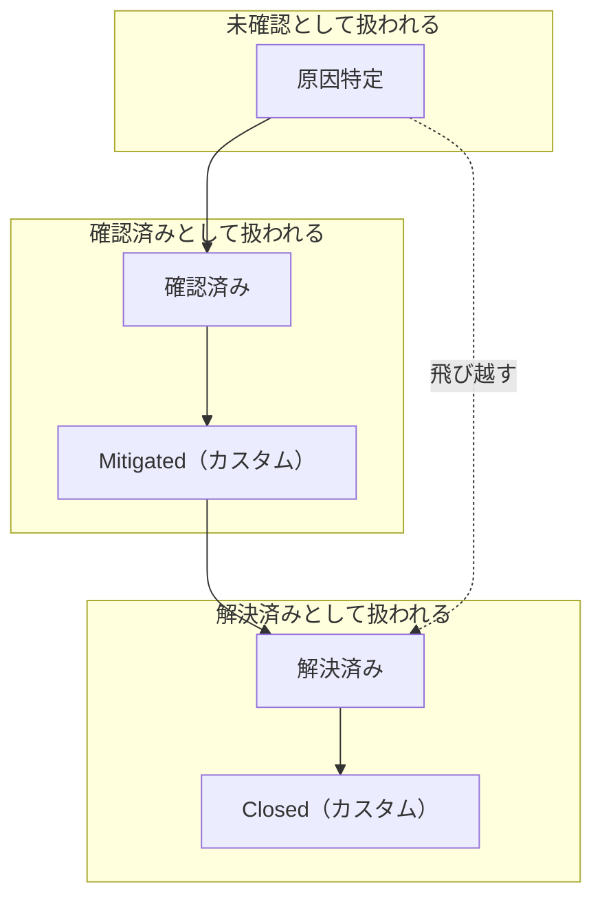
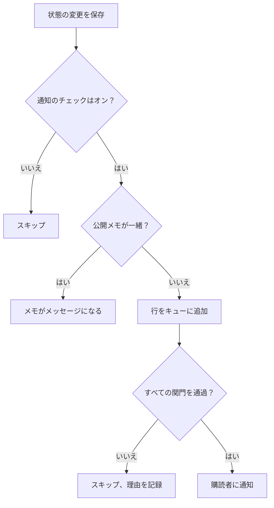

# インシデントの状態と重大度

すべてのインシデントは 2 つの分類を持っています。対応のどこにいるかを示す **状態** と、どれほど痛手かを示す **重大度** です。このページでは、各状態が何をするか、独自の状態の追加方法、重大度の順位付けを説明します。インシデントを設定する人や、あるインシデントがなぜ呼び出しを行った（または行わなかった）のか、なぜ解決された（またはされなかった）のか、なぜステータスページに表示された（またはされなかった）のかを知りたい人のためのページです。

:::cards
- [独自の状態を追加する](#独自の状態を追加する): 対応の流れをモデル化し、各状態が何として扱われるかを確認します。
- [確認が行うこと](#確認が行うこと): 呼び出しが止まり、SLA が応答済みになります。
- [解決が行うこと](#解決が行うこと): モニターが返され、SLA が終了します。
- [購読者に知らせる](#状態の変更をステータスページの購読者に知らせる): 状態の変更がステータスページに届くまでに通る関門。
:::

## 仕組み

ダッシュボードでは、状態と重大度は似て見えます。どちらもインシデント一覧では色付きのピルとして、選択する場所では名前の前の色付きの点として表示され、どちらも名前と色を変更できるプロジェクト単位の一覧です。しかし、役割はまったく違います。

状態は振る舞いを決めます。状態の行にある 3 つのブール値のフラグと状態の順序が、どのインシデントをアクティブとして数えるか、インシデントのヘッダーにどのボタンを表示するか、SLA の時計をいつ止めるか、インシデントをいつステータスページから外すかを決めます。重大度はそれ自体では何も決めません。影響を表すラベルであり、他のルールが一致条件として使えるものです。

`IncidentState` モデルは `name`、`description`、`color`、`order` と、3 つのブール値 `isCreatedState`、`isAcknowledgedState`、`isResolvedState` を持ちます。製品が状態に対して行うことはすべて、これらのブール値と `order` に基づいており、状態の名前には決して基づきません。だからこそ、**解決済み** の名前を「Closed」に変えても何も壊れません。フラグは行と一緒に移動します。

`IncidentSeverity` モデルが持つのは `name`、`description`、`color`、`order` だけです。フラグはありません。OneUptime の中に、**Critical Incident** をそれだけで **Minor Incident** と違うように扱うものはありません。重大度が意味を持つのは、オンコールルールの一致条件 **インシデントの重大度** のように、何かを重大度に向けた場合だけです。

いくつかの簡単なルール:

- **影響を伝えるには重大度を選ぶ** — 重大度はインシデント一覧とインシデントの **概要** に表示され、インシデントを宣言するときの必須項目です。
- **プロセスをモデル化するには状態を選ぶ** — 実際にたどる対応の段階を、たどる順序で並べます。
- **状態で緊急度を表さない** — 「Critical」という名前の状態を作っても誰も呼び出されません。それを行うのは、重大度とオンコールルールの組み合わせです。

> [!TIP]
> どちらの一覧もプロジェクトの作成時に用意され、どちらも **インシデント → 設定** で編集します。インシデントのサイドメニューのこのセクションは既定で折りたたまれているので、探す前に **設定** を展開してください。

## 初期の状態

プロジェクトと一緒に 3 つの状態がこの順序で作成されます。作成処理は冪等で、同じ名前の状態がまだない場合にだけ追加されます。

| 状態             | `order` | フラグ                | 色        | 意味                                               |
| ---------------- | ------- | --------------------- | --------- | -------------------------------------------------- |
| **原因特定**     | `1`     | `isCreatedState`      | `#fd625e` | 新しいインシデントが入る状態。                     |
| **確認済み**     | `2`     | `isAcknowledgedState` | `#ffbf53` | 誰かがインシデントを引き受けました。               |
| **解決済み**     | `3`     | `isResolvedState`     | `#2ab57d` | インシデントは終わり、アクティブとして数えられなくなります。 |

> [!NOTE]
> 最初の状態の名前は **原因特定** ですが、製品内のいくつかの説明ではいまだに「作成」状態と呼ばれています。ドキュメントやツールチップが「作成状態」と言うときは、`isCreatedState` を持つ状態のことで、新しいプロジェクトではそれが **原因特定** です。

## 各状態フラグが実際に行うこと

| フラグ                | 目的                                                                                                                                                                                                 |
| --------------------- | ---------------------------------------------------------------------------------------------------------------------------------------------------------------------------------------------------- |
| `isCreatedState`      | 誰も状態を選ばなかったときにインシデントが入る状態。プロジェクトにこのフラグを持つ状態がなければ、インシデントの作成は、設定から作成状態を追加するよう求めるエラーで失敗します。 |
| `isAcknowledgedState` | プロジェクトの確認状態を示します。**確認** がインシデントを移す先であり、確認の統計タイルの名前の元になる状態です。この状態か、それより後の状態にあるインシデント、または解決済みのインシデントは確認済みです。そのインシデントには **確認** が表示されなくなり、オンコールは呼び出しをやめ、SLA は応答済みになります。 |
| `isResolvedState`     | プロジェクトの解決状態を示します。**解決** がインシデントを移す先であり、解決の統計タイルが示す状態です。この状態か、それより後の状態にあるインシデントは解決済みです。**アクティブなインシデント** とステータスページのアクティブなセクションから外れ、SLA は解決済みになります。 |

各フラグを持つ状態は、プロジェクトごとに 1 つだけであることが想定されています。検索では順序の最初のものが使われます。フラグを持つ 3 つの状態には、設定ページで **組み込み** のタグが付きます。マウスを合わせる（または Tab で移動する）と、OneUptime がその状態で何をするかが読めます。名前の変更、色の変更、ドラッグはできますが、次の制約があります。

- **順序は保たれます。** 作成状態は確認状態より前、確認状態は解決状態より前です。それを崩すドラッグ（たとえば **解決済み** を **確認済み** の上に置く）は拒否され、行は元に戻り、ページに理由が表示されます。
- **削除できません。** 行のメニューに **削除** は残りますが、理由とともにロックされています。一括削除ではスキップされ、削除されなかったものとして一覧に示されます。API も、プロジェクトの最後の作成状態、確認状態、解決状態の削除を拒否します。

UI は状態名を動的に読み込むので、状態の名前を変えると、目にするものがすべて変わります。統計タイル（初期の名前では **Acknowledged までの時間** と **Resolved までの時間**）、カスタム状態の確認ダイアログ **インシデントを「…」にする**、インシデント一覧のピルは、すべて行に付けた名前に従います。

## 独自の状態を追加する

追加する状態は、初期の 3 つには名前のない対応の段階です。たとえば「Investigating」、「Mitigated」、「Monitoring」、「Closed」です。

:::steps
### 状態の一覧を開く

**インシデント → 設定 → インシデントの状態** に移動します。**インシデントの状態** カードには、状態が順序どおりに 1 行ずつ表示されます。ドラッグ用のつまみ、色と名前、その状態にあるインシデントの **扱い**、説明です。タイトルの下の一文がはっきり述べているとおり、インシデントはこの一覧を下にしか進みません。

### 状態を作成する

カードのヘッダーにある **インシデントの状態を作成** をクリックし、フォーム（項目は下記）に入力します。新しい状態は **解決状態のすぐ上** に追加されます。ほとんどの状態が属する場所であり、決してその下には追加されません。下に置くと、知らないうちに解決済みとして扱われてしまうからです。

### ドラッグして配置する

行をつまみでドラッグして移動します。新しい順序はドロップした時点で保存され、入力する順序番号はありません。キーボードでは、つまみにフォーカスして Space を押し、矢印キーで移動して、もう一度 Space を押します。**扱い** 列は行をドロップすると更新されます。
:::

**編集** は作成と同じフォームを開きます。状態の ID は、行のメニューの **ID を表示** にあります。

| 項目            | 必須   | 内容                                                                                                                                                                                                                                                               |
| --------------- | ------ | ------------------------------------------------------------------------------------------------------------------------------------------------------------------------------------------------------------------------------------------------------------------ |
| **名前**        | はい   | 2 文字以上。プレースホルダーは「Investigating」のような例を示しています。                                                                                                                                                                                         |
| **説明**        | いいえ | インシデントがどんなときにこの状態にあるかを説明する自由記述。                                                                                                                                                                                                     |
| **色**          | はい   | フォームを開いた時点で選択済みです。一覧のどの状態もまだ使っていない色なので、新しい状態がすぐ上の状態と同じ赤になることはありません。名前付きの色の並び（レッド、オレンジ、ライム、グリーン、ティール、ブルー、インディゴ、パープル、マゼンタ、ピンク）から別の色を選ぶか、`#fd625e` のようなブランドの正確な色には **カスタムカラー** を使います。 |

色は、状態のピルと、すべての状態の選択欄で名前の前に表示される点に使われます。宣言フォームとテンプレートのフォーム、一括操作 **状態を変更**、ヘッダーの状態メニュー、ルールとフィルターの条件です。これらの選択欄はどれも、このページが並べた順序で状態を表示します。

このフォームから 3 つのフラグを設定することはできません。フラグは初期の行に属しています。そのため、追加した状態はフラグのない状態であり、次の 3 つの影響を考えておく必要があります。

- **位置が、何として扱われるかを決めます。** **扱い** 列にそれが表示され、ドラッグに応じて変わります。確認状態より上にあれば、その状態のインシデントは **未確認** です。確認状態以下では **確認済み** として扱われるので、オンコールポリシーはエスカレーションをやめます。解決状態以下では **解決済み** として扱われるので、ステータスページはアクティブとして表示しなくなります。
- **解決状態より上にあれば、インシデントはアクティブなままです。** **アクティブなインシデント** には、現在の状態が解決状態より上にあるインシデントが入るので、そこに追加した状態は、インシデントをアクティブな一覧とサイドバーの件数にとどめます。解決状態より下にドラッグした状態は、アクティブな一覧、ステータスページ、リマインダー、SLA のどこでも解決済みとして扱われ、**解決済み** からその状態にインシデントを移しても 2 回目の解決にはなりません。
- **インシデントはヘッダーのメニューからその状態に移します。** ヘッダーのボタンは **確認** と **解決** だけです。カスタム状態は、その横の **⋯** メニューにある **変更後の状態** の下にあり、現在の状態より後のすべての状態が並びます。確認ダイアログのタイトルは **インシデントを「`<state name>`」にする** で、送信ボタンは **「`<state name>`」にする** です。

> [!TIP]
> よくある形は、確認状態と解決状態の間に緩和の段階を置くことです。「Mitigated」を作成すると、**確認済み** の後、**解決済み** のすぐ上に入り、確認済みとして扱われます。まだ誰も確認していない段階のトリアージ用の状態なら、**確認済み** の上にドラッグしてください。

## 順序は表示上の好みではなく、実際の制約

順序は、一覧を表示するときだけでなく、状態の変更を書き込むときにも強制されます。

- **後戻りの遷移は拒否されます。** 順序の上で現在の状態より前にある状態へインシデントを移すと、両方の状態を名指ししたエラーで失敗します。
- **現在の状態を選び直すことは拒否されます。** インシデントをすでにある状態に設定すると、「Incident state cannot be same as previous state.」で失敗します。
- **さかのぼって挿入した行は、隣の行と同じにはできません。** 次の行と同じ状態のタイムラインの行を挿入することも拒否されます。
- **ヘッダーのボタンは、フラグを持つ状態の順序上の位置に従います。** **確認** と **解決** は、順序で並べた一覧の中で現在の状態がどこにあるかに基づいて表示されます。解決状態の *後* に置いたカスタム状態では **解決** ボタンは表示されません。その状態のインシデントはすでに解決済みとして扱われるからです。

ですから状態を追加するときは、インシデントが本当に通過する位置に置いてください。順序を間違えると見た目がおかしいだけでなく、遷移ができなくなります。状態をより後ろに移すと、その状態にすでにあるインシデントの扱いが、ドロップした瞬間に変わります。

API と Terraform では、順序は `order` 列です。小さい番号が先に来ます。番号なしで作成した状態は解決状態のすぐ上に入ります。番号付きで作成または更新した状態はその位置に入り、間にある状態は 1 つずつ下がります。他のどの状態も持っていない番号は書いたとおりに保たれるので、Terraform で管理する状態は指定した番号のまま読み戻されます。

## 初期の重大度

プロジェクトと一緒に 3 つの重大度が、最も深刻なものから順に作成されます。

| 重大度                | `order` | 色        | 初期の説明                                                                                                                                                                                |
| --------------------- | ------- | --------- | ----------------------------------------------------------------------------------------------------------------------------------------------------------------------------------------- |
| **Critical Incident** | `1`     | `#b70400` | Issues causing very high impact to customers. Immediate response is required. Examples include a full outage, or a data breach.                                                          |
| **Major Incident**    | `2`     | `#fd625e` | Issues causing significant impact. Immediate response is usually required. We might have some workarounds that mitigate the impact on customers. Examples include an important sub-system failing. |
| **Minor Incident**    | `3`     | `#ffbf53` | Issues with low impact, which can usually be handled within working hours. Most customers are unlikely to notice any problems. Examples include a slight drop in application performance. |

重大度はインシデントの宣言時に必須で、モニターの条件にある各インシデントの定義でも必須なので、手動でも自動でも、すべてのインシデントには重大度があります。宣言の流れは [インシデントの宣言](/docs/incidents/declaring-incidents) を、モニターから作られる場合は [インシデント & アラート テンプレート](/docs/monitor/incident-alert-templating) を参照してください。

## 重大度を編集する

**インシデント → 設定 → インシデントの重大度** に移動します。状態のページと同じ形で、重大度ごとに 1 行、最も深刻なものが先頭に並び、行をドラッグして順位を変えます。**インシデントの重大度を作成** は末尾（最も深刻でない位置）に重大度を追加し、フォームには **名前**、**説明**、**色** があり、色は状態のフォームと同じく選択済みです。

順位は、OneUptime が重大度を比較するあらゆる場面で意味を持ちます。エピソードは最も深刻なインシデントの重大度を取り、モニターの推奨にある Critical と Warning は、1 番目と 2 番目の重大度に対応付けられます。

状態との違いは 2 つです。

- **削除の保護はありません。** 初期の 3 つを含め、どの重大度も削除できます。
- **引き継ぐフラグも「扱い」もありません。** 新しい重大度は初期のものとまったく同じに振る舞います。色と順位を持つラベルです。

重大度が説明以上の働きをする場面: **インシデント → ルール → オンコールルール** では、ルールの **インシデントの重大度** 項目が一致条件になります。そこに **Critical Incident** を指定することで、「重大なものはすべてデータベースチームを呼び出す」を表現します。オンコールポリシーは重大度ではなくルールにあります。

**インシデントの重大度の変更**（インシデントの **インシデントの詳細** カードの **編集**、API や Terraform の `incidentSeverityId`、ワークフロー、AI ツールのいずれでも）は、どの方法で送っても同じ 4 つのことを行います。インシデントのフィードに新しい重大度を示す **Incident updated** エントリーが追加され、インシデントの SLA の期限が計算し直され、リマインダールールが照合し直され、インシデントのメトリクスで重大度の変更が 1 回数えられます。インシデントがすでに持っている重大度を保存した場合はどれも行われないので、インシデントのタイトルだけを編集しても、SLA の期限、リマインダー、重大度の変更回数はそのままです。アラートの重大度も、フィードのエントリーとリマインダーについて同じように動作します。

## インシデントの状態を進める

インシデントの状態が変わる方法は 4 つあります。

| 方法                | 場所                                                                                        | 尋ねること                                                                                                                                                                                                   |
| ------------------- | ------------------------------------------------------------------------------------------- | ------------------------------------------------------------------------------------------------------------------------------------------------------------------------------------------------------------ |
| **ヘッダーのボタン** | インシデントのヘッダー: **確認** と **解決**、そして **⋯** メニューの **変更後の状態**      | 短い確認ダイアログ（**インシデントを確認** または **インシデントを解決**）。**ステータスページの購読者に通知** と、**公開メモを追加** の下に折りたたまれた任意の **公開メモ** とその **メモテンプレートを選択** の選択欄（プロジェクトにメモテンプレートがある場合）があります。 |
| **状態タイムライン** | インシデントのサイドメニューの **状態タイムライン**                                        | 手動で追加する行。**インシデントステータス**、**開始日時**、**ステータスページの購読者に通知** があります。                                                                                                  |
| **一括変更**        | インシデント一覧で選択したものに対する **状態を変更**                                       | 状態、**ステータスページの購読者に通知**、同じく折りたたまれた **公開メモを追加** がある 1 ページ。                                                                                                         |
| **自動**            | モニターの条件、または自分のコード                                                          | **インシデントを自動解決** を有効にした条件は、条件が満たされなくなったときにそのインシデントを解決します。API は `/api/incident-state-timeline` に行を作成して状態を変更します。                           |

現在の状態が確認状態より前なら、ヘッダーには **確認** と **解決** が表示されます。2 つの間なら **解決** だけです。確認すると、そのインシデントのオンコールのエスカレーションも止まります。

どの方法でもタイムラインに行が書き込まれます。状態の変更は、頼まなくてもいくつかのことを行います。インシデントのフィードにエントリーを投稿し、インシデントにまだインシデントコマンダーがいなければ割り当て、SLA の時計を更新します。解決済みのインシデントを再び開くと、再オープンの時刻から新しい SLA の記録が始まります。

## 確認が行うこと

インシデントは、確認状態に入った瞬間から確認済みになります。それより後の状態（**確認済み** の下に置いた **Mitigated** や **Investigating** の状態）や解決状態に入った場合も同じで、上の 4 つの方法のどれで移されたかは問いません。状態の設定ページの **扱い** 列に、それがどの状態かが表示されます。確認済みになると、次のようになります。

- **確認は表示されなくなります。** インシデントのヘッダーにも、モバイルアプリ（ボタンとスワイプ）にも、Slack や Microsoft Teams にも、OneUptime MCP サーバーの `acknowledge_incident` にも表示されません。それでもオンコールのページ、Slack、Teams から確認しようとすると、一覧を上に戻すのではなく、「Incident is already acknowledged.」（または「Incident is already resolved.」）で拒否されます。
- **オンコールはそのインシデントのための呼び出しをやめます。** 同僚がインシデントを確認したり先に進めたりした後で自分の呼び出しを確認した対応者は、呼び出しが確認済みになり、インシデントはそのままの位置に残ります。
- **SLA は応答済みになります。** 最初にそうした移動をした時点です。その後の状態に進んでも、その時刻は保たれます。
- **確認までの時間は、その最初の移動までです。** インシデントの **概要** の統計タイル、**Time to Acknowledge** メトリクス、**インシデントが確認されたとき** で終わる測定値、Slack と Microsoft Teams のサマリーの MTTA が該当します。**原因特定** から直接 **Investigating** に移ったインシデントはその時点で確認され、すぐに解決されたインシデントは解決した時点で確認されたことになります。
- **確認済みのフィルター**（たとえばダッシュボードのインシデント一覧ウィジェット）は、確認状態とそれより後の状態にあり、解決に至っていないインシデントを表示します。

アラートとエピソードも、アラートの状態で同じルールに従います。

## 解決が行うこと

インシデントは、解決状態より上の状態から解決状態、またはそれより後の状態に移ったときに解決されます。上の 4 つの方法のどれで移されたかは問いません。解決のたびに、次のことが行われます。

- **インシデントが保持しているモニターを返します。** 未解決の状態で宣言されたインシデントは、そのモニターを保持します。**変更後のモニターステータス** を指定していればモニターをそのステータスにし、手動で宣言した場合はモニターの監視を一時停止しています。未解決の間の編集（モニターの追加やそのステータスの変更）でも、モニターを保持するようになります。解決すると、別の未解決のインシデントがまだそのモニターにない限り、監視が再開されて正常に戻り、それ以降インシデントは何も保持しません。そのため、すでに解決済みで宣言されたインシデントは何も返さず、再オープン後の 2 回目の解決も同様です。その間にモニターが得たステータス（プローブ、メンテナンス、手動の設定によるもの）はそのまま残ります。
- **SLA を解決済みにし**、OneUptime AI によるポストモーテムの下書きがオンなら、ポストモーテムの下書きを作成します。

**解決済み** からそれより後の状態（たとえば **Closed**）に進むのは 2 回目の解決ではありません。これらはどれも再実行されず、新しい SLA も始まりません。OneUptime がこれを記録し始める前に宣言されたインシデントは、これまでどおり、次に解決したときにモニターを返します。

## 状態タイムライン

インシデントのサイドメニューにある **状態タイムライン** ページは、インシデントが経たすべての状態の監査証跡です。そのページのカードのタイトルは **ステータスタイムライン** で、新しい順に並んでいます。

| 列                                 | 表示内容                                                                                                                                                                                                                                                       |
| ---------------------------------- | -------------------------------------------------------------------------------------------------------------------------------------------------------------------------------------------------------------------------------------------------------------- |
| **インシデントステータス**         | 状態の名前と色を表す色付きのピル。                                                                                                                                                                                                                             |
| **開始日時**                       | インシデントがこの状態に入った時刻。                                                                                                                                                                                                                           |
| **終了日時**                       | 状態を出た時刻。現在の状態には `Currently Active` と表示されます。                                                                                                                                                                                             |
| **期間**                           | その状態にあった時間。現在の状態は今までの時間です。                                                                                                                                                                                                           |
| **購読者通知ステータス**           | この変更についてのステータスページへの通知が送信済み、スキップ、保留中のどれかを示し、**詳細** リンクがあります。送信に失敗した場合は **再試行** 操作もあります。**再試行** は、すでに受け取った購読者も含め、インシデントが現在届くすべてのステータスページに状態の変更をもう一度送ります。 |

各行には 2 つの操作があります。

- **原因を表示** — その状態の変更と一緒に記録された Markdown を表示する **根本原因** モーダルを開きます。
- **ログを表示** — ステータスが変わった理由を説明するモーダルを開き、**インシデント状態ログ** のビューアーを表示します。

ダッシュボードでは、タイムラインの行は追加と削除はできますが、編集はできません。インシデントには常に少なくとも 1 行が残ります。API では行の `startsAt` を修正でき、タイムラインから算出されるすべての測定値がそれに従います。

> [!WARNING]
> 間違った行を削除するとインシデントの履歴が書き換わるので、整理の習慣ではなく、修正のための道具として扱ってください。

## アクティブなインシデントの一覧

**インシデント → アクティブなインシデント** は、シフト中に見張る一覧です。定義の条件はちょうど 1 つ、インシデントの現在の状態が解決状態（`isResolvedState` を持つ、順序で最初の状態）より上にあることです。それ以外、つまり重大度も経過時間も、誰かが確認したかどうかも考慮されません。

サイドメニューの項目には同じクエリを使った赤い件数バッジが付くので、バッジと一覧は常に一致します。表示するものがなければ、ページにそう表示されます。

実際の影響として、解決状態より上に追加したカスタム状態はインシデントをこの一覧にとどめ（「Mitigated」は「完了」ではありません）、解決状態より後に置いた状態は、解決状態と同じくインシデントを一覧から外します。アラートとエピソードもそれぞれの状態で同じルールに従い、サイドメニューの件数、リマインダー、ステータスページ、モバイルアプリはすべてこのルールを読み取ります。

## 状態の変更をステータスページの購読者に知らせる

状態の変更はステータスページの購読者に通知できますが、いくつかの関門を通ります。それを理解しておくと、「なぜ誰にも通知されなかったのか」の調査が大幅に楽になります。

通知は、タイムラインの行ごとに **ステータスページの購読者に通知**（`shouldStatusPageSubscribersBeNotified`）で要求されます。状態変更のモーダルと手動のタイムラインフォームにあるチェックボックスです。状態変更のモーダルでは、インシデントが購読者に通知せずに宣言された場合はオフで始まります。同じチェックボックスで、モーダルの公開メモが誰かに通知するかどうかも決まります。オフの場合、行はスキップのステータスと説明とともに保存されます。オンの場合、行はキューに入り、バックグラウンドのジョブが処理します。ジョブは毎分実行されるので、配信は速いですが即時ではありません。

**キューに入った行は、次のいずれかに当てはまるとスキップされます。**

- **新しい状態が作成状態である。** 購読者にはインシデントの宣言時にすでに知らされているので、タイムラインの最初の行は意図的に 2 通目のメッセージを送りません。
- **インシデントにモニターがない。** リソースがなければ、インシデントを対応付けるステータスページがありません。
- **インシデントがステータスページに表示されない**（`isVisibleOnStatusPage` がオフ）。
- **ステータスページでインシデントがオフになっている**（`showIncidentsOnStatusPage` がオフ）。これはステータスページごとの判定で、同じモニターを表示する他のページには引き続き通知されます。
- **ステータスページがインシデントの範囲外である。** **次のステータスページに限定** で一部のステータスページに限定したインシデントは、そのモニターを掲載するページのうち限定先のページにだけ通知し、**このページに限定されたインシデントのみ表示** がオンのページには、そのページに限定されていないインシデントについて通知されることはありません。これもステータスページごとの判定です。[対象者ごとのステータス ページ](/docs/status-pages/one-status-page-per-audience) を参照してください。

**結果を変えるもう 1 つの要素。** **ステータスページの購読者に通知** がオンの状態で、状態変更のモーダル（**公開メモを追加** の下）や一括操作 **状態を変更** で **公開メモ** を書くと、タイムラインの行はキューに入るのではなく通知済みとしてマークされ、ステータスメッセージにはメモが通知を担ったと表示されます。購読者に届くのはメモそのものなので、メッセージは 2 通ではなく 1 通になります。空白だけのメモは投稿されず、行は通常どおりキューに入ります。予定メンテナンスの状態の変更も同じように動作します。メモがない通常の状態変更メッセージのイベントタイプは `Subscriber Incident State Changed` です。

**メモは、インシデントの現在の状態を伝えます。** メモが唯一のメッセージなので、状態変更のメッセージと同じく、すべてのチャネルで新しい状態を示します。メールの件名は `[Resolved Incident] <title>` となり、詳細には状態の色の **Status** 行が表示されます。SMS は `Incident <title> on <status page> is Resolved.` と伝え、Slack と Microsoft Teams のメッセージには `**Status:** Resolved` の行が入り、Webhook の `IncidentNoteCreated` ペイロードには `data` に `incidentState` が入ります。単独で投稿したメモは通常のメッセージのままで、編集による更新の通知も同様です。

**メモの投稿には専用の権限が必要です。** 状態の変更と公開メモの投稿は別々の権限です（カスタムロールでは **Create Incident State Timeline** と **Create Incident Status Page Note**。組み込みのインシデントとプロジェクトのロールは両方を持っています）。状態の変更には、インシデントを編集する権限は不要です。[状態を変更する](/docs/permissions/index#状態を変更する) を参照してください。インシデントの状態を変更できても公開メモを投稿できない人には、モーダルでも一括操作 **状態を変更** でも **公開メモを追加** は表示されません。そうした人が API でメモ付きの状態変更を送ると、状態は変更されなかったことと理由を伝えるメッセージで全体が拒否されるので、投稿されなかったメモで知らせたことになっている変更が記録されることはありません。メモを外せば変更は通ります。アラート、アラートエピソード、インシデントエピソードでは、代わりに状態の変更と一緒に非公開メモを書けます（**非公開メモを追加**）。これも同じように動作します。投稿にはメモ自身の権限が必要で（カスタムロールでは **Create Alert Internal Note**、**Create Alert Episode Internal Note**、**Create Incident Episode Internal Note**。組み込みのアラート、インシデント、プロジェクトのロールはこれらを持っています）、その権限のない人が非公開メモ付きで送った状態変更は全体が拒否され、状態は変更されません。

**送信済みとは、すべての購読者に送られたということです。** ジョブはメッセージごとに待ち、ステータスページとチャネルごとに送信済みか失敗かを数え、行のステータスメッセージにその件数が表示されます。1 通でも失敗したり、送信が時間切れになったり中断されたりすると、行は **失敗** になります。[購読者とお知らせ](/docs/status-pages/subscribers) を参照してください。

これらを誰が受け取り、テンプレートがどう選ばれるかは、[購読者とお知らせ](/docs/status-pages/subscribers) を参照してください。

## インシデントをステータスページに出さない

インシデントが公開ページに出るかどうかは 4 つの別々の要素で決まり、4 つすべてが真である必要があります。

- ステータスページ自体の **インシデントを表示**（`showIncidentsOnStatusPage`）。
- インシデントの **ステータスページに表示**（`isVisibleOnStatusPage`）。インシデントの **設定** ページのトグルです。既定は true で、宣言ウィザードにはありません。モニターの条件では **ステータスページにインシデントを表示** で設定できます。非表示で宣言されたインシデントは、作成時に購読者に通知しません。後でこのトグルをオンにすると、編集フォームに **このインシデントが作成されたことを購読者に通知** が表示されます。[インシデントの宣言](/docs/incidents/declaring-incidents) を参照してください。
- **ページがインシデントの届く範囲にある。** ページがインシデントのモニターのいずれかを掲載しており、インシデントが一部のステータスページに限定されている場合はその 1 つであることです。**このページに限定されたインシデントのみ表示** がオンのページには、そのページに限定されたインシデントだけが表示されます。[対象者ごとのステータス ページ](/docs/status-pages/one-status-page-per-audience) を参照してください。
- **現在の状態が解決状態より上にある。** これがインシデントをアクティブなセクションから外すものです。ステータスページのクエリは、現在の状態が解決状態より上にあるインシデントを取得するので、解決状態とそれより後のすべての状態はインシデントを外します。何かをアーカイブしたりクローズしたりする必要はありません。解決すれば、インシデントは履歴に移ります。

**プライベートインシデントは決して表示されません。** **プライベートインシデント** をオンにすると、上のトグルにかかわらずインシデントはすべてのステータスページで非表示になり、所有者とプロジェクト管理者・プロジェクト所有者だけに制限されます。その作成、状態の変更、公開メモ、ポストモーテムのどれも、ステータスページの購読者には届きません。プライベートの間は、説明、ポストモーテム、カスタムフィールド、公開メモの画像を誰もが見られるわけではありません。

2 つのスイッチは連動しているので、インシデントの **設定** ページは常にステータスページの実際の動作を表示します。

- インシデントをプライベートにすると、**ステータスページに表示** も一緒にオフになります。
- インシデントがプライベートのまま **ステータスページに表示** をオンにしても、オフのままです。プライベートインシデントを公開するには、**プライベートインシデント** をオフにし、**ステータスページに表示** をオンにします。1 回の保存でも、順番に行ってもかまいません。

これは、インシデントがどこから書き込まれても同じです。ダッシュボード、API、Terraform、ワークフロー、モニター、インシデントテンプレート、プライバシールールのいずれでもです。`"true"` のようにテキストで送った値も `true` と同じに扱われます。多数のインシデントに対して **ステータスページに表示** をオンにする 1 回の書き込み（たとえばワークフローの **Update Many**）は、プライベートでないものを表示し、プライベートなものはすべて非表示のままにします。各インシデントは書き込みが届いた時点の状態で判断されるので、同時に届いたプライバシーの変更が上書きされることはなく、インシデントがプライベートかつ表示の状態で保存されることはありません。プライベートとして作成されたインシデントは非表示で作成され、作成を購読者に通知しません。

**エピソードも同じルールに従います。** プライベートなインシデントエピソードは、**ステータスページに表示** スイッチの設定にかかわらずすべてのステータスページで非表示になり、購読者には何も届きません。エピソードの **設定** ページのスイッチにはその旨が表示され、エピソードがプライベートの間はオフのままです。プライベートインシデントがエピソードをステータスページに出すことはありません。エピソードがページに届くのは、プライベートでないインシデントを通じてだけです。

:::details これらのルールがないバージョンからのアップグレード
これらのルールより前に、**ステータスページに表示** がオンのままプライベートとして保存されたインシデントとエピソードは、アップグレード時にそれがオフになります。誰にも何も送られません。そうしたインシデントやエピソードが誰でも見られるようにしていた画像は、ステータスページが表示する何かにまだ含まれていない限り、再び非公開になります。ステータスページが表示しないインシデント、エピソード、予定メンテナンスイベントの公開メモの画像も同様で、これらは以前は誰でも見られる状態のままでした。
:::

ページが解決済みの履歴をどれだけ残すかは、インシデントではなくステータスページの設定です。ページ上のモニターによって、そもそもどのインシデントが表示されるかがどう決まるかは、[ステータス ページのリソースとグループ](/docs/status-pages/resources-and-groups) を参照してください。

## 次のステップ

:::cards
- [インシデントの宣言](/docs/incidents/declaring-incidents): 宣言時に開始状態と重大度を選びます。
- [インシデントのメモ、オーナー、フィード](/docs/incidents/notes-owners-and-feed): 状態の変更と一緒に送る公開メモを投稿します。
- [インシデントの設定と自動化](/docs/incidents/settings): 状態間の時間を測定し、ルールで重大度を照合します。
- [購読者とお知らせ](/docs/status-pages/subscribers): 状態の変更が送るメッセージを誰が受け取るか。
:::
