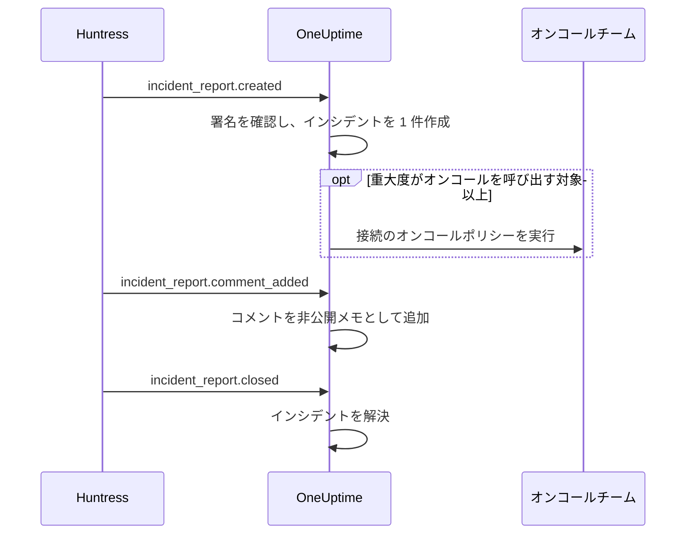

# Huntress 連携

Huntress のインシデントレポートでオンコールチームを呼び出します。Huntress の SOC がエンドポイントや ID についてインシデントレポートを送ると、OneUptime はそのレポートにつき 1 件のインシデントを、選んだ重大度で作成し、選んだオンコールポリシーを呼び出し、Huntress でレポートがクローズされるとインシデントを解決します。

この連携は **インバウンド** です。Huntress はインシデントレポートのイベントを、OneUptime が発行する Webhook URL に、エンドポイントの署名シークレットで署名して送信します。OneUptime から Huntress を呼び出すことはないため、Huntress の API キーは不要です。

:::cards
- [仕組み](#仕組み): レポートのイベントごとに OneUptime が行うこと。
- [設定手順](#連携を設定する): OneUptime で接続し、Huntress にエンドポイントを追加し、署名シークレットを保存して、テストを送信します。
- [設定](#設定): 呼び出し、重大度、組織、ラベル、解決。
- [トラブルシューティング](#トラブルシューティング): 接続のエラーの意味と、変更すべき点。
:::

## 仕組み

Huntress は、レポートが送信されたとき、誰かがコメントしたとき、クローズされたときに、インシデントレポートのイベントを送信します。各イベントにはレポート全体が含まれます。

1. **確認する。** リクエストは、到着の 5 分前以内にエンドポイントの署名シークレットで署名されている必要があります。それ以外は拒否され、接続のページに理由が表示されます。
2. **インシデントを 1 件作成する。** レポートの最初のイベントで、`Huntress: Incident on DESKTOP-01 (Acme Corp)` のようにレポートにちなんだタイトルのインシデントが作成されます。説明には、レポートの概要、Huntress での重大度、組織、影響を受けたホストまたは ID、Huntress が見つけたインジケーター、Huntress のレポートへのリンクが含まれます。同じレポートの後続のイベントや、Huntress が再送した配信は、このインシデントに届きます。1 件のレポートが 2 件のインシデントを作成することはありません。
3. **呼び出す。** インシデントは、接続がレポートの Huntress の重大度に割り当てたインシデントの重大度で作成されます。その重大度が **オンコールを呼び出す対象** 以上なら、接続の **オンコールポリシー** が実行されます。
4. **レポートを追跡する。** Huntress で追加されたコメントは、インシデントの非公開メモになります。レポートがクローズまたは却下されると、インシデントは解決されます。

こうして作成されたインシデントがステータスページに表示されることはありません。インシデントのルール (オンコール、オーナー、ラベル、プライバシーのルール) は、ほかのインシデントと同じように適用されます。

## 始める前に

- OneUptime の **Project Owner** または **Project Admin** ロール。メンバー、閲覧者、インシデントのロールは、接続と受信したレポートを見られますが、変更はできません。
- Huntress の **Account Admin** ロール。Webhook を追加できるのはアカウント管理者だけです。
- 呼び出すオンコールポリシー。ポリシーがないと、レポートはインシデントを作成しても誰も呼び出しません (インシデントのオンコールルールに一致した場合を除く)。
- セルフホストの場合は、Huntress がインターネットから HTTPS で到達できる OneUptime。Huntress は `https://` の URL にしか Webhook を送信しません。

## 連携を設定する

:::steps
### OneUptime で Huntress を接続する

**インシデント → 連携 → Huntress** (`/dashboard/{projectId}/incidents/integrations/huntress`) を開きます。インシデントのサイドメニューの **連携** セクションは既定で折りたたまれているので、先に展開します。**Huntress を接続** をクリックします。

呼び出す **オンコールポリシー** を選びます。すると **オンコールを呼び出す対象** で、どのレポートで呼び出すかを選べるようになり、初期値は **高と重大のレポート** です。そのほかの項目は既定値のまま **その他の項目** にまとまっています ([設定](#設定) を参照)。**Huntress を接続** をクリックします。接続のページが開き、次の 3 つの手順を案内する **Huntress を接続** カードが表示されます。

### Huntress に Webhook エンドポイントを追加する

接続のページで **Webhook URL をコピー** をクリックします。URL は `https://oneuptime.com/api/huntress/webhook/<connection-id>` のような形です。セルフホストでは自分のホストで始まります。

Huntress で右上のメニューを開き、**Integrations** を選びます。**Add an Integration** をクリックし、**Webhooks** を選んで **Add Endpoint** をクリックします。URL を貼り付け、**Incident Reports** をオンにして保存します。**Escalations**、**Platform Actions**、**Account Notices** はオフのままにします。OneUptime はこれらのイベントを受け付けますが、何もしません。

### エンドポイントの署名シークレットを保存する

Huntress でエンドポイントのメニュー (⋯) を開き、**View Signing Secret** を選びます。全体をコピーします。`whsec_` で始まります。接続のページで **署名シークレットを保存** をクリックし、貼り付けて **署名シークレットを保存** をクリックします。シークレットは暗号化され、二度と表示されません。

シークレットを保存するまで、OneUptime は URL へのリクエストをすべて拒否します。拒否されたイベントは Huntress があとで再送するので、今拒否されたイベントもあとで届きます。

### テストを送信する

Huntress でエンドポイントのメニュー (⋯) を開き、**Send Test** を選びます。数秒以内に、接続のページのカードが **接続** に変わり、状態が **レポート受信中** になります。

> [!NOTE]
> テストの内容にかかわらず、接続にはテストが届いたことが表示されます。インシデントレポートを含むテストは、ほかのレポートと同じようにインシデントを作成し、重大度が十分高ければオンコールを呼び出します。
:::

## 設定

**Huntress を接続** で聞かれるのは、誰を呼び出すかと、どのレポートで呼び出すかだけです。そのほかは、たいていのチームに合う既定値で **その他の項目** にまとまっています。あとで設定を変えるには、接続の **設定** カードで **設定を編集** をクリックします。

| 設定 | 内容 | 既定値 |
| --- | --- | --- |
| **オンコールポリシー** | レポートの重大度が十分高いときに実行するポリシー。空のままにすると、誰も呼び出さずにインシデントを作成します。 | なし |
| **オンコールを呼び出す対象** | ポリシーを呼び出すレポート: **重大なレポートのみ**、**高と重大のレポート**、**すべてのレポート**。どの場合も、すべてのレポートでインシデントが作成されます。 | **高と重大のレポート** |
| **名前** | OneUptime での接続の名前。 | `Huntress` |
| **重大レポートの重大度**、**高レポートの重大度**、**低レポートの重大度** | Huntress の各重大度で作成するインシデントの重大度。 | インシデントの重大度の上位 3 つ (順位順) |
| **対象の組織** | レポートでインシデントを作成する Huntress の組織。1 行に 1 つずつ組織名または ID を入力します。名前の大文字と小文字は区別されません。 | 空: すべての組織 |
| **ラベル** | レポートの組織名のラベルに加えて、すべてのインシデントに付けるラベル。 | なし |
| **Huntress がレポートをクローズしたら解決する** | Huntress でレポートがクローズまたは却下されたら、インシデントを解決します。オフの場合は、代わりにインシデントに非公開メモが追加されます。 | オン |

### 重大度

Huntress はインシデントレポートごとに 3 つの重大度のいずれかを付けます。インシデントの重大度を選ばなかった場合、レポートは **インシデント → 設定 → インシデントの重大度** に並ぶ順位に従って作成されます。

| Huntress の重大度 | Huntress での意味 | インシデントの重大度 |
| --- | --- | --- |
| Critical | 攻撃者による直接操作、危険なマルウェア、進行中の侵害。すぐに封じ込めが必要です。 | 最も高いもの |
| High | 早急な対処が必要な確認済みのマルウェア、または対応が必要な ID の侵害。 | 2 番目 |
| Low | 望ましくない可能性のあるプログラム、マルウェアの残骸、ID に関する過去の検出結果。 | 3 番目 |

重大度が少ないプロジェクトでは、残りに最も低い重大度が使われます。重大度のないレポートは高として扱われます。選んだ重大度が削除されると、再び順位で決まります。

### 組織

すべてのインシデントには、_Acme Corp_ のようにレポートの Huntress 組織名のラベルが付きます。1 つの接続は Huntress アカウントのすべての組織のレポートを受信し、**対象の組織** で絞り込めます。

> [!TIP]
> 顧客ごとのチームを呼び出すには、接続の **オンコールポリシー** を空のままにして、組織ごとにインシデントのオンコールルールを追加します。たとえば「**インシデントのラベル** が _Acme Corp_ のいずれかを含む場合」に、その顧客のポリシーを実行するルールです。[インシデントのオンコールルール](/docs/incidents/settings#インシデントのオンコールルール) を参照してください。

## 接続のページのレポート

接続の **インシデントレポート** の一覧には、Huntress から届いたレポートが新しい順に表示されます。影響を受けたホストまたは ID、Huntress での重大度とステータス、**結果** がわかります。

| 結果 | 意味 |
| --- | --- |
| **インシデント作成済み** | レポートでインシデントが作成されました。**インシデントを表示** で開けます。**オンコール呼び出し済み** は、接続がポリシーを呼び出したことを示します。 |
| **インシデントが解決しました** | Huntress がレポートをクローズし、そのインシデントが解決されました。 |
| **スキップ: 対象外の組織** | レポートの組織が **対象の組織** にありません。 |
| **スキップ: Huntress でクローズ済み** | OneUptime が初めて受け取った時点で、レポートはすでにクローズされていました。 |

スキップされたレポートは、あとで設定を変えてもスキップされたままです。**Huntress がレポートをクローズしたら解決する** がオフの場合、クローズされたレポートの結果は **インシデント作成済み** のままです。

## セキュリティ

- **署名済みのリクエストのみ。** OneUptime は、Huntress が送る `svix-id`、`svix-timestamp`、`svix-signature` ヘッダーを、届いたままのリクエスト本文と照合します。保存したシークレットで署名されていないリクエストや、5 分以上前後にずれて署名されたリクエストは拒否されます。
- **シークレットは秘密のまま。** 暗号化して保存され、API から返されることも、再び表示されることもありません。接続のページの **署名シークレットを置き換える** で、新しいエンドポイントのシークレットなど別のシークレットを保存できます。
- **URL はアドレスであり、パスワードではありません。** URL は接続を示すだけで、処理されるのはエンドポイントのシークレットで署名されたリクエストだけです。
- **接続ごとにエンドポイント 1 つ。** 接続ごとに独自の URL とシークレットがあります。2 つ目の Huntress アカウントのレポートを受信するには、もう一度接続します。

## 代わりにメールを使う

Huntress はインシデントレポートをメールでも送信し、[受信メールモニター](/docs/monitor/incoming-email-monitor) でそのメールからインシデントを作成することもできます。たとえば件名に `Critical Incident Report` が含まれる場合です。ただし、メールは 1 つのモニターのステータスとして扱われます。そのインシデントが開いている間は次のレポートでインシデントは作成されず、インシデントは Huntress がレポートをクローズしたときではなく、モニターの条件で解決されます。Huntress の接続はレポートごとに 1 件のインシデントを作成し、それぞれをレポートとともに解決するので、こちらをお勧めします。接続がレポートを受信し始めたら、モニターへのメール送信をやめてください。そうしないと、レポートごとに 2 回呼び出されます。

## トラブルシューティング

OneUptime がリクエストを拒否すると、接続のページの **最後のリクエストは拒否されました** に理由が表示されます。Huntress では、エンドポイントのメニュー (⋯) の **View Delivery Attempts** に、各配信と OneUptime の応答が一覧表示されます。

:::details "A request arrived but was refused, because no signing secret is saved for this connection yet"
エンドポイントの署名シークレットを保存してください。[連携を設定する](#連携を設定する) を参照してください。拒否されたリクエストは Huntress が再送します。
:::

:::details "The request's signature does not match the signing secret"
保存したシークレットが、このエンドポイントのものではありません。エンドポイントごとにシークレットがあります。Huntress でエンドポイントのメニュー (⋯) を開き、**View Signing Secret** を選んで全体をコピーし、**署名シークレットを置き換える** で保存してください。
:::

:::details "The request was signed more than five minutes from now"
Huntress と OneUptime サーバーの時計が 5 分以上ずれているか、リクエストが以前のリクエストの使い回しです。セルフホストの場合は、サーバーの時計が正しいか確認してください。
:::

:::details "No Huntress connection has this address."
接続が削除されたか、Huntress のエンドポイントの URL がこの接続のものではありません。接続のページで **Webhook URL をコピー** をクリックし、Huntress のエンドポイントに URL を貼り直してください。
:::

:::details "This project has no incident severities, so a Huntress report cannot open an incident"
**インシデント → 設定 → インシデントの重大度** で重大度を追加してください。レポートは Huntress が再送します。
:::

:::details 誰も呼び出されなかった
**オンコールを呼び出す対象** より低いレポートは、呼び出しなしでインシデントを作成します。**インシデントレポート** の一覧で、レポートの結果の下に **オンコール呼び出し済み** があれば、接続が呼び出したことを示します。インシデントの **オンコールの実行** ページで、各ポリシーの動作を確認できます。
:::

## 次のステップ

:::cards
- [インシデントのオンコールルール](/docs/incidents/settings#インシデントのオンコールルール): 組織ごとのチームを、そのラベルで呼び出します。
- [インシデントの状態と重大度](/docs/incidents/states-and-severities): Huntress のレポートで使う重大度の順位を決めます。
- [エスカレーションルール](/docs/on-call/escalation-rules): 誰を呼び出し、いつ次に進むかを決めます。
- [インテグレーションの概要](/docs/integrations/index): 接続できるほかのツール。
:::
