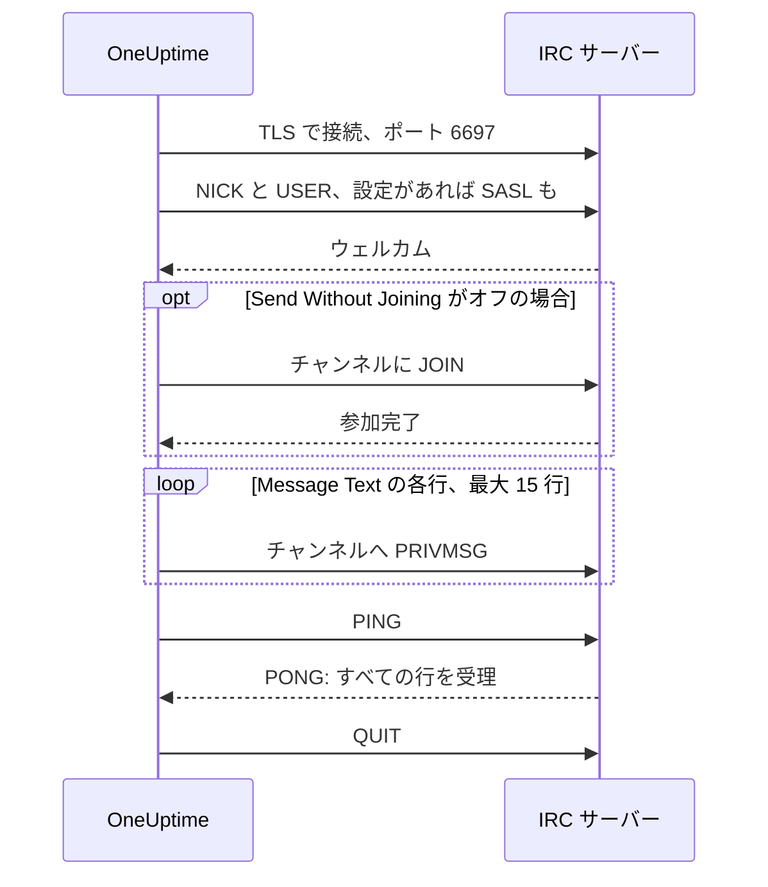

# IRC 連携

Libera.Chat、OFTC、自前のサーバーなど、どの IRC ネットワークのチャンネルにもインシデントの更新を投稿できます。

IRC には Webhook がないため、OneUptime のワークフローステップ **Send Message to IRC** は、一般的な IRC クライアントと同じように自分でサーバーに接続します。インストールするものも、登録するアプリもありません。この連携は**アウトバウンド**です: OneUptime はチャンネルに投稿するだけで、そこでの発言は読みません。

:::cards
- [仕組み](#仕組み): ステップの 1 回の実行がサーバーとどうやり取りするか。
- [セットアップ](#連携を設定する): サーバーとチャンネル、パスワード、そしてワークフロー。テンプレートからでも、ゼロからでも。
- [ヒント](#ヒント): 参加せずに投稿する方法、SASL、長いメッセージ、集中的な実行。
- [トラブルシューティング](#トラブルシューティング): ステップのエラーの意味と、変えるべきところ。
:::

## 仕組み

ステップは実行のたびに、IRC クライアントと同じように IRC サーバーと短いやり取りをして、最後に切断します。

1. **接続。** ステップは TLS でポート `6697` に接続し、サーバーの証明書を検証します。
2. **登録。** 別の **Nickname** を設定しない限り `OneUptime` として登録し、**SASL Username** と **SASL Password** が入力されていれば SASL でサインインします。
3. **参加。** **Send Without Joining** がオフであればチャンネルに参加します。チャンネルにキーがあれば **Channel Key** を使います。
4. **送信。** **Message Text** の各行が、それぞれ 1 件の IRC メッセージ (`PRIVMSG`) として送られます。
5. **確認。** IRC は「配信済み」を知らせないため、ステップは `PING` を送ってサーバーの `PONG` を待ちます。サーバーは順番どおりに応答するので、その時点でメッセージの拒否があればすでに届いています。
6. **終了。** サーバーから切断します。

サーバーがすべての行を受け取ると、ステップは **成功** 出力に進みます。サーバーに届かないとき、またはサーバーが接続、ニックネーム、パスワード、チャンネル、メッセージのいずれかを拒否したときは **エラー** 出力に進み、サーバーが理由を返していればその言葉のまま理由を伝えます。

## はじめる前に

- OneUptime Cloud では **Growth** 以上のプラン: ワークフローとその変数はこのプランに含まれます。課金のないセルフホストのインストールには、プランの制限はありません。
- ワークフローを作成できるロール: **Project Owner**、**Project Admin**、**Workflow Admin** のいずれか。
- ネットワークがサインインを求める場合は、その IRC ネットワークのアカウント。Libera.Chat は、一部のクラウドや VPN のアドレスからの接続にサインインを求めます。

## 連携を設定する

:::steps
### サーバーとチャンネルを選ぶ

メッセージの送り先を決めます: サーバーのホスト名 (例: `irc.libera.chat`) とチャンネル (例: `#your-channel`) です。

- **IRC Server** にはホスト名だけを入力します: `ircs://` もポートも付けません。ステップは TLS でポート `6697` に接続します。サーバーが別のポートで TLS を受け付ける場合は、**その他の項目** の **Port** に設定します。
- **Channel** はチャンネルでなければなりません。ここにニックネームを入力すると拒否されるので、ステップが誤って誰かに個人メッセージを送ることはありません。

サーバーは、OneUptime が接続を許されているものである必要があります。ループバック (`localhost`、`127.0.0.1`)、リンクローカル、クラウドのメタデータのアドレスは常に拒否されます。OneUptime Cloud では、プライベートネットワークのアドレスにあるサーバーも拒否されます。セルフホストのインストールは、`DATA_SOURCE_BLOCK_PRIVATE_ADDRESSES` が `true` でない限り、自分のネットワーク上の IRC サーバーに接続できます。

### パスワードをシークレット変数に保存する

サーバー、ネットワーク、チャンネルのどれもパスワードを必要としない場合は、この手順を飛ばします。必要な場合は、パスワードをそれぞれシークレットの[グローバル変数](/docs/workflows/variables#グローバル変数)として保存します。こうするとワークフローにはパスワードではなく変数の名前が入り、パスワードは 1 か所で変更できます。

| 設定                | 入力が必要なとき                                                                                 | 変数の例              |
| ------------------- | ------------------------------------------------------------------------------------------------ | --------------------- |
| **Server Password** | 接続時にサーバーやバウンサーがパスワードを求める。                                               | `IRC_SERVER_PASSWORD` |
| **SASL Password**   | ネットワークがアカウントへのサインインを求める。**SASL Username** にはアカウント名を入力します。 | `IRC_SASL_PASSWORD`   |
| **Channel Key**     | チャンネルにキーがある (モード `+k`)。                                                           | `IRC_CHANNEL_KEY`     |

保存するには、**ワークフロー → グローバル変数** を開いて **ワークフロー変数を作成** をクリックします。**名前** に名前を入力して **次へ** をクリックします。**コンテンツ** にパスワードを貼り付け、**シークレット** をオンにして **ワークフロー変数を作成** をクリックします。実行ログでは、シークレット変数の値の代わりに `[REDACTED]` が表示されます。

### ワークフローを作る

ワークフロー全体を作ってくれるテンプレートから始めるか、ゼロから作ります。

:::tabs
@tab テンプレートから
1. **ワークフロー** を開き、**ワークフローを作成** をクリックします。
2. **テンプレートを検索…** に `IRC` と入力し、**Tell IRC when an incident opens** をクリックしてから **このテンプレートを使う** をクリックします。
3. 名前 **Notify IRC on new incident** はそのままでも変更してもかまいません。**次へ** をクリックします。
4. **IRC Server** と **IRC Channel** を入力し、**ワークフローを作成** をクリックします。

ワークフローは **ビルダー** で開き、3 つのステップが並んでいます: **On Create Incident**、インシデントの番号・タイトル・重大度・状態を 2 行で投稿する **Send Message to IRC**、そしてその **エラー** 出力につながり、メッセージが配信されなかった理由を記録する **ログ** ステップです。サーバーとチャンネルは、ワークフローの変数 `ircServer` と `ircChannel` として保存されます。前の手順でパスワードを保存した場合は、**Send Message to IRC** をクリックして **その他の項目** を開き、各設定の **{ }** ボタンで変数を選びます。
@tab ゼロから
1. **ワークフロー** を開き、**ワークフローを作成** をクリックし、**ゼロから作成** を選んでワークフローに名前を付け、**ワークフローを作成** をクリックします。
2. **ビルダー** で **このワークフローを開始するものを選択** をクリックし、**人気** の下の **On Create Incident** を選びます。トリガーをクリックし、**Select Fields** で、メッセージに表示するインシデントのフィールド (タイトルなど) を選びます。
3. **コンポーネントを追加** をクリックし、`irc` を検索して **Send Message to IRC** をクリックします。トリガーの **成功** 出力をこのステップにつなぎます。
4. 新しいステップをクリックし、**IRC Server**、**Channel**、**Message Text** を入力します。**Message Text** の **{ }** ボタンで、インシデントのフィールド (タイトルなど) を挿入できます。
5. 前の手順でパスワードを保存した場合は、**その他の項目** を開きます。**Server Password**、**SASL Password**、**Channel Key** で **{ }** をクリックし、**グローバル変数** の下から変数を選びます。**SASL Username** にはアカウント名を入力します。
:::

### オンにしてテストする

**ビルダー** の上部にある **有効** スイッチをオンにします。これ以降、新しいインシデントはすべてチャンネルに投稿されます。

インシデントを新しく作らずにテストするには、**ワークフローを実行** をクリックし、既存のインシデントの ID を **インシデント ID** に入力します。インシデントのページにその ID が表示されています。**ワークフローを手動で実行** をクリックし、**実行** で確定します。**ワークフローの実行** パネルが実行の様子を表示します: IRC ステップのログには送信した行数 (例: `Sent 2 lines to #your-channel.`) が出て、メッセージがチャンネルに現れます。ステップが **エラー** に進んだ場合は、ログに理由が出ます: [トラブルシューティング](#トラブルシューティング) を参照してください。
:::

## ヒント

- **参加せずに投稿する。** ほとんどのチャンネルはメンバーからのメッセージしか受け付けない (モード `+n`) ため、ステップは投稿の前にチャンネルに参加し、投稿したらすぐに退出します。`-n` のチャンネルは外部からのメッセージを受け付けます: **その他の項目** で **Send Without Joining** をオンにすると、チャンネルにはステップの出入りが表示されません。
- **SASL でサインインする。** Libera.Chat のように SASL を使うネットワークでは、**SASL Username** と **SASL Password** を入力してアカウントにサインインします。Libera.Chat は、一部のクラウドや VPN のアドレスからの接続に SASL を必須にしています。[Libera.Chat の SASL ガイド](https://libera.chat/guides/sasl)を参照してください。
- **15 行の上限に注意する。** **Message Text** の各行はそれぞれ 1 件の IRC メッセージになり、長い行は収まるように分割され、空の行は送られません。1 つのメッセージは最大 15 行の IRC メッセージとして送られます: それより長いものは途中で切られ、最後の行でそのことが伝えられます。最初の 4 行はすぐに送られ、残りは IRC クライアントと同じ 1 秒に 1 行のペースで送られるため、15 行ではおよそ 11 秒かかります。
- **集中的な実行は 1 つのメッセージにまとめる。** 実行のたびに接続は別々で、IRC ネットワークは同じアドレスから接続できる頻度を制限しています。短時間に実行が集中すると `Reconnecting too fast` のような理由で拒否されることがあり、ほかの拒否と同じく **エラー** に進みます。1 分間に何度も起動しうるワークフローでは、伝える内容を 1 つのメッセージにまとめるか、自前のサーバー経由で送ります。
- **IRC 独自のコードで書式を付ける。** IRC には Markdown がないため、テキストは入力したとおりに送られます。太字や色など、IRC の書式コードは使えます。
- **TLS のないサーバー。** **Disable TLS** は TLS を提供していないサーバーにだけオンにします: その場合ステップはポート `6667` に接続し、パスワードは暗号化されずに送られます。自前の認証局が発行したサーバー証明書を信頼するには、セルフホストのインストールで代わりに `NODE_EXTRA_CA_CERTS` を設定します。
- **別のニックネーム。** **Nickname** を設定しない限り、メッセージは `OneUptime` から届きます。ニックネームが使われている場合、ステップはアンダースコアか数字を付け加えます。

## トラブルシューティング

ステップが **エラー** に進むと、実行ログに理由が出ます。その文は次のいずれかのように始まります。

:::details "The IRC server refused the connection"
サーバー、またはバウンサーが接続を拒否しました。メッセージの最後にその理由が書かれています。サーバーがパスワードを求めている場合はメッセージにそう書かれるので、**Server Password** を入力するか、内容を確認します。
:::

:::details "SASL sign-in failed"
ネットワークがアカウントまたはパスワードを受け付けませんでした。**SASL Username** と **SASL Password** を確認します。
:::

:::details "Could not join #your-channel"
チャンネルがステップの参加を拒否しました。理由はメッセージに書かれています。キーのあるチャンネルでは、そのキーを **Channel Key** に入力する必要があります。
:::

:::details "Could not send to #your-channel"
サーバーがメッセージを拒否しました。理由はエラーメッセージに書かれています。**Send Without Joining** がオンの場合、チャンネルがメンバーからのメッセージしか受け付けていない可能性があります: オフにしてください。
:::

:::details "The TLS certificate of the IRC server … is not trusted"
サーバーの証明書は、OneUptime が信頼するものではありません。セルフホストのインストールでは、`NODE_EXTRA_CA_CERTS` で自前の認証局を信頼させることができます。**Disable TLS** は、TLS を提供していないサーバーにだけオンにします。
:::

## 次のステップ

:::cards
- [コンポーネント → IRC](/docs/workflows/components#irc): ステップの各設定と、出力の意味。
- [変数](/docs/workflows/variables#グローバル変数): シークレットのグローバル変数と、ステップでの使い方。
- [実行履歴](/docs/workflows/runs-and-logs): ワークフローの各実行で何が起きたかを確認します。
- [連携の概要](/docs/integrations/index): アウトバウンドのパターンと、接続できるほかのツール。
:::
