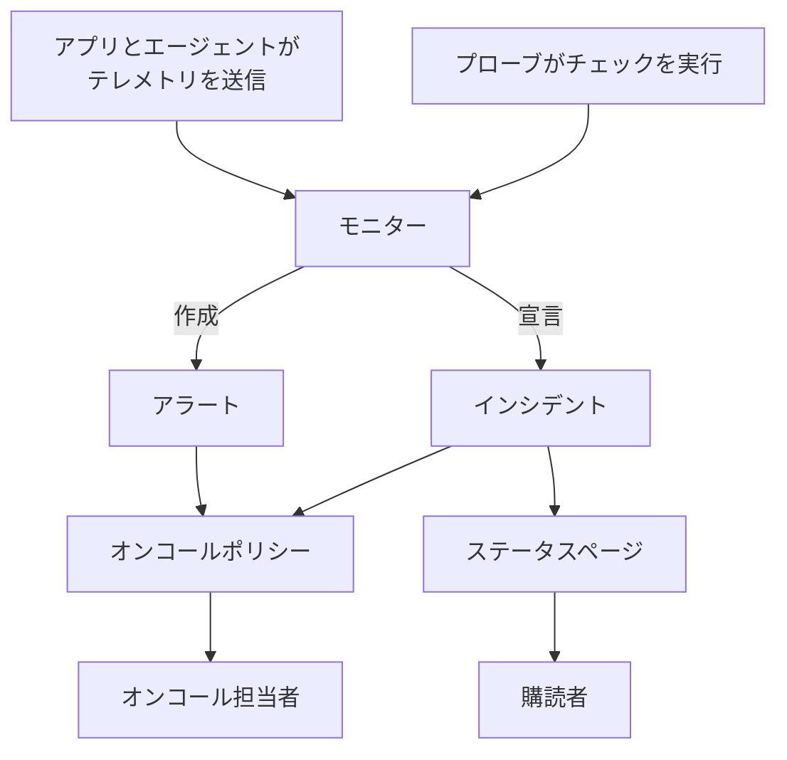

# 基本概念

OneUptime には多くの製品がありますが、どれもいくつかの考え方の上に成り立っています。プロジェクト、モニター、インシデントとアラート、オンコール、ステータスページ、テレメトリです。このページでは、それぞれを数文で説明し、どうつながるかを示し、詳しく扱うページへ案内します。一度読めば、ドキュメントのほかのページがずっと読みやすくなります。

:::cards
- [プロジェクトと人](#プロジェクトと人): すべてが置かれる場所と、誰が何をできるか。
- [モニターとプローブ](#モニターとプローブ): OneUptime が異常に気づく仕組み。
- [インシデントとアラート](#インシデントとアラート): チームが対応の拠り所にする記録。
- [オンコール](#オンコール): 誰が、どのように呼び出され、次は誰か。
:::

## 各要素のつながり

問題は、OneUptime の中を一方向に流れます。プローブとあなた自身のテレメトリが、モニターに情報を送ります。モニターの条件が、いつ異常とみなすか、そして何を開くか（インシデント、アラート、またはその両方）を決めます。オンコールポリシーがそれについて人を呼び出し、ステータスページがインシデントを顧客に知らせます。

## プロジェクトと人

**プロジェクト** は、すべてを保持します。モニター、インシデント、オンコールポリシー、ステータスページ、テレメトリ、設定です。ほとんどの会社は 1 つで足り、環境や事業部門ごとに 1 つずつ持つ会社もあります。あるプロジェクトで作成したものは、別のプロジェクトからは見えません。

**アカウント** は、プロジェクトとは別のものです。メールアドレスとパスワードが 1 組の 1 つのアカウントで、いくつでもプロジェクトに所属できます。プロジェクトの切り替えは、左上のプロジェクトピッカーで行います。 [アカウント](/docs/introduction/your-account) を参照してください。

人は **チーム** を通じてプロジェクトに所属し、チームの権限がメンバーにできることを決めます。新しいプロジェクトは 3 つのチームから始まります。あなたが入っている Owners、そして Admin と Members です。OneUptime Cloud では、プロジェクトごとにプランがあります。

:::cards
- [ユーザー、チーム、権限](/docs/permissions/index): メンバーを招待し、できることを決めます。
:::

## モニターとプローブ

**モニター** は、あなたが運用しているものを 1 つチェックし、それが動いているかを判断します。ほとんどのモニターは **プローブ** がチェックします。プローブは、ページのリクエスト、API の呼び出し、ホストへの ping、データベースへのクエリといったチェックを、スケジュールに沿って実行するマシンです。OneUptime Cloud は複数のリージョンでプローブを動かし、セルフホストのインストールは独自のプローブを動かします。さらに、ネットワークの内側にカスタムプローブを追加することもできます。ほかのモニターは、代わりにあなたが送るものを読み取ります。アプリからのテレメトリや、サーバー、Kubernetes クラスター、その他のインフラストラクチャ上のエージェントが報告するデータです。

モニターの **条件** は、各結果が何を意味するかを決めます。条件は順番にチェックされ、最初に一致したものが、モニターの状態を変えたり、インシデントを宣言したり、アラートを作成したり、その 3 つすべてを行ったりできます。新しいプロジェクトには、 **稼働中**、 **機能低下**、 **オフライン** の 3 つのモニターの状態があります。

:::cards
- [モニターの作成](/docs/monitor/create-monitor): 種類を選び、何をどのくらいの頻度でチェックするかを指定します。
- [カスタム プローブ](/docs/probe/custom-probe): 自社ネットワークからしか届かないものをチェックします。
:::

## インシデントとアラート

どちらも問題を記録し、どちらもオンコール担当者を呼び出せます。違いは、その問題が誰に影響するかです。

| | インシデント | アラート |
| --- | --- | --- |
| **何か** | 障害や速度低下など、ユーザーに影響する問題 | ユーザーに影響が出る前に、チームが調べるべき問題 |
| **ステータスページでは** | 表示でき、購読者に知らせる | 表示されない |
| **最初の状態** | **原因特定**、 **確認済み**、 **解決済み** | **原因特定**、 **確認済み**、 **解決済み** |
| **最初の重大度** | Critical Incident、Major Incident、Minor Incident | **高**、 **低** |

確認すると、誰かが対応中であることが伝わり、オンコールポリシーは次のレベルを呼び出さなくなります。解決すると、それは閉じられます。独自の状態と重大度を追加でき、アラートを、それが一部だったと判明したインシデントにリンクできます。

**エピソード** は、関連するインシデント、または関連するアラートをまとめ、チームが 1 つのものとして対応できるようにします。どれをまとめるかは、グループ化ルールが決めます。

:::cards
- [インシデント 概要](/docs/incidents/index): インシデントがどのように宣言、対応、解決されるか。
- [リンクされたアラート](/docs/incidents/linked-alerts): 障害が発生させたアラートを、そのインシデントに結び付けます。
:::

## オンコール

**オンコールポリシー** は、インシデントやアラートについて誰を呼び出すか、そして誰も応答しなければ次は誰かを決めます。その **エスカレーションルール** がレベルです。各レベルは担当者を呼び出し、誰かが確認するのを待ってから次のレベルを呼び出します。レベルは、人、チーム、または **オンコールスケジュール** を呼び出せます。オンコールスケジュールは、いつ誰がオンコールかを把握しているローテーションです。

それぞれの人への連絡方法は、本人が決めます。各自が **ユーザー設定** で、OneUptime から連絡を受ける方法（メール、SMS、電話、プッシュ通知、Slack、Microsoft Teams など）と、呼び出されたときにどれを使うかを管理します。

:::cards
- [エスカレーションルール](/docs/on-call/escalation-rules): 誰かが応答するまで、レベルごとに人を呼び出します。
- [オンコールスケジュール](/docs/on-call/schedules): ローテーション、レイヤー、引き継ぎ。
:::

## ステータスページとメンテナンス

**ステータスページ** は、サービスが動いているかを顧客に示します。表示するモニターを選び、顧客にわかる名前を付けます。それらのモニターのいずれかでインシデントが進行している間、ページはそれを表示し、その **購読者** にはメール、SMS、Slack、Microsoft Teams、Webhook で知らせが届きます。ステータスページは、公開にも、招き入れた人だけの非公開にもできます。

**定期メンテナンス** は、計画された作業を事前に告知します。イベントは **予定**、 **進行中**、 **終了**、 **完了** と進み、イベントを表示するステータスページが、訪問者と購読者にそれを知らせます。

:::cards
- [ステータス ページ 概要](/docs/status-pages/index): ステータスページを作成し、表示する内容を決めます。
- [購読者とお知らせ](/docs/status-pages/subscribers): 誰に、いつ知らせるか。
:::

## テレメトリ

**テレメトリ** は、あなたのシステムが OneUptime に送るものです。ログ、メトリクス、トレース、例外、プロファイルがあります。アプリは OpenTelemetry で送信し、OneUptime のエージェントはホスト、Kubernetes クラスター、Docker ホスト、その他のインフラストラクチャから送信します。送信元はそれぞれ **取り込みキー** を使います。取り込みキーは **プロジェクト設定 → テレメトリと APM → 取り込みキー** で作成します。テレメトリは、検索したり、ダッシュボードでグラフにしたり、テレメトリモニターで見守ったりできます。テレメトリモニターは、ほかのモニターと同じようにインシデントやアラートを発生させます。

:::cards
- [OpenTelemetry](/docs/telemetry/open-telemetry): アプリからログ、メトリクス、トレースを送信します。
- [ログ モニター](/docs/monitor/logs-monitor): ログに特定のパターンが現れたときに知らせを受けます。
:::

## 自動化と AI

- **ワークフロー** は、何かが起きたときにアクションを実行します。たとえば、インシデントが宣言されたときに Slack に投稿します。
- **Runbook** は、対応手順を、チームが手動または自動で実行できるステップに変えます。
- **OneUptime AI** は、新しいインシデントとアラートを調査し、見つけたことをそのタイムラインに投稿します。 **AI に質問** は、プロジェクトについての質問に答えます。新しいプロジェクトは AI がオンの状態で始まり、 **プロジェクト設定 → AI → AI 機能** の **AI を有効化** スイッチで、そのすべてをオフにできます。

:::cards
- [ワークフロー 概要](/docs/workflows/index): トリガーとコンポーネントでアクションを自動化します。
- [AI SRE](/docs/ai/ai-sre): OneUptime AI がインシデントとアラートを調査する仕組み。
:::

## ラベルと所有者

**ラベル** は、モニター、インシデント、ステータスページ、その他ほとんどのリソースに付けるタグで、それらを絞り込んだりグループ化したりするのに使います。チームの権限を、特定のラベルが付いたリソースに限定することもできます。 **所有者** は、1 つのリソースに責任を持つ人とチームで、そのリソースに何かが起きると知らせを受けます。ラベルルールと所有者ルールは、新しいリソースに自動でラベルと所有者を追加します。

:::cards
- [ラベルルールと所有者ルール](/docs/configuration/label-and-owner-rules): 新しいリソースに自動でラベルを付け、所有者を割り当てます。
:::

## 次のステップ

:::cards
- [クイックスタート](/docs/introduction/quickstart): これらの考え方を、15 分で実践します。
- [ホーム画面とショートカット](/docs/introduction/home): ダッシュボードで、すべての製品を見つけます。
- [モニターの作成](/docs/monitor/create-monitor): 最初のモニターを、項目ごとに。
- [インシデント 概要](/docs/incidents/index): モニターがインシデントを宣言した後に起きること。
:::
